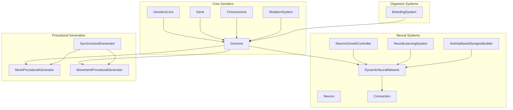
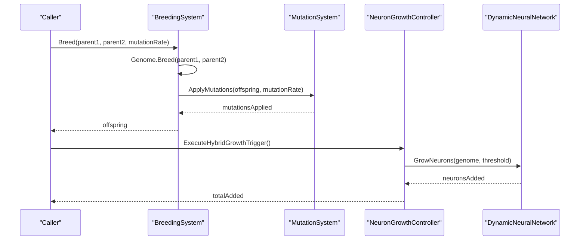
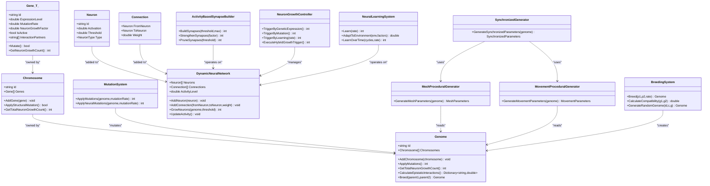

# API Reference

<cite>
**Referenced Files in This Document**
- [GeneticsCore.cs](file://GeneticsGame/Core/GeneticsCore.cs)
- [Chromosome.cs](file://GeneticsGame/Core/Chromosome.cs)
- [Gene.cs](file://GeneticsGame/Core/Gene.cs)
- [Genome.cs](file://GeneticsGame/Core/Genome.cs)
- [MutationSystem.cs](file://GeneticsGame/Core/MutationSystem.cs)
- [Neuron.cs](file://GeneticsGame/Systems/Neuron.cs)
- [DynamicNeuralNetwork.cs](file://GeneticsGame/Systems/DynamicNeuralNetwork.cs)
- [NeuralLearningSystem.cs](file://GeneticsGame/Systems/NeuralLearningSystem.cs)
- [NeuronGrowthController.cs](file://GeneticsGame/Systems/NeuronGrowthController.cs)
- [ActivityBasedSynapseBuilder.cs](file://GeneticsGame/Systems/ActivityBasedSynapseBuilder.cs)
- [Connection.cs](file://GeneticsGame/Systems/Connection.cs)
- [BreedingSystem.cs](file://GeneticsGame/Systems/BreedingSystem.cs)
- [MeshProceduralGenerator.cs](file://GeneticsGame/Procedural/Mesh/MeshProceduralGenerator.cs)
- [MovementProceduralGenerator.cs](file://GeneticsGame/Procedural/Movement/MovementProceduralGenerator.cs)
- [SynchronizedGenerator.cs](file://GeneticsGame/Procedural/SynchronizedGenerator.cs)
- [Program.cs](file://GeneticsGame/Program.cs)
</cite>

## Table of Contents
1. [Introduction](#introduction)
2. [Project Structure](#project-structure)
3. [Core Components](#core-components)
4. [Architecture Overview](#architecture-overview)
5. [Detailed Component Analysis](#detailed-component-analysis)
6. [Dependency Analysis](#dependency-analysis)
7. [Performance Considerations](#performance-considerations)
8. [Troubleshooting Guide](#troubleshooting-guide)
9. [Conclusion](#conclusion)
10. [Appendices](#appendices)

## Introduction
This API reference documents the public interfaces of the 3D Genetics system across four functional areas: Genetics, Neural Systems, Procedural Generation, and Organism Systems. It covers classes, methods, properties, parameters, return values, exceptions, threading, performance, and memory characteristics. Cross-references connect related components to help navigate the system.

## Project Structure
The solution is organized by functional domains:
- Core genetics: Gene, Chromosome, Genome, MutationSystem, and global configuration
- Neural systems: Neuron, DynamicNeuralNetwork, ActivityBasedSynapseBuilder, NeuralLearningSystem, NeuronGrowthController, and Connection
- Procedural generation: MeshProceduralGenerator, MovementProceduralGenerator, SynchronizedGenerator, and parameter/value types
- Organism Systems: BreedingSystem

**Diagram sources**
- [GeneticsCore.cs:9-20](file://GeneticsGame/Core/GeneticsCore.cs#L9-L20)
- [Gene.cs:9-93](file://GeneticsGame/Core/Gene.cs#L9-L93)
- [Chromosome.cs:9-146](file://GeneticsGame/Core/Chromosome.cs#L9-L146)
- [Genome.cs:9-190](file://GeneticsGame/Core/Genome.cs#L9-L190)
- [MutationSystem.cs:9-137](file://GeneticsGame/Core/MutationSystem.cs#L9-L137)
- [Neuron.cs:7-70](file://GeneticsGame/Systems/Neuron.cs#L7-L70)
- [DynamicNeuralNetwork.cs:9-116](file://GeneticsGame/Systems/DynamicNeuralNetwork.cs#L9-L116)
- [ActivityBasedSynapseBuilder.cs:9-112](file://GeneticsGame/Systems/ActivityBasedSynapseBuilder.cs#L9-L112)
- [NeuralLearningSystem.cs:9-122](file://GeneticsGame/Systems/NeuralLearningSystem.cs#L9-L122)
- [NeuronGrowthController.cs:9-122](file://GeneticsGame/Systems/NeuronGrowthController.cs#L9-L122)
- [Connection.cs:6-35](file://GeneticsGame/Systems/Connection.cs#L6-L35)
- [MeshProceduralGenerator.cs:9-365](file://GeneticsGame/Procedural/Mesh/MeshProceduralGenerator.cs#L9-L365)
- [MovementProceduralGenerator.cs:9-389](file://GeneticsGame/Procedural/Movement/MovementProceduralGenerator.cs#L9-L389)
- [SynchronizedGenerator.cs:9-141](file://GeneticsGame/Procedural/SynchronizedGenerator.cs#L9-L141)
- [BreedingSystem.cs:9-182](file://GeneticsGame/Systems/BreedingSystem.cs#L9-L182)

**Section sources**
- [GeneticsCore.cs:9-20](file://GeneticsGame/Core/GeneticsCore.cs#L9-L20)
- [Genome.cs:9-190](file://GeneticsGame/Core/Genome.cs#L9-L190)
- [DynamicNeuralNetwork.cs:9-116](file://GeneticsGame/Systems/DynamicNeuralNetwork.cs#L9-L116)
- [MeshProceduralGenerator.cs:9-365](file://GeneticsGame/Procedural/Mesh/MeshProceduralGenerator.cs#L9-L365)
- [MovementProceduralGenerator.cs:9-389](file://GeneticsGame/Procedural/Movement/MovementProceduralGenerator.cs#L9-L389)
- [SynchronizedGenerator.cs:9-141](file://GeneticsGame/Procedural/SynchronizedGenerator.cs#L9-L141)
- [BreedingSystem.cs:9-182](file://GeneticsGame/Systems/BreedingSystem.cs#L9-L182)

## Core Components
This section documents the foundational genetic constructs and their public APIs.

- GeneticsCore
  - Static nested class Config
    - Properties
      - DefaultMutationRate: constant double
      - MaxNeuronGrowthPerGeneration: constant int
      - NeuralActivityThreshold: constant double
  - Purpose: Provides global constants for genetic and neural behavior.

- Gene<T>
  - Properties
    - Id: string
    - ExpressionLevel: double (0.0 to 1.0)
    - MutationRate: double
    - NeuronGrowthFactor: double
    - IsActive: bool
    - InteractionPartners: List<string>
  - Constructors
    - Gene(id, expressionLevel=0.5, mutationRate=0.001, neuronGrowthFactor=0.0)
  - Methods
    - Mutate(): bool — applies point mutations to expression level, neuron growth factor, and activation state
    - GetNeuronGrowthCount(): int — computes neuron growth potential based on expression and growth factor

- Chromosome
  - Properties
    - Id: string
    - Genes: List<Gene<double>>
  - Constructors
    - Chromosome(id)
  - Methods
    - AddGene(gene): void
    - ApplyStructuralMutation(): bool — randomly selects one of deletion, duplication, inversion, or translocation
    - GetTotalNeuronGrowthCount(): int — sums neuron growth potential across genes

- Genome
  - Properties
    - Id: string
    - Chromosomes: List<Chromosome>
  - Constructors
    - Genome(id)
  - Methods
    - AddChromosome(chromosome): void
    - ApplyMutations(): int — applies point and structural mutations via MutationSystem and Chromosome
    - GetTotalNeuronGrowthCount(): int — sums across chromosomes
    - CalculateEpistaticInteractions(): Dictionary<string,double> — computes interaction strengths across genes and partners
    - Breed(parent1, parent2): static Genome — creates offspring with inheritance and minor variation

- MutationSystem
  - Methods
    - ApplyMutations(genome, mutationRate=0.001): int — orchestrates point, structural, and epigenetic mutations
    - ApplyNeuralMutations(genome, mutationRate=0.01): int — targets neuron-related genes

Behavioral contracts and exceptions
- No explicit exceptions are thrown by these classes; invalid inputs (e.g., out-of-range doubles) are clamped by internal bounds checks.

Thread safety
- Uses Random.Shared for randomness; consider thread-safety implications if shared across threads. Prefer isolated instances per operation or external synchronization.

Memory
- Collections are dynamically resized; expect proportional memory to number of genes/chromosomes.

**Section sources**
- [GeneticsCore.cs:9-20](file://GeneticsGame/Core/GeneticsCore.cs#L9-L20)
- [Gene.cs:9-93](file://GeneticsGame/Core/Gene.cs#L9-L93)
- [Chromosome.cs:9-146](file://GeneticsGame/Core/Chromosome.cs#L9-L146)
- [Genome.cs:9-190](file://GeneticsGame/Core/Genome.cs#L9-L190)
- [MutationSystem.cs:9-137](file://GeneticsGame/Core/MutationSystem.cs#L9-L137)

## Architecture Overview
The system integrates genetics with neural growth and procedural generation. Breeding produces new genomes, MutationSystem evolves them, DynamicNeuralNetwork grows neurons based on genetic triggers, and SynchronizedGenerator ensures mesh/movement parameters remain coherent.

**Diagram sources**
- [BreedingSystem.cs:18-27](file://GeneticsGame/Systems/BreedingSystem.cs#L18-L27)
- [MutationSystem.cs:17-29](file://GeneticsGame/Core/MutationSystem.cs#L17-L29)
- [NeuronGrowthController.cs:107-121](file://GeneticsGame/Systems/NeuronGrowthController.cs#L107-L121)
- [DynamicNeuralNetwork.cs:63-99](file://GeneticsGame/Systems/DynamicNeuralNetwork.cs#L63-L99)

## Detailed Component Analysis

### Genetics Area

#### GeneticsCore
- Nested static class Config
  - DefaultMutationRate: double
  - MaxNeuronGrowthPerGeneration: int
  - NeuralActivityThreshold: double

Usage notes
- Access via GeneticsCore.Config.* for global tuning.

**Section sources**
- [GeneticsCore.cs:14-19](file://GeneticsGame/Core/GeneticsCore.cs#L14-L19)

#### Gene<T>
- Properties
  - Id: string
  - ExpressionLevel: double
  - MutationRate: double
  - NeuronGrowthFactor: double
  - IsActive: bool
  - InteractionPartners: List<string>
- Methods
  - Mutate(): bool — probabilistically adjusts expression level, neuron growth factor, and activation state
  - GetNeuronGrowthCount(): int — rounds computed growth to bounded integer

Validation and behavior
- ExpressionLevel and NeuronGrowthFactor are clamped to valid ranges internally.
- IsActive derived from ExpressionLevel threshold.

**Section sources**
- [Gene.cs:11-79](file://GeneticsGame/Core/Gene.cs#L11-L79)
- [Gene.cs:85-93](file://GeneticsGame/Core/Gene.cs#L85-L93)

#### Chromosome
- Properties
  - Id: string
  - Genes: List<Gene<double>>
- Methods
  - AddGene(gene): void
  - ApplyStructuralMutation(): bool — deletion/duplication/inversion/translocation
  - GetTotalNeuronGrowthCount(): int

Validation and behavior
- Structural mutations guard minimum sizes to avoid empty segments.

**Section sources**
- [Chromosome.cs:14-62](file://GeneticsGame/Core/Chromosome.cs#L14-L62)
- [Chromosome.cs:142-146](file://GeneticsGame/Core/Chromosome.cs#L142-L146)

#### Genome
- Properties
  - Id: string
  - Chromosomes: List<Chromosome>
- Methods
  - AddChromosome(chromosome): void
  - ApplyMutations(): int
  - GetTotalNeuronGrowthCount(): int
  - CalculateEpistaticInteractions(): Dictionary<string,double>
  - Breed(parent1, parent2): static Genome

Validation and behavior
- Breeding randomly selects chromosomes and averages expression with small noise.
- Epistatic interactions combine expression levels and partner genes.

**Section sources**
- [Genome.cs:14-66](file://GeneticsGame/Core/Genome.cs#L14-L66)
- [Genome.cs:81-107](file://GeneticsGame/Core/Genome.cs#L81-L107)
- [Genome.cs:134-190](file://GeneticsGame/Core/Genome.cs#L134-L190)

#### MutationSystem
- Methods
  - ApplyMutations(genome, mutationRate): int
  - ApplyNeuralMutations(genome, mutationRate): int

Validation and behavior
- Point mutations scaled by gene-specific MutationRate.
- Neural mutations only affect neuron-related genes.

**Section sources**
- [MutationSystem.cs:17-137](file://GeneticsGame/Core/MutationSystem.cs#L17-L137)

### Neural Systems Area

#### Neuron
- Properties
  - Id: string
  - Activation: double
  - Threshold: double
  - Type: NeuronType
- Enum NeuronType
  - General, Mutation, Learning, Movement, Visual

Notes
- Random initialization for Activation and Threshold.

**Section sources**
- [Neuron.cs:12-39](file://GeneticsGame/Systems/Neuron.cs#L12-L39)
- [Neuron.cs:44-70](file://GeneticsGame/Systems/Neuron.cs#L44-L70)

#### DynamicNeuralNetwork
- Properties
  - Neurons: List<Neuron>
  - Connections: List<Connection>
  - ActivityLevel: double
- Methods
  - AddNeuron(neuron): void
  - AddConnection(fromNeuron, toNeuron, weight=1.0): void
  - GrowNeurons(genome, activityThreshold=0.5): int
  - UpdateActivity(): void

Validation and behavior
- Growth capped by GeneticsCore.Config.MaxNeuronGrowthPerGeneration.
- Neuron types inferred from epistatic interactions.

**Section sources**
- [DynamicNeuralNetwork.cs:14-99](file://GeneticsGame/Systems/DynamicNeuralNetwork.cs#L14-L99)
- [DynamicNeuralNetwork.cs:104-116](file://GeneticsGame/Systems/DynamicNeuralNetwork.cs#L104-L116)

#### ActivityBasedSynapseBuilder
- Methods
  - BuildSynapses(activityThreshold=0.5, maxConnections=10): int
  - StrengthenSynapses(strengthFactor=0.1): int
  - PruneSynapses(pruneThreshold=0.1): int

Validation and behavior
- Avoids duplicate connections.
- Weights are clamped to [0.0, 1.0].

**Section sources**
- [ActivityBasedSynapseBuilder.cs:31-112](file://GeneticsGame/Systems/ActivityBasedSynapseBuilder.cs#L31-L112)

#### NeuralLearningSystem
- Properties
  - NeuralNetwork: DynamicNeuralNetwork
  - Genome: Genome
- Methods
  - Learn(learningRate=0.1): int
  - AdaptToEnvironment(environmentFactors, taskRequirements): double
  - LearnOverTime(cycles, learningRate): int

Validation and behavior
- Environment/task adaptation scores normalized to [0.0, 1.0].
- Decreasing learning rate over time.

**Section sources**
- [NeuralLearningSystem.cs:14-122](file://GeneticsGame/Systems/NeuralLearningSystem.cs#L14-L122)

#### NeuronGrowthController
- Methods
  - TriggerByGeneticExpression(): int
  - TriggerByMutation(): int
  - TriggerByLearning(learningRate=0.1): int
  - ExecuteHybridGrowthTrigger(): int

Validation and behavior
- Priority order: genetic → mutation → learning.
- Learning-triggered growth lowers threshold.

**Section sources**
- [NeuronGrowthController.cs:36-121](file://GeneticsGame/Systems/NeuronGrowthController.cs#L36-L121)

#### Connection
- Properties
  - FromNeuron: Neuron
  - ToNeuron: Neuron
  - Weight: double
- Constructor
  - Connection(fromNeuron, toNeuron, weight=1.0)

**Section sources**
- [Connection.cs:11-35](file://GeneticsGame/Systems/Connection.cs#L11-L35)

### Procedural Generation Area

#### MeshProceduralGenerator
- Methods
  - GenerateMeshParameters(genome): MeshParameters
- Private helpers compute BaseScale, MeshComplexity, VertexCount, Colors, Patterns, TextureDetail, LimbCount, LimbLengths, BodySegments

Validation and behavior
- Derived quantities constrained to reasonable ranges.

**Section sources**
- [MeshProceduralGenerator.cs:16-365](file://GeneticsGame/Procedural/Mesh/MeshProceduralGenerator.cs#L16-L365)

- MeshParameters
  - Properties: BaseScale, MeshComplexity, VertexCount, Colors, Patterns, TextureDetail, LimbCount, LimbLengths, BodySegments

- Color
  - Properties: R, G, B
  - Constructor(Color(r,g,b))

**Section sources**
- [MeshProceduralGenerator.cs:285-365](file://GeneticsGame/Procedural/Mesh/MeshProceduralGenerator.cs#L285-L365)

#### MovementProceduralGenerator
- Methods
  - GenerateMovementParameters(genome): MovementParameters
- Private helpers compute BaseSpeed, MovementType, GaitComplexity, LimbMovementPatterns, BodyMovementPatterns, BalanceSystem, NeuralControlLevel, LearningRate

Validation and behavior
- MovementType determined by dominant gene categories.
- LearningRate scaled by genetic expression.

**Section sources**
- [MovementProceduralGenerator.cs:16-389](file://GeneticsGame/Procedural/Movement/MovementProceduralGenerator.cs#L16-L389)

- MovementParameters
  - Properties: BaseSpeed, MovementType, GaitComplexity, LimbMovementPatterns, BodyMovementPatterns, BalanceSystem, NeuralControlLevel, LearningRate

- Enums
  - MovementType: Walking, Flying, Swimming, Crawling
  - BalanceSystem: InnerEar, Visual, Proprioceptive

**Section sources**
- [MovementProceduralGenerator.cs:301-389](file://GeneticsGame/Procedural/Movement/MovementProceduralGenerator.cs#L301-L389)

#### SynchronizedGenerator
- Properties
  - MeshGenerator: MeshProceduralGenerator
  - MovementGenerator: MovementProceduralGenerator
- Methods
  - GenerateSynchronizedParameters(genome): SynchronizedParameters
  - SynchronizeParameters(parameters, genome): SynchronizedParameters

Validation and behavior
- Ensures limb counts and body segments match between mesh and movement.
- Adjusts speed and neural control to maintain biological plausibility.

**Section sources**
- [SynchronizedGenerator.cs:35-141](file://GeneticsGame/Procedural/SynchronizedGenerator.cs#L35-L141)

- SynchronizedParameters
  - Properties: MeshParameters, MovementParameters

**Section sources**
- [SynchronizedGenerator.cs:130-141](file://GeneticsGame/Procedural/SynchronizedGenerator.cs#L130-L141)

### Organism Systems Area

#### BreedingSystem
- Methods
  - Breed(parent1, parent2, mutationRate=0.001): Genome
  - CalculateCompatibility(genome1, genome2): double
  - GenerateRandomGenome(genomeId, chromosomeCount=23, genesPerChromosome=10): Genome

Validation and behavior
- Compatibility balances similarity and diversity.
- Random genome initializes diverse gene sets with interaction partners.

**Section sources**
- [BreedingSystem.cs:18-182](file://GeneticsGame/Systems/BreedingSystem.cs#L18-L182)

## Dependency Analysis

**Diagram sources**
- [Gene.cs:9-93](file://GeneticsGame/Core/Gene.cs#L9-L93)
- [Chromosome.cs:9-146](file://GeneticsGame/Core/Chromosome.cs#L9-L146)
- [Genome.cs:9-190](file://GeneticsGame/Core/Genome.cs#L9-L190)
- [MutationSystem.cs:9-137](file://GeneticsGame/Core/MutationSystem.cs#L9-L137)
- [Neuron.cs:7-70](file://GeneticsGame/Systems/Neuron.cs#L7-L70)
- [Connection.cs:6-35](file://GeneticsGame/Systems/Connection.cs#L6-L35)
- [DynamicNeuralNetwork.cs:9-116](file://GeneticsGame/Systems/DynamicNeuralNetwork.cs#L9-L116)
- [ActivityBasedSynapseBuilder.cs:9-112](file://GeneticsGame/Systems/ActivityBasedSynapseBuilder.cs#L9-L112)
- [NeuralLearningSystem.cs:9-122](file://GeneticsGame/Systems/NeuralLearningSystem.cs#L9-L122)
- [NeuronGrowthController.cs:9-122](file://GeneticsGame/Systems/NeuronGrowthController.cs#L9-L122)
- [MeshProceduralGenerator.cs:9-365](file://GeneticsGame/Procedural/Mesh/MeshProceduralGenerator.cs#L9-L365)
- [MovementProceduralGenerator.cs:9-389](file://GeneticsGame/Procedural/Movement/MovementProceduralGenerator.cs#L9-L389)
- [SynchronizedGenerator.cs:9-141](file://GeneticsGame/Procedural/SynchronizedGenerator.cs#L9-L141)
- [BreedingSystem.cs:9-182](file://GeneticsGame/Systems/BreedingSystem.cs#L9-L182)

## Performance Considerations
- Complexity
  - Genome.ApplyMutations iterates all genes and chromosomes; O(G*C) where G is total genes, C is chromosomes.
  - CalculateEpistaticInteractions and FindGeneById are O(G*C) with linear scans.
  - DynamicNeuralNetwork.GrowNeurons growth bounded by GeneticsCore.Config.MaxNeuronGrowthPerGeneration.
- Memory
  - Lists expand as genes/chromosomes and neurons/connections are added; pre-sizing not used.
- Threading
  - Random.Shared is used; if multiple threads mutate or generate concurrently, consider isolating RNG or synchronizing access.

[No sources needed since this section provides general guidance]

## Troubleshooting Guide
Common issues and resolutions
- Empty or minimal growth
  - Ensure sufficient neuron growth factor and expression level in genes.
  - Verify NeuralActivityThreshold and activity levels in DynamicNeuralNetwork.
- Inconsistent mesh/movement
  - Use SynchronizedGenerator to reconcile limb/body counts and speed scaling.
- Breeding compatibility low
  - Balance mutationRate and diversity; moderate similarity with high diversity yields optimal compatibility.

**Section sources**
- [DynamicNeuralNetwork.cs:63-99](file://GeneticsGame/Systems/DynamicNeuralNetwork.cs#L63-L99)
- [SynchronizedGenerator.cs:57-124](file://GeneticsGame/Procedural/SynchronizedGenerator.cs#L57-L124)
- [BreedingSystem.cs:35-45](file://GeneticsGame/Systems/BreedingSystem.cs#L35-L45)

## Conclusion
The 3D Genetics system exposes a cohesive set of public APIs spanning genetics, neural dynamics, and procedural generation. By leveraging Genome, MutationSystem, DynamicNeuralNetwork, and SynchronizedGenerator, applications can evolve, grow, and visualize complex organisms. Adhering to the documented contracts and constraints ensures predictable behavior and performance.

[No sources needed since this section summarizes without analyzing specific files]

## Appendices

### API Usage Examples (by reference)
- Breeding and mutation
  - [BreedingSystem.Breed:18-27](file://GeneticsGame/Systems/BreedingSystem.cs#L18-L27)
  - [MutationSystem.ApplyMutations:17-29](file://GeneticsGame/Core/MutationSystem.cs#L17-L29)
- Neural growth
  - [NeuronGrowthController.ExecuteHybridGrowthTrigger:107-121](file://GeneticsGame/Systems/NeuronGrowthController.cs#L107-L121)
  - [DynamicNeuralNetwork.GrowNeurons:63-99](file://GeneticsGame/Systems/DynamicNeuralNetwork.cs#L63-L99)
- Procedural generation
  - [SynchronizedGenerator.GenerateSynchronizedParameters:35-49](file://GeneticsGame/Procedural/SynchronizedGenerator.cs#L35-L49)
  - [MeshProceduralGenerator.GenerateMeshParameters:16-36](file://GeneticsGame/Procedural/Mesh/MeshProceduralGenerator.cs#L16-L36)
  - [MovementProceduralGenerator.GenerateMovementParameters:16-35](file://GeneticsGame/Procedural/Movement/MovementProceduralGenerator.cs#L16-L35)

### Thread Safety and Concurrency Notes
- Randomness: Uses Random.Shared; if shared across threads, isolate per-operation or synchronize.
- Collections: Lists are modified by Add/AddNeuron/AddConnection; avoid concurrent reads/writes without external locking.

[No sources needed since this section provides general guidance]

### Migration and Backward Compatibility
- No explicit breaking changes observed in the referenced files.
- When extending, prefer additive changes (new properties/methods) to preserve backward compatibility.

[No sources needed since this section provides general guidance]