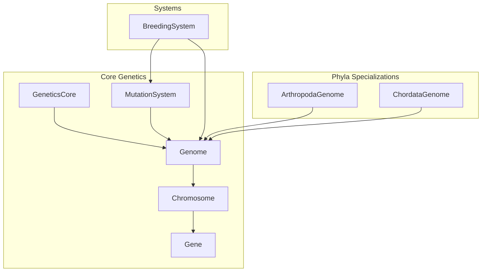
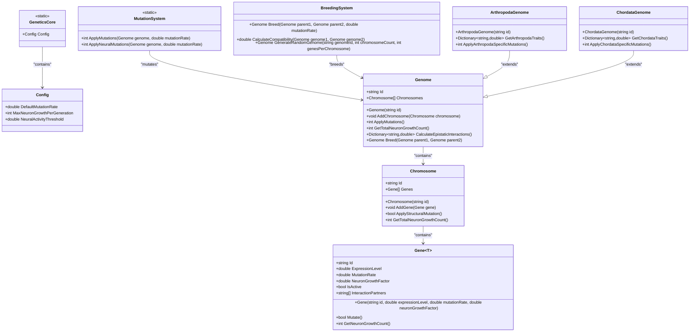
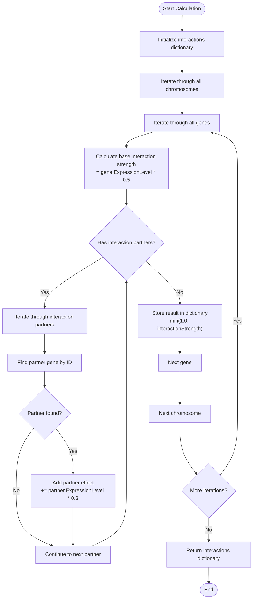
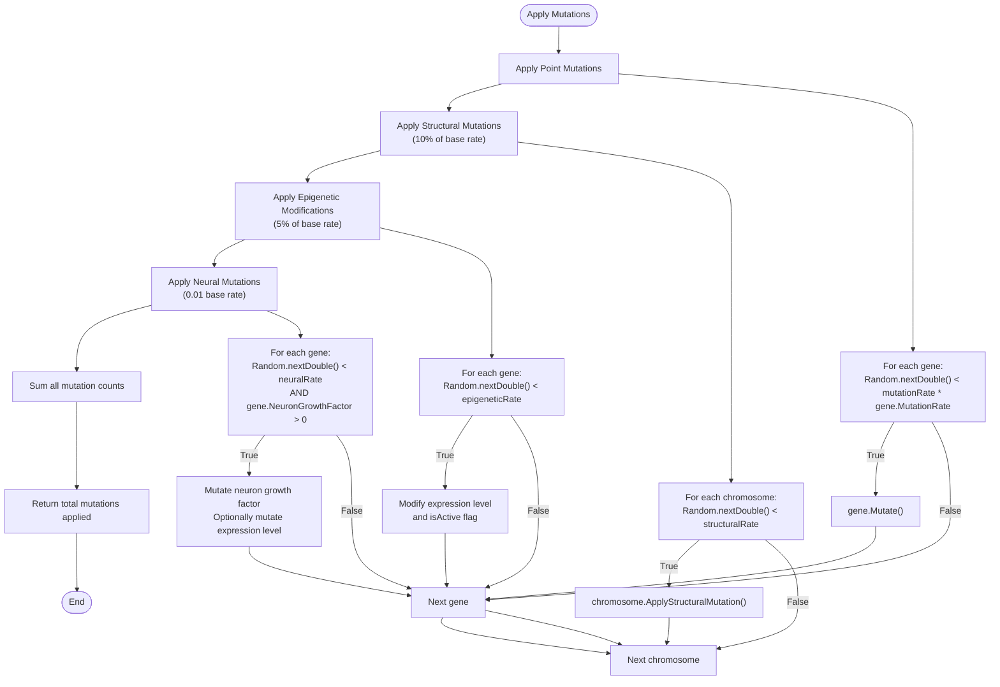
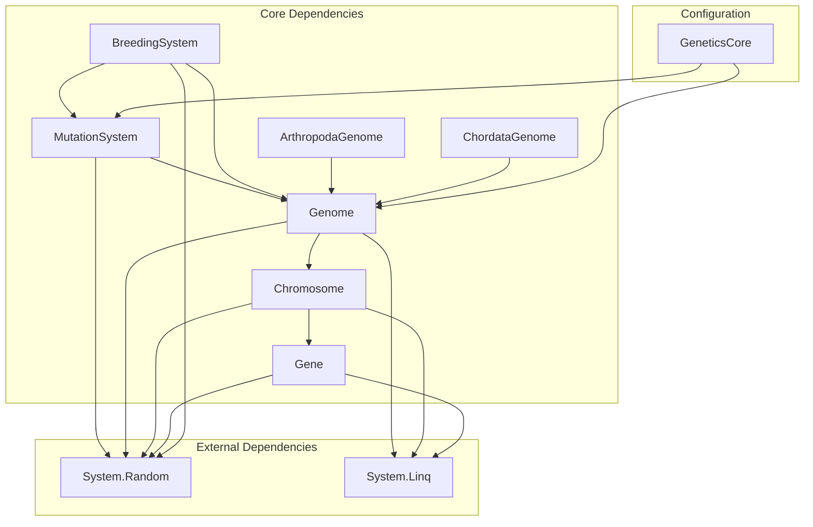

# Core Genetics API

<cite>
**Referenced Files in This Document**
- [GeneticsCore.cs](file://GeneticsGame/Core/GeneticsCore.cs)
- [Genome.cs](file://GeneticsGame/Core/Genome.cs)
- [Chromosome.cs](file://GeneticsGame/Core/Chromosome.cs)
- [Gene.cs](file://GeneticsGame/Core/Gene.cs)
- [MutationSystem.cs](file://GeneticsGame/Core/MutationSystem.cs)
- [BreedingSystem.cs](file://GeneticsGame/Systems/BreedingSystem.cs)
- [ArthropodaGenome.cs](file://GeneticsGame/Phyla/Arthropoda/ArthropodaGenome.cs)
- [ChordataGenome.cs](file://GeneticsGame/Phyla/Chordata/ChordataGenome.cs)
- [Program.cs](file://GeneticsGame/Program.cs)
</cite>

## Table of Contents
1. [Introduction](#introduction)
2. [Project Structure](#project-structure)
3. [Core Components](#core-components)
4. [Architecture Overview](#architecture-overview)
5. [Detailed Component Analysis](#detailed-component-analysis)
6. [Dependency Analysis](#dependency-analysis)
7. [Performance Considerations](#performance-considerations)
8. [Troubleshooting Guide](#troubleshooting-guide)
9. [Practical Examples](#practical-examples)
10. [Conclusion](#conclusion)

## Introduction
This document provides comprehensive API documentation for the core genetics system components in the 3D Genetics Game. It covers the GeneticsCore configuration class, the Genome class with its chromosome management and genetic inheritance patterns, the Chromosome class with structural mutations, the Gene class with expression regulation and functional impact calculations, and the MutationSystem class with mutation application methods. Practical examples demonstrate genome creation, mutation application, and genetic inheritance simulation.

## Project Structure
The genetics system is organized into core genetic components and specialized implementations:



**Diagram sources**
- [GeneticsCore.cs:1-21](file://GeneticsGame/Core/GeneticsCore.cs#L1-L21)
- [Genome.cs:1-190](file://GeneticsGame/Core/Genome.cs#L1-L190)
- [Chromosome.cs:1-146](file://GeneticsGame/Core/Chromosome.cs#L1-L146)
- [Gene.cs:1-93](file://GeneticsGame/Core/Gene.cs#L1-L93)
- [MutationSystem.cs:1-137](file://GeneticsGame/Core/MutationSystem.cs#L1-L137)
- [BreedingSystem.cs:1-182](file://GeneticsGame/Systems/BreedingSystem.cs#L1-L182)
- [ArthropodaGenome.cs:1-134](file://GeneticsGame/Phyla/Arthropoda/ArthropodaGenome.cs#L1-L134)
- [ChordataGenome.cs:1-134](file://GeneticsGame/Phyla/Chordata/ChordataGenome.cs#L1-L134)

**Section sources**
- [GeneticsGame.csproj:1-14](file://GeneticsGame/GeneticsGame.csproj#L1-L14)

## Core Components

### GeneticsCore Configuration
The GeneticsCore class provides global configuration constants for the genetic system:

**Constants:**
- `DefaultMutationRate`: Base mutation rate (0.001)
- `MaxNeuronGrowthPerGeneration`: Maximum neuron growth per generation (100)
- `NeuralActivityThreshold`: Neural activity threshold for activation (0.7)

These constants serve as system-wide defaults for mutation rates, neural growth limits, and activity thresholds.

**Section sources**
- [GeneticsCore.cs:14-19](file://GeneticsGame/Core/GeneticsCore.cs#L14-L19)

### Genome Class
The Genome class represents the complete genetic blueprint of a creature:

**Properties:**
- `Id`: Unique identifier for the genome
- `Chromosomes`: List of chromosomes containing genes

**Constructor:**
- `Genome(string id)`: Creates a new genome with empty chromosome list

**Methods:**
- `AddChromosome(Chromosome chromosome)`: Adds a chromosome to the genome
- `ApplyMutations()`: Applies mutations to all genes and chromosomes
- `GetTotalNeuronGrowthCount()`: Calculates total neuron growth potential
- `CalculateEpistaticInteractions()`: Computes gene interaction strengths
- `Breed(Genome parent1, Genome parent2)`: Creates offspring using Mendelian inheritance

**Section sources**
- [Genome.cs:9-190](file://GeneticsGame/Core/Genome.cs#L9-L190)

### Chromosome Class
The Chromosome class manages collections of genes with structural mutation support:

**Properties:**
- `Id`: Unique identifier for the chromosome
- `Genes`: List of genes contained in the chromosome

**Constructor:**
- `Chromosome(string id)`: Creates a new chromosome with empty gene list

**Methods:**
- `AddGene(Gene<double> gene)`: Adds a gene to the chromosome
- `ApplyStructuralMutation()`: Applies random structural mutation
- `GetTotalNeuronGrowthCount()`: Calculates neuron growth from active genes

**Structural Mutation Types:**
- Deletion: Removes random gene segments
- Duplication: Duplicates random gene segments
- Inversion: Reverses gene order in segments
- Translocation: Moves gene segments to new positions

**Section sources**
- [Chromosome.cs:9-146](file://GeneticsGame/Core/Chromosome.cs#L9-L146)

### Gene Class
The Gene class represents individual genetic units with expression regulation:

**Generic Type:** `Gene<T>` where T represents the data type (e.g., double for expression level)

**Properties:**
- `Id`: Unique identifier for the gene
- `ExpressionLevel`: Current expression level (0.0 to 1.0)
- `MutationRate`: Base mutation rate for the gene
- `NeuronGrowthFactor`: Controls neuron addition influence
- `IsActive`: Whether the gene is currently active/expressed
- `InteractionPartners`: List of genes this gene interacts with

**Constructor:**
- `Gene(string id, double expressionLevel = 0.5, double mutationRate = 0.001, double neuronGrowthFactor = 0.0)`

**Methods:**
- `Mutate()`: Applies point mutations to gene properties
- `GetNeuronGrowthCount()`: Calculates neuron growth based on expression

**Section sources**
- [Gene.cs:8-93](file://GeneticsGame/Core/Gene.cs#L8-L93)

### MutationSystem Class
The MutationSystem provides comprehensive mutation application capabilities:

**Static Methods:**
- `ApplyMutations(Genome genome, double mutationRate = 0.001)`: Main mutation application method
- `ApplyNeuralMutations(Genome genome, double mutationRate = 0.01)`: Neural-specific mutations

**Private Methods:**
- `ApplyPointMutations(Genome genome, double mutationRate)`: Individual gene mutations
- `ApplyStructuralMutations(Genome genome, double mutationRate)`: Chromosome structural mutations
- `ApplyEpigeneticModifications(Genome genome, double mutationRate)`: Expression-level modifications

**Mutation Categories:**
- Point mutations: Single gene property changes
- Structural mutations: Chromosome rearrangements
- Epigenetic modifications: Expression-level changes without DNA sequence alteration
- Neural mutations: Targeted neuron growth parameter modifications

**Section sources**
- [MutationSystem.cs:9-137](file://GeneticsGame/Core/MutationSystem.cs#L9-L137)

## Architecture Overview



**Diagram sources**
- [GeneticsCore.cs:9-19](file://GeneticsGame/Core/GeneticsCore.cs#L9-L19)
- [Genome.cs:9-190](file://GeneticsGame/Core/Genome.cs#L9-L190)
- [Chromosome.cs:9-146](file://GeneticsGame/Core/Chromosome.cs#L9-L146)
- [Gene.cs:8-93](file://GeneticsGame/Core/Gene.cs#L8-L93)
- [MutationSystem.cs:9-137](file://GeneticsGame/Core/MutationSystem.cs#L9-L137)
- [BreedingSystem.cs:9-182](file://GeneticsGame/Systems/BreedingSystem.cs#L9-L182)
- [ArthropodaGenome.cs:9-134](file://GeneticsGame/Phyla/Arthropoda/ArthropodaGenome.cs#L9-L134)
- [ChordataGenome.cs:9-134](file://GeneticsGame/Phyla/Chordata/ChordataGenome.cs#L9-L134)

## Detailed Component Analysis

### Genetic Inheritance Pattern
The system implements a multi-gene inheritance model with epistatic interactions:

```mermaid
sequenceDiagram
participant BS as BreedingSystem
participant G1 as Genome Parent1
participant G2 as Genome Parent2
participant Off as Offspring Genome
BS->>BS : Validate parents
BS->>G1 : Access chromosomes
BS->>G2 : Access chromosomes
BS->>Off : Create offspring genome
loop For each chromosome position
BS->>BS : Random selection (50% chance)
alt Both parents have chromosome
BS->>Off : Copy chromosome from selected parent
else Only parent1 has chromosome
BS->>Off : Copy chromosome from parent1
else Only parent2 has chromosome
BS->>Off : Copy chromosome from parent2
end
loop For each gene in chromosome
BS->>Off : Create new gene with inherited properties
BS->>Off : Inherit interaction partners
end
end
BS->>Off : Return offspring genome
```

**Diagram sources**
- [Genome.cs:127-189](file://GeneticsGame/Core/Genome.cs#L127-L189)
- [BreedingSystem.cs:17-27](file://GeneticsGame/Systems/BreedingSystem.cs#L17-L27)

### Epistatic Interaction Calculation
The epistatic interaction system calculates gene interaction strengths based on expression levels and partner genes:



**Diagram sources**
- [Genome.cs:77-107](file://GeneticsGame/Core/Genome.cs#L77-L107)

### Mutation Application Workflow
The MutationSystem applies multiple types of mutations with different rates and effects:



**Diagram sources**
- [MutationSystem.cs:11-137](file://GeneticsGame/Core/MutationSystem.cs#L11-L137)

**Section sources**
- [MutationSystem.cs:17-136](file://GeneticsGame/Core/MutationSystem.cs#L17-L136)

### Specialized Genomes
The system includes phyla-specific genome implementations:

**ArthropodaGenome Features:**
- Exoskeleton development genes (thickness, hardness, molting cycle)
- Segmentation genes (segment count, size variation, joint complexity)
- Limb development genes (limb count, joint count, sensory appendages)
- Neural development genes with high neuron growth factors
- Metabolic genes (rate, oxygen efficiency, temperature tolerance)

**ChordataGenome Features:**
- Spinal development genes (length, flexibility, vertebra count)
- Neural development genes (neuron count, synapse density, brain size)
- Limb development genes (limb count, length, joint complexity)
- Sensory system genes (vision acuity, hearing range, balance system)
- Metabolic genes (rate, oxygen efficiency, temperature regulation)

**Section sources**
- [ArthropodaGenome.cs:9-134](file://GeneticsGame/Phyla/Arthropoda/ArthropodaGenome.cs#L9-L134)
- [ChordataGenome.cs:9-134](file://GeneticsGame/Phyla/Chordata/ChordataGenome.cs#L9-L134)

## Dependency Analysis



**Diagram sources**
- [GeneticsCore.cs:1-21](file://GeneticsGame/Core/GeneticsCore.cs#L1-L21)
- [Genome.cs:1-190](file://GeneticsGame/Core/Genome.cs#L1-L190)
- [Chromosome.cs:1-146](file://GeneticsGame/Core/Chromosome.cs#L1-L146)
- [Gene.cs:1-93](file://GeneticsGame/Core/Gene.cs#L1-L93)
- [MutationSystem.cs:1-137](file://GeneticsGame/Core/MutationSystem.cs#L1-L137)
- [BreedingSystem.cs:1-182](file://GeneticsGame/Systems/BreedingSystem.cs#L1-L182)

**Section sources**
- [GeneticsCore.cs:1-21](file://GeneticsGame/Core/GeneticsCore.cs#L1-L21)
- [MutationSystem.cs:1-137](file://GeneticsGame/Core/MutationSystem.cs#L1-L137)

## Performance Considerations
- **Mutation Complexity**: Mutation application scales linearly with the number of genes (O(n)) where n is the total number of genes across all chromosomes
- **Epistatic Calculations**: Interaction calculations scale with the product of genes and their interaction partners (O(m*k)) where m is genes and k is average interaction partners
- **Memory Usage**: Each gene maintains interaction partner lists, potentially increasing memory usage for highly connected gene networks
- **Structural Mutations**: These operations involve list manipulations with O(k) complexity where k is the segment length being modified
- **Optimization Opportunities**: Consider caching interaction partner lookups and using more efficient data structures for large gene networks

## Troubleshooting Guide

**Common Issues and Solutions:**

1. **Mutation Rate Not Working**
   - Verify `GeneticsCore.Config.DefaultMutationRate` constant
   - Check that `MutationSystem.ApplyMutations()` is being called with appropriate parameters
   - Ensure gene `MutationRate` properties are properly initialized

2. **Epistatic Interactions Returning Null**
   - Confirm that `InteractionPartners` lists are populated during genome initialization
   - Verify that gene IDs match between interacting genes
   - Check that `FindGeneById()` method can locate all referenced genes

3. **Neural Growth Not Occurring**
   - Verify `NeuronGrowthFactor` is greater than zero for neural genes
   - Check that `ExpressionLevel` exceeds the neural activity threshold
   - Ensure `IsActive` flag is true for genes to be considered active

4. **Breeding System Issues**
   - Confirm both parent genomes have compatible chromosome structures
   - Verify `Genome.Breed()` method is called correctly
   - Check that mutation rates are appropriate for desired genetic diversity

**Section sources**
- [GeneticsCore.cs:14-19](file://GeneticsGame/Core/GeneticsCore.cs#L14-L19)
- [MutationSystem.cs:17-29](file://GeneticsGame/Core/MutationSystem.cs#L17-L29)
- [Genome.cs:77-107](file://GeneticsGame/Core/Genome.cs#L77-L107)

## Practical Examples

### Example 1: Creating a Random Genome
```csharp
// Create a breeding system instance
var breedingSystem = new BreedingSystem();

// Generate a random genome with 5 chromosomes and 8 genes each
var genome = breedingSystem.GenerateRandomGenome(
    "test_genome_001", 
    chromosomeCount: 5, 
    genesPerChromosome: 8
);

Console.WriteLine($"Created genome with {genome.Chromosomes.Count} chromosomes");
```

**Section sources**
- [BreedingSystem.cs:137-181](file://GeneticsGame/Systems/BreedingSystem.cs#L137-L181)
- [Program.cs:16-20](file://GeneticsGame/Program.cs#L16-L20)

### Example 2: Applying Mutations
```csharp
// Apply mutations to the genome
int mutationsApplied = MutationSystem.ApplyMutations(genome, 0.001);

Console.WriteLine($"Applied {mutationsApplied} mutations to the genome");

// Apply neural-specific mutations
int neuralMutations = MutationSystem.ApplyNeuralMutations(genome, 0.01);
Console.WriteLine($"Applied {neuralMutations} neural mutations");
```

**Section sources**
- [MutationSystem.cs:17-29](file://GeneticsGame/Core/MutationSystem.cs#L17-L29)
- [MutationSystem.cs:111-136](file://GeneticsGame/Core/MutationSystem.cs#L111-L136)
- [Program.cs:37-40](file://GeneticsGame/Program.cs#L37-L40)

### Example 3: Simulating Genetic Inheritance
```csharp
// Create two parent genomes
var genome1 = breedingSystem.GenerateRandomGenome("parent1", 5, 8);
var genome2 = breedingSystem.GenerateRandomGenome("parent2", 5, 8);

// Create offspring using breeding system
var offspring = breedingSystem.Breed(genome1, genome2, 0.001);

Console.WriteLine($"Created offspring with {offspring.Chromosomes.Count} chromosomes");

// Calculate compatibility between parents
double compatibility = breedingSystem.CalculateCompatibility(genome1, genome2);
Console.WriteLine($"Parent compatibility: {compatibility:F2}");
```

**Section sources**
- [BreedingSystem.cs:17-27](file://GeneticsGame/Systems/BreedingSystem.cs#L17-L27)
- [BreedingSystem.cs:35-45](file://GeneticsGame/Systems/BreedingSystem.cs#L35-L45)
- [Program.cs:41-48](file://GeneticsGame/Program.cs#L41-L48)

### Example 4: Analyzing Epistatic Interactions
```csharp
// Calculate epistatic interactions
var interactions = genome.CalculateEpistaticInteractions();

Console.WriteLine($"Found {interactions.Count} epistatic interactions");
foreach (var kvp in interactions.Take(5))
{
    Console.WriteLine($"Gene {kvp.Key}: Interaction strength {kvp.Value:F2}");
}
```

**Section sources**
- [Genome.cs:81-107](file://GeneticsGame/Core/Genome.cs#L81-L107)
- [Program.cs:46-49](file://GeneticsGame/Program.cs#L46-L49)

### Example 5: Working with Specialized Genomes
```csharp
// Create phyla-specific genomes
var arthropodaGenome = new ArthropodaGenome("arthropoda_001");
var chordataGenome = new ChordataGenome("chordata_001");

// Get specialized traits
var arthropodaTraits = arthropodaGenome.GetArthropodaTraits();
var chordataTraits = chordataGenome.GetChordataTraits();

Console.WriteLine($"Arthropoda traits: {arthropodaTraits.Count}");
Console.WriteLine($"Chordata traits: {chordataTraits.Count}");

// Apply species-specific mutations
int arthropodaMutations = arthropodaGenome.ApplyArthropodaSpecificMutations();
int chordataMutations = chordataGenome.ApplyChordataSpecificMutations();
```

**Section sources**
- [ArthropodaGenome.cs:76-133](file://GeneticsGame/Phyla/Arthropoda/ArthropodaGenome.cs#L76-L133)
- [ChordataGenome.cs:76-133](file://GeneticsGame/Phyla/Chordata/ChordataGenome.cs#L76-L133)

## Conclusion
The 3D Genetics Game's core genetics system provides a comprehensive framework for genetic simulation with realistic inheritance patterns, mutation mechanisms, and epistatic interactions. The modular design allows for easy extension to new phyla while maintaining consistent genetic behavior across the system. The API offers flexible configuration options and provides clear methods for genome manipulation, mutation application, and genetic inheritance simulation.

Key strengths of the system include:
- Realistic genetic inheritance with epistatic interactions
- Comprehensive mutation system with multiple mutation types
- Modular design allowing for phyla-specific extensions
- Performance considerations for large-scale genetic simulations
- Clear separation of concerns between genetic components

The documented APIs provide sufficient information for developers to integrate and extend the genetics system while maintaining the biological realism essential for the game's simulation goals.