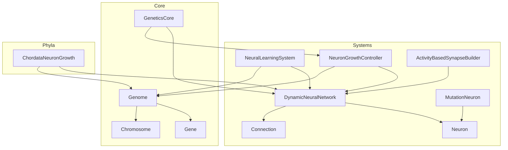
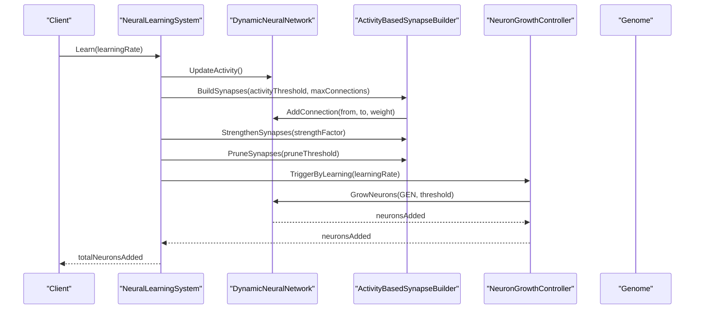
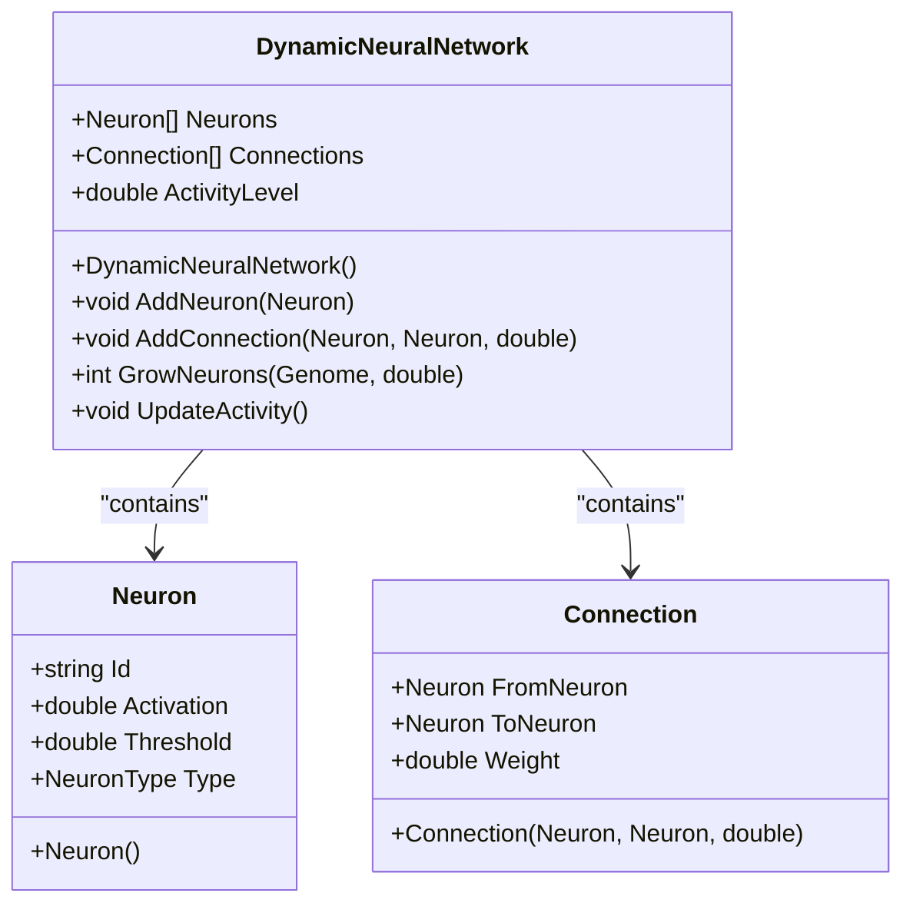
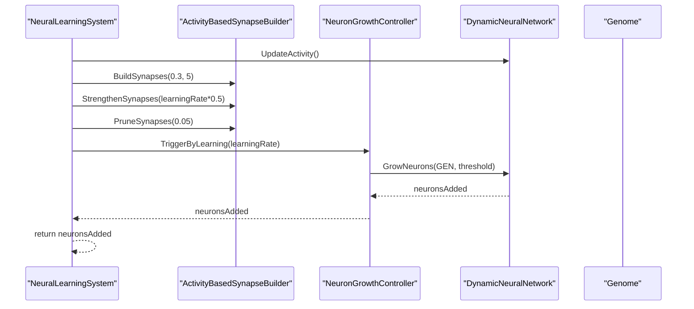
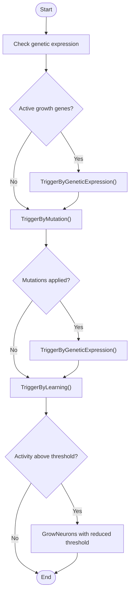
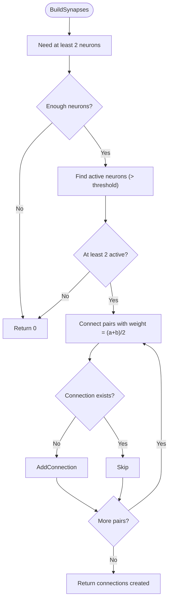
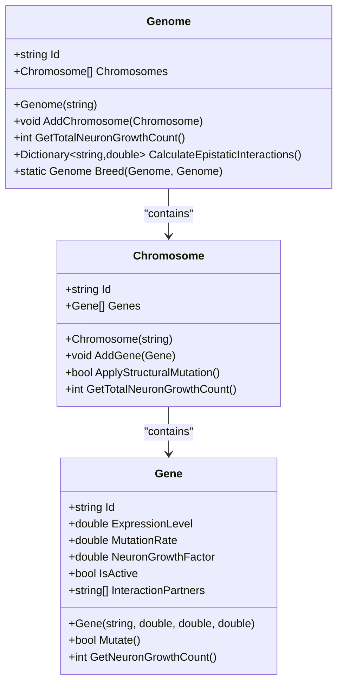
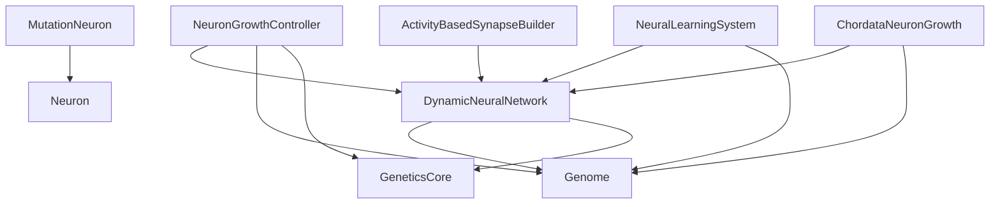

# Neural Systems API

<cite>
**Referenced Files in This Document**
- [DynamicNeuralNetwork.cs](file://GeneticsGame/Systems/DynamicNeuralNetwork.cs)
- [Neuron.cs](file://GeneticsGame/Systems/Neuron.cs)
- [Connection.cs](file://GeneticsGame/Systems/Connection.cs)
- [NeuralLearningSystem.cs](file://GeneticsGame/Systems/NeuralLearningSystem.cs)
- [NeuronGrowthController.cs](file://GeneticsGame/Systems/NeuronGrowthController.cs)
- [ActivityBasedSynapseBuilder.cs](file://GeneticsGame/Systems/ActivityBasedSynapseBuilder.cs)
- [GeneticsCore.cs](file://GeneticsGame/Core/GeneticsCore.cs)
- [Genome.cs](file://GeneticsGame/Core/Genome.cs)
- [Gene.cs](file://GeneticsGame/Core/Gene.cs)
- [Chromosome.cs](file://GeneticsGame/Core/Chromosome.cs)
- [ChordataNeuronGrowth.cs](file://GeneticsGame/Phyla/Chordata/ChordataNeuronGrowth.cs)
- [MutationNeuron.cs](file://GeneticsGame/Systems/MutationNeuron.cs)
</cite>

## Table of Contents
1. [Introduction](#introduction)
2. [Project Structure](#project-structure)
3. [Core Components](#core-components)
4. [Architecture Overview](#architecture-overview)
5. [Detailed Component Analysis](#detailed-component-analysis)
6. [Dependency Analysis](#dependency-analysis)
7. [Performance Considerations](#performance-considerations)
8. [Troubleshooting Guide](#troubleshooting-guide)
9. [Conclusion](#conclusion)
10. [Appendices](#appendices)

## Introduction
This document provides comprehensive API documentation for the neural network system components in the 3D Genetics project. It covers the DynamicNeuralNetwork class with neuron growth methods, neural activity management, and network topology maintenance; the Neuron class including neuron types, activation functions, connection states, and activity levels; the Connection class with synaptic strength, weight management, and signal transmission; the NeuralLearningSystem class for adaptive learning mechanisms, synapse building, and neural plasticity; and the NeuronGrowthController for genetic regulation of neural development. The documentation includes method signatures, parameter validation, return value specifications, error handling, and practical examples for initializing neural networks, triggering growth, learning scenarios, and monitoring activity.

## Project Structure
The neural systems are organized under the Systems folder, with supporting genetic infrastructure in the Core folder and phyla-specific extensions in the Phyla folder. The key components are:
- DynamicNeuralNetwork: central neural network container with growth and activity management
- Neuron: individual neural units with type and activation properties
- Connection: synaptic links between neurons with weight management
- NeuralLearningSystem: learning and adaptation orchestration
- NeuronGrowthController: genetic-driven neuron creation
- ActivityBasedSynapseBuilder: Hebbian-style synapse formation and pruning
- GeneticsCore: global configuration constants
- Genome/Gene/Chromosome: genetic blueprint and hereditary mechanisms
- ChordataNeuronGrowth: phyla-specific neural development patterns
- MutationNeuron: specialized neuron type activated by mutations

**Diagram sources**
- [DynamicNeuralNetwork.cs:1-116](file://GeneticsGame/Systems/DynamicNeuralNetwork.cs#L1-L116)
- [Neuron.cs:1-70](file://GeneticsGame/Systems/Neuron.cs#L1-L70)
- [Connection.cs:1-35](file://GeneticsGame/Systems/Connection.cs#L1-L35)
- [NeuralLearningSystem.cs:1-122](file://GeneticsGame/Systems/NeuralLearningSystem.cs#L1-L122)
- [NeuronGrowthController.cs:1-122](file://GeneticsGame/Systems/NeuronGrowthController.cs#L1-L122)
- [ActivityBasedSynapseBuilder.cs:1-112](file://GeneticsGame/Systems/ActivityBasedSynapseBuilder.cs#L1-L112)
- [GeneticsCore.cs:1-21](file://GeneticsGame/Core/GeneticsCore.cs#L1-L21)
- [Genome.cs:1-190](file://GeneticsGame/Core/Genome.cs#L1-L190)
- [Gene.cs:1-93](file://GeneticsGame/Core/Gene.cs#L1-L93)
- [Chromosome.cs:1-146](file://GeneticsGame/Core/Chromosome.cs#L1-L146)
- [ChordataNeuronGrowth.cs:1-216](file://GeneticsGame/Phyla/Chordata/ChordataNeuronGrowth.cs#L1-L216)
- [MutationNeuron.cs:1-75](file://GeneticsGame/Systems/MutationNeuron.cs#L1-L75)

**Section sources**
- [DynamicNeuralNetwork.cs:1-116](file://GeneticsGame/Systems/DynamicNeuralNetwork.cs#L1-L116)
- [Neuron.cs:1-70](file://GeneticsGame/Systems/Neuron.cs#L1-L70)
- [Connection.cs:1-35](file://GeneticsGame/Systems/Connection.cs#L1-L35)
- [NeuralLearningSystem.cs:1-122](file://GeneticsGame/Systems/NeuralLearningSystem.cs#L1-L122)
- [NeuronGrowthController.cs:1-122](file://GeneticsGame/Systems/NeuronGrowthController.cs#L1-L122)
- [ActivityBasedSynapseBuilder.cs:1-112](file://GeneticsGame/Systems/ActivityBasedSynapseBuilder.cs#L1-L112)
- [GeneticsCore.cs:1-21](file://GeneticsGame/Core/GeneticsCore.cs#L1-L21)
- [Genome.cs:1-190](file://GeneticsGame/Core/Genome.cs#L1-L190)
- [Gene.cs:1-93](file://GeneticsGame/Core/Gene.cs#L1-L93)
- [Chromosome.cs:1-146](file://GeneticsGame/Core/Chromosome.cs#L1-L146)
- [ChordataNeuronGrowth.cs:1-216](file://GeneticsGame/Phyla/Chordata/ChordataNeuronGrowth.cs#L1-L216)
- [MutationNeuron.cs:1-75](file://GeneticsGame/Systems/MutationNeuron.cs#L1-L75)

## Core Components
This section documents the primary neural system classes and their APIs.

### DynamicNeuralNetwork
A dynamic neural network container that supports runtime neuron addition and maintains network topology and activity levels.

Key properties:
- Neurons: List<Neuron> - collection of neurons in the network
- Connections: List<Connection> - collection of synaptic connections
- ActivityLevel: double - current network activity (average neuron activation)

Constructor:
- DynamicNeuralNetwork() - initializes empty lists and zero activity

Methods:
- AddNeuron(Neuron neuron) - adds a neuron to the network
- AddConnection(Neuron fromNeuron, Neuron toNeuron, double weight = 1.0) - creates and adds a connection
- GrowNeurons(Genome genome, double activityThreshold = 0.5) -> int - grows new neurons based on genetic triggers and activity
- UpdateActivity() - recalculates network activity as average neuron activation

Parameter validation and behavior:
- GrowNeurons requires a non-null genome and uses a configurable activity threshold
- ActivityLevel defaults to 0.0 when no neurons exist
- Connection weights are initialized to 1.0 by default

Return values:
- GrowNeurons returns the number of neurons successfully added
- AddConnection returns void (adds to internal collection)
- UpdateActivity returns void (updates property)

Error handling:
- No explicit exceptions are thrown; growth returns 0 when conditions are not met
- Network remains consistent if invalid parameters are passed

Example usage:
- Initialize network, add initial neurons, update activity, and trigger growth based on learning

**Section sources**
- [DynamicNeuralNetwork.cs:1-116](file://GeneticsGame/Systems/DynamicNeuralNetwork.cs#L1-L116)

### Neuron
Represents a single neuron with identity, activation, threshold, and type.

Key properties:
- Id: string - unique neuron identifier
- Activation: double - current activation level (0.0 to 1.0)
- Threshold: double - activation threshold for firing
- Type: NeuronType - neuron classification

Constructor:
- Neuron() - generates random activation and threshold, sets type to General

NeuronType enumeration:
- General: general-purpose neuron
- Mutation: specialized neuron activated by mutations
- Learning: specialized neuron involved in learning processes
- Movement: specialized neuron for movement control
- Visual: specialized neuron for visual processing

Behavior:
- Activation and threshold are randomized on construction
- Type determines specialized behavior in growth and learning systems

**Section sources**
- [Neuron.cs:1-70](file://GeneticsGame/Systems/Neuron.cs#L1-L70)

### Connection
Represents a directed synaptic connection between two neurons with adjustable weight.

Key properties:
- FromNeuron: Neuron - source neuron
- ToNeuron: Neuron - target neuron
- Weight: double - synaptic strength

Constructor:
- Connection(Neuron fromNeuron, Neuron toNeuron, double weight = 1.0)

Behavior:
- Weight is clamped to [0.0, 1.0] conceptually (operations enforce bounds)
- Used by learning and growth systems to model signal transmission

**Section sources**
- [Connection.cs:1-35](file://GeneticsGame/Systems/Connection.cs#L1-L35)

### NeuralLearningSystem
Orchestrates learning-based neural adaptation, synapse building, and growth triggering.

Key properties:
- NeuralNetwork: DynamicNeuralNetwork - network being learned
- Genome: Genome - genetic context provider

Constructor:
- NeuralLearningSystem(DynamicNeuralNetwork neuralNetwork, Genome genome)

Methods:
- Learn(double learningRate = 0.1) -> int - performs one learning cycle
- AdaptToEnvironment(Dictionary<string, double> environmentFactors, Dictionary<string, double> taskRequirements) -> double - calculates adaptation score
- LearnOverTime(int cycles, double learningRate = 0.1) -> int - runs multiple learning cycles

Learning cycle steps:
1. Update network activity
2. Build synapses based on activity (Hebbian-style)
3. Strengthen existing synapses proportionally to activity
4. Prune weak synapses
5. Trigger neuron growth via NeuronGrowthController

Adaptation scoring:
- Considers neuron counts by type and environmental/task requirements
- Applies genetic constraints scaling

Return values:
- Learn returns number of neurons added during learning
- AdaptToEnvironment returns normalized adaptation score [0.0, 1.0]
- LearnOverTime returns cumulative neurons added across cycles

**Section sources**
- [NeuralLearningSystem.cs:1-122](file://GeneticsGame/Systems/NeuralLearningSystem.cs#L1-L122)

### NeuronGrowthController
Manages neuron creation based on genetic triggers using a hybrid system.

Key properties:
- NeuralNetwork: DynamicNeuralNetwork - network being managed
- Genome: Genome - genetic triggers provider

Constructor:
- NeuronGrowthController(DynamicNeuralNetwork neuralNetwork, Genome genome)

Methods:
- TriggerByGeneticExpression() -> int - growth based on expressed genes
- TriggerByMutation() -> int - growth triggered by neural mutations
- TriggerByLearning(double learningRate = 0.1) -> int - growth based on learning activity
- ExecuteHybridGrowthTrigger() -> int - executes all triggers in priority order

Trigger logic:
- Genetic expression: identifies active genes with high growth factors and expression levels
- Mutation: applies neural-specific mutations and triggers growth with lower threshold
- Learning: growth proportional to activity level with adjusted threshold

Return values:
- All trigger methods return number of neurons added
- Hybrid execution returns total added across all triggers

**Section sources**
- [NeuronGrowthController.cs:1-122](file://GeneticsGame/Systems/NeuronGrowthController.cs#L1-L122)

### ActivityBasedSynapseBuilder
Creates and modifies synapses based on neural activity patterns using Hebbian learning principles.

Key properties:
- NeuralNetwork: DynamicNeuralNetwork - network to modify

Constructor:
- ActivityBasedSynapseBuilder(DynamicNeuralNetwork neuralNetwork)

Methods:
- BuildSynapses(double activityThreshold = 0.5, int maxConnections = 10) -> int - forms new connections between active neurons
- StrengthenSynapses(double strengthFactor = 0.1) -> int - increases weights based on activity product
- PruneSynapses(double pruneThreshold = 0.1) -> int - removes weak connections

Behavior:
- BuildSynapses uses activity correlation to compute weights and avoids duplicates
- StrengthenSynapses scales weights by product of pre- and post-synaptic activations
- PruneSynapses removes connections below a given weight threshold

Return values:
- All methods return count of operations performed

**Section sources**
- [ActivityBasedSynapseBuilder.cs:1-112](file://GeneticsGame/Systems/ActivityBasedSynapseBuilder.cs#L1-L112)

### ChordataNeuronGrowth
Phyla-specific implementation for vertebrate-like neural development patterns.

Key properties:
- NeuralNetwork: DynamicNeuralNetwork - network to grow
- Genome: ChordataGenome - chordata-specific genetic context

Constructor:
- ChordataNeuronGrowth(DynamicNeuralNetwork neuralNetwork, ChordataGenome genome)

Methods:
- GrowChordataNeurons() -> int - grows neurons following chordata-specific traits
- ApplyChordataPlasticity() -> int - applies trait-based plasticity rules

Trait-based growth:
- Uses traits like neuron_count, brain_size, synapse_density, spine_length
- Sets neuron types based on vision_acuity, hearing_range, balance_system

Plasticity rules:
- Visual system strengthening for high vision acuity
- Balance system strengthening for good balance
- General random strengthening for larger brains

Return values:
- GrowChordataNeurons returns number of neurons added
- ApplyChordataPlasticity returns number of connection modifications

**Section sources**
- [ChordataNeuronGrowth.cs:1-216](file://GeneticsGame/Phyla/Chordata/ChordataNeuronGrowth.cs#L1-L216)

### MutationNeuron
Specialized neuron type activated by specific mutations.

Key properties:
- MutationType: MutationType - type of mutation response
- ActivatingGenes: List<string> - genes that activated this neuron
- Inherited from Neuron: Id, Activation, Threshold, Type

Constructor:
- MutationNeuron(MutationType mutationType)

Methods:
- Activate(string geneId, double activationStrength = 1.0) - increases activation and tracks activating genes

MutationType enumeration:
- Structural, Regulatory, Epigenetic, Neural

Behavior:
- Lower threshold for sensitivity
- Activation increases with strength parameter
- Tracks which genes activated it

**Section sources**
- [MutationNeuron.cs:1-75](file://GeneticsGame/Systems/MutationNeuron.cs#L1-L75)

## Architecture Overview
The neural systems integrate genetic triggers, learning mechanisms, and topology maintenance to evolve adaptive neural networks.

**Diagram sources**
- [NeuralLearningSystem.cs:37-57](file://GeneticsGame/Systems/NeuralLearningSystem.cs#L37-L57)
- [ActivityBasedSynapseBuilder.cs:31-68](file://GeneticsGame/Systems/ActivityBasedSynapseBuilder.cs#L31-L68)
- [NeuronGrowthController.cs:88-101](file://GeneticsGame/Systems/NeuronGrowthController.cs#L88-L101)
- [DynamicNeuralNetwork.cs:63-99](file://GeneticsGame/Systems/DynamicNeuralNetwork.cs#L63-L99)

## Detailed Component Analysis

### DynamicNeuralNetwork Analysis
The DynamicNeuralNetwork class serves as the central hub for neural network lifecycle management. It encapsulates neuron and connection collections, manages network activity, and orchestrates neuron growth based on genetic and activity signals.

**Diagram sources**
- [DynamicNeuralNetwork.cs:9-116](file://GeneticsGame/Systems/DynamicNeuralNetwork.cs#L9-L116)
- [Neuron.cs:7-39](file://GeneticsGame/Systems/Neuron.cs#L7-L39)
- [Connection.cs:6-35](file://GeneticsGame/Systems/Connection.cs#L6-L35)

Key implementation patterns:
- Growth limiting via configuration constants
- Epistatic interaction-based type determination
- Activity-driven growth thresholding

Complexity analysis:
- GrowNeurons: O(G) where G is growth potential, plus O(N^2) for connection building in worst case
- UpdateActivity: O(N) for averaging neuron activations

Optimization opportunities:
- Cache activity calculations when neurons are added/removed
- Use spatial indexing for connection building when networks scale

**Section sources**
- [DynamicNeuralNetwork.cs:63-99](file://GeneticsGame/Systems/DynamicNeuralNetwork.cs#L63-L99)
- [GeneticsCore.cs:14-19](file://GeneticsGame/Core/GeneticsCore.cs#L14-L19)

### NeuralLearningSystem Analysis
The NeuralLearningSystem coordinates learning cycles, synapse formation, and growth triggering.

**Diagram sources**
- [NeuralLearningSystem.cs:37-57](file://GeneticsGame/Systems/NeuralLearningSystem.cs#L37-L57)
- [ActivityBasedSynapseBuilder.cs:31-111](file://GeneticsGame/Systems/ActivityBasedSynapseBuilder.cs#L31-L111)
- [NeuronGrowthController.cs:88-101](file://GeneticsGame/Systems/NeuronGrowthController.cs#L88-L101)

Processing logic:
- Learning cycles consist of activity update, synapse building, strengthening, pruning, and growth triggering
- Adaptation scoring considers both environmental factors and task requirements
- Genetic constraints modulate adaptation effectiveness

**Section sources**
- [NeuralLearningSystem.cs:65-103](file://GeneticsGame/Systems/NeuralLearningSystem.cs#L65-L103)

### NeuronGrowthController Analysis
The NeuronGrowthController implements a hybrid growth trigger system prioritizing genetic expression, followed by mutations, then learning.

**Diagram sources**
- [NeuronGrowthController.cs:36-101](file://GeneticsGame/Systems/NeuronGrowthController.cs#L36-L101)

Behavior:
- Genetic expression takes highest priority
- Mutation-triggered growth uses lower threshold
- Learning-triggered growth scales with activity level

**Section sources**
- [NeuronGrowthController.cs:107-121](file://GeneticsGame/Systems/NeuronGrowthController.cs#L107-L121)

### ActivityBasedSynapseBuilder Analysis
The ActivityBasedSynapseBuilder implements Hebbian learning with activity-dependent connection formation and pruning.

**Diagram sources**
- [ActivityBasedSynapseBuilder.cs:31-68](file://GeneticsGame/Systems/ActivityBasedSynapseBuilder.cs#L31-L68)

Algorithm implementation:
- Activity threshold filtering
- Duplicate prevention
- Weight computation from activation correlation
- Strengthening and pruning based on activity product and weight thresholds

**Section sources**
- [ActivityBasedSynapseBuilder.cs:75-111](file://GeneticsGame/Systems/ActivityBasedSynapseBuilder.cs#L75-L111)

### Genetic Infrastructure Analysis
The genetic system provides the hereditary foundation for neural development.

**Diagram sources**
- [Genome.cs:9-190](file://GeneticsGame/Core/Genome.cs#L9-L190)
- [Chromosome.cs:9-146](file://GeneticsGame/Core/Chromosome.cs#L9-L146)
- [Gene.cs:9-93](file://GeneticsGame/Core/Gene.cs#L9-L93)

Key relationships:
- Genome aggregates Chromosomes, which aggregate Genes
- Epistatic interactions drive neuron type determination
- Breeding combines parental traits with inheritance rules

**Section sources**
- [Genome.cs:72-107](file://GeneticsGame/Core/Genome.cs#L72-L107)
- [Chromosome.cs:142-145](file://GeneticsGame/Core/Chromosome.cs#L142-L145)
- [Gene.cs:85-92](file://GeneticsGame/Core/Gene.cs#L85-L92)

## Dependency Analysis
The neural systems depend on genetic infrastructure and configuration constants for operation.

**Diagram sources**
- [DynamicNeuralNetwork.cs:63-99](file://GeneticsGame/Systems/DynamicNeuralNetwork.cs#L63-L99)
- [NeuronGrowthController.cs:26-30](file://GeneticsGame/Systems/NeuronGrowthController.cs#L26-L30)
- [NeuralLearningSystem.cs:26-30](file://GeneticsGame/Systems/NeuralLearningSystem.cs#L26-L30)
- [ActivityBasedSynapseBuilder.cs:20-23](file://GeneticsGame/Systems/ActivityBasedSynapseBuilder.cs#L20-L23)
- [ChordataNeuronGrowth.cs:26-30](file://GeneticsGame/Phyla/Chordata/ChordataNeuronGrowth.cs#L26-L30)
- [MutationNeuron.cs:23-32](file://GeneticsGame/Systems/MutationNeuron.cs#L23-L32)

Coupling and cohesion:
- High cohesion within each system class
- Moderate coupling to genetic infrastructure
- Clear separation between learning, growth, and topology management

External dependencies:
- System.Collections.Generic for collections
- System.Linq for filtering and aggregation
- Random for stochastic operations

Potential circular dependencies:
- None detected; dependencies flow from genetic to neural systems

**Section sources**
- [GeneticsCore.cs:14-19](file://GeneticsGame/Core/GeneticsCore.cs#L14-L19)
- [Genome.cs:19-38](file://GeneticsGame/Core/Genome.cs#L19-L38)

## Performance Considerations
- Network growth is bounded by configuration constants to prevent uncontrolled expansion
- Activity-based synapse building uses nested loops; consider optimizing for large networks
- Strengthening and pruning operations iterate over all connections; batch operations could improve efficiency
- Genetic calculations (epistatic interactions) scale with number of genes; cache results when possible
- Consider spatial partitioning for connection building in large-scale neural networks

## Troubleshooting Guide
Common issues and resolutions:
- No growth occurring: verify activity level meets thresholds and genetic expression levels are sufficient
- Synapse building returns 0: ensure adequate neuron activity and sufficient active neurons
- Weights exceeding bounds: strengthen operations clamp weights; verify activation levels
- Memory usage increasing: monitor neuron and connection counts; implement pruning strategies
- Learning stagnation: adjust learning rates and environmental factors; ensure adequate activity levels

Diagnostic checks:
- Verify NeuralNetwork.ActivityLevel updates after neuron additions
- Confirm Genome.GetTotalNeuronGrowthCount returns positive values
- Check ActivityBasedSynapseBuilder.BuildSynapses conditions for early exits

**Section sources**
- [DynamicNeuralNetwork.cs:104-115](file://GeneticsGame/Systems/DynamicNeuralNetwork.cs#L104-L115)
- [ActivityBasedSynapseBuilder.cs:31-68](file://GeneticsGame/Systems/ActivityBasedSynapseBuilder.cs#L31-L68)

## Conclusion
The neural systems provide a robust framework for dynamic neural network development driven by genetic triggers and learning mechanisms. The modular design enables extensibility through specialized phyla implementations while maintaining clear interfaces for growth, learning, and topology management. The integration of genetic infrastructure ensures heritable neural development patterns, while configuration constants provide control over growth dynamics and stability.

## Appendices

### API Reference Tables

#### DynamicNeuralNetwork Methods
- AddNeuron(Neuron): Adds neuron to collection
- AddConnection(Neuron, Neuron, double): Creates and adds connection
- GrowNeurons(Genome, double): Returns number of neurons added
- UpdateActivity(): Updates network activity level

#### NeuralLearningSystem Methods
- Learn(double): Returns neurons added in cycle
- AdaptToEnvironment(Dictionary, Dictionary): Returns adaptation score
- LearnOverTime(int, double): Returns cumulative neurons added

#### NeuronGrowthController Methods
- TriggerByGeneticExpression(): Returns neurons added
- TriggerByMutation(): Returns neurons added
- TriggerByLearning(double): Returns neurons added
- ExecuteHybridGrowthTrigger(): Returns total added

#### ActivityBasedSynapseBuilder Methods
- BuildSynapses(double, int): Returns connections created
- StrengthenSynapses(double): Returns connections modified
- PruneSynapses(double): Returns connections removed

### Example Workflows

#### Neural Network Initialization
1. Create DynamicNeuralNetwork
2. Add initial Neuron instances
3. Call UpdateActivity() to establish baseline activity
4. Monitor ActivityLevel for growth triggers

#### Growth Triggering
1. Configure GeneticsCore thresholds
2. Call NeuronGrowthController.ExecuteHybridGrowthTrigger()
3. Observe DynamicNeuralNetwork.Neurons growth
4. Verify new neuron types based on genetic context

#### Learning Scenario
1. Initialize NeuralLearningSystem with network and genome
2. Run Learn() cycles with varying learning rates
3. Monitor synapse building and pruning
4. Track neuron growth from learning feedback

#### Activity Monitoring
1. Periodically call DynamicNeuralNetwork.UpdateActivity()
2. Use ActivityBasedSynapseBuilder to observe connectivity changes
3. Adjust thresholds based on observed activity patterns