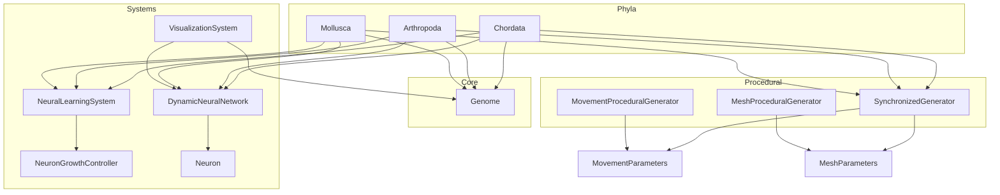
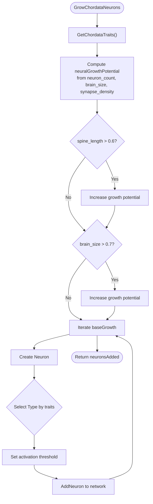
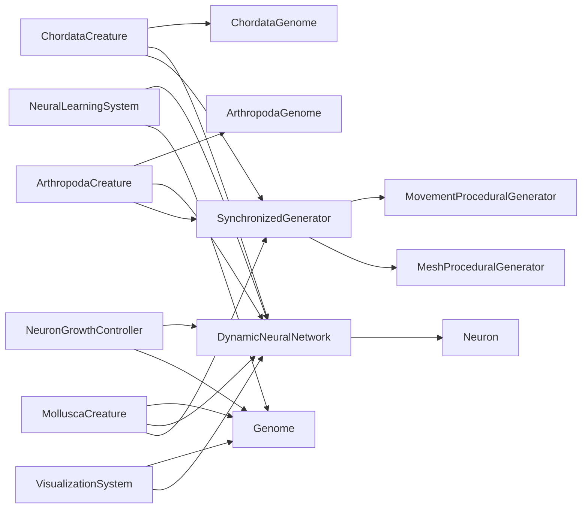

# Organism Systems API

<cite>
**Referenced Files in This Document**
- [ChordataCreature.cs](file://GeneticsGame/Phyla/Chordata/ChordataCreature.cs)
- [ChordataGenome.cs](file://GeneticsGame/Phyla/Chordata/ChordataGenome.cs)
- [ChordataNeuronGrowth.cs](file://GeneticsGame/Phyla/Chordata/ChordataNeuronGrowth.cs)
- [ArthropodaCreature.cs](file://GeneticsGame/Phyla/Arthropoda/ArthropodaCreature.cs)
- [ArthropodaGenome.cs](file://GeneticsGame/Phyla/Arthropoda/ArthropodaGenome.cs)
- [MolluscaCreature.cs](file://GeneticsGame/Phyla/Mollusca/MolluscaCreature.cs)
- [Genome.cs](file://GeneticsGame/Core/Genome.cs)
- [DynamicNeuralNetwork.cs](file://GeneticsGame/Systems/DynamicNeuralNetwork.cs)
- [Neuron.cs](file://GeneticsGame/Systems/Neuron.cs)
- [NeuralLearningSystem.cs](file://GeneticsGame/Systems/NeuralLearningSystem.cs)
- [NeuronGrowthController.cs](file://GeneticsGame/Systems/NeuronGrowthController.cs)
- [VisualizationSystem.cs](file://GeneticsGame/Systems/VisualizationSystem.cs)
- [SynchronizedGenerator.cs](file://GeneticsGame/Procedural/SynchronizedGenerator.cs)
- [MovementProceduralGenerator.cs](file://GeneticsGame/Procedural/Movement/MovementProceduralGenerator.cs)
- [MeshProceduralGenerator.cs](file://GeneticsGame/Procedural/Mesh/MeshProceduralGenerator.cs)
</cite>

## Table of Contents
1. [Introduction](#introduction)
2. [Project Structure](#project-structure)
3. [Core Components](#core-components)
4. [Architecture Overview](#architecture-overview)
5. [Detailed Component Analysis](#detailed-component-analysis)
6. [Dependency Analysis](#dependency-analysis)
7. [Performance Considerations](#performance-considerations)
8. [Troubleshooting Guide](#troubleshooting-guide)
9. [Conclusion](#conclusion)

## Introduction
This document provides detailed API documentation for the organism classification system components in the 3D Genetics project. It covers the Chordata, Arthropoda, and Mollusca phyla, focusing on:
- Neural network integration and dynamics
- Movement patterns and locomotion generation
- Chordate-specific characteristics and arthropod adaptations
- Genetic specializations and growth controllers
- Visualization pipeline linking genetics to mesh and movement

The goal is to enable developers to integrate, extend, and troubleshoot these systems effectively.

## Project Structure
The organism systems are organized by phylum under Phyla/, with shared genetic and procedural infrastructure under Core/, Procedural/, and Systems/.

**Diagram sources**
- [ChordataCreature.cs:1-133](file://GeneticsGame/Phyla/Chordata/ChordataCreature.cs#L1-L133)
- [ArthropodaCreature.cs:1-133](file://GeneticsGame/Phyla/Arthropoda/ArthropodaCreature.cs#L1-L133)
- [MolluscaCreature.cs:1-133](file://GeneticsGame/Phyla/Mollusca/MolluscaCreature.cs#L1-L133)
- [Genome.cs:1-190](file://GeneticsGame/Core/Genome.cs#L1-L190)
- [DynamicNeuralNetwork.cs:1-116](file://GeneticsGame/Systems/DynamicNeuralNetwork.cs#L1-L116)
- [NeuralLearningSystem.cs:1-122](file://GeneticsGame/Systems/NeuralLearningSystem.cs#L1-L122)
- [NeuronGrowthController.cs:1-122](file://GeneticsGame/Systems/NeuronGrowthController.cs#L1-L122)
- [VisualizationSystem.cs:1-239](file://GeneticsGame/Systems/VisualizationSystem.cs#L1-L239)
- [SynchronizedGenerator.cs:1-141](file://GeneticsGame/Procedural/SynchronizedGenerator.cs#L1-L141)
- [MovementProceduralGenerator.cs:1-389](file://GeneticsGame/Procedural/Movement/MovementProceduralGenerator.cs#L1-L389)
- [MeshProceduralGenerator.cs:1-365](file://GeneticsGame/Procedural/Mesh/MeshProceduralGenerator.cs#L1-L365)

**Section sources**
- [ChordataCreature.cs:1-133](file://GeneticsGame/Phyla/Chordata/ChordataCreature.cs#L1-L133)
- [ArthropodaCreature.cs:1-133](file://GeneticsGame/Phyla/Arthropoda/ArthropodaCreature.cs#L1-L133)
- [MolluscaCreature.cs:1-133](file://GeneticsGame/Phyla/Mollusca/MolluscaCreature.cs#L1-L133)
- [Genome.cs:1-190](file://GeneticsGame/Core/Genome.cs#L1-L190)
- [DynamicNeuralNetwork.cs:1-116](file://GeneticsGame/Systems/DynamicNeuralNetwork.cs#L1-L116)
- [NeuralLearningSystem.cs:1-122](file://GeneticsGame/Systems/NeuralLearningSystem.cs#L1-L122)
- [NeuronGrowthController.cs:1-122](file://GeneticsGame/Systems/NeuronGrowthController.cs#L1-L122)
- [VisualizationSystem.cs:1-239](file://GeneticsGame/Systems/VisualizationSystem.cs#L1-L239)
- [SynchronizedGenerator.cs:1-141](file://GeneticsGame/Procedural/SynchronizedGenerator.cs#L1-L141)
- [MovementProceduralGenerator.cs:1-389](file://GeneticsGame/Procedural/Movement/MovementProceduralGenerator.cs#L1-L389)
- [MeshProceduralGenerator.cs:1-365](file://GeneticsGame/Procedural/Mesh/MeshProceduralGenerator.cs#L1-L365)

## Core Components
This section outlines the foundational classes and their roles across phyla.

- Genome: Central genetic blueprint with chromosomes, epistatic interactions, neuron growth potential, and breeding mechanics.
- DynamicNeuralNetwork: Runtime-addable neurons and connections with activity-driven growth.
- Neuron: Basic unit with activation, threshold, and type.
- NeuralLearningSystem: Activity-based synaptogenesis, strengthening, pruning, and growth triggering.
- NeuronGrowthController: Hybrid growth triggers (genetic expression, mutation, learning).
- SynchronizedGenerator: Unified mesh and movement parameter generation with cross-system synchronization.
- MovementProceduralGenerator: Movement type, speed, gait complexity, patterns, balance system, and learning rate derived from genes.
- MeshProceduralGenerator: Scale, complexity, vertex count, colors, patterns, textures, limbs, and segments.
- VisualizationSystem: Complexity, color palette, animation parameters, and neural visualization metrics.

**Section sources**
- [Genome.cs:1-190](file://GeneticsGame/Core/Genome.cs#L1-L190)
- [DynamicNeuralNetwork.cs:1-116](file://GeneticsGame/Systems/DynamicNeuralNetwork.cs#L1-L116)
- [Neuron.cs:1-70](file://GeneticsGame/Systems/Neuron.cs#L1-L70)
- [NeuralLearningSystem.cs:1-122](file://GeneticsGame/Systems/NeuralLearningSystem.cs#L1-L122)
- [NeuronGrowthController.cs:1-122](file://GeneticsGame/Systems/NeuronGrowthController.cs#L1-L122)
- [SynchronizedGenerator.cs:1-141](file://GeneticsGame/Procedural/SynchronizedGenerator.cs#L1-L141)
- [MovementProceduralGenerator.cs:1-389](file://GeneticsGame/Procedural/Movement/MovementProceduralGenerator.cs#L1-L389)
- [MeshProceduralGenerator.cs:1-365](file://GeneticsGame/Procedural/Mesh/MeshProceduralGenerator.cs#L1-L365)
- [VisualizationSystem.cs:1-239](file://GeneticsGame/Systems/VisualizationSystem.cs#L1-L239)

## Architecture Overview
The system integrates genetics with neural dynamics and procedural generation to produce coherent organisms with distinct phyla-specific traits.

```mermaid
classDiagram
class Genome {
+string Id
+Chromosome[] Chromosomes
+AddChromosome(chromosome)
+ApplyMutations() int
+GetTotalNeuronGrowthCount() int
+CalculateEpistaticInteractions() Dictionary~string,double~
+Breed(parent1, parent2) Genome
}
class DynamicNeuralNetwork {
+Neuron[] Neurons
+Connection[] Connections
+double ActivityLevel
+AddNeuron(neuron)
+AddConnection(fromNeuron,toNeuron,weight)
+GrowNeurons(genome,activityThreshold) int
+UpdateActivity()
}
class Neuron {
+string Id
+double Activation
+double Threshold
+NeuronType Type
}
class NeuralLearningSystem {
+Learn(learningRate) int
+AdaptToEnvironment(environmentFactors,taskRequirements) double
+LearnOverTime(cycles,learningRate) int
}
class NeuronGrowthController {
+TriggerByGeneticExpression() int
+TriggerByMutation() int
+TriggerByLearning(learningRate) int
+ExecuteHybridGrowthTrigger() int
}
class SynchronizedGenerator {
+GenerateSynchronizedParameters(genome) SynchronizedParameters
}
class MovementProceduralGenerator {
+GenerateMovementParameters(genome) MovementParameters
}
class MeshProceduralGenerator {
+GenerateMeshParameters(genome) MeshParameters
}
class VisualizationSystem {
+GenerateVisualizationParameters() VisualizationParameters
}
class ChordataCreature
class ArthropodaCreature
class MolluscaCreature
class ChordataGenome
class ArthropodaGenome
ChordataCreature --> Genome : "has"
ArthropodaCreature --> Genome : "has"
MolluscaCreature --> Genome : "has"
ChordataCreature --> DynamicNeuralNetwork : "has"
ArthropodaCreature --> DynamicNeuralNetwork : "has"
MolluscaCreature --> DynamicNeuralNetwork : "has"
ChordataCreature --> SynchronizedGenerator : "uses"
ArthropodaCreature --> SynchronizedGenerator : "uses"
MolluscaCreature --> SynchronizedGenerator : "uses"
SynchronizedGenerator --> MovementProceduralGenerator : "uses"
SynchronizedGenerator --> MeshProceduralGenerator : "uses"
DynamicNeuralNetwork --> Neuron : "contains"
NeuralLearningSystem --> DynamicNeuralNetwork : "manages"
NeuralLearningSystem --> Genome : "context"
NeuronGrowthController --> DynamicNeuralNetwork : "manages"
NeuronGrowthController --> Genome : "triggers"
VisualizationSystem --> Genome : "reads"
VisualizationSystem --> DynamicNeuralNetwork : "reads"
ChordataGenome --|> Genome
ArthropodaGenome --|> Genome
```

**Diagram sources**
- [ChordataCreature.cs:1-133](file://GeneticsGame/Phyla/Chordata/ChordataCreature.cs#L1-L133)
- [ArthropodaCreature.cs:1-133](file://GeneticsGame/Phyla/Arthropoda/ArthropodaCreature.cs#L1-L133)
- [MolluscaCreature.cs:1-133](file://GeneticsGame/Phyla/Mollusca/MolluscaCreature.cs#L1-L133)
- [ChordataGenome.cs:1-134](file://GeneticsGame/Phyla/Chordata/ChordataGenome.cs#L1-L134)
- [ArthropodaGenome.cs:1-134](file://GeneticsGame/Phyla/Arthropoda/ArthropodaGenome.cs#L1-L134)
- [Genome.cs:1-190](file://GeneticsGame/Core/Genome.cs#L1-L190)
- [DynamicNeuralNetwork.cs:1-116](file://GeneticsGame/Systems/DynamicNeuralNetwork.cs#L1-L116)
- [Neuron.cs:1-70](file://GeneticsGame/Systems/Neuron.cs#L1-L70)
- [NeuralLearningSystem.cs:1-122](file://GeneticsGame/Systems/NeuralLearningSystem.cs#L1-L122)
- [NeuronGrowthController.cs:1-122](file://GeneticsGame/Systems/NeuronGrowthController.cs#L1-L122)
- [SynchronizedGenerator.cs:1-141](file://GeneticsGame/Procedural/SynchronizedGenerator.cs#L1-L141)
- [MovementProceduralGenerator.cs:1-389](file://GeneticsGame/Procedural/Movement/MovementProceduralGenerator.cs#L1-L389)
- [MeshProceduralGenerator.cs:1-365](file://GeneticsGame/Procedural/Mesh/MeshProceduralGenerator.cs#L1-L365)
- [VisualizationSystem.cs:1-239](file://GeneticsGame/Systems/VisualizationSystem.cs#L1-L239)

## Detailed Component Analysis

### ChordataCreature
Represents vertebrate-like organisms with spinal columns and complex nervous systems. Integrates neural network updates, learning, movement parameter adjustment, and mesh scaling based on genetic expression and neural growth.

Key behaviors:
- Update lifecycle: neural activity update, probabilistic learning, movement/mesh parameter updates.
- Movement parameters: speed scaled by neural activity; gait complexity derived from neural connections.
- Mesh parameters: scale from average gene expression; vertex count influenced by total neuron growth potential.
- Visualization: delegates to VisualizationSystem for rendering parameters.

Methods and parameters:
- Update(timeStep: double): Updates neural activity, applies learning with probability, adjusts MovementParameters and MeshParameters.
- GetVisualizationParameters(): Returns VisualizationParameters via VisualizationSystem.

Chordata-specific characteristics:
- Neural network initialized at construction.
- MovementParameters and MeshParameters generated via SynchronizedGenerator using Genome.
- Mesh vertex count grows with neuron growth potential from genome.

**Section sources**
- [ChordataCreature.cs:1-133](file://GeneticsGame/Phyla/Chordata/ChordataCreature.cs#L1-L133)
- [SynchronizedGenerator.cs:1-141](file://GeneticsGame/Procedural/SynchronizedGenerator.cs#L1-L141)
- [VisualizationSystem.cs:1-239](file://GeneticsGame/Systems/VisualizationSystem.cs#L1-L239)
- [Genome.cs:68-75](file://GeneticsGame/Core/Genome.cs#L68-L75)

### ChordataGenome
Specialized genome for Chordata with dedicated chromosomes for spine, neural, limb, sensory, and metabolic traits. Provides chordate-specific trait extraction and mutation rules.

Key features:
- Initializes five specialized chromosomes with genes for spine length/flexibility/vertebrae, neuron count/synapse density/brain size, limb count/length/joint complexity, vision/hearing/balance, and metabolism.
- GetChordataTraits(): Aggregates trait names and expression levels for spine/neural/limb/sensory/metabolism genes.
- ApplyChordataSpecificMutations(): Increases mutation rates for neural/spinal genes.

Method signatures:
- GetChordataTraits(): Dictionary<string, double>
- ApplyChordataSpecificMutations(): int

**Section sources**
- [ChordataGenome.cs:1-134](file://GeneticsGame/Phyla/Chordata/ChordataGenome.cs#L1-L134)
- [Genome.cs:1-190](file://GeneticsGame/Core/Genome.cs#L1-L190)

### ChordataNeuronGrowth
Implements chordate-specific neural growth and plasticity. Grows neurons based on traits and assigns neuron types (general, visual, movement) according to expression thresholds.

Key behaviors:
- GrowChordataNeurons(): Computes growth potential from neuron count, brain size, and synapse density; adds neurons with type selection based on vision/hearing/balance expression; sets activation thresholds.
- ApplyChordataPlasticity(): Applies visual, balance, and general plasticity rules by strengthening connections among specialized neuron groups.

Method signatures:
- GrowChordataNeurons(): int
- ApplyChordataPlasticity(): int

**Diagram sources**
- [ChordataNeuronGrowth.cs:36-103](file://GeneticsGame/Phyla/Chordata/ChordataNeuronGrowth.cs#L36-L103)

**Section sources**
- [ChordataNeuronGrowth.cs:1-216](file://GeneticsGame/Phyla/Chordata/ChordataNeuronGrowth.cs#L1-L216)

### ArthropodaCreature
Represents insect/crustacean-like organisms with exoskeletons and segmented bodies. Neural learning occurs less frequently than in chordates; movement complexity is driven by limb count; mesh complexity reflects exoskeleton genes.

Key behaviors:
- Update lifecycle: neural activity update, lower-probability learning, movement/mesh updates.
- Movement parameters: speed factor adjusted by activity; gait complexity from epistatic interactions containing “limb”.
- Mesh parameters: scale from average expression; vertex count increases with exoskeleton-related epistatic interactions.

Method signature:
- Update(timeStep: double): Updates neural activity, applies learning with lower probability, adjusts MovementParameters and MeshParameters.

**Section sources**
- [ArthropodaCreature.cs:1-133](file://GeneticsGame/Phyla/Arthropoda/ArthropodaCreature.cs#L1-L133)
- [Genome.cs:78-107](file://GeneticsGame/Core/Genome.cs#L78-L107)

### ArthropodaGenome
Specialized genome for Arthropoda with chromosomes for exoskeleton thickness/hardness/molting, segmentation, limbs/joints/sensory appendages, neural ganglia/nerve cords/sensory neurons, and metabolism.

Key features:
- GetArthropodaTraits(): Aggregates traits for exoskeleton/segment/limb/neural/metabolism genes.
- ApplyArthropodaSpecificMutations(): Elevates mutation rates for neural/exoskeleton genes.

Method signatures:
- GetArthropodaTraits(): Dictionary<string, double>
- ApplyArthropodaSpecificMutations(): int

**Section sources**
- [ArthropodaGenome.cs:1-134](file://GeneticsGame/Phyla/Arthropoda/ArthropodaGenome.cs#L1-L134)
- [Genome.cs:1-190](file://GeneticsGame/Core/Genome.cs#L1-L190)

### MolluscaCreature
Soft-bodied organisms with flexible bodies and no rigid skeleton. Higher learning probability than chordates; movement complexity tied to body flexibility genes; mesh complexity from body shape genes.

Key behaviors:
- Update lifecycle: neural activity update, higher-probability learning, movement/mesh updates.
- Movement parameters: speed factor adjusted by activity; gait complexity from flexibility-related epistatic interactions.
- Mesh parameters: scale from average expression; vertex count increases with body complexity genes.

Method signature:
- Update(timeStep: double): Updates neural activity, applies learning with higher probability, adjusts MovementParameters and MeshParameters.

**Section sources**
- [MolluscaCreature.cs:1-133](file://GeneticsGame/Phyla/Mollusca/MolluscaCreature.cs#L1-L133)
- [Genome.cs:78-107](file://GeneticsGame/Core/Genome.cs#L78-L107)

## Dependency Analysis
Organism classes depend on shared genetic and procedural systems. The following diagram highlights key dependencies and interactions.

**Diagram sources**
- [ChordataCreature.cs:1-133](file://GeneticsGame/Phyla/Chordata/ChordataCreature.cs#L1-L133)
- [ArthropodaCreature.cs:1-133](file://GeneticsGame/Phyla/Arthropoda/ArthropodaCreature.cs#L1-L133)
- [MolluscaCreature.cs:1-133](file://GeneticsGame/Phyla/Mollusca/MolluscaCreature.cs#L1-L133)
- [ChordataGenome.cs:1-134](file://GeneticsGame/Phyla/Chordata/ChordataGenome.cs#L1-L134)
- [ArthropodaGenome.cs:1-134](file://GeneticsGame/Phyla/Arthropoda/ArthropodaGenome.cs#L1-L134)
- [Genome.cs:1-190](file://GeneticsGame/Core/Genome.cs#L1-L190)
- [DynamicNeuralNetwork.cs:1-116](file://GeneticsGame/Systems/DynamicNeuralNetwork.cs#L1-L116)
- [Neuron.cs:1-70](file://GeneticsGame/Systems/Neuron.cs#L1-L70)
- [NeuralLearningSystem.cs:1-122](file://GeneticsGame/Systems/NeuralLearningSystem.cs#L1-L122)
- [NeuronGrowthController.cs:1-122](file://GeneticsGame/Systems/NeuronGrowthController.cs#L1-L122)
- [SynchronizedGenerator.cs:1-141](file://GeneticsGame/Procedural/SynchronizedGenerator.cs#L1-L141)
- [MovementProceduralGenerator.cs:1-389](file://GeneticsGame/Procedural/Movement/MovementProceduralGenerator.cs#L1-L389)
- [MeshProceduralGenerator.cs:1-365](file://GeneticsGame/Procedural/Mesh/MeshProceduralGenerator.cs#L1-L365)
- [VisualizationSystem.cs:1-239](file://GeneticsGame/Systems/VisualizationSystem.cs#L1-L239)

**Section sources**
- [ChordataCreature.cs:1-133](file://GeneticsGame/Phyla/Chordata/ChordataCreature.cs#L1-L133)
- [ArthropodaCreature.cs:1-133](file://GeneticsGame/Phyla/Arthropoda/ArthropodaCreature.cs#L1-L133)
- [MolluscaCreature.cs:1-133](file://GeneticsGame/Phyla/Mollusca/MolluscaCreature.cs#L1-L133)
- [Genome.cs:1-190](file://GeneticsGame/Core/Genome.cs#L1-L190)
- [DynamicNeuralNetwork.cs:1-116](file://GeneticsGame/Systems/DynamicNeuralNetwork.cs#L1-L116)
- [NeuralLearningSystem.cs:1-122](file://GeneticsGame/Systems/NeuralLearningSystem.cs#L1-L122)
- [NeuronGrowthController.cs:1-122](file://GeneticsGame/Systems/NeuronGrowthController.cs#L1-L122)
- [SynchronizedGenerator.cs:1-141](file://GeneticsGame/Procedural/SynchronizedGenerator.cs#L1-L141)
- [MovementProceduralGenerator.cs:1-389](file://GeneticsGame/Procedural/Movement/MovementProceduralGenerator.cs#L1-L389)
- [MeshProceduralGenerator.cs:1-365](file://GeneticsGame/Procedural/Mesh/MeshProceduralGenerator.cs#L1-L365)
- [VisualizationSystem.cs:1-239](file://GeneticsGame/Systems/VisualizationSystem.cs#L1-L239)

## Performance Considerations
- Neural growth is activity-limited and capped per generation to prevent uncontrolled expansion.
- Movement/mesh synchronization ensures consistent parameters, reducing redundant recalculations.
- Epistatic interaction calculations scale with gene/chromosome counts; consider caching when evaluating many organisms.
- Visualization complexity increases with neuron/connection counts; use appropriate complexity levels for real-time rendering.

[No sources needed since this section provides general guidance]

## Troubleshooting Guide
Common issues and resolutions:
- No neuron growth despite activity: Verify NeuralActivityThreshold configuration and that activityLevel meets thresholds; check NeuronGrowthController trigger order and conditions.
- Movement and mesh mismatch: Confirm SynchronizedGenerator synchronization logic; ensure limb/body counts align after parameter generation.
- Excessive memory usage: Limit MaxNeuronGrowthPerGeneration and prune weak synapses via NeuralLearningSystem.
- Visualization anomalies: Validate VisualizationSystem’s complexity and color palette calculations against current genome/neural states.

**Section sources**
- [DynamicNeuralNetwork.cs:57-99](file://GeneticsGame/Systems/DynamicNeuralNetwork.cs#L57-L99)
- [NeuronGrowthController.cs:104-122](file://GeneticsGame/Systems/NeuronGrowthController.cs#L104-L122)
- [SynchronizedGenerator.cs:51-124](file://GeneticsGame/Procedural/SynchronizedGenerator.cs#L51-L124)
- [VisualizationSystem.cs:32-165](file://GeneticsGame/Systems/VisualizationSystem.cs#L32-L165)

## Conclusion
The organism classification system integrates genetics, neural dynamics, and procedural generation to produce diverse, phyla-specific organisms. Chordata emphasizes complex brains and movement; Arthropoda focuses on exoskeletons and segmentation; Mollusca prioritizes flexibility and adaptability. The shared systems ensure coherent behavior across phyla while enabling specialized traits and growth mechanisms.

[No sources needed since this section summarizes without analyzing specific files]