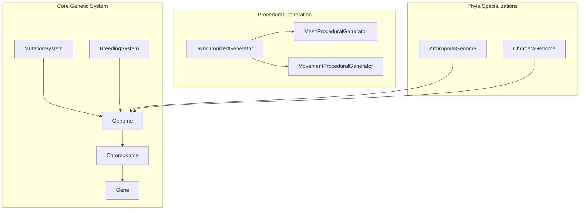
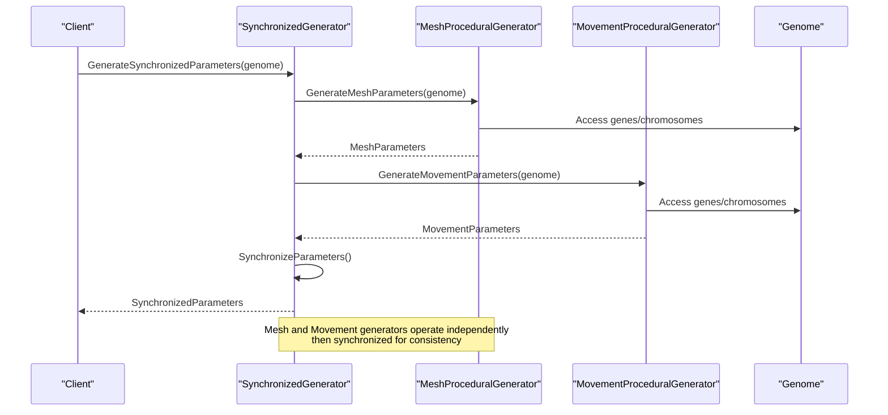
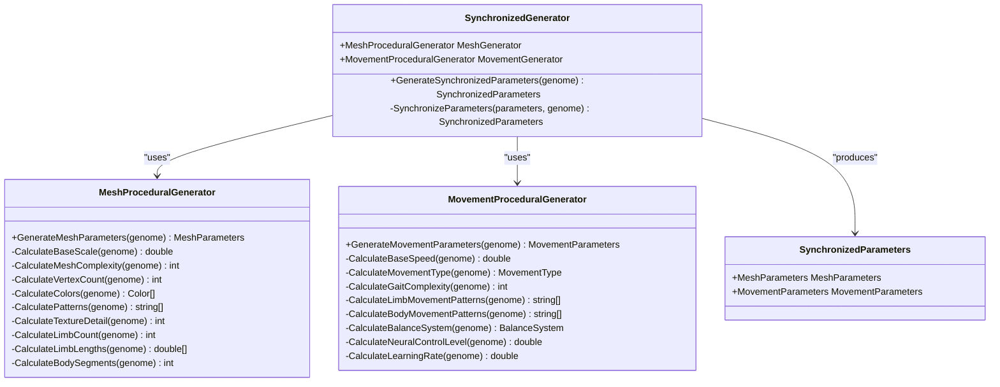
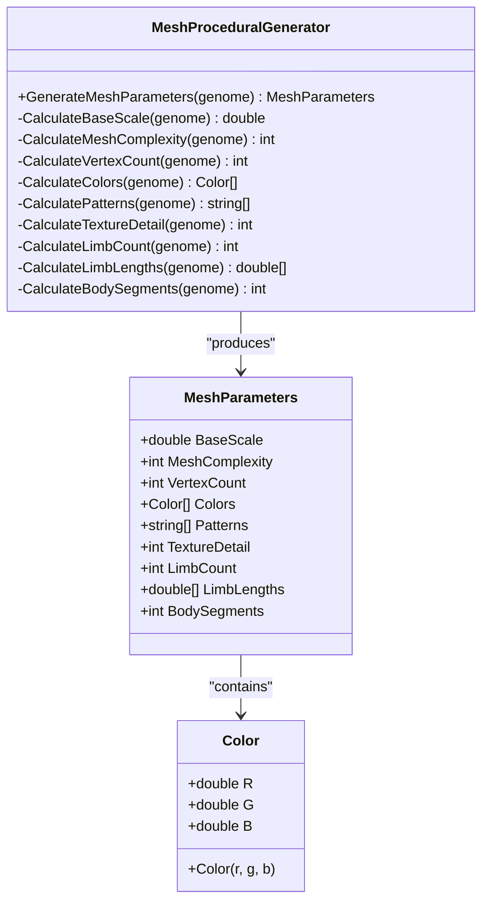
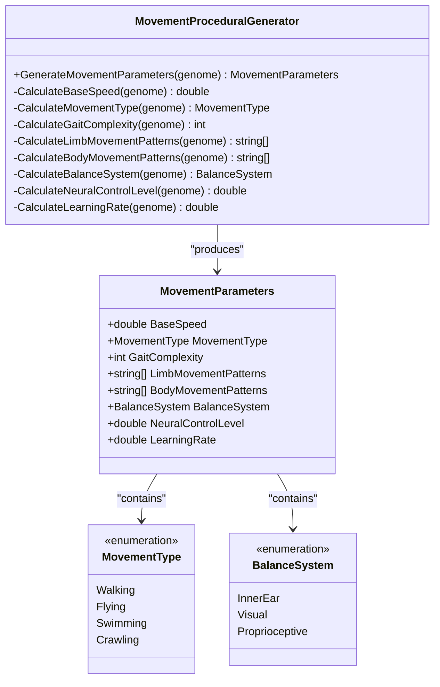
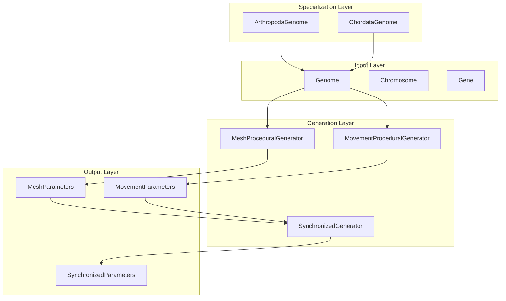

# Procedural Generation API

<cite>
**Referenced Files in This Document**
- [SynchronizedGenerator.cs](file://GeneticsGame/Procedural/SynchronizedGenerator.cs)
- [MeshProceduralGenerator.cs](file://GeneticsGame/Procedural/Mesh/MeshProceduralGenerator.cs)
- [MovementProceduralGenerator.cs](file://GeneticsGame/Procedural/Movement/MovementProceduralGenerator.cs)
- [Genome.cs](file://GeneticsGame/Core/Genome.cs)
- [Chromosome.cs](file://GeneticsGame/Core/Chromosome.cs)
- [Gene.cs](file://GeneticsGame/Core/Gene.cs)
- [MutationSystem.cs](file://GeneticsGame/Core/MutationSystem.cs)
- [BreedingSystem.cs](file://GeneticsGame/Systems/BreedingSystem.cs)
- [ArthropodaGenome.cs](file://GeneticsGame/Phyla/Arthropoda/ArthropodaGenome.cs)
- [ChordataGenome.cs](file://GeneticsGame/Phyla/Chordata/ChordataGenome.cs)
</cite>

## Table of Contents
1. [Introduction](#introduction)
2. [Project Structure](#project-structure)
3. [Core Components](#core-components)
4. [Architecture Overview](#architecture-overview)
5. [Detailed Component Analysis](#detailed-component-analysis)
6. [Dependency Analysis](#dependency-analysis)
7. [Performance Considerations](#performance-considerations)
8. [Troubleshooting Guide](#troubleshooting-guide)
9. [Conclusion](#conclusion)

## Introduction
This document provides comprehensive API documentation for the procedural generation system components that transform genetic blueprints into coherent 3D meshes and movement patterns. The system centers around three key generators:
- SynchronizedGenerator: Orchestrates parameter synchronization between mesh and movement outputs
- MeshProceduralGenerator: Produces 3D mesh parameters from genetic data
- MovementProceduralGenerator: Generates locomotion patterns and biomechanical parameters from genetic data

The documentation covers method signatures, parameter ranges, generation algorithms, output specifications, and the relationship between genetic input and generated parameters. It also includes examples of synchronized parameter generation, mesh creation workflows, and movement pattern simulation.

## Project Structure
The procedural generation system is organized into modular components under the Procedural namespace, with supporting genetic infrastructure in the Core namespace and specialized phyla genomes in the Phyla namespace.

**Diagram sources**
- [Genome.cs:1-190](file://GeneticsGame/Core/Genome.cs#L1-L190)
- [Chromosome.cs:1-146](file://GeneticsGame/Core/Chromosome.cs#L1-L146)
- [Gene.cs:1-93](file://GeneticsGame/Core/Gene.cs#L1-L93)
- [SynchronizedGenerator.cs:1-141](file://GeneticsGame/Procedural/SynchronizedGenerator.cs#L1-L141)
- [MeshProceduralGenerator.cs:1-365](file://GeneticsGame/Procedural/Mesh/MeshProceduralGenerator.cs#L1-L365)
- [MovementProceduralGenerator.cs:1-389](file://GeneticsGame/Procedural/Movement/MovementProceduralGenerator.cs#L1-L389)
- [ArthropodaGenome.cs:1-134](file://GeneticsGame/Phyla/Arthropoda/ArthropodaGenome.cs#L1-L134)
- [ChordataGenome.cs:1-134](file://GeneticsGame/Phyla/Chordata/ChordataGenome.cs#L1-L134)

**Section sources**
- [SynchronizedGenerator.cs:1-141](file://GeneticsGame/Procedural/SynchronizedGenerator.cs#L1-L141)
- [MeshProceduralGenerator.cs:1-365](file://GeneticsGame/Procedural/Mesh/MeshProceduralGenerator.cs#L1-L365)
- [MovementProceduralGenerator.cs:1-389](file://GeneticsGame/Procedural/Movement/MovementProceduralGenerator.cs#L1-L389)

## Core Components
This section documents the primary procedural generation components and their APIs.

### SynchronizedGenerator
The SynchronizedGenerator ensures mesh and movement systems remain consistent by coordinating parameter generation and applying cross-system synchronization rules.

Key capabilities:
- Unified parameter generation from a single genome
- Automatic synchronization of limb counts and body segments
- Size-speed relationship enforcement
- Neural control level adjustment based on mesh complexity

**Section sources**
- [SynchronizedGenerator.cs:9-125](file://GeneticsGame/Procedural/SynchronizedGenerator.cs#L9-L125)

### MeshProceduralGenerator
Converts genetic data into 3D mesh parameters including scale, complexity, vertex count, visual features, and structural characteristics.

Key capabilities:
- Base scale calculation from overall gene expression
- Mesh complexity determination from chromosome/gene counts
- Vertex count computation based on complexity
- Color scheme generation from color-related genes
- Pattern type determination from pattern-related genes
- Texture detail calculation from texture-related genes
- Limb count and length calculations
- Body segment determination

**Section sources**
- [MeshProceduralGenerator.cs:9-280](file://GeneticsGame/Procedural/Mesh/MeshProceduralGenerator.cs#L9-L280)

### MovementProceduralGenerator
Generates locomotion patterns and biomechanical parameters from genetic data, including movement types, gait complexity, and neural control characteristics.

Key capabilities:
- Base speed calculation from neural and muscle-related genes
- Movement type determination (Walking, Flying, Swimming, Crawling)
- Gait complexity calculation from coordination-related genes
- Limb movement pattern classification (Synchronized, Alternating, Independent)
- Body movement pattern determination (Undulating, Segmented, Rigid)
- Balance system type selection (Inner Ear, Visual, Proprioceptive)
- Neural control level calculation
- Learning rate determination for movement adaptation

**Section sources**
- [MovementProceduralGenerator.cs:9-296](file://GeneticsGame/Procedural/Movement/MovementProceduralGenerator.cs#L9-L296)

## Architecture Overview
The procedural generation system follows a layered architecture where genetic data flows through specialized generators and is synchronized for coherent creature representation.

**Diagram sources**
- [SynchronizedGenerator.cs:35-124](file://GeneticsGame/Procedural/SynchronizedGenerator.cs#L35-L124)
- [MeshProceduralGenerator.cs:16-36](file://GeneticsGame/Procedural/Mesh/MeshProceduralGenerator.cs#L16-L36)
- [MovementProceduralGenerator.cs:16-35](file://GeneticsGame/Procedural/Movement/MovementProceduralGenerator.cs#L16-L35)

## Detailed Component Analysis

### SynchronizedGenerator Class Analysis
The SynchronizedGenerator coordinates mesh and movement parameter generation while enforcing consistency rules.

**Diagram sources**
- [SynchronizedGenerator.cs:9-141](file://GeneticsGame/Procedural/SynchronizedGenerator.cs#L9-L141)
- [MeshProceduralGenerator.cs:9-280](file://GeneticsGame/Procedural/Mesh/MeshProceduralGenerator.cs#L9-L280)
- [MovementProceduralGenerator.cs:9-296](file://GeneticsGame/Procedural/Movement/MovementProceduralGenerator.cs#L9-L296)

#### Parameter Synchronization Methods
The synchronization process enforces consistency across mesh and movement parameters:

1. **Limb Count Synchronization**: Ensures movement patterns match mesh limb count
2. **Body Segment Synchronization**: Aligns body movement patterns with mesh segments  
3. **Size-Speed Relationship**: Applies inverse scaling between creature size and speed
4. **Neural Control Adjustment**: Modifies neural control level based on mesh complexity

**Section sources**
- [SynchronizedGenerator.cs:57-124](file://GeneticsGame/Procedural/SynchronizedGenerator.cs#L57-L124)

### MeshProceduralGenerator Class Analysis
The MeshProceduralGenerator transforms genetic data into comprehensive 3D mesh parameters.

**Diagram sources**
- [MeshProceduralGenerator.cs:9-365](file://GeneticsGame/Procedural/Mesh/MeshProceduralGenerator.cs#L9-L365)
- [MeshProceduralGenerator.cs:285-365](file://GeneticsGame/Procedural/Mesh/MeshProceduralGenerator.cs#L285-L365)

#### Geometric Parameter Generation
The mesh generator calculates fundamental geometric properties:

- **Base Scale**: Maps average gene expression to creature size (range: 0.5-2.0)
- **Mesh Complexity**: Quantifies structural intricacy (range: 1-10)
- **Vertex Count**: Determines mesh resolution (base: 1000 × complexity)
- **Limb Count**: Controls appendage quantity (range: 0-12)
- **Body Segments**: Defines axial subdivision (range: 1-10)

**Section sources**
- [MeshProceduralGenerator.cs:43-279](file://GeneticsGame/Procedural/Mesh/MeshProceduralGenerator.cs#L43-L279)

### MovementProceduralGenerator Class Analysis
The MovementProceduralGenerator creates biomechanical parameters and locomotion patterns from genetic data.

**Diagram sources**
- [MovementProceduralGenerator.cs:9-389](file://GeneticsGame/Procedural/Movement/MovementProceduralGenerator.cs#L9-L389)
- [MovementProceduralGenerator.cs:301-389](file://GeneticsGame/Procedural/Movement/MovementProceduralGenerator.cs#L301-L389)

#### Locomotion Pattern Generation
Movement patterns are determined by gene expression levels:

- **Movement Type**: Dominant locomotion mode based on gene dominance scores
- **Limb Movement Patterns**: 
  - High expression (>0.7): "synchronized"
  - Medium expression (>0.4): "alternating" 
  - Low expression: "independent"
- **Body Movement Patterns**:
  - High expression (>0.6): "undulating"
  - Medium expression (>0.3): "segmented"
  - Low expression: "rigid"
- **Balance Systems**: Inner ear, visual, or proprioceptive dominance

**Section sources**
- [MovementProceduralGenerator.cs:83-247](file://GeneticsGame/Procedural/Movement/MovementProceduralGenerator.cs#L83-L247)

## Dependency Analysis
The procedural generation system exhibits clear separation of concerns with well-defined dependencies.

**Diagram sources**
- [Genome.cs:9-190](file://GeneticsGame/Core/Genome.cs#L9-L190)
- [SynchronizedGenerator.cs:35-124](file://GeneticsGame/Procedural/SynchronizedGenerator.cs#L35-L124)
- [MeshProceduralGenerator.cs:16-36](file://GeneticsGame/Procedural/Mesh/MeshProceduralGenerator.cs#L16-L36)
- [MovementProceduralGenerator.cs:16-35](file://GeneticsGame/Procedural/Movement/MovementProceduralGenerator.cs#L16-L35)

### Trait Correlation Algorithms
The system implements sophisticated trait correlation through several mechanisms:

1. **Gene Expression Mapping**: Direct correlation between gene expression levels and trait values
2. **Epistatic Interactions**: Multi-gene interaction effects calculated across the genome
3. **Phyla-Specific Modifications**: Specialized mutation rates and trait expressions for different biological classifications
4. **Cross-System Synchronization**: Mesh and movement parameters adjusted for biological plausibility

**Section sources**
- [Genome.cs:80-107](file://GeneticsGame/Core/Genome.cs#L80-L107)
- [ArthropodaGenome.cs:100-133](file://GeneticsGame/Phyla/Arthropoda/ArthropodaGenome.cs#L100-L133)
- [ChordataGenome.cs:99-133](file://GeneticsGame/Phyla/Chordata/ChordataGenome.cs#L99-L133)

## Performance Considerations
The procedural generation system is designed for efficient parameter calculation:

- **Linear Complexity**: All generation methods operate in O(n) time relative to gene count
- **Memory Efficiency**: Parameters are computed and returned without persistent state
- **Parallelizable Operations**: Individual gene calculations can be parallelized
- **Early Termination**: Some calculations terminate early when sufficient information is gathered

## Troubleshooting Guide
Common issues and their resolutions:

### Parameter Range Validation
- **Issue**: Generated parameters outside expected ranges
- **Cause**: Extreme gene expression levels or missing trait genes
- **Solution**: Verify gene expression bounds and ensure trait-related genes are present

### Synchronization Failures
- **Issue**: Mesh and movement parameters remain inconsistent
- **Cause**: Insufficient limb or segment genes
- **Solution**: Add appropriate trait genes or adjust existing ones

### Performance Degradation
- **Issue**: Slow parameter generation with large genomes
- **Cause**: Excessive gene count or complex epistatic interactions
- **Solution**: Optimize genome structure or implement parallel processing

**Section sources**
- [SynchronizedGenerator.cs:57-124](file://GeneticsGame/Procedural/SynchronizedGenerator.cs#L57-L124)
- [MutationSystem.cs:17-136](file://GeneticsGame/Core/MutationSystem.cs#L17-L136)

## Conclusion
The procedural generation system provides a robust framework for transforming genetic blueprints into coherent 3D creatures with synchronized mesh and movement parameters. The modular architecture enables specialization for different biological classifications while maintaining consistency across systems. The API offers comprehensive parameter generation with clear relationships between genetic input and output traits, making it suitable for evolutionary game mechanics and biological simulation applications.