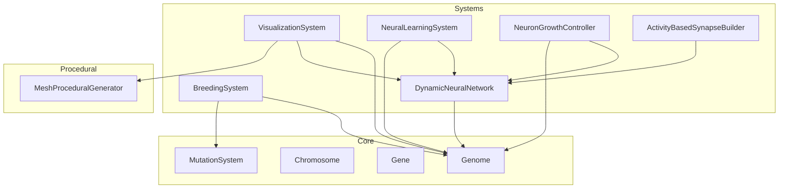
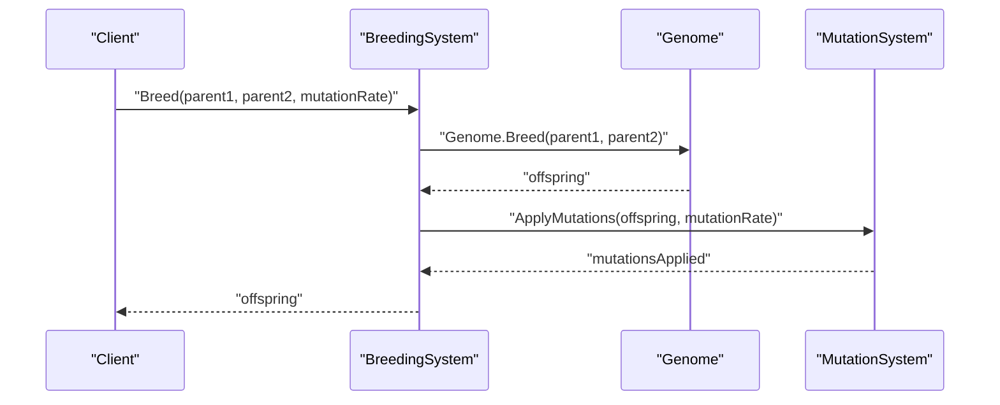
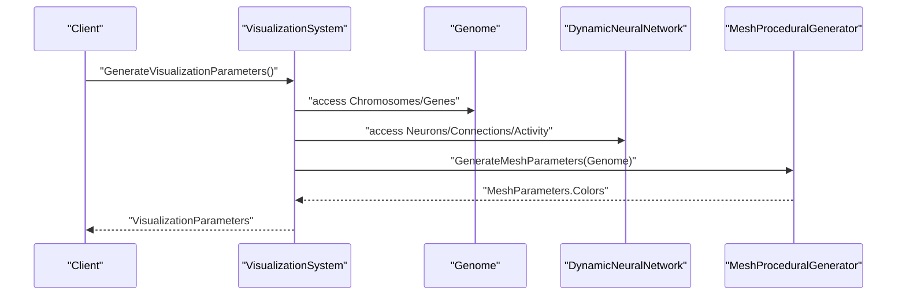
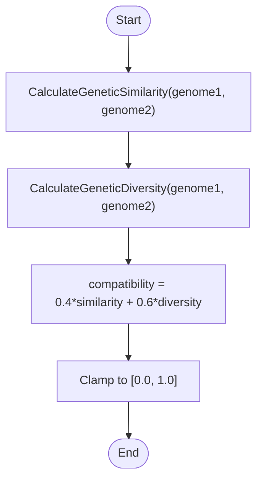
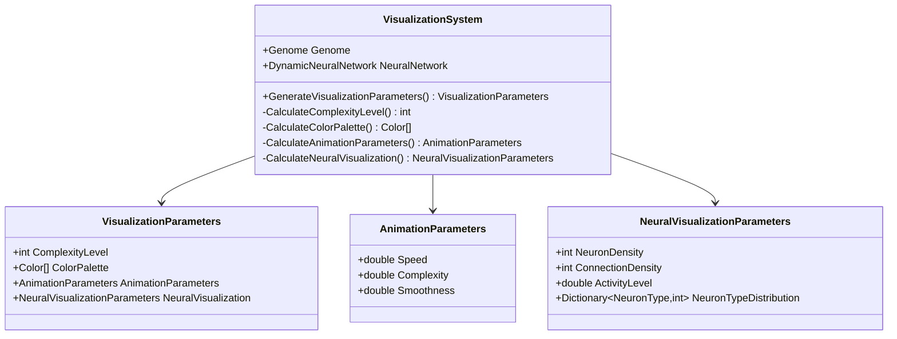
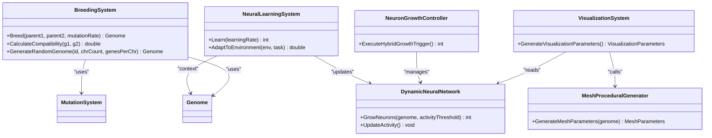
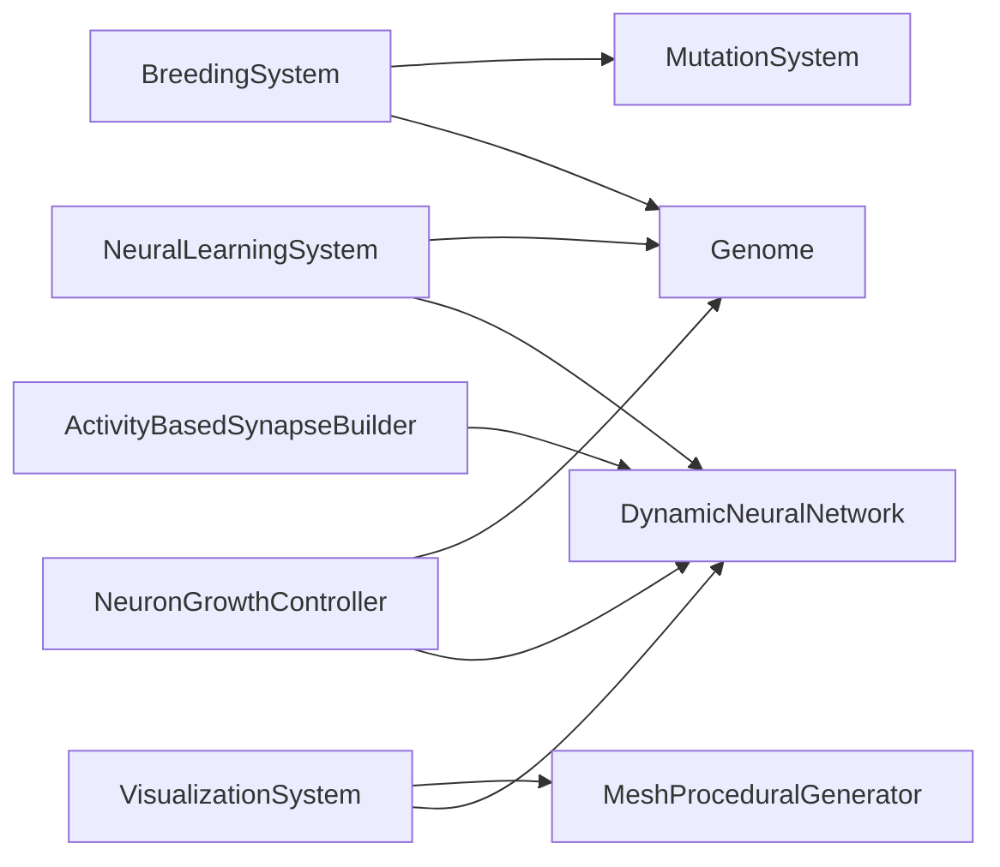

# Utility Systems API

<cite>
**Referenced Files in This Document**
- [BreedingSystem.cs](file://GeneticsGame/Systems/BreedingSystem.cs)
- [VisualizationSystem.cs](file://GeneticsGame/Systems/VisualizationSystem.cs)
- [Genome.cs](file://GeneticsGame/Core/Genome.cs)
- [Chromosome.cs](file://GeneticsGame/Core/Chromosome.cs)
- [Gene.cs](file://GeneticsGame/Core/Gene.cs)
- [MutationSystem.cs](file://GeneticsGame/Core/MutationSystem.cs)
- [DynamicNeuralNetwork.cs](file://GeneticsGame/Systems/DynamicNeuralNetwork.cs)
- [Neuron.cs](file://GeneticsGame/Systems/Neuron.cs)
- [Connection.cs](file://GeneticsGame/Systems/Connection.cs)
- [NeuralLearningSystem.cs](file://GeneticsGame/Systems/NeuralLearningSystem.cs)
- [NeuronGrowthController.cs](file://GeneticsGame/Systems/NeuronGrowthController.cs)
- [ActivityBasedSynapseBuilder.cs](file://GeneticsGame/Systems/ActivityBasedSynapseBuilder.cs)
- [MeshProceduralGenerator.cs](file://GeneticsGame/Procedural/Mesh/MeshProceduralGenerator.cs)
</cite>

## Table of Contents
1. [Introduction](#introduction)
2. [Project Structure](#project-structure)
3. [Core Components](#core-components)
4. [Architecture Overview](#architecture-overview)
5. [Detailed Component Analysis](#detailed-component-analysis)
6. [Dependency Analysis](#dependency-analysis)
7. [Performance Considerations](#performance-considerations)
8. [Troubleshooting Guide](#troubleshooting-guide)
9. [Conclusion](#conclusion)

## Introduction
This document provides comprehensive API documentation for the utility and support systems in the 3D Genetics Game. It focuses on:
- BreedingSystem: genome creation, compatibility scoring, breeding operations, and genetic diversity maintenance.
- VisualizationSystem: color palette generation, animation parameter calculation, rendering integration, and 3D visualization support.

It also explains how these utilities integrate with the core genetic and neural systems, including mutation, neural growth, and procedural mesh generation.

## Project Structure
The utility systems reside under the Systems folder and integrate with Core genetic components and Procedural mesh generation.

**Diagram sources**
- [BreedingSystem.cs:18-27](file://GeneticsGame/Systems/BreedingSystem.cs#L18-L27)
- [VisualizationSystem.cs:26-30](file://GeneticsGame/Systems/VisualizationSystem.cs#L26-L30)
- [DynamicNeuralNetwork.cs:63-99](file://GeneticsGame/Systems/DynamicNeuralNetwork.cs#L63-L99)
- [NeuralLearningSystem.cs:37-57](file://GeneticsGame/Systems/NeuralLearningSystem.cs#L37-L57)
- [NeuronGrowthController.cs:107-121](file://GeneticsGame/Systems/NeuronGrowthController.cs#L107-L121)
- [ActivityBasedSynapseBuilder.cs:31-68](file://GeneticsGame/Systems/ActivityBasedSynapseBuilder.cs#L31-L68)
- [Genome.cs:134-189](file://GeneticsGame/Core/Genome.cs#L134-L189)
- [Chromosome.cs:44-136](file://GeneticsGame/Core/Chromosome.cs#L44-L136)
- [Gene.cs:63-79](file://GeneticsGame/Core/Gene.cs#L63-L79)
- [MutationSystem.cs:17-29](file://GeneticsGame/Core/MutationSystem.cs#L17-L29)
- [MeshProceduralGenerator.cs:16-36](file://GeneticsGame/Procedural/Mesh/MeshProceduralGenerator.cs#L16-L36)

**Section sources**
- [BreedingSystem.cs:18-27](file://GeneticsGame/Systems/BreedingSystem.cs#L18-L27)
- [VisualizationSystem.cs:26-30](file://GeneticsGame/Systems/VisualizationSystem.cs#L26-L30)
- [Genome.cs:134-189](file://GeneticsGame/Core/Genome.cs#L134-L189)
- [MutationSystem.cs:17-29](file://GeneticsGame/Core/MutationSystem.cs#L17-L29)
- [DynamicNeuralNetwork.cs:63-99](file://GeneticsGame/Systems/DynamicNeuralNetwork.cs#L63-L99)
- [MeshProceduralGenerator.cs:16-36](file://GeneticsGame/Procedural/Mesh/MeshProceduralGenerator.cs#L16-L36)

## Core Components
This section documents the primary APIs of the utility systems and their integration points.

### BreedingSystem
- Purpose: Implements ARK-style breeding with mutation simulation, compatibility scoring, and random genome generation.
- Key Methods:
  - Breed(parent1, parent2, mutationRate=0.001): Creates an offspring via Genome.Breed and applies mutations.
  - CalculateCompatibility(genome1, genome2): Returns a compatibility score (0.0–1.0) combining similarity and diversity.
  - GenerateRandomGenome(genomeId, chromosomeCount=23, genesPerChromosome=10): Produces a randomized genome with distinct gene types and interaction partners.

Algorithmic Details:
- Compatibility combines:
  - Similarity: proportion of matching gene IDs across chromosomes.
  - Diversity: based on average absolute difference in expression levels for matching genes.
  - Final score is a weighted combination and clamped to [0.0, 1.0].
- Random genome generation:
  - Creates Chromosome instances and Gene<double> entries.
  - Alternates gene types ("color", "structure", "neural", "regulatory").
  - Neural genes receive a neuron growth factor in [0.2, 1.0]; others are zero.
  - Adds interaction partners to the previous gene on the same chromosome.

Integration:
- Uses Genome.Breed for inheritance and MutationSystem.ApplyMutations for mutation application.

Parameter Validation:
- mutationRate is used directly; callers should ensure it is within [0.0, 1.0].
- GenerateRandomGenome validates counts by using defaults and loops; no explicit checks are performed inside the method.

Examples:
- Random genome generation: [GenerateRandomGenome:137-181](file://GeneticsGame/Systems/BreedingSystem.cs#L137-L181)
- Breeding with mutation: [Breed:18-27](file://GeneticsGame/Systems/BreedingSystem.cs#L18-L27)
- Compatibility assessment: [CalculateCompatibility:35-45](file://GeneticsGame/Systems/BreedingSystem.cs#L35-L45)

**Section sources**
- [BreedingSystem.cs:18-27](file://GeneticsGame/Systems/BreedingSystem.cs#L18-L27)
- [BreedingSystem.cs:35-45](file://GeneticsGame/Systems/BreedingSystem.cs#L35-L45)
- [BreedingSystem.cs:137-181](file://GeneticsGame/Systems/BreedingSystem.cs#L137-L181)
- [Genome.cs:134-189](file://GeneticsGame/Core/Genome.cs#L134-L189)
- [MutationSystem.cs:17-29](file://GeneticsGame/Core/MutationSystem.cs#L17-L29)

### VisualizationSystem
- Purpose: Converts genetic and neural data into visualization parameters for rendering and 3D display.
- Key Methods:
  - GenerateVisualizationParameters(): Aggregates complexity, color palette, animation parameters, and neural visualization parameters.
  - CalculateComplexityLevel(): Computes a 1–10 complexity score from genome and neural network sizes.
  - CalculateColorPalette(): Builds a palette using MeshProceduralGenerator and adds neuron-type colors.
  - CalculateAnimationParameters(): Speed, complexity, and smoothness derived from neural activity and connectivity.
  - CalculateNeuralVisualization(): Populates neuron density, connection density, activity level, and type distribution.

Integration:
- Uses MeshProceduralGenerator to derive base colors and mesh characteristics from a genome.
- Reads DynamicNeuralNetwork for activity level, neuron count, and connection count.

Examples:
- Visualization parameter generation: [GenerateVisualizationParameters:36-53](file://GeneticsGame/Systems/VisualizationSystem.cs#L36-L53)
- Color palette calculation: [CalculateColorPalette:82-109](file://GeneticsGame/Systems/VisualizationSystem.cs#L82-L109)
- Animation parameters: [CalculateAnimationParameters:115-129](file://GeneticsGame/Systems/VisualizationSystem.cs#L115-L129)
- Neural visualization parameters: [CalculateNeuralVisualization:136-165](file://GeneticsGame/Systems/VisualizationSystem.cs#L136-L165)

**Section sources**
- [VisualizationSystem.cs:36-53](file://GeneticsGame/Systems/VisualizationSystem.cs#L36-L53)
- [VisualizationSystem.cs:82-109](file://GeneticsGame/Systems/VisualizationSystem.cs#L82-L109)
- [VisualizationSystem.cs:115-129](file://GeneticsGame/Systems/VisualizationSystem.cs#L115-L129)
- [VisualizationSystem.cs:136-165](file://GeneticsGame/Systems/VisualizationSystem.cs#L136-L165)
- [MeshProceduralGenerator.cs:16-36](file://GeneticsGame/Procedural/Mesh/MeshProceduralGenerator.cs#L16-L36)
- [DynamicNeuralNetwork.cs:14-34](file://GeneticsGame/Systems/DynamicNeuralNetwork.cs#L14-L34)

## Architecture Overview
The utility systems operate on top of the core genetic and neural infrastructure. BreedingSystem orchestrates genome creation and mutation, while VisualizationSystem translates genotypes and neural activity into renderable parameters.

**Diagram sources**
- [BreedingSystem.cs:18-27](file://GeneticsGame/Systems/BreedingSystem.cs#L18-L27)
- [Genome.cs:134-189](file://GeneticsGame/Core/Genome.cs#L134-L189)
- [MutationSystem.cs:17-29](file://GeneticsGame/Core/MutationSystem.cs#L17-L29)

**Diagram sources**
- [VisualizationSystem.cs:36-53](file://GeneticsGame/Systems/VisualizationSystem.cs#L36-L53)
- [MeshProceduralGenerator.cs:16-36](file://GeneticsGame/Procedural/Mesh/MeshProceduralGenerator.cs#L16-L36)
- [DynamicNeuralNetwork.cs:14-34](file://GeneticsGame/Systems/DynamicNeuralNetwork.cs#L14-L34)

## Detailed Component Analysis

### BreedingSystem Analysis
- Class Responsibilities:
  - Offspring creation via Genome.Breed.
  - Mutation application post-breed.
  - Compatibility scoring using genetic similarity and diversity.
  - Random genome generation for initial population.

- Compatibility Scoring Flow:

**Diagram sources**
- [BreedingSystem.cs:35-45](file://GeneticsGame/Systems/BreedingSystem.cs#L35-L45)
- [BreedingSystem.cs:53-88](file://GeneticsGame/Systems/BreedingSystem.cs#L53-L88)
- [BreedingSystem.cs:96-128](file://GeneticsGame/Systems/BreedingSystem.cs#L96-L128)

- Random Genome Generation:
  - Iterates chromosomeCount × genesPerChromosome to create genes with type-specific IDs.
  - Neural genes receive a growth factor; others are zero.
  - Interaction partners are added to the preceding gene on the same chromosome.

- Integration with MutationSystem:
  - Post-breed mutation application scales with mutationRate.

**Section sources**
- [BreedingSystem.cs:35-45](file://GeneticsGame/Systems/BreedingSystem.cs#L35-L45)
- [BreedingSystem.cs:53-88](file://GeneticsGame/Systems/BreedingSystem.cs#L53-L88)
- [BreedingSystem.cs:96-128](file://GeneticsGame/Systems/BreedingSystem.cs#L96-L128)
- [BreedingSystem.cs:137-181](file://GeneticsGame/Systems/BreedingSystem.cs#L137-L181)
- [MutationSystem.cs:17-29](file://GeneticsGame/Core/MutationSystem.cs#L17-L29)

### VisualizationSystem Analysis
- Class Responsibilities:
  - Aggregates visualization parameters from genome and neural network.
  - Generates color palettes aligned with genetic traits.
  - Computes animation parameters based on neural activity and connectivity.
  - Provides neural visualization metrics for rendering.

- Visualization Parameter Composition:

**Diagram sources**
- [VisualizationSystem.cs:26-30](file://GeneticsGame/Systems/VisualizationSystem.cs#L26-L30)
- [VisualizationSystem.cs:36-53](file://GeneticsGame/Systems/VisualizationSystem.cs#L36-L53)
- [VisualizationSystem.cs:171-192](file://GeneticsGame/Systems/VisualizationSystem.cs#L171-L192)
- [VisualizationSystem.cs:197-213](file://GeneticsGame/Systems/VisualizationSystem.cs#L197-L213)
- [VisualizationSystem.cs:218-239](file://GeneticsGame/Systems/VisualizationSystem.cs#L218-L239)

- Color Palette Generation:
  - Uses MeshProceduralGenerator to extract base colors from genome-derived mesh parameters.
  - Adds neuron-type specific colors when neural network exists.

- Animation Parameters:
  - Speed proportional to neural activity and scaled.
  - Complexity proportional to connection count.
  - Smoothness influenced by neuron thresholds.

- Neural Visualization:
  - Density metrics: neuron and connection counts.
  - Activity level: average activity across neurons.
  - Type distribution: counts per NeuronType.

**Section sources**
- [VisualizationSystem.cs:36-53](file://GeneticsGame/Systems/VisualizationSystem.cs#L36-L53)
- [VisualizationSystem.cs:59-76](file://GeneticsGame/Systems/VisualizationSystem.cs#L59-L76)
- [VisualizationSystem.cs:82-109](file://GeneticsGame/Systems/VisualizationSystem.cs#L82-L109)
- [VisualizationSystem.cs:115-129](file://GeneticsGame/Systems/VisualizationSystem.cs#L115-L129)
- [VisualizationSystem.cs:136-165](file://GeneticsGame/Systems/VisualizationSystem.cs#L136-L165)
- [MeshProceduralGenerator.cs:16-36](file://GeneticsGame/Procedural/Mesh/MeshProceduralGenerator.cs#L16-L36)
- [DynamicNeuralNetwork.cs:14-34](file://GeneticsGame/Systems/DynamicNeuralNetwork.cs#L14-L34)

### Relationship to Core Genetic and Neural Systems
- BreedingSystem depends on:
  - Genome.Breed for inheritance.
  - MutationSystem.ApplyMutations for mutation application.
- VisualizationSystem depends on:
  - MeshProceduralGenerator for base colors and mesh parameters.
  - DynamicNeuralNetwork for activity, neuron, and connection metrics.
- Neural growth and learning:
  - DynamicNeuralNetwork grows neurons based on genetic triggers and activity thresholds.
  - NeuronGrowthController coordinates growth triggers (genetic expression, mutation, learning).
  - NeuralLearningSystem updates activity, builds synapses, strengthens/prunes connections, and adapts to environment/task.

**Diagram sources**
- [BreedingSystem.cs:18-27](file://GeneticsGame/Systems/BreedingSystem.cs#L18-L27)
- [VisualizationSystem.cs:36-53](file://GeneticsGame/Systems/VisualizationSystem.cs#L36-L53)
- [DynamicNeuralNetwork.cs:63-99](file://GeneticsGame/Systems/DynamicNeuralNetwork.cs#L63-L99)
- [NeuronGrowthController.cs:107-121](file://GeneticsGame/Systems/NeuronGrowthController.cs#L107-L121)
- [NeuralLearningSystem.cs:37-57](file://GeneticsGame/Systems/NeuralLearningSystem.cs#L37-L57)
- [MeshProceduralGenerator.cs:16-36](file://GeneticsGame/Procedural/Mesh/MeshProceduralGenerator.cs#L16-L36)

**Section sources**
- [Genome.cs:134-189](file://GeneticsGame/Core/Genome.cs#L134-L189)
- [MutationSystem.cs:17-29](file://GeneticsGame/Core/MutationSystem.cs#L17-L29)
- [DynamicNeuralNetwork.cs:63-99](file://GeneticsGame/Systems/DynamicNeuralNetwork.cs#L63-L99)
- [NeuronGrowthController.cs:107-121](file://GeneticsGame/Systems/NeuronGrowthController.cs#L107-L121)
- [NeuralLearningSystem.cs:37-57](file://GeneticsGame/Systems/NeuralLearningSystem.cs#L37-L57)
- [VisualizationSystem.cs:36-53](file://GeneticsGame/Systems/VisualizationSystem.cs#L36-L53)
- [MeshProceduralGenerator.cs:16-36](file://GeneticsGame/Procedural/Mesh/MeshProceduralGenerator.cs#L16-L36)

## Dependency Analysis
- Coupling:
  - BreedingSystem tightly couples to Genome and MutationSystem.
  - VisualizationSystem couples to MeshProceduralGenerator and DynamicNeuralNetwork.
- Cohesion:
  - Both systems encapsulate domain-specific logic (breeding and visualization) with clear separation of concerns.
- External Dependencies:
  - No external libraries are imported; all dependencies are internal classes.

**Diagram sources**
- [BreedingSystem.cs:18-27](file://GeneticsGame/Systems/BreedingSystem.cs#L18-L27)
- [VisualizationSystem.cs:36-53](file://GeneticsGame/Systems/VisualizationSystem.cs#L36-L53)
- [DynamicNeuralNetwork.cs:63-99](file://GeneticsGame/Systems/DynamicNeuralNetwork.cs#L63-L99)
- [NeuronGrowthController.cs:107-121](file://GeneticsGame/Systems/NeuronGrowthController.cs#L107-L121)
- [NeuralLearningSystem.cs:37-57](file://GeneticsGame/Systems/NeuralLearningSystem.cs#L37-L57)
- [ActivityBasedSynapseBuilder.cs:31-68](file://GeneticsGame/Systems/ActivityBasedSynapseBuilder.cs#L31-L68)
- [MeshProceduralGenerator.cs:16-36](file://GeneticsGame/Procedural/Mesh/MeshProceduralGenerator.cs#L16-L36)

**Section sources**
- [BreedingSystem.cs:18-27](file://GeneticsGame/Systems/BreedingSystem.cs#L18-L27)
- [VisualizationSystem.cs:36-53](file://GeneticsGame/Systems/VisualizationSystem.cs#L36-L53)
- [DynamicNeuralNetwork.cs:63-99](file://GeneticsGame/Systems/DynamicNeuralNetwork.cs#L63-L99)
- [NeuronGrowthController.cs:107-121](file://GeneticsGame/Systems/NeuronGrowthController.cs#L107-L121)
- [NeuralLearningSystem.cs:37-57](file://GeneticsGame/Systems/NeuralLearningSystem.cs#L37-L57)
- [ActivityBasedSynapseBuilder.cs:31-68](file://GeneticsGame/Systems/ActivityBasedSynapseBuilder.cs#L31-L68)
- [MeshProceduralGenerator.cs:16-36](file://GeneticsGame/Procedural/Mesh/MeshProceduralGenerator.cs#L16-L36)

## Performance Considerations
- BreedingSystem:
  - Compatibility scoring iterates over all genes in both genomes; complexity is O(n*m) where n and m are total gene counts.
  - Random genome generation scales linearly with chromosomeCount × genesPerChromosome.
- VisualizationSystem:
  - Complexity level computation scales with chromosome and gene counts.
  - Color palette derivation depends on mesh parameter generation and neuron presence.
  - Animation parameters depend on neural activity and connection counts.
- Neural growth and learning:
  - DynamicNeuralNetwork.GrowNeurons caps growth by genetic potential and a configuration limit.
  - Activity-based synapse building limits new connections via maxConnections.

[No sources needed since this section provides general guidance]

## Troubleshooting Guide
- BreedingSystem
  - Empty genomes: Similarity and diversity calculations handle empty chromosome lists by returning neutral scores.
  - Mutation rate tuning: Ensure mutationRate is within [0.0, 1.0] to avoid unexpected behavior.
- VisualizationSystem
  - Missing neural network: Color palette still returns base colors from mesh parameters; animation and neural parameters remain valid.
  - Activity level impact: If NeuralNetwork.ActivityLevel is low, animation speed and complexity will be reduced accordingly.
- Neural growth
  - Activity threshold: If NeuralNetwork.ActivityLevel is below the configured threshold, no neurons are added during growth.

**Section sources**
- [BreedingSystem.cs:55-56](file://GeneticsGame/Systems/BreedingSystem.cs#L55-L56)
- [VisualizationSystem.cs:93-106](file://GeneticsGame/Systems/VisualizationSystem.cs#L93-L106)
- [DynamicNeuralNetwork.cs:63-65](file://GeneticsGame/Systems/DynamicNeuralNetwork.cs#L63-L65)

## Conclusion
The utility systems provide essential bridges between genetic blueprints and visual/rendering pipelines:
- BreedingSystem enables robust genome inheritance, mutation, and compatibility assessment.
- VisualizationSystem transforms genotype and neural activity into renderable parameters, integrating mesh generation and neural metrics.

Their modular design ensures maintainability and extensibility, while clear integration points with core genetic and neural systems support scalable simulation workflows.