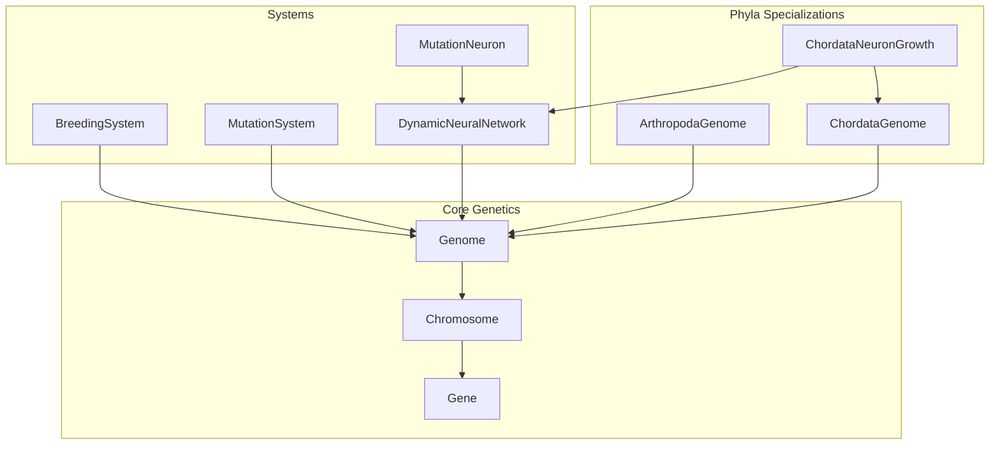
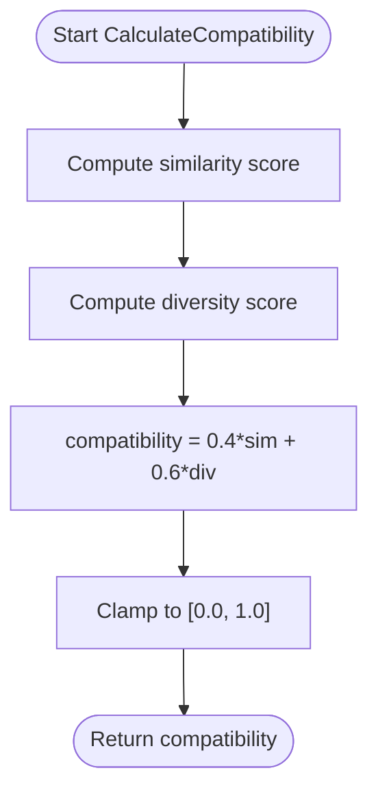
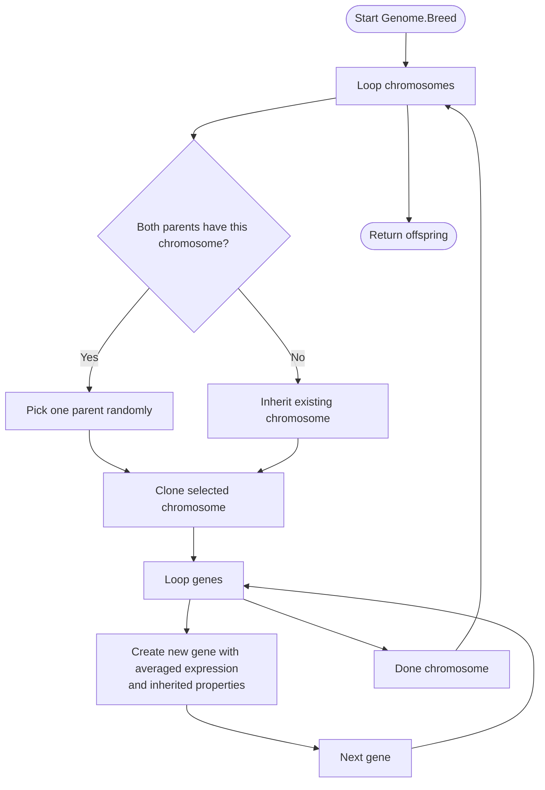
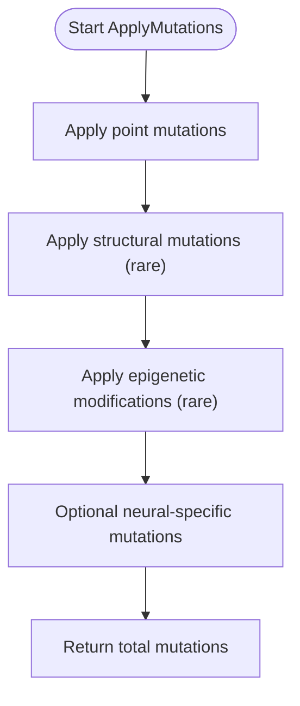
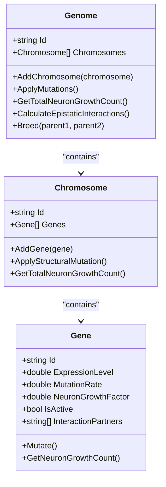
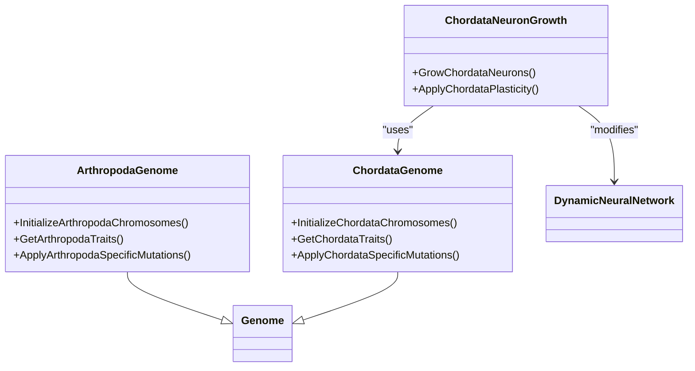
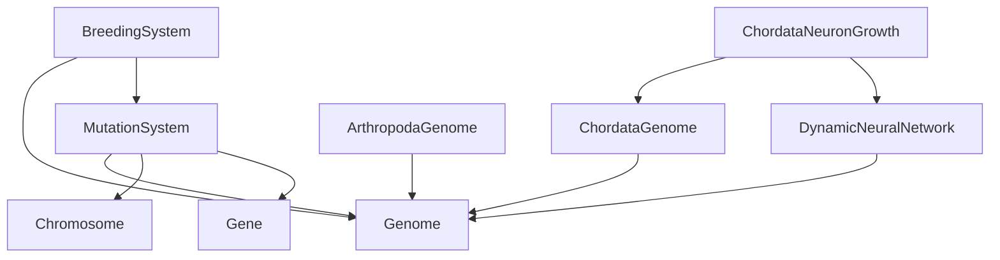

# Breeding and Mutation Systems

<cite>
**Referenced Files in This Document**
- [BreedingSystem.cs](file://GeneticsGame/Systems/BreedingSystem.cs)
- [MutationSystem.cs](file://GeneticsGame/Core/MutationSystem.cs)
- [Genome.cs](file://GeneticsGame/Core/Genome.cs)
- [Chromosome.cs](file://GeneticsGame/Core/Chromosome.cs)
- [Gene.cs](file://GeneticsGame/Core/Gene.cs)
- [GeneticsCore.cs](file://GeneticsGame/Core/GeneticsCore.cs)
- [ArthropodaGenome.cs](file://GeneticsGame/Phyla/Arthropoda/ArthropodaGenome.cs)
- [ChordataGenome.cs](file://GeneticsGame/Phyla/Chordata/ChordataGenome.cs)
- [ChordataNeuronGrowth.cs](file://GeneticsGame/Phyla/Chordata/ChordataNeuronGrowth.cs)
- [DynamicNeuralNetwork.cs](file://GeneticsGame/Systems/DynamicNeuralNetwork.cs)
- [MutationNeuron.cs](file://GeneticsGame/Systems/MutationNeuron.cs)
- [Program.cs](file://GeneticsGame/Program.cs)
</cite>

## Table of Contents
1. [Introduction](#introduction)
2. [Project Structure](#project-structure)
3. [Core Components](#core-components)
4. [Architecture Overview](#architecture-overview)
5. [Detailed Component Analysis](#detailed-component-analysis)
6. [Dependency Analysis](#dependency-analysis)
7. [Performance Considerations](#performance-considerations)
8. [Troubleshooting Guide](#troubleshooting-guide)
9. [Conclusion](#conclusion)

## Introduction
This document explains the breeding and mutation systems that drive evolutionary change and genetic diversity in the simulation. It covers how the BreedingSystem creates offspring via genetic recombination and compatibility assessment, how compatibility scores are computed using genetic distance, expression-level diversity, and evolutionary relationships, and how the MutationSystem introduces random changes during reproduction to balance genetic stability and innovation. Practical examples illustrate scenarios with varying compatibility levels, mutation rates, and resulting genetic outcomes. The systems collectively simulate natural selection, genetic drift, and evolutionary pressure while maintaining a controlled balance between stability and adaptability.

## Project Structure
The genetic systems are organized around core genetic primitives (Gene, Chromosome, Genome) and specialized systems (BreedingSystem, MutationSystem). Taxonomic specializations (ArthropodaGenome, ChordataGenome) extend the base genome with phyla-specific traits and mutation rules. A dynamic neural network integrates genetic signals to grow and evolve neural structures.



**Diagram sources**
- [Genome.cs:1-190](file://GeneticsGame/Core/Genome.cs#L1-L190)
- [Chromosome.cs:1-146](file://GeneticsGame/Core/Chromosome.cs#L1-L146)
- [Gene.cs:1-93](file://GeneticsGame/Core/Gene.cs#L1-L93)
- [BreedingSystem.cs:1-182](file://GeneticsGame/Systems/BreedingSystem.cs#L1-L182)
- [MutationSystem.cs:1-137](file://GeneticsGame/Core/MutationSystem.cs#L1-L137)
- [DynamicNeuralNetwork.cs:1-116](file://GeneticsGame/Systems/DynamicNeuralNetwork.cs#L1-L116)
- [MutationNeuron.cs:1-75](file://GeneticsGame/Systems/MutationNeuron.cs#L1-L75)
- [ArthropodaGenome.cs:1-134](file://GeneticsGame/Phyla/Arthropoda/ArthropodaGenome.cs#L1-L134)
- [ChordataGenome.cs:1-134](file://GeneticsGame/Phyla/Chordata/ChordataGenome.cs#L1-L134)
- [ChordataNeuronGrowth.cs:1-216](file://GeneticsGame/Phyla/Chordata/ChordataNeuronGrowth.cs#L1-L216)

**Section sources**
- [Program.cs:1-58](file://GeneticsGame/Program.cs#L1-L58)

## Core Components
- BreedingSystem orchestrates reproduction, combining two parent genomes into an offspring and applying mutations at a configurable rate. It computes compatibility scores to guide pairing decisions.
- MutationSystem applies three mutation categories: point mutations (gene-level), structural mutations (chromosome-level), and epigenetic modifications. It also supports neural-specific mutations.
- Genome implements inheritance and multi-gene interaction rules, including epistatic interaction calculations and neuron growth potential aggregation.
- Chromosome encapsulates structural mutations (deletion, duplication, inversion, translocation) and contributes to neuron growth counts.
- Gene stores expression levels, mutation rates, neuron growth factors, activity state, and epistatic interaction partners. It mutates expression levels, growth factors, and activity probabilistically.
- Phyla specializations (ArthropodaGenome, ChordataGenome) embed taxon-specific traits and apply specialized mutation multipliers.
- DynamicNeuralNetwork grows neurons based on genetic signals and evolves via activity thresholds and epistatic cues.
- MutationNeuron is a specialized neuron type activated by specific mutation events, integrating mutation history and sensitivity.

**Section sources**
- [BreedingSystem.cs:1-182](file://GeneticsGame/Systems/BreedingSystem.cs#L1-L182)
- [MutationSystem.cs:1-137](file://GeneticsGame/Core/MutationSystem.cs#L1-L137)
- [Genome.cs:1-190](file://GeneticsGame/Core/Genome.cs#L1-L190)
- [Chromosome.cs:1-146](file://GeneticsGame/Core/Chromosome.cs#L1-L146)
- [Gene.cs:1-93](file://GeneticsGame/Core/Gene.cs#L1-L93)
- [ArthropodaGenome.cs:1-134](file://GeneticsGame/Phyla/Arthropoda/ArthropodaGenome.cs#L1-L134)
- [ChordataGenome.cs:1-134](file://GeneticsGame/Phyla/Chordata/ChordataGenome.cs#L1-L134)
- [DynamicNeuralNetwork.cs:1-116](file://GeneticsGame/Systems/DynamicNeuralNetwork.cs#L1-L116)
- [MutationNeuron.cs:1-75](file://GeneticsGame/Systems/MutationNeuron.cs#L1-L75)

## Architecture Overview
The breeding pipeline begins with compatibility assessment, followed by genome recombination, and concludes with mutation application. Offspring inherit genes from parents with averaging of expression levels and inheritance of interaction partners. MutationSystem then introduces variability across point, structural, and epigenetic dimensions, with optional neural-specific mutations. DynamicNeuralNetwork translates genetic signals into evolving neural architectures.

```mermaid
sequenceDiagram
participant BS as "BreedingSystem"
participant MS as "MutationSystem"
participant G1 as "Genome (Parent 1)"
participant G2 as "Genome (Parent 2)"
participant OFF as "Offspring Genome"
BS->>G1 : "Breed(parent1, parent2)"
BS->>G2 : "Breed(parent1, parent2)"
G1-->>BS : "Chromosomes"
G2-->>BS : "Chromosomes"
BS->>OFF : "Create offspring via inheritance"
BS->>MS : "ApplyMutations(offspring, rate)"
MS-->>OFF : "Mutations applied"
BS-->>OFF : "Return offspring"
```

**Diagram sources**
- [BreedingSystem.cs:18-27](file://GeneticsGame/Systems/BreedingSystem.cs#L18-L27)
- [Genome.cs:127-189](file://GeneticsGame/Core/Genome.cs#L127-L189)
- [MutationSystem.cs:17-29](file://GeneticsGame/Core/MutationSystem.cs#L17-L29)

## Detailed Component Analysis

### BreedingSystem
Responsibilities:
- Create offspring via Genome.Breed using chromosome-level random selection and gene-level inheritance with expression averaging.
- Compute compatibility scores combining genetic similarity and diversity to guide pairing.
- Generate random genomes for initial population creation.

Compatibility scoring algorithm:
- Similarity score: ratio of matching gene IDs across chromosomes.
- Diversity score: based on average absolute difference in expression levels for matching genes.
- Combined compatibility: weighted sum favoring diversity with moderate similarity.



**Diagram sources**
- [BreedingSystem.cs:35-45](file://GeneticsGame/Systems/BreedingSystem.cs#L35-L45)
- [BreedingSystem.cs:53-88](file://GeneticsGame/Systems/BreedingSystem.cs#L53-L88)
- [BreedingSystem.cs:96-128](file://GeneticsGame/Systems/BreedingSystem.cs#L96-L128)

Recombination process:
- For each chromosome index, randomly select a parent chromosome if both exist, else inherit the existing one.
- For each gene in the selected chromosome, create a new gene with averaged expression level (plus small noise), inherited mutation rate, and inherited neuron growth factor and interaction partners.



**Diagram sources**
- [Genome.cs:127-189](file://GeneticsGame/Core/Genome.cs#L127-L189)

Examples of compatibility scenarios:
- High similarity, low diversity: compatibility skewed toward similarity; may reduce innovation.
- Low similarity, high diversity: compatibility favors diversity; increases genetic mixing.
- Moderate similarity, high diversity: optimal pairing for balanced evolution.

Mutation application during breeding:
- Offspring receive mutations according to base mutation rate, with structural and epigenetic rates scaled down relative to point mutations.

**Section sources**
- [BreedingSystem.cs:18-27](file://GeneticsGame/Systems/BreedingSystem.cs#L18-L27)
- [BreedingSystem.cs:35-45](file://GeneticsGame/Systems/BreedingSystem.cs#L35-L45)
- [BreedingSystem.cs:53-88](file://GeneticsGame/Systems/BreedingSystem.cs#L53-L88)
- [BreedingSystem.cs:96-128](file://GeneticsGame/Systems/BreedingSystem.cs#L96-L128)
- [Genome.cs:127-189](file://GeneticsGame/Core/Genome.cs#L127-L189)

### MutationSystem
Mutation categories and mechanics:
- Point mutations: per-gene mutation with probability proportional to gene’s mutation rate; adjusts expression level, neuron growth factor, and activation state.
- Structural mutations: per-chromosome probability; applies one of deletion, duplication, inversion, or translocation to gene segments.
- Epigenetic modifications: per-gene probability; adjusts expression level and activation threshold without altering sequence.
- Neural-specific mutations: targeted adjustments to neuron growth factors and expression levels for neural genes.



**Diagram sources**
- [MutationSystem.cs:17-29](file://GeneticsGame/Core/MutationSystem.cs#L17-L29)
- [MutationSystem.cs:37-54](file://GeneticsGame/Core/MutationSystem.cs#L37-L54)
- [MutationSystem.cs:62-76](file://GeneticsGame/Core/MutationSystem.cs#L62-L76)
- [MutationSystem.cs:84-103](file://GeneticsGame/Core/MutationSystem.cs#L84-L103)
- [MutationSystem.cs:111-136](file://GeneticsGame/Core/MutationSystem.cs#L111-L136)

MutationNeuron integration:
- Specialized neurons activated by mutation events, accumulating activating genes and increasing activation strength, enabling mutation-responsive neural behavior.

**Section sources**
- [MutationSystem.cs:1-137](file://GeneticsGame/Core/MutationSystem.cs#L1-L137)
- [MutationNeuron.cs:1-75](file://GeneticsGame/Systems/MutationNeuron.cs#L1-L75)

### Genome, Chromosome, and Gene
Genome:
- Aggregates chromosomes and exposes breeding, mutation application, neuron growth potential calculation, and epistatic interaction computation.
- Breeding produces offspring with averaged expression levels and inherited interaction partners.

Chromosome:
- Holds genes and supports structural mutations with bounded segment sizes and random positions.

Gene:
- Stores expression level, mutation rate, neuron growth factor, activity state, and interaction partners.
- Mutations adjust expression and growth factor within constrained ranges and toggle activity with bias.



**Diagram sources**
- [Genome.cs:1-190](file://GeneticsGame/Core/Genome.cs#L1-L190)
- [Chromosome.cs:1-146](file://GeneticsGame/Core/Chromosome.cs#L1-L146)
- [Gene.cs:1-93](file://GeneticsGame/Core/Gene.cs#L1-L93)

**Section sources**
- [Genome.cs:1-190](file://GeneticsGame/Core/Genome.cs#L1-L190)
- [Chromosome.cs:1-146](file://GeneticsGame/Core/Chromosome.cs#L1-L146)
- [Gene.cs:1-93](file://GeneticsGame/Core/Gene.cs#L1-L93)

### Phyla Specializations
ArthropodaGenome:
- Initializes arthropod-specific chromosomes and genes (e.g., exoskeleton, segmentation, limbs, neural ganglia, metabolism).
- Applies increased mutation rates for neural and exoskeleton genes.

ChordataGenome:
- Initializes chordate-specific chromosomes and genes (e.g., spine, brain, limbs, sensory systems, metabolism).
- Applies increased mutation rates for neural and skeletal genes.

ChordataNeuronGrowth:
- Grows neurons following vertebrate-like patterns, influenced by traits such as spine length, brain size, and synapse density.
- Applies neural plasticity rules tailored to vision, balance, and general neural connectivity.



**Diagram sources**
- [ArthropodaGenome.cs:1-134](file://GeneticsGame/Phyla/Arthropoda/ArthropodaGenome.cs#L1-L134)
- [ChordataGenome.cs:1-134](file://GeneticsGame/Phyla/Chordata/ChordataGenome.cs#L1-L134)
- [ChordataNeuronGrowth.cs:1-216](file://GeneticsGame/Phyla/Chordata/ChordataNeuronGrowth.cs#L1-L216)

**Section sources**
- [ArthropodaGenome.cs:1-134](file://GeneticsGame/Phyla/Arthropoda/ArthropodaGenome.cs#L1-L134)
- [ChordataGenome.cs:1-134](file://GeneticsGame/Phyla/Chordata/ChordataGenome.cs#L1-L134)
- [ChordataNeuronGrowth.cs:1-216](file://GeneticsGame/Phyla/Chordata/ChordataNeuronGrowth.cs#L1-L216)

### DynamicNeuralNetwork and Genetic Integration
DynamicNeuralNetwork:
- Grows neurons based on genome’s total neuron growth potential, capped by global configuration.
- Determines neuron types via epistatic interactions and activity thresholds.
- Updates activity level as the mean activation across neurons.

Integration with genetics:
- Neuron growth depends on expression levels and neuron growth factors encoded in genes.
- Epistatic interactions influence neuron type assignment and subsequent neural plasticity.

**Section sources**
- [DynamicNeuralNetwork.cs:1-116](file://GeneticsGame/Systems/DynamicNeuralNetwork.cs#L1-L116)
- [GeneticsCore.cs:1-21](file://GeneticsGame/Core/GeneticsCore.cs#L1-L21)

## Dependency Analysis
Key dependencies:
- BreedingSystem depends on Genome for inheritance and on MutationSystem for post-reproduction mutations.
- MutationSystem operates on Genome, Chromosome, and Gene structures.
- DynamicNeuralNetwork consumes Genome-derived signals to grow and evolve.
- Phyla specializations extend Genome and integrate with neural growth mechanisms.



**Diagram sources**
- [BreedingSystem.cs:1-182](file://GeneticsGame/Systems/BreedingSystem.cs#L1-L182)
- [MutationSystem.cs:1-137](file://GeneticsGame/Core/MutationSystem.cs#L1-L137)
- [Genome.cs:1-190](file://GeneticsGame/Core/Genome.cs#L1-L190)
- [Chromosome.cs:1-146](file://GeneticsGame/Core/Chromosome.cs#L1-L146)
- [Gene.cs:1-93](file://GeneticsGame/Core/Gene.cs#L1-L93)
- [DynamicNeuralNetwork.cs:1-116](file://GeneticsGame/Systems/DynamicNeuralNetwork.cs#L1-L116)
- [ArthropodaGenome.cs:1-134](file://GeneticsGame/Phyla/Arthropoda/ArthropodaGenome.cs#L1-L134)
- [ChordataGenome.cs:1-134](file://GeneticsGame/Phyla/Chordata/ChordataGenome.cs#L1-L134)
- [ChordataNeuronGrowth.cs:1-216](file://GeneticsGame/Phyla/Chordata/ChordataNeuronGrowth.cs#L1-L216)

**Section sources**
- [BreedingSystem.cs:1-182](file://GeneticsGame/Systems/BreedingSystem.cs#L1-L182)
- [MutationSystem.cs:1-137](file://GeneticsGame/Core/MutationSystem.cs#L1-L137)
- [Genome.cs:1-190](file://GeneticsGame/Core/Genome.cs#L1-L190)
- [Chromosome.cs:1-146](file://GeneticsGame/Core/Chromosome.cs#L1-L146)
- [Gene.cs:1-93](file://GeneticsGame/Core/Gene.cs#L1-L93)
- [DynamicNeuralNetwork.cs:1-116](file://GeneticsGame/Systems/DynamicNeuralNetwork.cs#L1-L116)
- [ArthropodaGenome.cs:1-134](file://GeneticsGame/Phyla/Arthropoda/ArthropodaGenome.cs#L1-L134)
- [ChordataGenome.cs:1-134](file://GeneticsGame/Phyla/Chordata/ChordataGenome.cs#L1-L134)
- [ChordataNeuronGrowth.cs:1-216](file://GeneticsGame/Phyla/Chordata/ChordataNeuronGrowth.cs#L1-L216)

## Performance Considerations
- Compatibility scoring iterates across all genes in both genomes; complexity scales with total gene count. Consider indexing gene IDs or limiting comparisons to active genes for large genomes.
- Structural mutations operate on chromosome segments; cap segment sizes and mutation probabilities to avoid excessive churn.
- MutationSystem applies mutations per-gene/per-chromosome; batching or probabilistic early exits can reduce overhead for sparse mutation rates.
- DynamicNeuralNetwork growth caps neuron additions per generation to prevent uncontrolled expansion; tune the cap based on computational budget.

## Troubleshooting Guide
Common issues and resolutions:
- Offspring identical to parents: verify mutation rate is sufficiently high and that point and structural mutations are being applied.
- Unexpected neural growth: check epistatic interactions and neuron growth factors; confirm activity thresholds and growth caps are configured appropriately.
- Poor pairing decisions: adjust compatibility weights and consider adding fitness-based modifiers to the compatibility score.
- Imbalanced mutation effects: review mutation rate scaling for structural and epigenetic categories; ensure neural-specific mutations align with intended behavior.

**Section sources**
- [MutationSystem.cs:17-29](file://GeneticsGame/Core/MutationSystem.cs#L17-L29)
- [GeneticsCore.cs:14-21](file://GeneticsGame/Core/GeneticsCore.cs#L14-L21)
- [DynamicNeuralNetwork.cs:63-99](file://GeneticsGame/Systems/DynamicNeuralNetwork.cs#L63-L99)
- [BreedingSystem.cs:42-44](file://GeneticsGame/Systems/BreedingSystem.cs#L42-L44)

## Conclusion
The breeding and mutation systems form a cohesive evolutionary engine. BreedingSystem’s compatibility scoring and recombination establish the foundation for genetic mixing, while MutationSystem introduces variability across multiple layers—point, structural, epigenetic, and neural—balancing stability and innovation. Phyla specializations tailor mutation dynamics to taxonomic contexts, and DynamicNeuralNetwork translates genetic signals into evolving neural architectures. Together, these components simulate natural selection, genetic drift, and evolutionary pressure, enabling adaptive evolution within controlled parameters.