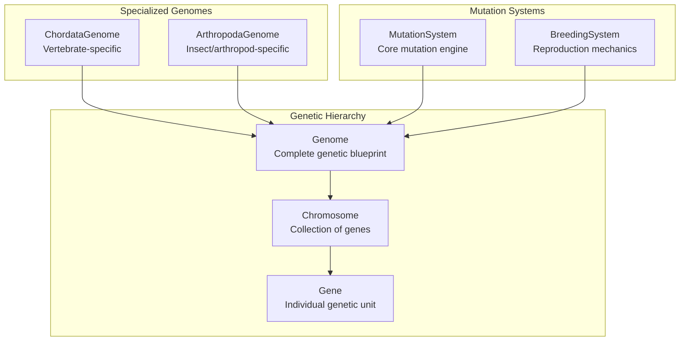
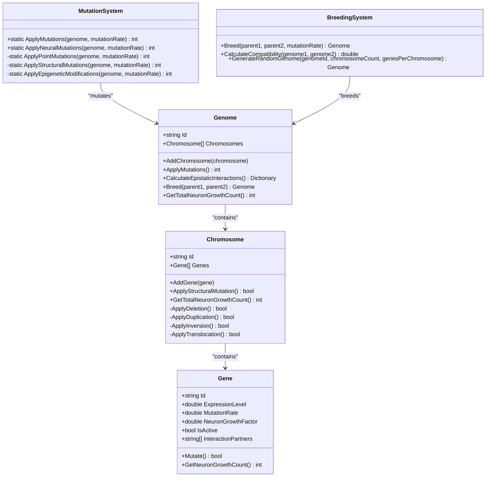
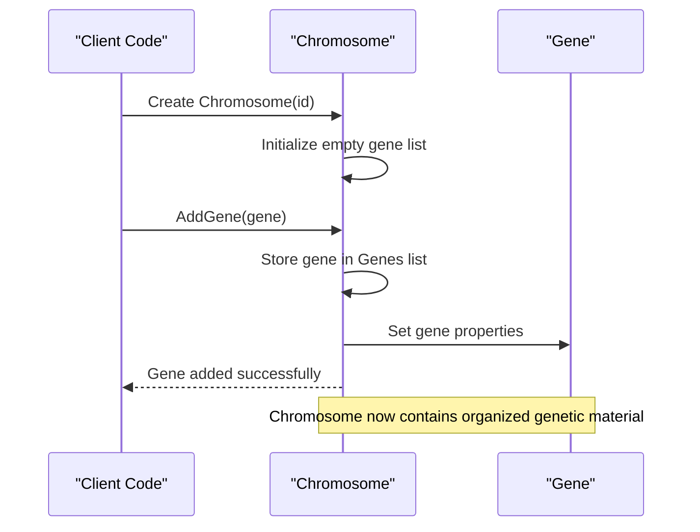
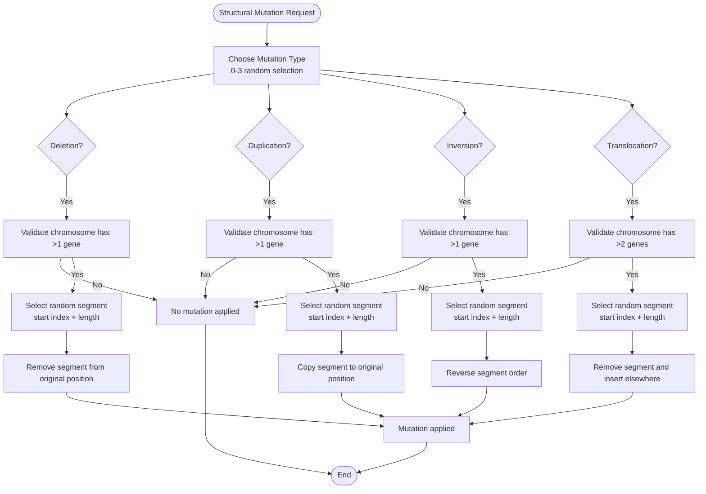
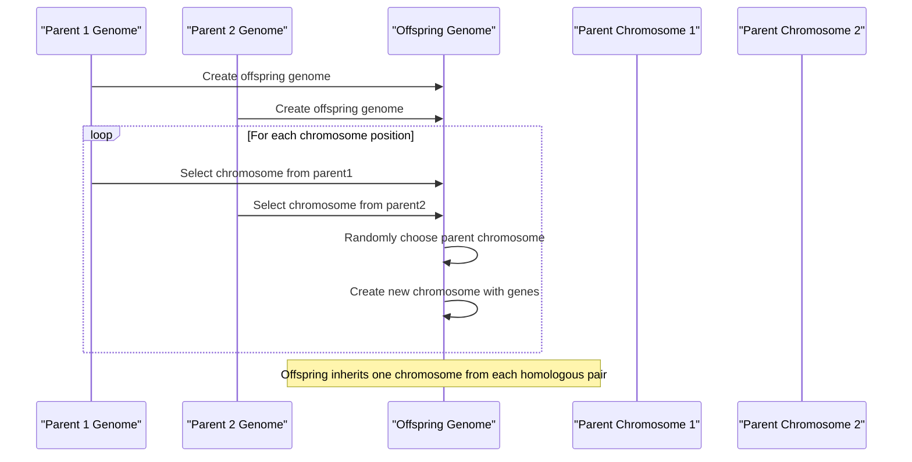
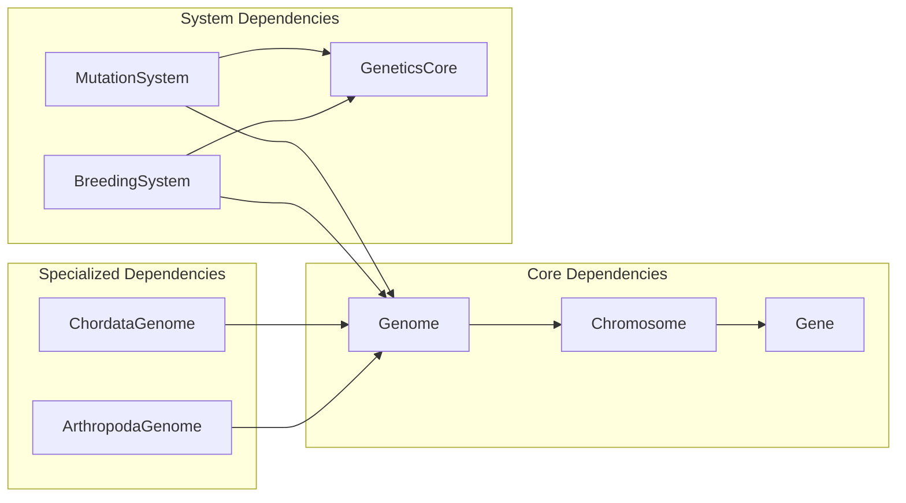

# Chromosome Implementation

<cite>
**Referenced Files in This Document**
- [Chromosome.cs](file://GeneticsGame/Core/Chromosome.cs)
- [Genome.cs](file://GeneticsGame/Core/Genome.cs)
- [Gene.cs](file://GeneticsGame/Core/Gene.cs)
- [MutationSystem.cs](file://GeneticsGame/Core/MutationSystem.cs)
- [BreedingSystem.cs](file://GeneticsGame/Systems/BreedingSystem.cs)
- [GeneticsCore.cs](file://GeneticsGame/Core/GeneticsCore.cs)
- [ChordataGenome.cs](file://GeneticsGame/Phyla/Chordata/ChordataGenome.cs)
- [ArthropodaGenome.cs](file://GeneticsGame/Phyla/Arthropoda/ArthropodaGenome.cs)
</cite>

## Table of Contents
1. [Introduction](#introduction)
2. [Project Structure](#project-structure)
3. [Core Components](#core-components)
4. [Architecture Overview](#architecture-overview)
5. [Detailed Component Analysis](#detailed-component-analysis)
6. [Dependency Analysis](#dependency-analysis)
7. [Performance Considerations](#performance-considerations)
8. [Troubleshooting Guide](#troubleshooting-guide)
9. [Conclusion](#conclusion)

## Introduction
This document provides comprehensive technical documentation for the Chromosome class, which serves as the fundamental organizational unit for genetic material within the genome. The chromosome implementation manages gene collections, supports structural mutations, and contributes to genetic diversity through various mutation mechanisms. It forms the foundation for genetic inheritance during reproduction and enables evolutionary adaptation through mutation and selection processes.

The chromosome system integrates with broader genetic frameworks including gene expression regulation, epistatic interactions, and species-specific adaptations across different phyla. This documentation explains the chromosome's structural organization, mutation capabilities, inheritance mechanisms, and evolutionary significance within the 3D Genetics Game ecosystem.

## Project Structure
The genetic system follows a hierarchical organization where chromosomes contain genes, genomes contain chromosomes, and specialized genome implementations provide phyla-specific adaptations. The core genetic components work together to simulate biological inheritance and evolution.

**Diagram sources**
- [Genome.cs:9-38](file://GeneticsGame/Core/Genome.cs#L9-L38)
- [Chromosome.cs:9-29](file://GeneticsGame/Core/Chromosome.cs#L9-L29)
- [Gene.cs:9-57](file://GeneticsGame/Core/Gene.cs#L9-L57)

**Section sources**
- [Genome.cs:1-190](file://GeneticsGame/Core/Genome.cs#L1-L190)
- [Chromosome.cs:1-146](file://GeneticsGame/Core/Chromosome.cs#L1-L146)
- [Gene.cs:1-93](file://GeneticsGame/Core/Gene.cs#L1-L93)

## Core Components
The chromosome system consists of several interconnected components that work together to manage genetic information and facilitate evolution:

### Chromosome Class
The Chromosome class serves as the primary container for genetic material, managing collections of genes and providing mutation capabilities. It maintains unique identifiers and gene lists while supporting structural modifications that drive genetic diversity.

### Gene Class
Genes represent individual units of hereditary information with adjustable expression levels, mutation rates, and neural growth factors. They form the building blocks of chromosome organization and contribute to phenotypic expression.

### Genome Class
Genomes represent complete genetic blueprints containing multiple chromosomes. They coordinate gene expression, epistatic interactions, and inheritance mechanisms across the entire genetic complement.

### Mutation System
The mutation system provides comprehensive genetic modification capabilities including point mutations, structural rearrangements, epigenetic changes, and neural-specific adaptations.

**Section sources**
- [Chromosome.cs:9-146](file://GeneticsGame/Core/Chromosome.cs#L9-L146)
- [Gene.cs:9-93](file://GeneticsGame/Core/Gene.cs#L9-L93)
- [Genome.cs:9-190](file://GeneticsGame/Core/Genome.cs#L9-L190)
- [MutationSystem.cs:9-137](file://GeneticsGame/Core/MutationSystem.cs#L9-L137)

## Architecture Overview
The chromosome implementation follows a layered architecture where each component has specific responsibilities while maintaining clear interfaces for interaction. The system supports both individual gene manipulation and chromosome-level structural changes.

**Diagram sources**
- [Chromosome.cs:9-146](file://GeneticsGame/Core/Chromosome.cs#L9-L146)
- [Gene.cs:9-93](file://GeneticsGame/Core/Gene.cs#L9-L93)
- [Genome.cs:9-190](file://GeneticsGame/Core/Genome.cs#L9-L190)
- [MutationSystem.cs:9-137](file://GeneticsGame/Core/MutationSystem.cs#L9-L137)
- [BreedingSystem.cs:9-182](file://GeneticsGame/Systems/BreedingSystem.cs#L9-L182)

## Detailed Component Analysis

### Chromosome Structure and Organization
The chromosome serves as a container for genetic material, organizing genes into functional units that can undergo various types of mutations. Each chromosome maintains a unique identifier and a collection of genes arranged in a linear sequence.

**Diagram sources**
- [Chromosome.cs:25-38](file://GeneticsGame/Core/Chromosome.cs#L25-L38)
- [Gene.cs:49-57](file://GeneticsGame/Core/Gene.cs#L49-L57)

The chromosome's internal organization supports efficient gene access and manipulation while maintaining structural integrity. Gene arrangement follows logical groupings that reflect biological function and evolutionary conservation.

**Section sources**
- [Chromosome.cs:9-38](file://GeneticsGame/Core/Chromosome.cs#L9-L38)
- [Gene.cs:9-57](file://GeneticsGame/Core/Gene.cs#L9-L57)

### Structural Mutation Capabilities
Chromosomes support four primary types of structural mutations that alter gene arrangement and potentially affect gene expression:

#### Deletion Mutations
Deletion mutations remove random segments of genes from the chromosome, reducing genetic material and potentially eliminating important regulatory sequences or protein-coding regions.

#### Duplication Mutations
Duplication mutations create copies of gene segments, increasing genetic redundancy and providing raw material for evolutionary innovation while potentially disrupting existing gene regulation.

#### Inversion Mutations
Inversion mutations reverse gene order within segments, affecting gene expression patterns and potentially disrupting regulatory element positioning without losing genetic information.

#### Translocation Mutations
Translocation mutations move gene segments to different locations within or between chromosomes, potentially creating new gene combinations and regulatory interactions.

**Diagram sources**
- [Chromosome.cs:44-136](file://GeneticsGame/Core/Chromosome.cs#L44-L136)

Each mutation type operates on random segments with length constraints to prevent excessive disruption of genetic material. The mutation process maintains chromosome viability while introducing genetic variation.

**Section sources**
- [Chromosome.cs:44-136](file://GeneticsGame/Core/Chromosome.cs#L44-L136)

### Genetic Inheritance Mechanisms
Chromosomes play a crucial role in genetic inheritance through meiotic processes and gamete formation. The system implements Mendelian inheritance principles with modern genetic complexity:

**Diagram sources**
- [Genome.cs:134-189](file://GeneticsGame/Core/Genome.cs#L134-L189)

The inheritance system ensures genetic diversity while maintaining hereditary continuity. Each offspring receives a unique combination of parental chromosomes, with genes inheriting expression levels, mutation rates, and interaction partners.

**Section sources**
- [Genome.cs:127-189](file://GeneticsGame/Core/Genome.cs#L127-L189)

### Mutation Integration and Effects
Chromosomes integrate with the broader mutation system to provide comprehensive genetic modification capabilities. The mutation system applies multiple types of changes simultaneously:

#### Point Mutations
Individual gene expression levels and parameters are modified through point mutations, affecting protein production and cellular function.

#### Structural Mutations
Chromosome-level rearrangements alter gene organization and potentially disrupt or enhance regulatory mechanisms.

#### Epigenetic Modifications
Expression levels can be adjusted without changing DNA sequence, affecting gene activity and cellular behavior.

#### Neural-Specific Mutations
Specialized mutations target neural development genes, affecting brain size, synapse density, and cognitive abilities.

**Section sources**
- [MutationSystem.cs:17-137](file://GeneticsGame/Core/MutationSystem.cs#L17-L137)
- [Genome.cs:44-66](file://GeneticsGame/Core/Genome.cs#L44-L66)

### Species-Specific Adaptations
Different phyla demonstrate specialized chromosome arrangements adapted to their biological requirements:

#### Chordata Chromosome Organization
Chordata genomes organize genes into specialized chromosomes for different body systems:
- Spinal development genes for vertebral column formation
- Neural development genes for brain and nervous system growth
- Limb development genes for appendage formation
- Sensory system genes for perception and coordination
- Metabolic genes for energy processing and homeostasis

#### Arthropoda Chromosome Organization
Arthropoda genomes focus on exoskeleton development and segmentation:
- Exoskeleton development genes for protective covering
- Segmentation genes for body plan organization
- Limb development genes for locomotion and feeding
- Neural development genes for centralized nervous system
- Metabolic genes for environmental adaptation

**Section sources**
- [ChordataGenome.cs:9-134](file://GeneticsGame/Phyla/Chordata/ChordataGenome.cs#L9-L134)
- [ArthropodaGenome.cs:9-134](file://GeneticsGame/Phyla/Arthropoda/ArthropodaGenome.cs#L9-L134)

## Dependency Analysis
The chromosome system maintains clear dependencies with other genetic components while supporting bidirectional interactions:

**Diagram sources**
- [Chromosome.cs:1-4](file://GeneticsGame/Core/Chromosome.cs#L1-L4)
- [Genome.cs:1-6](file://GeneticsGame/Core/Genome.cs#L1-L6)
- [MutationSystem.cs:1-6](file://GeneticsGame/Core/MutationSystem.cs#L1-L6)
- [BreedingSystem.cs:1-6](file://GeneticsGame/Systems/BreedingSystem.cs#L1-L6)
- [GeneticsCore.cs:9-19](file://GeneticsGame/Core/GeneticsCore.cs#L9-L19)

The dependency structure ensures modularity while enabling complex genetic interactions. Each component has specific responsibilities with minimal coupling to other systems.

**Section sources**
- [Chromosome.cs:1-4](file://GeneticsGame/Core/Chromosome.cs#L1-L4)
- [Genome.cs:1-6](file://GeneticsGame/Core/Genome.cs#L1-L6)
- [MutationSystem.cs:1-6](file://GeneticsGame/Core/MutationSystem.cs#L1-L6)
- [BreedingSystem.cs:1-6](file://GeneticsGame/Systems/BreedingSystem.cs#L1-L6)

## Performance Considerations
The chromosome implementation prioritizes computational efficiency while maintaining biological accuracy:

### Memory Management
- Chromosome gene lists use dynamic allocation to accommodate varying gene counts
- Structural mutation operations minimize memory allocations through in-place modifications
- Gene objects maintain compact property sets to reduce memory overhead

### Computational Efficiency
- Mutation operations use O(n) time complexity for gene-level changes
- Structural mutations operate in O(k) time where k is the segment length
- Breeding operations scale linearly with chromosome and gene counts
- Epistatic interaction calculations optimize gene lookup through dictionary structures

### Optimization Strategies
- Random number generation uses efficient shared generators
- Mutation probability calculations avoid expensive operations
- Gene expression level bounds checking prevents overflow conditions
- Neural growth calculations use bounded integer arithmetic

## Troubleshooting Guide
Common issues and solutions when working with the chromosome system:

### Mutation Failure Scenarios
- **Insufficient gene count**: Structural mutations require minimum gene counts; ensure chromosomes have adequate genes before applying mutations
- **Invalid segment selection**: Mutation operations validate segment boundaries to prevent out-of-range errors
- **Type conversion issues**: Ensure proper type casting when working with generic gene types

### Inheritance Problems
- **Chromosome mismatch**: Breeding requires compatible chromosome counts; handle cases where parents have different chromosome numbers
- **Gene ID conflicts**: Ensure unique gene identifiers to prevent interaction partner resolution failures
- **Expression level normalization**: Verify expression levels remain within valid ranges after mutations

### Performance Issues
- **Large genome processing**: Consider breaking large genomes into smaller chunks for mutation operations
- **Memory constraints**: Monitor chromosome sizes to prevent excessive memory usage during structural mutations
- **Random seed management**: Use appropriate random number generation for reproducible results

**Section sources**
- [Chromosome.cs:68-136](file://GeneticsGame/Core/Chromosome.cs#L68-L136)
- [Genome.cs:134-189](file://GeneticsGame/Core/Genome.cs#L134-L189)
- [MutationSystem.cs:17-137](file://GeneticsGame/Core/MutationSystem.cs#L17-L137)

## Conclusion
The chromosome implementation provides a robust foundation for genetic computation within the 3D Genetics Game. By organizing genes into structured units and supporting diverse mutation mechanisms, chromosomes enable realistic simulation of genetic inheritance, evolution, and adaptation. The system's modular design facilitates species-specific adaptations while maintaining computational efficiency and biological accuracy.

The chromosome system successfully bridges molecular genetics with organism-level traits, supporting complex behaviors like neural development, morphological differentiation, and environmental adaptation. Through careful mutation management and inheritance mechanisms, the implementation enables meaningful evolutionary dynamics while preserving genetic stability when required.

Future enhancements could include more sophisticated gene regulation modeling, advanced chromosomal structural features, and expanded epigenetic modification capabilities to further refine the biological realism of the genetic simulation.