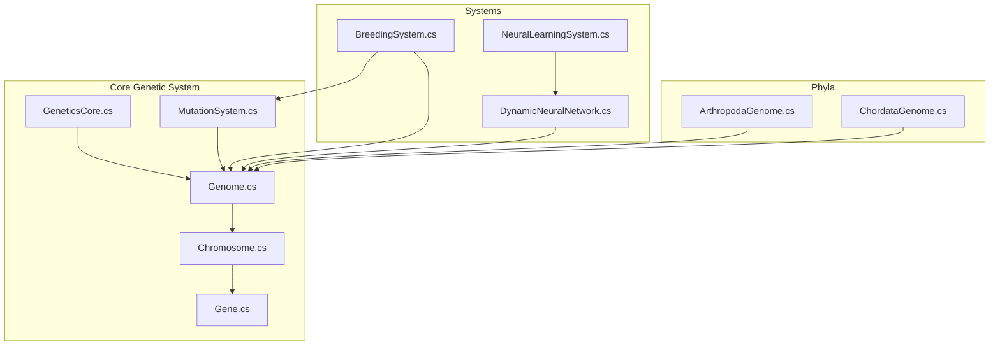
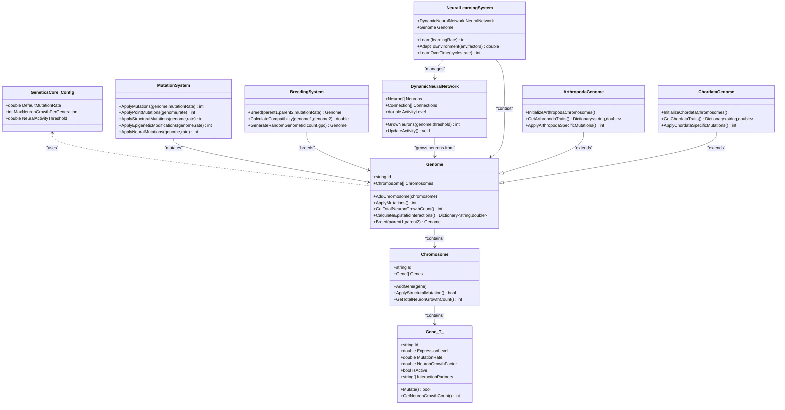
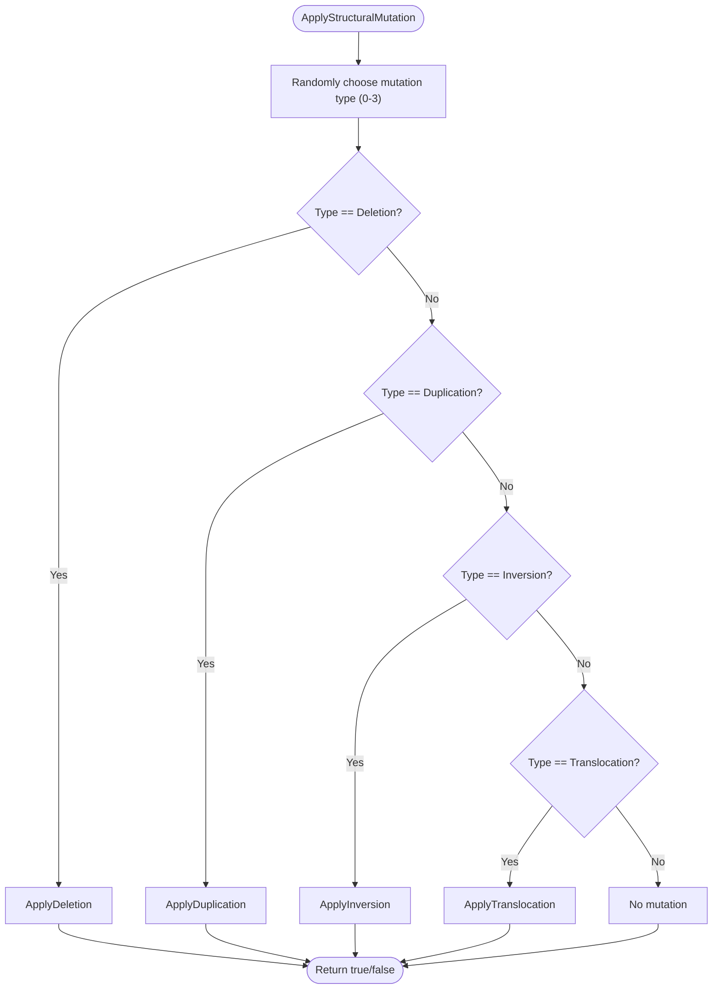
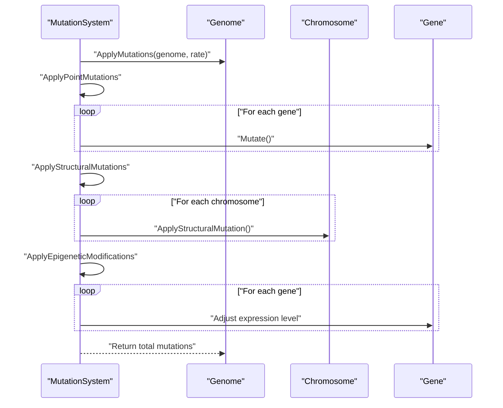
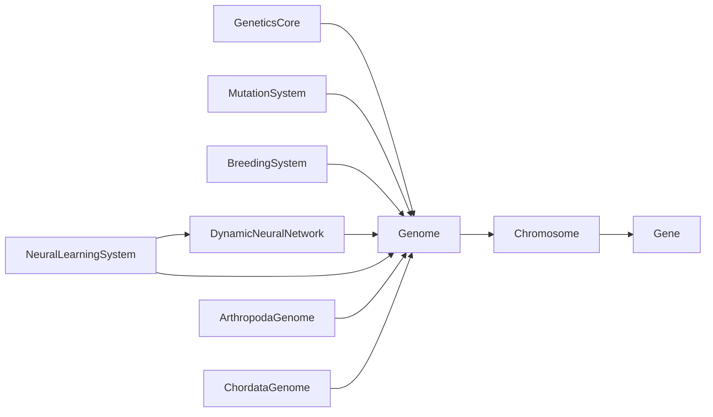

# Core Genetic System

<cite>
**Referenced Files in This Document**
- [GeneticsCore.cs](file://GeneticsGame/Core/GeneticsCore.cs)
- [Genome.cs](file://GeneticsGame/Core/Genome.cs)
- [Chromosome.cs](file://GeneticsGame/Core/Chromosome.cs)
- [Gene.cs](file://GeneticsGame/Core/Gene.cs)
- [MutationSystem.cs](file://GeneticsGame/Core/MutationSystem.cs)
- [BreedingSystem.cs](file://GeneticsGame/Systems/BreedingSystem.cs)
- [DynamicNeuralNetwork.cs](file://GeneticsGame/Systems/DynamicNeuralNetwork.cs)
- [NeuralLearningSystem.cs](file://GeneticsGame/Systems/NeuralLearningSystem.cs)
- [ArthropodaGenome.cs](file://GeneticsGame/Phyla/Arthropoda/ArthropodaGenome.cs)
- [ChordataGenome.cs](file://GeneticsGame/Phyla/Chordata/ChordataGenome.cs)
- [Program.cs](file://GeneticsGame/Program.cs)
</cite>

## Table of Contents
1. [Introduction](#introduction)
2. [Project Structure](#project-structure)
3. [Core Components](#core-components)
4. [Architecture Overview](#architecture-overview)
5. [Detailed Component Analysis](#detailed-component-analysis)
6. [Dependency Analysis](#dependency-analysis)
7. [Performance Considerations](#performance-considerations)
8. [Troubleshooting Guide](#troubleshooting-guide)
9. [Conclusion](#conclusion)
10. [Appendices](#appendices)

## Introduction
This document explains the core genetic system that underpins the 3D Genetics simulation. It covers the hierarchical genetic structure from Gene to Chromosome to Genome, the GeneticsCore configuration constants, the Genome class as the complete genetic blueprint, Chromosome structure and mutation capabilities, the Gene class and its regulatory mechanisms, and the MutationSystem architecture including point mutations, structural mutations, and epigenetic modifications. Practical examples demonstrate genetic inheritance patterns, mutation effects, and compatibility scoring. Finally, it addresses the relationship between genotype and phenotype expressions within the simulation context.

## Project Structure
The genetic system is organized around a core set of classes in the Core folder, with specialized implementations for different phyla in the Phyla folder. The Systems folder integrates genetics with neural networks and breeding mechanics.



**Diagram sources**
- [GeneticsCore.cs:1-21](file://GeneticsGame/Core/GeneticsCore.cs#L1-L21)
- [Genome.cs:1-190](file://GeneticsGame/Core/Genome.cs#L1-L190)
- [Chromosome.cs:1-146](file://GeneticsGame/Core/Chromosome.cs#L1-L146)
- [Gene.cs:1-93](file://GeneticsGame/Core/Gene.cs#L1-L93)
- [MutationSystem.cs:1-137](file://GeneticsGame/Core/MutationSystem.cs#L1-L137)
- [BreedingSystem.cs:1-182](file://GeneticsGame/Systems/BreedingSystem.cs#L1-L182)
- [DynamicNeuralNetwork.cs:1-116](file://GeneticsGame/Systems/DynamicNeuralNetwork.cs#L1-L116)
- [NeuralLearningSystem.cs:1-122](file://GeneticsGame/Systems/NeuralLearningSystem.cs#L1-L122)
- [ArthropodaGenome.cs:1-134](file://GeneticsGame/Phyla/Arthropoda/ArthropodaGenome.cs#L1-L134)
- [ChordataGenome.cs:1-134](file://GeneticsGame/Phyla/Chordata/ChordataGenome.cs#L1-L134)

**Section sources**
- [GeneticsCore.cs:1-21](file://GeneticsGame/Core/GeneticsCore.cs#L1-L21)
- [Genome.cs:1-190](file://GeneticsGame/Core/Genome.cs#L1-L190)
- [Chromosome.cs:1-146](file://GeneticsGame/Core/Chromosome.cs#L1-L146)
- [Gene.cs:1-93](file://GeneticsGame/Core/Gene.cs#L1-L93)
- [MutationSystem.cs:1-137](file://GeneticsGame/Core/MutationSystem.cs#L1-L137)
- [BreedingSystem.cs:1-182](file://GeneticsGame/Systems/BreedingSystem.cs#L1-L182)
- [DynamicNeuralNetwork.cs:1-116](file://GeneticsGame/Systems/DynamicNeuralNetwork.cs#L1-L116)
- [NeuralLearningSystem.cs:1-122](file://GeneticsGame/Systems/NeuralLearningSystem.cs#L1-L122)
- [ArthropodaGenome.cs:1-134](file://GeneticsGame/Phyla/Arthropoda/ArthropodaGenome.cs#L1-L134)
- [ChordataGenome.cs:1-134](file://GeneticsGame/Phyla/Chordata/ChordataGenome.cs#L1-L134)

## Core Components
This section documents the foundational genetic building blocks and their roles.

- GeneticsCore.Config: Provides global constants that govern genetic behavior, including default mutation rate, maximum neuron growth per generation, and neural activity threshold.
- Genome: Represents the complete genetic blueprint, managing chromosomes, applying mutations, calculating epistatic interactions, and performing breeding.
- Chromosome: Groups genes and supports structural mutations (deletion, duplication, inversion, translocation).
- Gene: Encapsulates hereditary units with expression levels, mutation rates, neuron growth factors, activity state, and epistatic interaction partners.
- MutationSystem: Central engine for applying point mutations, structural mutations, epigenetic modifications, and neural-specific mutations.

**Section sources**
- [GeneticsCore.cs:14-20](file://GeneticsGame/Core/GeneticsCore.cs#L14-L20)
- [Genome.cs:9-190](file://GeneticsGame/Core/Genome.cs#L9-L190)
- [Chromosome.cs:9-146](file://GeneticsGame/Core/Chromosome.cs#L9-L146)
- [Gene.cs:9-93](file://GeneticsGame/Core/Gene.cs#L9-L93)
- [MutationSystem.cs:9-137](file://GeneticsGame/Core/MutationSystem.cs#L9-L137)

## Architecture Overview
The genetic architecture follows a layered hierarchy with clear responsibilities and interactions. The core genetic classes form the foundation, while specialized phyla classes extend the base genome with species-specific genes. Systems integrate genetics with neural growth and learning.



**Diagram sources**
- [GeneticsCore.cs:14-20](file://GeneticsGame/Core/GeneticsCore.cs#L14-L20)
- [Gene.cs:9-93](file://GeneticsGame/Core/Gene.cs#L9-L93)
- [Chromosome.cs:9-146](file://GeneticsGame/Core/Chromosome.cs#L9-L146)
- [Genome.cs:9-190](file://GeneticsGame/Core/Genome.cs#L9-L190)
- [MutationSystem.cs:9-137](file://GeneticsGame/Core/MutationSystem.cs#L9-L137)
- [BreedingSystem.cs:9-182](file://GeneticsGame/Systems/BreedingSystem.cs#L9-L182)
- [DynamicNeuralNetwork.cs:9-116](file://GeneticsGame/Systems/DynamicNeuralNetwork.cs#L9-L116)
- [NeuralLearningSystem.cs:9-122](file://GeneticsGame/Systems/NeuralLearningSystem.cs#L9-L122)
- [ArthropodaGenome.cs:9-134](file://GeneticsGame/Phyla/Arthropoda/ArthropodaGenome.cs#L9-L134)
- [ChordataGenome.cs:9-134](file://GeneticsGame/Phyla/Chordata/ChordataGenome.cs#L9-L134)

## Detailed Component Analysis

### GeneticsCore.Configuration Constants
GeneticsCore.Config centralizes global genetic parameters:
- DefaultMutationRate: Base probability for point mutations.
- MaxNeuronGrowthPerGeneration: Caps neuron growth per generation to maintain stability.
- NeuralActivityThreshold: Minimum activity level required to trigger neuron growth.

These constants are consumed by the Genome and MutationSystem to regulate mutation application and neural growth.

**Section sources**
- [GeneticsCore.cs:14-20](file://GeneticsGame/Core/GeneticsCore.cs#L14-L20)
- [Genome.cs:72-75](file://GeneticsGame/Core/Genome.cs#L72-L75)
- [MutationSystem.cs:17-29](file://GeneticsGame/Core/MutationSystem.cs#L17-L29)
- [DynamicNeuralNetwork.cs:63-71](file://GeneticsGame/Systems/DynamicNeuralNetwork.cs#L63-L71)

### Genome: Complete Genetic Blueprint
The Genome class encapsulates the entire genetic makeup:
- Chromosome management: Adding and organizing chromosomes.
- Mutation application: Iterates genes and chromosomes to apply mutations.
- Neuron growth calculation: Sums neuron growth potential across all genes.
- Epistatic interaction calculation: Computes interaction strengths across genes using expression levels and interaction partners.
- Breeding: Implements a simplified Mendelian-like inheritance model by selecting random parental chromosomes and averaging gene properties with small variation.

Key behaviors:
- ApplyMutations orchestrates point and structural mutations across all genes and chromosomes.
- CalculateEpistaticInteractions aggregates expression-driven interaction strengths for downstream neural growth decisions.
- Breed creates offspring by randomly choosing parental chromosomes and genes, inheriting properties with minor stochastic variation.

```mermaid
sequenceDiagram
participant BS as "BreedingSystem"
participant G1 as "Genome Parent1"
participant G2 as "Genome Parent2"
participant Off as "Offspring Genome"
BS->>G1 : "Breed(parent1,parent2)"
BS->>G2 : "Breed(parent1,parent2)"
G1-->>BS : "Chromosomes"
G2-->>BS : "Chromosomes"
BS->>Off : "Create new genome"
loop "For each chromosome index"
BS->>BS : "Randomly select parent chromosome"
BS->>Off : "Add new chromosome with inherited genes"
end
Off-->>BS : "Offspring genome"
BS-->>BS : "Apply mutations to offspring"
```

**Diagram sources**
- [BreedingSystem.cs:18-27](file://GeneticsGame/Systems/BreedingSystem.cs#L18-L27)
- [Genome.cs:134-189](file://GeneticsGame/Core/Genome.cs#L134-L189)

**Section sources**
- [Genome.cs:44-66](file://GeneticsGame/Core/Genome.cs#L44-L66)
- [Genome.cs:72-107](file://GeneticsGame/Core/Genome.cs#L72-L107)
- [Genome.cs:128-189](file://GeneticsGame/Core/Genome.cs#L128-L189)

### Chromosome: Genetic Organization and Structural Mutations
Chromosome groups genes and supports structural mutations:
- Gene collection: Maintains ordered genes along the chromosome.
- Structural mutations: Deletion, duplication, inversion, and translocation with randomized segment selection and insertion positions.
- Neuron growth aggregation: Sums neuron growth potential from active genes.

Structural mutation logic:
- Deletion removes a random segment.
- Duplication duplicates a random segment.
- Inversion reverses a random segment.
- Translocation moves a segment to another position.



**Diagram sources**
- [Chromosome.cs:44-136](file://GeneticsGame/Core/Chromosome.cs#L44-L136)

**Section sources**
- [Chromosome.cs:35-38](file://GeneticsGame/Core/Chromosome.cs#L35-L38)
- [Chromosome.cs:44-136](file://GeneticsGame/Core/Chromosome.cs#L44-L136)
- [Chromosome.cs:142-145](file://GeneticsGame/Core/Chromosome.cs#L142-L145)

### Gene: Hereditary Unit with Regulatory Mechanisms
Gene represents an individual hereditary unit:
- Identity and expression: Unique ID and expression level (0.0–1.0).
- Mutation rate: Base probability for point mutations.
- Neuron growth factor: Influences neuron addition when expressed.
- Activity state: Active when expression exceeds a threshold.
- Epistatic interactions: Stores IDs of interacting genes.

Mutation behavior:
- Point mutations adjust expression level, neuron growth factor, and activation state with bounded randomness.
- Activity state recalculates based on expression threshold.

Neuron growth calculation:
- Only active genes contribute to growth.
- Growth count is derived from expression level and neuron growth factor, clamped to a sensible range.

**Section sources**
- [Gene.cs:14-57](file://GeneticsGame/Core/Gene.cs#L14-L57)
- [Gene.cs:63-79](file://GeneticsGame/Core/Gene.cs#L63-L79)
- [Gene.cs:85-92](file://GeneticsGame/Core/Gene.cs#L85-L92)

### MutationSystem: Point, Structural, and Epigenetic Mutations
MutationSystem coordinates all mutation types:
- Point mutations: Apply per-gene mutations scaled by base and gene-specific mutation rates.
- Structural mutations: Apply chromosome-level mutations with reduced probability.
- Epigenetic modifications: Adjust expression levels without altering other properties.
- Neural-specific mutations: Target neuron growth factors and expression levels for neural genes.



**Diagram sources**
- [MutationSystem.cs:17-29](file://GeneticsGame/Core/MutationSystem.cs#L17-L29)
- [MutationSystem.cs:37-54](file://GeneticsGame/Core/MutationSystem.cs#L37-L54)
- [MutationSystem.cs:62-76](file://GeneticsGame/Core/MutationSystem.cs#L62-L76)
- [MutationSystem.cs:84-103](file://GeneticsGame/Core/MutationSystem.cs#L84-L103)

**Section sources**
- [MutationSystem.cs:17-29](file://GeneticsGame/Core/MutationSystem.cs#L17-L29)
- [MutationSystem.cs:37-54](file://GeneticsGame/Core/MutationSystem.cs#L37-L54)
- [MutationSystem.cs:62-76](file://GeneticsGame/Core/MutationSystem.cs#L62-L76)
- [MutationSystem.cs:84-103](file://GeneticsGame/Core/MutationSystem.cs#L84-L103)
- [MutationSystem.cs:111-136](file://GeneticsGame/Core/MutationSystem.cs#L111-L136)

### Epistatic Interactions and Phenotype Linkage
Epistatic interactions compute combined gene effects:
- Each gene contributes a strength proportional to its expression level.
- Partner genes enhance the strength; the final interaction is capped at 1.0.
- These interactions guide neuron growth decisions in the neural network.

Neural growth linkage:
- DynamicNeuralNetwork grows neurons based on total neuron growth potential from the genome.
- Activity threshold must be met before growth occurs.
- Epistatic interactions influence neuron type classification (e.g., mutation, learning).

**Section sources**
- [Genome.cs:81-107](file://GeneticsGame/Core/Genome.cs#L81-L107)
- [DynamicNeuralNetwork.cs:63-99](file://GeneticsGame/Systems/DynamicNeuralNetwork.cs#L63-L99)

### Phyla-Specific Genomes: Arthropoda and Chordata
Specialized genomes initialize species-specific genes and traits:
- ArthropodaGenome: Exoskeleton, segmentation, limbs, neural development, and metabolism genes.
- ChordataGenome: Spine, neural development, limbs, sensory systems, and metabolism genes.

Both implement specialized mutation rules that increase mutation rates for relevant gene categories.

**Section sources**
- [ArthropodaGenome.cs:24-70](file://GeneticsGame/Phyla/Arthropoda/ArthropodaGenome.cs#L24-L70)
- [ArthropodaGenome.cs:76-95](file://GeneticsGame/Phyla/Arthropoda/ArthropodaGenome.cs#L76-L95)
- [ArthropodaGenome.cs:101-133](file://GeneticsGame/Phyla/Arthropoda/ArthropodaGenome.cs#L101-L133)
- [ChordataGenome.cs:24-70](file://GeneticsGame/Phyla/Chordata/ChordataGenome.cs#L24-L70)
- [ChordataGenome.cs:76-95](file://GeneticsGame/Phyla/Chordata/ChordataGenome.cs#L76-L95)
- [ChordataGenome.cs:101-133](file://GeneticsGame/Phyla/Chordata/ChordataGenome.cs#L101-L133)

## Dependency Analysis
The genetic system exhibits clear separation of concerns:
- Core classes (GeneticsCore, Genome, Chromosome, Gene, MutationSystem) define the genetic model.
- Systems (BreedingSystem, DynamicNeuralNetwork, NeuralLearningSystem) integrate genetics with neural growth and learning.
- Phyla classes (ArthropodaGenome, ChordataGenome) extend the base genome with species-specific features.



**Diagram sources**
- [GeneticsCore.cs:14-20](file://GeneticsGame/Core/GeneticsCore.cs#L14-L20)
- [Genome.cs:9-190](file://GeneticsGame/Core/Genome.cs#L9-L190)
- [Chromosome.cs:9-146](file://GeneticsGame/Core/Chromosome.cs#L9-L146)
- [Gene.cs:9-93](file://GeneticsGame/Core/Gene.cs#L9-L93)
- [MutationSystem.cs:9-137](file://GeneticsGame/Core/MutationSystem.cs#L9-L137)
- [BreedingSystem.cs:9-182](file://GeneticsGame/Systems/BreedingSystem.cs#L9-L182)
- [DynamicNeuralNetwork.cs:9-116](file://GeneticsGame/Systems/DynamicNeuralNetwork.cs#L9-L116)
- [NeuralLearningSystem.cs:9-122](file://GeneticsGame/Systems/NeuralLearningSystem.cs#L9-L122)
- [ArthropodaGenome.cs:9-134](file://GeneticsGame/Phyla/Arthropoda/ArthropodaGenome.cs#L9-L134)
- [ChordataGenome.cs:9-134](file://GeneticsGame/Phyla/Chordata/ChordataGenome.cs#L9-L134)

**Section sources**
- [GeneticsCore.cs:14-20](file://GeneticsGame/Core/GeneticsCore.cs#L14-L20)
- [Genome.cs:9-190](file://GeneticsGame/Core/Genome.cs#L9-L190)
- [Chromosome.cs:9-146](file://GeneticsGame/Core/Chromosome.cs#L9-L146)
- [Gene.cs:9-93](file://GeneticsGame/Core/Gene.cs#L9-L93)
- [MutationSystem.cs:9-137](file://GeneticsGame/Core/MutationSystem.cs#L9-L137)
- [BreedingSystem.cs:9-182](file://GeneticsGame/Systems/BreedingSystem.cs#L9-L182)
- [DynamicNeuralNetwork.cs:9-116](file://GeneticsGame/Systems/DynamicNeuralNetwork.cs#L9-L116)
- [NeuralLearningSystem.cs:9-122](file://GeneticsGame/Systems/NeuralLearningSystem.cs#L9-L122)
- [ArthropodaGenome.cs:9-134](file://GeneticsGame/Phyla/Arthropoda/ArthropodaGenome.cs#L9-L134)
- [ChordataGenome.cs:9-134](file://GeneticsGame/Phyla/Chordata/ChordataGenome.cs#L9-L134)

## Performance Considerations
- MutationSystem scales linearly with the number of genes and chromosomes. Consider batching or probabilistic early exits for very large genomes.
- Epistatic interaction computation iterates all genes and their partners; limit partner lists or cache interaction results if performance becomes a concern.
- DynamicNeuralNetwork growth caps neuron additions using MaxNeuronGrowthPerGeneration to prevent unbounded growth.
- BreedingSystem compares genes by ID; maintaining sorted genes or using hash-based lookups could improve similarity/diversity calculations.

[No sources needed since this section provides general guidance]

## Troubleshooting Guide
Common issues and remedies:
- Mutation not occurring: Verify MutationRate and gene-specific MutationRate are greater than zero and that random thresholds are met.
- Excessive neuron growth: Check MaxNeuronGrowthPerGeneration and NeuralActivityThreshold; ensure activity levels meet the threshold before growth.
- Inheritance anomalies: Confirm BreedingSystem selects chromosomes and genes randomly and averages expression levels with expected variance.
- Epistatic interactions unexpected: Validate InteractionPartners lists and expression levels; confirm interaction strength is capped appropriately.

**Section sources**
- [MutationSystem.cs:17-29](file://GeneticsGame/Core/MutationSystem.cs#L17-L29)
- [DynamicNeuralNetwork.cs:63-71](file://GeneticsGame/Systems/DynamicNeuralNetwork.cs#L63-L71)
- [BreedingSystem.cs:18-27](file://GeneticsGame/Systems/BreedingSystem.cs#L18-L27)
- [Genome.cs:81-107](file://GeneticsGame/Core/Genome.cs#L81-L107)

## Conclusion
The 3D Genetics simulation’s core genetic system establishes a robust, extensible model for heredity and evolution. The hierarchical structure from Gene to Chromosome to Genome enables realistic inheritance and mutation dynamics. GeneticsCore provides essential configuration constants, MutationSystem governs mutation application, and the integration with DynamicNeuralNetwork and NeuralLearningSystem connects genotype to phenotype through neural growth and learning. Specialized phyla genomes extend the base model with species-specific traits and mutation rules.

[No sources needed since this section summarizes without analyzing specific files]

## Appendices

### Practical Examples

- Genetic inheritance pattern:
  - Two parent genomes are bred to produce an offspring genome by randomly selecting parental chromosomes and genes, inheriting properties with small stochastic variation.
  - Example path: [BreedingSystem.cs:18-27](file://GeneticsGame/Systems/BreedingSystem.cs#L18-L27), [Genome.cs:134-189](file://GeneticsGame/Core/Genome.cs#L134-L189)

- Mutation effects:
  - Point mutations alter expression levels, neuron growth factors, and activation states.
  - Structural mutations rearrange gene segments on chromosomes.
  - Epigenetic modifications adjust expression levels without changing underlying properties.
  - Example path: [MutationSystem.cs:37-54](file://GeneticsGame/Core/MutationSystem.cs#L37-L54), [Chromosome.cs:44-136](file://GeneticsGame/Core/Chromosome.cs#L44-L136), [Gene.cs:63-79](file://GeneticsGame/Core/Gene.cs#L63-L79)

- Compatibility scoring:
  - Compatibility balances genetic similarity and diversity; optimal compatibility favors moderate similarity with good diversity.
  - Example path: [BreedingSystem.cs:35-45](file://GeneticsGame/Systems/BreedingSystem.cs#L35-L45), [BreedingSystem.cs:53-88](file://GeneticsGame/Systems/BreedingSystem.cs#L53-L88), [BreedingSystem.cs:96-128](file://GeneticsGame/Systems/BreedingSystem.cs#L96-L128)

- Genotype-to-phenotype relationship:
  - Neuron growth potential is computed from genome-wide gene expression and neuron growth factors.
  - Activity threshold must be met before growth occurs; epistatic interactions influence neuron type classification.
  - Example path: [Genome.cs:72-75](file://GeneticsGame/Core/Genome.cs#L72-L75), [DynamicNeuralNetwork.cs:63-99](file://GeneticsGame/Systems/DynamicNeuralNetwork.cs#L63-L99)

- Demonstration in Program:
  - Creates random genomes, calculates neuron growth potential, grows neurons, applies mutations, breeds offspring, computes epistatic interactions, and updates the creature.
  - Example path: [Program.cs:16-57](file://GeneticsGame/Program.cs#L16-L57)