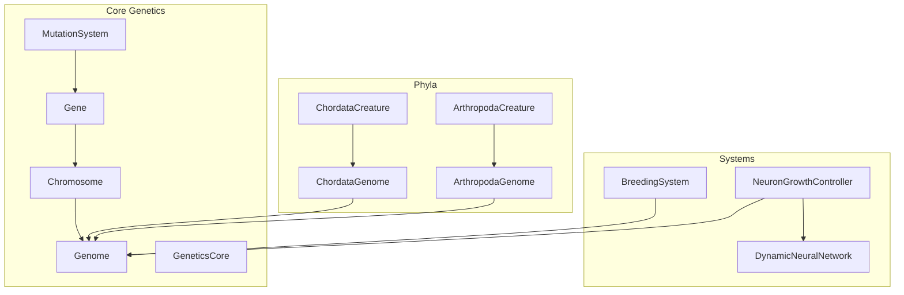
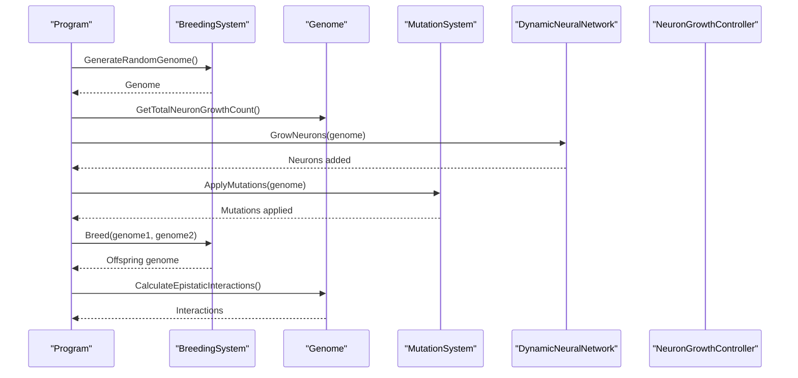
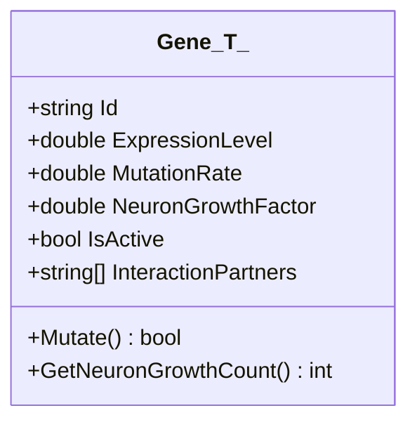
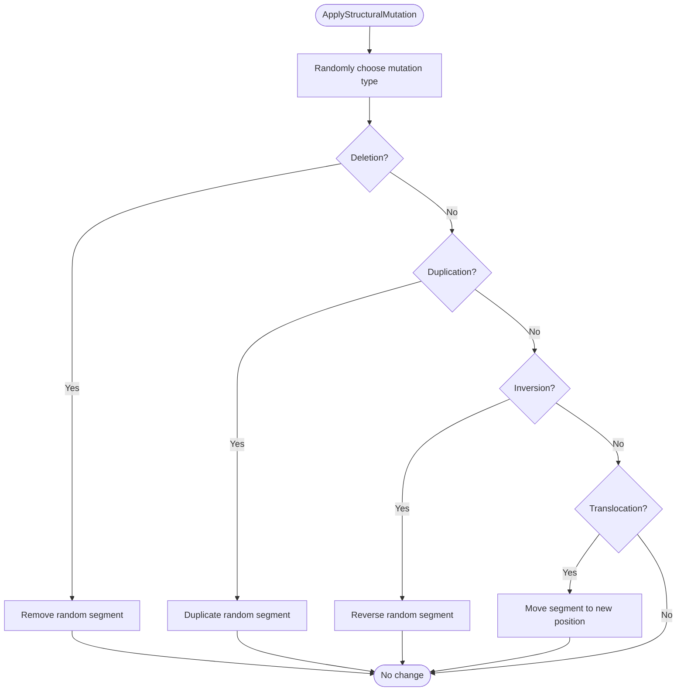
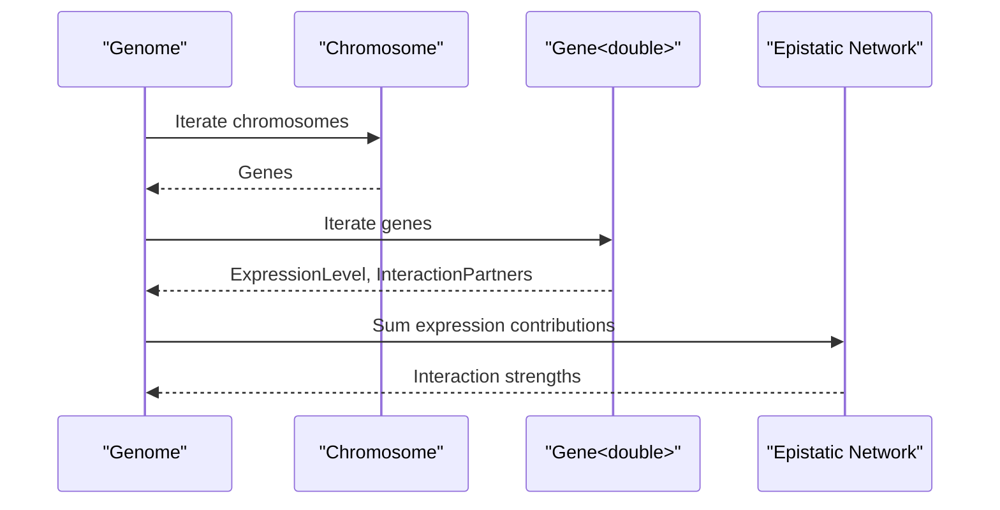
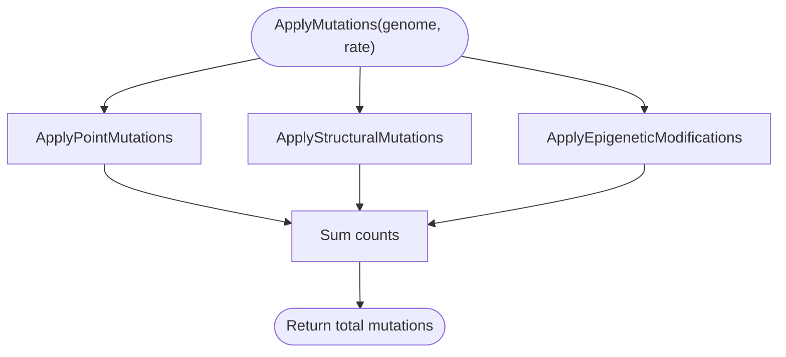
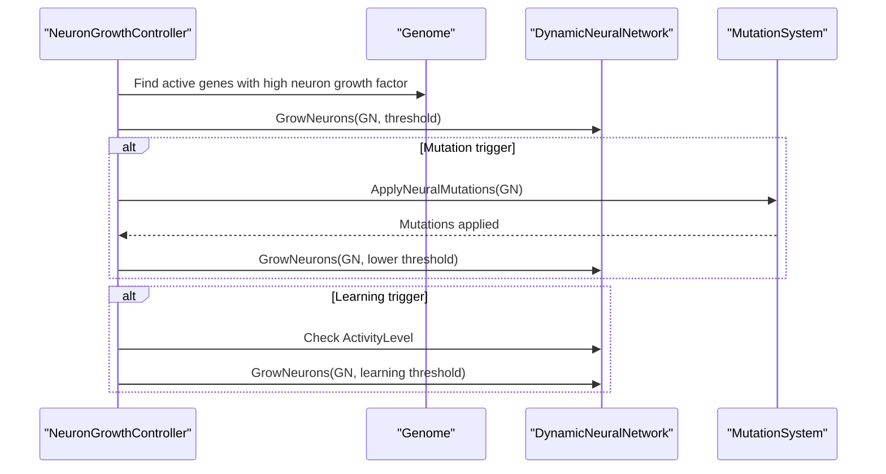
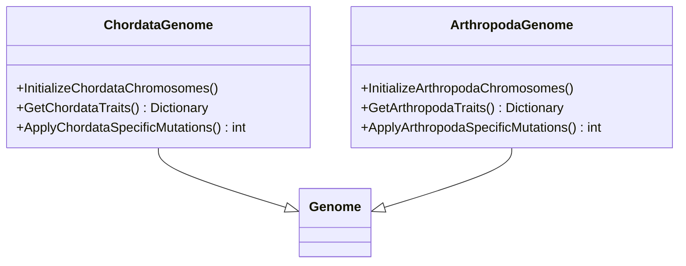
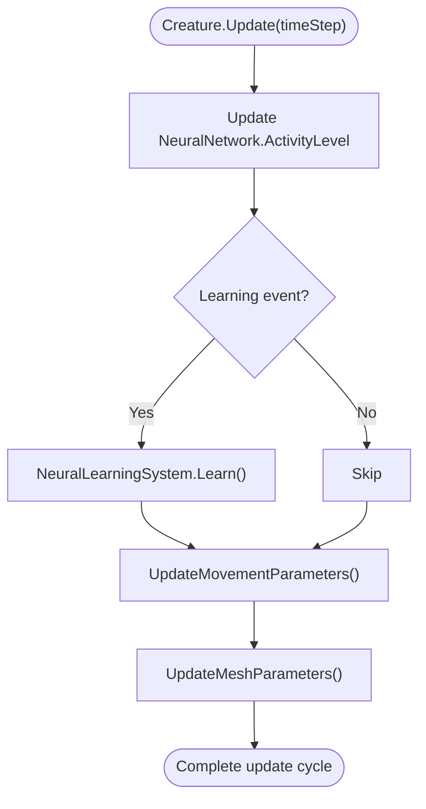
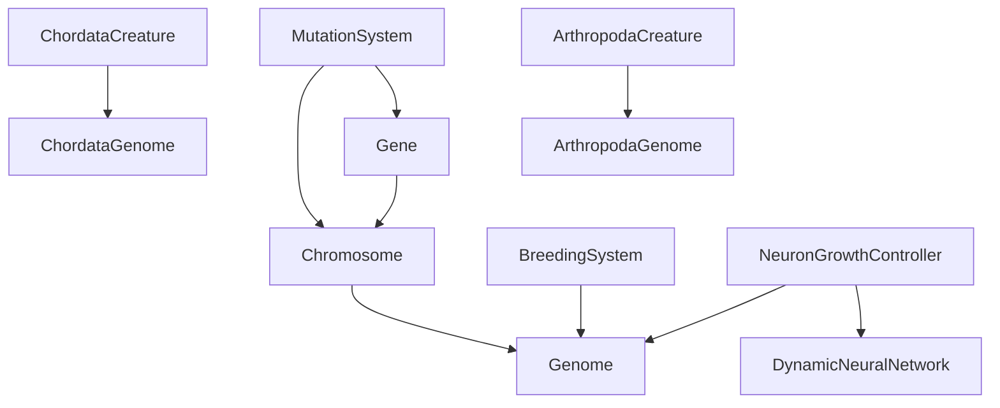

# Gene Expression and Regulation

<cite>
**Referenced Files in This Document**
- [Gene.cs](file://GeneticsGame/Core/Gene.cs)
- [Chromosome.cs](file://GeneticsGame/Core/Chromosome.cs)
- [Genome.cs](file://GeneticsGame/Core/Genome.cs)
- [GeneticsCore.cs](file://GeneticsGame/Core/GeneticsCore.cs)
- [MutationSystem.cs](file://GeneticsGame/Core/MutationSystem.cs)
- [BreedingSystem.cs](file://GeneticsGame/Systems/BreedingSystem.cs)
- [DynamicNeuralNetwork.cs](file://GeneticsGame/Systems/DynamicNeuralNetwork.cs)
- [NeuronGrowthController.cs](file://GeneticsGame/Systems/NeuronGrowthController.cs)
- [ChordataGenome.cs](file://GeneticsGame/Phyla/Chordata/ChordataGenome.cs)
- [ArthropodaGenome.cs](file://GeneticsGame/Phyla/Arthropoda/ArthropodaGenome.cs)
- [ChordataCreature.cs](file://GeneticsGame/Phyla/Chordata/ChordataCreature.cs)
- [ArthropodaCreature.cs](file://GeneticsGame/Phyla/Arthropoda/ArthropodaCreature.cs)
- [Program.cs](file://GeneticsGame/Program.cs)
</cite>

## Table of Contents
1. [Introduction](#introduction)
2. [Project Structure](#project-structure)
3. [Core Components](#core-components)
4. [Architecture Overview](#architecture-overview)
5. [Detailed Component Analysis](#detailed-component-analysis)
6. [Dependency Analysis](#dependency-analysis)
7. [Performance Considerations](#performance-considerations)
8. [Troubleshooting Guide](#troubleshooting-guide)
9. [Conclusion](#conclusion)

## Introduction
This document explains the Gene class and the broader genetic system that drives expression, regulation, and heredity in the simulation. It covers:
- Gene structure and properties (expression level, mutation rate, neuron growth factor)
- Gene expression mechanisms (transcription, translation, protein synthesis) as modeled by the simulation
- Gene regulation (promoter-like activity, enhancer-like interactions, epigenetic modifications)
- Epistatic relationships and complementary gene actions
- Examples of expression patterns, regulatory mutations, and phenotypic effects
- The relationship between gene complexity and trait development in the simulation context

## Project Structure
The genetic system is organized around core classes that model hereditary units, chromosomes, genomes, and mutation/regulation mechanics. Specialized genomes exist for different phyla (Chordata and Arthropoda), and neural growth is controlled by a dedicated system that responds to genetic triggers.



**Diagram sources**
- [Gene.cs:1-93](file://GeneticsGame/Core/Gene.cs#L1-L93)
- [Chromosome.cs:1-146](file://GeneticsGame/Core/Chromosome.cs#L1-L146)
- [Genome.cs:1-190](file://GeneticsGame/Core/Genome.cs#L1-L190)
- [MutationSystem.cs:1-137](file://GeneticsGame/Core/MutationSystem.cs#L1-L137)
- [BreedingSystem.cs:1-182](file://GeneticsGame/Systems/BreedingSystem.cs#L1-L182)
- [DynamicNeuralNetwork.cs:1-116](file://GeneticsGame/Systems/DynamicNeuralNetwork.cs#L1-L116)
- [NeuronGrowthController.cs:1-122](file://GeneticsGame/Systems/NeuronGrowthController.cs#L1-L122)
- [ChordataGenome.cs:1-134](file://GeneticsGame/Phyla/Chordata/ChordataGenome.cs#L1-L134)
- [ArthropodaGenome.cs:1-134](file://GeneticsGame/Phyla/Arthropoda/ArthropodaGenome.cs#L1-L134)
- [ChordataCreature.cs:1-133](file://GeneticsGame/Phyla/Chordata/ChordataCreature.cs#L1-L133)
- [ArthropodaCreature.cs:1-133](file://GeneticsGame/Phyla/Arthropoda/ArthropodaCreature.cs#L1-L133)

**Section sources**
- [Program.cs:11-57](file://GeneticsGame/Program.cs#L11-L57)

## Core Components
- Gene<T>: Represents a hereditary unit with expression level, mutation rate, neuron growth factor, activity state, and epistatic interaction partners. It models transcription and translation by controlling expression and neuron growth, and it mutates to alter expression and growth factors.
- Chromosome: A collection of genes with structural mutation support (deletions, duplications, inversions, translocations).
- Genome: The complete genetic blueprint with multi-gene interaction rules, epistatic calculations, and breeding mechanics.
- MutationSystem: Applies point mutations, structural mutations, epigenetic modifications, and neural-specific mutations.
- BreedingSystem: Implements ARK-style inheritance with compatibility scoring and random genome generation.
- DynamicNeuralNetwork and NeuronGrowthController: Translate genetic expression into dynamic neural growth, integrating genetic, mutation, and learning triggers.

**Section sources**
- [Gene.cs:9-93](file://GeneticsGame/Core/Gene.cs#L9-L93)
- [Chromosome.cs:9-146](file://GeneticsGame/Core/Chromosome.cs#L9-L146)
- [Genome.cs:9-190](file://GeneticsGame/Core/Genome.cs#L9-L190)
- [MutationSystem.cs:9-137](file://GeneticsGame/Core/MutationSystem.cs#L9-L137)
- [BreedingSystem.cs:9-182](file://GeneticsGame/Systems/BreedingSystem.cs#L9-L182)
- [DynamicNeuralNetwork.cs:9-116](file://GeneticsGame/Systems/DynamicNeuralNetwork.cs#L9-L116)
- [NeuronGrowthController.cs:9-122](file://GeneticsGame/Systems/NeuronGrowthController.cs#L9-L122)

## Architecture Overview
The simulation models gene expression as a continuous process with probabilistic mutations and epistatic interactions. Genes influence neural growth, which feeds back into neural network activity and creature traits. Regulatory mechanisms include:
- Transcription-like expression level (0.0–1.0)
- Translation-like neuron growth factor
- Protein synthesis-like neuron addition when active
- Promoter-like activity threshold (active when expression level exceeds a threshold)
- Enhancer-like epistatic interactions with other genes
- Epigenetic-like expression modifications without altering DNA sequence



**Diagram sources**
- [Program.cs:16-48](file://GeneticsGame/Program.cs#L16-L48)
- [BreedingSystem.cs:18-27](file://GeneticsGame/Systems/BreedingSystem.cs#L18-L27)
- [Genome.cs:72-107](file://GeneticsGame/Core/Genome.cs#L72-L107)
- [MutationSystem.cs:17-29](file://GeneticsGame/Core/MutationSystem.cs#L17-L29)
- [DynamicNeuralNetwork.cs:63-99](file://GeneticsGame/Systems/DynamicNeuralNetwork.cs#L63-L99)
- [NeuronGrowthController.cs:107-121](file://GeneticsGame/Systems/NeuronGrowthController.cs#L107-L121)

## Detailed Component Analysis

### Gene<T> Analysis
The Gene class encapsulates:
- Unique identity and expression level (0.0–1.0)
- Base mutation rate
- Neuron growth factor influencing neural growth when expressed
- Active state determined by expression level threshold
- Epistatic interaction partners with other genes

Key behaviors:
- Mutate(): probabilistically adjusts expression level, neuron growth factor, and activation state
- GetNeuronGrowthCount(): computes neuron additions when active, scaled by expression level and growth factor



**Diagram sources**
- [Gene.cs:9-93](file://GeneticsGame/Core/Gene.cs#L9-L93)

**Section sources**
- [Gene.cs:9-93](file://GeneticsGame/Core/Gene.cs#L9-L93)

### Chromosome Analysis
Represents a linear arrangement of genes with structural mutation support:
- Deletion, duplication, inversion, and translocation mutations
- Aggregates neuron growth potential across genes



**Diagram sources**
- [Chromosome.cs:44-136](file://GeneticsGame/Core/Chromosome.cs#L44-L136)

**Section sources**
- [Chromosome.cs:9-146](file://GeneticsGame/Core/Chromosome.cs#L9-L146)

### Genome Analysis
Models the complete genetic blueprint:
- Multi-gene interaction rules and epistatic calculations
- Breeding mechanics with Mendelian inheritance and multi-gene interactions
- Mutation application across point, structural, and epigenetic categories

Epistatic interactions:
- Strength computed from self expression and partner expression levels
- Used to influence neuron type selection and growth thresholds



**Diagram sources**
- [Genome.cs:81-107](file://GeneticsGame/Core/Genome.cs#L81-L107)

**Section sources**
- [Genome.cs:9-190](file://GeneticsGame/Core/Genome.cs#L9-L190)

### MutationSystem Analysis
Applies three mutation categories:
- Point mutations: random adjustments to expression level and neuron growth factor
- Structural mutations: chromosomal rearrangements
- Epigenetic modifications: expression-level changes without altering other properties
- Neural-specific mutations: targeted adjustments to neuron growth factors and expression for neural genes



**Diagram sources**
- [MutationSystem.cs:17-103](file://GeneticsGame/Core/MutationSystem.cs#L17-L103)

**Section sources**
- [MutationSystem.cs:9-137](file://GeneticsGame/Core/MutationSystem.cs#L9-L137)

### BreedingSystem Analysis
Implements ARK-style breeding:
- Compatibility scoring based on genetic similarity and diversity
- Random genome generation with mixed gene types and epistatic interactions
- Offspring creation via genome breeding with inherited properties and interaction partners

```mermaid
sequenceDiagram
participant BS as "BreedingSystem"
participant P1 as "Parent1 Genome"
participant P2 as "Parent2 Genome"
participant MS as "MutationSystem"
participant Off as "Offspring Genome"
BS->>P1 : Access chromosomes and genes
BS->>P2 : Access chromosomes and genes
BS->>Off : Create offspring with mixed genes
BS->>MS : ApplyMutations(offspring, mutationRate)
MS-->>BS : Mutations applied
BS-->>BS : Return offspring
```

**Diagram sources**
- [BreedingSystem.cs:18-27](file://GeneticsGame/Systems/BreedingSystem.cs#L18-L27)
- [BreedingSystem.cs:134-189](file://GeneticsGame/Systems/BreedingSystem.cs#L134-L189)
- [MutationSystem.cs:17-29](file://GeneticsGame/Core/MutationSystem.cs#L17-L29)

**Section sources**
- [BreedingSystem.cs:9-182](file://GeneticsGame/Systems/BreedingSystem.cs#L9-L182)

### DynamicNeuralNetwork and NeuronGrowthController Analysis
Neural growth is triggered by genetic expression, mutation events, and learning:
- Genetic expression: high expression level and neuron growth factor lead to neuron addition
- Mutation: neural-specific mutations can trigger growth
- Learning: increased neural activity can promote growth



**Diagram sources**
- [NeuronGrowthController.cs:36-121](file://GeneticsGame/Systems/NeuronGrowthController.cs#L36-L121)
- [DynamicNeuralNetwork.cs:63-99](file://GeneticsGame/Systems/DynamicNeuralNetwork.cs#L63-L99)
- [MutationSystem.cs:111-136](file://GeneticsGame/Core/MutationSystem.cs#L111-L136)

**Section sources**
- [DynamicNeuralNetwork.cs:9-116](file://GeneticsGame/Systems/DynamicNeuralNetwork.cs#L9-L116)
- [NeuronGrowthController.cs:9-122](file://GeneticsGame/Systems/NeuronGrowthController.cs#L9-L122)

### Phyla-Specific Genomes and Traits
ChordataGenome and ArthropodaGenome demonstrate how genes map to distinct traits:
- Chordata: spine, neural, limb, sensory, and metabolism genes
- Arthropoda: exoskeleton, segmentation, limb, neural, and metabolism genes
- Specialized mutation rules increase mutation rates for relevant gene families



**Diagram sources**
- [ChordataGenome.cs:9-134](file://GeneticsGame/Phyla/Chordata/ChordataGenome.cs#L9-L134)
- [ArthropodaGenome.cs:9-134](file://GeneticsGame/Phyla/Arthropoda/ArthropodaGenome.cs#L9-L134)

**Section sources**
- [ChordataGenome.cs:9-134](file://GeneticsGame/Phyla/Chordata/ChordataGenome.cs#L9-L134)
- [ArthropodaGenome.cs:9-134](file://GeneticsGame/Phyla/Arthropoda/ArthropodaGenome.cs#L9-L134)

### Creatures and Phenotypic Effects
ChordataCreature and ArthropodaCreature translate genetic expression into observable traits:
- Movement parameters adjusted by neural activity and connections
- Mesh parameters scaled by average gene expression and neuron growth
- Trait-specific updates (e.g., limb count for movement, exoskeleton complexity for mesh)



**Diagram sources**
- [ChordataCreature.cs:61-122](file://GeneticsGame/Phyla/Chordata/ChordataCreature.cs#L61-L122)
- [ArthropodaCreature.cs:61-122](file://GeneticsGame/Phyla/Arthropoda/ArthropodaCreature.cs#L61-L122)

**Section sources**
- [ChordataCreature.cs:9-133](file://GeneticsGame/Phyla/Chordata/ChordataCreature.cs#L9-L133)
- [ArthropodaCreature.cs:9-133](file://GeneticsGame/Phyla/Arthropoda/ArthropodaCreature.cs#L9-L133)

## Dependency Analysis
The system exhibits layered dependencies:
- Core genetics (Gene, Chromosome, Genome) underpin all higher-level systems
- MutationSystem depends on Gene and Chromosome behavior
- BreedingSystem depends on Genome breeding and MutationSystem
- Neural growth depends on Genome epistatic interactions and DynamicNeuralNetwork
- Creatures depend on phyla-specific genomes and procedural generators



**Diagram sources**
- [Gene.cs:9-93](file://GeneticsGame/Core/Gene.cs#L9-L93)
- [Chromosome.cs:9-146](file://GeneticsGame/Core/Chromosome.cs#L9-L146)
- [Genome.cs:9-190](file://GeneticsGame/Core/Genome.cs#L9-L190)
- [MutationSystem.cs:9-137](file://GeneticsGame/Core/MutationSystem.cs#L9-L137)
- [NeuronGrowthController.cs:9-122](file://GeneticsGame/Systems/NeuronGrowthController.cs#L9-L122)
- [ChordataCreature.cs:9-133](file://GeneticsGame/Phyla/Chordata/ChordataCreature.cs#L9-L133)
- [ArthropodaCreature.cs:9-133](file://GeneticsGame/Phyla/Arthropoda/ArthropodaCreature.cs#L9-L133)

**Section sources**
- [GeneticsCore.cs:9-21](file://GeneticsGame/Core/GeneticsCore.cs#L9-L21)

## Performance Considerations
- Mutation rates are configurable globally and per-gene, enabling tuning of evolutionary dynamics
- Neural growth is capped to prevent unbounded expansion
- Epistatic interaction calculations iterate across genes; complexity scales with gene count
- Breeding and mutation operations are O(G) over genes and chromosomes

[No sources needed since this section provides general guidance]

## Troubleshooting Guide
Common issues and resolutions:
- Low neural growth despite high expression: verify gene activity threshold and neuron growth factor
- Unexpected epistatic effects: confirm interaction partner IDs and expression levels
- Imbalanced mutation pressure: adjust global mutation rate and per-gene mutation rates
- Creature traits not reflecting genetic expression: check mesh and movement parameter updates

**Section sources**
- [GeneticsCore.cs:14-19](file://GeneticsGame/Core/GeneticsCore.cs#L14-L19)
- [Genome.cs:81-107](file://GeneticsGame/Core/Genome.cs#L81-L107)
- [MutationSystem.cs:17-103](file://GeneticsGame/Core/MutationSystem.cs#L17-L103)
- [DynamicNeuralNetwork.cs:63-99](file://GeneticsGame/Systems/DynamicNeuralNetwork.cs#L63-L99)

## Conclusion
The Gene class and associated systems model heredity and development through expression levels, epistatic interactions, and neural growth. The simulation captures transcription-like expression, translation-like growth, and protein synthesis-like neuron addition, while incorporating regulatory mechanisms such as promoter-like activity, enhancer-like interactions, and epigenetic-like modifications. Phyla-specific genomes demonstrate how gene complexity translates into distinct traits, and the neural growth controller integrates genetic, mutation, and learning-driven development.