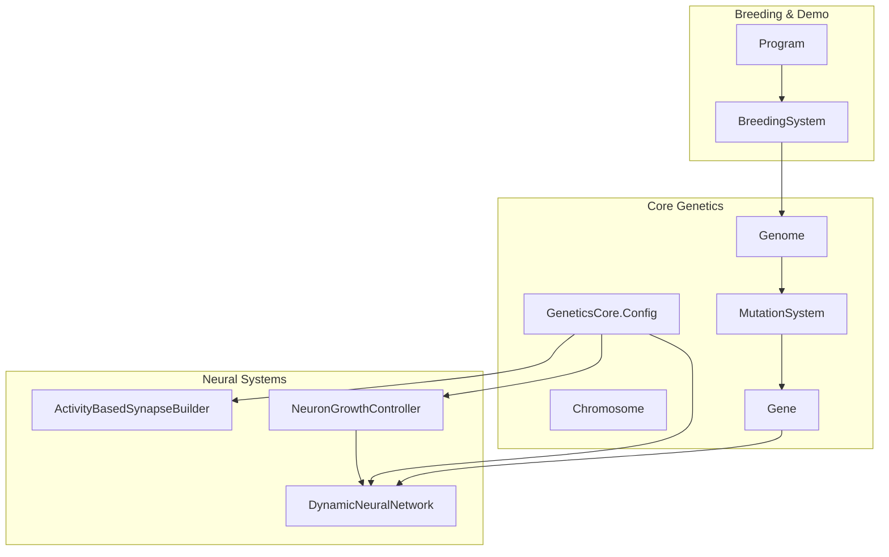
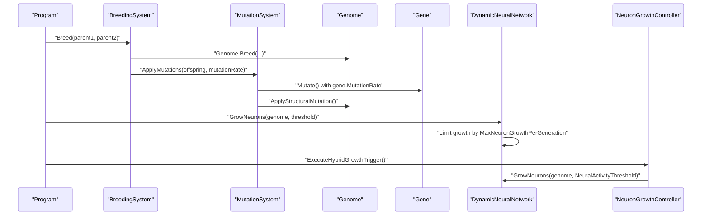
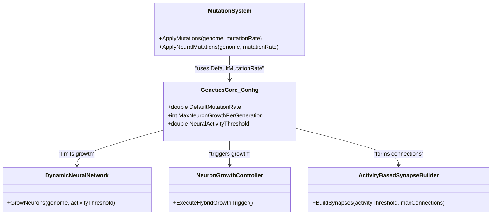

# GeneticsCore Configuration

<cite>
**Referenced Files in This Document**
- [GeneticsCore.cs](file://GeneticsGame/Core/GeneticsCore.cs)
- [DynamicNeuralNetwork.cs](file://GeneticsGame/Systems/DynamicNeuralNetwork.cs)
- [NeuronGrowthController.cs](file://GeneticsGame/Systems/NeuronGrowthController.cs)
- [ActivityBasedSynapseBuilder.cs](file://GeneticsGame/Systems/ActivityBasedSynapseBuilder.cs)
- [MutationSystem.cs](file://GeneticsGame/Core/MutationSystem.cs)
- [Genome.cs](file://GeneticsGame/Core/Genome.cs)
- [Chromosome.cs](file://GeneticsGame/Core/Chromosome.cs)
- [Gene.cs](file://GeneticsGame/Core/Gene.cs)
- [BreedingSystem.cs](file://GeneticsGame/Systems/BreedingSystem.cs)
- [Program.cs](file://GeneticsGame/Program.cs)
</cite>

## Table of Contents
1. [Introduction](#introduction)
2. [Project Structure](#project-structure)
3. [Core Components](#core-components)
4. [Architecture Overview](#architecture-overview)
5. [Detailed Component Analysis](#detailed-component-analysis)
6. [Dependency Analysis](#dependency-analysis)
7. [Performance Considerations](#performance-considerations)
8. [Troubleshooting Guide](#troubleshooting-guide)
9. [Conclusion](#conclusion)

## Introduction
This document explains the GeneticsCore configuration system that governs genetic behavior in the simulation. At its heart is a static configuration container that defines global constants influencing mutation rates, neural growth limits, and activity-based triggering mechanisms. These constants shape evolutionary outcomes by controlling genetic diversity, neural network development, and system stability.

## Project Structure
The configuration resides in a centralized static class that is consumed by multiple subsystems:
- Core genetics: Genome, Chromosome, Gene, MutationSystem
- Neural systems: DynamicNeuralNetwork, NeuronGrowthController, ActivityBasedSynapseBuilder
- Breeding and demonstration: BreedingSystem, Program

**Diagram sources**
- [GeneticsCore.cs:9-20](file://GeneticsGame/Core/GeneticsCore.cs#L9-L20)
- [DynamicNeuralNetwork.cs:63-99](file://GeneticsGame/Systems/DynamicNeuralNetwork.cs#L63-L99)
- [NeuronGrowthController.cs:36-101](file://GeneticsGame/Systems/NeuronGrowthController.cs#L36-L101)
- [ActivityBasedSynapseBuilder.cs:31-68](file://GeneticsGame/Systems/ActivityBasedSynapseBuilder.cs#L31-L68)
- [MutationSystem.cs:17-29](file://GeneticsGame/Core/MutationSystem.cs#L17-L29)
- [Genome.cs:44-66](file://GeneticsGame/Core/Genome.cs#L44-L66)
- [BreedingSystem.cs:18-27](file://GeneticsGame/Systems/BreedingSystem.cs#L18-L27)
- [Program.cs:11-57](file://GeneticsGame/Program.cs#L11-L57)

**Section sources**
- [GeneticsCore.cs:9-20](file://GeneticsGame/Core/GeneticsCore.cs#L9-L20)
- [Program.cs:11-57](file://GeneticsGame/Program.cs#L11-L57)

## Core Components
The configuration is defined as a static nested class with three constants:
- DefaultMutationRate: Base mutation rate used across genetic operations
- MaxNeuronGrowthPerGeneration: Upper bound on neuron additions per generation
- NeuralActivityThreshold: Activity level threshold that gates neural growth and synaptogenesis

These constants are referenced throughout the system to regulate behavior deterministically while allowing controlled variability.

**Section sources**
- [GeneticsCore.cs:14-19](file://GeneticsGame/Core/GeneticsCore.cs#L14-L19)

## Architecture Overview
The configuration constants influence three primary pathways:
- Mutation control: Base mutation rate and relative rates for different mutation types
- Neural growth control: Limits on neuron additions and activity thresholds for growth triggers
- Synaptic control: Activity-dependent connection formation and pruning

**Diagram sources**
- [Program.cs:18-44](file://GeneticsGame/Program.cs#L18-L44)
- [BreedingSystem.cs:18-27](file://GeneticsGame/Systems/BreedingSystem.cs#L18-L27)
- [MutationSystem.cs:17-29](file://GeneticsGame/Core/MutationSystem.cs#L17-L29)
- [Genome.cs:44-66](file://GeneticsGame/Core/Genome.cs#L44-L66)
- [DynamicNeuralNetwork.cs:63-99](file://GeneticsGame/Systems/DynamicNeuralNetwork.cs#L63-L99)
- [NeuronGrowthController.cs:107-121](file://GeneticsGame/Systems/NeuronGrowthController.cs#L107-L121)

## Detailed Component Analysis

### Static Configuration Container
The configuration container defines three constants that act as global defaults:
- DefaultMutationRate: Controls baseline mutation probability across genetic operations
- MaxNeuronGrowthPerGeneration: Caps neuron additions per generation to prevent uncontrolled growth
- NeuralActivityThreshold: Determines whether neural growth or synaptogenesis can be triggered

These constants are accessed by:
- MutationSystem for relative mutation rates
- DynamicNeuralNetwork for growth limiting
- NeuronGrowthController for growth triggers
- ActivityBasedSynapseBuilder for synapse formation thresholds

**Section sources**
- [GeneticsCore.cs:14-19](file://GeneticsGame/Core/GeneticsCore.cs#L14-L19)
- [MutationSystem.cs:17-29](file://GeneticsGame/Core/MutationSystem.cs#L17-L29)
- [DynamicNeuralNetwork.cs:71](file://GeneticsGame/Systems/DynamicNeuralNetwork.cs#L71)
- [NeuronGrowthController.cs:62](file://GeneticsGame/Systems/NeuronGrowthController.cs#L62)
- [ActivityBasedSynapseBuilder.cs:31](file://GeneticsGame/Systems/ActivityBasedSynapseBuilder.cs#L31)

### Mutation Rate Influence
DefaultMutationRate is used as the base rate for:
- Point mutations: Applied to individual genes during genome mutation
- Structural mutations: Applied less frequently (scaled down) compared to point mutations
- Epigenetic modifications: Applied at a reduced rate relative to point mutations
- Neural-specific mutations: Targeted growth factors for neural genes

Practical effects:
- Increasing DefaultMutationRate increases genetic diversity and evolutionary pressure
- Decreasing DefaultMutationRate stabilizes lineages and reduces rapid divergence

Example usage references:
- [MutationSystem.cs:17](file://GeneticsGame/Core/MutationSystem.cs#L17)
- [MutationSystem.cs:45](file://GeneticsGame/Core/MutationSystem.cs#L45)
- [MutationSystem.cs:68](file://GeneticsGame/Core/MutationSystem.cs#L68)
- [MutationSystem.cs:92](file://GeneticsGame/Core/MutationSystem.cs#L92)
- [MutationSystem.cs:119](file://GeneticsGame/Core/MutationSystem.cs#L119)

**Section sources**
- [MutationSystem.cs:17-29](file://GeneticsGame/Core/MutationSystem.cs#L17-L29)
- [MutationSystem.cs:37-54](file://GeneticsGame/Core/MutationSystem.cs#L37-L54)
- [MutationSystem.cs:62-76](file://GeneticsGame/Core/MutationSystem.cs#L62-L76)
- [MutationSystem.cs:84-103](file://GeneticsGame/Core/MutationSystem.cs#L84-L103)
- [MutationSystem.cs:111-136](file://GeneticsGame/Core/MutationSystem.cs#L111-L136)

### Neural Growth Limit Influence
MaxNeuronGrowthPerGeneration caps the number of neurons that can be added per generation. This ensures:
- System stability by preventing runaway neural expansion
- Evolutionary trade-offs between growth potential and resource constraints
- Predictable simulation behavior across generations

Implementation references:
- [DynamicNeuralNetwork.cs:71](file://GeneticsGame/Systems/DynamicNeuralNetwork.cs#L71)
- [DynamicNeuralNetwork.cs:73-96](file://GeneticsGame/Systems/DynamicNeuralNetwork.cs#L73-L96)

Impact on evolutionary outcomes:
- Higher limit allows more exploratory neural architectures but risks instability
- Lower limit constrains innovation but maintains robustness

**Section sources**
- [DynamicNeuralNetwork.cs:63-99](file://GeneticsGame/Systems/DynamicNeuralNetwork.cs#L63-L99)

### Activity-Based Threshold Influence
NeuralActivityThreshold governs:
- Genetic expression-triggered growth: Used in hybrid growth controller
- Mutation-triggered growth: Lower threshold for mutation-driven growth
- Learning-triggered growth: Modified thresholds based on activity levels
- Synaptogenesis: Minimum activity required to form new connections

References:
- [NeuronGrowthController.cs:62](file://GeneticsGame/Systems/NeuronGrowthController.cs#L62)
- [NeuronGrowthController.cs:77](file://GeneticsGame/Systems/NeuronGrowthController.cs#L77)
- [NeuronGrowthController.cs:91](file://GeneticsGame/Systems/NeuronGrowthController.cs#L91)
- [ActivityBasedSynapseBuilder.cs:31](file://GeneticsGame/Systems/ActivityBasedSynapseBuilder.cs#L31)

Effects:
- Higher threshold delays growth until sufficient neural activity emerges
- Lower threshold accelerates development but may lead to premature complexity

**Section sources**
- [NeuronGrowthController.cs:36-101](file://GeneticsGame/Systems/NeuronGrowthController.cs#L36-L101)
- [ActivityBasedSynapseBuilder.cs:31-68](file://GeneticsGame/Systems/ActivityBasedSynapseBuilder.cs#L31-L68)

### Practical Examples and Effects

#### Example 1: Increasing DefaultMutationRate
- Effect: More frequent point and structural mutations
- Outcome: Higher genetic diversity, faster adaptation, potential instability
- Reference: [MutationSystem.cs:17](file://GeneticsGame/Core/MutationSystem.cs#L17)

#### Example 2: Raising MaxNeuronGrowthPerGeneration
- Effect: Larger neural networks per generation
- Outcome: Enhanced capacity for complex behaviors but risk of computational overhead
- Reference: [DynamicNeuralNetwork.cs:71](file://GeneticsGame/Systems/DynamicNeuralNetwork.cs#L71)

#### Example 3: Lowering NeuralActivityThreshold
- Effect: Earlier neural growth and synaptogenesis
- Outcome: Faster brain development but possible over-connectivity
- References: [NeuronGrowthController.cs:62](file://GeneticsGame/Systems/NeuronGrowthController.cs#L62), [ActivityBasedSynapseBuilder.cs:31](file://GeneticsGame/Systems/ActivityBasedSynapseBuilder.cs#L31)

### Relationship Between Configuration and Evolutionary Outcomes
- Genetic diversity vs. stability: DefaultMutationRate balances exploration and preservation
- Development speed vs. complexity: MaxNeuronGrowthPerGeneration controls growth pace
- Activity-dependent evolution: NeuralActivityThreshold aligns growth with functional needs

Evidence in code:
- [Genome.cs:44-66](file://GeneticsGame/Core/Genome.cs#L44-L66): Mutation application across genes and chromosomes
- [DynamicNeuralNetwork.cs:63-99](file://GeneticsGame/Systems/DynamicNeuralNetwork.cs#L63-L99): Growth limiting and activity gating
- [NeuronGrowthController.cs:107-121](file://GeneticsGame/Systems/NeuronGrowthController.cs#L107-L121): Hybrid triggering prioritizing genetic expression

**Section sources**
- [Genome.cs:44-66](file://GeneticsGame/Core/Genome.cs#L44-L66)
- [DynamicNeuralNetwork.cs:63-99](file://GeneticsGame/Systems/DynamicNeuralNetwork.cs#L63-L99)
- [NeuronGrowthController.cs:107-121](file://GeneticsGame/Systems/NeuronGrowthController.cs#L107-L121)

## Dependency Analysis
The configuration constants are consumed by multiple components, creating a central control point for genetic behavior.

**Diagram sources**
- [GeneticsCore.cs:14-19](file://GeneticsGame/Core/GeneticsCore.cs#L14-L19)
- [MutationSystem.cs:17-29](file://GeneticsGame/Core/MutationSystem.cs#L17-L29)
- [DynamicNeuralNetwork.cs:63-99](file://GeneticsGame/Systems/DynamicNeuralNetwork.cs#L63-L99)
- [NeuronGrowthController.cs:107-121](file://GeneticsGame/Systems/NeuronGrowthController.cs#L107-L121)
- [ActivityBasedSynapseBuilder.cs:31-68](file://GeneticsGame/Systems/ActivityBasedSynapseBuilder.cs#L31-L68)

**Section sources**
- [GeneticsCore.cs:14-19](file://GeneticsGame/Core/GeneticsCore.cs#L14-L19)
- [MutationSystem.cs:17-29](file://GeneticsGame/Core/MutationSystem.cs#L17-L29)
- [DynamicNeuralNetwork.cs:63-99](file://GeneticsGame/Systems/DynamicNeuralNetwork.cs#L63-L99)
- [NeuronGrowthController.cs:107-121](file://GeneticsGame/Systems/NeuronGrowthController.cs#L107-L121)
- [ActivityBasedSynapseBuilder.cs:31-68](file://GeneticsGame/Systems/ActivityBasedSynapseBuilder.cs#L31-L68)

## Performance Considerations
- Centralized configuration reduces branching logic and improves predictability
- Using constants avoids repeated calculations and maintains consistency across subsystems
- Tuning DefaultMutationRate impacts computational cost of mutation loops
- Adjusting MaxNeuronGrowthPerGeneration helps control memory and processing demands for neural growth

[No sources needed since this section provides general guidance]

## Troubleshooting Guide
Common issues and remedies:
- Overly aggressive growth: Increase MaxNeuronGrowthPerGeneration or NeuralActivityThreshold to stabilize development
- Stagnant evolution: Increase DefaultMutationRate to boost genetic diversity
- Premature complexity: Raise NeuralActivityThreshold to delay growth until activity warrants it

Diagnostic references:
- [DynamicNeuralNetwork.cs:71](file://GeneticsGame/Systems/DynamicNeuralNetwork.cs#L71)
- [NeuronGrowthController.cs:62](file://GeneticsGame/Systems/NeuronGrowthController.cs#L62)
- [MutationSystem.cs:17](file://GeneticsGame/Core/MutationSystem.cs#L17)

**Section sources**
- [DynamicNeuralNetwork.cs:63-99](file://GeneticsGame/Systems/DynamicNeuralNetwork.cs#L63-L99)
- [NeuronGrowthController.cs:36-101](file://GeneticsGame/Systems/NeuronGrowthController.cs#L36-L101)
- [MutationSystem.cs:17-29](file://GeneticsGame/Core/MutationSystem.cs#L17-L29)

## Conclusion
The GeneticsCore configuration system provides a compact yet powerful mechanism to steer evolutionary dynamics. By tuning DefaultMutationRate, MaxNeuronGrowthPerGeneration, and NeuralActivityThreshold, developers can balance genetic diversity, neural development, and system stability to achieve desired simulation behaviors.