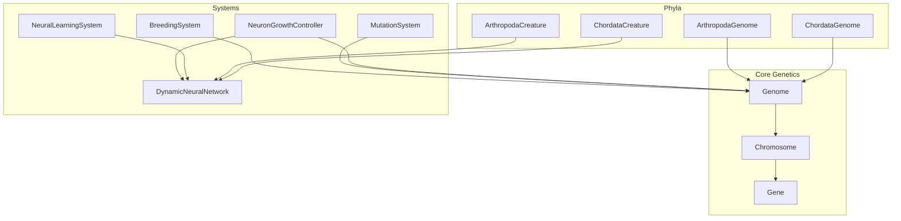
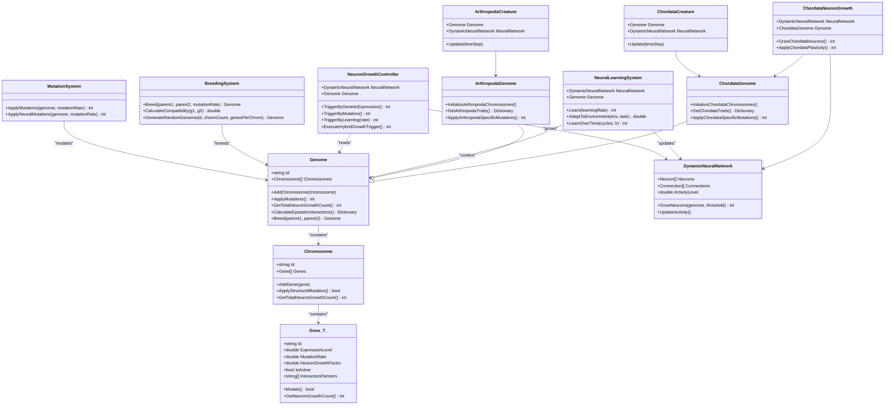
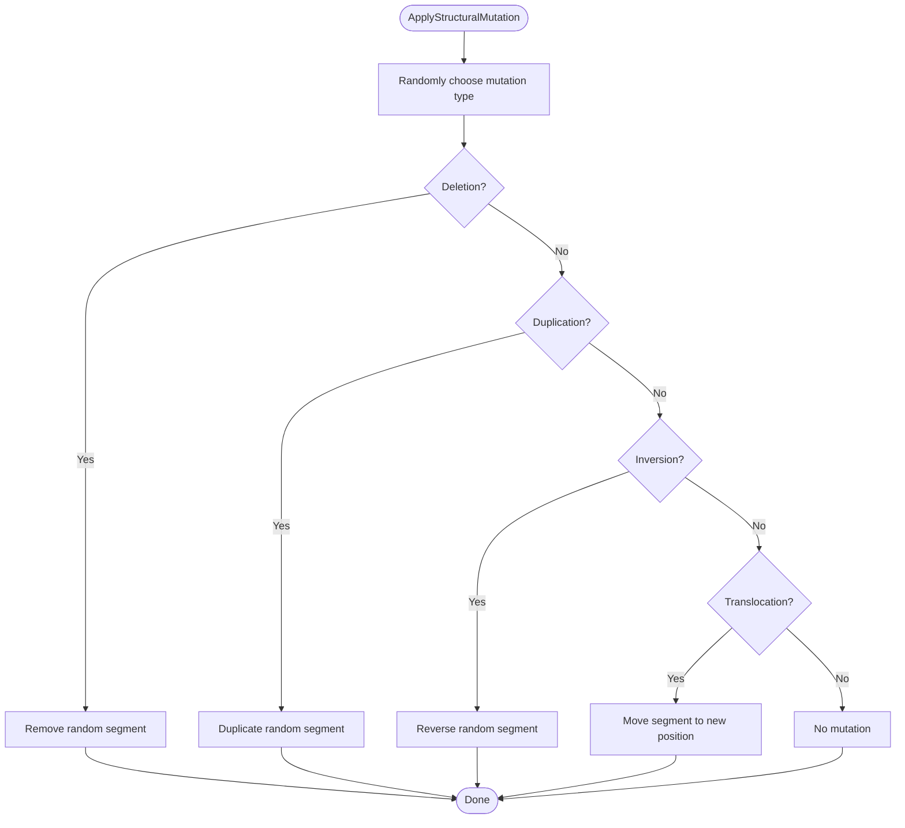
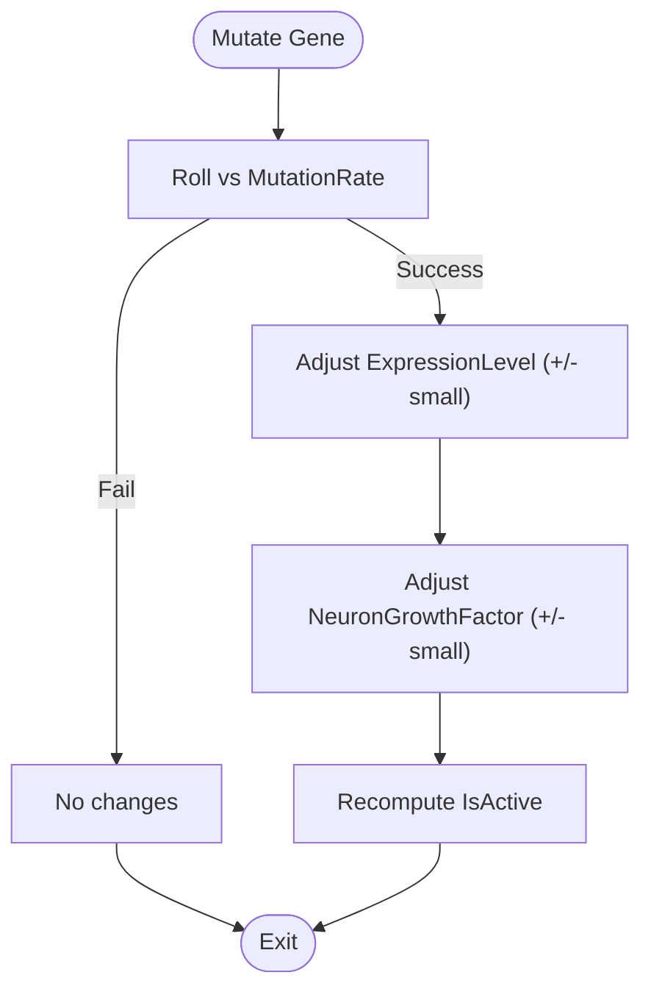
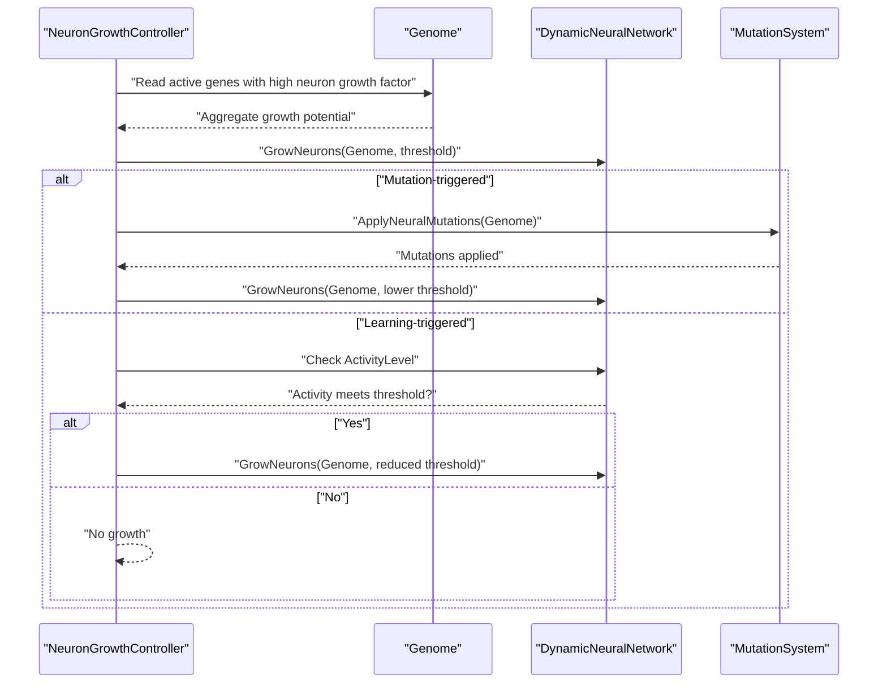
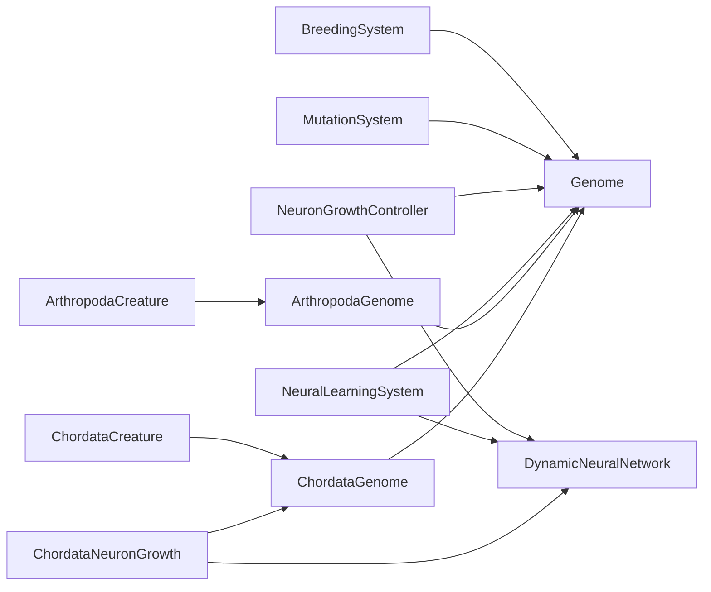

# Genome Structure and Organization

<cite>
**Referenced Files in This Document**
- [Genome.cs](file://GeneticsGame/Core/Genome.cs)
- [Chromosome.cs](file://GeneticsGame/Core/Chromosome.cs)
- [Gene.cs](file://GeneticsGame/Core/Gene.cs)
- [GeneticsCore.cs](file://GeneticsGame/Core/GeneticsCore.cs)
- [MutationSystem.cs](file://GeneticsGame/Core/MutationSystem.cs)
- [ArthropodaGenome.cs](file://GeneticsGame/Phyla/Arthropoda/ArthropodaGenome.cs)
- [ChordataGenome.cs](file://GeneticsGame/Phyla/Chordata/ChordataGenome.cs)
- [BreedingSystem.cs](file://GeneticsGame/Systems/BreedingSystem.cs)
- [NeuralLearningSystem.cs](file://GeneticsGame/Systems/NeuralLearningSystem.cs)
- [NeuronGrowthController.cs](file://GeneticsGame/Systems/NeuronGrowthController.cs)
- [DynamicNeuralNetwork.cs](file://GeneticsGame/Systems/DynamicNeuralNetwork.cs)
- [ChordataNeuronGrowth.cs](file://GeneticsGame/Phyla/Chordata/ChordataNeuronGrowth.cs)
- [ChordataCreature.cs](file://GeneticsGame/Phyla/Chordata/ChordataCreature.cs)
- [ArthropodaCreature.cs](file://GeneticsGame/Phyla/Arthropoda/ArthropodaCreature.cs)
- [Program.cs](file://GeneticsGame/Program.cs)
</cite>

## Table of Contents
1. [Introduction](#introduction)
2. [Project Structure](#project-structure)
3. [Core Components](#core-components)
4. [Architecture Overview](#architecture-overview)
5. [Detailed Component Analysis](#detailed-component-analysis)
6. [Dependency Analysis](#dependency-analysis)
7. [Performance Considerations](#performance-considerations)
8. [Troubleshooting Guide](#troubleshooting-guide)
9. [Conclusion](#conclusion)
10. [Appendices](#appendices)

## Introduction
This document explains the Genome class and the broader genetic architecture in the 3D Genetics system. It details how genetic information is organized hierarchically from genes to chromosomes to genomes, how genomes encode neural development, physical traits, and behavioral patterns, and how inheritance and mutation shape organisms across generations. Practical examples demonstrate constructing, modifying, and simulating inheritance using the provided systems.

## Project Structure
The genetic system is organized around core genetic primitives (Genome, Chromosome, Gene) and specialized subsystems for mutation, breeding, neural growth, and phyla-specific development. The structure supports:
- Hierarchical organization: Gene → Chromosome → Genome
- Inheritance: Mendelian-style crossover with multi-gene interactions
- Mutation: Point, structural, epigenetic, and neural-specific variants
- Neural development: Genetic triggers for neuron growth and learning-driven adaptation
- Phenotypic expression: Traits controlled by gene expression levels and epistatic interactions



**Diagram sources**
- [Genome.cs:1-190](file://GeneticsGame/Core/Genome.cs#L1-L190)
- [Chromosome.cs:1-146](file://GeneticsGame/Core/Chromosome.cs#L1-L146)
- [Gene.cs:1-93](file://GeneticsGame/Core/Gene.cs#L1-L93)
- [MutationSystem.cs:1-137](file://GeneticsGame/Core/MutationSystem.cs#L1-L137)
- [BreedingSystem.cs:1-182](file://GeneticsGame/Systems/BreedingSystem.cs#L1-L182)
- [NeuronGrowthController.cs:1-122](file://GeneticsGame/Systems/NeuronGrowthController.cs#L1-L122)
- [NeuralLearningSystem.cs:1-122](file://GeneticsGame/Systems/NeuralLearningSystem.cs#L1-L122)
- [DynamicNeuralNetwork.cs:1-116](file://GeneticsGame/Systems/DynamicNeuralNetwork.cs#L1-L116)
- [ArthropodaGenome.cs:1-134](file://GeneticsGame/Phyla/Arthropoda/ArthropodaGenome.cs#L1-L134)
- [ChordataGenome.cs:1-134](file://GeneticsGame/Phyla/Chordata/ChordataGenome.cs#L1-L134)
- [ArthropodaCreature.cs:1-133](file://GeneticsGame/Phyla/Arthropoda/ArthropodaCreature.cs#L1-L133)
- [ChordataCreature.cs:1-133](file://GeneticsGame/Phyla/Chordata/ChordataCreature.cs#L1-L133)

**Section sources**
- [Genome.cs:1-190](file://GeneticsGame/Core/Genome.cs#L1-L190)
- [Chromosome.cs:1-146](file://GeneticsGame/Core/Chromosome.cs#L1-L146)
- [Gene.cs:1-93](file://GeneticsGame/Core/Gene.cs#L1-L93)
- [BreedingSystem.cs:1-182](file://GeneticsGame/Systems/BreedingSystem.cs#L1-L182)
- [MutationSystem.cs:1-137](file://GeneticsGame/Core/MutationSystem.cs#L1-L137)
- [DynamicNeuralNetwork.cs:1-116](file://GeneticsGame/Systems/DynamicNeuralNetwork.cs#L1-L116)
- [NeuronGrowthController.cs:1-122](file://GeneticsGame/Systems/NeuronGrowthController.cs#L1-L122)
- [NeuralLearningSystem.cs:1-122](file://GeneticsGame/Systems/NeuralLearningSystem.cs#L1-L122)
- [ArthropodaGenome.cs:1-134](file://GeneticsGame/Phyla/Arthropoda/ArthropodaGenome.cs#L1-L134)
- [ChordataGenome.cs:1-134](file://GeneticsGame/Phyla/Chordata/ChordataGenome.cs#L1-L134)
- [ArthropodaCreature.cs:1-133](file://GeneticsGame/Phyla/Arthropoda/ArthropodaCreature.cs#L1-L133)
- [ChordataCreature.cs:1-133](file://GeneticsGame/Phyla/Chordata/ChordataCreature.cs#L1-L133)

## Core Components
- Genome: The complete genetic blueprint composed of chromosomes. Provides mutation application, epistatic interaction calculation, neuron growth potential aggregation, and Mendelian-style breeding.
- Chromosome: A collection of genes with support for structural mutations (deletion, duplication, inversion, translocation).
- Gene: A heritable unit with expression level, mutation rate, neuron growth factor, activity state, and epistatic interaction partners.
- GeneticsCore: Global configuration constants for mutation rates, neuron growth limits, and neural thresholds.
- MutationSystem: Centralized mutation engine applying point, structural, epigenetic, and neural-specific mutations.
- BreedingSystem: Implements genome pairing, chromosome-level selection, and post-breed mutation application.
- NeuralLearningSystem and NeuronGrowthController: Bridge genetics and neural development, triggering neuron growth via genetic expression, mutation, and learning.
- DynamicNeuralNetwork: Runtime neural network capable of adding neurons based on genetic triggers and activity thresholds.
- Phyla-specific Genomes and Creatures: Specialized genomes and growth rules for Arthropoda and Chordata.

**Section sources**
- [Genome.cs:1-190](file://GeneticsGame/Core/Genome.cs#L1-L190)
- [Chromosome.cs:1-146](file://GeneticsGame/Core/Chromosome.cs#L1-L146)
- [Gene.cs:1-93](file://GeneticsGame/Core/Gene.cs#L1-L93)
- [GeneticsCore.cs:1-21](file://GeneticsGame/Core/GeneticsCore.cs#L1-L21)
- [MutationSystem.cs:1-137](file://GeneticsGame/Core/MutationSystem.cs#L1-L137)
- [BreedingSystem.cs:1-182](file://GeneticsGame/Systems/BreedingSystem.cs#L1-L182)
- [NeuralLearningSystem.cs:1-122](file://GeneticsGame/Systems/NeuralLearningSystem.cs#L1-L122)
- [NeuronGrowthController.cs:1-122](file://GeneticsGame/Systems/NeuronGrowthController.cs#L1-L122)
- [DynamicNeuralNetwork.cs:1-116](file://GeneticsGame/Systems/DynamicNeuralNetwork.cs#L1-L116)
- [ArthropodaGenome.cs:1-134](file://GeneticsGame/Phyla/Arthropoda/ArthropodaGenome.cs#L1-L134)
- [ChordataGenome.cs:1-134](file://GeneticsGame/Phyla/Chordata/ChordataGenome.cs#L1-L134)

## Architecture Overview
The genome acts as the master template orchestrating:
- Neural network development via neuron growth potential encoded in genes
- Physical trait expression via epistatic interactions and chromosome composition
- Behavioral patterns through learning systems that adapt neural connectivity



**Diagram sources**
- [Genome.cs:1-190](file://GeneticsGame/Core/Genome.cs#L1-L190)
- [Chromosome.cs:1-146](file://GeneticsGame/Core/Chromosome.cs#L1-L146)
- [Gene.cs:1-93](file://GeneticsGame/Core/Gene.cs#L1-L93)
- [MutationSystem.cs:1-137](file://GeneticsGame/Core/MutationSystem.cs#L1-L137)
- [BreedingSystem.cs:1-182](file://GeneticsGame/Systems/BreedingSystem.cs#L1-L182)
- [DynamicNeuralNetwork.cs:1-116](file://GeneticsGame/Systems/DynamicNeuralNetwork.cs#L1-L116)
- [NeuronGrowthController.cs:1-122](file://GeneticsGame/Systems/NeuronGrowthController.cs#L1-L122)
- [NeuralLearningSystem.cs:1-122](file://GeneticsGame/Systems/NeuralLearningSystem.cs#L1-L122)
- [ArthropodaGenome.cs:1-134](file://GeneticsGame/Phyla/Arthropoda/ArthropodaGenome.cs#L1-L134)
- [ChordataGenome.cs:1-134](file://GeneticsGame/Phyla/Chordata/ChordataGenome.cs#L1-L134)
- [ChordataNeuronGrowth.cs:1-216](file://GeneticsGame/Phyla/Chordata/ChordataNeuronGrowth.cs#L1-L216)
- [ArthropodaCreature.cs:1-133](file://GeneticsGame/Phyla/Arthropoda/ArthropodaCreature.cs#L1-L133)
- [ChordataCreature.cs:1-133](file://GeneticsGame/Phyla/Chordata/ChordataCreature.cs#L1-L133)

## Detailed Component Analysis

### Genome: Hierarchical Organization and Master Template
- Structure: A list of chromosomes; each chromosome holds a list of genes.
- Responsibilities:
  - Aggregate neuron growth potential across all genes.
  - Compute epistatic interactions between genes based on expression levels and interaction partners.
  - Apply mutations at both gene and chromosome levels.
  - Implement Mendelian-style breeding by selecting parental chromosomes and averaging gene properties with small variation.
- Key behaviors:
  - Mutation application iterates all genes and chromosomes.
  - Epistatic interactions combine self and partner expression strengths.
  - Breeding selects randomly from parents’ chromosomes and averages expression levels with minor noise.

```mermaid
sequenceDiagram
participant BS as "BreedingSystem"
participant P1 as "Parent1 Genome"
participant P2 as "Parent2 Genome"
participant Off as "Offspring Genome"
BS->>P1 : "Access Chromosomes"
BS->>P2 : "Access Chromosomes"
BS->>Off : "Create new Genome(Id)"
loop "For each chromosome index"
alt "Both parents have chromosome"
BS->>BS : "Randomly select parent chromosome"
else "Only Parent1"
BS->>BS : "Select Parent1 chromosome"
else "Only Parent2"
BS->>BS : "Select Parent2 chromosome"
end
BS->>Off : "Clone chromosome genes with inherited properties"
end
Off-->>BS : "Return offspring"
```

**Diagram sources**
- [BreedingSystem.cs:18-27](file://GeneticsGame/Systems/BreedingSystem.cs#L18-L27)
- [Genome.cs:134-189](file://GeneticsGame/Core/Genome.cs#L134-L189)

**Section sources**
- [Genome.cs:1-190](file://GeneticsGame/Core/Genome.cs#L1-L190)
- [BreedingSystem.cs:1-182](file://GeneticsGame/Systems/BreedingSystem.cs#L1-L182)

### Chromosome: Gene Container and Structural Mutations
- Responsibilities:
  - Store genes and expose neuron growth aggregation.
  - Apply structural mutations: deletion, duplication, inversion, translocation.
- Mutation mechanics:
  - Deletion removes a random segment.
  - Duplication duplicates a random segment.
  - Inversion reverses a random segment.
  - Translocation moves a segment to another position.



**Diagram sources**
- [Chromosome.cs:44-136](file://GeneticsGame/Core/Chromosome.cs#L44-L136)

**Section sources**
- [Chromosome.cs:1-146](file://GeneticsGame/Core/Chromosome.cs#L1-L146)

### Gene: Heritable Unit with Expression and Neural Influence
- Properties:
  - ExpressionLevel (0–1): determines activity and neuron growth contribution.
  - MutationRate: baseline probability for point mutations.
  - NeuronGrowthFactor: influence on neuron addition when expressed.
  - IsActive: derived from expression threshold.
  - InteractionPartners: IDs of genes influencing epistasis.
- Behavior:
  - Mutate adjusts expression, neuron growth factor, and activity state probabilistically.
  - GetNeuronGrowthCount computes integer neuron growth based on activity and growth factor.



**Diagram sources**
- [Gene.cs:63-79](file://GeneticsGame/Core/Gene.cs#L63-L79)

**Section sources**
- [Gene.cs:1-93](file://GeneticsGame/Core/Gene.cs#L1-L93)

### MutationSystem: Unified Mutation Engine
- Applies three mutation categories:
  - Point mutations: per-gene random adjustments.
  - Structural mutations: per-chromosome structural changes.
  - Epigenetic modifications: expression-level changes without altering other properties.
  - Neural-specific mutations: targeted adjustments to neuron growth-related genes.
- Rates:
  - Structural mutations are rarer than point mutations.
  - Epigenetic modifications are a smaller fraction of point mutations.

**Section sources**
- [MutationSystem.cs:1-137](file://GeneticsGame/Core/MutationSystem.cs#L1-L137)

### BreedingSystem: Inheritance Simulation
- Implements ARK-style breeding:
  - Randomly selects parental chromosomes per index.
  - Averages gene expression levels with small random variance.
  - Inherits interaction partners.
  - Applies post-breed mutations at configurable rate.
- Compatibility metrics:
  - Similarity: proportion of matching gene IDs across genomes.
  - Diversity: based on average absolute difference in expression levels for matching genes.
  - Combined score balances similarity and diversity.

**Section sources**
- [BreedingSystem.cs:1-182](file://GeneticsGame/Systems/BreedingSystem.cs#L1-L182)
- [Genome.cs:134-189](file://GeneticsGame/Core/Genome.cs#L134-L189)

### Neural Development: From Genes to Neural Networks
- NeuronGrowthController:
  - Triggers growth from genetic expression (high neuron growth factor and expression).
  - Triggers growth from mutation (neural-specific mutations).
  - Triggers growth from learning (activity-dependent).
  - Executes in priority order: genetic → mutation → learning.
- DynamicNeuralNetwork:
  - Grows neurons up to a capped number based on genome’s total growth potential.
  - Determines neuron types based on epistatic interaction scores.
  - Updates activity level as the mean activation across neurons.
- NeuralLearningSystem:
  - Updates activity, builds/strengthens/prunes synapses, and triggers growth based on learning rate.
  - Adapts neural capacity to environment and task requirements modulated by genome’s growth potential.



**Diagram sources**
- [NeuronGrowthController.cs:36-121](file://GeneticsGame/Systems/NeuronGrowthController.cs#L36-L121)
- [DynamicNeuralNetwork.cs:63-99](file://GeneticsGame/Systems/DynamicNeuralNetwork.cs#L63-L99)
- [MutationSystem.cs:111-136](file://GeneticsGame/Core/MutationSystem.cs#L111-L136)

**Section sources**
- [NeuronGrowthController.cs:1-122](file://GeneticsGame/Systems/NeuronGrowthController.cs#L1-L122)
- [DynamicNeuralNetwork.cs:1-116](file://GeneticsGame/Systems/DynamicNeuralNetwork.cs#L1-L116)
- [NeuralLearningSystem.cs:1-122](file://GeneticsGame/Systems/NeuralLearningSystem.cs#L1-L122)

### Phyla-Specific Genomes and Traits
- ArthropodaGenome:
  - Initializes chromosomes for exoskeleton, segmentation, limbs, neural development, and metabolism.
  - Provides traits extraction and specialized mutation rates for neural/exoskeleton genes.
- ChordataGenome:
  - Initializes chromosomes for spine, neural development, limbs, sensory systems, and metabolism.
  - Provides traits extraction and specialized mutation rates for neural/spine genes.
- ChordataNeuronGrowth:
  - Computes growth potential from traits (neuron count, brain size, synapse density).
  - Applies growth with neuron type specialization (visual, movement, general) based on traits.
  - Applies plasticity rules tailored to vision, balance, and general neural systems.

**Section sources**
- [ArthropodaGenome.cs:1-134](file://GeneticsGame/Phyla/Arthropoda/ArthropodaGenome.cs#L1-L134)
- [ChordataGenome.cs:1-134](file://GeneticsGame/Phyla/Chordata/ChordataGenome.cs#L1-L134)
- [ChordataNeuronGrowth.cs:1-216](file://GeneticsGame/Phyla/Chordata/ChordataNeuronGrowth.cs#L1-L216)

### Organism-Level Integration: Creatures and Phenotype
- ChordataCreature and ArthropodaCreature:
  - Constructed with a genome and initialize a dynamic neural network.
  - Update loop:
    - Update neural activity.
    - Occasionally apply learning to build synapses and trigger growth.
    - Update movement parameters based on neural activity and genome-derived traits.
    - Update mesh parameters based on average gene expression and neuron growth.
  - Provide visualization parameters generated from genome and neural network.

**Section sources**
- [ChordataCreature.cs:1-133](file://GeneticsGame/Phyla/Chordata/ChordataCreature.cs#L1-L133)
- [ArthropodaCreature.cs:1-133](file://GeneticsGame/Phyla/Arthropoda/ArthropodaCreature.cs#L1-L133)

## Dependency Analysis
- Cohesion:
  - Genome encapsulates chromosome management and cross-layer operations (mutation, epistasis, breeding).
  - MutationSystem centralizes mutation logic, reducing duplication across genomes.
  - NeuronGrowthController and NeuralLearningSystem coordinate neural development with genetic context.
- Coupling:
  - Creatures depend on Genome and DynamicNeuralNetwork.
  - Phyla-specific genomes extend the base Genome while maintaining interface compatibility.
- External dependencies:
  - Random number generation drives stochastic processes (mutations, inheritance selection).
  - Constants from GeneticsCore govern growth caps and thresholds.



**Diagram sources**
- [BreedingSystem.cs:1-182](file://GeneticsGame/Systems/BreedingSystem.cs#L1-L182)
- [MutationSystem.cs:1-137](file://GeneticsGame/Core/MutationSystem.cs#L1-L137)
- [NeuronGrowthController.cs:1-122](file://GeneticsGame/Systems/NeuronGrowthController.cs#L1-L122)
- [NeuralLearningSystem.cs:1-122](file://GeneticsGame/Systems/NeuralLearningSystem.cs#L1-L122)
- [ArthropodaGenome.cs:1-134](file://GeneticsGame/Phyla/Arthropoda/ArthropodaGenome.cs#L1-L134)
- [ChordataGenome.cs:1-134](file://GeneticsGame/Phyla/Chordata/ChordataGenome.cs#L1-L134)
- [ChordataNeuronGrowth.cs:1-216](file://GeneticsGame/Phyla/Chordata/ChordataNeuronGrowth.cs#L1-L216)
- [ArthropodaCreature.cs:1-133](file://GeneticsGame/Phyla/Arthropoda/ArthropodaCreature.cs#L1-L133)
- [ChordataCreature.cs:1-133](file://GeneticsGame/Phyla/Chordata/ChordataCreature.cs#L1-L133)

**Section sources**
- [Genome.cs:1-190](file://GeneticsGame/Core/Genome.cs#L1-L190)
- [MutationSystem.cs:1-137](file://GeneticsGame/Core/MutationSystem.cs#L1-L137)
- [DynamicNeuralNetwork.cs:1-116](file://GeneticsGame/Systems/DynamicNeuralNetwork.cs#L1-L116)
- [NeuronGrowthController.cs:1-122](file://GeneticsGame/Systems/NeuronGrowthController.cs#L1-L122)
- [NeuralLearningSystem.cs:1-122](file://GeneticsGame/Systems/NeuralLearningSystem.cs#L1-L122)
- [ArthropodaGenome.cs:1-134](file://GeneticsGame/Phyla/Arthropoda/ArthropodaGenome.cs#L1-L134)
- [ChordataGenome.cs:1-134](file://GeneticsGame/Phyla/Chordata/ChordataGenome.cs#L1-L134)
- [ChordataNeuronGrowth.cs:1-216](file://GeneticsGame/Phyla/Chordata/ChordataNeuronGrowth.cs#L1-L216)
- [ArthropodaCreature.cs:1-133](file://GeneticsGame/Phyla/Arthropoda/ArthropodaCreature.cs#L1-L133)
- [ChordataCreature.cs:1-133](file://GeneticsGame/Phyla/Chordata/ChordataCreature.cs#L1-L133)

## Performance Considerations
- Mutation scaling:
  - Point mutations iterate all genes; structural mutations iterate all chromosomes. Keep chromosome and gene counts reasonable for interactive simulations.
- Growth caps:
  - Max neuron growth per generation prevents uncontrolled expansion and maintains stability.
- Activity thresholds:
  - Threshold tuning affects frequency of growth triggers; lower thresholds increase growth frequency.
- Complexity and fitness:
  - More genes/chromosomes increase configurability but also mutation load. Optimize mutation rates and growth caps to balance exploration and stability.

[No sources needed since this section provides general guidance]

## Troubleshooting Guide
- No neuron growth observed:
  - Verify activity threshold and genome’s total neuron growth potential.
  - Confirm genes are active and have sufficient neuron growth factor.
- Unexpected inheritance outcomes:
  - Check chromosome indexing and random selection logic in breeding.
  - Validate that interaction partners and expression levels are inherited correctly.
- Mutation effects not appearing:
  - Ensure MutationSystem rates are set appropriately and that neural-specific mutations target genes with nonzero neuron growth factor.
- Imbalanced traits:
  - Review phyla-specific initialization and mutation multipliers.

**Section sources**
- [DynamicNeuralNetwork.cs:63-99](file://GeneticsGame/Systems/DynamicNeuralNetwork.cs#L63-L99)
- [NeuronGrowthController.cs:36-121](file://GeneticsGame/Systems/NeuronGrowthController.cs#L36-L121)
- [MutationSystem.cs:17-136](file://GeneticsGame/Core/MutationSystem.cs#L17-L136)
- [BreedingSystem.cs:18-27](file://GeneticsGame/Systems/BreedingSystem.cs#L18-L27)

## Conclusion
The Genome class serves as the central orchestrator of genetic information, linking hereditary blueprints to neural development, physical traits, and behavioral adaptation. Through hierarchical organization, Mendelian inheritance, and robust mutation systems, the 3D Genetics system enables realistic evolutionary dynamics. Integration with neural growth and learning systems ensures that genetic potential translates into functional, adaptable organisms across phyla.

[No sources needed since this section summarizes without analyzing specific files]

## Appendices

### Practical Examples

- Constructing a random genome:
  - Use BreedingSystem.GenerateRandomGenome to create a genome with specified chromosome and gene counts, assigning neuron growth factors to “neural” genes and establishing epistatic interaction partners.
- Modifying a genome:
  - Apply MutationSystem.ApplyMutations to introduce point, structural, epigenetic, and neural-specific mutations.
  - Use phyla-specific mutation methods for ArthropodaGenome.ApplyArthropodaSpecificMutations or ChordataGenome.ApplyChordataSpecificMutations.
- Simulating inheritance:
  - Use BreedingSystem.Breed to produce an offspring genome via chromosome-level selection and gene property averaging, followed by post-breed mutations.
- Observing epistatic interactions:
  - Call Genome.CalculateEpistaticInteractions to compute combined interaction strengths across genes and their partners.

**Section sources**
- [BreedingSystem.cs:137-181](file://GeneticsGame/Systems/BreedingSystem.cs#L137-L181)
- [MutationSystem.cs:17-136](file://GeneticsGame/Core/MutationSystem.cs#L17-L136)
- [ArthropodaGenome.cs:101-133](file://GeneticsGame/Phyla/Arthropoda/ArthropodaGenome.cs#L101-L133)
- [ChordataGenome.cs:101-133](file://GeneticsGame/Phyla/Chordata/ChordataGenome.cs#L101-L133)
- [Genome.cs:134-189](file://GeneticsGame/Core/Genome.cs#L134-L189)
- [Genome.cs:81-107](file://GeneticsGame/Core/Genome.cs#L81-L107)

### Relationship Between Genome Complexity and Fitness
- Complexity metrics:
  - Number of chromosomes and genes increases configurability and potential for diverse traits.
- Fitness implications:
  - Higher complexity can improve adaptability but also increases mutation load and resource requirements.
  - Balanced mutation rates and growth caps maintain viable populations while enabling evolution.
  - Neural growth potential influences cognitive capacity and learning ability, impacting behavioral fitness.

[No sources needed since this section provides general guidance]