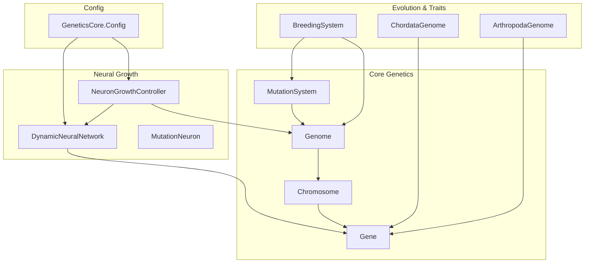
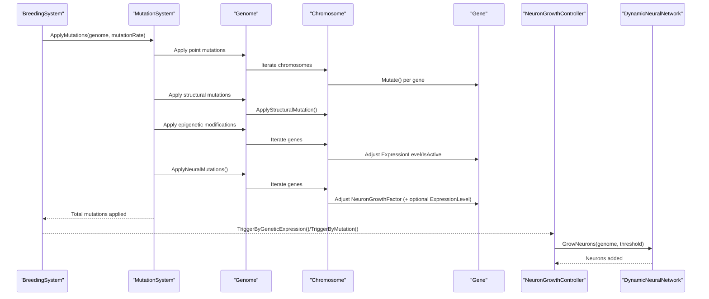
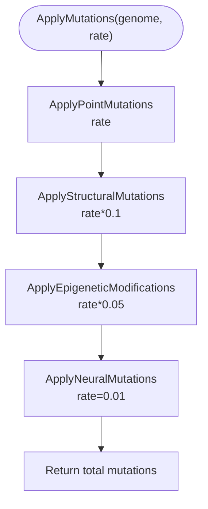
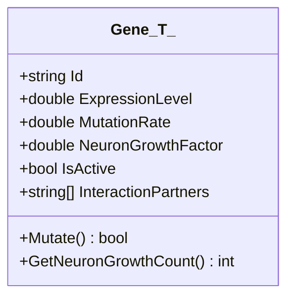
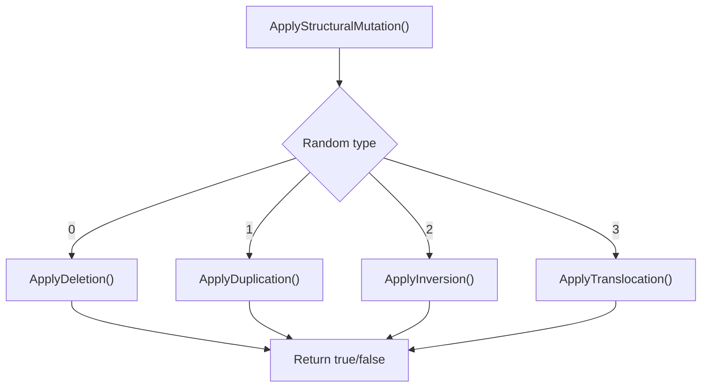
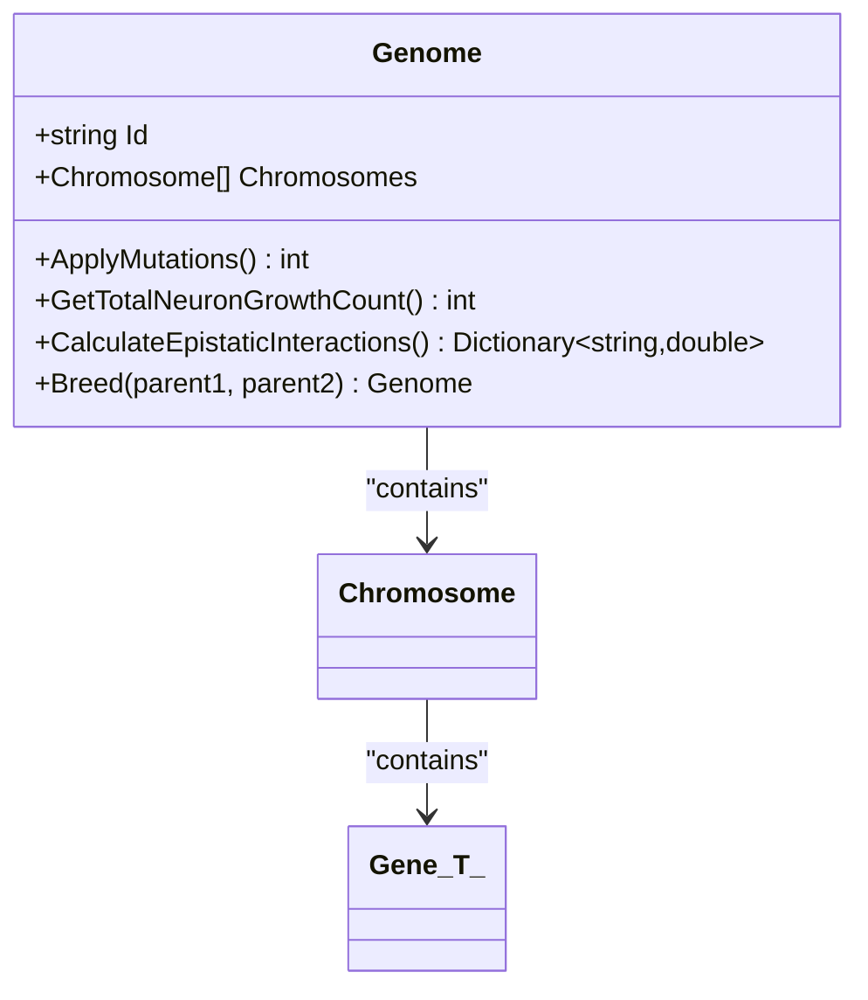
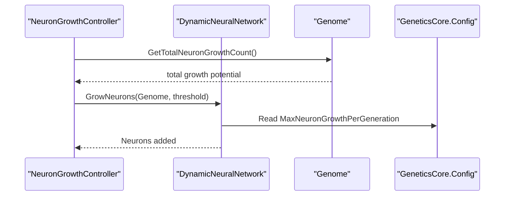
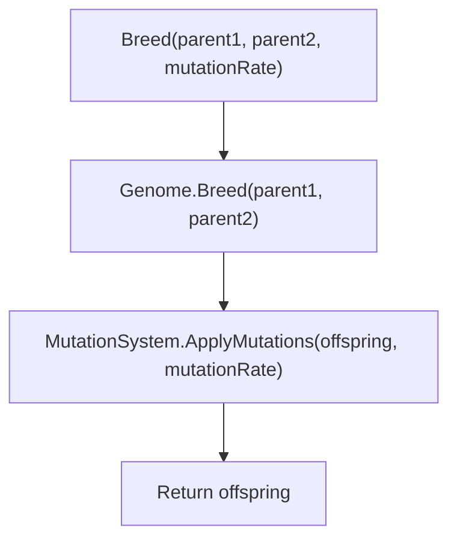
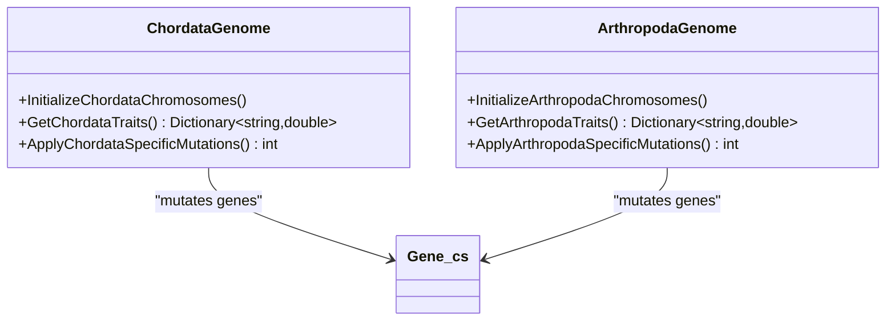
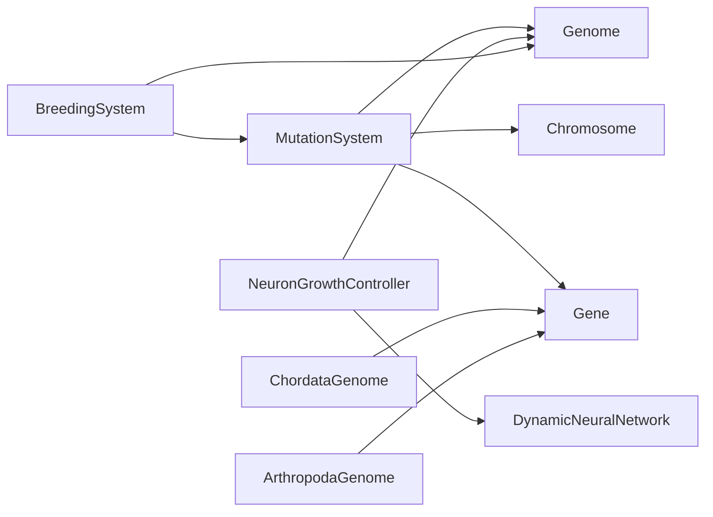

# Mutation System Architecture

<cite>
**Referenced Files in This Document**
- [MutationSystem.cs](file://GeneticsGame/Core/MutationSystem.cs)
- [GeneticsCore.cs](file://GeneticsGame/Core/GeneticsCore.cs)
- [Genome.cs](file://GeneticsGame/Core/Genome.cs)
- [Chromosome.cs](file://GeneticsGame/Core/Chromosome.cs)
- [Gene.cs](file://GeneticsGame/Core/Gene.cs)
- [DynamicNeuralNetwork.cs](file://GeneticsGame/Systems/DynamicNeuralNetwork.cs)
- [NeuronGrowthController.cs](file://GeneticsGame/Systems/NeuronGrowthController.cs)
- [NeuralLearningSystem.cs](file://GeneticsGame/Systems/NeuralLearningSystem.cs)
- [MutationNeuron.cs](file://GeneticsGame/Systems/MutationNeuron.cs)
- [BreedingSystem.cs](file://GeneticsGame/Systems/BreedingSystem.cs)
- [ChordataGenome.cs](file://GeneticsGame/Phyla/Chordata/ChordataGenome.cs)
- [ArthropodaGenome.cs](file://GeneticsGame/Phyla/Arthropoda/ArthropodaGenome.cs)
</cite>

## Table of Contents
1. [Introduction](#introduction)
2. [Project Structure](#project-structure)
3. [Core Components](#core-components)
4. [Architecture Overview](#architecture-overview)
5. [Detailed Component Analysis](#detailed-component-analysis)
6. [Dependency Analysis](#dependency-analysis)
7. [Performance Considerations](#performance-considerations)
8. [Troubleshooting Guide](#troubleshooting-guide)
9. [Conclusion](#conclusion)

## Introduction
This document explains the MutationSystem that governs genetic variation and evolution within the 3D Genetics simulation. It covers the architecture of mutation processes—point mutations, structural mutations, epigenetic modifications, and neural-specific mutations—and how they influence genetic fitness, neural network development, physical traits, and behavioral adaptations. It also documents mutation rates, mutation types, and their effects on genetic diversity, along with practical examples of mutation simulation, tracking mutation accumulation, and analyzing mutational effects. Finally, it addresses the balance between mutation rates and genetic stability in evolutionary contexts.

## Project Structure
The mutation system spans core genetic primitives and systems that orchestrate growth, learning, and heredity:
- Core genetics: Gene, Chromosome, Genome, MutationSystem
- Neural growth: DynamicNeuralNetwork, NeuronGrowthController, MutationNeuron
- Evolutionary mechanics: BreedingSystem, phyla-specific genomes
- Global configuration: GeneticsCore

**Diagram sources**
- [MutationSystem.cs:17-29](file://GeneticsGame/Core/MutationSystem.cs#L17-L29)
- [Genome.cs:44-66](file://GeneticsGame/Core/Genome.cs#L44-L66)
- [Chromosome.cs:44-62](file://GeneticsGame/Core/Chromosome.cs#L44-L62)
- [Gene.cs:63-79](file://GeneticsGame/Core/Gene.cs#L63-L79)
- [DynamicNeuralNetwork.cs:63-99](file://GeneticsGame/Systems/DynamicNeuralNetwork.cs#L63-L99)
- [NeuronGrowthController.cs:36-63](file://GeneticsGame/Systems/NeuronGrowthController.cs#L36-L63)
- [MutationNeuron.cs:7-49](file://GeneticsGame/Systems/MutationNeuron.cs#L7-L49)
- [BreedingSystem.cs:18-27](file://GeneticsGame/Systems/BreedingSystem.cs#L18-L27)
- [ChordataGenome.cs:101-133](file://GeneticsGame/Phyla/Chordata/ChordataGenome.cs#L101-L133)
- [ArthropodaGenome.cs:101-133](file://GeneticsGame/Phyla/Arthropoda/ArthropodaGenome.cs#L101-L133)
- [GeneticsCore.cs:14-19](file://GeneticsGame/Core/GeneticsCore.cs#L14-L19)

**Section sources**
- [MutationSystem.cs:17-29](file://GeneticsGame/Core/MutationSystem.cs#L17-L29)
- [GeneticsCore.cs:14-19](file://GeneticsGame/Core/GeneticsCore.cs#L14-L19)

## Core Components
- MutationSystem: Central orchestrator applying point, structural, epigenetic, and neural-specific mutations to a genome.
- Gene: Encapsulates expression level, mutation rate, neuron growth factor, activity state, and epistatic interaction partners.
- Chromosome: Holds genes and supports structural mutations (deletion, duplication, inversion, translocation).
- Genome: Aggregates chromosomes, applies mutations, calculates epistatic interactions, and enables breeding.
- DynamicNeuralNetwork: Supports dynamic neuron growth based on genetic triggers and activity thresholds.
- NeuronGrowthController: Hybrid controller that triggers neuron growth via genetic expression, mutation, and learning.
- BreedingSystem: Creates offspring via inheritance and applies mutations according to a global rate.
- Phyla-specific Genomes: ChordataGenome and ArthropodaGenome specialize mutation rates for lineage-relevant traits.

**Section sources**
- [MutationSystem.cs:17-136](file://GeneticsGame/Core/MutationSystem.cs#L17-L136)
- [Gene.cs:9-93](file://GeneticsGame/Core/Gene.cs#L9-L93)
- [Chromosome.cs:9-146](file://GeneticsGame/Core/Chromosome.cs#L9-L146)
- [Genome.cs:9-190](file://GeneticsGame/Core/Genome.cs#L9-L190)
- [DynamicNeuralNetwork.cs:9-116](file://GeneticsGame/Systems/DynamicNeuralNetwork.cs#L9-L116)
- [NeuronGrowthController.cs:9-122](file://GeneticsGame/Systems/NeuronGrowthController.cs#L9-L122)
- [BreedingSystem.cs:9-182](file://GeneticsGame/Systems/BreedingSystem.cs#L9-L182)
- [ChordataGenome.cs:9-134](file://GeneticsGame/Phyla/Chordata/ChordataGenome.cs#L9-L134)
- [ArthropodaGenome.cs:9-134](file://GeneticsGame/Phyla/Arthropoda/ArthropodaGenome.cs#L9-L134)

## Architecture Overview
The mutation pipeline integrates three primary mutation engines with neural growth and heredity:
- Point mutations: Random adjustments to expression level, neuron growth factor, and activity state for each gene.
- Structural mutations: Chromosome-level rearrangements (deletion, duplication, inversion, translocation).
- Epigenetic modifications: Adjust expression levels without altering DNA sequence; toggles activity thresholds.
- Neural-specific mutations: Alter neuron growth factors and optionally expression levels for neural genes.

These mutations feed into neural growth via NeuronGrowthController, which considers genetic expression, mutation events, and learning activity. BreedingSystem ensures hereditary transmission with mutation application.

**Diagram sources**
- [BreedingSystem.cs:18-27](file://GeneticsGame/Systems/BreedingSystem.cs#L18-L27)
- [MutationSystem.cs:17-29](file://GeneticsGame/Core/MutationSystem.cs#L17-L29)
- [MutationSystem.cs:37-54](file://GeneticsGame/Core/MutationSystem.cs#L37-L54)
- [MutationSystem.cs:62-76](file://GeneticsGame/Core/MutationSystem.cs#L62-L76)
- [MutationSystem.cs:84-103](file://GeneticsGame/Core/MutationSystem.cs#L84-L103)
- [MutationSystem.cs:111-136](file://GeneticsGame/Core/MutationSystem.cs#L111-L136)
- [NeuronGrowthController.cs:36-63](file://GeneticsGame/Systems/NeuronGrowthController.cs#L36-L63)
- [DynamicNeuralNetwork.cs:63-99](file://GeneticsGame/Systems/DynamicNeuralNetwork.cs#L63-L99)

## Detailed Component Analysis

### MutationSystem
- Purpose: Apply multiple mutation types to a genome with configurable rates.
- Point mutations: For each gene, probabilistically mutate expression level, neuron growth factor, and activity state.
- Structural mutations: For each chromosome, probabilistically apply one of four rearrangements (deletion, duplication, inversion, translocation).
- Epigenetic modifications: For each gene, probabilistically adjust expression level and toggle activity threshold.
- Neural-specific mutations: For each gene with positive neuron growth factor, adjust growth factor and optionally expression level for neural-related genes.
- Rate scaling: Structural and epigenetic mutations receive reduced base rates compared to point mutations.

**Diagram sources**
- [MutationSystem.cs:17-29](file://GeneticsGame/Core/MutationSystem.cs#L17-L29)
- [MutationSystem.cs:37-54](file://GeneticsGame/Core/MutationSystem.cs#L37-L54)
- [MutationSystem.cs:62-76](file://GeneticsGame/Core/MutationSystem.cs#L62-L76)
- [MutationSystem.cs:84-103](file://GeneticsGame/Core/MutationSystem.cs#L84-L103)
- [MutationSystem.cs:111-136](file://GeneticsGame/Core/MutationSystem.cs#L111-L136)

**Section sources**
- [MutationSystem.cs:17-136](file://GeneticsGame/Core/MutationSystem.cs#L17-L136)

### Gene
- Properties: Id, ExpressionLevel, MutationRate, NeuronGrowthFactor, IsActive, InteractionPartners.
- Mutate(): Probabilistically adjusts expression level and neuron growth factor, and toggles activity state.
- GetNeuronGrowthCount(): Computes neuron addition potential based on activity, expression level, and growth factor.

**Diagram sources**
- [Gene.cs:9-93](file://GeneticsGame/Core/Gene.cs#L9-L93)

**Section sources**
- [Gene.cs:9-93](file://GeneticsGame/Core/Gene.cs#L9-L93)

### Chromosome
- Holds a list of genes and supports structural mutations.
- ApplyStructuralMutation(): Randomly selects one of deletion, duplication, inversion, or translocation.
- Deletion/Duplication/Inversion/Translocation: Remove/insert segments, reverse segments, or relocate segments with randomized bounds.

**Diagram sources**
- [Chromosome.cs:44-62](file://GeneticsGame/Core/Chromosome.cs#L44-L62)
- [Chromosome.cs:68-77](file://GeneticsGame/Core/Chromosome.cs#L68-L77)
- [Chromosome.cs:83-93](file://GeneticsGame/Core/Chromosome.cs#L83-L93)
- [Chromosome.cs:99-115](file://GeneticsGame/Core/Chromosome.cs#L99-L115)
- [Chromosome.cs:121-136](file://GeneticsGame/Core/Chromosome.cs#L121-L136)

**Section sources**
- [Chromosome.cs:44-146](file://GeneticsGame/Core/Chromosome.cs#L44-L146)

### Genome
- Aggregates chromosomes and coordinates mutation application.
- ApplyMutations(): Legacy method applying point and structural mutations across all genes/chromosomes.
- GetTotalNeuronGrowthCount(): Sums neuron growth potential across all genes.
- CalculateEpistaticInteractions(): Computes interaction strengths based on expression levels and interaction partners.
- Breed(): Implements Mendelian-like inheritance with averaging of expression levels and copying of interaction partners.

**Diagram sources**
- [Genome.cs:9-190](file://GeneticsGame/Core/Genome.cs#L9-L190)
- [Chromosome.cs:9-146](file://GeneticsGame/Core/Chromosome.cs#L9-L146)
- [Gene.cs:9-93](file://GeneticsGame/Core/Gene.cs#L9-L93)

**Section sources**
- [Genome.cs:44-189](file://GeneticsGame/Core/Genome.cs#L44-L189)

### DynamicNeuralNetwork and NeuronGrowthController
- DynamicNeuralNetwork.GrowNeurons(): Adds new neurons when activity exceeds a threshold, bounded by genetic growth potential and a global cap.
- NeuronGrowthController: Triggers growth via genetic expression (highest priority), mutation events (medium), and learning activity (lowest).

**Diagram sources**
- [NeuronGrowthController.cs:36-63](file://GeneticsGame/Systems/NeuronGrowthController.cs#L36-L63)
- [DynamicNeuralNetwork.cs:63-99](file://GeneticsGame/Systems/DynamicNeuralNetwork.cs#L63-L99)
- [GeneticsCore.cs:14-19](file://GeneticsGame/Core/GeneticsCore.cs#L14-L19)

**Section sources**
- [DynamicNeuralNetwork.cs:63-99](file://GeneticsGame/Systems/DynamicNeuralNetwork.cs#L63-L99)
- [NeuronGrowthController.cs:36-122](file://GeneticsGame/Systems/NeuronGrowthController.cs#L36-L122)

### BreedingSystem and Heredity
- BreedingSystem.Breed(): Produces offspring via inheritance and applies mutations at a given rate.
- Compatibility metrics: Similarity and diversity scores guide pairing decisions.

**Diagram sources**
- [BreedingSystem.cs:18-27](file://GeneticsGame/Systems/BreedingSystem.cs#L18-L27)
- [Genome.cs:134-189](file://GeneticsGame/Core/Genome.cs#L134-L189)
- [MutationSystem.cs:17-29](file://GeneticsGame/Core/MutationSystem.cs#L17-L29)

**Section sources**
- [BreedingSystem.cs:18-182](file://GeneticsGame/Systems/BreedingSystem.cs#L18-L182)
- [Genome.cs:134-189](file://GeneticsGame/Core/Genome.cs#L134-L189)

### Phyla-Specific Mutation Behavior
- ChordataGenome: Increases mutation rates for neural and spine-related genes.
- ArthropodaGenome: Increases mutation rates for neural and exoskeleton/moulting genes.

**Diagram sources**
- [ChordataGenome.cs:24-133](file://GeneticsGame/Phyla/Chordata/ChordataGenome.cs#L24-L133)
- [ArthropodaGenome.cs:24-133](file://GeneticsGame/Phyla/Arthropoda/ArthropodaGenome.cs#L24-L133)
- [Gene.cs:9-93](file://GeneticsGame/Core/Gene.cs#L9-L93)

**Section sources**
- [ChordataGenome.cs:101-133](file://GeneticsGame/Phyla/Chordata/ChordataGenome.cs#L101-L133)
- [ArthropodaGenome.cs:101-133](file://GeneticsGame/Phyla/Arthropoda/ArthropodaGenome.cs#L101-L133)

## Dependency Analysis
- Coupling: MutationSystem depends on Genome, Chromosome, and Gene. Neural growth depends on Genome and DynamicNeuralNetwork. BreedingSystem depends on MutationSystem and Genome.
- Cohesion: Each component encapsulates a focused responsibility—mutations, growth, heredity, and traits.
- External dependencies: Uses System.Random for stochastic behavior; no external libraries.

**Diagram sources**
- [MutationSystem.cs:17-136](file://GeneticsGame/Core/MutationSystem.cs#L17-L136)
- [NeuronGrowthController.cs:36-122](file://GeneticsGame/Systems/NeuronGrowthController.cs#L36-L122)
- [BreedingSystem.cs:18-27](file://GeneticsGame/Systems/BreedingSystem.cs#L18-L27)
- [ChordataGenome.cs:101-133](file://GeneticsGame/Phyla/Chordata/ChordataGenome.cs#L101-L133)
- [ArthropodaGenome.cs:101-133](file://GeneticsGame/Phyla/Arthropoda/ArthropodaGenome.cs#L101-L133)

**Section sources**
- [MutationSystem.cs:17-136](file://GeneticsGame/Core/MutationSystem.cs#L17-L136)
- [NeuronGrowthController.cs:36-122](file://GeneticsGame/Systems/NeuronGrowthController.cs#L36-L122)
- [BreedingSystem.cs:18-27](file://GeneticsGame/Systems/BreedingSystem.cs#L18-L27)

## Performance Considerations
- Complexity:
  - Point mutations: O(G) where G is total number of genes.
  - Structural mutations: O(C) where C is number of chromosomes.
  - Epigenetic modifications: O(G).
  - Neural-specific mutations: O(G).
  - Neural growth: O(P) where P is growth potential; bounded by a global cap.
- Optimization opportunities:
  - Batch mutation application could reduce repeated random calls.
  - Early termination checks for empty chromosomes/genes.
  - Parallelization of independent gene mutations (subject to thread safety of random generation).
- Stability:
  - Mutation rates are scaled to maintain evolutionary pressure while preventing genomic instability.
  - Global caps on neuron growth prevent exponential runaway expansion.

[No sources needed since this section provides general guidance]

## Troubleshooting Guide
- Symptom: Too few mutations occurring.
  - Verify base mutation rate passed to MutationSystem.ApplyMutations.
  - Confirm gene MutationRate and activity thresholds.
- Symptom: Excessive structural rearrangements causing instability.
  - Reduce structural mutation rate multiplier (currently 0.1).
- Symptom: Neural network does not grow despite mutations.
  - Check activity threshold and growth potential; ensure NeuronGrowthController is invoked after mutation application.
- Symptom: Offspring identical to parents.
  - Ensure BreedingSystem.Breed invokes MutationSystem.ApplyMutations with a non-zero rate.
- Symptom: Trait diversity remains low.
  - Review epistatic interaction calculations and expression level variance.

**Section sources**
- [MutationSystem.cs:17-29](file://GeneticsGame/Core/MutationSystem.cs#L17-L29)
- [DynamicNeuralNetwork.cs:63-99](file://GeneticsGame/Systems/DynamicNeuralNetwork.cs#L63-L99)
- [NeuronGrowthController.cs:36-122](file://GeneticsGame/Systems/NeuronGrowthController.cs#L36-L122)
- [BreedingSystem.cs:18-27](file://GeneticsGame/Systems/BreedingSystem.cs#L18-L27)

## Conclusion
The MutationSystem integrates point, structural, epigenetic, and neural-specific mutations to drive genetic variation and evolution. It balances mutation rates with stability, feeds into neural growth via a hybrid controller, and preserves heredity through a robust breeding mechanism. Phyla-specific genomes further tailor mutation dynamics to lineage-relevant traits. Together, these components enable realistic simulation of evolutionary pressures, genetic diversity, and adaptive neural development.