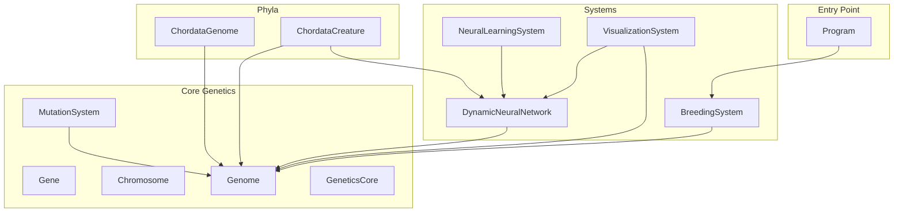
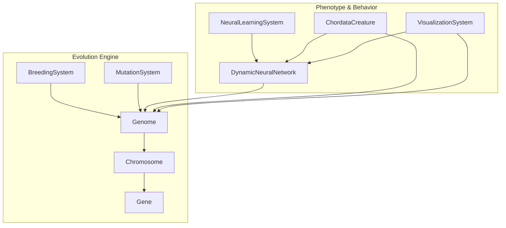
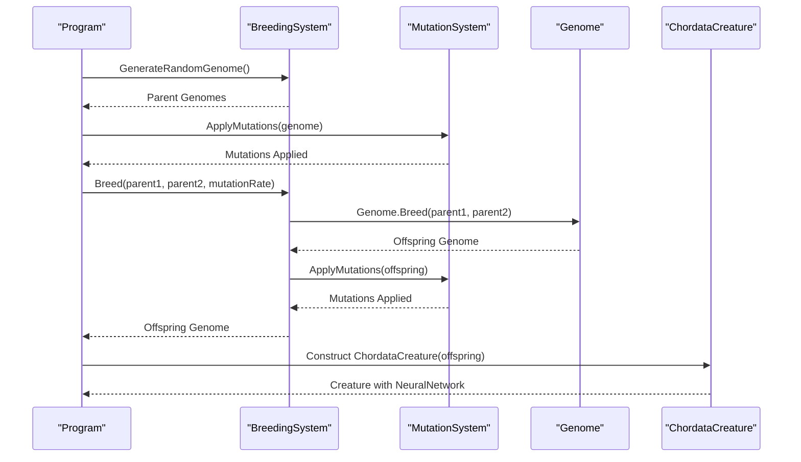
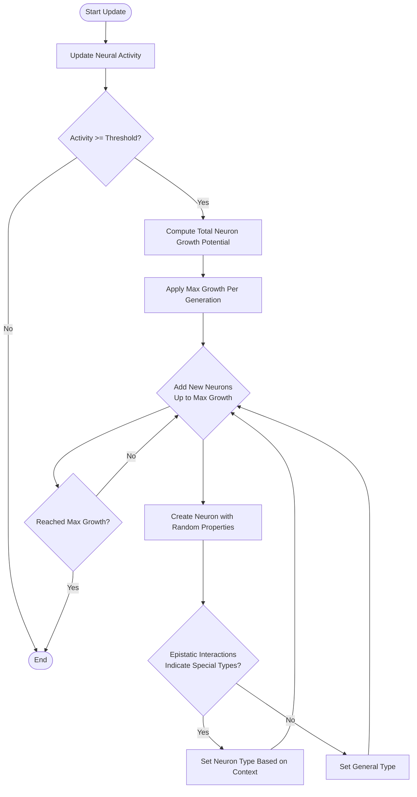
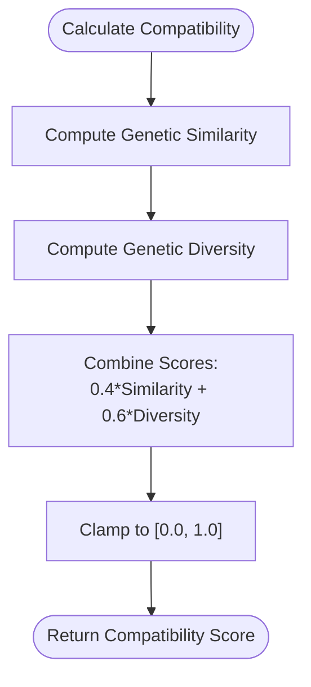
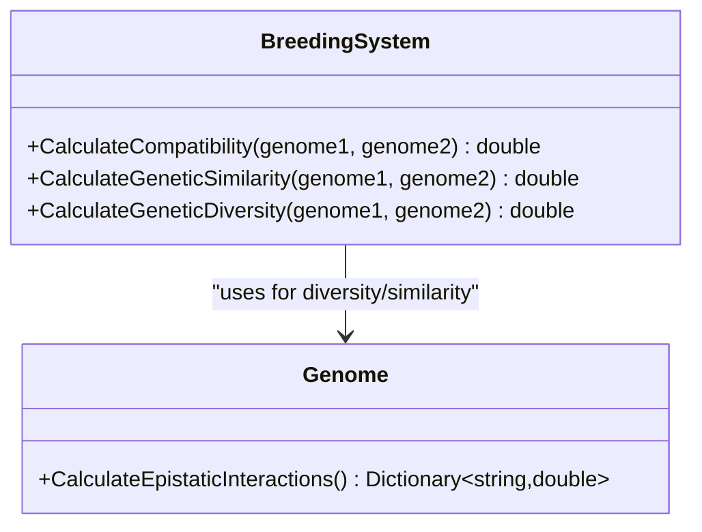
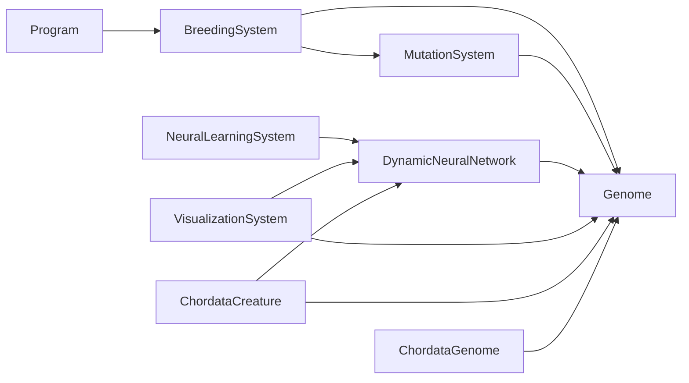

# Advanced Evolutionary Studies

<cite>
**Referenced Files in This Document**
- [GeneticsCore.cs](file://GeneticsGame/Core/GeneticsCore.cs)
- [Gene.cs](file://GeneticsGame/Core/Gene.cs)
- [Chromosome.cs](file://GeneticsGame/Core/Chromosome.cs)
- [Genome.cs](file://GeneticsGame/Core/Genome.cs)
- [MutationSystem.cs](file://GeneticsGame/Core/MutationSystem.cs)
- [BreedingSystem.cs](file://GeneticsGame/Systems/BreedingSystem.cs)
- [DynamicNeuralNetwork.cs](file://GeneticsGame/Systems/DynamicNeuralNetwork.cs)
- [NeuralLearningSystem.cs](file://GeneticsGame/Systems/NeuralLearningSystem.cs)
- [VisualizationSystem.cs](file://GeneticsGame/Systems/VisualizationSystem.cs)
- [ChordataCreature.cs](file://GeneticsGame/Phyla/Chordata/ChordataCreature.cs)
- [ChordataGenome.cs](file://GeneticsGame/Phyla/Chordata/ChordataGenome.cs)
- [Program.cs](file://GeneticsGame/Program.cs)
- [GeneticsGame.csproj](file://GeneticsGame/GeneticsGame.csproj)
</cite>

## Table of Contents
1. [Introduction](#introduction)
2. [Project Structure](#project-structure)
3. [Core Components](#core-components)
4. [Architecture Overview](#architecture-overview)
5. [Detailed Component Analysis](#detailed-component-analysis)
6. [Dependency Analysis](#dependency-analysis)
7. [Performance Considerations](#performance-considerations)
8. [Troubleshooting Guide](#troubleshooting-guide)
9. [Conclusion](#conclusion)
10. [Appendices](#appendices)

## Introduction
This document provides advanced tutorials for conducting evolutionary studies and research applications using the 3D Genetics Game codebase. It demonstrates how to set up long-term evolution experiments, monitor evolutionary progress, and analyze genetic changes over many generations. It covers population genetics analysis techniques such as tracking allele frequencies, measuring genetic diversity, and studying evolutionary adaptation. Exercises are included for implementing artificial selection experiments, studying co-evolutionary dynamics, and investigating evolutionary trade-offs. Guidance is provided on statistical analysis of evolutionary data, creating evolutionary timelines, and documenting adaptive changes. Best practices for large-scale simulations are documented, including computational efficiency, data management, and result interpretation.

## Project Structure
The project is organized around a modular genetic system with clear separation between core genetics, neural systems, and phyla-specific implementations. The structure supports evolutionary experimentation by enabling controlled mutation, inheritance, and neural plasticity.

**Diagram sources**
- [GeneticsCore.cs:9-20](file://GeneticsGame/Core/GeneticsCore.cs#L9-L20)
- [Gene.cs:9-93](file://GeneticsGame/Core/Gene.cs#L9-L93)
- [Chromosome.cs:9-146](file://GeneticsGame/Core/Chromosome.cs#L9-L146)
- [Genome.cs:9-190](file://GeneticsGame/Core/Genome.cs#L9-L190)
- [MutationSystem.cs:9-137](file://GeneticsGame/Core/MutationSystem.cs#L9-L137)
- [BreedingSystem.cs:9-182](file://GeneticsGame/Systems/BreedingSystem.cs#L9-L182)
- [DynamicNeuralNetwork.cs:9-116](file://GeneticsGame/Systems/DynamicNeuralNetwork.cs#L9-L116)
- [NeuralLearningSystem.cs:9-122](file://GeneticsGame/Systems/NeuralLearningSystem.cs#L9-L122)
- [VisualizationSystem.cs:9-239](file://GeneticsGame/Systems/VisualizationSystem.cs#L9-L239)
- [ChordataGenome.cs:9-134](file://GeneticsGame/Phyla/Chordata/ChordataGenome.cs#L9-L134)
- [ChordataCreature.cs:9-133](file://GeneticsGame/Phyla/Chordata/ChordataCreature.cs#L9-L133)
- [Program.cs:9-58](file://GeneticsGame/Program.cs#L9-L58)

**Section sources**
- [GeneticsGame.csproj:1-14](file://GeneticsGame/GeneticsGame.csproj#L1-L14)
- [Program.cs:11-57](file://GeneticsGame/Program.cs#L11-L57)

## Core Components
This section explains the fundamental building blocks of the evolutionary system and how they interact to enable long-term evolution experiments.

- Gene<T>: Encapsulates expression level, mutation rate, neuron growth factor, activity state, and epistatic interaction partners. Supports point mutations that alter expression level, neuron growth factor, and activity state.
- Chromosome: Holds a collection of genes and supports structural mutations (deletion, duplication, inversion, translocation) that alter gene order and quantity.
- Genome: Aggregates chromosomes and implements multi-gene interactions, epistatic calculations, and Mendelian-style inheritance via a static breed method.
- MutationSystem: Centralized mutation engine applying point, structural, epigenetic, and neural-specific mutations with tunable rates.
- BreedingSystem: Manages compatibility scoring, random genome generation, and offspring creation with inherited traits and mutations.
- DynamicNeuralNetwork: Runtime neuron growth controller triggered by genetic expression and activity thresholds, with activity updates and connection management.
- NeuralLearningSystem: Implements learning-driven synapse formation, strengthening, pruning, and neuron growth, enabling adaptation to environments and tasks.
- VisualizationSystem: Translates genetic and neural data into visualization parameters for complexity, color palette, animations, and neural distributions.
- ChordataGenome and ChordataCreature: Specialized implementations for vertebrate-like traits, including neural development, spine formation, limbs, sensory systems, and metabolism.

**Section sources**
- [Gene.cs:9-93](file://GeneticsGame/Core/Gene.cs#L9-L93)
- [Chromosome.cs:9-146](file://GeneticsGame/Core/Chromosome.cs#L9-L146)
- [Genome.cs:9-190](file://GeneticsGame/Core/Genome.cs#L9-L190)
- [MutationSystem.cs:9-137](file://GeneticsGame/Core/MutationSystem.cs#L9-L137)
- [BreedingSystem.cs:9-182](file://GeneticsGame/Systems/BreedingSystem.cs#L9-L182)
- [DynamicNeuralNetwork.cs:9-116](file://GeneticsGame/Systems/DynamicNeuralNetwork.cs#L9-L116)
- [NeuralLearningSystem.cs:9-122](file://GeneticsGame/Systems/NeuralLearningSystem.cs#L9-L122)
- [VisualizationSystem.cs:9-239](file://GeneticsGame/Systems/VisualizationSystem.cs#L9-L239)
- [ChordataGenome.cs:9-134](file://GeneticsGame/Phyla/Chordata/ChordataGenome.cs#L9-L134)
- [ChordataCreature.cs:9-133](file://GeneticsGame/Phyla/Chordata/ChordataCreature.cs#L9-L133)

## Architecture Overview
The system integrates genetic inheritance, mutation, neural plasticity, and phenotypic expression to simulate evolutionary dynamics over generations. The architecture supports long-term experiments by decoupling genotype (Genome) from phenotype (creature traits) while maintaining tight coupling between genotype and neural growth.

**Diagram sources**
- [BreedingSystem.cs:18-27](file://GeneticsGame/Systems/BreedingSystem.cs#L18-L27)
- [MutationSystem.cs:17-29](file://GeneticsGame/Core/MutationSystem.cs#L17-L29)
- [Genome.cs:134-189](file://GeneticsGame/Core/Genome.cs#L134-L189)
- [Chromosome.cs:44-62](file://GeneticsGame/Core/Chromosome.cs#L44-L62)
- [Gene.cs:63-79](file://GeneticsGame/Core/Gene.cs#L63-L79)
- [DynamicNeuralNetwork.cs:63-99](file://GeneticsGame/Systems/DynamicNeuralNetwork.cs#L63-L99)
- [NeuralLearningSystem.cs:37-57](file://GeneticsGame/Systems/NeuralLearningSystem.cs#L37-L57)
- [ChordataCreature.cs:41-78](file://GeneticsGame/Phyla/Chordata/ChordataCreature.cs#L41-L78)
- [VisualizationSystem.cs:36-53](file://GeneticsGame/Systems/VisualizationSystem.cs#L36-L53)

## Detailed Component Analysis

### Genetic Inheritance and Mutation Pipeline
This pipeline demonstrates how evolution proceeds across generations: mutation introduces variation, and breeding combines parental traits to produce offspring with inherited characteristics and new mutations.

**Diagram sources**
- [Program.cs:16-44](file://GeneticsGame/Program.cs#L16-L44)
- [BreedingSystem.cs:18-27](file://GeneticsGame/Systems/BreedingSystem.cs#L18-L27)
- [MutationSystem.cs:17-29](file://GeneticsGame/Core/MutationSystem.cs#L17-L29)
- [Genome.cs:134-189](file://GeneticsGame/Core/Genome.cs#L134-L189)
- [ChordataCreature.cs:41-55](file://GeneticsGame/Phyla/Chordata/ChordataCreature.cs#L41-L55)

**Section sources**
- [Program.cs:16-44](file://GeneticsGame/Program.cs#L16-L44)
- [BreedingSystem.cs:18-27](file://GeneticsGame/Systems/BreedingSystem.cs#L18-L27)
- [MutationSystem.cs:17-29](file://GeneticsGame/Core/MutationSystem.cs#L17-L29)
- [Genome.cs:134-189](file://GeneticsGame/Core/Genome.cs#L134-L189)

### Neural Growth and Plasticity
Neuron growth is dynamically controlled by genetic expression and neural activity, enabling adaptation and learning-driven evolution.

**Diagram sources**
- [DynamicNeuralNetwork.cs:63-99](file://GeneticsGame/Systems/DynamicNeuralNetwork.cs#L63-L99)
- [GeneticsCore.cs:14-19](file://GeneticsGame/Core/GeneticsCore.cs#L14-L19)
- [Genome.cs:81-107](file://GeneticsGame/Core/Genome.cs#L81-L107)

**Section sources**
- [DynamicNeuralNetwork.cs:63-99](file://GeneticsGame/Systems/DynamicNeuralNetwork.cs#L63-L99)
- [GeneticsCore.cs:14-19](file://GeneticsGame/Core/GeneticsCore.cs#L14-L19)
- [Genome.cs:81-107](file://GeneticsGame/Core/Genome.cs#L81-L107)

### Compatibility and Selection Scoring
Compatibility scoring balances similarity and diversity to guide selective breeding, enabling artificial selection experiments.

**Diagram sources**
- [BreedingSystem.cs:35-45](file://GeneticsGame/Systems/BreedingSystem.cs#L35-L45)
- [BreedingSystem.cs:53-88](file://GeneticsGame/Systems/BreedingSystem.cs#L53-L88)
- [BreedingSystem.cs:96-128](file://GeneticsGame/Systems/BreedingSystem.cs#L96-L128)

**Section sources**
- [BreedingSystem.cs:35-45](file://GeneticsGame/Systems/BreedingSystem.cs#L35-L45)
- [BreedingSystem.cs:53-88](file://GeneticsGame/Systems/BreedingSystem.cs#L53-L88)
- [BreedingSystem.cs:96-128](file://GeneticsGame/Systems/BreedingSystem.cs#L96-L128)

### Population Genetics Analysis Tools
Population-level analysis can be built using the existing compatibility and diversity metrics, along with epistatic interaction calculations.

**Diagram sources**
- [BreedingSystem.cs:35-128](file://GeneticsGame/Systems/BreedingSystem.cs#L35-L128)
- [Genome.cs:81-107](file://GeneticsGame/Core/Genome.cs#L81-L107)

**Section sources**
- [BreedingSystem.cs:35-128](file://GeneticsGame/Systems/BreedingSystem.cs#L35-L128)
- [Genome.cs:81-107](file://GeneticsGame/Core/Genome.cs#L81-L107)

### Artificial Selection Exercises
- Setup: Create a founder population using random genomes and apply neutral mutation for several generations to establish baseline diversity.
- Selection Criterion: Define a trait of interest (e.g., movement speed or neural activity) and compute a fitness score per creature.
- Breeding: Use compatibility scoring to pair creatures with complementary genetics and high trait scores.
- Monitoring: Track mean trait value, genetic diversity, and compatibility over generations to detect selection response and inbreeding.

**Section sources**
- [BreedingSystem.cs:35-45](file://GeneticsGame/Systems/BreedingSystem.cs#L35-L45)
- [ChordataCreature.cs:83-122](file://GeneticsGame/Phyla/Chordata/ChordataCreature.cs#L83-L122)

### Co-Evolutionary Dynamics
- Pairwise Interactions: Model mutualistic or antagonistic relationships by linking epistatic interactions between genes encoding traits of interacting species.
- Feedback Loops: Introduce cross-species gene flow or shared environmental pressures to drive correlated evolution.
- Metrics: Track allele frequency correlations and co-divergence indices across evolving populations.

**Section sources**
- [Genome.cs:81-107](file://GeneticsGame/Core/Genome.cs#L81-L107)
- [Chromosome.cs:44-62](file://GeneticsGame/Core/Chromosome.cs#L44-L62)

### Evolutionary Trade-Offs Investigation
- Constraint Modeling: Use epistatic interactions to model pleiotropy and trade-offs (e.g., brain size vs. locomotion).
- Experimental Design: Select for one trait while monitoring secondary traits to quantify trade-off strength.
- Interpretation: Analyze correlation matrices of trait expression levels across generations.

**Section sources**
- [Genome.cs:81-107](file://GeneticsGame/Core/Genome.cs#L81-L107)
- [ChordataGenome.cs:76-95](file://GeneticsGame/Phyla/Chordata/ChordataGenome.cs#L76-L95)

### Statistical Analysis and Timelines
- Data Collection: Record genome-level statistics (mean expression, variance, epistatic strengths) and creature-level metrics (activity, movement, mesh complexity).
- Visualization: Use visualization parameters to track trends over time.
- Timeline Construction: Aggregate statistics per generation to build evolutionary timelines and assess convergence or divergence.

**Section sources**
- [VisualizationSystem.cs:36-53](file://GeneticsGame/Systems/VisualizationSystem.cs#L36-L53)
- [DynamicNeuralNetwork.cs:104-115](file://GeneticsGame/Systems/DynamicNeuralNetwork.cs#L104-L115)

## Dependency Analysis
The system exhibits strong cohesion within functional areas and low coupling between modules, facilitating extensibility for evolutionary research.

**Diagram sources**
- [Program.cs:16-44](file://GeneticsGame/Program.cs#L16-L44)
- [BreedingSystem.cs:18-27](file://GeneticsGame/Systems/BreedingSystem.cs#L18-L27)
- [MutationSystem.cs:17-29](file://GeneticsGame/Core/MutationSystem.cs#L17-L29)
- [DynamicNeuralNetwork.cs:63-99](file://GeneticsGame/Systems/DynamicNeuralNetwork.cs#L63-L99)
- [NeuralLearningSystem.cs:37-57](file://GeneticsGame/Systems/NeuralLearningSystem.cs#L37-L57)
- [VisualizationSystem.cs:36-53](file://GeneticsGame/Systems/VisualizationSystem.cs#L36-L53)
- [ChordataCreature.cs:41-78](file://GeneticsGame/Phyla/Chordata/ChordataCreature.cs#L41-L78)
- [ChordataGenome.cs:15-70](file://GeneticsGame/Phyla/Chordata/ChordataGenome.cs#L15-L70)

**Section sources**
- [Program.cs:16-44](file://GeneticsGame/Program.cs#L16-L44)
- [BreedingSystem.cs:18-27](file://GeneticsGame/Systems/BreedingSystem.cs#L18-L27)
- [MutationSystem.cs:17-29](file://GeneticsGame/Core/MutationSystem.cs#L17-L29)
- [DynamicNeuralNetwork.cs:63-99](file://GeneticsGame/Systems/DynamicNeuralNetwork.cs#L63-L99)
- [NeuralLearningSystem.cs:37-57](file://GeneticsGame/Systems/NeuralLearningSystem.cs#L37-L57)
- [VisualizationSystem.cs:36-53](file://GeneticsGame/Systems/VisualizationSystem.cs#L36-L53)
- [ChordataCreature.cs:41-78](file://GeneticsGame/Phyla/Chordata/ChordataCreature.cs#L41-L78)
- [ChordataGenome.cs:15-70](file://GeneticsGame/Phyla/Chordata/ChordataGenome.cs#L15-L70)

## Performance Considerations
- Computational Efficiency
  - Minimize nested loops in compatibility and diversity calculations by precomputing gene sets and using early exits.
  - Cache epistatic interaction results when recalculating across generations.
  - Use efficient data structures (e.g., hash maps for gene lookup) to reduce search overhead.
- Data Management
  - Store per-generation statistics in compact formats (e.g., CSV) with columnar layout for fast aggregation.
  - Snapshot genomes periodically to enable reproducible experiments and lineage tracing.
- Result Interpretation
  - Normalize metrics across populations to compare experiments with different sizes.
  - Use moving averages to smooth noisy signals from small populations.

## Troubleshooting Guide
- Symptom: Neural growth exceeds limits unexpectedly.
  - Cause: Activity threshold not met or growth limit not enforced.
  - Fix: Verify activity threshold and max growth per generation configuration.
  - Section sources
    - [DynamicNeuralNetwork.cs:63-72](file://GeneticsGame/Systems/DynamicNeuralNetwork.cs#L63-L72)
    - [GeneticsCore.cs:14-19](file://GeneticsGame/Core/GeneticsCore.cs#L14-L19)
- Symptom: Offspring identical to parents after mutation.
  - Cause: Low mutation rate or inactive genes.
  - Fix: Increase mutation rate or check activity thresholds for key genes.
  - Section sources
    - [MutationSystem.cs:17-29](file://GeneticsGame/Core/MutationSystem.cs#L17-L29)
    - [Gene.cs:63-79](file://GeneticsGame/Core/Gene.cs#L63-L79)
- Symptom: Compatibility scores unstable.
  - Cause: Sparse gene sets or extreme expression differences.
  - Fix: Normalize expression levels and ensure comparable gene sets across genomes.
  - Section sources
    - [BreedingSystem.cs:53-88](file://GeneticsGame/Systems/BreedingSystem.cs#L53-L88)
    - [BreedingSystem.cs:96-128](file://GeneticsGame/Systems/BreedingSystem.cs#L96-L128)

## Conclusion
The 3D Genetics Game provides a robust foundation for advanced evolutionary studies. By leveraging controlled mutation, inheritance, and neural plasticity, researchers can design long-term evolution experiments, monitor genetic and phenotypic changes, and investigate complex evolutionary phenomena such as artificial selection, co-evolution, and trade-offs. The modular architecture supports scalable simulations and detailed data analysis, enabling rigorous scientific inquiry into evolutionary dynamics.

## Appendices

### Exercise: Long-Term Evolution Experiment Setup
- Objective: Establish a sustainable long-term experiment tracking adaptation over hundreds of generations.
- Steps:
  - Initialize a diverse founder population with random genomes.
  - Run neutral drift for 20–50 generations to equilibrate diversity.
  - Apply artificial selection for a target trait (e.g., movement efficiency) for 100+ generations.
  - Periodically record genome statistics, compatibility scores, and creature metrics.
  - Analyze trends and document adaptive changes.

**Section sources**
- [BreedingSystem.cs:137-181](file://GeneticsGame/Systems/BreedingSystem.cs#L137-L181)
- [Program.cs:16-44](file://GeneticsGame/Program.cs#L16-L44)

### Exercise: Co-Evolutionary Arms Race
- Objective: Model reciprocal adaptation between predator and prey traits.
- Steps:
  - Encode traits for both species (e.g., speed, stealth, detection).
  - Link epistatic interactions to reflect mutual dependence.
  - Alternate selection pressure between species each generation.
  - Monitor trait correlations and co-divergence over time.

**Section sources**
- [Genome.cs:81-107](file://GeneticsGame/Core/Genome.cs#L81-L107)
- [Chromosome.cs:44-62](file://GeneticsGame/Core/Chromosome.cs#L44-L62)

### Exercise: Trade-Off Quantification
- Objective: Measure the strength of a genetic trade-off (e.g., brain size vs. locomotion).
- Steps:
  - Select for increased expression of a resource-intensive trait.
  - Track secondary traits over generations.
  - Compute correlation coefficients and regression slopes to quantify the trade-off.

**Section sources**
- [ChordataGenome.cs:76-95](file://GeneticsGame/Phyla/Chordata/ChordataGenome.cs#L76-L95)
- [ChordataCreature.cs:102-122](file://GeneticsGame/Phyla/Chordata/ChordataCreature.cs#L102-L122)