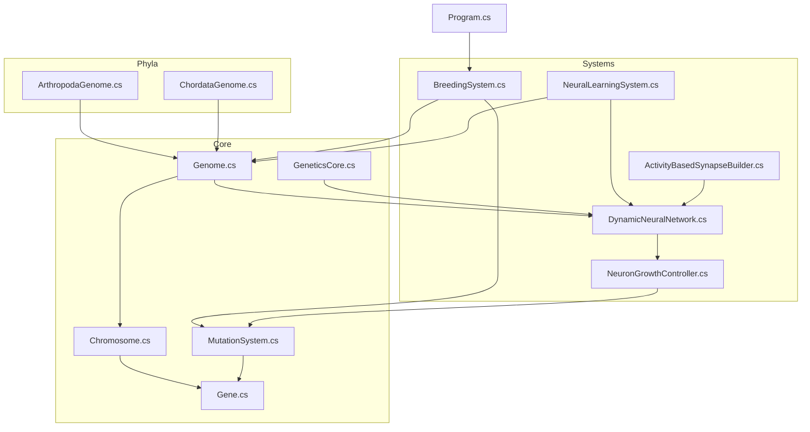
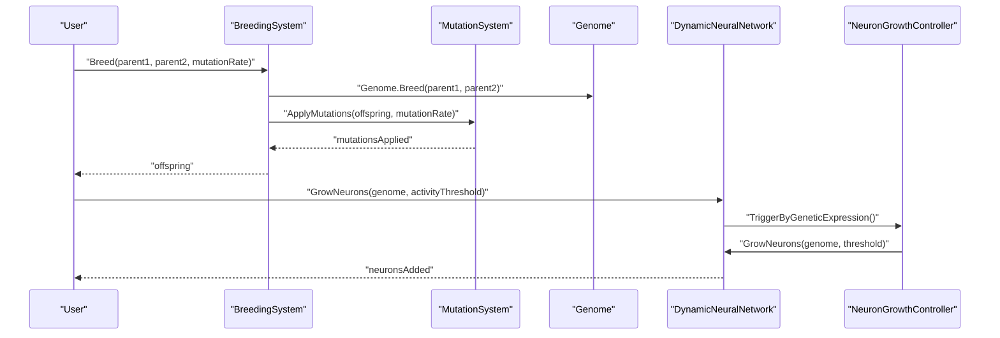
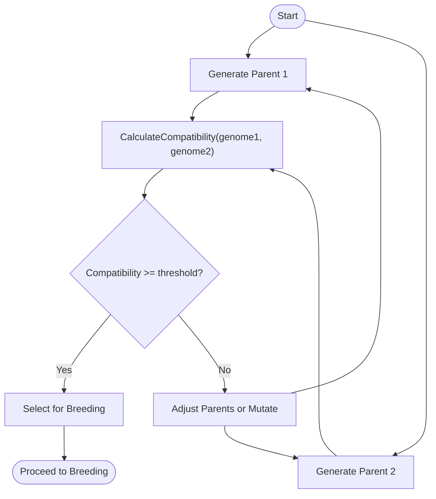
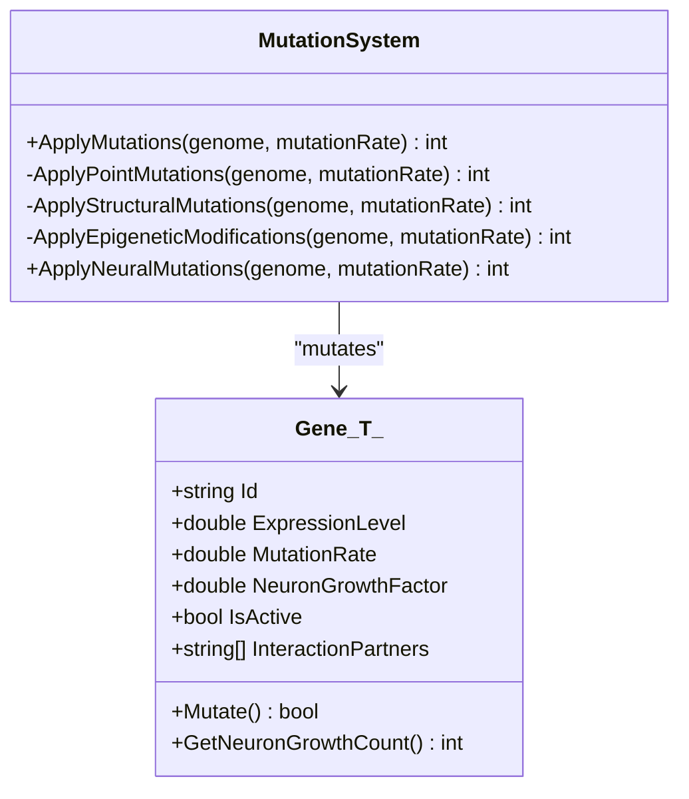
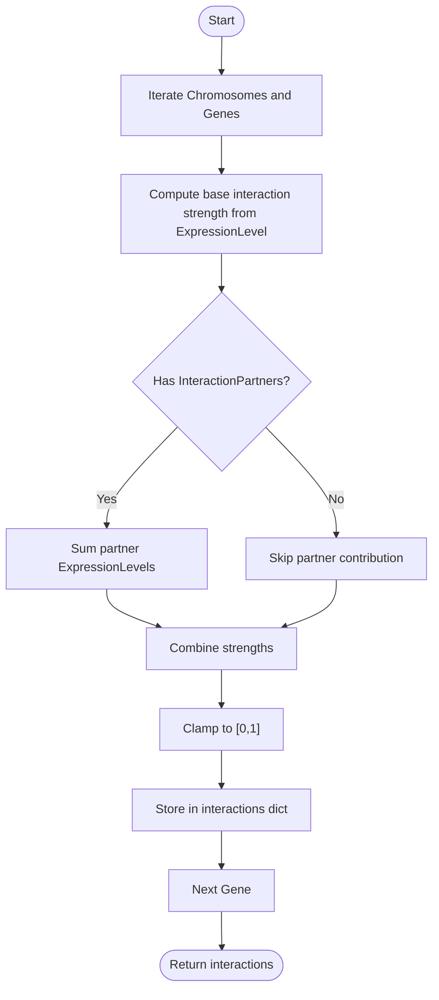
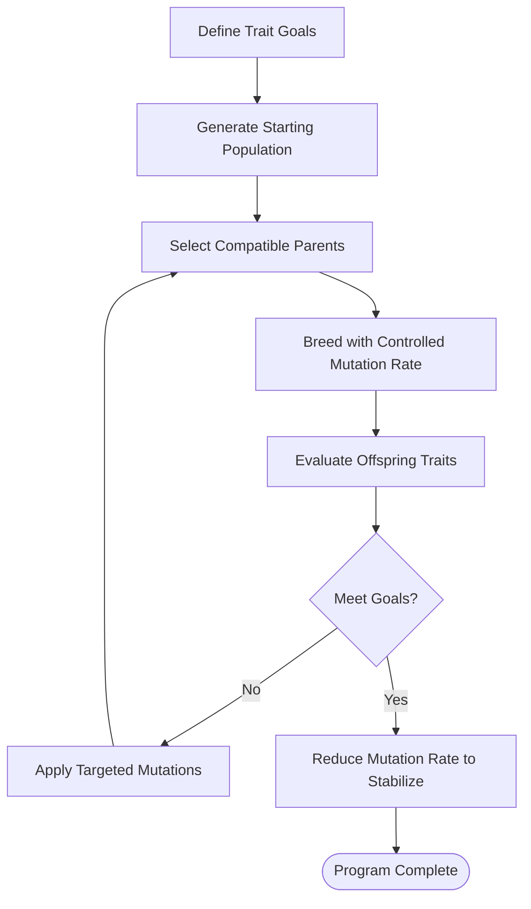
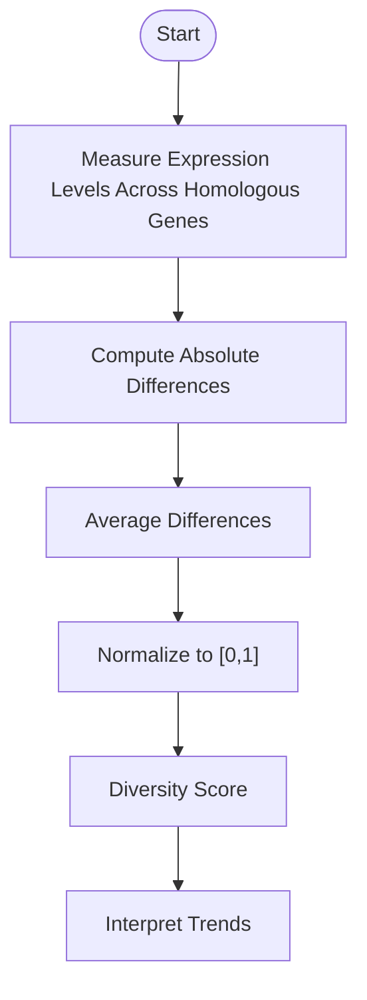
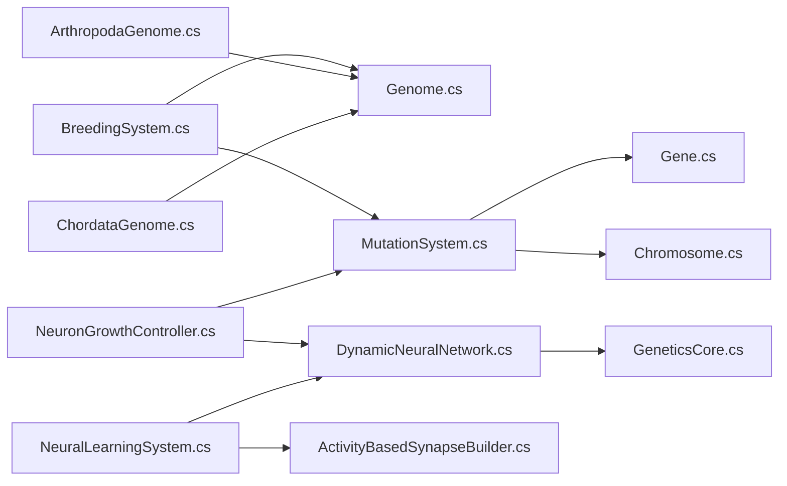

# Basic Genetics Experiments

<cite>
**Referenced Files in This Document**
- [GeneticsCore.cs](file://GeneticsGame/Core/GeneticsCore.cs)
- [Genome.cs](file://GeneticsGame/Core/Genome.cs)
- [Chromosome.cs](file://GeneticsGame/Core/Chromosome.cs)
- [Gene.cs](file://GeneticsGame/Core/Gene.cs)
- [MutationSystem.cs](file://GeneticsGame/Core/MutationSystem.cs)
- [BreedingSystem.cs](file://GeneticsGame/Systems/BreedingSystem.cs)
- [DynamicNeuralNetwork.cs](file://GeneticsGame/Systems/DynamicNeuralNetwork.cs)
- [NeuralLearningSystem.cs](file://GeneticsGame/Systems/NeuralLearningSystem.cs)
- [ActivityBasedSynapseBuilder.cs](file://GeneticsGame/Systems/ActivityBasedSynapseBuilder.cs)
- [NeuronGrowthController.cs](file://GeneticsGame/Systems/NeuronGrowthController.cs)
- [ArthropodaGenome.cs](file://GeneticsGame/Phyla/Arthropoda/ArthropodaGenome.cs)
- [ChordataGenome.cs](file://GeneticsGame/Phyla/Chordata/ChordataGenome.cs)
- [Program.cs](file://GeneticsGame/Program.cs)
</cite>

## Table of Contents
1. [Introduction](#introduction)
2. [Project Structure](#project-structure)
3. [Core Components](#core-components)
4. [Architecture Overview](#architecture-overview)
5. [Detailed Component Analysis](#detailed-component-analysis)
6. [Dependency Analysis](#dependency-analysis)
7. [Performance Considerations](#performance-considerations)
8. [Troubleshooting Guide](#troubleshooting-guide)
9. [Conclusion](#conclusion)
10. [Appendices](#appendices)

## Introduction
This tutorial introduces basic genetic experiments using the 3D Genetics system. It focuses on:
- Creating controlled breeding scenarios via compatible genomes and compatibility scoring
- Applying and understanding different mutation types and their outcomes
- Studying inheritance patterns and trait transmission across generations
- Experimenting with epistatic interactions
- Designing selective breeding programs toward specific traits
- Tracking genetic diversity and analyzing mutation rate effects
- Observing genetic drift, bottlenecks, and founder effects in small populations

The guide uses the repository’s core genetic classes and systems to demonstrate workflows and includes diagrams to visualize interactions.

## Project Structure
The project organizes genetics and neural systems into focused namespaces:
- Core: fundamental genetic units (Gene, Chromosome, Genome) and mutation mechanics
- Systems: breeding, neural growth, learning, and synapse building
- Phyla: taxonomic specialization (Arthropoda, Chordata) with tailored traits and mutation rules
- Program: a demonstration console app showcasing core workflows



**Diagram sources**
- [Genome.cs:1-190](file://GeneticsGame/Core/Genome.cs#L1-L190)
- [Chromosome.cs:1-146](file://GeneticsGame/Core/Chromosome.cs#L1-L146)
- [Gene.cs:1-93](file://GeneticsGame/Core/Gene.cs#L1-L93)
- [MutationSystem.cs:1-137](file://GeneticsGame/Core/MutationSystem.cs#L1-L137)
- [BreedingSystem.cs:1-182](file://GeneticsGame/Systems/BreedingSystem.cs#L1-L182)
- [DynamicNeuralNetwork.cs:1-116](file://GeneticsGame/Systems/DynamicNeuralNetwork.cs#L1-L116)
- [NeuralLearningSystem.cs:1-122](file://GeneticsGame/Systems/NeuralLearningSystem.cs#L1-L122)
- [ActivityBasedSynapseBuilder.cs:1-112](file://GeneticsGame/Systems/ActivityBasedSynapseBuilder.cs#L1-L112)
- [NeuronGrowthController.cs:1-122](file://GeneticsGame/Systems/NeuronGrowthController.cs#L1-L122)
- [ArthropodaGenome.cs:1-134](file://GeneticsGame/Phyla/Arthropoda/ArthropodaGenome.cs#L1-L134)
- [ChordataGenome.cs:1-134](file://GeneticsGame/Phyla/Chordata/ChordataGenome.cs#L1-L134)
- [GeneticsCore.cs:1-21](file://GeneticsGame/Core/GeneticsCore.cs#L1-L21)
- [Program.cs:1-58](file://GeneticsGame/Program.cs#L1-L58)

**Section sources**
- [Program.cs:11-57](file://GeneticsGame/Program.cs#L11-L57)

## Core Components
- Gene: Encodes expression level, mutation rate, neuron growth factor, activity, and epistatic interaction partners. Supports point mutations and neuron growth calculations.
- Chromosome: Groups genes and supports structural mutations (deletion, duplication, inversion, translocation).
- Genome: Aggregates chromosomes, implements breeding, epistatic interaction scoring, and neuron growth potential calculation.
- MutationSystem: Applies point, structural, epigenetic, and neural-specific mutations with tunable rates.
- BreedingSystem: Creates offspring via Mendelian-style inheritance and computes compatibility scores based on similarity and diversity.
- DynamicNeuralNetwork and NeuronGrowthController: Grow neurons based on genetic triggers and activity thresholds.
- NeuralLearningSystem and ActivityBasedSynapseBuilder: Build and strengthen synapses based on neural activity; adapt neural capacity to tasks and environments.
- Phyla specializations: ArthropodaGenome and ChordataGenome initialize taxon-specific traits and apply specialized mutation rules.

**Section sources**
- [Gene.cs:9-93](file://GeneticsGame/Core/Gene.cs#L9-L93)
- [Chromosome.cs:9-146](file://GeneticsGame/Core/Chromosome.cs#L9-L146)
- [Genome.cs:9-190](file://GeneticsGame/Core/Genome.cs#L9-L190)
- [MutationSystem.cs:9-137](file://GeneticsGame/Core/MutationSystem.cs#L9-L137)
- [BreedingSystem.cs:9-182](file://GeneticsGame/Systems/BreedingSystem.cs#L9-L182)
- [DynamicNeuralNetwork.cs:9-116](file://GeneticsGame/Systems/DynamicNeuralNetwork.cs#L9-L116)
- [NeuronGrowthController.cs:9-122](file://GeneticsGame/Systems/NeuronGrowthController.cs#L9-L122)
- [NeuralLearningSystem.cs:9-122](file://GeneticsGame/Systems/NeuralLearningSystem.cs#L9-L122)
- [ActivityBasedSynapseBuilder.cs:9-112](file://GeneticsGame/Systems/ActivityBasedSynapseBuilder.cs#L9-L112)
- [ArthropodaGenome.cs:9-134](file://GeneticsGame/Phyla/Arthropoda/ArthropodaGenome.cs#L9-L134)
- [ChordataGenome.cs:9-134](file://GeneticsGame/Phyla/Chordata/ChordataGenome.cs#L9-L134)

## Architecture Overview
The system integrates genetic inheritance, mutation, and neural development:
- BreedingSystem orchestrates reproduction and applies mutations
- MutationSystem handles multiple mutation types
- Genome drives epistatic interactions and neuron growth potential
- DynamicNeuralNetwork grows neurons based on genetic triggers and activity thresholds
- NeuronGrowthController coordinates growth triggers (genetic expression, mutation, learning)
- NeuralLearningSystem and ActivityBasedSynapseBuilder shape connectivity based on activity



**Diagram sources**
- [BreedingSystem.cs:18-27](file://GeneticsGame/Systems/BreedingSystem.cs#L18-L27)
- [Genome.cs:134-189](file://GeneticsGame/Core/Genome.cs#L134-L189)
- [MutationSystem.cs:17-29](file://GeneticsGame/Core/MutationSystem.cs#L17-L29)
- [DynamicNeuralNetwork.cs:63-99](file://GeneticsGame/Systems/DynamicNeuralNetwork.cs#L63-L99)
- [NeuronGrowthController.cs:36-63](file://GeneticsGame/Systems/NeuronGrowthController.cs#L36-L63)

## Detailed Component Analysis

### Creating Compatible Genomes and Calculating Compatibility
- Use BreedingSystem.GenerateRandomGenome to create baseline genomes with predefined gene types and neuron growth factors.
- Use BreedingSystem.CalculateCompatibility to compare two genomes. The score balances similarity and diversity, guiding optimal pairings for controlled breeding.



**Diagram sources**
- [BreedingSystem.cs:137-181](file://GeneticsGame/Systems/BreedingSystem.cs#L137-L181)
- [BreedingSystem.cs:35-45](file://GeneticsGame/Systems/BreedingSystem.cs#L35-L45)

**Section sources**
- [BreedingSystem.cs:137-181](file://GeneticsGame/Systems/BreedingSystem.cs#L137-L181)
- [BreedingSystem.cs:35-45](file://GeneticsGame/Systems/BreedingSystem.cs#L35-L45)

### Applying Mutations and Understanding Outcomes
- Point mutations: Alter expression level, neuron growth factor, and activity status of individual genes.
- Structural mutations: Deletion, duplication, inversion, and translocation of gene segments within chromosomes.
- Epigenetic modifications: Adjust expression levels without changing DNA sequence; maintain activity thresholds.
- Neural-specific mutations: Target neuron growth factors and expression levels for neural genes.



**Diagram sources**
- [MutationSystem.cs:9-137](file://GeneticsGame/Core/MutationSystem.cs#L9-L137)
- [Gene.cs:9-93](file://GeneticsGame/Core/Gene.cs#L9-L93)

**Section sources**
- [MutationSystem.cs:17-103](file://GeneticsGame/Core/MutationSystem.cs#L17-L103)
- [Chromosome.cs:44-136](file://GeneticsGame/Core/Chromosome.cs#L44-L136)
- [Gene.cs:63-79](file://GeneticsGame/Core/Gene.cs#L63-L79)

### Studying Inheritance Patterns and Trait Transmission
- Genome.Breed implements Mendelian-style inheritance: for each chromosome index, randomly select a parent’s chromosome; for each gene, inherit expression level, mutation rate, neuron growth factor, and interaction partners.
- Observe trait transmission by comparing offspring traits to parental expression levels and interaction partners.

```mermaid
sequenceDiagram
participant BS as "BreedingSystem"
participant G1 as "Genome (Parent1)"
participant G2 as "Genome (Parent2)"
participant Off as "Offspring Genome"
BS->>G1 : "Access Chromosomes"
BS->>G2 : "Access Chromosomes"
BS->>Off : "Initialize empty genome"
loop For each chromosome index
BS->>BS : "Randomly select parent chromosome"
BS->>Off : "Add new chromosome with inherited genes"
end
Off-->>BS : "Return offspring"
```

**Diagram sources**
- [Genome.cs:134-189](file://GeneticsGame/Core/Genome.cs#L134-L189)

**Section sources**
- [Genome.cs:134-189](file://GeneticsGame/Core/Genome.cs#L134-L189)

### Experimenting with Epistatic Interactions
- Genome.CalculateEpistaticInteractions aggregates each gene’s expression level and weighted contributions from interaction partners to compute interaction strengths.
- Use this to study how regulatory genes influence expression of downstream genes.



**Diagram sources**
- [Genome.cs:81-107](file://GeneticsGame/Core/Genome.cs#L81-L107)

**Section sources**
- [Genome.cs:81-107](file://GeneticsGame/Core/Genome.cs#L81-L107)

### Selective Breeding Programs Toward Specific Traits
- Define target traits by selecting genes with desired expression levels and neuron growth factors.
- Use BreedingSystem.GenerateRandomGenome to bootstrap populations with traits aligned to your goals.
- Track compatibility to avoid inbreeding while maintaining genetic diversity.
- Periodically apply targeted mutation rates to fine-tune traits; monitor epistatic interactions to understand unintended consequences.



**Diagram sources**
- [BreedingSystem.cs:137-181](file://GeneticsGame/Systems/BreedingSystem.cs#L137-L181)
- [MutationSystem.cs:17-29](file://GeneticsGame/Core/MutationSystem.cs#L17-L29)
- [Genome.cs:81-107](file://GeneticsGame/Core/Genome.cs#L81-L107)

**Section sources**
- [BreedingSystem.cs:137-181](file://GeneticsGame/Systems/BreedingSystem.cs#L137-L181)
- [MutationSystem.cs:17-29](file://GeneticsGame/Core/MutationSystem.cs#L17-L29)

### Tracking Genetic Diversity and Analyzing Mutation Rates
- Use BreedingSystem.CalculateGeneticDiversity to quantify differences in expression levels between genomes.
- Vary mutation rates to observe impacts on diversity and novelty.
- Monitor neuron growth potential via Genome.GetTotalNeuronGrowthCount to assess evolutionary pressure on neural complexity.



**Diagram sources**
- [BreedingSystem.cs:96-128](file://GeneticsGame/Systems/BreedingSystem.cs#L96-L128)

**Section sources**
- [BreedingSystem.cs:96-128](file://GeneticsGame/Systems/BreedingSystem.cs#L96-L128)
- [Genome.cs:72-75](file://GeneticsGame/Core/Genome.cs#L72-L75)

### Practical Exercises
- Exercise 1: Controlled Breeding Scenarios
  - Generate two distinct genomes with different color and structure gene distributions.
  - Compute compatibility; select pairs with moderate similarity and high diversity.
  - Breed multiple generations; record expression level distributions and compatibility trends.

- Exercise 2: Mutation Application Techniques
  - Apply point mutations to a base genome; observe shifts in expression levels and activity.
  - Apply structural mutations; note changes in chromosome structure and gene order effects.
  - Apply epigenetic modifications; track reversible expression changes without altering DNA.

- Exercise 3: Studying Inheritance Patterns
  - Cross genomes with known trait loci; compare offspring expression to expected Mendelian ratios.
  - Record interaction partner inheritance and epistatic effects.

- Exercise 4: Epistatic Interactions
  - Design regulatory genes with strong interaction partners.
  - Measure how altering a regulator affects downstream expression levels.

- Exercise 5: Selective Breeding Programs
  - Choose a trait goal (e.g., increased brain size via neuron growth factor).
  - Maintain compatibility thresholds; adjust mutation rates to accelerate or stabilize progress.

- Exercise 6: Genetic Drift, Bottleneck, Founder Effects
  - Start with a large diverse population.
  - Reduce population size to simulate a bottleneck; observe loss of rare alleles.
  - Found new populations from small samples; compare diversity trajectories.

**Section sources**
- [BreedingSystem.cs:137-181](file://GeneticsGame/Systems/BreedingSystem.cs#L137-L181)
- [MutationSystem.cs:17-103](file://GeneticsGame/Core/MutationSystem.cs#L17-L103)
- [Genome.cs:81-107](file://GeneticsGame/Core/Genome.cs#L81-L107)

## Dependency Analysis
Key dependencies:
- BreedingSystem depends on Genome.Breed and MutationSystem
- MutationSystem depends on Gene and Chromosome
- DynamicNeuralNetwork depends on GeneticsCore thresholds and NeuronGrowthController
- NeuronGrowthController depends on MutationSystem and DynamicNeuralNetwork
- NeuralLearningSystem depends on DynamicNeuralNetwork and ActivityBasedSynapseBuilder
- Phyla specializations depend on Genome and introduce taxon-specific traits and mutation rules



**Diagram sources**
- [BreedingSystem.cs:18-27](file://GeneticsGame/Systems/BreedingSystem.cs#L18-L27)
- [Genome.cs:134-189](file://GeneticsGame/Core/Genome.cs#L134-L189)
- [MutationSystem.cs:17-29](file://GeneticsGame/Core/MutationSystem.cs#L17-L29)
- [Gene.cs:9-93](file://GeneticsGame/Core/Gene.cs#L9-L93)
- [Chromosome.cs:9-146](file://GeneticsGame/Core/Chromosome.cs#L9-L146)
- [DynamicNeuralNetwork.cs:63-99](file://GeneticsGame/Systems/DynamicNeuralNetwork.cs#L63-L99)
- [NeuronGrowthController.cs:36-63](file://GeneticsGame/Systems/NeuronGrowthController.cs#L36-L63)
- [NeuralLearningSystem.cs:37-57](file://GeneticsGame/Systems/NeuralLearningSystem.cs#L37-L57)
- [ActivityBasedSynapseBuilder.cs:31-68](file://GeneticsGame/Systems/ActivityBasedSynapseBuilder.cs#L31-L68)
- [ArthropodaGenome.cs:24-70](file://GeneticsGame/Phyla/Arthropoda/ArthropodaGenome.cs#L24-L70)
- [ChordataGenome.cs:24-70](file://GeneticsGame/Phyla/Chordata/ChordataGenome.cs#L24-L70)
- [GeneticsCore.cs:14-19](file://GeneticsGame/Core/GeneticsCore.cs#L14-L19)

**Section sources**
- [BreedingSystem.cs:18-27](file://GeneticsGame/Systems/BreedingSystem.cs#L18-L27)
- [MutationSystem.cs:17-29](file://GeneticsGame/Core/MutationSystem.cs#L17-L29)
- [DynamicNeuralNetwork.cs:63-99](file://GeneticsGame/Systems/DynamicNeuralNetwork.cs#L63-L99)
- [NeuronGrowthController.cs:36-63](file://GeneticsGame/Systems/NeuronGrowthController.cs#L36-L63)
- [NeuralLearningSystem.cs:37-57](file://GeneticsGame/Systems/NeuralLearningSystem.cs#L37-L57)
- [ActivityBasedSynapseBuilder.cs:31-68](file://GeneticsGame/Systems/ActivityBasedSynapseBuilder.cs#L31-L68)
- [ArthropodaGenome.cs:24-70](file://GeneticsGame/Phyla/Arthropoda/ArthropodaGenome.cs#L24-L70)
- [ChordataGenome.cs:24-70](file://GeneticsGame/Phyla/Chordata/ChordataGenome.cs#L24-L70)
- [GeneticsCore.cs:14-19](file://GeneticsGame/Core/GeneticsCore.cs#L14-L19)

## Performance Considerations
- Mutation rates scale linearly with gene/chromosome counts; prefer lower structural mutation rates to avoid excessive instability.
- Neuron growth is capped per generation to prevent exponential expansion; tune thresholds to balance growth and stability.
- Epistatic interaction computations iterate over all genes; limit interaction partner lists to reduce overhead.
- Neural network updates benefit from activity thresholds to trigger growth only when needed.

[No sources needed since this section provides general guidance]

## Troubleshooting Guide
- Low compatibility scores: Increase diversity by pairing distantly related genomes; reduce mutation rate to preserve traits.
- Excessive instability: Lower mutation rates; focus on point mutations; minimize structural mutations.
- Poor neural growth: Raise activity thresholds temporarily; ensure genes with high neuron growth factors are expressed.
- Convergence too quickly: Introduce periodic epigenetic modifications or small structural mutations to add variability.

**Section sources**
- [MutationSystem.cs:17-29](file://GeneticsGame/Core/MutationSystem.cs#L17-L29)
- [DynamicNeuralNetwork.cs:63-99](file://GeneticsGame/Systems/DynamicNeuralNetwork.cs#L63-L99)
- [NeuronGrowthController.cs:36-63](file://GeneticsGame/Systems/NeuronGrowthController.cs#L36-L63)

## Conclusion
This tutorial outlined how to design and run controlled genetic experiments using the 3D Genetics system. By combining compatible genome selection, targeted mutation application, and careful monitoring of epistatic interactions and neural growth, you can explore inheritance patterns, evolve traits, and analyze evolutionary dynamics. Use the provided exercises to practice and refine your experimental protocols.

[No sources needed since this section summarizes without analyzing specific files]

## Appendices

### Quick Start Workflow
- Generate two random genomes with BreedingSystem.GenerateRandomGenome
- Compute compatibility with BreedingSystem.CalculateCompatibility
- Breed with BreedingSystem.Breed and a chosen mutation rate
- Evaluate traits via epistatic interactions and neuron growth potential
- Iterate selection and mutation to reach trait goals

**Section sources**
- [Program.cs:16-48](file://GeneticsGame/Program.cs#L16-L48)
- [BreedingSystem.cs:18-27](file://GeneticsGame/Systems/BreedingSystem.cs#L18-L27)
- [Genome.cs:81-107](file://GeneticsGame/Core/Genome.cs#L81-L107)
- [Genome.cs:72-75](file://GeneticsGame/Core/Genome.cs#L72-L75)