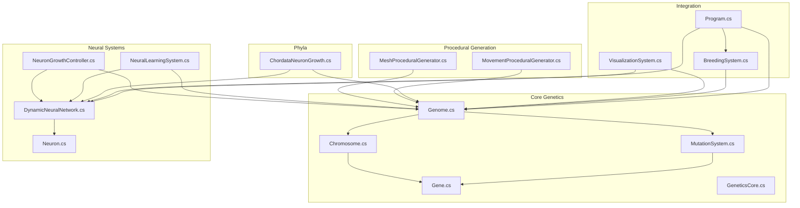
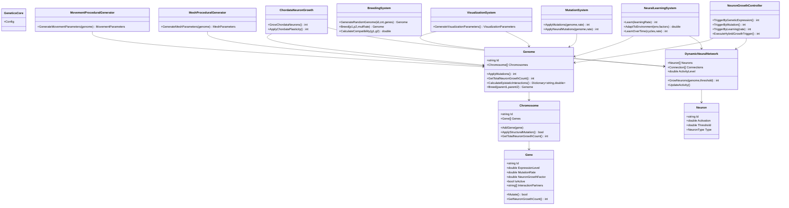
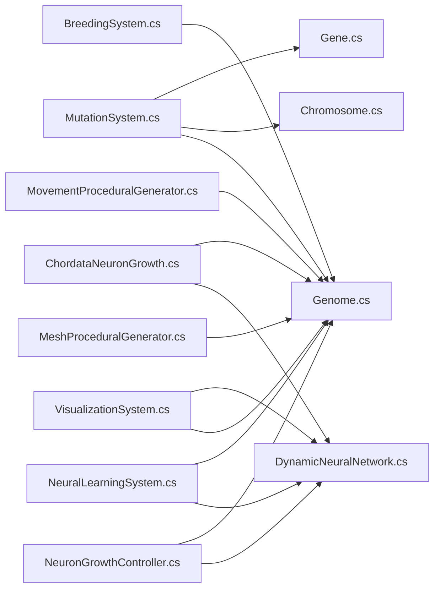
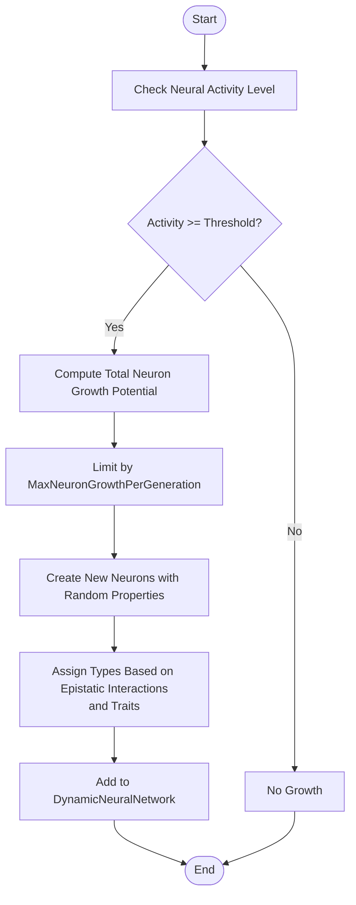
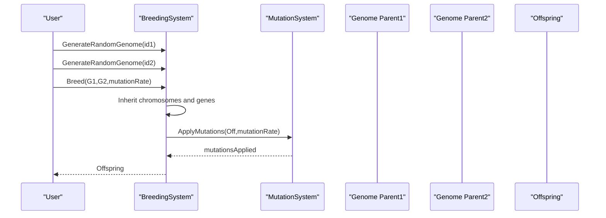

# Examples and Tutorials

<cite>
**Referenced Files in This Document**
- [GeneticsCore.cs](file://GeneticsGame/Core/GeneticsCore.cs)
- [Genome.cs](file://GeneticsGame/Core/Genome.cs)
- [Chromosome.cs](file://GeneticsGame/Core/Chromosome.cs)
- [Gene.cs](file://GeneticsGame/Core/Gene.cs)
- [MutationSystem.cs](file://GeneticsGame/Core/MutationSystem.cs)
- [DynamicNeuralNetwork.cs](file://GeneticsGame/Systems/DynamicNeuralNetwork.cs)
- [Neuron.cs](file://GeneticsGame/Systems/Neuron.cs)
- [NeuronGrowthController.cs](file://GeneticsGame/Systems/NeuronGrowthController.cs)
- [NeuralLearningSystem.cs](file://GeneticsGame/Systems/NeuralLearningSystem.cs)
- [BreedingSystem.cs](file://GeneticsGame/Systems/BreedingSystem.cs)
- [VisualizationSystem.cs](file://GeneticsGame/Systems/VisualizationSystem.cs)
- [MeshProceduralGenerator.cs](file://GeneticsGame/Procedural/Mesh/MeshProceduralGenerator.cs)
- [MovementProceduralGenerator.cs](file://GeneticsGame/Procedural/Movement/MovementProceduralGenerator.cs)
- [ChordataNeuronGrowth.cs](file://GeneticsGame/Phyla/Chordata/ChordataNeuronGrowth.cs)
- [Program.cs](file://GeneticsGame/Program.cs)
</cite>

## Table of Contents
1. [Introduction](#introduction)
2. [Project Structure](#project-structure)
3. [Core Components](#core-components)
4. [Architecture Overview](#architecture-overview)
5. [Detailed Component Analysis](#detailed-component-analysis)
6. [Dependency Analysis](#dependency-analysis)
7. [Performance Considerations](#performance-considerations)
8. [Troubleshooting Guide](#troubleshooting-guide)
9. [Conclusion](#conclusion)
10. [Appendices](#appendices)

## Introduction
This document provides practical, step-by-step tutorials for the 3D Genetics system. It covers creating custom genomes, breeding virtual organisms, observing evolutionary changes across generations, customizing neural networks, procedural generation of body plans and movement patterns, advanced breeding strategies, integration with visualization systems, performance optimization for large-scale simulations, and troubleshooting. The goal is to help both newcomers and experienced users experiment effectively with genetic algorithms, evolutionary principles, and educational demonstrations of heredity.

## Project Structure
The system is organized around core genetics (Genome, Chromosome, Gene, MutationSystem), neural dynamics (DynamicNeuralNetwork, Neuron, NeuronGrowthController, NeuralLearningSystem), procedural generation (MeshProceduralGenerator, MovementProceduralGenerator), phyla-specific extensions (ChordataNeuronGrowth), and a visualization pipeline (VisualizationSystem). A simple console demo illustrates end-to-end usage.

**Diagram sources**
- [Genome.cs:1-190](file://GeneticsGame/Core/Genome.cs#L1-L190)
- [Chromosome.cs:1-146](file://GeneticsGame/Core/Chromosome.cs#L1-L146)
- [Gene.cs:1-93](file://GeneticsGame/Core/Gene.cs#L1-L93)
- [MutationSystem.cs:1-137](file://GeneticsGame/Core/MutationSystem.cs#L1-L137)
- [GeneticsCore.cs:1-21](file://GeneticsGame/Core/GeneticsCore.cs#L1-L21)
- [DynamicNeuralNetwork.cs:1-116](file://GeneticsGame/Systems/DynamicNeuralNetwork.cs#L1-L116)
- [Neuron.cs:1-70](file://GeneticsGame/Systems/Neuron.cs#L1-L70)
- [NeuronGrowthController.cs:1-122](file://GeneticsGame/Systems/NeuronGrowthController.cs#L1-L122)
- [NeuralLearningSystem.cs:1-122](file://GeneticsGame/Systems/NeuralLearningSystem.cs#L1-L122)
- [MeshProceduralGenerator.cs:1-365](file://GeneticsGame/Procedural/Mesh/MeshProceduralGenerator.cs#L1-L365)
- [MovementProceduralGenerator.cs:1-389](file://GeneticsGame/Procedural/Movement/MovementProceduralGenerator.cs#L1-L389)
- [ChordataNeuronGrowth.cs:1-216](file://GeneticsGame/Phyla/Chordata/ChordataNeuronGrowth.cs#L1-L216)
- [VisualizationSystem.cs:1-239](file://GeneticsGame/Systems/VisualizationSystem.cs#L1-L239)
- [BreedingSystem.cs:1-182](file://GeneticsGame/Systems/BreedingSystem.cs#L1-L182)
- [Program.cs:1-58](file://GeneticsGame/Program.cs#L1-L58)

**Section sources**
- [Program.cs:11-57](file://GeneticsGame/Program.cs#L11-L57)

## Core Components
This section introduces the foundational building blocks and their roles in the system.

- Genome: Multi-chromosome blueprint with genes, epistatic interactions, and breeding logic.
- Chromosome: Container of genes with structural mutation support.
- Gene: Encodes expression level, mutation rate, neuron growth factor, and epistatic partners.
- MutationSystem: Applies point, structural, epigenetic, and neural-specific mutations.
- DynamicNeuralNetwork: Runtime neuron addition and activity tracking.
- Neuron: Basic unit with type, activation, and threshold.
- NeuronGrowthController: Hybrid triggering (genetic expression, mutation, learning).
- NeuralLearningSystem: Activity updates, synapse building/strengthening/pruning, environment/task adaptation.
- BreedingSystem: Random genome generation, compatibility scoring, and offspring production.
- VisualizationSystem: Converts genetic and neural data into visualization parameters.
- Procedural Generators: Mesh and movement parameter generation from genome.
- ChordataNeuronGrowth: Phyla-specific neural growth and plasticity.

**Section sources**
- [Genome.cs:9-189](file://GeneticsGame/Core/Genome.cs#L9-L189)
- [Chromosome.cs:9-145](file://GeneticsGame/Core/Chromosome.cs#L9-L145)
- [Gene.cs:9-93](file://GeneticsGame/Core/Gene.cs#L9-L93)
- [MutationSystem.cs:9-137](file://GeneticsGame/Core/MutationSystem.cs#L9-L137)
- [DynamicNeuralNetwork.cs:9-116](file://GeneticsGame/Systems/DynamicNeuralNetwork.cs#L9-L116)
- [Neuron.cs:7-70](file://GeneticsGame/Systems/Neuron.cs#L7-L70)
- [NeuronGrowthController.cs:9-122](file://GeneticsGame/Systems/NeuronGrowthController.cs#L9-L122)
- [NeuralLearningSystem.cs:9-122](file://GeneticsGame/Systems/NeuralLearningSystem.cs#L9-L122)
- [BreedingSystem.cs:9-182](file://GeneticsGame/Systems/BreedingSystem.cs#L9-L182)
- [VisualizationSystem.cs:9-239](file://GeneticsGame/Systems/VisualizationSystem.cs#L9-L239)
- [MeshProceduralGenerator.cs:9-365](file://GeneticsGame/Procedural/Mesh/MeshProceduralGenerator.cs#L9-L365)
- [MovementProceduralGenerator.cs:9-389](file://GeneticsGame/Procedural/Movement/MovementProceduralGenerator.cs#L9-L389)
- [ChordataNeuronGrowth.cs:9-216](file://GeneticsGame/Phyla/Chordata/ChordataNeuronGrowth.cs#L9-L216)

## Architecture Overview
The system follows a modular architecture:
- Genetics core defines the hereditary model and global configuration.
- Neural systems manage dynamic growth and learning.
- Procedural generators translate genomes into visual and movement parameters.
- Visualization aggregates genetic and neural state for rendering.
- Breeding orchestrates reproduction and compatibility.

**Diagram sources**
- [GeneticsCore.cs:9-20](file://GeneticsGame/Core/GeneticsCore.cs#L9-L20)
- [Genome.cs:9-189](file://GeneticsGame/Core/Genome.cs#L9-L189)
- [Chromosome.cs:9-145](file://GeneticsGame/Core/Chromosome.cs#L9-L145)
- [Gene.cs:9-93](file://GeneticsGame/Core/Gene.cs#L9-L93)
- [MutationSystem.cs:9-137](file://GeneticsGame/Core/MutationSystem.cs#L9-L137)
- [DynamicNeuralNetwork.cs:9-116](file://GeneticsGame/Systems/DynamicNeuralNetwork.cs#L9-L116)
- [Neuron.cs:7-70](file://GeneticsGame/Systems/Neuron.cs#L7-L70)
- [NeuronGrowthController.cs:9-122](file://GeneticsGame/Systems/NeuronGrowthController.cs#L9-L122)
- [NeuralLearningSystem.cs:9-122](file://GeneticsGame/Systems/NeuralLearningSystem.cs#L9-L122)
- [BreedingSystem.cs:9-182](file://GeneticsGame/Systems/BreedingSystem.cs#L9-L182)
- [VisualizationSystem.cs:9-239](file://GeneticsGame/Systems/VisualizationSystem.cs#L9-L239)
- [MeshProceduralGenerator.cs:9-365](file://GeneticsGame/Procedural/Mesh/MeshProceduralGenerator.cs#L9-L365)
- [MovementProceduralGenerator.cs:9-389](file://GeneticsGame/Procedural/Movement/MovementProceduralGenerator.cs#L9-L389)
- [ChordataNeuronGrowth.cs:9-216](file://GeneticsGame/Phyla/Chordata/ChordataNeuronGrowth.cs#L9-L216)

## Detailed Component Analysis

### Tutorial: Create a Custom Genome
Steps:
1. Instantiate a BreedingSystem.
2. Call GenerateRandomGenome with desired chromosome count and genes per chromosome to seed diversity.
3. Inspect Chromosomes and Genes; review expression levels and neuron growth factors.
4. Optionally, manually construct a Genome with specific Chromosome and Gene instances to encode traits of interest.

Key behaviors:
- Random genome generation assigns gene types (e.g., color, structure, neural, regulatory) and sets neuron growth factors for neural genes.
- Epistatic interaction partners are established to model gene interactions.

**Section sources**
- [BreedingSystem.cs:137-181](file://GeneticsGame/Systems/BreedingSystem.cs#L137-L181)
- [Genome.cs:19-38](file://GeneticsGame/Core/Genome.cs#L19-L38)
- [Chromosome.cs:19-38](file://GeneticsGame/Core/Chromosome.cs#L19-L38)
- [Gene.cs:49-57](file://GeneticsGame/Core/Gene.cs#L49-L57)

### Tutorial: Breed Virtual Organisms and Observe Evolution
Steps:
1. Create two parent Genomes via GenerateRandomGenome or custom construction.
2. Use BreedingSystem.Breed to produce an offspring with inherited traits and mutations applied.
3. Evaluate offspring compatibility using CalculateCompatibility to guide selective breeding.
4. Track epistatic interactions with CalculateEpistaticInteractions to understand gene cooperation.
5. Apply mutations to offspring using MutationSystem.ApplyMutations to simulate evolutionary pressure.

Expected outcomes:
- Offspring inherit a mix of parental traits.
- Compatibility scores indicate genetic similarity vs. diversity trade-offs.
- Epistatic interactions reveal cooperative effects between genes.

**Section sources**
- [BreedingSystem.cs:18-27](file://GeneticsGame/Systems/BreedingSystem.cs#L18-L27)
- [BreedingSystem.cs:35-44](file://GeneticsGame/Systems/BreedingSystem.cs#L35-L44)
- [Genome.cs:81-107](file://GeneticsGame/Core/Genome.cs#L81-L107)
- [MutationSystem.cs:17-29](file://GeneticsGame/Core/MutationSystem.cs#L17-L29)

### Tutorial: Customize Neural Network Behavior
Steps:
1. Initialize a DynamicNeuralNetwork.
2. Trigger neuron growth using GrowNeurons with a genome; growth depends on activity level and total neuron growth potential.
3. Use NeuronGrowthController to apply hybrid triggers:
   - Genetic expression: high expression and growth factor genes.
   - Mutation: neural-specific mutations increase growth factor and possibly expression.
   - Learning: activity-driven growth with adjustable thresholds.
4. Run NeuralLearningSystem.Learn to build synapses, strengthen connections, prune weak ones, and trigger neuron growth based on learning feedback.
5. Adapt to environments and tasks using AdaptToEnvironment with environment factors and task requirements.

Neural types:
- General, Mutation, Learning, Movement, Visual neuron types are supported.

**Section sources**
- [DynamicNeuralNetwork.cs:63-99](file://GeneticsGame/Systems/DynamicNeuralNetwork.cs#L63-L99)
- [NeuronGrowthController.cs:36-121](file://GeneticsGame/Systems/NeuronGrowthController.cs#L36-L121)
- [NeuralLearningSystem.cs:37-103](file://GeneticsGame/Systems/NeuralLearningSystem.cs#L37-L103)
- [Neuron.cs:44-70](file://GeneticsGame/Systems/Neuron.cs#L44-L70)

### Tutorial: Procedural Generation of Body Plans and Movement Patterns
Steps:
1. Use MeshProceduralGenerator.GenerateMeshParameters to compute:
   - Base scale, complexity, vertex count.
   - Colors, patterns, texture detail.
   - Limb count, limb lengths, body segments.
2. Use MovementProceduralGenerator.GenerateMovementParameters to compute:
   - Base speed, movement type (Walking, Flying, Swimming, Crawling).
   - Gait complexity, limb/body movement patterns.
   - Balance system type (InnerEar, Visual, Proprioceptive).
   - Neural control level and learning rate for adaptation.

These parameters feed visualization and movement systems to animate and render creatures.

**Section sources**
- [MeshProceduralGenerator.cs:16-36](file://GeneticsGame/Procedural/Mesh/MeshProceduralGenerator.cs#L16-L36)
- [MovementProceduralGenerator.cs:16-35](file://GeneticsGame/Procedural/Movement/MovementProceduralGenerator.cs#L16-L35)

### Tutorial: Advanced Breeding Strategies and Population Management
Guidelines:
- Use CalculateCompatibility to pair creatures that balance similarity and diversity.
- Maintain genetic diversity by avoiding excessive inbreeding; track epistatic interactions to preserve beneficial gene combinations.
- Introduce controlled mutation rates via MutationSystem.ApplyMutations to steer evolution toward desired traits.
- Periodically sample a subset of the population for breeding to reduce computational load while preserving diversity.

**Section sources**
- [BreedingSystem.cs:35-44](file://GeneticsGame/Systems/BreedingSystem.cs#L35-L44)
- [Genome.cs:81-107](file://GeneticsGame/Core/Genome.cs#L81-L107)
- [MutationSystem.cs:17-29](file://GeneticsGame/Core/MutationSystem.cs#L17-L29)

### Tutorial: Integration with Visualization Systems
Steps:
1. Construct VisualizationSystem with a Genome and DynamicNeuralNetwork.
2. Call GenerateVisualizationParameters to obtain:
   - Complexity level.
   - Color palette (derived from mesh parameters and neural types).
   - Animation parameters (speed, complexity, smoothness).
   - Neural visualization parameters (neuron/connection density, activity level, type distribution).
3. Feed these parameters to your renderer or visualization pipeline.

**Section sources**
- [VisualizationSystem.cs:36-53](file://GeneticsGame/Systems/VisualizationSystem.cs#L36-L53)
- [VisualizationSystem.cs:59-165](file://GeneticsGame/Systems/VisualizationSystem.cs#L59-L165)

### Tutorial: Phyla-Specific Neural Growth (Chordata)
Steps:
1. Use ChordataNeuronGrowth with a DynamicNeuralNetwork and ChordataGenome.
2. Call GrowChordataNeurons to add neurons following vertebrate-like patterns:
   - Base growth proportional to traits (e.g., brain size, spine length).
   - Specialized neuron types based on traits (e.g., Visual, Movement).
3. Apply ApplyChordataPlasticity to strengthen connections according to sensory and motor traits.

**Section sources**
- [ChordataNeuronGrowth.cs:36-103](file://GeneticsGame/Phyla/Chordata/ChordataNeuronGrowth.cs#L36-L103)
- [ChordataNeuronGrowth.cs:109-215](file://GeneticsGame/Phyla/Chordata/ChordataNeuronGrowth.cs#L109-L215)

### Tutorial: End-to-End Example (Console Demo Walkthrough)
This demo shows:
- Creating a random genome.
- Computing neuron growth potential and growing neurons.
- Creating a Chordata creature and updating it.
- Applying mutations and breeding offspring.
- Calculating epistatic interactions.

**Section sources**
- [Program.cs:16-54](file://GeneticsGame/Program.cs#L16-L54)

## Dependency Analysis
The following diagram highlights key dependencies among core components.

**Diagram sources**
- [MutationSystem.cs:17-137](file://GeneticsGame/Core/MutationSystem.cs#L17-L137)
- [Genome.cs:44-189](file://GeneticsGame/Core/Genome.cs#L44-L189)
- [Chromosome.cs:44-145](file://GeneticsGame/Core/Chromosome.cs#L44-L145)
- [Gene.cs:63-93](file://GeneticsGame/Core/Gene.cs#L63-L93)
- [NeuronGrowthController.cs:36-121](file://GeneticsGame/Systems/NeuronGrowthController.cs#L36-L121)
- [DynamicNeuralNetwork.cs:63-116](file://GeneticsGame/Systems/DynamicNeuralNetwork.cs#L63-L116)
- [NeuralLearningSystem.cs:37-103](file://GeneticsGame/Systems/NeuralLearningSystem.cs#L37-L103)
- [MeshProceduralGenerator.cs:16-36](file://GeneticsGame/Procedural/Mesh/MeshProceduralGenerator.cs#L16-L36)
- [MovementProceduralGenerator.cs:16-35](file://GeneticsGame/Procedural/Movement/MovementProceduralGenerator.cs#L16-L35)
- [VisualizationSystem.cs:36-165](file://GeneticsGame/Systems/VisualizationSystem.cs#L36-L165)
- [BreedingSystem.cs:18-181](file://GeneticsGame/Systems/BreedingSystem.cs#L18-L181)
- [ChordataNeuronGrowth.cs:36-215](file://GeneticsGame/Phyla/Chordata/ChordataNeuronGrowth.cs#L36-L215)

**Section sources**
- [GeneticsCore.cs:14-19](file://GeneticsGame/Core/GeneticsCore.cs#L14-L19)

## Performance Considerations
- Limit neuron growth per generation using GeneticsCore.Config.MaxNeuronGrowthPerGeneration to avoid uncontrolled expansion.
- Control learning-triggered growth thresholds to balance exploration and stability.
- Reduce procedural generation complexity for large populations (e.g., fewer vertices, simpler patterns).
- Batch mutation application and limit structural mutations to maintain simulation throughput.
- Use sampling strategies for population management to keep computational costs manageable.

[No sources needed since this section provides general guidance]

## Troubleshooting Guide
Common issues and resolutions:
- No neuron growth despite high potential:
  - Verify NeuralActivityThreshold and activity level; ensure DynamicNeuralNetwork.UpdateActivity is called.
  - Confirm genes have sufficient NeuronGrowthFactor and ExpressionLevel.
- Excessive neuron growth:
  - Adjust MaxNeuronGrowthPerGeneration and growth thresholds.
- Poor compatibility scores:
  - Increase genetic diversity by mixing distantly related parents; review CalculateCompatibility logic.
- Visualization artifacts:
  - Check VisualizationSystem complexity and animation parameters; ensure adequate neural activity for animation smoothness.
- Mutation effects not visible:
  - Use MutationSystem.ApplyNeuralMutations for targeted neural trait changes; confirm neural genes are detected by ID patterns.

**Section sources**
- [GeneticsCore.cs:14-19](file://GeneticsGame/Core/GeneticsCore.cs#L14-L19)
- [DynamicNeuralNetwork.cs:104-116](file://GeneticsGame/Systems/DynamicNeuralNetwork.cs#L104-L116)
- [NeuronGrowthController.cs:91-101](file://GeneticsGame/Systems/NeuronGrowthController.cs#L91-L101)
- [BreedingSystem.cs:35-44](file://GeneticsGame/Systems/BreedingSystem.cs#L35-L44)
- [VisualizationSystem.cs:115-130](file://GeneticsGame/Systems/VisualizationSystem.cs#L115-L130)
- [MutationSystem.cs:111-136](file://GeneticsGame/Core/MutationSystem.cs#L111-L136)

## Conclusion
The 3D Genetics system offers a robust foundation for experimenting with heredity, evolution, and neural development. By combining customizable genomes, dynamic neural growth, procedural generation, and visualization, users can design selective breeding programs, study evolutionary principles, and demonstrate genetic concepts. The tutorials and guidelines above provide practical pathways to explore these capabilities safely and efficiently.

[No sources needed since this section summarizes without analyzing specific files]

## Appendices

### Appendix A: Neural Growth Flow

**Diagram sources**
- [DynamicNeuralNetwork.cs:63-99](file://GeneticsGame/Systems/DynamicNeuralNetwork.cs#L63-L99)
- [GeneticsCore.cs:14-19](file://GeneticsGame/Core/GeneticsCore.cs#L14-L19)

### Appendix B: Breeding and Mutation Sequence

**Diagram sources**
- [BreedingSystem.cs:18-27](file://GeneticsGame/Systems/BreedingSystem.cs#L18-L27)
- [MutationSystem.cs:17-29](file://GeneticsGame/Core/MutationSystem.cs#L17-L29)