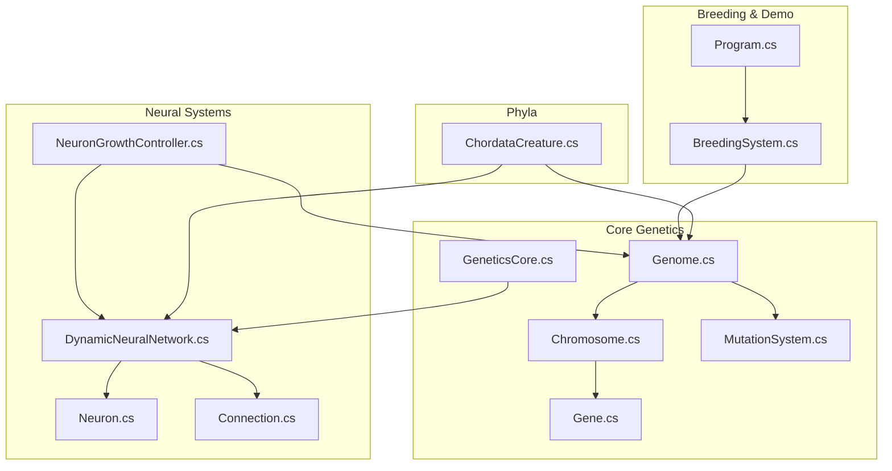
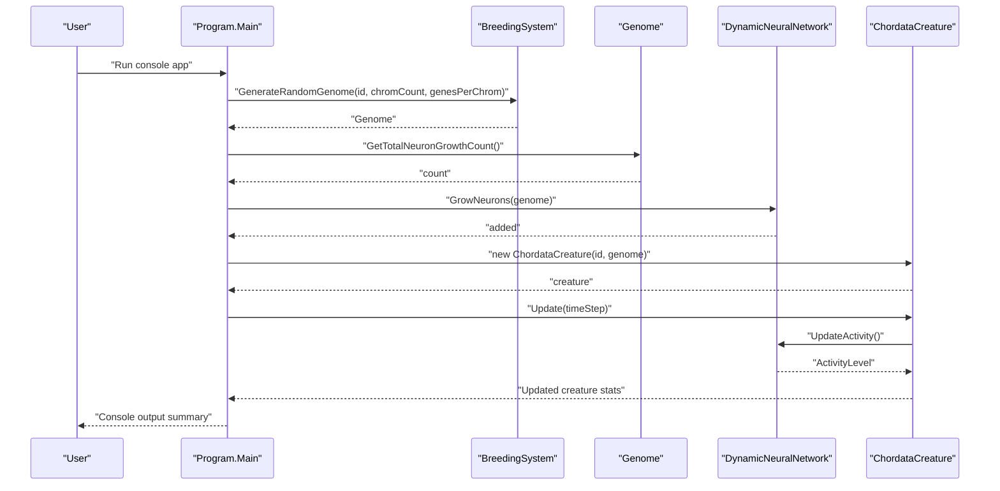
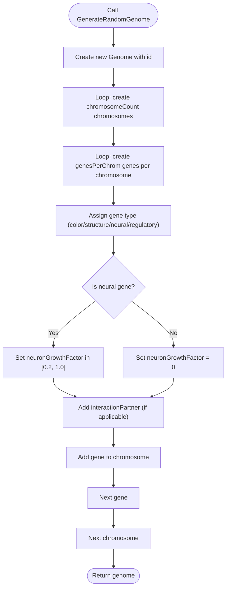
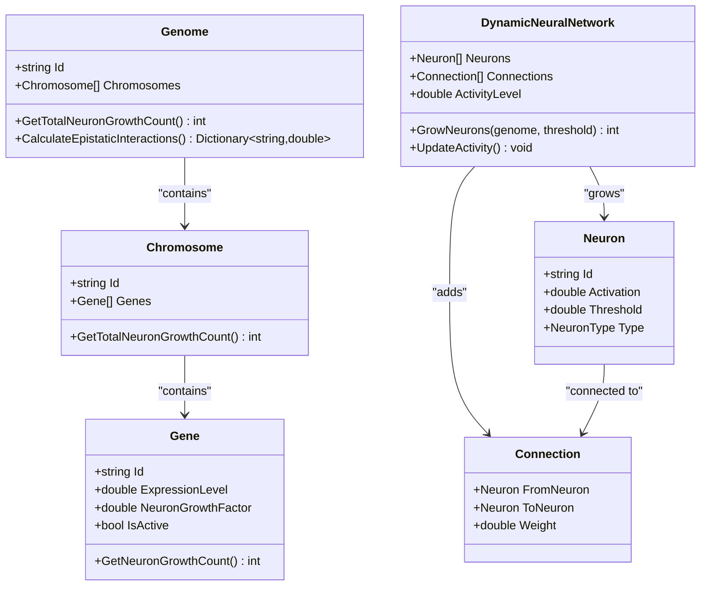
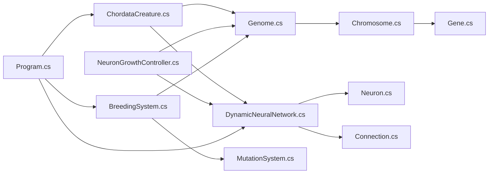

# Getting Started Tutorial

<cite>
**Referenced Files in This Document**
- [GeneticsGame.csproj](file://GeneticsGame/GeneticsGame.csproj)
- [Program.cs](file://GeneticsGame/Program.cs)
- [GeneticsCore.cs](file://GeneticsGame/Core/GeneticsCore.cs)
- [Genome.cs](file://GeneticsGame/Core/Genome.cs)
- [Chromosome.cs](file://GeneticsGame/Core/Chromosome.cs)
- [Gene.cs](file://GeneticsGame/Core/Gene.cs)
- [MutationSystem.cs](file://GeneticsGame/Core/MutationSystem.cs)
- [BreedingSystem.cs](file://GeneticsGame/Systems/BreedingSystem.cs)
- [DynamicNeuralNetwork.cs](file://GeneticsGame/Systems/DynamicNeuralNetwork.cs)
- [Neuron.cs](file://GeneticsGame/Systems/Neuron.cs)
- [Connection.cs](file://GeneticsGame/Systems/Connection.cs)
- [NeuronGrowthController.cs](file://GeneticsGame/Systems/NeuronGrowthController.cs)
- [ChordataCreature.cs](file://GeneticsGame/Phyla/Chordata/ChordataCreature.cs)
</cite>

## Table of Contents
1. [Introduction](#introduction)
2. [Project Structure](#project-structure)
3. [Core Components](#core-components)
4. [Architecture Overview](#architecture-overview)
5. [Detailed Component Analysis](#detailed-component-analysis)
6. [Dependency Analysis](#dependency-analysis)
7. [Performance Considerations](#performance-considerations)
8. [Troubleshooting Guide](#troubleshooting-guide)
9. [Conclusion](#conclusion)
10. [Appendices](#appendices)

## Introduction
This tutorial helps you quickly set up and run the 3D Genetics system, then explore how genomes encode neural growth potential and how that translates into dynamic neural networks. You will:
- Build and run the demo program
- Create your first genome using the provided generator
- Inspect genome structure, chromosome count, and gene distribution
- Compute neuron growth potential and create a basic neural network
- Run simple experiments to see how genome tweaks affect neural network characteristics
- Troubleshoot common setup issues and interpret expected console output

## Project Structure
The project is a console application that demonstrates genetic encoding, neural growth, and creature behavior. Key folders and files:
- Core genetics: Genome, Chromosome, Gene, MutationSystem, GeneticsCore
- Neural systems: DynamicNeuralNetwork, Neuron, Connection, NeuronGrowthController
- Breeding and demo: BreedingSystem, Program
- Phyla-specific extensions: ChordataCreature (example of a creature type)



**Diagram sources**
- [Genome.cs:1-190](file://GeneticsGame/Core/Genome.cs#L1-L190)
- [Chromosome.cs:1-146](file://GeneticsGame/Core/Chromosome.cs#L1-L146)
- [Gene.cs:1-93](file://GeneticsGame/Core/Gene.cs#L1-L93)
- [MutationSystem.cs:1-137](file://GeneticsGame/Core/MutationSystem.cs#L1-L137)
- [GeneticsCore.cs:1-21](file://GeneticsGame/Core/GeneticsCore.cs#L1-L21)
- [DynamicNeuralNetwork.cs:1-116](file://GeneticsGame/Systems/DynamicNeuralNetwork.cs#L1-L116)
- [Neuron.cs:1-70](file://GeneticsGame/Systems/Neuron.cs#L1-L70)
- [Connection.cs:1-35](file://GeneticsGame/Systems/Connection.cs#L1-L35)
- [NeuronGrowthController.cs:1-122](file://GeneticsGame/Systems/NeuronGrowthController.cs#L1-L122)
- [BreedingSystem.cs:1-182](file://GeneticsGame/Systems/BreedingSystem.cs#L1-L182)
- [Program.cs:1-58](file://GeneticsGame/Program.cs#L1-L58)
- [ChordataCreature.cs:1-133](file://GeneticsGame/Phyla/Chordata/ChordataCreature.cs#L1-L133)

**Section sources**
- [GeneticsGame.csproj:1-14](file://GeneticsGame/GeneticsGame.csproj#L1-L14)
- [Program.cs:1-58](file://GeneticsGame/Program.cs#L1-L58)

## Core Components
- GeneticsCore: Central configuration for global constants (e.g., default mutation rate, max neuron growth per generation, neural activity threshold).
- Genome: Top-level container for chromosomes; provides operations like mutation application, total neuron growth calculation, epistatic interaction computation, and breeding.
- Chromosome: Holds genes and supports structural mutations (deletion, duplication, inversion, translocation).
- Gene: Encapsulates expression level, mutation rate, neuron growth factor, activity state, and epistatic interaction partners.
- MutationSystem: Applies point, structural, epigenetic, and neural-specific mutations to a genome.
- BreedingSystem: Creates offspring via genome mixing and applies mutations; computes compatibility between genomes.
- DynamicNeuralNetwork: Runtime neural network that grows neurons based on genetic triggers and activity thresholds.
- NeuronGrowthController: Orchestrates hybrid triggering (genetic expression, mutation, learning) to grow neurons.
- Neuron and Connection: Basic neural building blocks.
- ChordataCreature: Example of a creature that initializes a neural network and updates movement/mesh parameters based on genome and neural activity.

**Section sources**
- [GeneticsCore.cs:1-21](file://GeneticsGame/Core/GeneticsCore.cs#L1-L21)
- [Genome.cs:1-190](file://GeneticsGame/Core/Genome.cs#L1-L190)
- [Chromosome.cs:1-146](file://GeneticsGame/Core/Chromosome.cs#L1-L146)
- [Gene.cs:1-93](file://GeneticsGame/Core/Gene.cs#L1-L93)
- [MutationSystem.cs:1-137](file://GeneticsGame/Core/MutationSystem.cs#L1-L137)
- [BreedingSystem.cs:1-182](file://GeneticsGame/Systems/BreedingSystem.cs#L1-L182)
- [DynamicNeuralNetwork.cs:1-116](file://GeneticsGame/Systems/DynamicNeuralNetwork.cs#L1-L116)
- [Neuron.cs:1-70](file://GeneticsGame/Systems/Neuron.cs#L1-L70)
- [Connection.cs:1-35](file://GeneticsGame/Systems/Connection.cs#L1-L35)
- [NeuronGrowthController.cs:1-122](file://GeneticsGame/Systems/NeuronGrowthController.cs#L1-L122)
- [ChordataCreature.cs:1-133](file://GeneticsGame/Phyla/Chordata/ChordataCreature.cs#L1-L133)

## Architecture Overview
The demo program ties together genetics and neural systems to show how genes influence neuron growth and creature behavior.



**Diagram sources**
- [Program.cs:11-57](file://GeneticsGame/Program.cs#L11-L57)
- [BreedingSystem.cs:137-181](file://GeneticsGame/Systems/BreedingSystem.cs#L137-L181)
- [Genome.cs:72-75](file://GeneticsGame/Core/Genome.cs#L72-L75)
- [DynamicNeuralNetwork.cs:63-99](file://GeneticsGame/Systems/DynamicNeuralNetwork.cs#L63-L99)
- [ChordataCreature.cs:61-78](file://GeneticsGame/Phyla/Chordata/ChordataCreature.cs#L61-L78)

## Detailed Component Analysis

### Step-by-Step Setup and Running the Demo
- Build and run the console application using your preferred .NET 8 toolchain.
- The demo creates a random genome, calculates neuron growth potential, grows neurons, instantiates a creature, mutates the genome, breeds two creatures, computes epistatic interactions, and updates the creature.

Expected console output highlights:
- Created genome with X chromosomes and Y genes
- Neuron growth potential: Z neurons
- Grew W neurons
- Created Chordata creature with N neurons
- Applied M mutations
- Bred offspring with K chromosomes
- Calculated Q epistatic interactions
- After update: R neurons, Activity: S.SS

**Section sources**
- [Program.cs:11-57](file://GeneticsGame/Program.cs#L11-L57)
- [GeneticsGame.csproj:1-14](file://GeneticsGame/GeneticsGame.csproj#L1-L14)

### Creating Your First Genome with BreedingSystem.GenerateRandomGenome()
Purpose:
- Generate a starter genome with a configurable number of chromosomes and genes per chromosome.

Key parameters:
- genomeId: Identifier for the new genome
- chromosomeCount: Number of chromosomes (default 23)
- genesPerChromosome: Number of genes per chromosome (default 10)

Behavior:
- Creates chromosomes and genes with distinct types (e.g., color, structure, neural, regulatory)
- Neural genes receive a neuron growth factor in a specific range
- Genes can establish interaction partners for epistatic modeling



**Diagram sources**
- [BreedingSystem.cs:137-181](file://GeneticsGame/Systems/BreedingSystem.cs#L137-L181)

**Section sources**
- [BreedingSystem.cs:137-181](file://GeneticsGame/Systems/BreedingSystem.cs#L137-L181)

### Examining Genome Structure, Chromosome Count, and Gene Distribution
- Chromosome count: Access genome.Chromosomes.Count
- Total gene count: Sum of genome.Chromosomes.Sum(c => c.Genes.Count)
- Gene types: Neural genes carry neuron growth factors; others are labeled accordingly
- Epistatic interactions: Use genome.CalculateEpistaticInteractions() to inspect gene interaction strengths

Practical inspection steps:
- Print chromosome count and total gene count after generating a genome
- Iterate through chromosomes and genes to observe IDs, expression levels, and neuron growth factors
- Review epistatic interactions dictionary for insight into gene pair influences

**Section sources**
- [Program.cs:16-48](file://GeneticsGame/Program.cs#L16-L48)
- [Genome.cs:81-107](file://GeneticsGame/Core/Genome.cs#L81-L107)

### Computing Neuron Growth Potential and Creating a Neural Network
Neuron growth potential:
- genome.GetTotalNeuronGrowthCount() sums contributions from all genes across all chromosomes

Dynamic neural network:
- DynamicNeuralNetwork.GrowNeurons(genome, activityThreshold) adds neurons when network activity meets the threshold
- Neuron types can be influenced by epistatic interactions (e.g., mutation or learning-enabling genes)



**Diagram sources**
- [Genome.cs:9-190](file://GeneticsGame/Core/Genome.cs#L9-L190)
- [Chromosome.cs:9-146](file://GeneticsGame/Core/Chromosome.cs#L9-L146)
- [Gene.cs:9-93](file://GeneticsGame/Core/Gene.cs#L9-L93)
- [DynamicNeuralNetwork.cs:9-116](file://GeneticsGame/Systems/DynamicNeuralNetwork.cs#L9-L116)
- [Neuron.cs:7-70](file://GeneticsGame/Systems/Neuron.cs#L7-L70)
- [Connection.cs:6-35](file://GeneticsGame/Systems/Connection.cs#L6-L35)

**Section sources**
- [Genome.cs:72-75](file://GeneticsGame/Core/Genome.cs#L72-L75)
- [DynamicNeuralNetwork.cs:63-99](file://GeneticsGame/Systems/DynamicNeuralNetwork.cs#L63-L99)

### Breeding Two Creatures and Observing Offspring Traits
- Use BreedingSystem.Breed(genome1, genome2, mutationRate) to combine two genomes
- Offspring inherit chromosomes and genes with mixed expression levels and preserved interaction partners
- Apply mutations to offspring and compare traits with parents

```mermaid
sequenceDiagram
participant P as "Program"
participant BS as "BreedingSystem"
participant G1 as "Parent1 Genome"
participant G2 as "Parent2 Genome"
participant Off as "Offspring Genome"
P->>BS : "GenerateRandomGenome(...)"
BS-->>P : "G1"
P->>BS : "GenerateRandomGenome(...)"
BS-->>P : "G2"
P->>BS : "Breed(G1, G2, mutationRate)"
BS->>Off : "Create offspring via Genome.Breed"
Off-->>BS : "New genome with mixed traits"
BS-->>P : "Off"
P->>Off : "ApplyMutations()"
Off-->>P : "Mutations applied"
```

**Diagram sources**
- [Program.cs:42-44](file://GeneticsGame/Program.cs#L42-L44)
- [BreedingSystem.cs:18-27](file://GeneticsGame/Systems/BreedingSystem.cs#L18-L27)
- [Genome.cs:134-189](file://GeneticsGame/Core/Genome.cs#L134-L189)

**Section sources**
- [Program.cs:42-44](file://GeneticsGame/Program.cs#L42-L44)
- [BreedingSystem.cs:18-27](file://GeneticsGame/Systems/BreedingSystem.cs#L18-L27)
- [Genome.cs:134-189](file://GeneticsGame/Core/Genome.cs#L134-L189)

### Exercises for Beginners
Goal: Observe how tweaking genome parameters affects neural network characteristics.

Exercise 1: Vary chromosome count and genes per chromosome
- Change chromosomeCount and genesPerChromosome in GenerateRandomGenome
- Record how neuron growth potential and final neuron counts change
- Notes: More chromosomes and genes generally increase potential, but growth is gated by activity thresholds

Exercise 2: Focus on neural genes
- Create a genome where most genes are neural-type
- Observe higher neuron growth potential and more specialized neuron types
- Mutate the genome and note how neural mutations alter growth factor and expression

Exercise 3: Compare activity thresholds
- Call DynamicNeuralNetwork.GrowNeurons with different activity thresholds
- See how stricter vs. looser thresholds affect neuron addition

Exercise 4: Inspect epistatic interactions
- Use CalculateEpistaticInteractions to see which genes interact strongly
- Correlate high-strength interactions with neuron type assignments

Exercise 5: Breed and compare
- Breed two distinct genomes and compare offspring neuron counts and activity levels
- Explore how compatibility scores influence trait mixing

**Section sources**
- [BreedingSystem.cs:137-181](file://GeneticsGame/Systems/BreedingSystem.cs#L137-L181)
- [Genome.cs:72-107](file://GeneticsGame/Core/Genome.cs#L72-L107)
- [DynamicNeuralNetwork.cs:63-99](file://GeneticsGame/Systems/DynamicNeuralNetwork.cs#L63-L99)
- [MutationSystem.cs:111-136](file://GeneticsGame/Core/MutationSystem.cs#L111-L136)

## Dependency Analysis
High-level dependencies:
- Program depends on BreedingSystem, DynamicNeuralNetwork, ChordataCreature
- BreedingSystem depends on Genome and MutationSystem
- Genome depends on Chromosome and Gene
- DynamicNeuralNetwork depends on Neuron and Connection
- NeuronGrowthController orchestrates growth triggers and depends on DynamicNeuralNetwork and Genome
- ChordataCreature composes DynamicNeuralNetwork and uses Genome for procedural parameters



**Diagram sources**
- [Program.cs:11-57](file://GeneticsGame/Program.cs#L11-L57)
- [BreedingSystem.cs:1-182](file://GeneticsGame/Systems/BreedingSystem.cs#L1-L182)
- [Genome.cs:1-190](file://GeneticsGame/Core/Genome.cs#L1-L190)
- [Chromosome.cs:1-146](file://GeneticsGame/Core/Chromosome.cs#L1-L146)
- [Gene.cs:1-93](file://GeneticsGame/Core/Gene.cs#L1-L93)
- [MutationSystem.cs:1-137](file://GeneticsGame/Core/MutationSystem.cs#L1-L137)
- [DynamicNeuralNetwork.cs:1-116](file://GeneticsGame/Systems/DynamicNeuralNetwork.cs#L1-L116)
- [Neuron.cs:1-70](file://GeneticsGame/Systems/Neuron.cs#L1-L70)
- [Connection.cs:1-35](file://GeneticsGame/Systems/Connection.cs#L1-L35)
- [NeuronGrowthController.cs:1-122](file://GeneticsGame/Systems/NeuronGrowthController.cs#L1-L122)
- [ChordataCreature.cs:1-133](file://GeneticsGame/Phyla/Chordata/ChordataCreature.cs#L1-L133)

**Section sources**
- [Program.cs:11-57](file://GeneticsGame/Program.cs#L11-L57)
- [BreedingSystem.cs:1-182](file://GeneticsGame/Systems/BreedingSystem.cs#L1-L182)
- [Genome.cs:1-190](file://GeneticsGame/Core/Genome.cs#L1-L190)
- [DynamicNeuralNetwork.cs:1-116](file://GeneticsGame/Systems/DynamicNeuralNetwork.cs#L1-L116)
- [ChordataCreature.cs:1-133](file://GeneticsGame/Phyla/Chordata/ChordataCreature.cs#L1-L133)

## Performance Considerations
- Mutation rates: Default mutation rate is low; increasing it raises variability but may destabilize traits.
- Growth limits: Neuron growth is capped per generation to avoid uncontrolled expansion.
- Activity thresholds: Higher thresholds require stronger neural activity to trigger growth.
- Complexity scaling: Larger genomes (more chromosomes/genes) increase computation for epistatic interactions and mutations.

[No sources needed since this section provides general guidance]

## Troubleshooting Guide
- Build fails with SDK not found:
  - Ensure .NET 8 SDK is installed and recognized by your shell/environment.
  - Verify TargetFramework matches your installed SDK.
- Program runs but no output appears:
  - Confirm the console window stays open after execution (the demo prints a completion message and waits for a keypress).
- Unexpectedly low neuron counts:
  - Check activity threshold and whether the network’s activity level meets the threshold before growth.
  - Verify that neural genes have sufficient expression levels and neuron growth factors.
- Compatibility score issues:
  - Extremely low or high compatibility may indicate very similar or very different genomes; adjust mutation rate or genome composition.

**Section sources**
- [GeneticsGame.csproj:3-8](file://GeneticsGame/GeneticsGame.csproj#L3-L8)
- [Program.cs:54-57](file://GeneticsGame/Program.cs#L54-L57)
- [DynamicNeuralNetwork.cs:63-71](file://GeneticsGame/Systems/DynamicNeuralNetwork.cs#L63-L71)
- [BreedingSystem.cs:35-45](file://GeneticsGame/Systems/BreedingSystem.cs#L35-L45)

## Conclusion
You have learned how to:
- Build and run the 3D Genetics demo
- Generate a genome with adjustable structure
- Inspect genome composition and compute neuron growth potential
- Grow a neural network from genetic signals
- Experiment with simple variations and observe outcomes

Use these foundations to explore more advanced topics like epigenetic modifications, neural learning, and phyla-specific traits.

[No sources needed since this section summarizes without analyzing specific files]

## Appendices

### Expected Output Format (Console)
- Summary lines include counts for chromosomes, genes, neuron growth potential, neurons grown, creature neuron count, mutations applied, offspring chromosome count, epistatic interactions computed, and post-update neuron count and activity level.

**Section sources**
- [Program.cs:16-52](file://GeneticsGame/Program.cs#L16-L52)