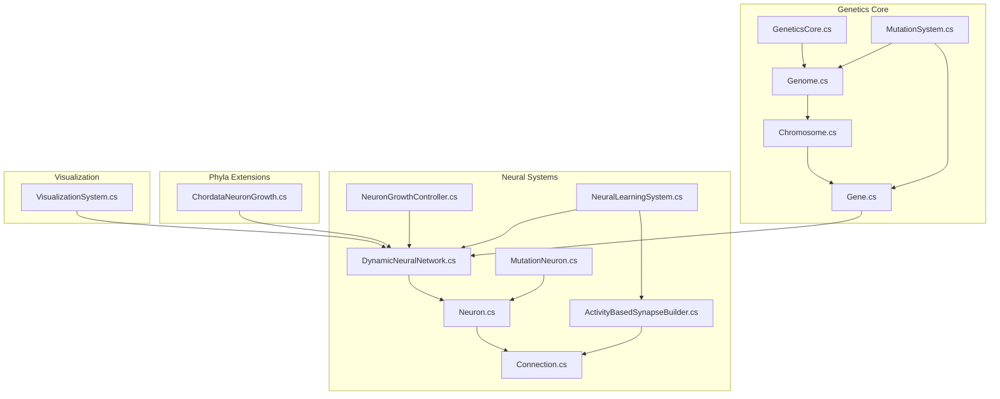
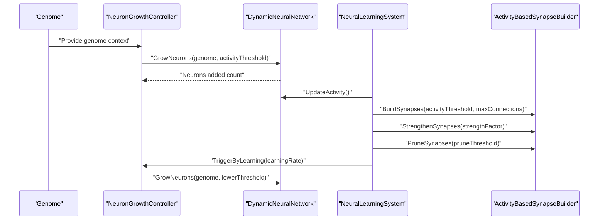
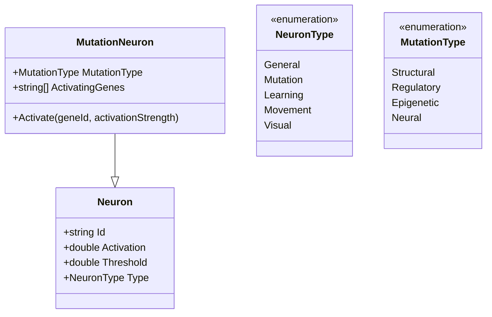
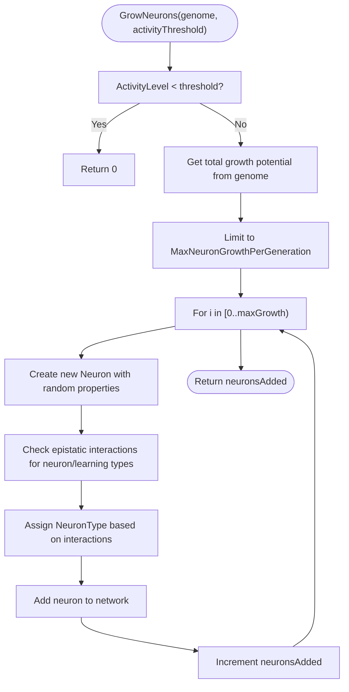
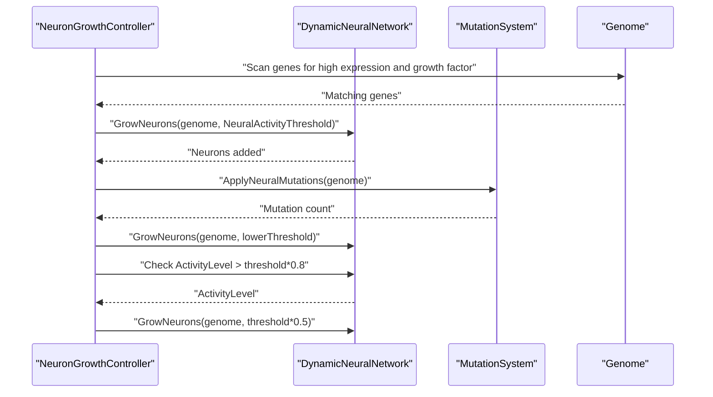
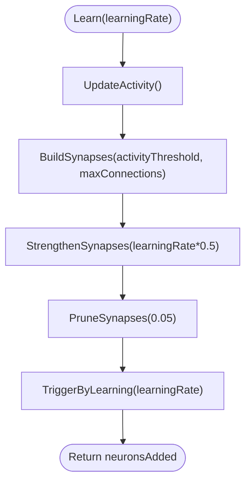
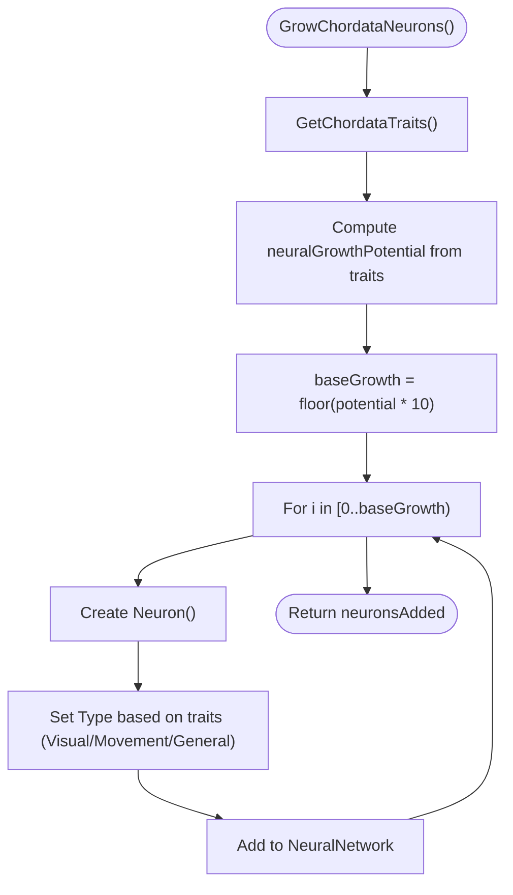
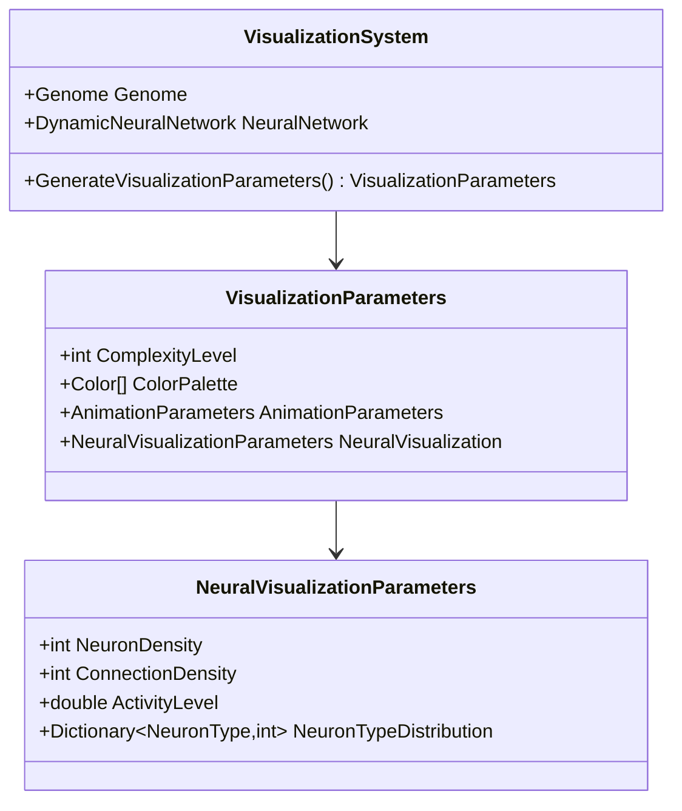
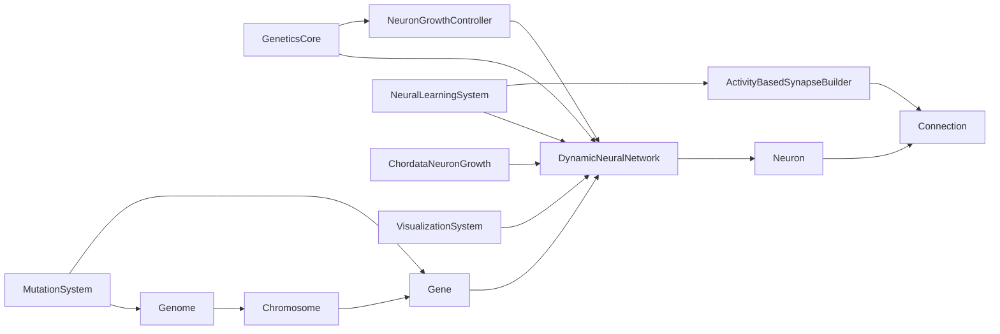

# Neural Network Customization

<cite>
**Referenced Files in This Document**
- [GeneticsCore.cs](file://GeneticsGame/Core/GeneticsCore.cs)
- [Genome.cs](file://GeneticsGame/Core/Genome.cs)
- [Chromosome.cs](file://GeneticsGame/Core/Chromosome.cs)
- [Gene.cs](file://GeneticsGame/Core/Gene.cs)
- [MutationSystem.cs](file://GeneticsGame/Core/MutationSystem.cs)
- [DynamicNeuralNetwork.cs](file://GeneticsGame/Systems/DynamicNeuralNetwork.cs)
- [Neuron.cs](file://GeneticsGame/Systems/Neuron.cs)
- [Connection.cs](file://GeneticsGame/Systems/Connection.cs)
- [NeuronGrowthController.cs](file://GeneticsGame/Systems/NeuronGrowthController.cs)
- [NeuralLearningSystem.cs](file://GeneticsGame/Systems/NeuralLearningSystem.cs)
- [ActivityBasedSynapseBuilder.cs](file://GeneticsGame/Systems/ActivityBasedSynapseBuilder.cs)
- [MutationNeuron.cs](file://GeneticsGame/Systems/MutationNeuron.cs)
- [ChordataNeuronGrowth.cs](file://GeneticsGame/Phyla/Chordata/ChordataNeuronGrowth.cs)
- [VisualizationSystem.cs](file://GeneticsGame/Systems/VisualizationSystem.cs)
</cite>

## Table of Contents
1. [Introduction](#introduction)
2. [Project Structure](#project-structure)
3. [Core Components](#core-components)
4. [Architecture Overview](#architecture-overview)
5. [Detailed Component Analysis](#detailed-component-analysis)
6. [Dependency Analysis](#dependency-analysis)
7. [Performance Considerations](#performance-considerations)
8. [Troubleshooting Guide](#troubleshooting-guide)
9. [Conclusion](#conclusion)
10. [Appendices](#appendices)

## Introduction
This document explains how to customize and extend the neural network system in the 3D Genetics Game. It focuses on:
- Modifying neuron growth patterns
- Adding specialized neuron types
- Adjusting learning behaviors
- Understanding how genetic factors influence neural architecture development
- Creating different neural network topologies
- Exercises for implementing custom neuron models, modifying synaptic plasticity rules, and building neural circuits for specific behaviors
- Guidance on optimizing performance, managing computational complexity, and balancing network size with behavioral complexity
- Techniques for debugging neural network development and troubleshooting growth-related issues

## Project Structure
The neural network system is organized around a genetics-first model where genes encode neuron growth potential and neural traits, and the neural network grows and adapts dynamically during runtime.

**Diagram sources**
- [GeneticsCore.cs:14-20](file://GeneticsGame/Core/GeneticsCore.cs#L14-L20)
- [Genome.cs:9-29](file://GeneticsGame/Core/Genome.cs#L9-L29)
- [Chromosome.cs:9-39](file://GeneticsGame/Core/Chromosome.cs#L9-L39)
- [Gene.cs:9-57](file://GeneticsGame/Core/Gene.cs#L9-L57)
- [MutationSystem.cs:9-29](file://GeneticsGame/Core/MutationSystem.cs#L9-L29)
- [DynamicNeuralNetwork.cs:9-35](file://GeneticsGame/Systems/DynamicNeuralNetwork.cs#L9-L35)
- [Neuron.cs:7-39](file://GeneticsGame/Systems/Neuron.cs#L7-L39)
- [Connection.cs:6-35](file://GeneticsGame/Systems/Connection.cs#L6-L35)
- [NeuronGrowthController.cs:9-31](file://GeneticsGame/Systems/NeuronGrowthController.cs#L9-L31)
- [NeuralLearningSystem.cs:9-31](file://GeneticsGame/Systems/NeuralLearningSystem.cs#L9-L31)
- [ActivityBasedSynapseBuilder.cs:9-24](file://GeneticsGame/Systems/ActivityBasedSynapseBuilder.cs#L9-L24)
- [MutationNeuron.cs:7-33](file://GeneticsGame/Systems/MutationNeuron.cs#L7-L33)
- [ChordataNeuronGrowth.cs:9-31](file://GeneticsGame/Phyla/Chordata/ChordataNeuronGrowth.cs#L9-L31)
- [VisualizationSystem.cs:9-30](file://GeneticsGame/Systems/VisualizationSystem.cs#L9-L30)

**Section sources**
- [GeneticsCore.cs:9-20](file://GeneticsGame/Core/GeneticsCore.cs#L9-L20)
- [Genome.cs:9-76](file://GeneticsGame/Core/Genome.cs#L9-L76)
- [Chromosome.cs:9-146](file://GeneticsGame/Core/Chromosome.cs#L9-L146)
- [Gene.cs:9-93](file://GeneticsGame/Core/Gene.cs#L9-L93)
- [MutationSystem.cs:9-137](file://GeneticsGame/Core/MutationSystem.cs#L9-L137)
- [DynamicNeuralNetwork.cs:9-116](file://GeneticsGame/Systems/DynamicNeuralNetwork.cs#L9-L116)
- [Neuron.cs:7-70](file://GeneticsGame/Systems/Neuron.cs#L7-L70)
- [Connection.cs:6-35](file://GeneticsGame/Systems/Connection.cs#L6-L35)
- [NeuronGrowthController.cs:9-122](file://GeneticsGame/Systems/NeuronGrowthController.cs#L9-L122)
- [NeuralLearningSystem.cs:9-122](file://GeneticsGame/Systems/NeuralLearningSystem.cs#L9-L122)
- [ActivityBasedSynapseBuilder.cs:9-112](file://GeneticsGame/Systems/ActivityBasedSynapseBuilder.cs#L9-L112)
- [MutationNeuron.cs:7-75](file://GeneticsGame/Systems/MutationNeuron.cs#L7-L75)
- [ChordataNeuronGrowth.cs:9-216](file://GeneticsGame/Phyla/Chordata/ChordataNeuronGrowth.cs#L9-L216)
- [VisualizationSystem.cs:9-239](file://GeneticsGame/Systems/VisualizationSystem.cs#L9-L239)

## Core Components
- GeneticsCore: Central configuration for global constants (e.g., default mutation rate, max neuron growth per generation, neural activity threshold).
- Genome: Aggregates chromosomes and computes epistatic interactions, total neuron growth potential, and breeding logic.
- Chromosome: Holds genes and applies structural mutations (deletion, duplication, inversion, translocation).
- Gene: Encodes expression level, mutation rate, neuron growth factor, activity state, and epistatic interaction partners. Computes neuron growth contribution.
- MutationSystem: Applies point, structural, and epigenetic mutations; includes neural-specific mutations targeting neuron growth parameters.
- DynamicNeuralNetwork: Runtime container for neurons and connections; grows new neurons based on genetic triggers and activity thresholds; updates activity level.
- Neuron: Basic unit with id, activation, threshold, and type enumeration.
- Connection: Directed weighted link between neurons.
- NeuronGrowthController: Orchestrates hybrid growth triggers (genetic expression, mutation, learning).
- NeuralLearningSystem: Drives learning cycles, builds/prunes synapses, strengthens connections, and triggers growth based on learning feedback.
- ActivityBasedSynapseBuilder: Implements Hebbian-style synaptogenesis and pruning based on neural activity.
- MutationNeuron: Specialized neuron type activated by specific mutations; inherits from Neuron.
- ChordataNeuronGrowth: Phyla-specific extension that grows neurons and applies plasticity rules tailored to vertebrate-like traits.
- VisualizationSystem: Produces visualization parameters derived from genome and neural network state.

**Section sources**
- [GeneticsCore.cs:14-20](file://GeneticsGame/Core/GeneticsCore.cs#L14-L20)
- [Genome.cs:9-190](file://GeneticsGame/Core/Genome.cs#L9-L190)
- [Chromosome.cs:9-146](file://GeneticsGame/Core/Chromosome.cs#L9-L146)
- [Gene.cs:9-93](file://GeneticsGame/Core/Gene.cs#L9-L93)
- [MutationSystem.cs:9-137](file://GeneticsGame/Core/MutationSystem.cs#L9-L137)
- [DynamicNeuralNetwork.cs:9-116](file://GeneticsGame/Systems/DynamicNeuralNetwork.cs#L9-L116)
- [Neuron.cs:7-70](file://GeneticsGame/Systems/Neuron.cs#L7-L70)
- [Connection.cs:6-35](file://GeneticsGame/Systems/Connection.cs#L6-L35)
- [NeuronGrowthController.cs:9-122](file://GeneticsGame/Systems/NeuronGrowthController.cs#L9-L122)
- [NeuralLearningSystem.cs:9-122](file://GeneticsGame/Systems/NeuralLearningSystem.cs#L9-L122)
- [ActivityBasedSynapseBuilder.cs:9-112](file://GeneticsGame/Systems/ActivityBasedSynapseBuilder.cs#L9-L112)
- [MutationNeuron.cs:7-75](file://GeneticsGame/Systems/MutationNeuron.cs#L7-L75)
- [ChordataNeuronGrowth.cs:9-216](file://GeneticsGame/Phyla/Chordata/ChordataNeuronGrowth.cs#L9-L216)
- [VisualizationSystem.cs:9-239](file://GeneticsGame/Systems/VisualizationSystem.cs#L9-L239)

## Architecture Overview
The system follows a genetics-driven neural architecture pipeline:
- Genes encode neuron growth potential and traits.
- Mutations alter gene properties and expression levels.
- Neural networks grow dynamically when activity thresholds are met.
- Learning systems adapt connectivity via activity-dependent synaptogenesis and pruning.
- Visualization consumes neural state for rendering.

**Diagram sources**
- [NeuronGrowthController.cs:36-101](file://GeneticsGame/Systems/NeuronGrowthController.cs#L36-L101)
- [DynamicNeuralNetwork.cs:63-99](file://GeneticsGame/Systems/DynamicNeuralNetwork.cs#L63-L99)
- [NeuralLearningSystem.cs:37-57](file://GeneticsGame/Systems/NeuralLearningSystem.cs#L37-L57)
- [ActivityBasedSynapseBuilder.cs:31-111](file://GeneticsGame/Systems/ActivityBasedSynapseBuilder.cs#L31-L111)

## Detailed Component Analysis

### Neuron Model and Types
Neurons are basic units with activation, threshold, and type. The type enumeration includes general-purpose, mutation, learning, movement, and visual types. A specialized MutationNeuron extends Neuron with mutation-type specificity and activation tracking.

**Diagram sources**
- [Neuron.cs:7-70](file://GeneticsGame/Systems/Neuron.cs#L7-L70)
- [MutationNeuron.cs:7-75](file://GeneticsGame/Systems/MutationNeuron.cs#L7-L75)

**Section sources**
- [Neuron.cs:7-70](file://GeneticsGame/Systems/Neuron.cs#L7-L70)
- [MutationNeuron.cs:7-75](file://GeneticsGame/Systems/MutationNeuron.cs#L7-L75)

### Dynamic Neural Network Growth
DynamicNeuralNetwork manages neuron and connection lists, activity level computation, and neuron growth driven by genetic triggers and activity thresholds. Growth is bounded by global configuration and epistatic interactions.

**Diagram sources**
- [DynamicNeuralNetwork.cs:63-99](file://GeneticsGame/Systems/DynamicNeuralNetwork.cs#L63-L99)
- [GeneticsCore.cs:16-18](file://GeneticsGame/Core/GeneticsCore.cs#L16-L18)

**Section sources**
- [DynamicNeuralNetwork.cs:63-99](file://GeneticsGame/Systems/DynamicNeuralNetwork.cs#L63-L99)
- [GeneticsCore.cs:16-18](file://GeneticsGame/Core/GeneticsCore.cs#L16-L18)

### Neuron Growth Control and Hybrid Triggers
NeuronGrowthController coordinates three growth triggers:
- Genetic expression: selects highly expressed genes with high neuron growth factors and triggers growth accordingly.
- Mutation: applies neural-specific mutations and triggers growth with a lowered threshold.
- Learning: triggers growth proportional to activity level and a reduced threshold.

**Diagram sources**
- [NeuronGrowthController.cs:36-101](file://GeneticsGame/Systems/NeuronGrowthController.cs#L36-L101)
- [MutationSystem.cs:111-136](file://GeneticsGame/Core/MutationSystem.cs#L111-L136)
- [GeneticsCore.cs:18](file://GeneticsGame/Core/GeneticsCore.cs#L18)

**Section sources**
- [NeuronGrowthController.cs:36-101](file://GeneticsGame/Systems/NeuronGrowthController.cs#L36-L101)
- [MutationSystem.cs:111-136](file://GeneticsGame/Core/MutationSystem.cs#L111-L136)
- [GeneticsCore.cs:18](file://GeneticsGame/Core/GeneticsCore.cs#L18)

### Learning and Synaptic Plasticity
NeuralLearningSystem orchestrates learning cycles:
- Updates network activity
- Builds new synapses based on activity
- Strengthens existing synapses
- Prunes weak synapses
- Triggers growth based on learning feedback

ActivityBasedSynapseBuilder implements Hebbian-style rules: connections form between active neurons, weights strengthen with correlated activity, and weak connections are pruned.

**Diagram sources**
- [NeuralLearningSystem.cs:37-57](file://GeneticsGame/Systems/NeuralLearningSystem.cs#L37-L57)
- [ActivityBasedSynapseBuilder.cs:31-111](file://GeneticsGame/Systems/ActivityBasedSynapseBuilder.cs#L31-L111)

**Section sources**
- [NeuralLearningSystem.cs:37-57](file://GeneticsGame/Systems/NeuralLearningSystem.cs#L37-L57)
- [ActivityBasedSynapseBuilder.cs:31-111](file://GeneticsGame/Systems/ActivityBasedSynapseBuilder.cs#L31-L111)

### Phyla-Specific Neural Growth (Chordata)
ChordataNeuronGrowth demonstrates how genetic traits influence growth patterns:
- Calculates growth potential from traits (e.g., neuron count, brain size, spine length, synapse density).
- Adds neurons with types influenced by traits (e.g., visual, movement).
- Applies plasticity rules tailored to visual, balance, and general neural systems.

**Diagram sources**
- [ChordataNeuronGrowth.cs:36-103](file://GeneticsGame/Phyla/Chordata/ChordataNeuronGrowth.cs#L36-L103)

**Section sources**
- [ChordataNeuronGrowth.cs:36-103](file://GeneticsGame/Phyla/Chordata/ChordataNeuronGrowth.cs#L36-L103)

### Visualization Integration
VisualizationSystem derives complexity, color palettes, animation parameters, and neural visualization metrics from genome and neural network state, enabling debugging and monitoring of growth and learning.

**Diagram sources**
- [VisualizationSystem.cs:36-165](file://GeneticsGame/Systems/VisualizationSystem.cs#L36-L165)

**Section sources**
- [VisualizationSystem.cs:36-165](file://GeneticsGame/Systems/VisualizationSystem.cs#L36-L165)

## Dependency Analysis
Key dependencies and coupling:
- GeneticsCore provides global configuration consumed by DynamicNeuralNetwork and NeuronGrowthController.
- Genome aggregates Chromosome and Gene instances; Gene contributes neuron growth potential; MutationSystem mutates genes/chromosomes.
- DynamicNeuralNetwork depends on Neuron and Connection; NeuronGrowthController orchestrates growth; NeuralLearningSystem coordinates learning and synaptogenesis.
- ChordataNeuronGrowth extends growth/plasticity rules for a specific phyla.
- VisualizationSystem consumes genome and neural network state for rendering.

**Diagram sources**
- [GeneticsCore.cs:14-20](file://GeneticsGame/Core/GeneticsCore.cs#L14-L20)
- [Genome.cs:9-76](file://GeneticsGame/Core/Genome.cs#L9-L76)
- [Chromosome.cs:9-146](file://GeneticsGame/Core/Chromosome.cs#L9-L146)
- [Gene.cs:9-93](file://GeneticsGame/Core/Gene.cs#L9-L93)
- [MutationSystem.cs:9-137](file://GeneticsGame/Core/MutationSystem.cs#L9-L137)
- [DynamicNeuralNetwork.cs:9-116](file://GeneticsGame/Systems/DynamicNeuralNetwork.cs#L9-L116)
- [Neuron.cs:7-70](file://GeneticsGame/Systems/Neuron.cs#L7-L70)
- [Connection.cs:6-35](file://GeneticsGame/Systems/Connection.cs#L6-L35)
- [NeuronGrowthController.cs:9-122](file://GeneticsGame/Systems/NeuronGrowthController.cs#L9-L122)
- [NeuralLearningSystem.cs:9-122](file://GeneticsGame/Systems/NeuralLearningSystem.cs#L9-L122)
- [ActivityBasedSynapseBuilder.cs:9-112](file://GeneticsGame/Systems/ActivityBasedSynapseBuilder.cs#L9-L112)
- [ChordataNeuronGrowth.cs:9-216](file://GeneticsGame/Phyla/Chordata/ChordataNeuronGrowth.cs#L9-L216)
- [VisualizationSystem.cs:9-239](file://GeneticsGame/Systems/VisualizationSystem.cs#L9-L239)

**Section sources**
- [GeneticsCore.cs:14-20](file://GeneticsGame/Core/GeneticsCore.cs#L14-L20)
- [Genome.cs:9-190](file://GeneticsGame/Core/Genome.cs#L9-L190)
- [Chromosome.cs:9-146](file://GeneticsGame/Core/Chromosome.cs#L9-L146)
- [Gene.cs:9-93](file://GeneticsGame/Core/Gene.cs#L9-L93)
- [MutationSystem.cs:9-137](file://GeneticsGame/Core/MutationSystem.cs#L9-L137)
- [DynamicNeuralNetwork.cs:9-116](file://GeneticsGame/Systems/DynamicNeuralNetwork.cs#L9-L116)
- [Neuron.cs:7-70](file://GeneticsGame/Systems/Neuron.cs#L7-L70)
- [Connection.cs:6-35](file://GeneticsGame/Systems/Connection.cs#L6-L35)
- [NeuronGrowthController.cs:9-122](file://GeneticsGame/Systems/NeuronGrowthController.cs#L9-L122)
- [NeuralLearningSystem.cs:9-122](file://GeneticsGame/Systems/NeuralLearningSystem.cs#L9-L122)
- [ActivityBasedSynapseBuilder.cs:9-112](file://GeneticsGame/Systems/ActivityBasedSynapseBuilder.cs#L9-L112)
- [ChordataNeuronGrowth.cs:9-216](file://GeneticsGame/Phyla/Chordata/ChordataNeuronGrowth.cs#L9-L216)
- [VisualizationSystem.cs:9-239](file://GeneticsGame/Systems/VisualizationSystem.cs#L9-L239)

## Performance Considerations
- Growth limits: MaxNeuronGrowthPerGeneration prevents uncontrolled expansion; tune via GeneticsCore.Config.
- Activity thresholds: NeuralActivityThreshold balances growth initiation; lower thresholds increase growth frequency.
- Synapse building: BuildSynapses caps new connections; adjust maxConnections to control connectivity growth.
- Learning rate decay: NeuralLearningSystem decreases learning rate over time to stabilize adaptation.
- Computational complexity:
  - Neuron growth: O(G) where G is growth potential from genes.
  - Synaptogenesis: O(A^2) where A is active neuron count; consider limiting activeNeurons or maxConnections.
  - Epistatic interactions: O(C*G) where C is chromosomes and G is genes; cache results if recalculated frequently.
- Memory footprint: Track neuron and connection counts; prune weak synapses regularly to reduce memory usage.

[No sources needed since this section provides general guidance]

## Troubleshooting Guide
Common issues and resolutions:
- No growth occurs:
  - Verify ActivityLevel exceeds NeuralActivityThreshold before growth.
  - Confirm genes with high NeuronGrowthFactor and ExpressionLevel exist.
  - Check MutationSystem.ApplyNeuralMutations is being invoked when expecting mutation-triggered growth.
- Overgrown networks:
  - Reduce MaxNeuronGrowthPerGeneration or increase NeuralActivityThreshold.
  - Use PruneSynapses to remove weak connections.
- Unstable learning:
  - Decrease learning rate or apply decay over cycles.
  - Ensure BuildSynapses and StrengthenSynapses are balanced with PruneSynapses.
- Mutation effects not manifesting:
  - Inspect ApplyNeuralMutations logic and confirm neuron growth factor adjustments.
  - Validate that growth is triggered with a lowered threshold post-mutation.
- Debugging with visualization:
  - Use VisualizationSystem to inspect complexity, color palette, animation parameters, and neuron type distribution.

**Section sources**
- [GeneticsCore.cs:16-18](file://GeneticsGame/Core/GeneticsCore.cs#L16-L18)
- [DynamicNeuralNetwork.cs:63-99](file://GeneticsGame/Systems/DynamicNeuralNetwork.cs#L63-L99)
- [NeuronGrowthController.cs:69-101](file://GeneticsGame/Systems/NeuronGrowthController.cs#L69-L101)
- [NeuralLearningSystem.cs:111-121](file://GeneticsGame/Systems/NeuralLearningSystem.cs#L111-L121)
- [ActivityBasedSynapseBuilder.cs:95-111](file://GeneticsGame/Systems/ActivityBasedSynapseBuilder.cs#L95-L111)
- [MutationSystem.cs:111-136](file://GeneticsGame/Core/MutationSystem.cs#L111-L136)
- [VisualizationSystem.cs:59-165](file://GeneticsGame/Systems/VisualizationSystem.cs#L59-L165)

## Conclusion
The neural network system integrates genetics and learning to produce adaptive, evolving architectures. By tuning genetic parameters, growth thresholds, and learning rules, developers can create diverse neural topologies suited to specific behaviors. Extending neuron types, modifying synaptic plasticity, and leveraging phyla-specific growth patterns enables rich customization while maintaining performance and stability.

[No sources needed since this section summarizes without analyzing specific files]

## Appendices

### Exercises and Implementation Guides

- Implement a custom neuron type:
  - Define a new NeuronType in NeuronType enumeration.
  - Extend Neuron (or derive a new class) with specialized properties and activation logic.
  - Integrate type selection in DynamicNeuralNetwork.GrowNeurons or phyla-specific growth logic.
  - Reference: [Neuron.cs:44-70](file://GeneticsGame/Systems/Neuron.cs#L44-L70), [DynamicNeuralNetwork.cs:84-96](file://GeneticsGame/Systems/DynamicNeuralNetwork.cs#L84-L96)

- Modify synaptic plasticity rules:
  - Adjust ActivityBasedSynapseBuilder.BuildSynapses to incorporate additional activity correlation metrics.
  - Change StrengthenSynapses to use product of activations or other heuristics.
  - Tune PruneSynapses threshold to control pruning aggressiveness.
  - Reference: [ActivityBasedSynapseBuilder.cs:31-111](file://GeneticsGame/Systems/ActivityBasedSynapseBuilder.cs#L31-L111)

- Create neural circuits for specific behaviors:
  - Use ChordataNeuronGrowth as a template to define trait-driven growth patterns.
  - Implement specialized plasticity rules for behavior-relevant systems (e.g., movement, vision).
  - Reference: [ChordataNeuronGrowth.cs:109-215](file://GeneticsGame/Phyla/Chordata/ChordataNeuronGrowth.cs#L109-L215)

- Optimize performance:
  - Cap growth per generation via MaxNeuronGrowthPerGeneration.
  - Limit synaptogenesis with maxConnections and active neuron filtering.
  - Apply pruning periodically to reduce connectivity overhead.
  - Reference: [GeneticsCore.cs:17](file://GeneticsGame/Core/GeneticsCore.cs#L17), [ActivityBasedSynapseBuilder.cs:31](file://GeneticsGame/Systems/ActivityBasedSynapseBuilder.cs#L31)

- Manage complexity and size:
  - Monitor complexity via VisualizationSystem and adjust growth and learning parameters accordingly.
  - Balance behavioral complexity with network size using configurable thresholds and limits.
  - Reference: [VisualizationSystem.cs:59-76](file://GeneticsGame/Systems/VisualizationSystem.cs#L59-L76), [GeneticsCore.cs:16-18](file://GeneticsGame/Core/GeneticsCore.cs#L16-L18)

- Debug growth-related issues:
  - Inspect epistatic interactions and growth potential via Genome.CalculateEpistaticInteractions and GetTotalNeuronGrowthCount.
  - Verify mutation-triggered growth by checking MutationSystem.ApplyNeuralMutations and NeuronGrowthController.TriggerByMutation.
  - Observe activity levels and visualization metrics to diagnose under- or over-learning.
  - Reference: [Genome.cs:81-107](file://GeneticsGame/Core/Genome.cs#L81-L107), [Genome.cs:72-75](file://GeneticsGame/Core/Genome.cs#L72-L75), [MutationSystem.cs:111-136](file://GeneticsGame/Core/MutationSystem.cs#L111-L136), [NeuronGrowthController.cs:69-81](file://GeneticsGame/Systems/NeuronGrowthController.cs#L69-L81), [VisualizationSystem.cs:115-165](file://GeneticsGame/Systems/VisualizationSystem.cs#L115-L165)