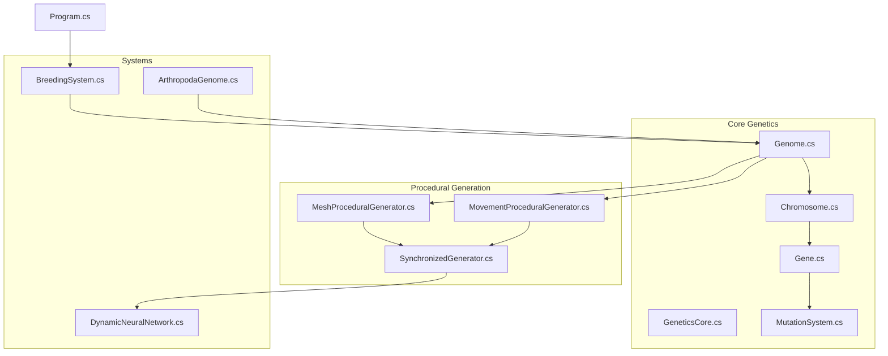
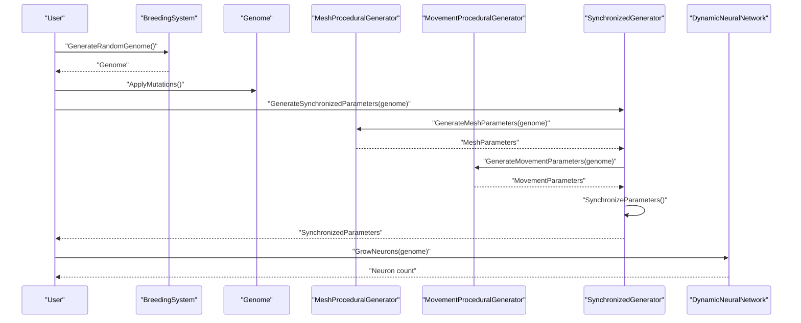
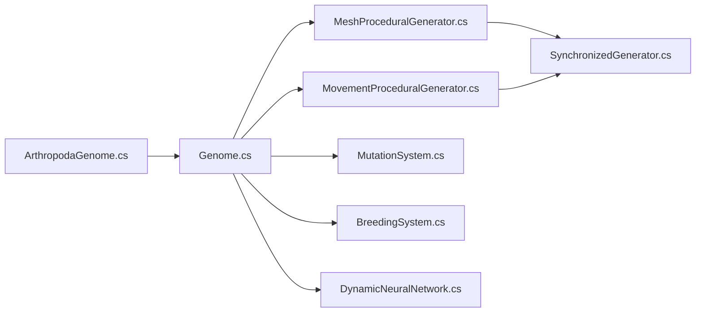
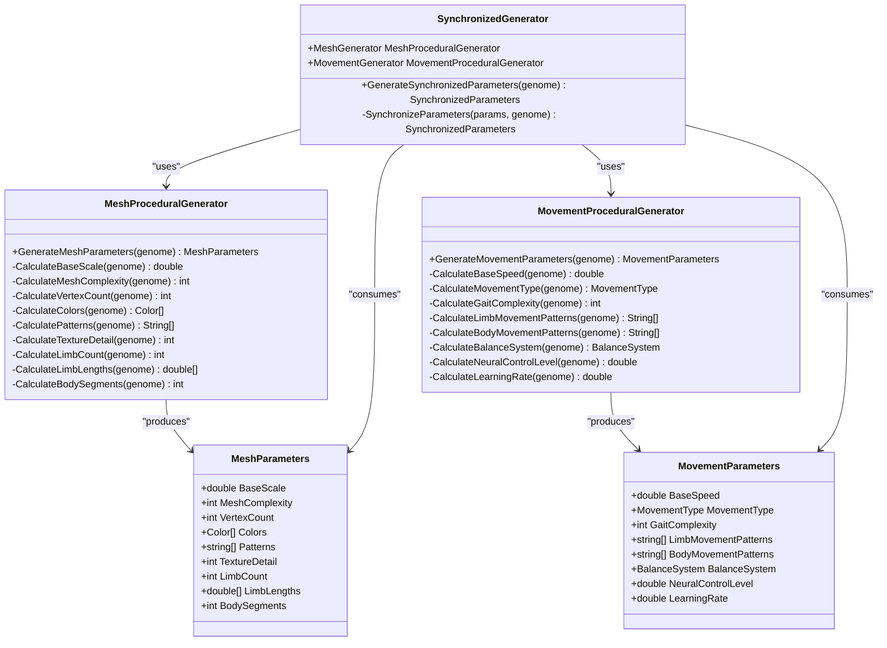
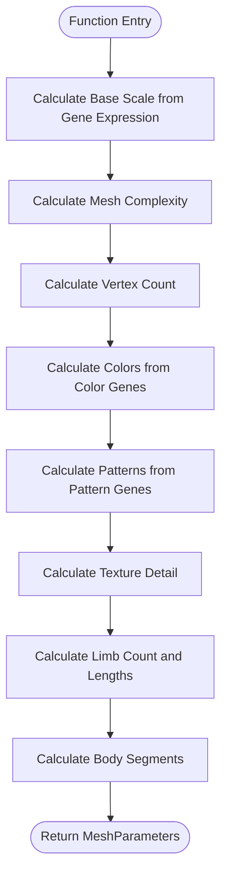
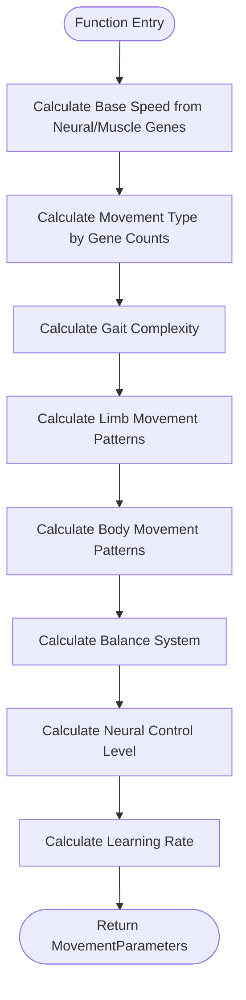

# Procedural Generation Modifications

<cite>
**Referenced Files in This Document**
- [GeneticsGame.csproj](file://GeneticsGame/GeneticsGame.csproj)
- [Program.cs](file://GeneticsGame/Program.cs)
- [GeneticsCore.cs](file://GeneticsGame/Core/GeneticsCore.cs)
- [Genome.cs](file://GeneticsGame/Core/Genome.cs)
- [Chromosome.cs](file://GeneticsGame/Core/Chromosome.cs)
- [Gene.cs](file://GeneticsGame/Core/Gene.cs)
- [MutationSystem.cs](file://GeneticsGame/Core/MutationSystem.cs)
- [MeshProceduralGenerator.cs](file://GeneticsGame/Procedural/Mesh/MeshProceduralGenerator.cs)
- [MovementProceduralGenerator.cs](file://GeneticsGame/Procedural/Movement/MovementProceduralGenerator.cs)
- [SynchronizedGenerator.cs](file://GeneticsGame/Procedural/SynchronizedGenerator.cs)
- [ArthropodaGenome.cs](file://GeneticsGame/Phyla/Arthropoda/ArthropodaGenome.cs)
- [BreedingSystem.cs](file://GeneticsGame/Systems/BreedingSystem.cs)
- [DynamicNeuralNetwork.cs](file://GeneticsGame/Systems/DynamicNeuralNetwork.cs)
</cite>

## Table of Contents
1. [Introduction](#introduction)
2. [Project Structure](#project-structure)
3. [Core Components](#core-components)
4. [Architecture Overview](#architecture-overview)
5. [Detailed Component Analysis](#detailed-component-analysis)
6. [Dependency Analysis](#dependency-analysis)
7. [Performance Considerations](#performance-considerations)
8. [Troubleshooting Guide](#troubleshooting-guide)
9. [Conclusion](#conclusion)
10. [Appendices](#appendices)

## Introduction
This document provides a comprehensive tutorial for modifying and extending the procedural generation system in the 3D Genetics Game. It focuses on:
- Customizing mesh generation parameters and creating new body plans
- Modifying movement patterns and introducing new locomotion types
- Adjusting parameter ranges and introducing new generation algorithms
- Synchronizing multiple generation systems (mesh and movement)
- Exercises for creating custom morphologies, locomotion types, and complex body segmentations
- Parameter tuning for realistic biological constraints
- Genetic influence on phenotypic expression
- Validation techniques for generated parameters and biological plausibility

## Project Structure
The project is organized around a genetic core, procedural generators, and supporting systems:
- Core genetics: Genome, Chromosome, Gene, MutationSystem, and global configuration
- Procedural generation: MeshProceduralGenerator, MovementProceduralGenerator, and SynchronizedGenerator
- Systems: BreedingSystem, DynamicNeuralNetwork, and specialized phyla (e.g., ArthropodaGenome)
- Entry point: Program demonstrates core workflows

**Diagram sources**
- [GeneticsGame.csproj:1-14](file://GeneticsGame/GeneticsGame.csproj#L1-L14)
- [Program.cs:1-58](file://GeneticsGame/Program.cs#L1-L58)
- [GeneticsCore.cs:1-21](file://GeneticsGame/Core/GeneticsCore.cs#L1-L21)
- [Genome.cs:1-190](file://GeneticsGame/Core/Genome.cs#L1-L190)
- [Chromosome.cs:1-146](file://GeneticsGame/Core/Chromosome.cs#L1-L146)
- [Gene.cs:1-93](file://GeneticsGame/Core/Gene.cs#L1-L93)
- [MutationSystem.cs:1-137](file://GeneticsGame/Core/MutationSystem.cs#L1-L137)
- [MeshProceduralGenerator.cs:1-365](file://GeneticsGame/Procedural/Mesh/MeshProceduralGenerator.cs#L1-L365)
- [MovementProceduralGenerator.cs:1-389](file://GeneticsGame/Procedural/Movement/MovementProceduralGenerator.cs#L1-L389)
- [SynchronizedGenerator.cs:1-141](file://GeneticsGame/Procedural/SynchronizedGenerator.cs#L1-L141)
- [ArthropodaGenome.cs:1-134](file://GeneticsGame/Phyla/Arthropoda/ArthropodaGenome.cs#L1-L134)
- [BreedingSystem.cs:1-182](file://GeneticsGame/Systems/BreedingSystem.cs#L1-L182)
- [DynamicNeuralNetwork.cs:1-116](file://GeneticsGame/Systems/DynamicNeuralNetwork.cs#L1-L116)

**Section sources**
- [GeneticsGame.csproj:1-14](file://GeneticsGame/GeneticsGame.csproj#L1-L14)
- [Program.cs:1-58](file://GeneticsGame/Program.cs#L1-L58)

## Core Components
- GeneticsCore: Central configuration for genetic systems (default mutation rate, neuron growth limits, neural activity threshold).
- Genome: Complete genetic blueprint with multi-gene interaction rules, mutation application, epistatic interactions, and breeding.
- Chromosome: Collection of genes with structural mutation support.
- Gene: Generic gene with expression level, mutation rate, neuron growth factor, activity, and interaction partners.
- MutationSystem: Core mutation engine applying point, structural, epigenetic, and neural-specific mutations.
- MeshProceduralGenerator: Converts genetic data to 3D mesh parameters (scale, complexity, vertex count, colors, patterns, textures, limbs, body segments).
- MovementProceduralGenerator: Converts genetic data to locomotion parameters (speed, movement type, gait complexity, limb/body movement patterns, balance system, neural control, learning rate).
- SynchronizedGenerator: Ensures mesh and movement parameters remain consistent and biologically plausible.
- BreedingSystem: Implements ARK-style breeding with compatibility scoring, mutation simulation, and random genome generation.
- DynamicNeuralNetwork: Supports runtime neuron addition based on genetic triggers and activity thresholds.
- ArthropodaGenome: Specialized genome for arthropods with phyla-specific chromosomes and traits.

**Section sources**
- [GeneticsCore.cs:1-21](file://GeneticsGame/Core/GeneticsCore.cs#L1-L21)
- [Genome.cs:1-190](file://GeneticsGame/Core/Genome.cs#L1-L190)
- [Chromosome.cs:1-146](file://GeneticsGame/Core/Chromosome.cs#L1-L146)
- [Gene.cs:1-93](file://GeneticsGame/Core/Gene.cs#L1-L93)
- [MutationSystem.cs:1-137](file://GeneticsGame/Core/MutationSystem.cs#L1-L137)
- [MeshProceduralGenerator.cs:1-365](file://GeneticsGame/Procedural/Mesh/MeshProceduralGenerator.cs#L1-L365)
- [MovementProceduralGenerator.cs:1-389](file://GeneticsGame/Procedural/Movement/MovementProceduralGenerator.cs#L1-L389)
- [SynchronizedGenerator.cs:1-141](file://GeneticsGame/Procedural/SynchronizedGenerator.cs#L1-L141)
- [BreedingSystem.cs:1-182](file://GeneticsGame/Systems/BreedingSystem.cs#L1-L182)
- [DynamicNeuralNetwork.cs:1-116](file://GeneticsGame/Systems/DynamicNeuralNetwork.cs#L1-L116)
- [ArthropodaGenome.cs:1-134](file://GeneticsGame/Phyla/Arthropoda/ArthropodaGenome.cs#L1-L134)

## Architecture Overview
The procedural generation pipeline converts genetic data into coherent 3D meshes and movement patterns, then synchronizes them for biological plausibility.

**Diagram sources**
- [Program.cs:11-57](file://GeneticsGame/Program.cs#L11-L57)
- [BreedingSystem.cs:137-181](file://GeneticsGame/Systems/BreedingSystem.cs#L137-L181)
- [Genome.cs:44-66](file://GeneticsGame/Core/Genome.cs#L44-L66)
- [SynchronizedGenerator.cs:35-124](file://GeneticsGame/Procedural/SynchronizedGenerator.cs#L35-L124)
- [MeshProceduralGenerator.cs:16-36](file://GeneticsGame/Procedural/Mesh/MeshProceduralGenerator.cs#L16-L36)
- [MovementProceduralGenerator.cs:16-35](file://GeneticsGame/Procedural/Movement/MovementProceduralGenerator.cs#L16-L35)
- [DynamicNeuralNetwork.cs:63-99](file://GeneticsGame/Systems/DynamicNeuralNetwork.cs#L63-L99)

## Detailed Component Analysis

### MeshProceduralGenerator
Purpose: Convert genetic data into 3D mesh parameters. Key calculations include:
- Base scale from average gene expression
- Mesh complexity from chromosome/gene counts
- Vertex count proportional to complexity
- Colors/patterns/textures from genes containing specific identifiers
- Limb count and lengths
- Body segments

Customization tips:
- Adjust mapping ranges for BaseScale, MeshComplexity, and VertexCount to reflect desired size and detail bounds.
- Extend color/pattern/texture logic to include new identifiers and distributions.
- Modify limb count and length variance to support new body plans (e.g., tentacles, wings).
- Introduce new segmentation rules for complex body plans (e.g., branching, jointed appendages).

Validation:
- Ensure limb count equals movement limb patterns after synchronization.
- Verify body segment counts align with movement body patterns.
- Confirm biological plausibility of scale-speed relationships.

**Section sources**
- [MeshProceduralGenerator.cs:16-36](file://GeneticsGame/Procedural/Mesh/MeshProceduralGenerator.cs#L16-L36)
- [MeshProceduralGenerator.cs:43-62](file://GeneticsGame/Procedural/Mesh/MeshProceduralGenerator.cs#L43-L62)
- [MeshProceduralGenerator.cs:69-80](file://GeneticsGame/Procedural/Mesh/MeshProceduralGenerator.cs#L69-L80)
- [MeshProceduralGenerator.cs:87-94](file://GeneticsGame/Procedural/Mesh/MeshProceduralGenerator.cs#L87-L94)
- [MeshProceduralGenerator.cs:101-139](file://GeneticsGame/Procedural/Mesh/MeshProceduralGenerator.cs#L101-L139)
- [MeshProceduralGenerator.cs:146-188](file://GeneticsGame/Procedural/Mesh/MeshProceduralGenerator.cs#L146-L188)
- [MeshProceduralGenerator.cs:195-211](file://GeneticsGame/Procedural/Mesh/MeshProceduralGenerator.cs#L195-L211)
- [MeshProceduralGenerator.cs:218-235](file://GeneticsGame/Procedural/Mesh/MeshProceduralGenerator.cs#L218-L235)
- [MeshProceduralGenerator.cs:242-255](file://GeneticsGame/Procedural/Mesh/MeshProceduralGenerator.cs#L242-L255)
- [MeshProceduralGenerator.cs:262-279](file://GeneticsGame/Procedural/Mesh/MeshProceduralGenerator.cs#L262-L279)

### MovementProceduralGenerator
Purpose: Convert genetic data into locomotion parameters. Key calculations include:
- Base speed from neural and muscle-related genes
- Movement type by counting genes for walking/flying/swimming/crawling
- Gait complexity from coordination/balance genes
- Limb movement patterns (synchronized, alternating, independent)
- Body movement patterns (undulating, segmented, rigid)
- Balance system selection (inner ear, visual, proprioceptive)
- Neural control level and learning rate

Customization tips:
- Add new movement types by extending the movement type detection logic and adding new pattern categories.
- Introduce new balance systems by adding new sensors and updating selection logic.
- Tune speed ranges and complexity scaling to match new morphologies.
- Incorporate new neural control mechanisms (e.g., oscillators, central pattern generators).

Validation:
- Ensure movement type matches anatomical constraints (e.g., flying requires wings).
- Validate gait complexity against body plan stability.
- Confirm learning rate and control level are appropriate for complexity.

**Section sources**
- [MovementProceduralGenerator.cs:16-35](file://GeneticsGame/Procedural/Movement/MovementProceduralGenerator.cs#L16-L35)
- [MovementProceduralGenerator.cs:42-76](file://GeneticsGame/Procedural/Movement/MovementProceduralGenerator.cs#L42-L76)
- [MovementProceduralGenerator.cs:83-119](file://GeneticsGame/Procedural/Movement/MovementProceduralGenerator.cs#L83-L119)
- [MovementProceduralGenerator.cs:126-142](file://GeneticsGame/Procedural/Movement/MovementProceduralGenerator.cs#L126-L142)
- [MovementProceduralGenerator.cs:149-178](file://GeneticsGame/Procedural/Movement/MovementProceduralGenerator.cs#L149-L178)
- [MovementProceduralGenerator.cs:185-211](file://GeneticsGame/Procedural/Movement/MovementProceduralGenerator.cs#L185-L211)
- [MovementProceduralGenerator.cs:218-247](file://GeneticsGame/Procedural/Movement/MovementProceduralGenerator.cs#L218-L247)
- [MovementProceduralGenerator.cs:254-271](file://GeneticsGame/Procedural/Movement/MovementProceduralGenerator.cs#L254-L271)
- [MovementProceduralGenerator.cs:278-295](file://GeneticsGame/Procedural/Movement/MovementProceduralGenerator.cs#L278-L295)

### SynchronizedGenerator
Purpose: Ensure mesh and movement parameters are consistent and biologically plausible. Synchronization steps:
- Align limb counts between mesh and movement
- Align body segment counts between mesh and movement
- Adjust speed based on size (larger creatures slower, smaller faster)
- Synchronize neural control with mesh complexity

Customization tips:
- Add new synchronization rules for additional parameters (e.g., joint flexibility, sensory range).
- Introduce environmental constraints that affect synchronization (e.g., aquatic vs. terrestrial adjustments).
- Implement cross-system validation to prevent impossible combinations (e.g., too many limbs for body size).

Validation:
- Verify counts match after synchronization.
- Ensure derived parameters (e.g., speed) remain within reasonable bounds.
- Check that neural control increases with complexity.

**Section sources**
- [SynchronizedGenerator.cs:35-49](file://GeneticsGame/Procedural/SynchronizedGenerator.cs#L35-L49)
- [SynchronizedGenerator.cs:57-124](file://GeneticsGame/Procedural/SynchronizedGenerator.cs#L57-L124)

### Genetic Influence and Parameter Tuning
- Gene expression levels directly influence parameter ranges (e.g., BaseScale, LimbCount, GaitComplexity).
- MutationSystem applies point, structural, epigenetic, and neural-specific mutations, affecting expression levels and neuron growth.
- BreedingSystem simulates inheritance with compatibility scoring and random genome generation.
- DynamicNeuralNetwork grows neurons based on genetic triggers and activity thresholds.

Parameter tuning guidelines:
- Use expression levels to map to biological ranges (e.g., 0.0–1.0 to 0.1–3.0 for speed).
- Apply bounds checks to prevent unrealistic extremes.
- Consider epistatic interactions when designing new genes to ensure cooperative effects.
- Balance mutation rates to maintain stability while allowing evolution.

**Section sources**
- [GeneticsCore.cs:14-19](file://GeneticsGame/Core/GeneticsCore.cs#L14-L19)
- [Genome.cs:44-66](file://GeneticsGame/Core/Genome.cs#L44-L66)
- [Genome.cs:81-107](file://GeneticsGame/Core/Genome.cs#L81-L107)
- [MutationSystem.cs:17-29](file://GeneticsGame/Core/MutationSystem.cs#L17-L29)
- [MutationSystem.cs:37-54](file://GeneticsGame/Core/MutationSystem.cs#L37-L54)
- [MutationSystem.cs:62-76](file://GeneticsGame/Core/MutationSystem.cs#L62-L76)
- [MutationSystem.cs:84-103](file://GeneticsGame/Core/MutationSystem.cs#L84-L103)
- [MutationSystem.cs:111-136](file://GeneticsGame/Core/MutationSystem.cs#L111-L136)
- [BreedingSystem.cs:18-27](file://GeneticsGame/Systems/BreedingSystem.cs#L18-L27)
- [BreedingSystem.cs:137-181](file://GeneticsGame/Systems/BreedingSystem.cs#L137-L181)
- [DynamicNeuralNetwork.cs:63-99](file://GeneticsGame/Systems/DynamicNeuralNetwork.cs#L63-L99)

### Creating Custom Organism Morphologies
Exercise outline:
- Define new body plan characteristics (segments, limbs, appendages).
- Add new genes with identifiers that encode these traits (e.g., “segment”, “limb”, “appendage”).
- Extend MeshProceduralGenerator to calculate new parameters (e.g., joint complexity, surface area).
- Ensure SynchronizedGenerator aligns new parameters with movement patterns.
- Validate biological plausibility (e.g., mass distribution, center of gravity).

Implementation pointers:
- Use existing patterns in MeshProceduralGenerator for inspiration (e.g., color/pattern/texture logic).
- Introduce new identifiers and thresholds to control expression levels.
- Test with BreedingSystem to observe heritability and variability.

**Section sources**
- [MeshProceduralGenerator.cs:101-139](file://GeneticsGame/Procedural/Mesh/MeshProceduralGenerator.cs#L101-L139)
- [MeshProceduralGenerator.cs:146-188](file://GeneticsGame/Procedural/Mesh/MeshProceduralGenerator.cs#L146-L188)
- [MeshProceduralGenerator.cs:218-279](file://GeneticsGame/Procedural/Mesh/MeshProceduralGenerator.cs#L218-L279)
- [SynchronizedGenerator.cs:57-124](file://GeneticsGame/Procedural/SynchronizedGenerator.cs#L57-L124)
- [BreedingSystem.cs:137-181](file://GeneticsGame/Systems/BreedingSystem.cs#L137-L181)

### Developing New Locomotion Types
Exercise outline:
- Identify genes associated with new locomotion modes (e.g., gliding, jet propulsion).
- Extend MovementProceduralGenerator to detect and score these genes.
- Add new MovementType and MovementType-specific parameters.
- Ensure synchronization maintains anatomical feasibility (e.g., appendage-to-locomotion matching).
- Calibrate speed and complexity ranges for realism.

Implementation pointers:
- Follow the movement type detection pattern in MovementProceduralGenerator.
- Add new balance systems if needed (e.g., hydrodynamic sensors).
- Use learning rate and neural control to model adaptability.

**Section sources**
- [MovementProceduralGenerator.cs:83-119](file://GeneticsGame/Procedural/Movement/MovementProceduralGenerator.cs#L83-L119)
- [MovementProceduralGenerator.cs:347-368](file://GeneticsGame/Procedural/Movement/MovementProceduralGenerator.cs#L347-L368)
- [MovementProceduralGenerator.cs:373-389](file://GeneticsGame/Procedural/Movement/MovementProceduralGenerator.cs#L373-L389)
- [SynchronizedGenerator.cs:57-124](file://GeneticsGame/Procedural/SynchronizedGenerator.cs#L57-L124)

### Implementing Complex Body Segmentations
Exercise outline:
- Design segmentation rules (e.g., head, thorax, abdomen, branches).
- Add genes controlling segment count, size variation, and joint complexity.
- Extend mesh segmentation calculation and movement body patterns.
- Validate with synchronization to ensure consistent counts and patterns.

Implementation pointers:
- Study the segment calculation logic and apply similar patterns for new segment types.
- Ensure movement body patterns reflect segmentation (e.g., undulating vs. segmented).

**Section sources**
- [MeshProceduralGenerator.cs:262-279](file://GeneticsGame/Procedural/Mesh/MeshProceduralGenerator.cs#L262-L279)
- [MovementProceduralGenerator.cs:185-211](file://GeneticsGame/Procedural/Movement/MovementProceduralGenerator.cs#L185-L211)
- [SynchronizedGenerator.cs:81-99](file://GeneticsGame/Procedural/SynchronizedGenerator.cs#L81-L99)

### Parameter Ranges and Biological Constraints
Guidelines:
- Map expression levels to biologically meaningful ranges using bounded transformations.
- Enforce size-speed relationships to maintain realistic dynamics.
- Use epistatic interactions to model cooperative gene effects.
- Apply mutation rates that balance innovation and stability.

Validation techniques:
- Cross-check counts (limbs, segments) across systems.
- Ensure derived parameters (speed, control) fall within expected ranges.
- Test compatibility scoring to guide breeding toward desired traits.

**Section sources**
- [MeshProceduralGenerator.cs:43-62](file://GeneticsGame/Procedural/Mesh/MeshProceduralGenerator.cs#L43-L62)
- [MovementProceduralGenerator.cs:42-76](file://GeneticsGame/Procedural/Movement/MovementProceduralGenerator.cs#L42-L76)
- [SynchronizedGenerator.cs:101-122](file://GeneticsGame/Procedural/SynchronizedGenerator.cs#L101-L122)
- [BreedingSystem.cs:35-45](file://GeneticsGame/Systems/BreedingSystem.cs#L35-L45)

### Genetic Factors and Phenotypic Expression
Key mechanisms:
- Gene expression levels drive parameter values.
- Epistatic interactions combine multiple genes’ effects.
- MutationSystem introduces variability through point, structural, epigenetic, and neural-specific mutations.
- DynamicNeuralNetwork translates genetic signals into neural growth.

Best practices:
- Design genes with clear identifiers to enable targeted parameter control.
- Use neuron growth factors to influence neural network development.
- Monitor activity thresholds to regulate growth.

**Section sources**
- [Gene.cs:18-57](file://GeneticsGame/Core/Gene.cs#L18-L57)
- [Genome.cs:81-107](file://GeneticsGame/Core/Genome.cs#L81-L107)
- [MutationSystem.cs:17-29](file://GeneticsGame/Core/MutationSystem.cs#L17-L29)
- [DynamicNeuralNetwork.cs:63-99](file://GeneticsGame/Systems/DynamicNeuralNetwork.cs#L63-L99)

## Dependency Analysis
The procedural generation system depends on the genetic core and systems for breeding and neural growth.

**Diagram sources**
- [Genome.cs:19-75](file://GeneticsGame/Core/Genome.cs#L19-L75)
- [MeshProceduralGenerator.cs:16-36](file://GeneticsGame/Procedural/Mesh/MeshProceduralGenerator.cs#L16-L36)
- [MovementProceduralGenerator.cs:16-35](file://GeneticsGame/Procedural/Movement/MovementProceduralGenerator.cs#L16-L35)
- [SynchronizedGenerator.cs:35-49](file://GeneticsGame/Procedural/SynchronizedGenerator.cs#L35-L49)
- [MutationSystem.cs:17-29](file://GeneticsGame/Core/MutationSystem.cs#L17-L29)
- [BreedingSystem.cs:18-27](file://GeneticsGame/Systems/BreedingSystem.cs#L18-L27)
- [DynamicNeuralNetwork.cs:63-99](file://GeneticsGame/Systems/DynamicNeuralNetwork.cs#L63-L99)
- [ArthropodaGenome.cs:15-70](file://GeneticsGame/Phyla/Arthropoda/ArthropodaGenome.cs#L15-L70)

**Section sources**
- [Genome.cs:19-75](file://GeneticsGame/Core/Genome.cs#L19-L75)
- [SynchronizedGenerator.cs:35-49](file://GeneticsGame/Procedural/SynchronizedGenerator.cs#L35-L49)

## Performance Considerations
- Mesh complexity and vertex count scale with gene counts; limit complexity to maintain rendering performance.
- Movement pattern calculations iterate through genes; optimize by early exits and caching repeated computations.
- Synchronization adjusts lists; minimize redundant operations by checking equality before resizing.
- MutationSystem applies mutations across all genes; consider selective mutation application for large genomes.

[No sources needed since this section provides general guidance]

## Troubleshooting Guide
Common issues and resolutions:
- Inconsistent limb counts: Verify synchronization logic aligns movement limb patterns with mesh limb count.
- Unstable speeds: Ensure size-speed relationships are enforced during synchronization.
- Imbalanced movement types: Review gene scoring thresholds and ensure dominance logic selects the intended type.
- Excessive neuron growth: Check activity thresholds and growth limits in DynamicNeuralNetwork.
- Poor compatibility scores: Adjust BreedingSystem compatibility weights and diversity metrics.

**Section sources**
- [SynchronizedGenerator.cs:57-124](file://GeneticsGame/Procedural/SynchronizedGenerator.cs#L57-L124)
- [MovementProceduralGenerator.cs:83-119](file://GeneticsGame/Procedural/Movement/MovementProceduralGenerator.cs#L83-L119)
- [DynamicNeuralNetwork.cs:63-99](file://GeneticsGame/Systems/DynamicNeuralNetwork.cs#L63-L99)
- [BreedingSystem.cs:35-45](file://GeneticsGame/Systems/BreedingSystem.cs#L35-L45)

## Conclusion
The procedural generation system integrates genetic data with mesh and movement generation through a robust synchronization mechanism. By extending gene identifiers, adjusting parameter mappings, and enforcing biological constraints, developers can create diverse and plausible organisms. The provided exercises and guidelines offer practical pathways to customize morphologies, locomotion types, and body segmentations while maintaining biological plausibility and system performance.

[No sources needed since this section summarizes without analyzing specific files]

## Appendices

### Class Diagram: Procedural Generation Classes

**Diagram sources**
- [MeshProceduralGenerator.cs:9-365](file://GeneticsGame/Procedural/Mesh/MeshProceduralGenerator.cs#L9-L365)
- [MovementProceduralGenerator.cs:9-389](file://GeneticsGame/Procedural/Movement/MovementProceduralGenerator.cs#L9-L389)
- [SynchronizedGenerator.cs:9-141](file://GeneticsGame/Procedural/SynchronizedGenerator.cs#L9-L141)

### Flowchart: Mesh Generation Logic

**Diagram sources**
- [MeshProceduralGenerator.cs:16-36](file://GeneticsGame/Procedural/Mesh/MeshProceduralGenerator.cs#L16-L36)
- [MeshProceduralGenerator.cs:43-62](file://GeneticsGame/Procedural/Mesh/MeshProceduralGenerator.cs#L43-L62)
- [MeshProceduralGenerator.cs:69-80](file://GeneticsGame/Procedural/Mesh/MeshProceduralGenerator.cs#L69-L80)
- [MeshProceduralGenerator.cs:87-94](file://GeneticsGame/Procedural/Mesh/MeshProceduralGenerator.cs#L87-L94)
- [MeshProceduralGenerator.cs:101-139](file://GeneticsGame/Procedural/Mesh/MeshProceduralGenerator.cs#L101-L139)
- [MeshProceduralGenerator.cs:146-188](file://GeneticsGame/Procedural/Mesh/MeshProceduralGenerator.cs#L146-L188)
- [MeshProceduralGenerator.cs:195-211](file://GeneticsGame/Procedural/Mesh/MeshProceduralGenerator.cs#L195-L211)
- [MeshProceduralGenerator.cs:218-255](file://GeneticsGame/Procedural/Mesh/MeshProceduralGenerator.cs#L218-L255)
- [MeshProceduralGenerator.cs:262-279](file://GeneticsGame/Procedural/Mesh/MeshProceduralGenerator.cs#L262-L279)

### Flowchart: Movement Generation Logic

**Diagram sources**
- [MovementProceduralGenerator.cs:16-35](file://GeneticsGame/Procedural/Movement/MovementProceduralGenerator.cs#L16-L35)
- [MovementProceduralGenerator.cs:42-76](file://GeneticsGame/Procedural/Movement/MovementProceduralGenerator.cs#L42-L76)
- [MovementProceduralGenerator.cs:83-119](file://GeneticsGame/Procedural/Movement/MovementProceduralGenerator.cs#L83-L119)
- [MovementProceduralGenerator.cs:126-142](file://GeneticsGame/Procedural/Movement/MovementProceduralGenerator.cs#L126-L142)
- [MovementProceduralGenerator.cs:149-178](file://GeneticsGame/Procedural/Movement/MovementProceduralGenerator.cs#L149-L178)
- [MovementProceduralGenerator.cs:185-211](file://GeneticsGame/Procedural/Movement/MovementProceduralGenerator.cs#L185-L211)
- [MovementProceduralGenerator.cs:218-247](file://GeneticsGame/Procedural/Movement/MovementProceduralGenerator.cs#L218-L247)
- [MovementProceduralGenerator.cs:254-295](file://GeneticsGame/Procedural/Movement/MovementProceduralGenerator.cs#L254-L295)