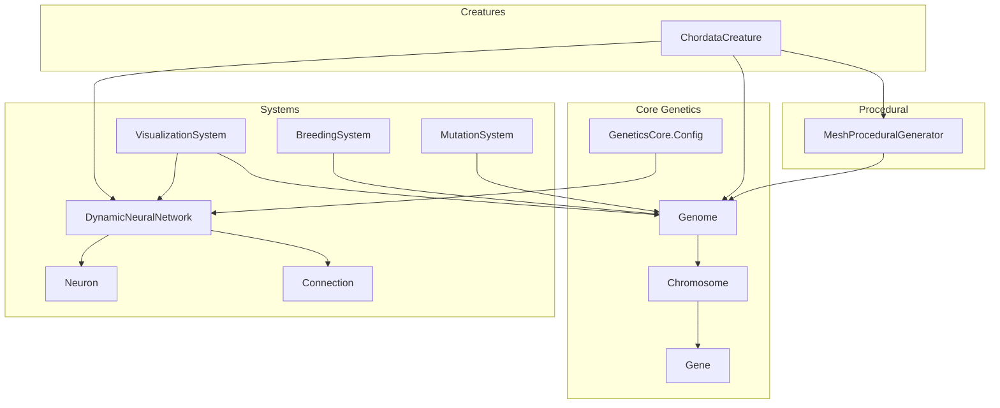
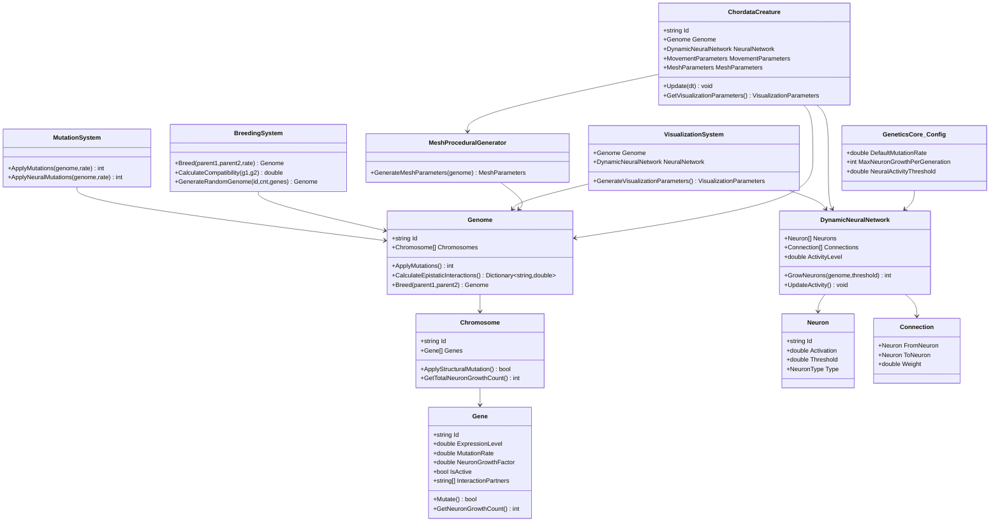
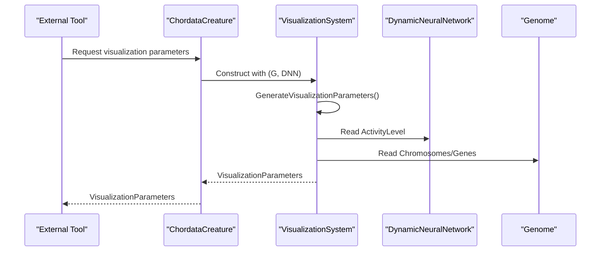
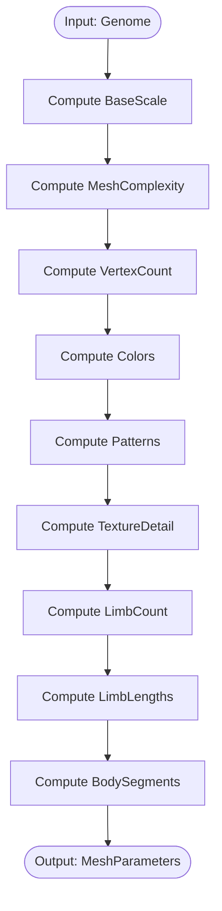
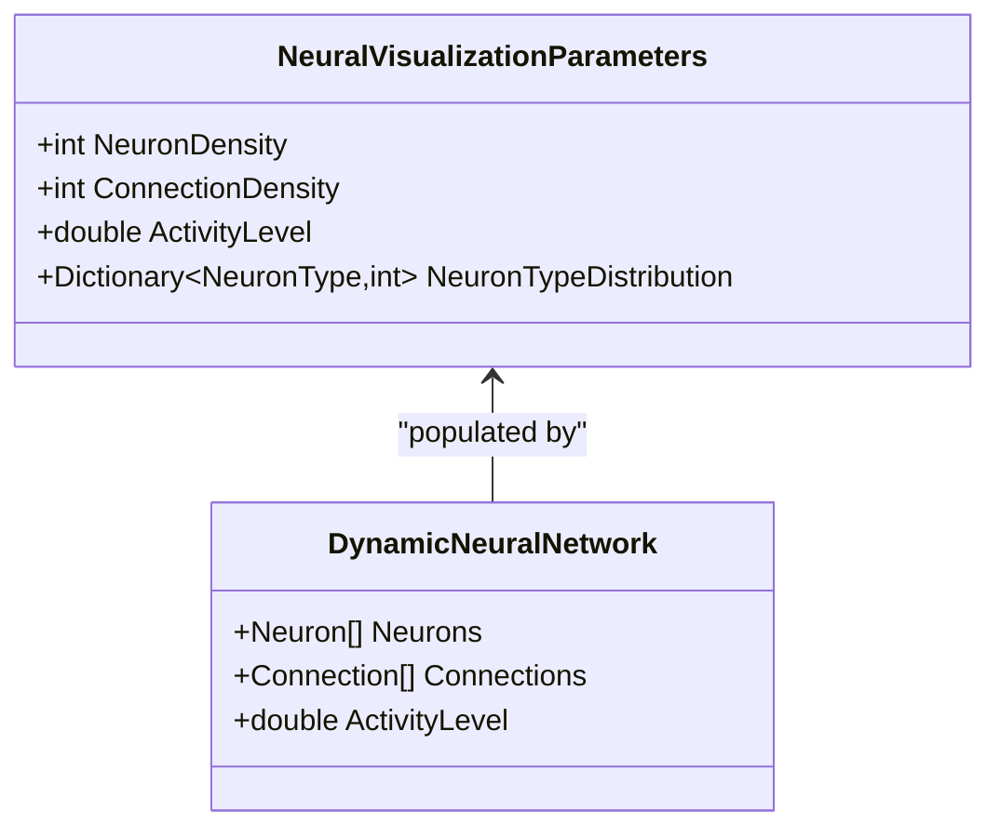
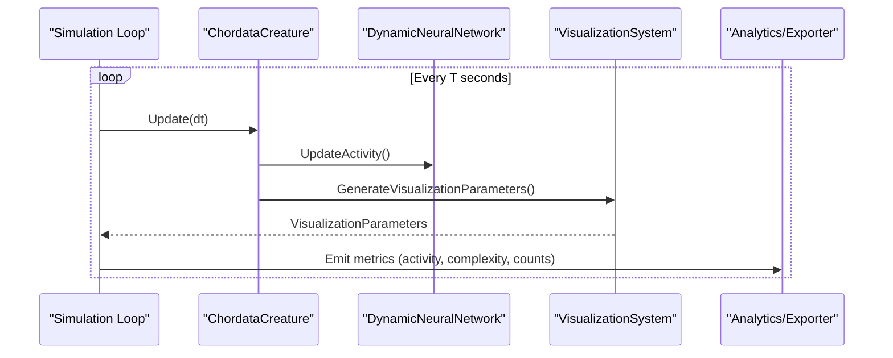
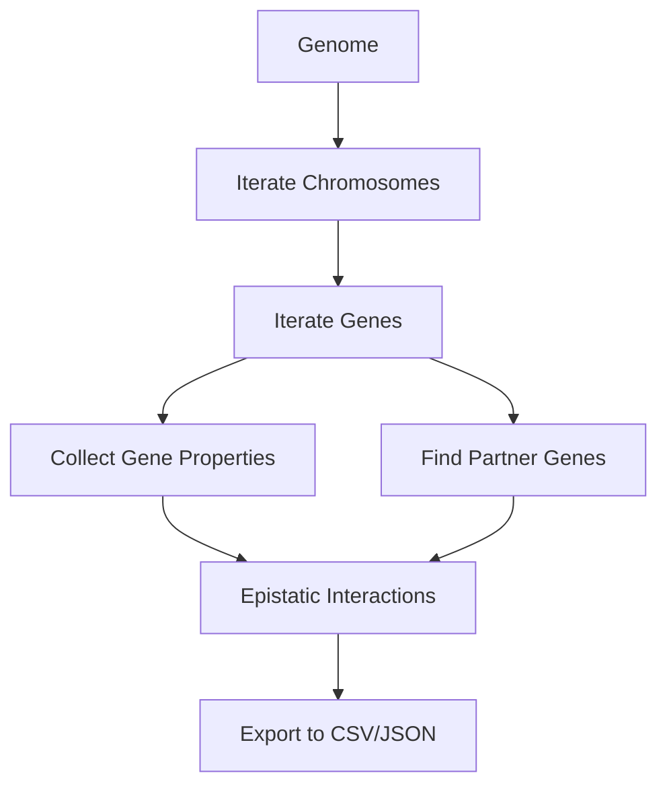
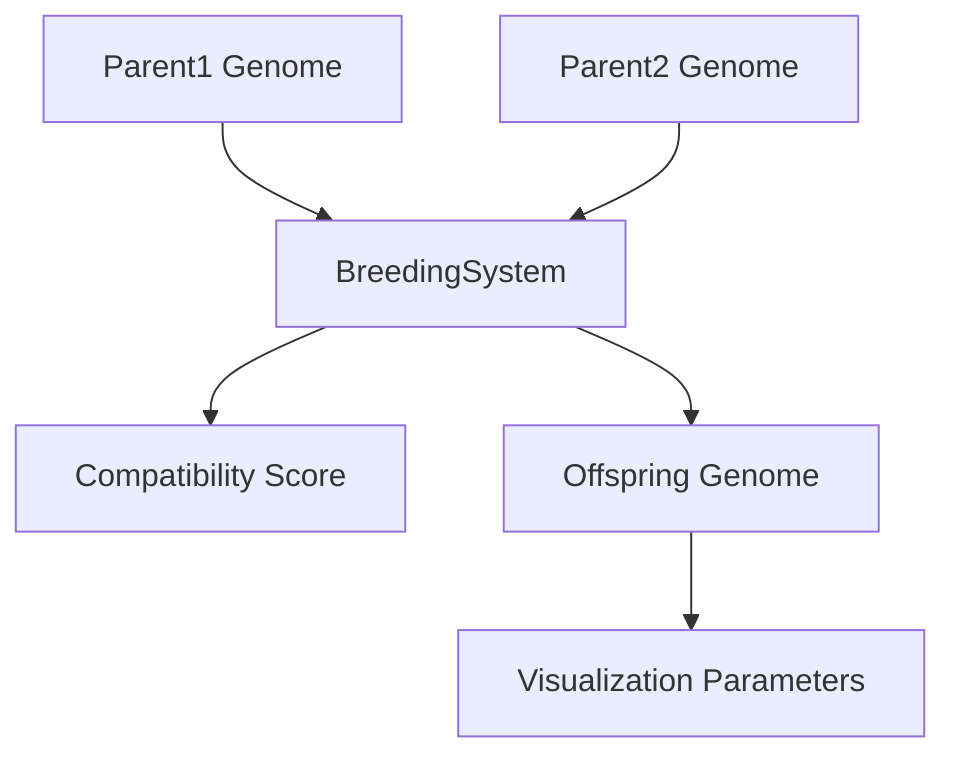
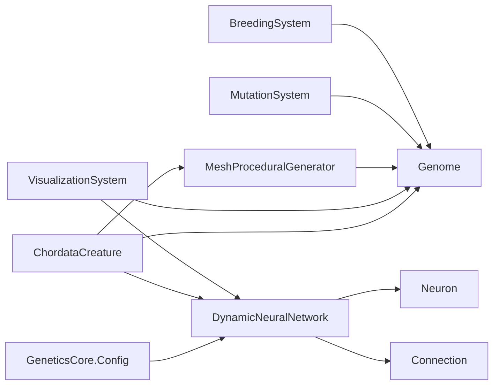

# Visualization and Integration Guide

<cite>
**Referenced Files in This Document**
- [GeneticsCore.cs](file://GeneticsGame/Core/GeneticsCore.cs)
- [Genome.cs](file://GeneticsGame/Core/Genome.cs)
- [Chromosome.cs](file://GeneticsGame/Core/Chromosome.cs)
- [Gene.cs](file://GeneticsGame/Core/Gene.cs)
- [MutationSystem.cs](file://GeneticsGame/Core/MutationSystem.cs)
- [BreedingSystem.cs](file://GeneticsGame/Systems/BreedingSystem.cs)
- [DynamicNeuralNetwork.cs](file://GeneticsGame/Systems/DynamicNeuralNetwork.cs)
- [Neuron.cs](file://GeneticsGame/Systems/Neuron.cs)
- [Connection.cs](file://GeneticsGame/Systems/Connection.cs)
- [VisualizationSystem.cs](file://GeneticsGame/Systems/VisualizationSystem.cs)
- [MeshProceduralGenerator.cs](file://GeneticsGame/Procedural/Mesh/MeshProceduralGenerator.cs)
- [ChordataCreature.cs](file://GeneticsGame/Phyla/Chordata/ChordataCreature.cs)
- [Program.cs](file://GeneticsGame/Program.cs)
</cite>

## Table of Contents
1. [Introduction](#introduction)
2. [Project Structure](#project-structure)
3. [Core Components](#core-components)
4. [Architecture Overview](#architecture-overview)
5. [Detailed Component Analysis](#detailed-component-analysis)
6. [Dependency Analysis](#dependency-analysis)
7. [Performance Considerations](#performance-considerations)
8. [Troubleshooting Guide](#troubleshooting-guide)
9. [Conclusion](#conclusion)
10. [Appendices](#appendices)

## Introduction
This guide explains how to integrate the 3D Genetics system with external visualization and analysis tools. It focuses on extracting genetic data for analysis, exporting creature parameters for 3D modeling software, and building visualization pipelines. It also covers real-time visualization of evolutionary processes, dashboard creation, and educational tools. Practical integration patterns are provided for Unity, Three.js, and similar engines, along with guidance for handling large datasets efficiently.

## Project Structure
The system is organized around core genetics primitives (Genome, Chromosome, Gene), mutation and breeding systems, a dynamic neural network, procedural mesh generation, and a visualization system that converts genetic and neural data into renderable parameters. Creatures orchestrate updates and expose visualization parameters.

**Diagram sources**
- [Genome.cs:1-190](file://GeneticsGame/Core/Genome.cs#L1-L190)
- [Chromosome.cs:1-146](file://GeneticsGame/Core/Chromosome.cs#L1-L146)
- [Gene.cs:1-93](file://GeneticsGame/Core/Gene.cs#L1-L93)
- [MutationSystem.cs:1-137](file://GeneticsGame/Core/MutationSystem.cs#L1-L137)
- [BreedingSystem.cs:1-182](file://GeneticsGame/Systems/BreedingSystem.cs#L1-L182)
- [DynamicNeuralNetwork.cs:1-116](file://GeneticsGame/Systems/DynamicNeuralNetwork.cs#L1-L116)
- [Neuron.cs:1-70](file://GeneticsGame/Systems/Neuron.cs#L1-L70)
- [Connection.cs:1-35](file://GeneticsGame/Systems/Connection.cs#L1-L35)
- [VisualizationSystem.cs:1-239](file://GeneticsGame/Systems/VisualizationSystem.cs#L1-L239)
- [MeshProceduralGenerator.cs:1-365](file://GeneticsGame/Procedural/Mesh/MeshProceduralGenerator.cs#L1-L365)
- [ChordataCreature.cs:1-133](file://GeneticsGame/Phyla/Chordata/ChordataCreature.cs#L1-L133)
- [GeneticsCore.cs:1-21](file://GeneticsGame/Core/GeneticsCore.cs#L1-L21)

**Section sources**
- [Program.cs:1-58](file://GeneticsGame/Program.cs#L1-L58)

## Core Components
- Genome: Aggregates Chromosomes and exposes operations like mutation application, epistatic interaction calculation, and breeding.
- Chromosome: Holds Genes and supports structural mutations.
- Gene: Encapsulates expression level, mutation rate, neuron growth factor, activity, and epistatic partners.
- MutationSystem: Applies point, structural, epigenetic, and neural-specific mutations.
- BreedingSystem: Implements genome inheritance and compatibility scoring.
- DynamicNeuralNetwork: Runtime neuron growth and activity management.
- VisualizationSystem: Translates genome and neural network into visualization parameters.
- MeshProceduralGenerator: Produces mesh parameters from genetic data.
- ChordataCreature: Orchestrates neural and procedural updates and exposes visualization parameters.

Key integration APIs:
- Extract genetic data: Access Genome.Chromosomes, Gene properties, and epistatic interactions.
- Export creature parameters: Use ChordataCreature.GetVisualizationParameters() and MeshProceduralGenerator.GenerateMeshParameters().
- Real-time updates: Call ChordataCreature.Update() and DynamicNeuralNetwork.UpdateActivity().

**Section sources**
- [Genome.cs:1-190](file://GeneticsGame/Core/Genome.cs#L1-L190)
- [Chromosome.cs:1-146](file://GeneticsGame/Core/Chromosome.cs#L1-L146)
- [Gene.cs:1-93](file://GeneticsGame/Core/Gene.cs#L1-L93)
- [MutationSystem.cs:1-137](file://GeneticsGame/Core/MutationSystem.cs#L1-L137)
- [BreedingSystem.cs:1-182](file://GeneticsGame/Systems/BreedingSystem.cs#L1-L182)
- [DynamicNeuralNetwork.cs:1-116](file://GeneticsGame/Systems/DynamicNeuralNetwork.cs#L1-L116)
- [VisualizationSystem.cs:1-239](file://GeneticsGame/Systems/VisualizationSystem.cs#L1-L239)
- [MeshProceduralGenerator.cs:1-365](file://GeneticsGame/Procedural/Mesh/MeshProceduralGenerator.cs#L1-L365)
- [ChordataCreature.cs:1-133](file://GeneticsGame/Phyla/Chordata/ChordataCreature.cs#L1-L133)

## Architecture Overview
The system separates genetic representation, neural dynamics, procedural generation, and visualization. Creatures coordinate updates and expose consolidated parameters for external tools.

**Diagram sources**
- [Genome.cs:1-190](file://GeneticsGame/Core/Genome.cs#L1-L190)
- [Chromosome.cs:1-146](file://GeneticsGame/Core/Chromosome.cs#L1-L146)
- [Gene.cs:1-93](file://GeneticsGame/Core/Gene.cs#L1-L93)
- [MutationSystem.cs:1-137](file://GeneticsGame/Core/MutationSystem.cs#L1-L137)
- [BreedingSystem.cs:1-182](file://GeneticsGame/Systems/BreedingSystem.cs#L1-L182)
- [DynamicNeuralNetwork.cs:1-116](file://GeneticsGame/Systems/DynamicNeuralNetwork.cs#L1-L116)
- [Neuron.cs:1-70](file://GeneticsGame/Systems/Neuron.cs#L1-L70)
- [Connection.cs:1-35](file://GeneticsGame/Systems/Connection.cs#L1-L35)
- [VisualizationSystem.cs:1-239](file://GeneticsGame/Systems/VisualizationSystem.cs#L1-L239)
- [MeshProceduralGenerator.cs:1-365](file://GeneticsGame/Procedural/Mesh/MeshProceduralGenerator.cs#L1-L365)
- [ChordataCreature.cs:1-133](file://GeneticsGame/Phyla/Chordata/ChordataCreature.cs#L1-L133)
- [GeneticsCore.cs:1-21](file://GeneticsGame/Core/GeneticsCore.cs#L1-L21)

## Detailed Component Analysis

### Visualization Pipeline
The VisualizationSystem aggregates genome and neural network data into a structured parameter set suitable for external rendering.

**Diagram sources**
- [ChordataCreature.cs:128-132](file://GeneticsGame/Phyla/Chordata/ChordataCreature.cs#L128-L132)
- [VisualizationSystem.cs:36-53](file://GeneticsGame/Systems/VisualizationSystem.cs#L36-L53)

Integration patterns:
- Unity: Map VisualizationParameters to material properties, animation curves, and LOD settings.
- Three.js: Convert VisualizationParameters to shader uniforms and geometry attributes.

**Section sources**
- [VisualizationSystem.cs:1-239](file://GeneticsGame/Systems/VisualizationSystem.cs#L1-L239)
- [ChordataCreature.cs:128-132](file://GeneticsGame/Phyla/Chordata/ChordataCreature.cs#L128-L132)

### Mesh Parameter Export
MeshProceduralGenerator translates genetic traits into mesh parameters for 3D modeling tools.

**Diagram sources**
- [MeshProceduralGenerator.cs:16-36](file://GeneticsGame/Procedural/Mesh/MeshProceduralGenerator.cs#L16-L36)
- [MeshProceduralGenerator.cs:43-279](file://GeneticsGame/Procedural/Mesh/MeshProceduralGenerator.cs#L43-L279)

Export formats:
- Unity: Serialize MeshParameters to asset bundles or prefabs.
- Three.js: Export JSON containing MeshParameters for loader scripts.

**Section sources**
- [MeshProceduralGenerator.cs:1-365](file://GeneticsGame/Procedural/Mesh/MeshProceduralGenerator.cs#L1-L365)

### Neural Network Visualization
VisualizationSystem computes neural visualization parameters derived from the dynamic neural network.

**Diagram sources**
- [VisualizationSystem.cs:136-165](file://GeneticsGame/Systems/VisualizationSystem.cs#L136-L165)
- [DynamicNeuralNetwork.cs:14-34](file://GeneticsGame/Systems/DynamicNeuralNetwork.cs#L14-L34)

**Section sources**
- [VisualizationSystem.cs:136-165](file://GeneticsGame/Systems/VisualizationSystem.cs#L136-L165)
- [DynamicNeuralNetwork.cs:1-116](file://GeneticsGame/Systems/DynamicNeuralNetwork.cs#L1-L116)

### Evolutionary Data Streams
To stream evolutionary data:
- Poll DynamicNeuralNetwork.ActivityLevel and VisualizationParameters periodically.
- Capture Genome epistatic interactions and mutation counts.
- Aggregate metrics per generation and export to CSV or analytics sinks.

**Diagram sources**
- [ChordataCreature.cs:61-78](file://GeneticsGame/Phyla/Chordata/ChordataCreature.cs#L61-L78)
- [DynamicNeuralNetwork.cs:104-115](file://GeneticsGame/Systems/DynamicNeuralNetwork.cs#L104-L115)
- [VisualizationSystem.cs:36-53](file://GeneticsGame/Systems/VisualizationSystem.cs#L36-L53)

**Section sources**
- [ChordataCreature.cs:61-78](file://GeneticsGame/Phyla/Chordata/ChordataCreature.cs#L61-L78)
- [DynamicNeuralNetwork.cs:104-115](file://GeneticsGame/Systems/DynamicNeuralNetwork.cs#L104-L115)
- [VisualizationSystem.cs:36-53](file://GeneticsGame/Systems/VisualizationSystem.cs#L36-L53)

### Genetic Data Extraction for External Analysis
- Access gene-level properties: Id, ExpressionLevel, MutationRate, NeuronGrowthFactor, IsActive, InteractionPartners.
- Compute epistatic interactions via Genome.CalculateEpistaticInteractions().
- Track mutations via MutationSystem.ApplyMutations() and MutationSystem.ApplyNeuralMutations().

**Diagram sources**
- [Genome.cs:81-107](file://GeneticsGame/Core/Genome.cs#L81-L107)
- [Gene.cs:14-57](file://GeneticsGame/Core/Gene.cs#L14-L57)

**Section sources**
- [Genome.cs:81-107](file://GeneticsGame/Core/Genome.cs#L81-L107)
- [Gene.cs:14-57](file://GeneticsGame/Core/Gene.cs#L14-L57)
- [MutationSystem.cs:17-29](file://GeneticsGame/Core/MutationSystem.cs#L17-L29)

### Breeding and Compatibility for Visualization Dashboards
Use BreedingSystem to compute compatibility scores and produce offspring for comparative visualization.

**Diagram sources**
- [BreedingSystem.cs:18-27](file://GeneticsGame/Systems/BreedingSystem.cs#L18-L27)
- [BreedingSystem.cs:35-45](file://GeneticsGame/Systems/BreedingSystem.cs#L35-L45)

**Section sources**
- [BreedingSystem.cs:18-27](file://GeneticsGame/Systems/BreedingSystem.cs#L18-L27)
- [BreedingSystem.cs:35-45](file://GeneticsGame/Systems/BreedingSystem.cs#L35-L45)

### Exercises and Integrations

- Unity Integration
  - Map VisualizationParameters.ComplexityLevel to LOD thresholds.
  - Use ActivityLevel to drive animation speed and blend shapes.
  - Export MeshParameters to procedural mesh assets or shaders.

- Three.js Integration
  - Serialize VisualizationParameters to JSON and load in loaders.
  - Drive material color palettes from VisualizationParameters.ColorPalette.
  - Animate geometries using AnimationParameters.Speed and Complexity.

- Real-time Evolutionary Visualization
  - Poll UpdateActivity() and GetVisualizationParameters() in a loop.
  - Stream metrics to a dashboard backend and render charts.

- Educational Tools
  - Build a genetic browser exposing Gene.Id, ExpressionLevel, and InteractionPartners.
  - Visualize epistatic interaction graphs using network libraries.

[No sources needed since this section provides general guidance]

## Dependency Analysis
The following diagram highlights key dependencies among components used for integration.

**Diagram sources**
- [BreedingSystem.cs:18-27](file://GeneticsGame/Systems/BreedingSystem.cs#L18-L27)
- [MutationSystem.cs:17-29](file://GeneticsGame/Core/MutationSystem.cs#L17-L29)
- [MeshProceduralGenerator.cs:16-36](file://GeneticsGame/Procedural/Mesh/MeshProceduralGenerator.cs#L16-L36)
- [VisualizationSystem.cs:14-30](file://GeneticsGame/Systems/VisualizationSystem.cs#L14-L30)
- [ChordataCreature.cs:41-55](file://GeneticsGame/Phyla/Chordata/ChordataCreature.cs#L41-L55)
- [DynamicNeuralNetwork.cs:14-34](file://GeneticsGame/Systems/DynamicNeuralNetwork.cs#L14-L34)
- [GeneticsCore.cs:14-19](file://GeneticsGame/Core/GeneticsCore.cs#L14-L19)

**Section sources**
- [GeneticsCore.cs:14-19](file://GeneticsGame/Core/GeneticsCore.cs#L14-L19)

## Performance Considerations
- Prefer batched exports for large datasets: group metrics per generation and compress JSON/CSV.
- Cache VisualizationParameters when genome/neural state has not changed.
- Limit polling frequency for real-time dashboards; use event-driven updates when possible.
- For Unity/Three.js, precompute color palettes and reuse materials/textures.

[No sources needed since this section provides general guidance]

## Troubleshooting Guide
- Empty or invalid parameters
  - Verify Genome.Chromosomes and Gene lists are populated before generating parameters.
  - Ensure DynamicNeuralNetwork.Neurons and Connections are initialized.

- Unexpected visualization complexity
  - Check GeneticsCore.Config limits affecting neuron growth and activity thresholds.

- Inconsistent epistatic interactions
  - Confirm Gene.InteractionPartners are correctly populated during genome creation.

**Section sources**
- [GeneticsCore.cs:14-19](file://GeneticsGame/Core/GeneticsCore.cs#L14-L19)
- [Chromosome.cs:114-125](file://GeneticsGame/Core/Chromosome.cs#L114-L125)
- [DynamicNeuralNetwork.cs:63-99](file://GeneticsGame/Systems/DynamicNeuralNetwork.cs#L63-L99)

## Conclusion
By leveraging VisualizationSystem, MeshProceduralGenerator, and ChordataCreature, external tools can consume genetic and neural data to build immersive visualizations, dashboards, and educational experiences. The provided integration patterns enable efficient real-time rendering and scalable analysis of evolutionary processes.

[No sources needed since this section summarizes without analyzing specific files]

## Appendices

### API Reference Index
- Genome
  - Properties: Id, Chromosomes
  - Methods: ApplyMutations(), CalculateEpistaticInteractions(), Breed()
- Chromosome
  - Methods: ApplyStructuralMutation(), GetTotalNeuronGrowthCount()
- Gene
  - Properties: Id, ExpressionLevel, MutationRate, NeuronGrowthFactor, IsActive, InteractionPartners
  - Methods: Mutate(), GetNeuronGrowthCount()
- MutationSystem
  - Methods: ApplyMutations(), ApplyNeuralMutations()
- BreedingSystem
  - Methods: Breed(), CalculateCompatibility(), GenerateRandomGenome()
- DynamicNeuralNetwork
  - Properties: Neurons, Connections, ActivityLevel
  - Methods: GrowNeurons(), UpdateActivity()
- VisualizationSystem
  - Methods: GenerateVisualizationParameters()
  - Returns: VisualizationParameters, AnimationParameters, NeuralVisualizationParameters
- MeshProceduralGenerator
  - Methods: GenerateMeshParameters()
  - Returns: MeshParameters
- ChordataCreature
  - Methods: Update(), GetVisualizationParameters()

**Section sources**
- [Genome.cs:14-189](file://GeneticsGame/Core/Genome.cs#L14-L189)
- [Chromosome.cs:35-145](file://GeneticsGame/Core/Chromosome.cs#L35-L145)
- [Gene.cs:49-92](file://GeneticsGame/Core/Gene.cs#L49-L92)
- [MutationSystem.cs:17-136](file://GeneticsGame/Core/MutationSystem.cs#L17-L136)
- [BreedingSystem.cs:18-181](file://GeneticsGame/Systems/BreedingSystem.cs#L18-L181)
- [DynamicNeuralNetwork.cs:14-115](file://GeneticsGame/Systems/DynamicNeuralNetwork.cs#L14-L115)
- [VisualizationSystem.cs:36-239](file://GeneticsGame/Systems/VisualizationSystem.cs#L36-L239)
- [MeshProceduralGenerator.cs:16-365](file://GeneticsGame/Procedural/Mesh/MeshProceduralGenerator.cs#L16-L365)
- [ChordataCreature.cs:41-132](file://GeneticsGame/Phyla/Chordata/ChordataCreature.cs#L41-L132)