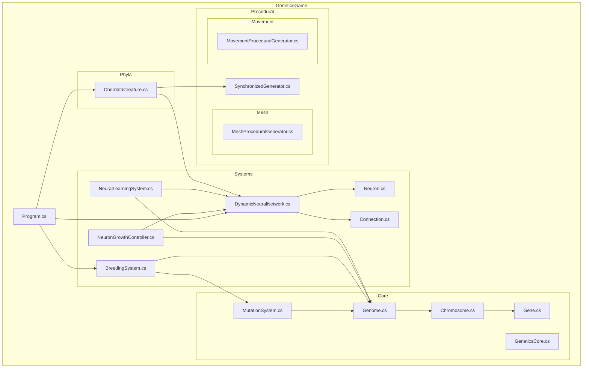
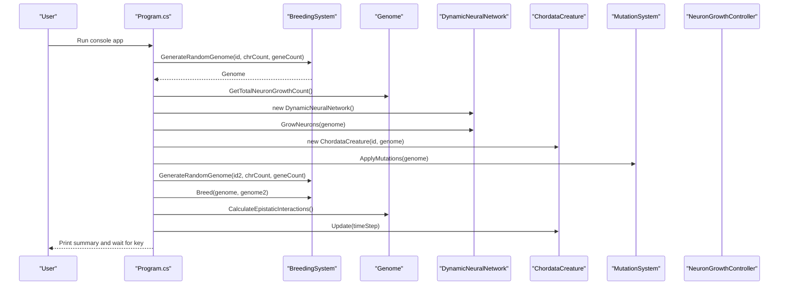
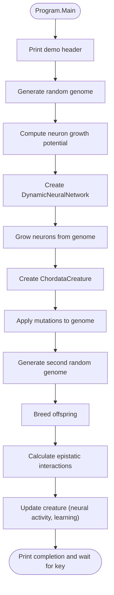
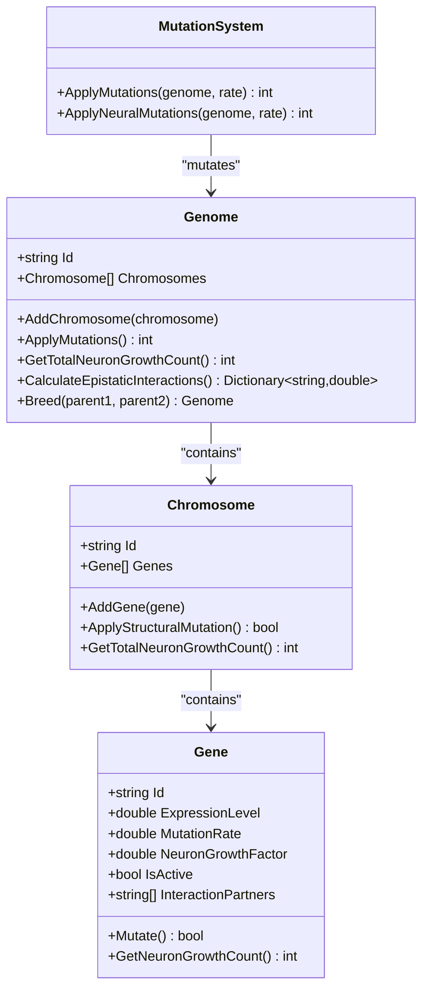
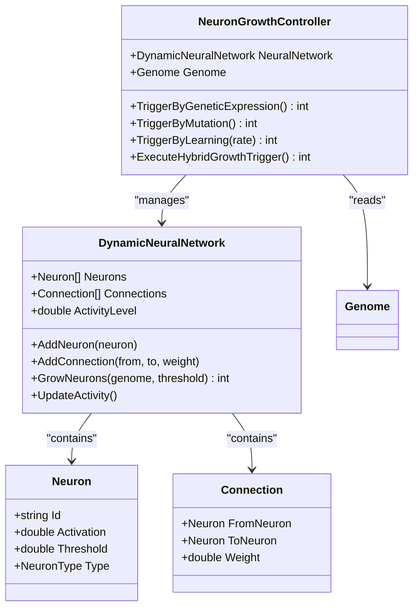
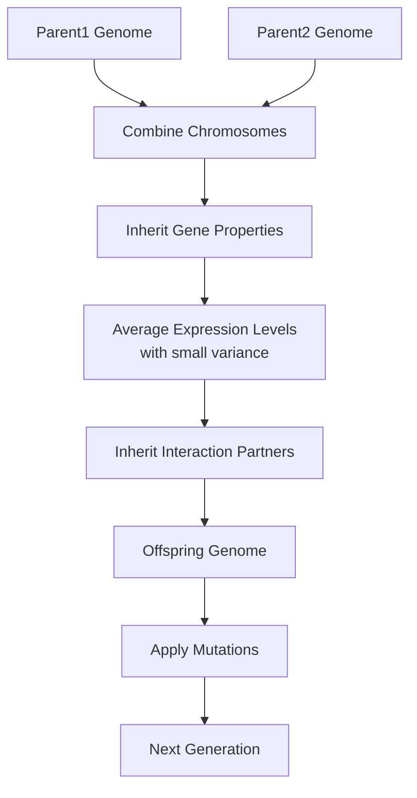
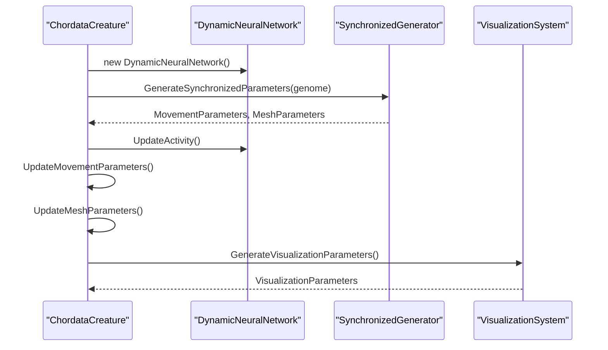
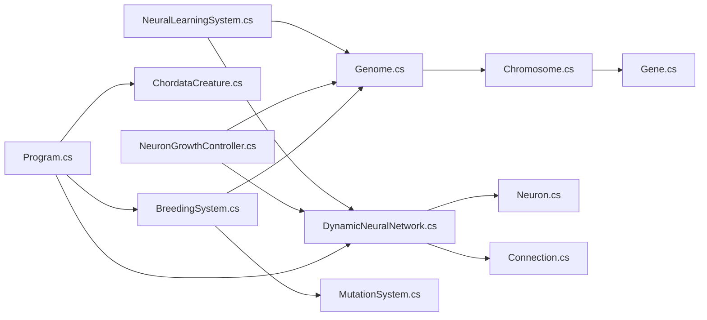

# Getting Started

<cite>
**Referenced Files in This Document**
- [Program.cs](file://GeneticsGame/Program.cs)
- [GeneticsGame.csproj](file://GeneticsGame/GeneticsGame.csproj)
- [GeneticsCore.cs](file://GeneticsGame/Core/GeneticsCore.cs)
- [Genome.cs](file://GeneticsGame/Core/Genome.cs)
- [Chromosome.cs](file://GeneticsGame/Core/Chromosome.cs)
- [Gene.cs](file://GeneticsGame/Core/Gene.cs)
- [MutationSystem.cs](file://GeneticsGame/Core/MutationSystem.cs)
- [BreedingSystem.cs](file://GeneticsGame/Systems/BreedingSystem.cs)
- [DynamicNeuralNetwork.cs](file://GeneticsGame/Systems/DynamicNeuralNetwork.cs)
- [Neuron.cs](file://GeneticsGame/Systems/Neuron.cs)
- [Connection.cs](file://GeneticsGame/Systems/Connection.cs)
- [NeuronGrowthController.cs](file://GeneticsGame/Systems/NeuronGrowthController.cs)
- [NeuralLearningSystem.cs](file://GeneticsGame/Systems/NeuralLearningSystem.cs)
- [ChordataCreature.cs](file://GeneticsGame/Phyla/Chordata/ChordataCreature.cs)
</cite>

## Table of Contents
1. [Introduction](#introduction)
2. [Project Structure](#project-structure)
3. [Core Components](#core-components)
4. [Architecture Overview](#architecture-overview)
5. [Detailed Component Analysis](#detailed-component-analysis)
6. [Dependency Analysis](#dependency-analysis)
7. [Performance Considerations](#performance-considerations)
8. [Troubleshooting Guide](#troubleshooting-guide)
9. [Conclusion](#conclusion)
10. [Appendices](#appendices)

## Introduction
3D Genetics is a genetic simulation system that demonstrates how DNA directly controls neural network development and organism behavior. At its heart, the project models a genome as a multi-chromosome, multi-gene blueprint that influences neural growth, creature morphology, and behavior. The simulation starts from a random genome, grows a neural network based on genetic signals, creates a creature, applies mutations, breeds new generations, and evolves neural complexity over time. The included console demo showcases this pipeline end-to-end, printing key metrics such as neuron counts, activity levels, and epistatic interactions.

This guide helps newcomers install prerequisites, build and run the project, interpret the console output, and explore the genetic simulation concepts. It is designed to be accessible while establishing a solid foundation for deeper exploration.

## Project Structure
The project is organized around a core genetics model (Core), a set of systems (Systems), phyla-specific implementations (Phyla), procedural generation helpers (Procedural), and a console entry point (Program.cs). The solution targets .NET 8 and compiles all C# files under the project directory.

**Diagram sources**
- [Program.cs](file://GeneticsGame/Program.cs)
- [GeneticsCore.cs](file://GeneticsGame/Core/GeneticsCore.cs)
- [Genome.cs](file://GeneticsGame/Core/Genome.cs)
- [Chromosome.cs](file://GeneticsGame/Core/Chromosome.cs)
- [Gene.cs](file://GeneticsGame/Core/Gene.cs)
- [MutationSystem.cs](file://GeneticsGame/Core/MutationSystem.cs)
- [BreedingSystem.cs](file://GeneticsGame/Systems/BreedingSystem.cs)
- [DynamicNeuralNetwork.cs](file://GeneticsGame/Systems/DynamicNeuralNetwork.cs)
- [Neuron.cs](file://GeneticsGame/Systems/Neuron.cs)
- [Connection.cs](file://GeneticsGame/Systems/Connection.cs)
- [NeuronGrowthController.cs](file://GeneticsGame/Systems/NeuronGrowthController.cs)
- [NeuralLearningSystem.cs](file://GeneticsGame/Systems/NeuralLearningSystem.cs)
- [ChordataCreature.cs](file://GeneticsGame/Phyla/Chordata/ChordataCreature.cs)

**Section sources**
- [GeneticsGame.csproj](file://GeneticsGame/GeneticsGame.csproj)
- [Program.cs](file://GeneticsGame/Program.cs)

## Core Components
This section introduces the foundational building blocks of the simulation and how they work together.

- GeneticsCore: Provides global configuration constants for genetic and neural behavior, such as default mutation rate, maximum neuron growth per generation, and neural activity thresholds.
- Genome: Represents the complete genetic blueprint, manages chromosomes, calculates neuron growth potential, computes epistatic interactions, and performs breeding via Mendelian inheritance with multi-gene interactions.
- Chromosome: Groups genes, supports structural mutations (deletion, duplication, inversion, translocation), and aggregates neuron growth potential.
- Gene: Encapsulates expression level, mutation rate, neuron growth factor, activity state, and epistatic interaction partners. It mutates and determines neuron growth contribution.
- MutationSystem: Applies point mutations, structural mutations, epigenetic modifications, and neural-specific mutations to a genome.
- BreedingSystem: Creates offspring via genome inheritance, computes genetic compatibility and diversity, and generates random initial genomes.
- DynamicNeuralNetwork: A growable neural network that adds neurons based on genetic triggers and updates activity levels.
- Neuron and Connection: Basic neural primitives with types and weighted links.
- NeuronGrowthController: Orchestrates neuron growth triggered by genetic expression, mutations, and learning.
- NeuralLearningSystem: Drives learning cycles, builds/prunes synapses, strengthens connections, and triggers growth based on activity.
- ChordataCreature: A vertebrate-like creature that initializes neural and procedural parameters from a genome, updates behavior over time, and exposes visualization parameters.

**Section sources**
- [GeneticsCore.cs](file://GeneticsGame/Core/GeneticsCore.cs)
- [Genome.cs](file://GeneticsGame/Core/Genome.cs)
- [Chromosome.cs](file://GeneticsGame/Core/Chromosome.cs)
- [Gene.cs](file://GeneticsGame/Core/Gene.cs)
- [MutationSystem.cs](file://GeneticsGame/Core/MutationSystem.cs)
- [BreedingSystem.cs](file://GeneticsGame/Systems/BreedingSystem.cs)
- [DynamicNeuralNetwork.cs](file://GeneticsGame/Systems/DynamicNeuralNetwork.cs)
- [Neuron.cs](file://GeneticsGame/Systems/Neuron.cs)
- [Connection.cs](file://GeneticsGame/Systems/Connection.cs)
- [NeuronGrowthController.cs](file://GeneticsGame/Systems/NeuronGrowthController.cs)
- [NeuralLearningSystem.cs](file://GeneticsGame/Systems/NeuralLearningSystem.cs)
- [ChordataCreature.cs](file://GeneticsGame/Phyla/Chordata/ChordataCreature.cs)

## Architecture Overview
The simulation follows a clear pipeline: generate a genome, compute neuron growth potential, grow a neural network, instantiate a creature, apply mutations, breed offspring, analyze epistatic interactions, and evolve behavior. The diagram below maps the Program.cs entry point to the major components invoked during the demo.

**Diagram sources**
- [Program.cs](file://GeneticsGame/Program.cs)
- [BreedingSystem.cs](file://GeneticsGame/Systems/BreedingSystem.cs)
- [Genome.cs](file://GeneticsGame/Core/Genome.cs)
- [DynamicNeuralNetwork.cs](file://GeneticsGame/Systems/DynamicNeuralNetwork.cs)
- [ChordataCreature.cs](file://GeneticsGame/Phyla/Chordata/ChordataCreature.cs)
- [MutationSystem.cs](file://GeneticsGame/Core/MutationSystem.cs)
- [NeuronGrowthController.cs](file://GeneticsGame/Systems/NeuronGrowthController.cs)

## Detailed Component Analysis

### Step-by-Step Execution Flow (Console Demo)
This walkthrough explains what happens when you run the console application, line by line, and what each step reveals about the simulation.

- Program initialization and header: The program prints a header indicating it is demonstrating core genetic and neural systems.
- Random genome creation: A BreedingSystem generates a random genome with a specified number of chromosomes and genes.
- Neuron growth potential: The genome’s total neuron growth potential is computed and printed.
- Neural network instantiation and growth: A DynamicNeuralNetwork is created and grows neurons according to the genome’s growth potential.
- Creature creation: A ChordataCreature is instantiated from the genome; it initializes its own neural network and procedural parameters.
- Mutation application: MutationSystem applies various mutations to the genome and reports how many were applied.
- Breeding: A second random genome is generated and crossed with the first to produce an offspring genome.
- Epistatic interactions: The genome calculates and prints the number of epistatic interactions among genes.
- Simulation update: The creature’s Update method runs one time step, which refreshes neural activity, optionally triggers learning, and adjusts movement/mesh parameters.
- Completion: The program prints a completion message and waits for a key press.

**Diagram sources**
- [Program.cs](file://GeneticsGame/Program.cs)
- [BreedingSystem.cs](file://GeneticsGame/Systems/BreedingSystem.cs)
- [Genome.cs](file://GeneticsGame/Core/Genome.cs)
- [DynamicNeuralNetwork.cs](file://GeneticsGame/Systems/DynamicNeuralNetwork.cs)
- [ChordataCreature.cs](file://GeneticsGame/Phyla/Chordata/ChordataCreature.cs)
- [MutationSystem.cs](file://GeneticsGame/Core/MutationSystem.cs)

**Section sources**
- [Program.cs](file://GeneticsGame/Program.cs)

### Genetic Model: Genome, Chromosome, Gene
The genetic model is hierarchical and expressive. Genomes consist of chromosomes, which contain genes. Genes carry expression levels, mutation rates, neuron growth factors, and interaction partners. Mutations alter gene properties, and epistatic interactions combine gene effects.

**Diagram sources**
- [Genome.cs](file://GeneticsGame/Core/Genome.cs)
- [Chromosome.cs](file://GeneticsGame/Core/Chromosome.cs)
- [Gene.cs](file://GeneticsGame/Core/Gene.cs)
- [MutationSystem.cs](file://GeneticsGame/Core/MutationSystem.cs)

**Section sources**
- [Genome.cs](file://GeneticsGame/Core/Genome.cs)
- [Chromosome.cs](file://GeneticsGame/Core/Chromosome.cs)
- [Gene.cs](file://GeneticsGame/Core/Gene.cs)
- [MutationSystem.cs](file://GeneticsGame/Core/MutationSystem.cs)

### Neural Network: DynamicNeuralNetwork and Growth Control
The neural network is dynamic and grows based on genetic signals and activity thresholds. Neuron types reflect specialized roles influenced by gene expression and epistatic interactions. The NeuronGrowthController orchestrates growth triggers from three sources: genetic expression, mutations, and learning.

**Diagram sources**
- [DynamicNeuralNetwork.cs](file://GeneticsGame/Systems/DynamicNeuralNetwork.cs)
- [Neuron.cs](file://GeneticsGame/Systems/Neuron.cs)
- [Connection.cs](file://GeneticsGame/Systems/Connection.cs)
- [NeuronGrowthController.cs](file://GeneticsGame/Systems/NeuronGrowthController.cs)

**Section sources**
- [DynamicNeuralNetwork.cs](file://GeneticsGame/Systems/DynamicNeuralNetwork.cs)
- [Neuron.cs](file://GeneticsGame/Systems/Neuron.cs)
- [Connection.cs](file://GeneticsGame/Systems/Connection.cs)
- [NeuronGrowthController.cs](file://GeneticsGame/Systems/NeuronGrowthController.cs)

### Breeding and Evolution
Breeding combines inheritance rules with mutation to produce offspring. Compatibility and diversity metrics help assess relatedness and variability. Random genome generation seeds the simulation with varied starting points.

**Diagram sources**
- [BreedingSystem.cs](file://GeneticsGame/Systems/BreedingSystem.cs)
- [Genome.cs](file://GeneticsGame/Core/Genome.cs)
- [MutationSystem.cs](file://GeneticsGame/Core/MutationSystem.cs)

**Section sources**
- [BreedingSystem.cs](file://GeneticsGame/Systems/BreedingSystem.cs)
- [Genome.cs](file://GeneticsGame/Core/Genome.cs)
- [MutationSystem.cs](file://GeneticsGame/Core/MutationSystem.cs)

### Creature Behavior: ChordataCreature
ChordataCreature encapsulates the relationship between genotype and phenotype. It initializes neural and procedural parameters from the genome, updates behavior over time, and exposes visualization parameters.

**Diagram sources**
- [ChordataCreature.cs](file://GeneticsGame/Phyla/Chordata/ChordataCreature.cs)

**Section sources**
- [ChordataCreature.cs](file://GeneticsGame/Phyla/Chordata/ChordataCreature.cs)

## Dependency Analysis
The following diagram highlights key dependencies among core components during the demo execution.

**Diagram sources**
- [Program.cs](file://GeneticsGame/Program.cs)
- [BreedingSystem.cs](file://GeneticsGame/Systems/BreedingSystem.cs)
- [Genome.cs](file://GeneticsGame/Core/Genome.cs)
- [Chromosome.cs](file://GeneticsGame/Core/Chromosome.cs)
- [Gene.cs](file://GeneticsGame/Core/Gene.cs)
- [MutationSystem.cs](file://GeneticsGame/Core/MutationSystem.cs)
- [DynamicNeuralNetwork.cs](file://GeneticsGame/Systems/DynamicNeuralNetwork.cs)
- [Neuron.cs](file://GeneticsGame/Systems/Neuron.cs)
- [Connection.cs](file://GeneticsGame/Systems/Connection.cs)
- [NeuronGrowthController.cs](file://GeneticsGame/Systems/NeuronGrowthController.cs)
- [NeuralLearningSystem.cs](file://GeneticsGame/Systems/NeuralLearningSystem.cs)
- [ChordataCreature.cs](file://GeneticsGame/Phyla/Chordata/ChordataCreature.cs)

**Section sources**
- [Program.cs](file://GeneticsGame/Program.cs)
- [GeneticsGame.csproj](file://GeneticsGame/GeneticsGame.csproj)

## Performance Considerations
- Neural growth is capped per generation to avoid uncontrolled expansion, ensuring stability during evolution.
- Activity thresholds govern when growth occurs, balancing realism with performance.
- Mutation rates are low by default, enabling gradual evolutionary change suitable for console demos.
- Epistatic interaction calculations scale with gene counts; keeping reasonable genome sizes improves responsiveness.

[No sources needed since this section provides general guidance]

## Troubleshooting Guide
- If the console exits immediately, ensure you are running the executable built for net8.0 and that the working directory includes all compiled assemblies.
- If mutation or growth numbers appear zero, verify that the genome has sufficient active genes and neuron growth factors.
- If neural activity remains low, check that the creature’s Update method is called and that learning is occasionally triggered.
- If breeding yields unexpected results, review compatibility and diversity calculations and confirm that both parents contribute genes.

**Section sources**
- [GeneticsCore.cs](file://GeneticsGame/Core/GeneticsCore.cs)
- [Genome.cs](file://GeneticsGame/Core/Genome.cs)
- [MutationSystem.cs](file://GeneticsGame/Core/MutationSystem.cs)
- [DynamicNeuralNetwork.cs](file://GeneticsGame/Systems/DynamicNeuralNetwork.cs)
- [ChordataCreature.cs](file://GeneticsGame/Phyla/Chordata/ChordataCreature.cs)

## Conclusion
You have installed prerequisites, built and run the console demo, traced the execution flow, and explored the genetic and neural components that drive the simulation. The demo illustrates how DNA influences neural growth, creature behavior, and evolutionary outcomes. Use this foundation to experiment with parameters, observe epistatic effects, and dive deeper into the systems that shape the evolving organisms.

[No sources needed since this section summarizes without analyzing specific files]

## Appendices

### Prerequisites
- Understanding of genetics basics: genes, chromosomes, expression, mutations, inheritance.
- Understanding of neural networks: neurons, connections, activity, learning.
- C# programming familiarity: classes, collections, enums, and basic OOP concepts.

[No sources needed since this section provides general guidance]

### Installation and Setup
- Install .NET 8 SDK.
- Open a terminal in the repository root and build the project targeting net8.0.
- Run the console application to see the demo output.

**Section sources**
- [GeneticsGame.csproj](file://GeneticsGame/GeneticsGame.csproj)

### Running the First Demo
- Build the project for net8.0.
- Run the console application.
- Observe printed metrics such as neuron counts, activity levels, epistatic interactions, and creature state after updates.
- Experiment by adjusting configuration constants in the genetic core and re-running to see how they affect growth and behavior.

**Section sources**
- [Program.cs](file://GeneticsGame/Program.cs)
- [GeneticsCore.cs](file://GeneticsGame/Core/GeneticsCore.cs)

### Interpreting Output
- Genome creation: shows chromosome and gene counts.
- Neuron growth potential: indicates how many neurons the genome could potentially grow.
- Neural growth: number of neurons actually added.
- Creature creation: neuron count in the creature’s neural network.
- Mutations: number of mutations applied.
- Breeding: offspring chromosome count.
- Epistatic interactions: number of gene interaction records calculated.
- Post-update: neuron count and activity level after one simulation step.

**Section sources**
- [Program.cs](file://GeneticsGame/Program.cs)
- [Genome.cs](file://GeneticsGame/Core/Genome.cs)
- [DynamicNeuralNetwork.cs](file://GeneticsGame/Systems/DynamicNeuralNetwork.cs)
- [ChordataCreature.cs](file://GeneticsGame/Phyla/Chordata/ChordataCreature.cs)