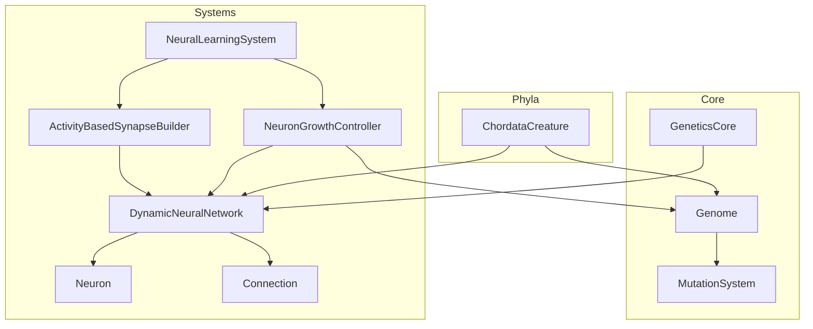
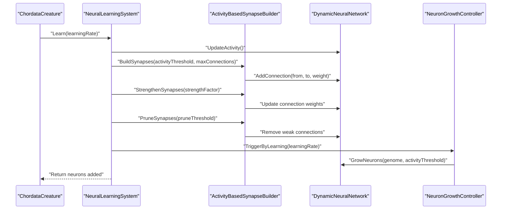
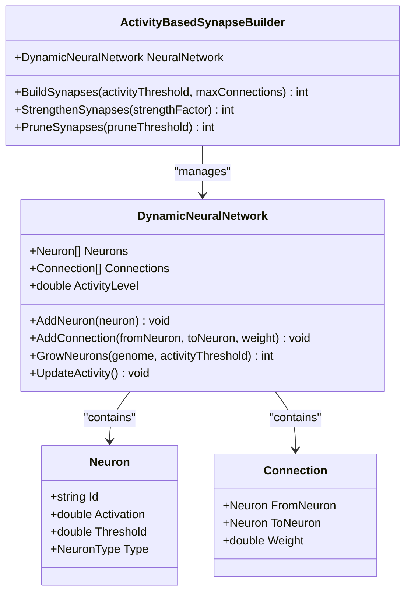
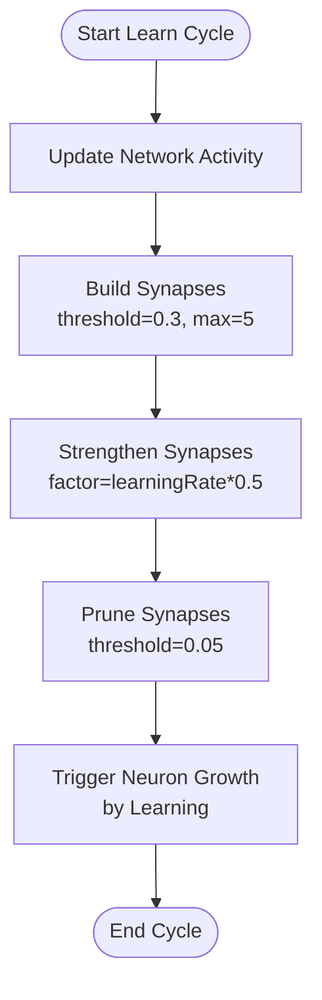
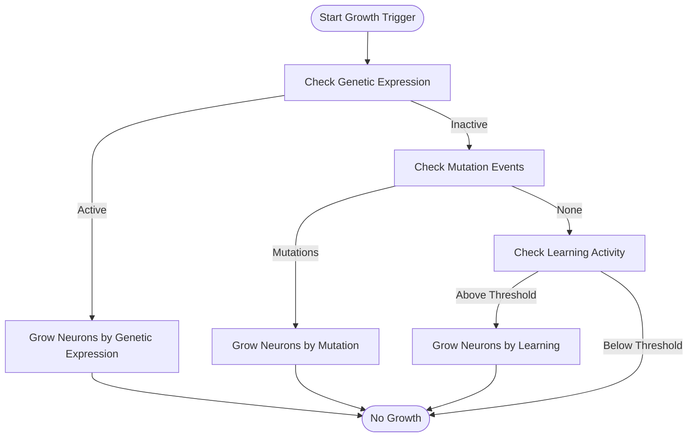
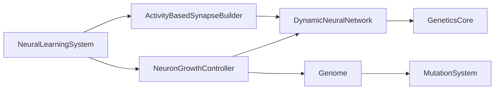

# Activity-Based Synapse Builder

<cite>
**Referenced Files in This Document**
- [ActivityBasedSynapseBuilder.cs](file://GeneticsGame/Systems/ActivityBasedSynapseBuilder.cs)
- [DynamicNeuralNetwork.cs](file://GeneticsGame/Systems/DynamicNeuralNetwork.cs)
- [Neuron.cs](file://GeneticsGame/Systems/Neuron.cs)
- [Connection.cs](file://GeneticsGame/Systems/Connection.cs)
- [NeuralLearningSystem.cs](file://GeneticsGame/Systems/NeuralLearningSystem.cs)
- [NeuronGrowthController.cs](file://GeneticsGame/Systems/NeuronGrowthController.cs)
- [GeneticsCore.cs](file://GeneticsGame/Core/GeneticsCore.cs)
- [Genome.cs](file://GeneticsGame/Core/Genome.cs)
- [MutationSystem.cs](file://GeneticsGame/Core/MutationSystem.cs)
- [ChordataCreature.cs](file://GeneticsGame/Phyla/Chordata/ChordataCreature.cs)
- [Program.cs](file://GeneticsGame/Program.cs)
</cite>

## Table of Contents
1. [Introduction](#introduction)
2. [Project Structure](#project-structure)
3. [Core Components](#core-components)
4. [Architecture Overview](#architecture-overview)
5. [Detailed Component Analysis](#detailed-component-analysis)
6. [Dependency Analysis](#dependency-analysis)
7. [Performance Considerations](#performance-considerations)
8. [Troubleshooting Guide](#troubleshooting-guide)
9. [Conclusion](#conclusion)

## Introduction
This document explains the ActivityBasedSynapseBuilder, a core component responsible for creating neural connections based on activity patterns and genetic instructions. It demonstrates how neural activity drives synaptogenesis and connection formation, documents the algorithms that identify active neural pathways, and establishes new synaptic connections. The document also covers the relationship between neural firing patterns, genetic factors, and connection strengthening mechanisms, and illustrates how activity-dependent plasticity shapes neural circuitry and influences behavioral adaptations. Finally, it addresses the builder's role in learning, memory formation, and neural network optimization.

## Project Structure
The ActivityBasedSynapseBuilder resides within the Systems folder and collaborates with several other components:
- DynamicNeuralNetwork: central container for neurons and connections
- Neuron and Connection: fundamental building blocks of the neural network
- NeuralLearningSystem: orchestrates learning cycles that invoke the builder
- NeuronGrowthController: manages neuron growth triggered by genetics, mutations, and learning
- GeneticsCore: global configuration constants
- Genome and MutationSystem: genetic blueprint and mutation engine
- ChordataCreature: top-level creature integrating neural and genetic systems

**Diagram sources**
- [ActivityBasedSynapseBuilder.cs:1-112](file://GeneticsGame/Systems/ActivityBasedSynapseBuilder.cs#L1-L112)
- [DynamicNeuralNetwork.cs:1-116](file://GeneticsGame/Systems/DynamicNeuralNetwork.cs#L1-L116)
- [Neuron.cs:1-70](file://GeneticsGame/Systems/Neuron.cs#L1-L70)
- [Connection.cs:1-35](file://GeneticsGame/Systems/Connection.cs#L1-L35)
- [NeuralLearningSystem.cs:1-122](file://GeneticsGame/Systems/NeuralLearningSystem.cs#L1-L122)
- [NeuronGrowthController.cs:1-122](file://GeneticsGame/Systems/NeuronGrowthController.cs#L1-L122)
- [GeneticsCore.cs:1-21](file://GeneticsGame/Core/GeneticsCore.cs#L1-L21)
- [Genome.cs:1-190](file://GeneticsGame/Core/Genome.cs#L1-L190)
- [MutationSystem.cs:1-137](file://GeneticsGame/Core/MutationSystem.cs#L1-L137)
- [ChordataCreature.cs:1-133](file://GeneticsGame/Phyla/Chordata/ChordataCreature.cs#L1-L133)

**Section sources**
- [ActivityBasedSynapseBuilder.cs:1-112](file://GeneticsGame/Systems/ActivityBasedSynapseBuilder.cs#L1-L112)
- [DynamicNeuralNetwork.cs:1-116](file://GeneticsGame/Systems/DynamicNeuralNetwork.cs#L1-L116)
- [NeuralLearningSystem.cs:1-122](file://GeneticsGame/Systems/NeuralLearningSystem.cs#L1-L122)
- [NeuronGrowthController.cs:1-122](file://GeneticsGame/Systems/NeuronGrowthController.cs#L1-L122)
- [GeneticsCore.cs:1-21](file://GeneticsGame/Core/GeneticsCore.cs#L1-L21)
- [Genome.cs:1-190](file://GeneticsGame/Core/Genome.cs#L1-L190)
- [MutationSystem.cs:1-137](file://GeneticsGame/Core/MutationSystem.cs#L1-L137)
- [ChordataCreature.cs:1-133](file://GeneticsGame/Phyla/Chordata/ChordataCreature.cs#L1-L133)

## Core Components
- ActivityBasedSynapseBuilder: Creates new synapses based on neural activity, strengthens existing connections, and prunes weak ones. Implements Hebbian learning principles ("neurons that fire together, wire together").
- DynamicNeuralNetwork: Maintains lists of neurons and connections, computes activity levels, and grows neurons based on genetic triggers.
- Neuron: Represents individual units with activation, threshold, and type.
- Connection: Represents synapses with directional links and weights.
- NeuralLearningSystem: Coordinates learning cycles, invoking the builder to build, strengthen, and prune synapses while managing neuron growth.
- NeuronGrowthController: Triggers neuron growth via genetic expression, mutations, and learning feedback.
- GeneticsCore: Provides global configuration constants for growth limits and activity thresholds.
- Genome and MutationSystem: Define genetic blueprints and apply mutations that influence neuron growth and connectivity.

**Section sources**
- [ActivityBasedSynapseBuilder.cs:1-112](file://GeneticsGame/Systems/ActivityBasedSynapseBuilder.cs#L1-L112)
- [DynamicNeuralNetwork.cs:1-116](file://GeneticsGame/Systems/DynamicNeuralNetwork.cs#L1-L116)
- [Neuron.cs:1-70](file://GeneticsGame/Systems/Neuron.cs#L1-L70)
- [Connection.cs:1-35](file://GeneticsGame/Systems/Connection.cs#L1-L35)
- [NeuralLearningSystem.cs:1-122](file://GeneticsGame/Systems/NeuralLearningSystem.cs#L1-L122)
- [NeuronGrowthController.cs:1-122](file://GeneticsGame/Systems/NeuronGrowthController.cs#L1-L122)
- [GeneticsCore.cs:1-21](file://GeneticsGame/Core/GeneticsCore.cs#L1-L21)
- [Genome.cs:1-190](file://GeneticsGame/Core/Genome.cs#L1-L190)
- [MutationSystem.cs:1-137](file://GeneticsGame/Core/MutationSystem.cs#L1-L137)

## Architecture Overview
The ActivityBasedSynapseBuilder operates within a closed-loop learning system:
- NeuralLearningSystem updates network activity and orchestrates builder operations.
- ActivityBasedSynapseBuilder identifies active neurons and forms new connections based on activation correlation.
- Existing connections are strengthened according to the product of pre- and post-synaptic activations.
- Weak connections are pruned to optimize network efficiency.
- NeuronGrowthController adds new neurons when genetic or learning conditions are met, expanding the network capacity.

**Diagram sources**
- [NeuralLearningSystem.cs:37-57](file://GeneticsGame/Systems/NeuralLearningSystem.cs#L37-L57)
- [ActivityBasedSynapseBuilder.cs:31-111](file://GeneticsGame/Systems/ActivityBasedSynapseBuilder.cs#L31-L111)
- [DynamicNeuralNetwork.cs:104-115](file://GeneticsGame/Systems/DynamicNeuralNetwork.cs#L104-L115)
- [NeuronGrowthController.cs:88-101](file://GeneticsGame/Systems/NeuronGrowthController.cs#L88-L101)

## Detailed Component Analysis

### ActivityBasedSynapseBuilder
Implements activity-dependent synaptogenesis and synaptic plasticity:
- BuildSynapses: Selects active neurons above a threshold, computes connection weights based on mean activation, avoids duplicates, and caps new connections.
- StrengthenSynapses: Increases connection weights proportionally to the product of pre- and post-synaptic activations.
- PruneSynapses: Removes connections below a weight threshold to reduce noise and maintain efficiency.

**Diagram sources**
- [ActivityBasedSynapseBuilder.cs:9-112](file://GeneticsGame/Systems/ActivityBasedSynapseBuilder.cs#L9-L112)
- [DynamicNeuralNetwork.cs:9-116](file://GeneticsGame/Systems/DynamicNeuralNetwork.cs#L9-L116)
- [Neuron.cs:7-70](file://GeneticsGame/Systems/Neuron.cs#L7-L70)
- [Connection.cs:6-35](file://GeneticsGame/Systems/Connection.cs#L6-L35)

Key algorithms and behaviors:
- Active neuron detection: Filters neurons whose activation exceeds a configurable threshold.
- Connection weight computation: Uses the mean activation of connected pairs to estimate initial strength.
- Duplicate prevention: Checks existing connections before adding new ones.
- Hebbian strengthening: Increments weights proportional to the product of pre- and post-synaptic activations.
- Pruning: Removes low-weight connections to maintain network efficiency.

Complexity considerations:
- BuildSynapses: O(A^2) where A is the number of active neurons; capped by maxConnections.
- StrengthenSynapses: O(C) where C is the number of connections.
- PruneSynapses: O(C) with removal cost depending on implementation specifics.

**Section sources**
- [ActivityBasedSynapseBuilder.cs:31-111](file://GeneticsGame/Systems/ActivityBasedSynapseBuilder.cs#L31-L111)

### DynamicNeuralNetwork
Maintains the neural network state and growth:
- Stores neurons and connections, tracks activity level, and exposes methods to add neurons and connections.
- GrowNeurons: Adds new neurons when activity exceeds a threshold, influenced by genetic growth potential and configured limits.
- UpdateActivity: Computes average neuron activation to drive learning and growth triggers.

Integration with genetics:
- Uses genome-derived growth potential and epistatic interactions to determine neuron types and growth dynamics.

**Section sources**
- [DynamicNeuralNetwork.cs:36-99](file://GeneticsGame/Systems/DynamicNeuralNetwork.cs#L36-L99)
- [GeneticsCore.cs:14-19](file://GeneticsGame/Core/GeneticsCore.cs#L14-L19)
- [Genome.cs:72-107](file://GeneticsGame/Core/Genome.cs#L72-L107)

### NeuralLearningSystem
Coordinates learning cycles:
- Learn: Updates activity, builds new synapses, strengthens existing ones, prunes weak connections, and triggers neuron growth based on learning feedback.
- AdaptToEnvironment: Scores adaptation based on neural neuron counts aligned with environmental and task requirements, modulated by genetic constraints.
- LearnOverTime: Runs multiple cycles with decaying learning rates.

**Diagram sources**
- [NeuralLearningSystem.cs:37-57](file://GeneticsGame/Systems/NeuralLearningSystem.cs#L37-L57)

**Section sources**
- [NeuralLearningSystem.cs:37-122](file://GeneticsGame/Systems/NeuralLearningSystem.cs#L37-L122)

### NeuronGrowthController
Manages neuron growth via multiple triggers:
- TriggerByGeneticExpression: Grows neurons based on active genes with high neuron growth factors and expression levels.
- TriggerByMutation: Applies neural-specific mutations and triggers growth when mutations occur.
- TriggerByLearning: Grows neurons when network activity exceeds a threshold, scaling with activity level.
- ExecuteHybridGrowthTrigger: Executes triggers in priority order (genetic > mutation > learning).

**Diagram sources**
- [NeuronGrowthController.cs:36-101](file://GeneticsGame/Systems/NeuronGrowthController.cs#L36-L101)

**Section sources**
- [NeuronGrowthController.cs:36-122](file://GeneticsGame/Systems/NeuronGrowthController.cs#L36-L122)

### Relationship Between Neural Firing Patterns, Genetic Factors, and Connection Strengthening
- Neural firing patterns: Activity levels drive synaptogenesis and synaptic plasticity. Active neurons are more likely to form connections, and connection weights strengthen when pre- and post-synaptic neurons co-fire.
- Genetic factors: Genes encode neuron growth potential and neuron types. Epistatic interactions influence growth triggers and neuron specialization. Mutations can alter neuron growth factors and expression levels, affecting network development.
- Connection strengthening mechanisms: Hebbian learning is implemented by increasing connection weights proportional to the product of pre- and post-synaptic activations, reinforcing activity-dependent pathways.

Examples of activity-dependent plasticity shaping neural circuitry:
- Learning cycles increase the number of connections between active neurons, forming functional pathways.
- Strengthening amplifies the impact of frequently co-active neurons, enhancing signal transmission along preferred routes.
- Pruning removes weak connections, reducing noise and optimizing network efficiency.

Role in learning, memory formation, and neural network optimization:
- Learning: Repeated activation of specific pathways reinforces connections, enabling skill acquisition and behavioral adaptations.
- Memory formation: Persistent strengthening of activity-dependent connections contributes to long-term memory traces.
- Optimization: Pruning eliminates unused or redundant connections, maintaining efficient and adaptive neural circuits.

**Section sources**
- [ActivityBasedSynapseBuilder.cs:75-88](file://GeneticsGame/Systems/ActivityBasedSynapseBuilder.cs#L75-L88)
- [Genome.cs:78-107](file://GeneticsGame/Core/Genome.cs#L78-L107)
- [MutationSystem.cs:111-136](file://GeneticsGame/Core/MutationSystem.cs#L111-L136)

## Dependency Analysis
The ActivityBasedSynapseBuilder depends on DynamicNeuralNetwork for neuron and connection management. NeuralLearningSystem orchestrates builder operations within learning cycles. NeuronGrowthController complements the builder by expanding network capacity when growth conditions are met. GeneticsCore provides configuration constants that influence growth thresholds and limits. Genome and MutationSystem define the genetic basis for neuron growth and connectivity.

**Diagram sources**
- [ActivityBasedSynapseBuilder.cs:14](file://GeneticsGame/Systems/ActivityBasedSynapseBuilder.cs#L14)
- [DynamicNeuralNetwork.cs:14-19](file://GeneticsGame/Systems/DynamicNeuralNetwork.cs#L14-L19)
- [NeuralLearningSystem.cs:14-29](file://GeneticsGame/Systems/NeuralLearningSystem.cs#L14-L29)
- [NeuronGrowthController.cs:14-29](file://GeneticsGame/Systems/NeuronGrowthController.cs#L14-L29)
- [GeneticsCore.cs:14-19](file://GeneticsGame/Core/GeneticsCore.cs#L14-L19)
- [Genome.cs:19](file://GeneticsGame/Core/Genome.cs#L19)
- [MutationSystem.cs:17-29](file://GeneticsGame/Core/MutationSystem.cs#L17-L29)

**Section sources**
- [ActivityBasedSynapseBuilder.cs:14](file://GeneticsGame/Systems/ActivityBasedSynapseBuilder.cs#L14)
- [DynamicNeuralNetwork.cs:14-19](file://GeneticsGame/Systems/DynamicNeuralNetwork.cs#L14-L19)
- [NeuralLearningSystem.cs:14-29](file://GeneticsGame/Systems/NeuralLearningSystem.cs#L14-L29)
- [NeuronGrowthController.cs:14-29](file://GeneticsGame/Systems/NeuronGrowthController.cs#L14-L29)
- [GeneticsCore.cs:14-19](file://GeneticsGame/Core/GeneticsCore.cs#L14-L19)
- [Genome.cs:19](file://GeneticsGame/Core/Genome.cs#L19)
- [MutationSystem.cs:17-29](file://GeneticsGame/Core/MutationSystem.cs#L17-L29)

## Performance Considerations
- Complexity: BuildSynapses scales quadratically with the number of active neurons. Use appropriate activity thresholds and maxConnections to limit computational cost.
- Iteration costs: StrengthenSynapses and PruneSynapses iterate over all connections; ensure pruning is performed periodically to keep connection counts manageable.
- Growth limits: GeneticsCore.Config.MaxNeuronGrowthPerGeneration prevents unbounded growth, protecting performance during learning and mutation-driven expansion.
- Practical tips:
  - Monitor ActivityLevel to adjust thresholds dynamically.
  - Batch prune operations to minimize repeated iteration overhead.
  - Consider caching active neuron sets when activity patterns are stable.

[No sources needed since this section provides general guidance]

## Troubleshooting Guide
Common issues and resolutions:
- No connections formed:
  - Verify activityThreshold is appropriate for current network state.
  - Ensure there are at least two active neurons.
  - Confirm maxConnections is sufficiently large.
- Weights not increasing:
  - Check that pre- and post-synaptic activations are consistently above zero.
  - Validate strengthFactor magnitude.
- Excessive growth:
  - Review GeneticsCore.Config.MaxNeuronGrowthPerGeneration and growth triggers.
  - Consider lowering learningRate or activity thresholds in growth triggers.
- Pruning removing desired connections:
  - Increase pruneThreshold to preserve stronger pathways.
  - Evaluate whether pruning frequency is too aggressive.

**Section sources**
- [ActivityBasedSynapseBuilder.cs:31-111](file://GeneticsGame/Systems/ActivityBasedSynapseBuilder.cs#L31-L111)
- [DynamicNeuralNetwork.cs:63-99](file://GeneticsGame/Systems/DynamicNeuralNetwork.cs#L63-L99)
- [GeneticsCore.cs:14-19](file://GeneticsGame/Core/GeneticsCore.cs#L14-L19)

## Conclusion
The ActivityBasedSynapseBuilder is a cornerstone of the learning and adaptation system, implementing activity-dependent synaptogenesis and synaptic plasticity. By identifying active neural pathways, forming new connections, strengthening co-active circuits, and pruning weak synapses, it enables neural networks to optimize themselves based on experience. Combined with genetic regulation and learning-driven growth, it supports the emergence of specialized neural circuits that underpin learning, memory, and behavioral adaptations.