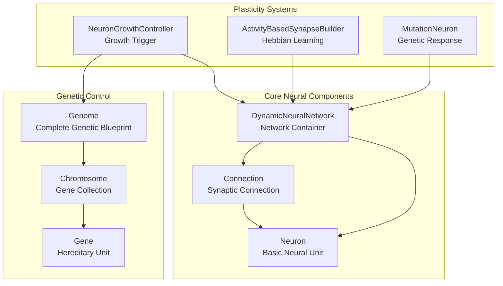
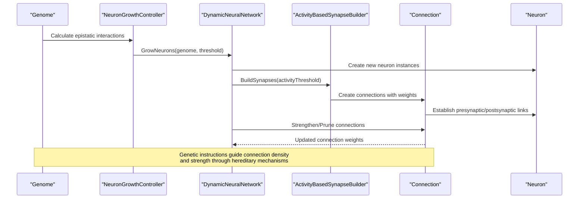
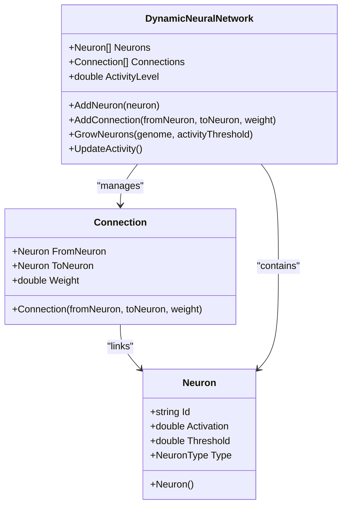
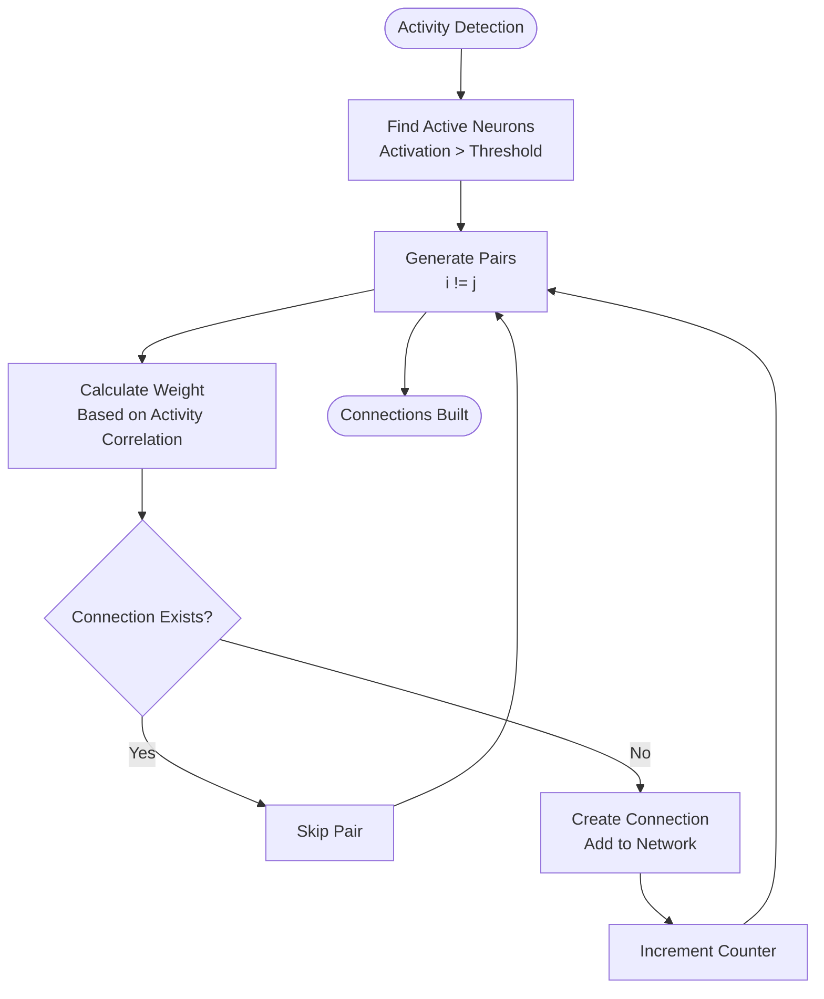
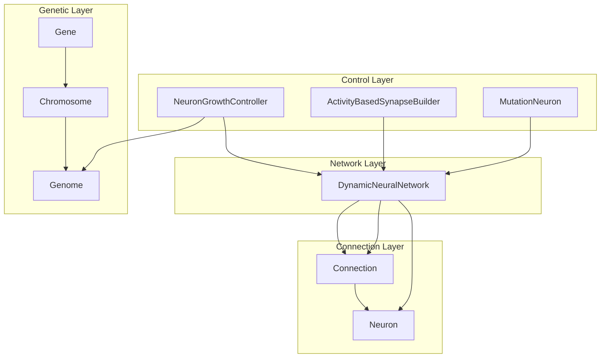

# Connection Management

<cite>
**Referenced Files in This Document**
- [Connection.cs](file://GeneticsGame/Systems/Connection.cs)
- [Neuron.cs](file://GeneticsGame/Systems/Neuron.cs)
- [DynamicNeuralNetwork.cs](file://GeneticsGame/Systems/DynamicNeuralNetwork.cs)
- [ActivityBasedSynapseBuilder.cs](file://GeneticsGame/Systems/ActivityBasedSynapseBuilder.cs)
- [NeuronGrowthController.cs](file://GeneticsGame/Systems/NeuronGrowthController.cs)
- [MutationNeuron.cs](file://GeneticsGame/Systems/MutationNeuron.cs)
- [Genome.cs](file://GeneticsGame/Core/Genome.cs)
- [Gene.cs](file://GeneticsGame/Core/Gene.cs)
- [Chromosome.cs](file://GeneticsGame/Core/Chromosome.cs)
- [ChordataNeuronGrowth.cs](file://GeneticsGame/Phyla/Chordata/ChordataNeuronGrowth.cs)
- [ChordataGenome.cs](file://GeneticsGame/Phyla/Chordata/ChordataGenome.cs)
- [GeneticsCore.cs](file://GeneticsGame/Core/GeneticsCore.cs)
- [MutationSystem.cs](file://GeneticsGame/Core/MutationSystem.cs)
</cite>

## Table of Contents
1. [Introduction](#introduction)
2. [Project Structure](#project-structure)
3. [Core Components](#core-components)
4. [Architecture Overview](#architecture-overview)
5. [Detailed Component Analysis](#detailed-component-analysis)
6. [Dependency Analysis](#dependency-analysis)
7. [Performance Considerations](#performance-considerations)
8. [Troubleshooting Guide](#troubleshooting-guide)
9. [Conclusion](#conclusion)

## Introduction
This document provides comprehensive technical documentation for the Connection class that manages synaptic connections between neurons in the 3D Genetics Game. The Connection class serves as the fundamental building block for neural network architecture, representing physical and functional pathways between neurons. It integrates tightly with genetic systems that influence connection formation, weight distribution, and neural pathway development through hereditary mechanisms.

The connection management system operates on multiple levels: basic synaptic connectivity, genetic regulation of connection density and strength, activity-dependent plasticity, and phyla-specific neural development patterns. This documentation explains how genetic factors influence connection properties, how connections integrate with broader neural network architecture, and how they contribute to neural signal transmission and circuit formation.

## Project Structure
The connection management system is organized within the Systems namespace alongside core neural components and genetic systems. The architecture follows a layered approach where Connection objects form the foundation of neural networks, while genetic systems provide regulatory control over connection formation and modification.

**Diagram sources**
- [Connection.cs:1-35](file://GeneticsGame/Systems/Connection.cs#L1-L35)
- [Neuron.cs:1-70](file://GeneticsGame/Systems/Neuron.cs#L1-L70)
- [DynamicNeuralNetwork.cs:1-116](file://GeneticsGame/Systems/DynamicNeuralNetwork.cs#L1-L116)
- [Genome.cs:1-190](file://GeneticsGame/Core/Genome.cs#L1-L190)

**Section sources**
- [Connection.cs:1-35](file://GeneticsGame/Systems/Connection.cs#L1-L35)
- [DynamicNeuralNetwork.cs:1-116](file://GeneticsGame/Systems/DynamicNeuralNetwork.cs#L1-L116)

## Core Components
The connection management system consists of several interconnected components that work together to establish, regulate, and modify neural connections throughout the organism's development and lifetime.

### Connection Class Properties
The Connection class maintains three fundamental properties that define synaptic connectivity:

- **FromNeuron**: Reference to the presynaptic neuron that initiates signal transmission
- **ToNeuron**: Reference to the postsynaptic neuron that receives signals
- **Weight**: Double precision value representing connection strength (0.0 to 1.0)

These properties enable precise control over signal transmission strength and facilitate activity-dependent plasticity mechanisms.

### Neural Network Integration
The DynamicNeuralNetwork class serves as the central container for all neural components, maintaining lists of neurons and connections while providing methods for network manipulation and growth control.

**Section sources**
- [Connection.cs:6-35](file://GeneticsGame/Systems/Connection.cs#L6-L35)
- [DynamicNeuralNetwork.cs:9-35](file://GeneticsGame/Systems/DynamicNeuralNetwork.cs#L9-L35)

## Architecture Overview
The connection management architecture implements a multi-layered system where genetic factors influence connection formation, while activity-dependent mechanisms refine and optimize neural pathways.

**Diagram sources**
- [NeuronGrowthController.cs:36-63](file://GeneticsGame/Systems/NeuronGrowthController.cs#L36-L63)
- [ActivityBasedSynapseBuilder.cs:31-68](file://GeneticsGame/Systems/ActivityBasedSynapseBuilder.cs#L31-L68)
- [DynamicNeuralNetwork.cs:63-99](file://GeneticsGame/Systems/DynamicNeuralNetwork.cs#L63-L99)

The architecture demonstrates how genetic information flows through multiple stages: genomic encoding, growth control, connection building, and activity-dependent refinement. This hierarchical approach ensures that connections develop according to both inherited genetic blueprints and environmental activity patterns.

## Detailed Component Analysis

### Connection Class Implementation
The Connection class provides a minimal yet powerful representation of synaptic connectivity with clear property definitions and constructor initialization.

**Diagram sources**
- [Connection.cs:6-35](file://GeneticsGame/Systems/Connection.cs#L6-L35)
- [Neuron.cs:7-39](file://GeneticsGame/Systems/Neuron.cs#L7-L39)
- [DynamicNeuralNetwork.cs:9-35](file://GeneticsGame/Systems/DynamicNeuralNetwork.cs#L9-L35)

The Connection class implements a straightforward property-based design that enables efficient memory usage and clear semantic meaning. The constructor accepts explicit parameters for source neuron, target neuron, and initial weight, allowing precise control over connection establishment during network development.

**Section sources**
- [Connection.cs:6-35](file://GeneticsGame/Systems/Connection.cs#L6-L35)

### Genetic Influence on Connection Formation
Genetic factors profoundly influence connection density, strength, and pattern formation through multiple mechanisms:

#### Gene Expression and Neuron Growth Factors
Genes carry neuron growth factors that directly influence connection density. The Gene class calculates growth potential based on expression level and growth factor, determining how many neurons will be added to the network.

#### Epistatic Interactions
The Genome class calculates epistatic interactions between genes, where the combined effect of multiple genes exceeds simple additive effects. These interactions influence neuron type determination and connection formation patterns.

#### Chromosome-Level Regulation
Chromosomes aggregate genes with similar functions, creating coordinated regulation of neural development. The Chromosome class provides structural mutation support that can alter connection patterns through gene duplication, deletion, or rearrangement.

**Section sources**
- [Gene.cs:8-93](file://GeneticsGame/Core/Gene.cs#L8-L93)
- [Genome.cs:78-107](file://GeneticsGame/Core/Genome.cs#L78-L107)
- [Chromosome.cs:9-146](file://GeneticsGame/Core/Chromosome.cs#L9-L146)

### Activity-Based Synapse Building
The ActivityBasedSynapseBuilder implements Hebbian learning principles, where neural activity drives connection formation and strengthening.

**Diagram sources**
- [ActivityBasedSynapseBuilder.cs:31-68](file://GeneticsGame/Systems/ActivityBasedSynapseBuilder.cs#L31-L68)

The builder creates connections between neurons whose activation levels exceed a configurable threshold, with connection weights proportional to the average activation of connected neurons. This mechanism ensures that functionally relevant neural circuits are strengthened while irrelevant connections remain weak.

**Section sources**
- [ActivityBasedSynapseBuilder.cs:9-112](file://GeneticsGame/Systems/ActivityBasedSynapseBuilder.cs#L9-L112)

### Neuron Growth and Connection Integration
The NeuronGrowthController coordinates multiple growth triggers that influence connection density and pattern formation:

#### Genetic Expression Trigger
High-expression genes with significant neuron growth factors initiate neuron production, increasing overall network capacity and potential connection density.

#### Mutation-Based Trigger
Mutations affecting neural development genes can rapidly alter connection patterns, introducing novel circuit configurations and plasticity mechanisms.

#### Learning-Dependent Trigger
Activity-dependent growth allows neural networks to expand and rewire based on functional demands, optimizing connection patterns for current behavioral needs.

**Section sources**
- [NeuronGrowthController.cs:9-122](file://GeneticsGame/Systems/NeuronGrowthController.cs#L9-L122)

### Phyla-Specific Neural Development
Different phyla exhibit distinct neural development patterns reflected in specialized growth controllers:

#### Chordata Neural Growth
ChordataNeuronGrowth implements vertebrate-specific neural development patterns, where traits like brain size, spine length, and sensory acuity directly influence neuron type distribution and connection density.

#### Trait-Driven Connection Patterns
Specialized neural types (visual, movement, learning) receive targeted connection strengthening based on organism-specific traits, creating functionally optimized neural circuits.

**Section sources**
- [ChordataNeuronGrowth.cs:9-216](file://GeneticsGame/Phyla/Chordata/ChordataNeuronGrowth.cs#L9-L216)

## Dependency Analysis
The connection management system exhibits well-defined dependencies that support modularity and maintainability:

**Diagram sources**
- [Connection.cs:6-35](file://GeneticsGame/Systems/Connection.cs#L6-L35)
- [DynamicNeuralNetwork.cs:9-35](file://GeneticsGame/Systems/DynamicNeuralNetwork.cs#L9-L35)
- [Genome.cs:9-39](file://GeneticsGame/Core/Genome.cs#L9-L39)

The dependency structure shows clear separation of concerns: Connection objects depend only on Neuron references, while higher-level systems coordinate growth, mutation, and activity-dependent plasticity. This design enables independent testing and modification of individual components.

**Section sources**
- [DynamicNeuralNetwork.cs:1-116](file://GeneticsGame/Systems/DynamicNeuralNetwork.cs#L1-L116)
- [Genome.cs:1-190](file://GeneticsGame/Core/Genome.cs#L1-L190)

## Performance Considerations
The connection management system incorporates several performance optimizations:

### Memory Efficiency
Connection objects use reference-based neuron storage rather than copying neuron data, reducing memory overhead in large networks. Each connection maintains only essential pointers and weight values.

### Activity Threshold Optimization
The ActivityBasedSynapseBuilder uses threshold-based filtering to limit unnecessary pairwise comparisons, scaling efficiently with network size. The maximum connections parameter prevents uncontrolled growth during activity-dependent synaptogenesis.

### Genetic Calculation Caching
Epistatic interaction calculations are performed once per growth cycle and cached for subsequent neuron type determinations, avoiding redundant computations during connection formation.

### Parallel Growth Opportunities
The modular design allows for parallel processing of different growth triggers, enabling multi-threaded execution on modern hardware architectures.

## Troubleshooting Guide

### Common Connection Issues
- **Missing Connections**: Verify that both source and target neurons exist in the network before attempting connection creation
- **Zero Weight Connections**: Check that activity levels exceed the configured threshold for activity-dependent connection building
- **Circular Dependencies**: Monitor for recursive growth patterns that could lead to infinite neuron proliferation

### Genetic Influence Problems
- **Insufficient Connection Density**: Review gene expression levels and neuron growth factors in relevant genetic loci
- **Abnormal Connection Strength**: Examine epistatic interaction patterns that may amplify or suppress connection weights
- **Developmental Delays**: Verify that growth thresholds and mutation rates are properly configured for the target organism type

### Activity-Based Plasticity Issues
- **Poor Circuit Strengthening**: Ensure sufficient neural activity levels exceed the configured thresholds for connection strengthening
- **Excessive Pruning**: Adjust pruning thresholds to prevent removal of functionally important connections
- **Stagnant Network Development**: Verify that learning triggers are properly configured and responding to network activity levels

**Section sources**
- [ActivityBasedSynapseBuilder.cs:95-112](file://GeneticsGame/Systems/ActivityBasedSynapseBuilder.cs#L95-L112)
- [NeuronGrowthController.cs:65-101](file://GeneticsGame/Systems/NeuronGrowthController.cs#L65-L101)

## Conclusion
The Connection class and associated systems provide a robust foundation for managing synaptic connections in genetically-influenced neural networks. Through the integration of genetic regulation, activity-dependent plasticity, and phyla-specific development patterns, the system enables the formation of functionally optimized neural circuits that adapt to both inherited genetic blueprints and environmental demands.

The modular architecture supports extensible development while maintaining clear interfaces between genetic control mechanisms, network management systems, and activity-dependent plasticity processes. This design enables sophisticated neural network behavior while preserving computational efficiency and biological realism.

Future enhancements could include more sophisticated weight update mechanisms, additional genetic regulatory layers, and expanded phyla-specific growth patterns to further refine the connection management capabilities.