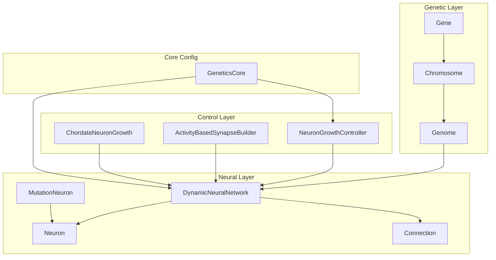
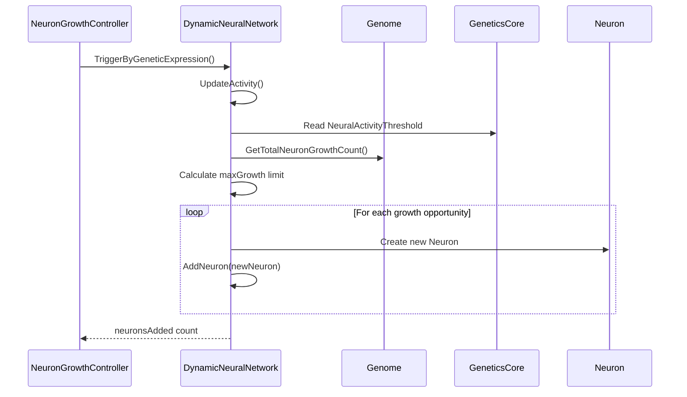
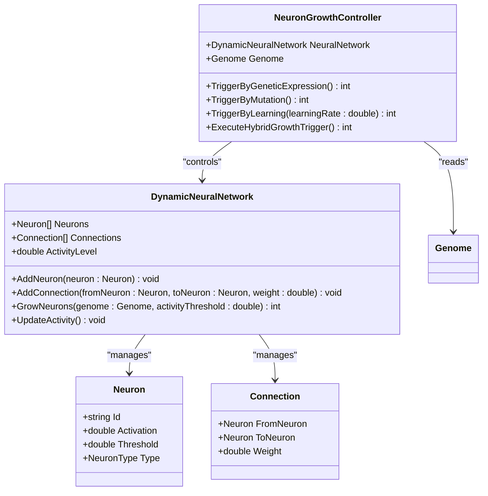
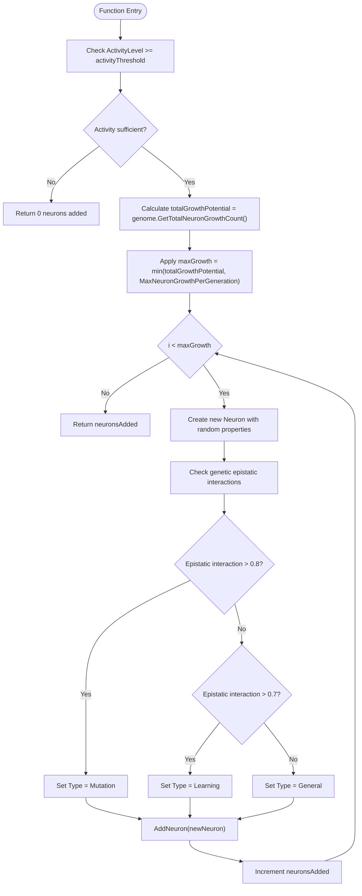
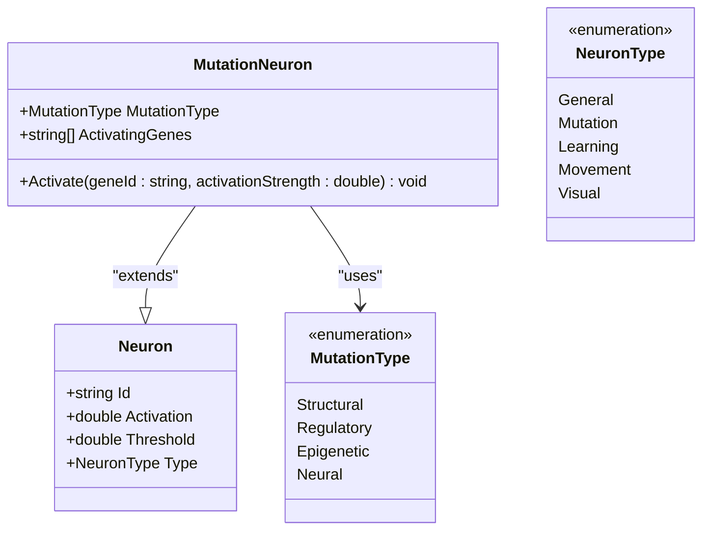
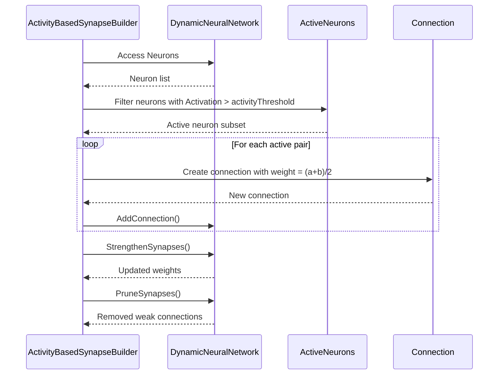
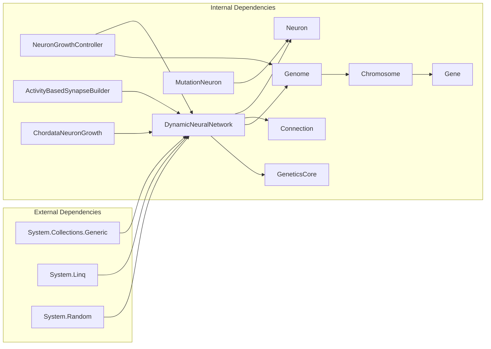

# DynamicNeuralNetwork

<cite>
**Referenced Files in This Document**
- [DynamicNeuralNetwork.cs](file://GeneticsGame/Systems/DynamicNeuralNetwork.cs)
- [Neuron.cs](file://GeneticsGame/Systems/Neuron.cs)
- [Connection.cs](file://GeneticsGame/Systems/Connection.cs)
- [NeuronGrowthController.cs](file://GeneticsGame/Systems/NeuronGrowthController.cs)
- [ChordataNeuronGrowth.cs](file://GeneticsGame/Phyla/Chordata/ChordataNeuronGrowth.cs)
- [Genome.cs](file://GeneticsGame/Core/Genome.cs)
- [Chromosome.cs](file://GeneticsGame/Core/Chromosome.cs)
- [Gene.cs](file://GeneticsGame/Core/Gene.cs)
- [GeneticsCore.cs](file://GeneticsGame/Core/GeneticsCore.cs)
- [ActivityBasedSynapseBuilder.cs](file://GeneticsGame/Systems/ActivityBasedSynapseBuilder.cs)
- [MutationNeuron.cs](file://GeneticsGame/Systems/MutationNeuron.cs)
</cite>

## Table of Contents
1. [Introduction](#introduction)
2. [Project Structure](#project-structure)
3. [Core Components](#core-components)
4. [Architecture Overview](#architecture-overview)
5. [Detailed Component Analysis](#detailed-component-analysis)
6. [Dependency Analysis](#dependency-analysis)
7. [Performance Considerations](#performance-considerations)
8. [Troubleshooting Guide](#troubleshooting-guide)
9. [Conclusion](#conclusion)
10. [Appendices](#appendices)

## Introduction
This document provides comprehensive technical documentation for the DynamicNeuralNetwork class, which serves as the core neural architecture enabling runtime neuron addition in the 3D Genetics Game. The system integrates genetic triggers from the genome with neural activity levels to drive neuron growth, forming a dynamic neural network that evolves during creature development and behavior.

The DynamicNeuralNetwork class manages three primary internal state collections: Neurons, Connections, and ActivityLevel. It exposes three key neuron management methods: AddNeuron(), AddConnection(), and GrowNeurons(). The growth mechanism responds to both genetic expression levels and neural activity thresholds, with genetic factors determining neuron type and growth limits.

## Project Structure
The neural system is organized around several interconnected components:

- Core neural primitives: Neuron and Connection classes define the basic building blocks
- Network management: DynamicNeuralNetwork orchestrates neuron lifecycle and growth
- Genetic control: NeuronGrowthController coordinates growth triggers from multiple sources
- Specialized growth: ChordataNeuronGrowth implements phyla-specific growth patterns
- Activity-based connectivity: ActivityBasedSynapseBuilder creates connections based on neural firing
- Genetic foundation: Genome, Chromosome, and Gene classes provide the hereditary framework



**Diagram sources**
- [DynamicNeuralNetwork.cs:1-116](file://GeneticsGame/Systems/DynamicNeuralNetwork.cs#L1-L116)
- [Neuron.cs:1-70](file://GeneticsGame/Systems/Neuron.cs#L1-L70)
- [Connection.cs:1-35](file://GeneticsGame/Systems/Connection.cs#L1-L35)
- [NeuronGrowthController.cs:1-122](file://GeneticsGame/Systems/NeuronGrowthController.cs#L1-L122)
- [ChordataNeuronGrowth.cs:1-216](file://GeneticsGame/Phyla/Chordata/ChordataNeuronGrowth.cs#L1-L216)
- [Genome.cs:1-190](file://GeneticsGame/Core/Genome.cs#L1-L190)
- [GeneticsCore.cs:1-21](file://GeneticsGame/Core/GeneticsCore.cs#L1-L21)

**Section sources**
- [DynamicNeuralNetwork.cs:1-116](file://GeneticsGame/Systems/DynamicNeuralNetwork.cs#L1-L116)
- [Genome.cs:1-190](file://GeneticsGame/Core/Genome.cs#L1-L190)

## Core Components
The DynamicNeuralNetwork class implements a sophisticated neural architecture with the following core capabilities:

### Internal State Management
- **Neurons**: Maintains a dynamic list of neuron instances with unique identifiers and activation properties
- **Connections**: Stores bidirectional connections between neurons with adjustable weights
- **ActivityLevel**: Tracks the network's overall activation state, calculated as the average neuron activation

### Neuron Management Methods
The class provides three primary methods for neuron lifecycle management:

#### AddNeuron Method
- **Purpose**: Adds a pre-created neuron instance to the network
- **Parameters**: neuron (Neuron) - the neuron to add
- **Return Value**: void
- **Behavior**: Direct insertion into the Neurons collection

#### AddConnection Method
- **Purpose**: Creates and adds a new connection between two neurons
- **Parameters**: 
  - fromNeuron (Neuron): source neuron
  - toNeuron (Neuron): target neuron  
  - weight (double, default: 1.0): connection strength
- **Return Value**: void
- **Behavior**: Constructs a Connection object and adds it to the Connections collection

#### GrowNeurons Method
- **Purpose**: Dynamically generates new neurons based on genetic triggers and activity levels
- **Parameters**:
  - genome (Genome): genetic blueprint providing growth signals
  - activityThreshold (double, default: 0.5): minimum activity level required for growth
- **Return Value**: int - number of neurons successfully added
- **Behavior**: Implements activity-dependent growth with genetic regulation and safety limits

**Section sources**
- [DynamicNeuralNetwork.cs:36-99](file://GeneticsGame/Systems/DynamicNeuralNetwork.cs#L36-L99)

## Architecture Overview
The DynamicNeuralNetwork operates within a multi-layered genetic-neural control system:



**Diagram sources**
- [NeuronGrowthController.cs:36-63](file://GeneticsGame/Systems/NeuronGrowthController.cs#L36-L63)
- [DynamicNeuralNetwork.cs:63-99](file://GeneticsGame/Systems/DynamicNeuralNetwork.cs#L63-L99)
- [GeneticsCore.cs:14-18](file://GeneticsGame/Core/GeneticsCore.cs#L14-L18)
- [Genome.cs:72-75](file://GeneticsGame/Core/Genome.cs#L72-L75)

The architecture integrates three growth trigger mechanisms:
1. **Genetic Expression**: Direct growth based on genome-encoded potential
2. **Mutation-Based**: Growth triggered by neural-specific mutations
3. **Learning-Based**: Activity-dependent growth influenced by learning rates

**Section sources**
- [NeuronGrowthController.cs:107-121](file://GeneticsGame/Systems/NeuronGrowthController.cs#L107-L121)
- [DynamicNeuralNetwork.cs:104-115](file://GeneticsGame/Systems/DynamicNeuralNetwork.cs#L104-L115)

## Detailed Component Analysis

### DynamicNeuralNetwork Class
The DynamicNeuralNetwork class serves as the central coordinator for neural growth and maintenance:



**Diagram sources**
- [DynamicNeuralNetwork.cs:9-34](file://GeneticsGame/Systems/DynamicNeuralNetwork.cs#L9-L34)
- [Neuron.cs:7-39](file://GeneticsGame/Systems/Neuron.cs#L7-L39)
- [Connection.cs:6-34](file://GeneticsGame/Systems/Connection.cs#L6-L34)
- [NeuronGrowthController.cs:9-30](file://GeneticsGame/Systems/NeuronGrowthController.cs#L9-L30)

#### Activity-Based Growth Mechanism
The growth process follows a multi-stage algorithm:



**Diagram sources**
- [DynamicNeuralNetwork.cs:63-99](file://GeneticsGame/Systems/DynamicNeuralNetwork.cs#L63-L99)
- [GeneticsCore.cs:17-18](file://GeneticsGame/Core/GeneticsCore.cs#L17-L18)

#### Genetic Factors Influencing Neuron Type Determination
The system implements epistatic interaction analysis to determine neuron specialization:

1. **Mutation-Specific Neurons**: Triggered when epistatic interactions exceed 0.8
2. **Learning-Specific Neurons**: Triggered when epistatic interactions exceed 0.7  
3. **General Purpose Neurons**: Default type when no special conditions are met

The epistatic interaction calculation considers both direct gene expression levels and cooperative effects with interaction partners.

**Section sources**
- [DynamicNeuralNetwork.cs:84-92](file://GeneticsGame/Systems/DynamicNeuralNetwork.cs#L84-L92)
- [Genome.cs:78-107](file://GeneticsGame/Core/Genome.cs#L78-L107)

### Neuron Types and Specializations
The system defines five distinct neuron types, each serving specific neural functions:



**Diagram sources**
- [Neuron.cs:44-70](file://GeneticsGame/Systems/Neuron.cs#L44-L70)
- [MutationNeuron.cs:7-49](file://GeneticsGame/Systems/MutationNeuron.cs#L7-L49)

#### Specialized Neuron Behaviors
- **Mutation Neurons**: Respond specifically to genetic mutations with lower activation thresholds
- **Learning Neurons**: Activated by learning processes and higher activity levels
- **Movement Neurons**: Specialized for motor control and coordination
- **Visual Neurons**: Process visual information and integrate with sensory systems

**Section sources**
- [MutationNeuron.cs:22-48](file://GeneticsGame/Systems/MutationNeuron.cs#L22-L48)
- [ChordataNeuronGrowth.cs:82-93](file://GeneticsGame/Phyla/Chordata/ChordataNeuronGrowth.cs#L82-L93)

### Activity-Based Synapse Builder
The ActivityBasedSynapseBuilder implements Hebbian learning principles to strengthen neural connections:



**Diagram sources**
- [ActivityBasedSynapseBuilder.cs:31-88](file://GeneticsGame/Systems/ActivityBasedSynapseBuilder.cs#L31-L88)

**Section sources**
- [ActivityBasedSynapseBuilder.cs:1-112](file://GeneticsGame/Systems/ActivityBasedSynapseBuilder.cs#L1-L112)

## Dependency Analysis
The DynamicNeuralNetwork class maintains dependencies across multiple system layers:



**Diagram sources**
- [DynamicNeuralNetwork.cs:1-4](file://GeneticsGame/Systems/DynamicNeuralNetwork.cs#L1-L4)
- [Genome.cs:1-4](file://GeneticsGame/Core/Genome.cs#L1-L4)

### Coupling and Cohesion Analysis
- **High Cohesion**: The DynamicNeuralNetwork class maintains tight focus on neural network management
- **Moderate Coupling**: Dependencies on genetic and control systems are well-defined but could benefit from interface abstraction
- **Potential Circular Dependencies**: No circular dependencies detected in the current implementation

**Section sources**
- [DynamicNeuralNetwork.cs:1-116](file://GeneticsGame/Systems/DynamicNeuralNetwork.cs#L1-L116)
- [NeuronGrowthController.cs:1-122](file://GeneticsGame/Systems/NeuronGrowthController.cs#L1-L122)

## Performance Considerations
The DynamicNeuralNetwork implementation includes several performance optimizations:

### Growth Limiting Mechanisms
- **MaxNeuronGrowthPerGeneration**: Prevents uncontrolled network expansion with a configurable cap
- **Activity Threshold Filtering**: Ensures growth only occurs when network activity meets minimum requirements
- **Early Termination**: Returns immediately when activity levels are insufficient

### Computational Complexity
- **AddNeuron**: O(1) operation for list insertion
- **AddConnection**: O(1) operation for list insertion  
- **GrowNeurons**: O(n) where n equals the calculated growth potential
- **UpdateActivity**: O(m) where m equals the number of neurons

### Memory Management
- **Collection Growth**: Lists automatically expand as needed
- **Object Lifecycle**: Neurons and connections remain in memory until explicitly removed
- **Weight Normalization**: Connection weights are clamped to [0.0, 1.0] range

## Troubleshooting Guide

### Common Issues and Solutions

#### Issue: No Neuron Growth Occurring
**Symptoms**: GrowNeurons() returns 0 despite high genetic potential
**Causes**:
- ActivityLevel below NeuralActivityThreshold
- Excessive growth limits preventing additions
- Insufficient genetic expression levels

**Solutions**:
- Verify ActivityLevel calculation and update cycles
- Check GeneticsCore.Config.NeuralActivityThreshold value
- Review genome expression levels and growth factors

#### Issue: Unexpected Neuron Types
**Symptoms**: Mutation neurons not appearing despite high epistatic interactions
**Causes**:
- Epistatic interaction thresholds not met
- Genetic epistasis calculations not properly configured
- Type assignment logic conflicts

**Solutions**:
- Validate epistatic interaction calculations in genome analysis
- Verify threshold values for type determination
- Check interaction partner configurations

#### Issue: Performance Degradation
**Symptoms**: Slow network updates and growth operations
**Causes**:
- Large neuron counts causing expensive operations
- Excessive connection density
- Inefficient activity threshold calculations

**Solutions**:
- Implement periodic pruning of weak connections
- Optimize activity calculations using incremental updates
- Consider spatial partitioning for large networks

**Section sources**
- [DynamicNeuralNetwork.cs:65-71](file://GeneticsGame/Systems/DynamicNeuralNetwork.cs#L65-L71)
- [GeneticsCore.cs:17-18](file://GeneticsGame/Core/GeneticsCore.cs#L17-L18)

## Conclusion
The DynamicNeuralNetwork class provides a robust foundation for dynamic neural architecture in the 3D Genetics Game. Its integration of genetic triggers, activity-based growth, and specialized neuron types enables complex neural development patterns that respond to both inherited genetic information and environmental stimuli.

The system's modular design allows for extensible growth patterns across different phyla while maintaining performance through careful limiting mechanisms and efficient data structures. The combination of genetic expression analysis, mutation-driven growth, and learning-based adaptation creates a comprehensive neural development framework suitable for evolving artificial life forms.

Future enhancements could include spatial organization of neurons, more sophisticated connection pruning algorithms, and adaptive growth rate mechanisms based on network complexity metrics.

## Appendices

### Practical Examples

#### Example 1: Basic Neuron Addition
```csharp
// Create a new neuron and add it to the network
var neuron = new Neuron();
neuralNetwork.AddNeuron(neuron);
```

#### Example 2: Connection Establishment
```csharp
// Connect two existing neurons with custom weight
neuralNetwork.AddConnection(sourceNeuron, targetNeuron, 0.7);
```

#### Example 3: Genetic-Driven Growth
```csharp
// Trigger growth based on genetic expression
var growthCount = neuralNetwork.GrowNeurons(genome, 0.5);
```

#### Example 4: Activity-Based Synapse Formation
```csharp
// Create connections based on neural activity
var builder = new ActivityBasedSynapseBuilder(neuralNetwork);
builder.BuildSynapses(0.6, 20);
```

### Configuration Reference
- **MaxNeuronGrowthPerGeneration**: Maximum neurons added per growth cycle (default: 100)
- **NeuralActivityThreshold**: Minimum activity level for growth (default: 0.7)
- **Neuron Activation Range**: 0.0 to 1.0
- **Connection Weight Range**: 0.0 to 1.0