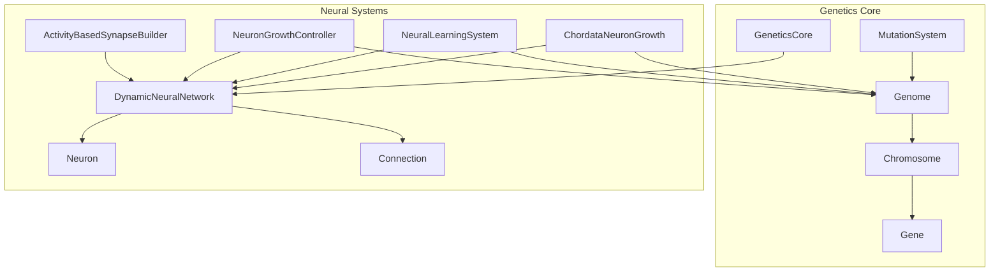
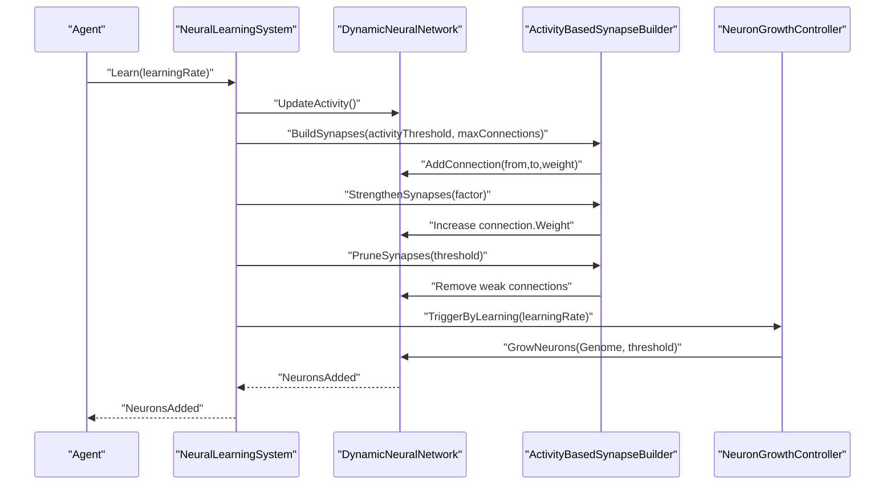
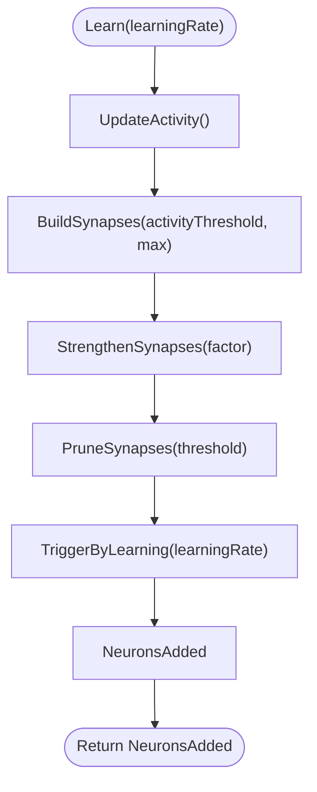
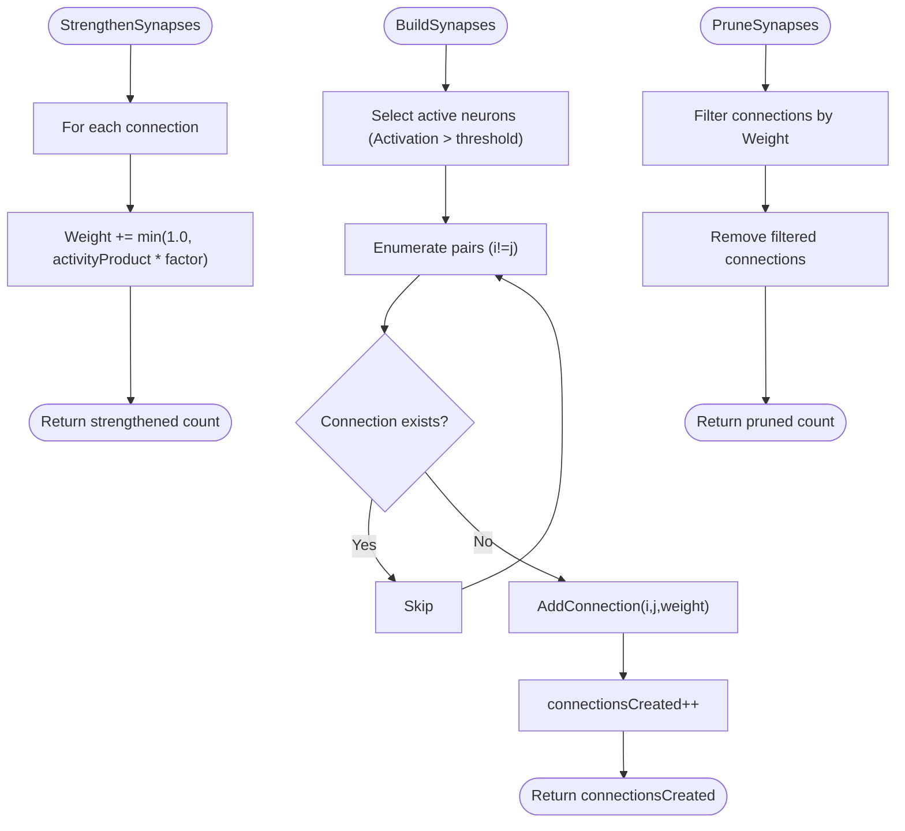
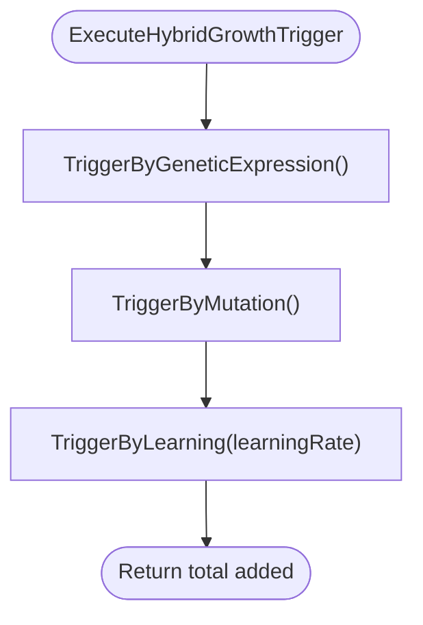
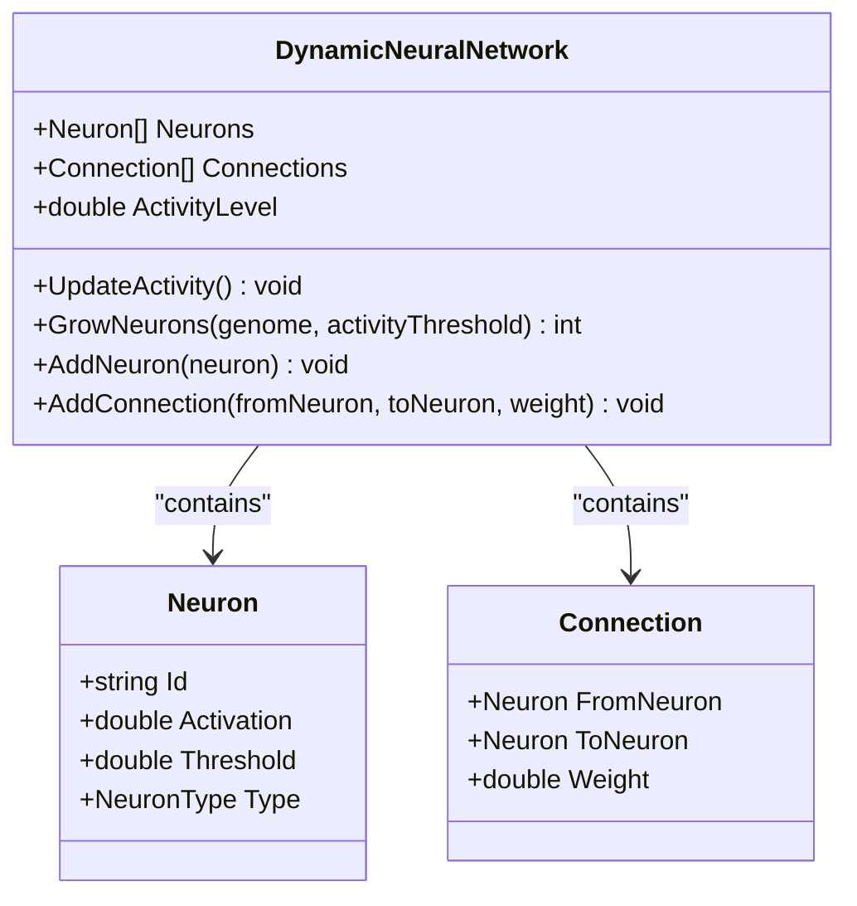
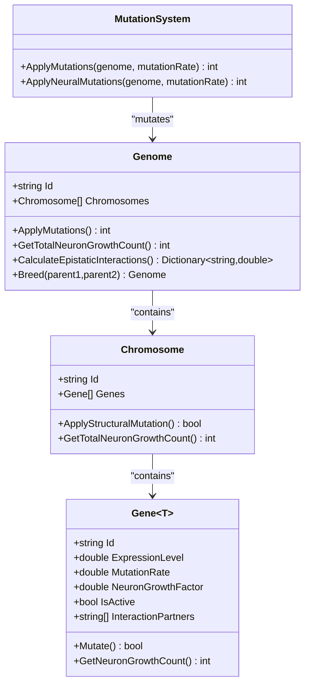
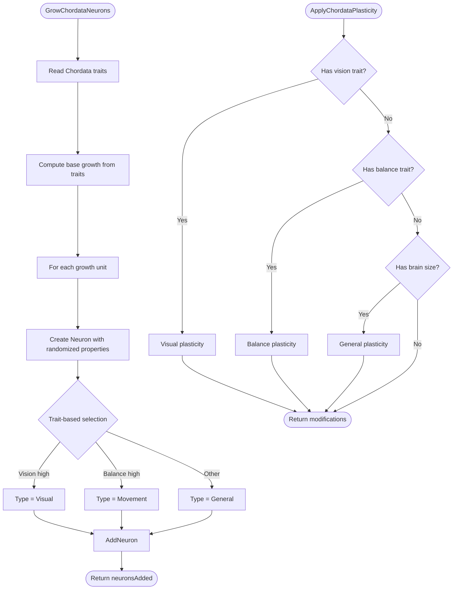
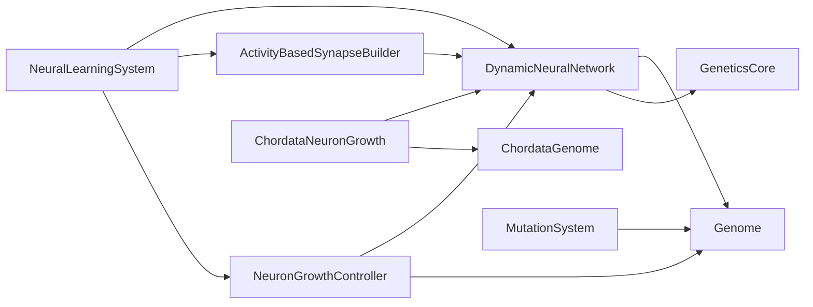

# Neural Learning System

<cite>
**Referenced Files in This Document**
- [GeneticsCore.cs](file://GeneticsGame/Core/GeneticsCore.cs)
- [Genome.cs](file://GeneticsGame/Core/Genome.cs)
- [Chromosome.cs](file://GeneticsGame/Core/Chromosome.cs)
- [Gene.cs](file://GeneticsGame/Core/Gene.cs)
- [MutationSystem.cs](file://GeneticsGame/Core/MutationSystem.cs)
- [DynamicNeuralNetwork.cs](file://GeneticsGame/Systems/DynamicNeuralNetwork.cs)
- [Neuron.cs](file://GeneticsGame/Systems/Neuron.cs)
- [Connection.cs](file://GeneticsGame/Systems/Connection.cs)
- [ActivityBasedSynapseBuilder.cs](file://GeneticsGame/Systems/ActivityBasedSynapseBuilder.cs)
- [NeuralLearningSystem.cs](file://GeneticsGame/Systems/NeuralLearningSystem.cs)
- [NeuronGrowthController.cs](file://GeneticsGame/Systems/NeuronGrowthController.cs)
- [ChordataNeuronGrowth.cs](file://GeneticsGame/Phyla/Chordata/ChordataNeuronGrowth.cs)
- [Program.cs](file://GeneticsGame/Program.cs)
</cite>

## Table of Contents
1. [Introduction](#introduction)
2. [Project Structure](#project-structure)
3. [Core Components](#core-components)
4. [Architecture Overview](#architecture-overview)
5. [Detailed Component Analysis](#detailed-component-analysis)
6. [Dependency Analysis](#dependency-analysis)
7. [Performance Considerations](#performance-considerations)
8. [Troubleshooting Guide](#troubleshooting-guide)
9. [Conclusion](#conclusion)
10. [Appendices](#appendices)

## Introduction
This document explains the NeuralLearningSystem that powers activity-based learning and neural plasticity in the 3D Genetics Game. It describes how neural activity patterns drive learning and adaptation, how synaptic weights are modified based on firing patterns and genetic predispositions, and how activity-based synapse building reinforces successful neural pathways. It also demonstrates how genetic configurations affect learning capacity, adaptation speed, and memory formation, and how genetic factors relate to cognitive abilities such as learning efficiency and behavioral plasticity.

## Project Structure
The system is organized around a core genetics framework and a dynamic neural network subsystem:
- Genetics core: Genome, Chromosome, Gene, and MutationSystem define hereditary blueprints and evolutionary dynamics.
- Neural systems: DynamicNeuralNetwork, Neuron, Connection, ActivityBasedSynapseBuilder, NeuronGrowthController, and NeuralLearningSystem implement activity-driven learning and growth.
- Phyla-specific extensions: ChordataNeuronGrowth adds vertebrate-like neural growth and plasticity rules.
- Example orchestration: Program.cs demonstrates creation, mutation, breeding, and updates.

**Diagram sources**
- [Genome.cs:1-190](file://GeneticsGame/Core/Genome.cs#L1-L190)
- [Chromosome.cs:1-146](file://GeneticsGame/Core/Chromosome.cs#L1-L146)
- [Gene.cs:1-93](file://GeneticsGame/Core/Gene.cs#L1-L93)
- [MutationSystem.cs:1-137](file://GeneticsGame/Core/MutationSystem.cs#L1-L137)
- [GeneticsCore.cs:1-21](file://GeneticsGame/Core/GeneticsCore.cs#L1-L21)
- [DynamicNeuralNetwork.cs:1-116](file://GeneticsGame/Systems/DynamicNeuralNetwork.cs#L1-L116)
- [Neuron.cs:1-70](file://GeneticsGame/Systems/Neuron.cs#L1-L70)
- [Connection.cs:1-35](file://GeneticsGame/Systems/Connection.cs#L1-L35)
- [ActivityBasedSynapseBuilder.cs:1-112](file://GeneticsGame/Systems/ActivityBasedSynapseBuilder.cs#L1-L112)
- [NeuronGrowthController.cs:1-122](file://GeneticsGame/Systems/NeuronGrowthController.cs#L1-L122)
- [NeuralLearningSystem.cs:1-122](file://GeneticsGame/Systems/NeuralLearningSystem.cs#L1-L122)
- [ChordataNeuronGrowth.cs:1-216](file://GeneticsGame/Phyla/Chordata/ChordataNeuronGrowth.cs#L1-L216)

**Section sources**
- [Program.cs:1-58](file://GeneticsGame/Program.cs#L1-L58)

## Core Components
- GeneticsCore: Provides global configuration constants for mutation rates, maximum neuron growth per generation, and neural activity thresholds.
- Genome: Aggregates chromosomes, applies mutations, computes epistatic interactions, and supports breeding between parents.
- Chromosome: Holds genes and supports structural mutations (deletion, duplication, inversion, translocation).
- Gene: Encapsulates expression level, mutation rate, neuron growth factor, activity state, and epistatic interaction partners.
- MutationSystem: Applies point, structural, and epigenetic mutations; includes neural-specific mutation targeting.
- DynamicNeuralNetwork: Maintains neurons and connections, computes activity level, grows neurons based on genetic triggers and activity thresholds.
- Neuron and Connection: Core neural primitives with types and weights.
- ActivityBasedSynapseBuilder: Builds synapses based on activity correlation, strengthens existing connections, prunes weak ones.
- NeuronGrowthController: Hybrid growth trigger (genetic expression → mutation → learning) with configurable thresholds.
- NeuralLearningSystem: Orchestrates a learning cycle (activity update, synapse building/strengthening/pruning, growth), environment adaptation scoring, and multi-cycle learning.
- ChordataNeuronGrowth: Adds phyla-specific growth patterns and plasticity rules.

**Section sources**
- [GeneticsCore.cs:14-20](file://GeneticsGame/Core/GeneticsCore.cs#L14-L20)
- [Genome.cs:44-66](file://GeneticsGame/Core/Genome.cs#L44-L66)
- [Chromosome.cs:44-62](file://GeneticsGame/Core/Chromosome.cs#L44-L62)
- [Gene.cs:49-93](file://GeneticsGame/Core/Gene.cs#L49-L93)
- [MutationSystem.cs:17-29](file://GeneticsGame/Core/MutationSystem.cs#L17-L29)
- [DynamicNeuralNetwork.cs:63-99](file://GeneticsGame/Systems/DynamicNeuralNetwork.cs#L63-L99)
- [Neuron.cs:7-39](file://GeneticsGame/Systems/Neuron.cs#L7-L39)
- [Connection.cs:6-35](file://GeneticsGame/Systems/Connection.cs#L6-L35)
- [ActivityBasedSynapseBuilder.cs:31-68](file://GeneticsGame/Systems/ActivityBasedSynapseBuilder.cs#L31-L68)
- [NeuronGrowthController.cs:36-101](file://GeneticsGame/Systems/NeuronGrowthController.cs#L36-L101)
- [NeuralLearningSystem.cs:37-57](file://GeneticsGame/Systems/NeuralLearningSystem.cs#L37-L57)
- [ChordataNeuronGrowth.cs:36-103](file://GeneticsGame/Phyla/Chordata/ChordataNeuronGrowth.cs#L36-L103)

## Architecture Overview
The NeuralLearningSystem coordinates three pillars:
- Activity-based synaptogenesis: New connections form between co-active neurons.
- Synaptic strengthening and pruning: Existing connections are modulated by activity and weight thresholds.
- Neuron growth: New neurons are added via genetic expression, mutation, or learning feedback.

**Diagram sources**
- [NeuralLearningSystem.cs:37-57](file://GeneticsGame/Systems/NeuralLearningSystem.cs#L37-L57)
- [ActivityBasedSynapseBuilder.cs:31-68](file://GeneticsGame/Systems/ActivityBasedSynapseBuilder.cs#L31-L68)
- [ActivityBasedSynapseBuilder.cs:75-88](file://GeneticsGame/Systems/ActivityBasedSynapseBuilder.cs#L75-L88)
- [ActivityBasedSynapseBuilder.cs:95-111](file://GeneticsGame/Systems/ActivityBasedSynapseBuilder.cs#L95-L111)
- [NeuronGrowthController.cs:88-101](file://GeneticsGame/Systems/NeuronGrowthController.cs#L88-L101)
- [DynamicNeuralNetwork.cs:63-99](file://GeneticsGame/Systems/DynamicNeuralNetwork.cs#L63-L99)

## Detailed Component Analysis

### NeuralLearningSystem
- Purpose: Orchestrates a single learning cycle and long-term adaptation.
- Learning cycle:
  - Updates network activity.
  - Builds synapses among active neurons.
  - Strengthens existing connections proportionally to pre/post activation.
  - Prunes weak synapses.
  - Triggers neuron growth based on learning feedback.
- Environment adaptation: Scores how well the current neural composition matches environmental and task requirements, scaled by genetic growth potential.
- Multi-cycle learning: Gradually decays learning rate to stabilize growth.

**Diagram sources**
- [NeuralLearningSystem.cs:37-57](file://GeneticsGame/Systems/NeuralLearningSystem.cs#L37-L57)
- [ActivityBasedSynapseBuilder.cs:31-68](file://GeneticsGame/Systems/ActivityBasedSynapseBuilder.cs#L31-L68)
- [ActivityBasedSynapseBuilder.cs:75-88](file://GeneticsGame/Systems/ActivityBasedSynapseBuilder.cs#L75-L88)
- [ActivityBasedSynapseBuilder.cs:95-111](file://GeneticsGame/Systems/ActivityBasedSynapseBuilder.cs#L95-L111)
- [NeuronGrowthController.cs:88-101](file://GeneticsGame/Systems/NeuronGrowthController.cs#L88-L101)

**Section sources**
- [NeuralLearningSystem.cs:37-122](file://GeneticsGame/Systems/NeuralLearningSystem.cs#L37-L122)

### ActivityBasedSynapseBuilder
- BuildSynapses: Creates new connections between pairs of active neurons, weighting proportional to mean activation; avoids duplicates.
- StrengthenSynapses: Increases connection weights by a factor proportional to the product of pre/post activations.
- PruneSynapses: Removes connections below a minimum weight threshold.

**Diagram sources**
- [ActivityBasedSynapseBuilder.cs:31-68](file://GeneticsGame/Systems/ActivityBasedSynapseBuilder.cs#L31-L68)
- [ActivityBasedSynapseBuilder.cs:75-88](file://GeneticsGame/Systems/ActivityBasedSynapseBuilder.cs#L75-L88)
- [ActivityBasedSynapseBuilder.cs:95-111](file://GeneticsGame/Systems/ActivityBasedSynapseBuilder.cs#L95-L111)

**Section sources**
- [ActivityBasedSynapseBuilder.cs:1-112](file://GeneticsGame/Systems/ActivityBasedSynapseBuilder.cs#L1-L112)

### NeuronGrowthController
- Hybrid triggering prioritizes:
  - Genetic expression: finds highly expressed genes with strong neuron growth factors and triggers growth accordingly.
  - Mutation: applies neural-specific mutations and triggers growth with a lower activity threshold.
  - Learning: growth proportional to recent activity levels with a reduced threshold.
- ExecuteHybridGrowthTrigger: runs all three triggers in order and aggregates results.

**Diagram sources**
- [NeuronGrowthController.cs:107-122](file://GeneticsGame/Systems/NeuronGrowthController.cs#L107-L122)
- [NeuronGrowthController.cs:36-63](file://GeneticsGame/Systems/NeuronGrowthController.cs#L36-L63)
- [NeuronGrowthController.cs:69-81](file://GeneticsGame/Systems/NeuronGrowthController.cs#L69-L81)
- [NeuronGrowthController.cs:88-101](file://GeneticsGame/Systems/NeuronGrowthController.cs#L88-L101)

**Section sources**
- [NeuronGrowthController.cs:1-122](file://GeneticsGame/Systems/NeuronGrowthController.cs#L1-L122)

### DynamicNeuralNetwork
- Maintains lists of Neuron and Connection objects.
- UpdateActivity: computes average activation across all neurons.
- GrowNeurons: adds new neurons up to a cap determined by genetic growth potential and a global limit; determines neuron types based on epistatic interactions.

**Diagram sources**
- [DynamicNeuralNetwork.cs:9-116](file://GeneticsGame/Systems/DynamicNeuralNetwork.cs#L9-L116)
- [Neuron.cs:7-39](file://GeneticsGame/Systems/Neuron.cs#L7-L39)
- [Connection.cs:6-35](file://GeneticsGame/Systems/Connection.cs#L6-L35)

**Section sources**
- [DynamicNeuralNetwork.cs:1-116](file://GeneticsGame/Systems/DynamicNeuralNetwork.cs#L1-L116)

### Genetics Core and Evolutionary Engine
- Genome: aggregates Chromosome collections, applies mutations, computes epistatic interactions, and breeds offspring.
- Chromosome: supports structural mutations (deletion, duplication, inversion, translocation).
- Gene: encodes expression level, mutation rate, neuron growth factor, activity state, and interaction partners; calculates neuron growth contribution.
- MutationSystem: applies point, structural, and epigenetic mutations; includes neural-specific mutation targeting.

**Diagram sources**
- [Genome.cs:9-190](file://GeneticsGame/Core/Genome.cs#L9-L190)
- [Chromosome.cs:9-146](file://GeneticsGame/Core/Chromosome.cs#L9-L146)
- [Gene.cs:9-93](file://GeneticsGame/Core/Gene.cs#L9-L93)
- [MutationSystem.cs:9-137](file://GeneticsGame/Core/MutationSystem.cs#L9-L137)

**Section sources**
- [Genome.cs:1-190](file://GeneticsGame/Core/Genome.cs#L1-L190)
- [Chromosome.cs:1-146](file://GeneticsGame/Core/Chromosome.cs#L1-L146)
- [Gene.cs:1-93](file://GeneticsGame/Core/Gene.cs#L1-L93)
- [MutationSystem.cs:1-137](file://GeneticsGame/Core/MutationSystem.cs#L1-L137)

### ChordataNeuronGrowth (Phyla-Specific Extension)
- Implements vertebrate-like growth patterns:
  - Calculates growth potential from traits (neuron count, brain size, synapse density, spine length).
  - Adds neurons with types guided by traits (e.g., vision acuity → Visual neurons).
  - Applies plasticity rules tailored to visual, balance, and general neural systems.

**Diagram sources**
- [ChordataNeuronGrowth.cs:36-103](file://GeneticsGame/Phyla/Chordata/ChordataNeuronGrowth.cs#L36-L103)
- [ChordataNeuronGrowth.cs:109-136](file://GeneticsGame/Phyla/Chordata/ChordataNeuronGrowth.cs#L109-L136)
- [ChordataNeuronGrowth.cs:142-164](file://GeneticsGame/Phyla/Chordata/ChordataNeuronGrowth.cs#L142-L164)
- [ChordataNeuronGrowth.cs:170-193](file://GeneticsGame/Phyla/Chordata/ChordataNeuronGrowth.cs#L170-L193)
- [ChordataNeuronGrowth.cs:199-215](file://GeneticsGame/Phyla/Chordata/ChordataNeuronGrowth.cs#L199-L215)

**Section sources**
- [ChordataNeuronGrowth.cs:1-216](file://GeneticsGame/Phyla/Chordata/ChordataNeuronGrowth.cs#L1-L216)

## Dependency Analysis
- NeuralLearningSystem depends on DynamicNeuralNetwork and ActivityBasedSynapseBuilder for activity-driven synaptogenesis and on NeuronGrowthController for growth triggers.
- DynamicNeuralNetwork depends on Genome for growth potential and on GeneticsCore for activity thresholds.
- ActivityBasedSynapseBuilder depends on DynamicNeuralNetwork’s neuron and connection collections.
- NeuronGrowthController depends on both DynamicNeuralNetwork and Genome.
- ChordataNeuronGrowth depends on both DynamicNeuralNetwork and ChordataGenome (external to this snapshot).
- MutationSystem modifies Genome, indirectly influencing growth potential and epistatic interactions.

**Diagram sources**
- [NeuralLearningSystem.cs:14-30](file://GeneticsGame/Systems/NeuralLearningSystem.cs#L14-L30)
- [DynamicNeuralNetwork.cs:63-99](file://GeneticsGame/Systems/DynamicNeuralNetwork.cs#L63-L99)
- [ActivityBasedSynapseBuilder.cs:20-23](file://GeneticsGame/Systems/ActivityBasedSynapseBuilder.cs#L20-L23)
- [NeuronGrowthController.cs:26-30](file://GeneticsGame/Systems/NeuronGrowthController.cs#L26-L30)
- [ChordataNeuronGrowth.cs:26-30](file://GeneticsGame/Phyla/Chordata/ChordataNeuronGrowth.cs#L26-L30)
- [MutationSystem.cs:17-29](file://GeneticsGame/Core/MutationSystem.cs#L17-L29)
- [GeneticsCore.cs:14-20](file://GeneticsGame/Core/GeneticsCore.cs#L14-L20)

**Section sources**
- [NeuralLearningSystem.cs:1-122](file://GeneticsGame/Systems/NeuralLearningSystem.cs#L1-L122)
- [DynamicNeuralNetwork.cs:1-116](file://GeneticsGame/Systems/DynamicNeuralNetwork.cs#L1-L116)
- [ActivityBasedSynapseBuilder.cs:1-112](file://GeneticsGame/Systems/ActivityBasedSynapseBuilder.cs#L1-L112)
- [NeuronGrowthController.cs:1-122](file://GeneticsGame/Systems/NeuronGrowthController.cs#L1-L122)
- [ChordataNeuronGrowth.cs:1-216](file://GeneticsGame/Phyla/Chordata/ChordataNeuronGrowth.cs#L1-L216)
- [MutationSystem.cs:1-137](file://GeneticsGame/Core/MutationSystem.cs#L1-L137)
- [GeneticsCore.cs:1-21](file://GeneticsGame/Core/GeneticsCore.cs#L1-L21)

## Performance Considerations
- Synapse building complexity: O(A^2) in the number of active neurons due to pairwise checks; capped by maxConnections.
- Strengthening/pruning: O(C) where C is the number of connections.
- Growth: O(G) where G is the computed growth potential, bounded by MaxNeuronGrowthPerGeneration.
- Epistatic interactions: O(TotalGenes) across chromosomes; suitable for small to medium genomes.
- Recommendations:
  - Cache active neuron sets when repeated operations occur.
  - Use spatial indexing or sparse structures if neuron counts scale large.
  - Batch updates for connection weight changes to reduce overhead.
  - Limit maxConnections and prune aggressively to maintain manageable network density.

[No sources needed since this section provides general guidance]

## Troubleshooting Guide
- No new synapses formed:
  - Verify activityThreshold is met and sufficient active neurons exist.
  - Check that duplicate detection prevents re-adding existing connections.
- Synapses not strengthening:
  - Confirm activityProduct is non-zero and factor is positive.
  - Ensure connections exist and weights remain below upper bounds.
- Excessive growth:
  - Review genetic growth potential and MaxNeuronGrowthPerGeneration.
  - Inspect epistatic interactions that elevate neuron growth factors.
- Poor adaptation scores:
  - Adjust environment/task requirement keys and weights.
  - Consider increasing genetic growth potential via mutations or breeding.

**Section sources**
- [ActivityBasedSynapseBuilder.cs:31-68](file://GeneticsGame/Systems/ActivityBasedSynapseBuilder.cs#L31-L68)
- [ActivityBasedSynapseBuilder.cs:75-88](file://GeneticsGame/Systems/ActivityBasedSynapseBuilder.cs#L75-L88)
- [ActivityBasedSynapseBuilder.cs:95-111](file://GeneticsGame/Systems/ActivityBasedSynapseBuilder.cs#L95-L111)
- [DynamicNeuralNetwork.cs:63-99](file://GeneticsGame/Systems/DynamicNeuralNetwork.cs#L63-L99)
- [NeuralLearningSystem.cs:65-103](file://GeneticsGame/Systems/NeuralLearningSystem.cs#L65-L103)

## Conclusion
The NeuralLearningSystem integrates activity-based synaptogenesis, synaptic plasticity, and genetically guided neuron growth to enable adaptive neural networks. Genetic factors—encoded in Gene expression levels, neuron growth factors, and epistatic interactions—directly shape learning capacity, growth potential, and neural specialization. Through iterative learning cycles and environment adaptation, the system demonstrates how neural activity patterns reinforce successful pathways while maintaining structural stability via pruning and growth constraints.

[No sources needed since this section summarizes without analyzing specific files]

## Appendices

### How Genetic Configurations Affect Learning and Plasticity
- High neuron growth factor and expression level:
  - Increase growth potential and neuron count, accelerating learning capacity and memory formation.
- Epistatic interactions favoring “neuron” or “learning”:
  - Bias neuron types toward specialized roles (e.g., Learning or Mutation neurons), enhancing plasticity and adaptability.
- Structural mutations:
  - Alter gene arrangements, potentially increasing diversity and enabling novel growth patterns.
- Neural-specific mutations:
  - Modify neuron growth parameters directly, impacting network size and connectivity.

**Section sources**
- [Genome.cs:72-107](file://GeneticsGame/Core/Genome.cs#L72-L107)
- [Chromosome.cs:142-146](file://GeneticsGame/Core/Chromosome.cs#L142-L146)
- [Gene.cs:85-93](file://GeneticsGame/Core/Gene.cs#L85-L93)
- [MutationSystem.cs:111-136](file://GeneticsGame/Core/MutationSystem.cs#L111-L136)
- [DynamicNeuralNetwork.cs:84-96](file://GeneticsGame/Systems/DynamicNeuralNetwork.cs#L84-L96)

### Example Orchestration (from Program.cs)
- Creates a random genome, computes growth potential, grows neurons, mutates, breeds, and updates a Chordata creature.
- Demonstrates integration of genetics and neural systems in a cohesive workflow.

**Section sources**
- [Program.cs:16-52](file://GeneticsGame/Program.cs#L16-L52)