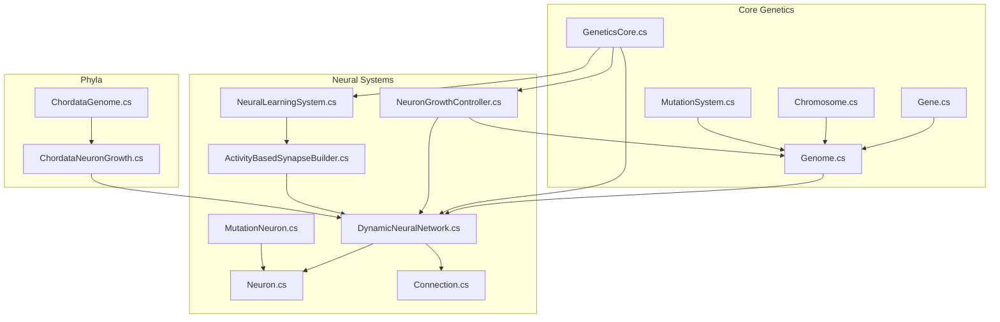
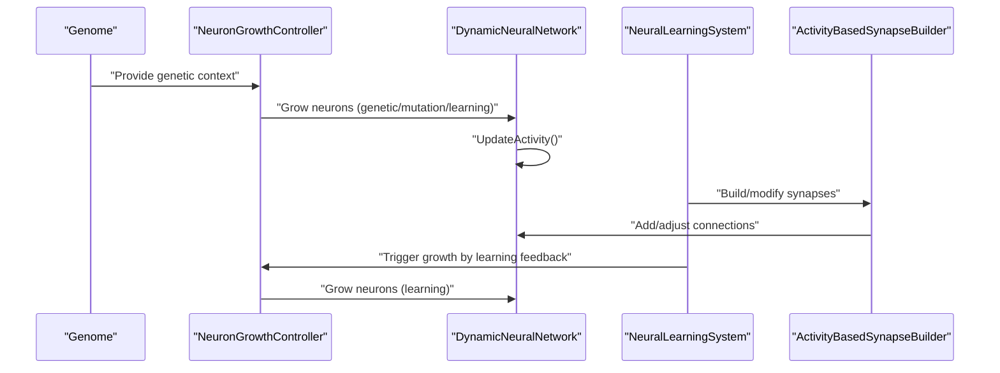
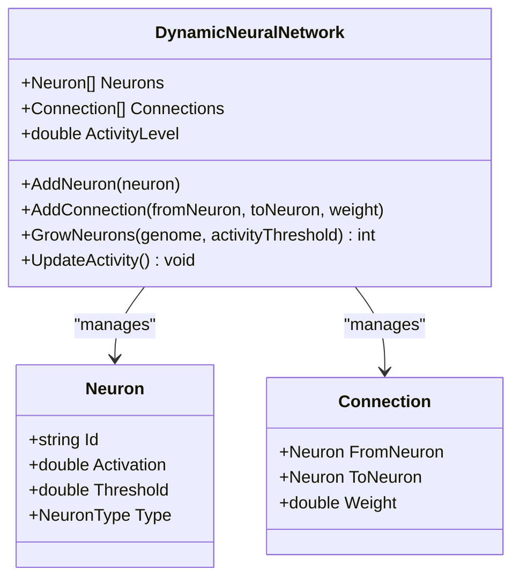
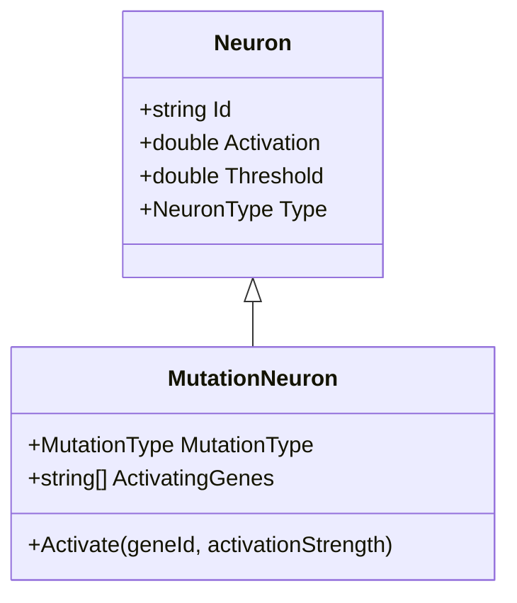
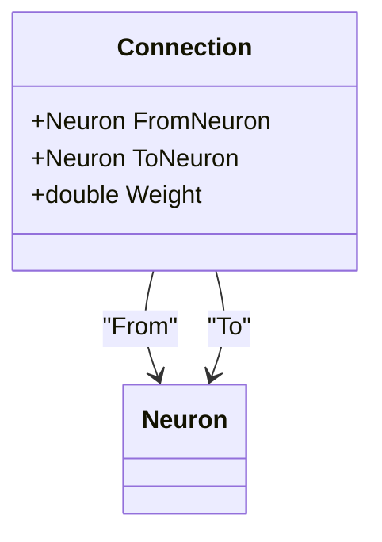
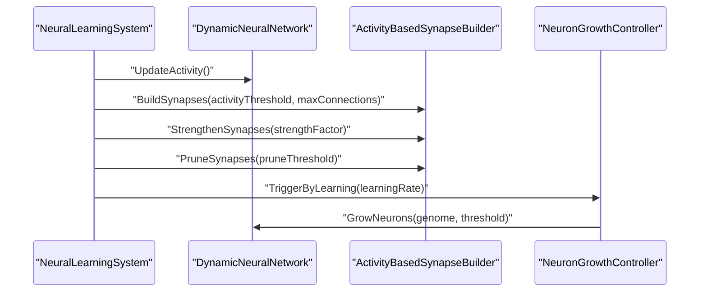
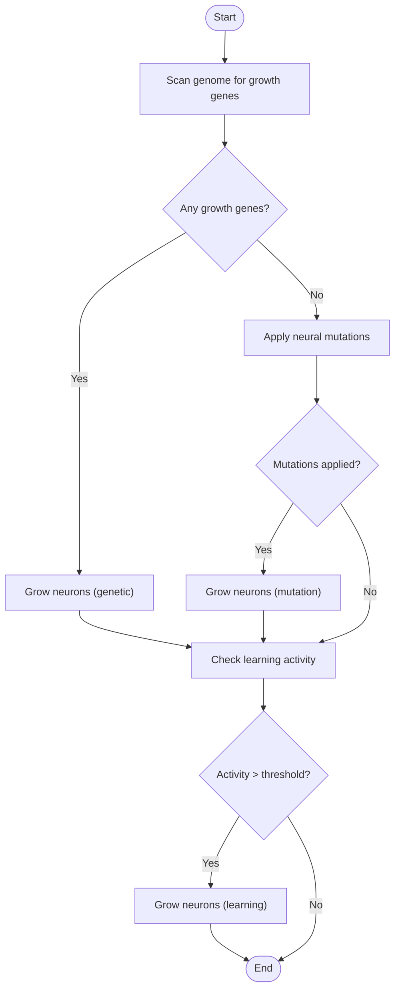
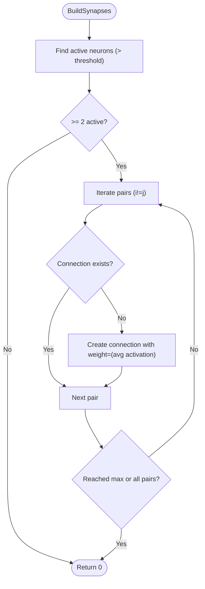
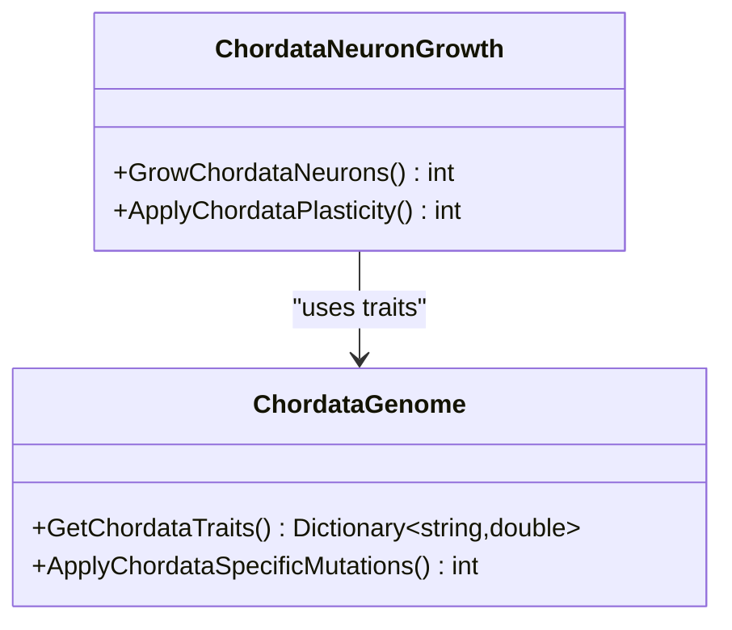
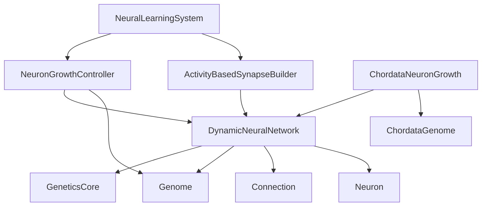

# Neural Network System

<cite>
**Referenced Files in This Document**
- [GeneticsCore.cs](file://GeneticsGame/Core/GeneticsCore.cs)
- [Genome.cs](file://GeneticsGame/Core/Genome.cs)
- [Gene.cs](file://GeneticsGame/Core/Gene.cs)
- [Chromosome.cs](file://GeneticsGame/Core/Chromosome.cs)
- [MutationSystem.cs](file://GeneticsGame/Core/MutationSystem.cs)
- [DynamicNeuralNetwork.cs](file://GeneticsGame/Systems/DynamicNeuralNetwork.cs)
- [Neuron.cs](file://GeneticsGame/Systems/Neuron.cs)
- [Connection.cs](file://GeneticsGame/Systems/Connection.cs)
- [NeuralLearningSystem.cs](file://GeneticsGame/Systems/NeuralLearningSystem.cs)
- [NeuronGrowthController.cs](file://GeneticsGame/Systems/NeuronGrowthController.cs)
- [ActivityBasedSynapseBuilder.cs](file://GeneticsGame/Systems/ActivityBasedSynapseBuilder.cs)
- [MutationNeuron.cs](file://GeneticsGame/Systems/MutationNeuron.cs)
- [ChordataNeuronGrowth.cs](file://GeneticsGame/Phyla/Chordata/ChordataNeuronGrowth.cs)
- [ChordataGenome.cs](file://GeneticsGame/Phyla/Chordata/ChordataGenome.cs)
- [Program.cs](file://GeneticsGame/Program.cs)
</cite>

## Table of Contents
1. [Introduction](#introduction)
2. [Project Structure](#project-structure)
3. [Core Components](#core-components)
4. [Architecture Overview](#architecture-overview)
5. [Detailed Component Analysis](#detailed-component-analysis)
6. [Dependency Analysis](#dependency-analysis)
7. [Performance Considerations](#performance-considerations)
8. [Troubleshooting Guide](#troubleshooting-guide)
9. [Conclusion](#conclusion)
10. [Appendices](#appendices)

## Introduction
This document explains how genetic information directly controls brain development and behavior in the 3D Genetics Game neural network system. It focuses on the DynamicNeuralNetwork architecture and its growth mechanism driven by genetic triggers from the genome. It documents the Neuron class with its specialized types, the Connection system for synaptic weights and pathways, the NeuralLearningSystem implementing activity-based learning and adaptive neural plasticity, and the NeuronGrowthController coordinating neuron development. It also covers the ActivityBasedSynapseBuilder that forms connections based on neural activity patterns. Finally, it illustrates how genetic variations affect neural network structure, learning capabilities, and behavioral outcomes, and how different genotypes produce distinct neural architectures and behaviors.

## Project Structure
The neural network system is organized around a core genetics framework and a set of systems that translate genetic blueprints into dynamic neural structures and behaviors.

**Diagram sources**
- [GeneticsCore.cs:14-19](file://GeneticsGame/Core/GeneticsCore.cs#L14-L19)
- [Genome.cs:9-75](file://GeneticsGame/Core/Genome.cs#L9-L75)
- [Chromosome.cs:9-145](file://GeneticsGame/Core/Chromosome.cs#L9-L145)
- [Gene.cs:9-92](file://GeneticsGame/Core/Gene.cs#L9-L92)
- [MutationSystem.cs:9-136](file://GeneticsGame/Core/MutationSystem.cs#L9-L136)
- [DynamicNeuralNetwork.cs:9-115](file://GeneticsGame/Systems/DynamicNeuralNetwork.cs#L9-L115)
- [Neuron.cs:7-39](file://GeneticsGame/Systems/Neuron.cs#L7-L39)
- [Connection.cs:6-34](file://GeneticsGame/Systems/Connection.cs#L6-L34)
- [NeuralLearningSystem.cs:9-121](file://GeneticsGame/Systems/NeuralLearningSystem.cs#L9-L121)
- [NeuronGrowthController.cs:9-121](file://GeneticsGame/Systems/NeuronGrowthController.cs#L9-L121)
- [ActivityBasedSynapseBuilder.cs:9-111](file://GeneticsGame/Systems/ActivityBasedSynapseBuilder.cs#L9-L111)
- [MutationNeuron.cs:7-49](file://GeneticsGame/Systems/MutationNeuron.cs#L7-L49)
- [ChordataGenome.cs:9-95](file://GeneticsGame/Phyla/Chordata/ChordataGenome.cs#L9-L95)
- [ChordataNeuronGrowth.cs:9-135](file://GeneticsGame/Phyla/Chordata/ChordataNeuronGrowth.cs#L9-L135)

**Section sources**
- [GeneticsCore.cs:9-20](file://GeneticsGame/Core/GeneticsCore.cs#L9-L20)
- [Genome.cs:9-75](file://GeneticsGame/Core/Genome.cs#L9-L75)
- [Chromosome.cs:9-145](file://GeneticsGame/Core/Chromosome.cs#L9-L145)
- [Gene.cs:9-92](file://GeneticsGame/Core/Gene.cs#L9-L92)
- [MutationSystem.cs:9-136](file://GeneticsGame/Core/MutationSystem.cs#L9-L136)
- [DynamicNeuralNetwork.cs:9-115](file://GeneticsGame/Systems/DynamicNeuralNetwork.cs#L9-L115)
- [Neuron.cs:7-70](file://GeneticsGame/Systems/Neuron.cs#L7-L70)
- [Connection.cs:6-34](file://GeneticsGame/Systems/Connection.cs#L6-L34)
- [NeuralLearningSystem.cs:9-121](file://GeneticsGame/Systems/NeuralLearningSystem.cs#L9-L121)
- [NeuronGrowthController.cs:9-121](file://GeneticsGame/Systems/NeuronGrowthController.cs#L9-L121)
- [ActivityBasedSynapseBuilder.cs:9-111](file://GeneticsGame/Systems/ActivityBasedSynapseBuilder.cs#L9-L111)
- [MutationNeuron.cs:7-75](file://GeneticsGame/Systems/MutationNeuron.cs#L7-L75)
- [ChordataGenome.cs:9-134](file://GeneticsGame/Phyla/Chordata/ChordataGenome.cs#L9-L134)
- [ChordataNeuronGrowth.cs:9-215](file://GeneticsGame/Phyla/Chordata/ChordataNeuronGrowth.cs#L9-L215)

## Core Components
- DynamicNeuralNetwork: Supports runtime neuron addition and manages activity-driven growth. It computes activity as the average neuron activation and grows neurons when activity exceeds thresholds, guided by genetic signals.
- Neuron: Represents a single neuron with Id, Activation, Threshold, and Type. Types include General, Mutation, Learning, Movement, and Visual.
- Connection: Represents a directed weighted connection between two Neuron instances.
- NeuralLearningSystem: Orchestrates learning cycles, builds synapses based on activity, strengthens/prunes synapses, and triggers neuron growth via the growth controller.
- NeuronGrowthController: Coordinates neuron growth using three genetic triggers—genetic expression, mutation, and learning—prioritizing them in that order.
- ActivityBasedSynapseBuilder: Implements Hebbian-style synaptogenesis by connecting active neurons and adjusting synaptic weights accordingly.
- MutationNeuron: A specialized Neuron subclass activated by specific mutations, with mutation type and activating genes tracked.
- ChordataNeuronGrowth and ChordataGenome: Chordata-specific extensions that encode vertebrate-like traits and growth patterns, including visual, balance, and brain size influences.

**Section sources**
- [DynamicNeuralNetwork.cs:9-115](file://GeneticsGame/Systems/DynamicNeuralNetwork.cs#L9-L115)
- [Neuron.cs:7-70](file://GeneticsGame/Systems/Neuron.cs#L7-L70)
- [Connection.cs:6-34](file://GeneticsGame/Systems/Connection.cs#L6-L34)
- [NeuralLearningSystem.cs:9-121](file://GeneticsGame/Systems/NeuralLearningSystem.cs#L9-L121)
- [NeuronGrowthController.cs:9-121](file://GeneticsGame/Systems/NeuronGrowthController.cs#L9-L121)
- [ActivityBasedSynapseBuilder.cs:9-111](file://GeneticsGame/Systems/ActivityBasedSynapseBuilder.cs#L9-L111)
- [MutationNeuron.cs:7-75](file://GeneticsGame/Systems/MutationNeuron.cs#L7-L75)
- [ChordataNeuronGrowth.cs:9-215](file://GeneticsGame/Phyla/Chordata/ChordataNeuronGrowth.cs#L9-L215)
- [ChordataGenome.cs:9-134](file://GeneticsGame/Phyla/Chordata/ChordataGenome.cs#L9-L134)

## Architecture Overview
The system links genetic blueprints to neural development and behavior through a layered pipeline:
- Genetic blueprint (Genome) encodes traits and neuron growth potential.
- DynamicNeuralNetwork translates genetic signals into growing neurons and connections.
- NeuralLearningSystem drives activity-dependent plasticity and growth.
- NeuronGrowthController integrates genetic expression, mutation, and learning feedback.
- ActivityBasedSynapseBuilder forms and maintains synaptic pathways based on neural activity.
- Chordata-specific modules refine growth and plasticity according to traits like vision acuity, balance, and brain size.

**Diagram sources**
- [Genome.cs:72-75](file://GeneticsGame/Core/Genome.cs#L72-L75)
- [NeuronGrowthController.cs:36-101](file://GeneticsGame/Systems/NeuronGrowthController.cs#L36-L101)
- [DynamicNeuralNetwork.cs:63-99](file://GeneticsGame/Systems/DynamicNeuralNetwork.cs#L63-L99)
- [NeuralLearningSystem.cs:37-57](file://GeneticsGame/Systems/NeuralLearningSystem.cs#L37-L57)
- [ActivityBasedSynapseBuilder.cs:31-111](file://GeneticsGame/Systems/ActivityBasedSynapseBuilder.cs#L31-L111)

## Detailed Component Analysis

### DynamicNeuralNetwork
- Purpose: Runtime growth of neurons and maintenance of activity levels.
- Key behaviors:
  - AddNeuron: Adds a neuron to the network.
  - AddConnection: Creates a directed weighted connection between two neurons.
  - GrowNeurons: Grows neurons based on genetic growth potential and activity threshold, selecting neuron types via epistatic interactions.
  - UpdateActivity: Computes activity as the mean neuron activation.
- Genetic integration: Uses genome’s total growth count and epistatic interactions to determine growth and neuron types.

**Diagram sources**
- [DynamicNeuralNetwork.cs:9-115](file://GeneticsGame/Systems/DynamicNeuralNetwork.cs#L9-L115)
- [Neuron.cs:7-39](file://GeneticsGame/Systems/Neuron.cs#L7-L39)
- [Connection.cs:6-34](file://GeneticsGame/Systems/Connection.cs#L6-L34)

**Section sources**
- [DynamicNeuralNetwork.cs:29-115](file://GeneticsGame/Systems/DynamicNeuralNetwork.cs#L29-L115)

### Neuron and Neuron Types
- Properties: Id, Activation, Threshold, Type.
- Types:
  - General: Basic-purpose neuron.
  - Mutation: Activated by mutations; specialized sensitivity and low initial activation.
  - Learning: Involved in learning processes.
  - Movement: Controls movement-related behaviors.
  - Visual: Processes visual information.
- MutationNeuron extends Neuron with mutation type and a list of activating genes, lowering threshold and enabling activation by genetic triggers.

**Diagram sources**
- [Neuron.cs:7-70](file://GeneticsGame/Systems/Neuron.cs#L7-L70)
- [MutationNeuron.cs:7-49](file://GeneticsGame/Systems/MutationNeuron.cs#L7-L49)

**Section sources**
- [Neuron.cs:44-70](file://GeneticsGame/Systems/Neuron.cs#L44-L70)
- [MutationNeuron.cs:22-49](file://GeneticsGame/Systems/MutationNeuron.cs#L22-L49)

### Connection System
- Represents a directed weighted connection between two Neuron instances.
- Weight determines signal strength and is adjusted by learning mechanisms.

**Diagram sources**
- [Connection.cs:6-34](file://GeneticsGame/Systems/Connection.cs#L6-L34)

**Section sources**
- [Connection.cs:29-34](file://GeneticsGame/Systems/Connection.cs#L29-L34)

### NeuralLearningSystem
- Orchestrates learning cycles:
  - Updates network activity.
  - Builds synapses via ActivityBasedSynapseBuilder.
  - Strengthens and prunes synapses.
  - Triggers neuron growth via NeuronGrowthController.
- Adaptation scoring considers environment and task requirements, modulated by genetic growth potential.

**Diagram sources**
- [NeuralLearningSystem.cs:37-57](file://GeneticsGame/Systems/NeuralLearningSystem.cs#L37-L57)
- [ActivityBasedSynapseBuilder.cs:31-111](file://GeneticsGame/Systems/ActivityBasedSynapseBuilder.cs#L31-L111)
- [NeuronGrowthController.cs:88-101](file://GeneticsGame/Systems/NeuronGrowthController.cs#L88-L101)

**Section sources**
- [NeuralLearningSystem.cs:37-121](file://GeneticsGame/Systems/NeuralLearningSystem.cs#L37-L121)

### NeuronGrowthController
- Hybrid triggering system:
  - TriggerByGeneticExpression: Scans genome for highly expressed genes with high neuron growth factor.
  - TriggerByMutation: Applies neural-specific mutations and triggers growth with lower threshold.
  - TriggerByLearning: Growth proportional to activity level.
- ExecuteHybridGrowthTrigger: Runs triggers in priority order and accumulates additions.

**Diagram sources**
- [NeuronGrowthController.cs:36-121](file://GeneticsGame/Systems/NeuronGrowthController.cs#L36-L121)

**Section sources**
- [NeuronGrowthController.cs:36-121](file://GeneticsGame/Systems/NeuronGrowthController.cs#L36-L121)

### ActivityBasedSynapseBuilder
- Hebbian-style synaptogenesis:
  - BuildSynapses: Connects pairs of active neurons with weights proportional to their activations, avoiding duplicates.
  - StrengthenSynapses: Increases weights based on product of pre- and post-synaptic activations.
  - PruneSynapses: Removes weak connections below a threshold.

**Diagram sources**
- [ActivityBasedSynapseBuilder.cs:31-67](file://GeneticsGame/Systems/ActivityBasedSynapseBuilder.cs#L31-L67)

**Section sources**
- [ActivityBasedSynapseBuilder.cs:31-111](file://GeneticsGame/Systems/ActivityBasedSynapseBuilder.cs#L31-L111)

### Chordata-Specific Extensions
- ChordataGenome initializes trait genes (spine, neural, limb, sensory, metabolism) with associated expression levels and neuron growth factors.
- ChordataNeuronGrowth:
  - Calculates growth potential from traits (neuron_count, brain_size, synapse_density).
  - Applies growth with neuron types determined by traits (e.g., Visual for high vision acuity, Movement for balance system).
  - Applies plasticity rules tailored to traits (visual, balance, general).

**Diagram sources**
- [ChordataGenome.cs:76-134](file://GeneticsGame/Phyla/Chordata/ChordataGenome.cs#L76-L134)
- [ChordataNeuronGrowth.cs:36-215](file://GeneticsGame/Phyla/Chordata/ChordataNeuronGrowth.cs#L36-L215)

**Section sources**
- [ChordataGenome.cs:24-95](file://GeneticsGame/Phyla/Chordata/ChordataGenome.cs#L24-L95)
- [ChordataNeuronGrowth.cs:36-215](file://GeneticsGame/Phyla/Chordata/ChordataNeuronGrowth.cs#L36-L215)

## Dependency Analysis
- DynamicNeuralNetwork depends on Neuron and Connection for structure and on Genome and GeneticsCore for growth triggers and thresholds.
- NeuralLearningSystem composes ActivityBasedSynapseBuilder and NeuronGrowthController to orchestrate learning and growth.
- NeuronGrowthController depends on Genome and MutationSystem to interpret genetic signals and apply mutations.
- ActivityBasedSynapseBuilder operates on DynamicNeuralNetwork’s neuron and connection collections.
- ChordataNeuronGrowth depends on ChordataGenome for trait extraction and applies growth/plasticity rules.

**Diagram sources**
- [DynamicNeuralNetwork.cs:9-115](file://GeneticsGame/Systems/DynamicNeuralNetwork.cs#L9-L115)
- [NeuralLearningSystem.cs:37-57](file://GeneticsGame/Systems/NeuralLearningSystem.cs#L37-L57)
- [NeuronGrowthController.cs:26-121](file://GeneticsGame/Systems/NeuronGrowthController.cs#L26-L121)
- [ActivityBasedSynapseBuilder.cs:20-111](file://GeneticsGame/Systems/ActivityBasedSynapseBuilder.cs#L20-L111)
- [ChordataNeuronGrowth.cs:26-135](file://GeneticsGame/Phyla/Chordata/ChordataNeuronGrowth.cs#L26-L135)
- [ChordataGenome.cs:15-95](file://GeneticsGame/Phyla/Chordata/ChordataGenome.cs#L15-L95)

**Section sources**
- [Genome.cs:72-107](file://GeneticsGame/Core/Genome.cs#L72-L107)
- [GeneticsCore.cs:14-19](file://GeneticsGame/Core/GeneticsCore.cs#L14-L19)

## Performance Considerations
- Complexity:
  - DynamicNeuralNetwork growth loops iterate up to the genome’s growth potential and network size; bounded by configured limits.
  - Activity-based synaptogenesis is O(n^2) in worst-case neuron pairing; capped by max connections and activity thresholds.
  - Learning cycles update all connections; pruning removes weak edges; consider limiting max connections and pruning frequency for large networks.
- Practical tips:
  - Use activity thresholds to reduce unnecessary pairing.
  - Cap max growth per generation and per cycle to avoid exponential blow-ups.
  - Cache epistatic interactions when frequently accessed.
  - Batch updates for synapse strengthening and pruning to minimize repeated scans.

[No sources needed since this section provides general guidance]

## Troubleshooting Guide
- No neurons grown despite activity:
  - Verify activity threshold and that UpdateActivity is called before growth.
  - Confirm genome’s growth potential and epistatic interactions.
- Synapse builder creates no connections:
  - Ensure sufficient active neurons and that activity threshold is met.
  - Check for duplicate connections and that neuron lists are populated.
- Learning does not trigger growth:
  - Confirm NeuralLearningSystem Learn is invoked and that activity exceeds thresholds.
  - Review NeuronGrowthController priorities and thresholds for learning-triggered growth.
- Mutation effects not observed:
  - Ensure MutationSystem.ApplyNeuralMutations is executed and that affected genes have nonzero neuron growth factors.
  - Check MutationNeuron activation pathway and that mutation neurons are integrated into the network.

**Section sources**
- [DynamicNeuralNetwork.cs:63-99](file://GeneticsGame/Systems/DynamicNeuralNetwork.cs#L63-L99)
- [ActivityBasedSynapseBuilder.cs:31-67](file://GeneticsGame/Systems/ActivityBasedSynapseBuilder.cs#L31-L67)
- [NeuronGrowthController.cs:88-101](file://GeneticsGame/Systems/NeuronGrowthController.cs#L88-L101)
- [MutationSystem.cs:111-136](file://GeneticsGame/Core/MutationSystem.cs#L111-L136)

## Conclusion
The neural network system demonstrates a tight coupling between genetic information and brain development. DynamicNeuralNetwork serves as the evolving substrate, shaped by genetic expression, mutation, and learning. Neuron types reflect specialized roles influenced by genetic context, while connections emerge and adapt based on neural activity. The learning system reinforces functional pathways and can trigger further growth, enabling the network to evolve complexity in response to both genotype and experience. Chordata-specific modules illustrate how traits translate into distinct neural architectures and behaviors.

[No sources needed since this section summarizes without analyzing specific files]

## Appendices

### Example: Genetic Variations and Behavioral Outcomes
- High neuron_count and brain_size in ChordataGenome lead to increased growth potential and more complex networks, potentially enhancing precision tasks.
- High vision_acuity increases Visual neuron proportion, improving visual processing and environment adaptation scores.
- High balance_system promotes Movement neuron connectivity, aiding motor control and strength-related tasks.
- Neural-specific mutations can introduce MutationNeurons that respond to particular genetic triggers, adding specialized sensitivity and responsiveness.

**Section sources**
- [ChordataGenome.cs:35-70](file://GeneticsGame/Phyla/Chordata/ChordataGenome.cs#L35-L70)
- [ChordataNeuronGrowth.cs:76-100](file://GeneticsGame/Phyla/Chordata/ChordataNeuronGrowth.cs#L76-L100)
- [MutationNeuron.cs:22-49](file://GeneticsGame/Systems/MutationNeuron.cs#L22-L49)

### Demonstration Workflow
- Create a genome, compute growth potential, and grow initial neurons.
- Apply mutations and observe changes in neuron types and connectivity.
- Run learning cycles to strengthen pathways and trigger additional growth.
- Breed genomes to combine traits and observe offspring neural complexity.

**Section sources**
- [Program.cs:16-52](file://GeneticsGame/Program.cs#L16-L52)