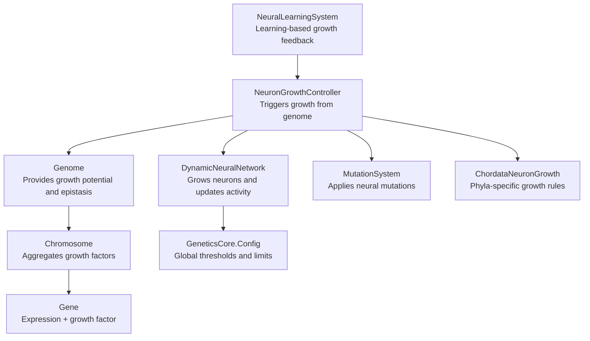
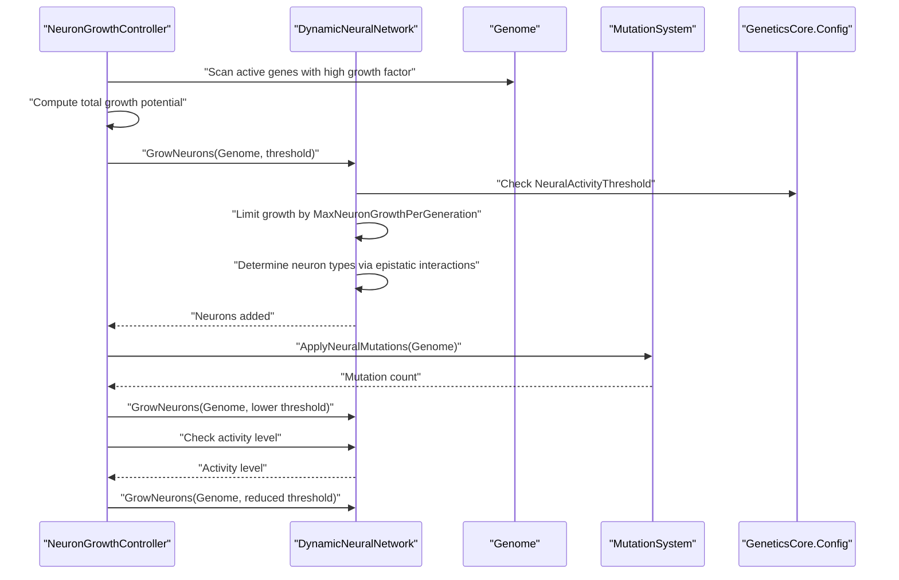
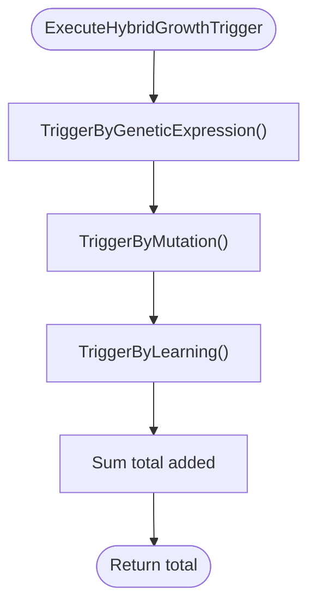
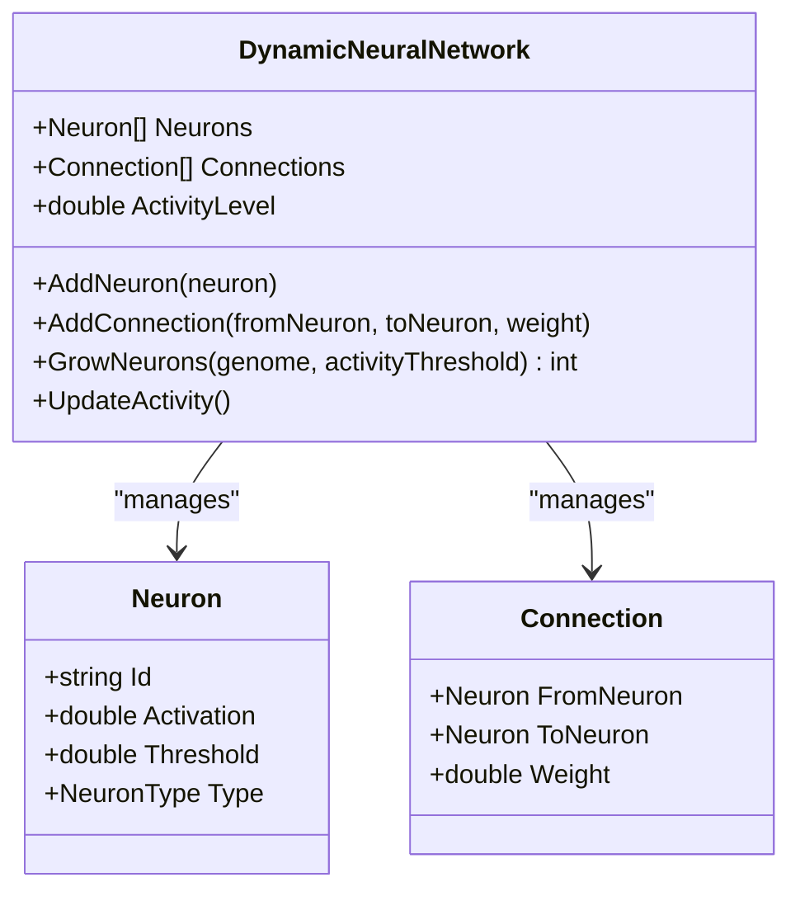
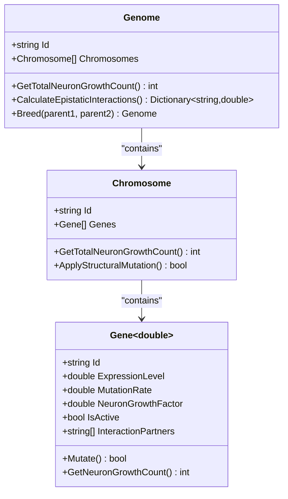
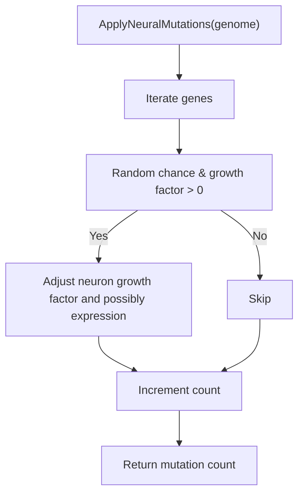
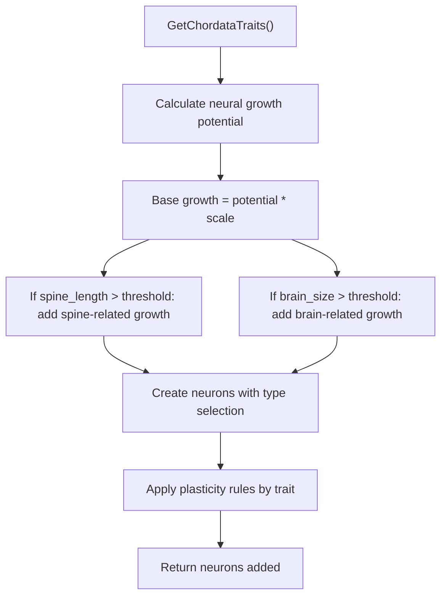
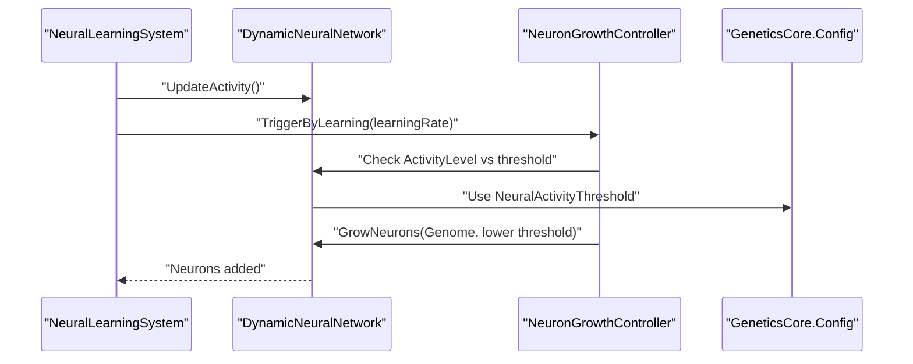
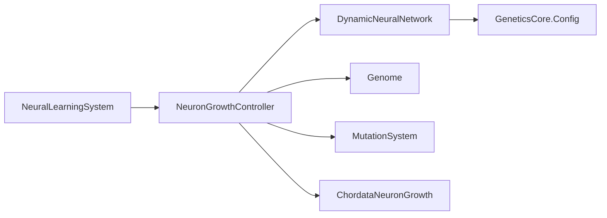

# Neuron Growth Controller

<cite>
**Referenced Files in This Document**
- [NeuronGrowthController.cs](file://GeneticsGame/Systems/NeuronGrowthController.cs)
- [DynamicNeuralNetwork.cs](file://GeneticsGame/Systems/DynamicNeuralNetwork.cs)
- [Neuron.cs](file://GeneticsGame/Systems/Neuron.cs)
- [Connection.cs](file://GeneticsGame/Systems/Connection.cs)
- [Genome.cs](file://GeneticsGame/Core/Genome.cs)
- [Chromosome.cs](file://GeneticsGame/Core/Chromosome.cs)
- [Gene.cs](file://GeneticsGame/Core/Gene.cs)
- [MutationSystem.cs](file://GeneticsGame/Core/MutationSystem.cs)
- [GeneticsCore.cs](file://GeneticsGame/Core/GeneticsCore.cs)
- [ChordataNeuronGrowth.cs](file://GeneticsGame/Phyla/Chordata/ChordataNeuronGrowth.cs)
- [ChordataGenome.cs](file://GeneticsGame/Phyla/Chordata/ChordataGenome.cs)
- [NeuralLearningSystem.cs](file://GeneticsGame/Systems/NeuralLearningSystem.cs)
</cite>

## Table of Contents
1. [Introduction](#introduction)
2. [Project Structure](#project-structure)
3. [Core Components](#core-components)
4. [Architecture Overview](#architecture-overview)
5. [Detailed Component Analysis](#detailed-component-analysis)
6. [Dependency Analysis](#dependency-analysis)
7. [Performance Considerations](#performance-considerations)
8. [Troubleshooting Guide](#troubleshooting-guide)
9. [Conclusion](#conclusion)

## Introduction
This document explains the Neuron Growth Controller, a central component that coordinates neuron development according to genetic instructions. It details how genetic signals are translated into specific neuron growth patterns and timing, how growth regulation mechanisms prevent uncontrolled neural expansion while enabling adaptive development, and how genetic factors such as epistatic interactions and growth potential calculations integrate with the broader system. The document also illustrates how different genetic configurations produce distinct neural architectures and developmental trajectories, and addresses the balance between genetic determinism and environmental influence in neural development.

## Project Structure
The Neuron Growth Controller sits at the intersection of genetic systems and neural network dynamics. It orchestrates growth triggers based on:
- Genetic expression levels and neuron growth factors
- Mutation events that alter growth parameters
- Learning-driven activity feedback

**Diagram sources**
- [NeuronGrowthController.cs:1-122](file://GeneticsGame/Systems/NeuronGrowthController.cs#L1-L122)
- [DynamicNeuralNetwork.cs:1-116](file://GeneticsGame/Systems/DynamicNeuralNetwork.cs#L1-L116)
- [Genome.cs:1-190](file://GeneticsGame/Core/Genome.cs#L1-L190)
- [Chromosome.cs:1-146](file://GeneticsGame/Core/Chromosome.cs#L1-L146)
- [Gene.cs:1-93](file://GeneticsGame/Core/Gene.cs#L1-L93)
- [MutationSystem.cs:1-137](file://GeneticsGame/Core/MutationSystem.cs#L1-L137)
- [GeneticsCore.cs:1-21](file://GeneticsGame/Core/GeneticsCore.cs#L1-L21)
- [ChordataNeuronGrowth.cs:1-216](file://GeneticsGame/Phyla/Chordata/ChordataNeuronGrowth.cs#L1-L216)
- [NeuralLearningSystem.cs:1-122](file://GeneticsGame/Systems/NeuralLearningSystem.cs#L1-L122)

**Section sources**
- [NeuronGrowthController.cs:1-122](file://GeneticsGame/Systems/NeuronGrowthController.cs#L1-L122)
- [DynamicNeuralNetwork.cs:1-116](file://GeneticsGame/Systems/DynamicNeuralNetwork.cs#L1-L116)
- [Genome.cs:1-190](file://GeneticsGame/Core/Genome.cs#L1-L190)
- [Chromosome.cs:1-146](file://GeneticsGame/Core/Chromosome.cs#L1-L146)
- [Gene.cs:1-93](file://GeneticsGame/Core/Gene.cs#L1-L93)
- [MutationSystem.cs:1-137](file://GeneticsGame/Core/MutationSystem.cs#L1-L137)
- [GeneticsCore.cs:1-21](file://GeneticsGame/Core/GeneticsCore.cs#L1-L21)
- [ChordataNeuronGrowth.cs:1-216](file://GeneticsGame/Phyla/Chordata/ChordataNeuronGrowth.cs#L1-L216)
- [NeuralLearningSystem.cs:1-122](file://GeneticsGame/Systems/NeuralLearningSystem.cs#L1-L122)

## Core Components
- NeuronGrowthController: Central coordinator that triggers neuron growth from three sources—genetic expression, mutation, and learning—then applies growth to the neural network.
- DynamicNeuralNetwork: Maintains the neuron population, connection weights, and activity level; enforces growth limits and determines neuron types based on epistatic interactions.
- Genome/Chromosome/Gene: Provide growth potential, expression levels, mutation rates, and epistatic interactions that drive growth decisions.
- MutationSystem: Applies neural-specific mutations that can alter neuron growth factors and expression levels.
- GeneticsCore.Config: Defines global thresholds and limits (e.g., neural activity threshold and maximum growth per generation).
- ChordataNeuronGrowth: Implements phyla-specific growth patterns and plasticity rules for vertebrate-like creatures.
- NeuralLearningSystem: Drives learning-based growth feedback and environment/task adaptation.

**Section sources**
- [NeuronGrowthController.cs:1-122](file://GeneticsGame/Systems/NeuronGrowthController.cs#L1-L122)
- [DynamicNeuralNetwork.cs:1-116](file://GeneticsGame/Systems/DynamicNeuralNetwork.cs#L1-L116)
- [Genome.cs:1-190](file://GeneticsGame/Core/Genome.cs#L1-L190)
- [MutationSystem.cs:1-137](file://GeneticsGame/Core/MutationSystem.cs#L1-L137)
- [GeneticsCore.cs:1-21](file://GeneticsGame/Core/GeneticsCore.cs#L1-L21)
- [ChordataNeuronGrowth.cs:1-216](file://GeneticsGame/Phyla/Chordata/ChordataNeuronGrowth.cs#L1-L216)
- [NeuralLearningSystem.cs:1-122](file://GeneticsGame/Systems/NeuralLearningSystem.cs#L1-L122)

## Architecture Overview
The Neuron Growth Controller operates as a hybrid growth trigger system:
- Genetic expression trigger: Scans the genome for active genes with high neuron growth factors and expression levels, computes total growth potential, and grows neurons accordingly.
- Mutation trigger: Applies neural-specific mutations, then triggers growth with a lower activity threshold.
- Learning trigger: Uses neural activity levels to drive growth, scaling growth with activity and temporarily lowering the threshold for learning-triggered growth.

**Diagram sources**
- [NeuronGrowthController.cs:36-121](file://GeneticsGame/Systems/NeuronGrowthController.cs#L36-L121)
- [DynamicNeuralNetwork.cs:63-99](file://GeneticsGame/Systems/DynamicNeuralNetwork.cs#L63-L99)
- [GeneticsCore.cs:14-19](file://GeneticsGame/Core/GeneticsCore.cs#L14-L19)
- [MutationSystem.cs:111-136](file://GeneticsGame/Core/MutationSystem.cs#L111-L136)

## Detailed Component Analysis

### NeuronGrowthController
Responsibilities:
- Manage neuron growth triggers from genetic expression, mutation, and learning.
- Coordinate growth application to the neural network with appropriate thresholds.
- Enforce priority ordering: genetic expression > mutation > learning.

Key behaviors:
- Genetic expression trigger: Filters active genes with high neuron growth factor and expression level, sums their growth potential, and delegates growth to the neural network.
- Mutation trigger: Applies neural-specific mutations and triggers growth with a lower activity threshold.
- Learning trigger: Checks activity level against a scaled threshold and triggers growth proportional to activity.
- Hybrid execution: Executes triggers in priority order and aggregates total neurons added.

**Diagram sources**
- [NeuronGrowthController.cs:107-121](file://GeneticsGame/Systems/NeuronGrowthController.cs#L107-L121)
- [NeuronGrowthController.cs:36-101](file://GeneticsGame/Systems/NeuronGrowthController.cs#L36-L101)

**Section sources**
- [NeuronGrowthController.cs:1-122](file://GeneticsGame/Systems/NeuronGrowthController.cs#L1-L122)

### DynamicNeuralNetwork
Responsibilities:
- Maintain neuron and connection collections.
- Compute activity level as the average neuron activation.
- Grow neurons based on genetic triggers and activity thresholds.
- Determine neuron types based on epistatic interactions.

Growth regulation mechanisms:
- Activity threshold gating: Growth occurs only when activity exceeds a configured threshold.
- Maximum growth cap: Limits growth per generation to prevent runaway expansion.
- Epistatic neuron typing: Specialized neuron types (Mutation, Learning) are assigned when epistatic interactions exceed thresholds.

**Diagram sources**
- [DynamicNeuralNetwork.cs:9-116](file://GeneticsGame/Systems/DynamicNeuralNetwork.cs#L9-L116)
- [Neuron.cs:7-70](file://GeneticsGame/Systems/Neuron.cs#L7-L70)
- [Connection.cs:6-35](file://GeneticsGame/Systems/Connection.cs#L6-L35)

**Section sources**
- [DynamicNeuralNetwork.cs:1-116](file://GeneticsGame/Systems/DynamicNeuralNetwork.cs#L1-L116)

### Genetic Factors and Growth Potential
- Genome: Aggregates chromosomes and genes, calculates total neuron growth potential, and computes epistatic interactions.
- Chromosome: Sums growth contributions from genes.
- Gene: Provides expression level, mutation rate, neuron growth factor, and epistatic interaction partners. Growth count is derived from expression level and growth factor.

**Diagram sources**
- [Genome.cs:9-190](file://GeneticsGame/Core/Genome.cs#L9-L190)
- [Chromosome.cs:9-146](file://GeneticsGame/Core/Chromosome.cs#L9-L146)
- [Gene.cs:9-93](file://GeneticsGame/Core/Gene.cs#L9-L93)

**Section sources**
- [Genome.cs:1-190](file://GeneticsGame/Core/Genome.cs#L1-L190)
- [Chromosome.cs:1-146](file://GeneticsGame/Core/Chromosome.cs#L1-L146)
- [Gene.cs:1-93](file://GeneticsGame/Core/Gene.cs#L1-L93)

### Mutation System and Neural Mutations
- MutationSystem applies point, structural, and epigenetic mutations across the genome.
- Neural-specific mutations target genes with neuron growth factors, potentially increasing or decreasing growth potential and expression levels.
- These mutations can seed subsequent growth triggers through the mutation-triggered pathway.

**Diagram sources**
- [MutationSystem.cs:111-136](file://GeneticsGame/Core/MutationSystem.cs#L111-L136)

**Section sources**
- [MutationSystem.cs:1-137](file://GeneticsGame/Core/MutationSystem.cs#L1-L137)

### Chordata-Specific Growth Patterns
- ChordataNeuronGrowth implements vertebrate-like growth rules, calculating growth potential from traits such as neuron count, brain size, and synapse density.
- It creates specialized neuron types (Visual, Movement, General) based on sensory and motor traits and applies plasticity rules to strengthen relevant connections.

**Diagram sources**
- [ChordataNeuronGrowth.cs:36-103](file://GeneticsGame/Phyla/Chordata/ChordataNeuronGrowth.cs#L36-L103)
- [ChordataGenome.cs:76-95](file://GeneticsGame/Phyla/Chordata/ChordataGenome.cs#L76-L95)

**Section sources**
- [ChordataNeuronGrowth.cs:1-216](file://GeneticsGame/Phyla/Chordata/ChordataNeuronGrowth.cs#L1-L216)
- [ChordataGenome.cs:1-134](file://GeneticsGame/Phyla/Chordata/ChordataGenome.cs#L1-L134)

### Learning-Based Growth Feedback
- NeuralLearningSystem updates network activity and builds/prunes synapses based on activity.
- It triggers neuron growth via the NeuronGrowthController’s learning pathway, using a reduced activity threshold and scaling growth with learning rate.
- It also computes adaptation scores influenced by environment and task requirements, modulated by genetic constraints.

**Diagram sources**
- [NeuralLearningSystem.cs:37-57](file://GeneticsGame/Systems/NeuralLearningSystem.cs#L37-L57)
- [NeuronGrowthController.cs:88-101](file://GeneticsGame/Systems/NeuronGrowthController.cs#L88-L101)
- [GeneticsCore.cs:14-19](file://GeneticsGame/Core/GeneticsCore.cs#L14-L19)

**Section sources**
- [NeuralLearningSystem.cs:1-122](file://GeneticsGame/Systems/NeuralLearningSystem.cs#L1-L122)
- [NeuronGrowthController.cs:88-101](file://GeneticsGame/Systems/NeuronGrowthController.cs#L88-L101)

## Dependency Analysis
The Neuron Growth Controller depends on:
- DynamicNeuralNetwork for growth application and activity computation.
- Genome for growth potential and epistatic interactions.
- MutationSystem for neural-specific mutations.
- GeneticsCore.Config for thresholds and limits.
- ChordataNeuronGrowth for phyla-specific growth rules.
- NeuralLearningSystem for learning-driven growth feedback.

**Diagram sources**
- [NeuronGrowthController.cs:1-122](file://GeneticsGame/Systems/NeuronGrowthController.cs#L1-L122)
- [DynamicNeuralNetwork.cs:1-116](file://GeneticsGame/Systems/DynamicNeuralNetwork.cs#L1-L116)
- [GeneticsCore.cs:1-21](file://GeneticsGame/Core/GeneticsCore.cs#L1-L21)
- [ChordataNeuronGrowth.cs:1-216](file://GeneticsGame/Phyla/Chordata/ChordataNeuronGrowth.cs#L1-L216)
- [NeuralLearningSystem.cs:1-122](file://GeneticsGame/Systems/NeuralLearningSystem.cs#L1-L122)

**Section sources**
- [NeuronGrowthController.cs:1-122](file://GeneticsGame/Systems/NeuronGrowthController.cs#L1-L122)
- [DynamicNeuralNetwork.cs:1-116](file://GeneticsGame/Systems/DynamicNeuralNetwork.cs#L1-L116)
- [GeneticsCore.cs:1-21](file://GeneticsGame/Core/GeneticsCore.cs#L1-L21)
- [ChordataNeuronGrowth.cs:1-216](file://GeneticsGame/Phyla/Chordata/ChordataNeuronGrowth.cs#L1-L216)
- [NeuralLearningSystem.cs:1-122](file://GeneticsGame/Systems/NeuralLearningSystem.cs#L1-L122)

## Performance Considerations
- Growth caps: The neural network enforces a maximum growth per generation to prevent exponential expansion.
- Threshold gating: Growth requires meeting an activity threshold, reducing unnecessary growth cycles.
- Epistatic typing: Assigning neuron types based on epistatic interactions avoids costly re-evaluation of all genes for each neuron.
- Priority ordering: Executing genetic expression first ensures deterministic baseline growth before mutation and learning triggers.

[No sources needed since this section provides general guidance]

## Troubleshooting Guide
Common issues and resolutions:
- No growth despite high expression: Verify that the neural activity threshold is met and that genes are active. Check that growth potential is computed from active genes with sufficient neuron growth factors.
- Excessive growth: Confirm that the maximum growth per generation limit is in effect and that activity thresholds are appropriately set.
- Mutation-triggered growth not occurring: Ensure neural-specific mutations are being applied and that the mutation count is positive; confirm the lower threshold is reached.
- Learning-triggered growth inconsistent: Validate that the neural network activity level exceeds the scaled threshold and that the learning rate is sufficiently high.

**Section sources**
- [DynamicNeuralNetwork.cs:63-99](file://GeneticsGame/Systems/DynamicNeuralNetwork.cs#L63-L99)
- [NeuronGrowthController.cs:36-101](file://GeneticsGame/Systems/NeuronGrowthController.cs#L36-L101)
- [GeneticsCore.cs:14-19](file://GeneticsGame/Core/GeneticsCore.cs#L14-L19)

## Conclusion
The Neuron Growth Controller integrates genetic determinism with environmental influence to orchestrate adaptive neural development. Through a hybrid trigger system—genetic expression, mutation, and learning—it translates genetic signals into precise growth patterns while enforcing robust growth regulation. Epistatic interactions and growth potential calculations ensure that neuron types and quantities reflect both hereditary instructions and emergent activity. Phyla-specific implementations, such as ChordataNeuronGrowth, demonstrate how evolutionary constraints shape neural architecture. This design balances stability and adaptability, enabling creatures to develop functional neural networks responsive to both genetic blueprints and environmental demands.