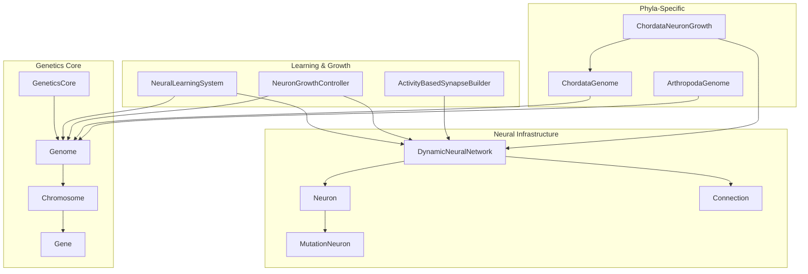
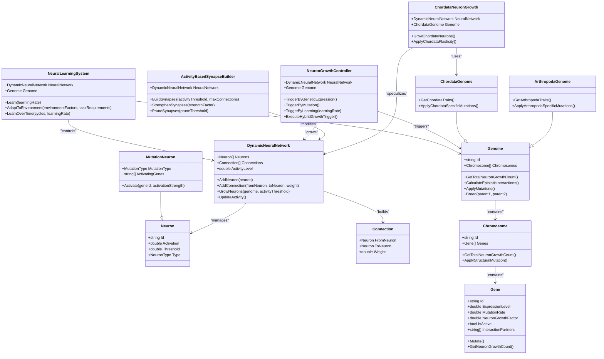
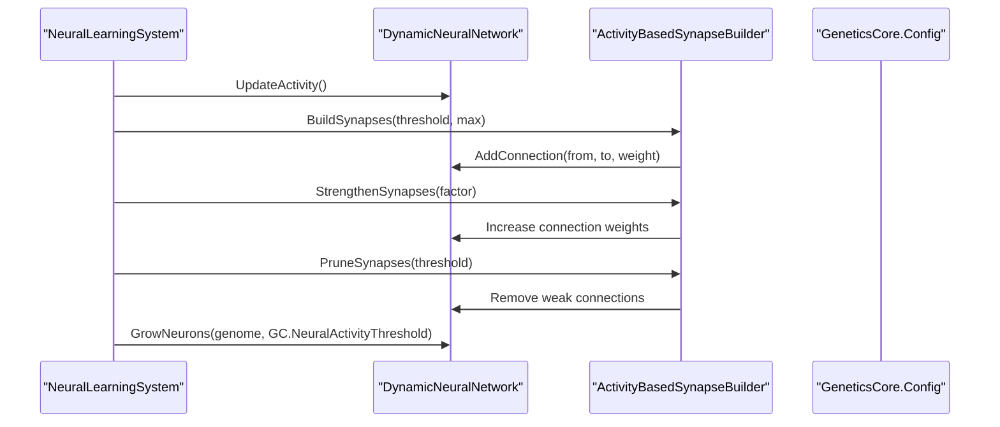
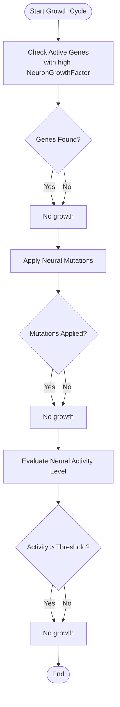
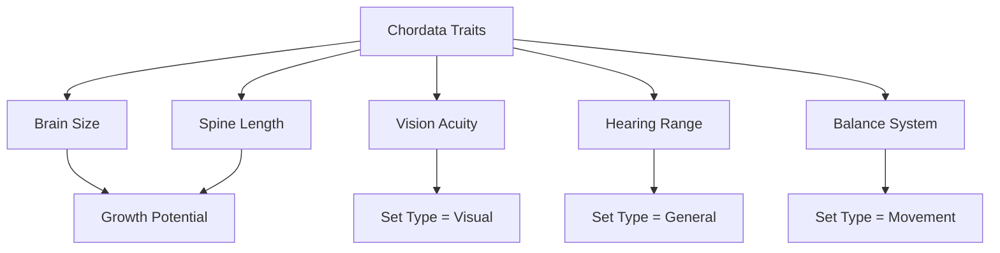
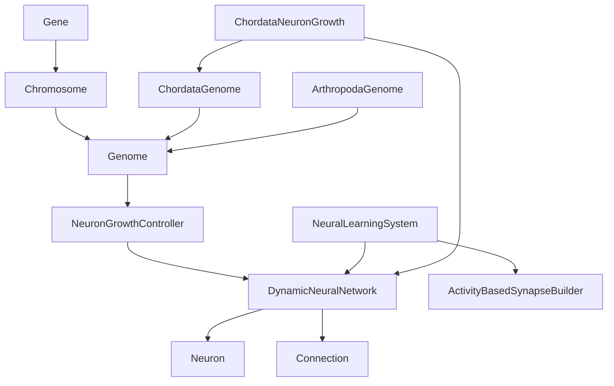

# Neuron System

<cite>
**Referenced Files in This Document**
- [Neuron.cs](file://GeneticsGame/Systems/Neuron.cs)
- [MutationNeuron.cs](file://GeneticsGame/Systems/MutationNeuron.cs)
- [DynamicNeuralNetwork.cs](file://GeneticsGame/Systems/DynamicNeuralNetwork.cs)
- [Connection.cs](file://GeneticsGame/Systems/Connection.cs)
- [NeuralLearningSystem.cs](file://GeneticsGame/Systems/NeuralLearningSystem.cs)
- [NeuronGrowthController.cs](file://GeneticsGame/Systems/NeuronGrowthController.cs)
- [ActivityBasedSynapseBuilder.cs](file://GeneticsGame/Systems/ActivityBasedSynapseBuilder.cs)
- [Genome.cs](file://GeneticsGame/Core/Genome.cs)
- [Gene.cs](file://GeneticsGame/Core/Gene.cs)
- [Chromosome.cs](file://GeneticsGame/Core/Chromosome.cs)
- [GeneticsCore.cs](file://GeneticsGame/Core/GeneticsCore.cs)
- [ChordataNeuronGrowth.cs](file://GeneticsGame/Phyla/Chordata/ChordataNeuronGrowth.cs)
- [ChordataGenome.cs](file://GeneticsGame/Phyla/Chordata/ChordataGenome.cs)
- [ArthropodaGenome.cs](file://GeneticsGame/Phyla/Arthropoda/ArthropodaGenome.cs)
</cite>

## Table of Contents
1. [Introduction](#introduction)
2. [Project Structure](#project-structure)
3. [Core Components](#core-components)
4. [Architecture Overview](#architecture-overview)
5. [Detailed Component Analysis](#detailed-component-analysis)
6. [Dependency Analysis](#dependency-analysis)
7. [Performance Considerations](#performance-considerations)
8. [Troubleshooting Guide](#troubleshooting-guide)
9. [Conclusion](#conclusion)

## Introduction
This document provides comprehensive documentation for the Neuron class and the broader genetic neural network system. It explains neuron properties (Id, Activation, Threshold, Type), neuron types (General, Mutation, Learning, Movement, Visual), activation mechanisms, genetic influences on neuron characteristics, and connectivity patterns. It also covers how genetic inheritance and environmental factors shape neural circuit formation and growth.

## Project Structure
The neuron system is composed of core genetic components (Genome, Chromosome, Gene), neural network infrastructure (Neuron, Connection, DynamicNeuralNetwork), specialized neuron types (MutationNeuron), learning and growth controllers (NeuralLearningSystem, NeuronGrowthController), and phyla-specific implementations (ChordataNeuronGrowth, ChordataGenome, ArthropodaGenome).

**Diagram sources**
- [Genome.cs:1-190](file://GeneticsGame/Core/Genome.cs#L1-L190)
- [Chromosome.cs:1-146](file://GeneticsGame/Core/Chromosome.cs#L1-L146)
- [Gene.cs:1-93](file://GeneticsGame/Core/Gene.cs#L1-L93)
- [GeneticsCore.cs:1-21](file://GeneticsGame/Core/GeneticsCore.cs#L1-L21)
- [Neuron.cs:1-70](file://GeneticsGame/Systems/Neuron.cs#L1-L70)
- [MutationNeuron.cs:1-75](file://GeneticsGame/Systems/MutationNeuron.cs#L1-L75)
- [Connection.cs:1-35](file://GeneticsGame/Systems/Connection.cs#L1-L35)
- [DynamicNeuralNetwork.cs:1-116](file://GeneticsGame/Systems/DynamicNeuralNetwork.cs#L1-L116)
- [NeuralLearningSystem.cs:1-122](file://GeneticsGame/Systems/NeuralLearningSystem.cs#L1-L122)
- [NeuronGrowthController.cs:1-122](file://GeneticsGame/Systems/NeuronGrowthController.cs#L1-L122)
- [ActivityBasedSynapseBuilder.cs:1-112](file://GeneticsGame/Systems/ActivityBasedSynapseBuilder.cs#L1-L112)
- [ChordataNeuronGrowth.cs:1-216](file://GeneticsGame/Phyla/Chordata/ChordataNeuronGrowth.cs#L1-L216)
- [ChordataGenome.cs:1-134](file://GeneticsGame/Phyla/Chordata/ChordataGenome.cs#L1-L134)
- [ArthropodaGenome.cs:1-134](file://GeneticsGame/Phyla/Arthropoda/ArthropodaGenome.cs#L1-L134)

**Section sources**
- [Genome.cs:1-190](file://GeneticsGame/Core/Genome.cs#L1-L190)
- [Chromosome.cs:1-146](file://GeneticsGame/Core/Chromosome.cs#L1-L146)
- [Gene.cs:1-93](file://GeneticsGame/Core/Gene.cs#L1-L93)
- [GeneticsCore.cs:1-21](file://GeneticsGame/Core/GeneticsCore.cs#L1-L21)
- [Neuron.cs:1-70](file://GeneticsGame/Systems/Neuron.cs#L1-L70)
- [MutationNeuron.cs:1-75](file://GeneticsGame/Systems/MutationNeuron.cs#L1-L75)
- [Connection.cs:1-35](file://GeneticsGame/Systems/Connection.cs#L1-L35)
- [DynamicNeuralNetwork.cs:1-116](file://GeneticsGame/Systems/DynamicNeuralNetwork.cs#L1-L116)
- [NeuralLearningSystem.cs:1-122](file://GeneticsGame/Systems/NeuralLearningSystem.cs#L1-L122)
- [NeuronGrowthController.cs:1-122](file://GeneticsGame/Systems/NeuronGrowthController.cs#L1-L122)
- [ActivityBasedSynapseBuilder.cs:1-112](file://GeneticsGame/Systems/ActivityBasedSynapseBuilder.cs#L1-L112)
- [ChordataNeuronGrowth.cs:1-216](file://GeneticsGame/Phyla/Chordata/ChordataNeuronGrowth.cs#L1-L216)
- [ChordataGenome.cs:1-134](file://GeneticsGame/Phyla/Chordata/ChordataGenome.cs#L1-L134)
- [ArthropodaGenome.cs:1-134](file://GeneticsGame/Phyla/Arthropoda/ArthropodaGenome.cs#L1-L134)

## Core Components
- Neuron: Represents a single neural unit with Id, Activation, Threshold, and Type. Supports dynamic creation and integration into a neural network.
- MutationNeuron: A specialized neuron type activated by genetic mutations, with properties for mutation type and activating genes.
- DynamicNeuralNetwork: Manages neuron lists, connections, and growth based on genetic triggers and activity levels.
- Connection: Represents synaptic links between neurons with weights.
- NeuralLearningSystem: Orchestrates learning cycles, synapse building, pruning, strengthening, and growth triggers.
- NeuronGrowthController: Hybrid controller that triggers neuron growth via genetic expression, mutations, and learning.
- ActivityBasedSynapseBuilder: Implements Hebbian-style synapse formation and maintenance.
- Genome, Chromosome, Gene: Core genetic structures that encode neuron growth potential and epistatic interactions.
- ChordataNeuronGrowth: Phyla-specific growth logic for chordate-like creatures, including trait-based neuron specialization and plasticity.
- ChordataGenome, ArthropodaGenome: Specialized genomes with phyla-specific traits influencing neuron growth and mutation rates.

**Section sources**
- [Neuron.cs:1-70](file://GeneticsGame/Systems/Neuron.cs#L1-L70)
- [MutationNeuron.cs:1-75](file://GeneticsGame/Systems/MutationNeuron.cs#L1-L75)
- [DynamicNeuralNetwork.cs:1-116](file://GeneticsGame/Systems/DynamicNeuralNetwork.cs#L1-L116)
- [Connection.cs:1-35](file://GeneticsGame/Systems/Connection.cs#L1-L35)
- [NeuralLearningSystem.cs:1-122](file://GeneticsGame/Systems/NeuralLearningSystem.cs#L1-L122)
- [NeuronGrowthController.cs:1-122](file://GeneticsGame/Systems/NeuronGrowthController.cs#L1-L122)
- [ActivityBasedSynapseBuilder.cs:1-112](file://GeneticsGame/Systems/ActivityBasedSynapseBuilder.cs#L1-L112)
- [Genome.cs:1-190](file://GeneticsGame/Core/Genome.cs#L1-L190)
- [Chromosome.cs:1-146](file://GeneticsGame/Core/Chromosome.cs#L1-L146)
- [Gene.cs:1-93](file://GeneticsGame/Core/Gene.cs#L1-L93)
- [ChordataNeuronGrowth.cs:1-216](file://GeneticsGame/Phyla/Chordata/ChordataNeuronGrowth.cs#L1-L216)
- [ChordataGenome.cs:1-134](file://GeneticsGame/Phyla/Chordata/ChordataGenome.cs#L1-L134)
- [ArthropodaGenome.cs:1-134](file://GeneticsGame/Phyla/Arthropoda/ArthropodaGenome.cs#L1-L134)

## Architecture Overview
The neuron system integrates genetics with neural dynamics:
- Genetic factors encoded in Gene and Chromosome influence neuron growth potential and activation thresholds.
- DynamicNeuralNetwork manages neuron population and connectivity.
- NeuronGrowthController triggers growth based on genetic expression, mutations, and learning activity.
- NeuralLearningSystem coordinates synapse formation and pruning, and growth feedback.
- ChordataNeuronGrowth applies phyla-specific rules to neuron specialization and plasticity.

**Diagram sources**
- [Neuron.cs:1-70](file://GeneticsGame/Systems/Neuron.cs#L1-L70)
- [MutationNeuron.cs:1-75](file://GeneticsGame/Systems/MutationNeuron.cs#L1-L75)
- [Connection.cs:1-35](file://GeneticsGame/Systems/Connection.cs#L1-L35)
- [DynamicNeuralNetwork.cs:1-116](file://GeneticsGame/Systems/DynamicNeuralNetwork.cs#L1-L116)
- [NeuralLearningSystem.cs:1-122](file://GeneticsGame/Systems/NeuralLearningSystem.cs#L1-L122)
- [NeuronGrowthController.cs:1-122](file://GeneticsGame/Systems/NeuronGrowthController.cs#L1-L122)
- [ActivityBasedSynapseBuilder.cs:1-112](file://GeneticsGame/Systems/ActivityBasedSynapseBuilder.cs#L1-L112)
- [Genome.cs:1-190](file://GeneticsGame/Core/Genome.cs#L1-L190)
- [Chromosome.cs:1-146](file://GeneticsGame/Core/Chromosome.cs#L1-L146)
- [Gene.cs:1-93](file://GeneticsGame/Core/Gene.cs#L1-L93)
- [ChordataNeuronGrowth.cs:1-216](file://GeneticsGame/Phyla/Chordata/ChordataNeuronGrowth.cs#L1-L216)
- [ChordataGenome.cs:1-134](file://GeneticsGame/Phyla/Chordata/ChordataGenome.cs#L1-L134)
- [ArthropodaGenome.cs:1-134](file://GeneticsGame/Phyla/Arthropoda/ArthropodaGenome.cs#L1-L134)

## Detailed Component Analysis

### Neuron Properties and Activation Mechanisms
- Id: Unique identifier generated at construction time.
- Activation: Continuous value between 0.0 and 1.0 representing neuron activity.
- Threshold: Minimum activation required for firing; influences responsiveness.
- Type: Enumeration determining neuron specialization and behavior.

Activation response:
- Neurons are initialized with random activation and threshold values.
- Activation can be increased by external triggers (e.g., mutation neuron activation).
- Network activity level is computed as the average activation across all neurons.

Specialized neuron types:
- General: Default neuron type for basic processing.
- Mutation: Activated by genetic mutations; lower threshold and initial low activation.
- Learning: Involved in learning processes; contributes to adaptive growth and plasticity.
- Movement: Controls motor functions; specialized in movement-related tasks.
- Visual: Processes visual inputs; strengthens connections in visual pathways.

**Section sources**
- [Neuron.cs:1-70](file://GeneticsGame/Systems/Neuron.cs#L1-L70)
- [MutationNeuron.cs:1-75](file://GeneticsGame/Systems/MutationNeuron.cs#L1-L75)
- [DynamicNeuralNetwork.cs:104-115](file://GeneticsGame/Systems/DynamicNeuralNetwork.cs#L104-L115)

### Genetic Factors Influencing Neuron Characteristics
- Gene: Encodes expression level, mutation rate, neuron growth factor, activity state, and epistatic interaction partners.
- Chromosome: Aggregates genes and supports structural mutations (deletion, duplication, inversion, translocation).
- Genome: Provides total neuron growth potential, epistatic interactions, and breeding mechanics.

Key genetic influences:
- NeuronGrowthFactor determines how many neurons a gene can trigger when expressed.
- ExpressionLevel modulates growth potential and activity-dependent behaviors.
- Epistatic interactions guide neuron type assignment during growth (e.g., neuron-related interactions favor Mutation; learning-related interactions favor Learning).

**Section sources**
- [Gene.cs:1-93](file://GeneticsGame/Core/Gene.cs#L1-L93)
- [Chromosome.cs:1-146](file://GeneticsGame/Core/Chromosome.cs#L1-L146)
- [Genome.cs:1-190](file://GeneticsGame/Core/Genome.cs#L1-L190)
- [DynamicNeuralNetwork.cs:84-92](file://GeneticsGame/Systems/DynamicNeuralNetwork.cs#L84-L92)

### Neuron Connectivity Patterns and Plasticity
- Connections represent synapses with weights indicating connection strength.
- ActivityBasedSynapseBuilder creates new connections between active neurons and strengthens existing ones based on activity correlation.
- Weak connections are pruned to maintain efficient circuits.
- ChordataNeuronGrowth applies phyla-specific plasticity rules to enhance visual and movement pathways.

**Diagram sources**
- [NeuralLearningSystem.cs:37-57](file://GeneticsGame/Systems/NeuralLearningSystem.cs#L37-L57)
- [ActivityBasedSynapseBuilder.cs:31-111](file://GeneticsGame/Systems/ActivityBasedSynapseBuilder.cs#L31-L111)
- [DynamicNeuralNetwork.cs:63-99](file://GeneticsGame/Systems/DynamicNeuralNetwork.cs#L63-L99)
- [GeneticsCore.cs:14-19](file://GeneticsGame/Core/GeneticsCore.cs#L14-L19)

**Section sources**
- [Connection.cs:1-35](file://GeneticsGame/Systems/Connection.cs#L1-L35)
- [ActivityBasedSynapseBuilder.cs:1-112](file://GeneticsGame/Systems/ActivityBasedSynapseBuilder.cs#L1-L112)
- [ChordataNeuronGrowth.cs:109-215](file://GeneticsGame/Phyla/Chordata/ChordataNeuronGrowth.cs#L109-L215)

### Growth Triggers and Hybrid Control
NeuronGrowthController orchestrates growth via three pathways:
- Genetic expression: Genes with high expression and growth factor trigger neuron addition.
- Mutation: Neural-specific mutations increase growth potential and activity threshold.
- Learning: Elevated network activity promotes additional growth.

**Diagram sources**
- [NeuronGrowthController.cs:36-121](file://GeneticsGame/Systems/NeuronGrowthController.cs#L36-L121)
- [GeneticsCore.cs:14-19](file://GeneticsGame/Core/GeneticsCore.cs#L14-L19)

**Section sources**
- [NeuronGrowthController.cs:1-122](file://GeneticsGame/Systems/NeuronGrowthController.cs#L1-L122)
- [DynamicNeuralNetwork.cs:63-99](file://GeneticsGame/Systems/DynamicNeuralNetwork.cs#L63-L99)

### Phyla-Specific Neuron Characteristics
ChordataNeuronGrowth:
- Uses traits like brain size, spine length, vision acuity, hearing range, and balance system to determine neuron specialization and growth potential.
- Applies plasticity rules to strengthen visual and movement pathways.

ArthropodaGenome:
- Encodes traits such as ganglion count, nerve cord length, and sensory neuron density, influencing neuron growth and mutation rates.

**Diagram sources**
- [ChordataNeuronGrowth.cs:40-103](file://GeneticsGame/Phyla/Chordata/ChordataNeuronGrowth.cs#L40-L103)
- [ChordataGenome.cs:76-95](file://GeneticsGame/Phyla/Chordata/ChordataGenome.cs#L76-L95)
- [ArthropodaGenome.cs:76-95](file://GeneticsGame/Phyla/Arthropoda/ArthropodaGenome.cs#L76-L95)

**Section sources**
- [ChordataNeuronGrowth.cs:1-216](file://GeneticsGame/Phyla/Chordata/ChordataNeuronGrowth.cs#L1-L216)
- [ChordataGenome.cs:1-134](file://GeneticsGame/Phyla/Chordata/ChordataGenome.cs#L1-L134)
- [ArthropodaGenome.cs:1-134](file://GeneticsGame/Phyla/Arthropoda/ArthropodaGenome.cs#L1-L134)

### Examples: Genetic Inheritance and Environmental Influence
- Genetic inheritance: Offspring genome inherits traits from parents with Mendelian mixing and small expression variations. This affects neuron growth potential and activation thresholds.
- Environmental adaptation: NeuralLearningSystem computes adaptation scores based on environment and task requirements, weighted by neuron counts of specialized types (e.g., Visual, Movement, Learning).

Example scenarios:
- High visual acuity trait increases Visual neuron specialization and strengthens visual pathways.
- Strong movement requirements increase Movement neuron presence and motor pathway strength.
- Learning-driven environments promote Learning neuron growth and synapse strengthening.

**Section sources**
- [Genome.cs:128-189](file://GeneticsGame/Core/Genome.cs#L128-L189)
- [NeuralLearningSystem.cs:65-103](file://GeneticsGame/Systems/NeuralLearningSystem.cs#L65-L103)
- [ChordataNeuronGrowth.cs:142-193](file://GeneticsGame/Phyla/Chordata/ChordataNeuronGrowth.cs#L142-L193)

## Dependency Analysis
The neuron system exhibits layered dependencies:
- Genetic core (Genome, Chromosome, Gene) underpins growth potential and epistatic interactions.
- Neural infrastructure (Neuron, Connection, DynamicNeuralNetwork) manages population and connectivity.
- Controllers (NeuralLearningSystem, NeuronGrowthController) coordinate growth and plasticity.
- Builders (ActivityBasedSynapseBuilder) implement Hebbian learning.
- Phyla-specific modules (ChordataNeuronGrowth, ChordataGenome, ArthropodaGenome) tailor growth to body plans.

**Diagram sources**
- [Gene.cs:1-93](file://GeneticsGame/Core/Gene.cs#L1-L93)
- [Chromosome.cs:1-146](file://GeneticsGame/Core/Chromosome.cs#L1-L146)
- [Genome.cs:1-190](file://GeneticsGame/Core/Genome.cs#L1-L190)
- [NeuronGrowthController.cs:1-122](file://GeneticsGame/Systems/NeuronGrowthController.cs#L1-L122)
- [DynamicNeuralNetwork.cs:1-116](file://GeneticsGame/Systems/DynamicNeuralNetwork.cs#L1-L116)
- [NeuralLearningSystem.cs:1-122](file://GeneticsGame/Systems/NeuralLearningSystem.cs#L1-L122)
- [ActivityBasedSynapseBuilder.cs:1-112](file://GeneticsGame/Systems/ActivityBasedSynapseBuilder.cs#L1-L112)
- [ChordataNeuronGrowth.cs:1-216](file://GeneticsGame/Phyla/Chordata/ChordataNeuronGrowth.cs#L1-L216)
- [ChordataGenome.cs:1-134](file://GeneticsGame/Phyla/Chordata/ChordataGenome.cs#L1-L134)
- [ArthropodaGenome.cs:1-134](file://GeneticsGame/Phyla/Arthropoda/ArthropodaGenome.cs#L1-L134)

**Section sources**
- [Gene.cs:1-93](file://GeneticsGame/Core/Gene.cs#L1-L93)
- [Chromosome.cs:1-146](file://GeneticsGame/Core/Chromosome.cs#L1-L146)
- [Genome.cs:1-190](file://GeneticsGame/Core/Genome.cs#L1-L190)
- [NeuronGrowthController.cs:1-122](file://GeneticsGame/Systems/NeuronGrowthController.cs#L1-L122)
- [DynamicNeuralNetwork.cs:1-116](file://GeneticsGame/Systems/DynamicNeuralNetwork.cs#L1-L116)
- [NeuralLearningSystem.cs:1-122](file://GeneticsGame/Systems/NeuralLearningSystem.cs#L1-L122)
- [ActivityBasedSynapseBuilder.cs:1-112](file://GeneticsGame/Systems/ActivityBasedSynapseBuilder.cs#L1-L112)
- [ChordataNeuronGrowth.cs:1-216](file://GeneticsGame/Phyla/Chordata/ChordataNeuronGrowth.cs#L1-L216)
- [ChordataGenome.cs:1-134](file://GeneticsGame/Phyla/Chordata/ChordataGenome.cs#L1-L134)
- [ArthropodaGenome.cs:1-134](file://GeneticsGame/Phyla/Arthropoda/ArthropodaGenome.cs#L1-L134)

## Performance Considerations
- Network updates: Computing average activation and building/pruning synapses scales with neuron and connection counts. Consider limiting max connections and using efficient filtering for active neurons.
- Growth limits: GeneticsCore.Config.MaxNeuronGrowthPerGeneration caps growth to prevent exponential expansion.
- Activity thresholds: Tuning NeuralActivityThreshold balances growth initiation and stability.

[No sources needed since this section provides general guidance]

## Troubleshooting Guide
Common issues and resolutions:
- No growth occurring: Verify activity thresholds and genetic expression levels. Ensure NeuronGrowthController receives sufficient genetic triggers.
- Overgrown networks: Confirm MaxNeuronGrowthPerGeneration and prune weak synapses regularly.
- Mutation neuron not activating: Check that Activate is called with the correct geneId and that the neuron’s MutationType matches the applied mutation.

**Section sources**
- [GeneticsCore.cs:14-19](file://GeneticsGame/Core/GeneticsCore.cs#L14-L19)
- [NeuronGrowthController.cs:36-121](file://GeneticsGame/Systems/NeuronGrowthController.cs#L36-L121)
- [MutationNeuron.cs:39-48](file://GeneticsGame/Systems/MutationNeuron.cs#L39-L48)

## Conclusion
The Neuron class and associated systems integrate genetic encoding with neural dynamics to produce adaptive, evolving neural networks. Through specialized neuron types, activity-based synapse building, and hybrid growth triggers, the system supports both heritable traits and environmental adaptation. Phyla-specific implementations further tailor neural circuitry to body plans, enabling diverse behavioral capabilities grounded in genetic inheritance and learning.