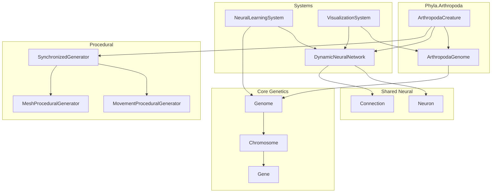
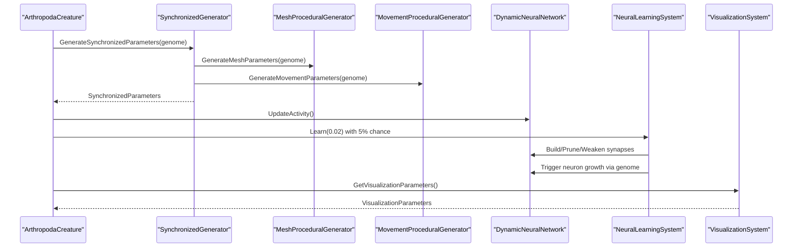
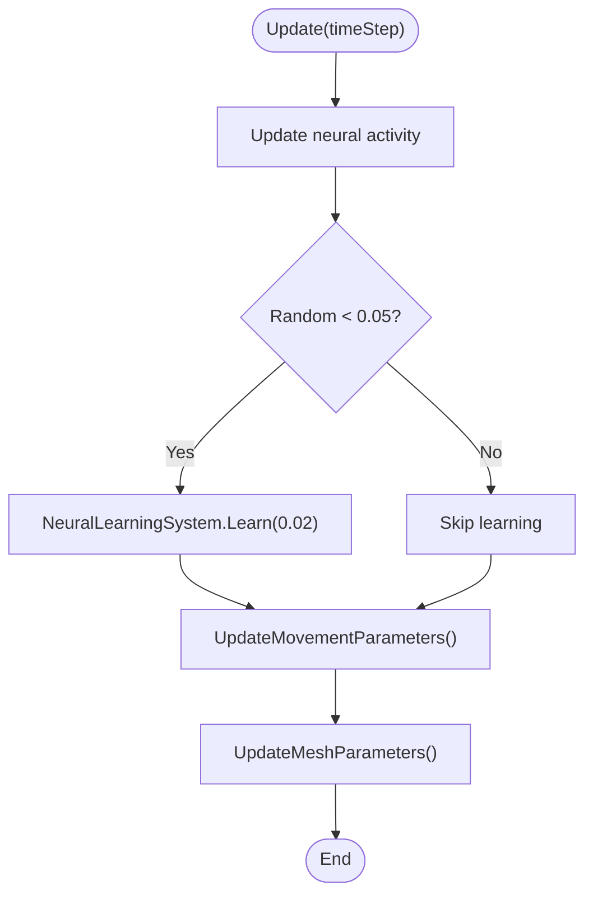
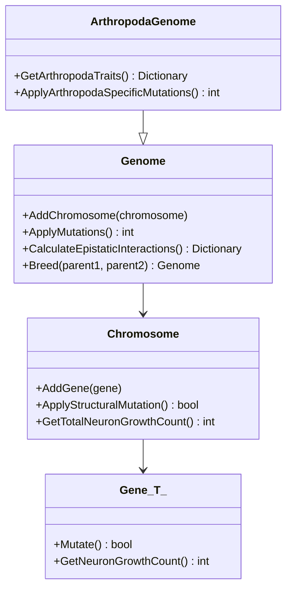
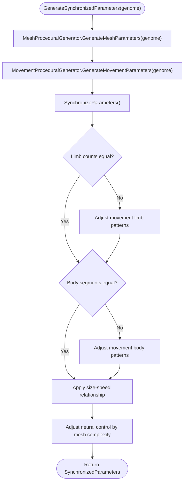
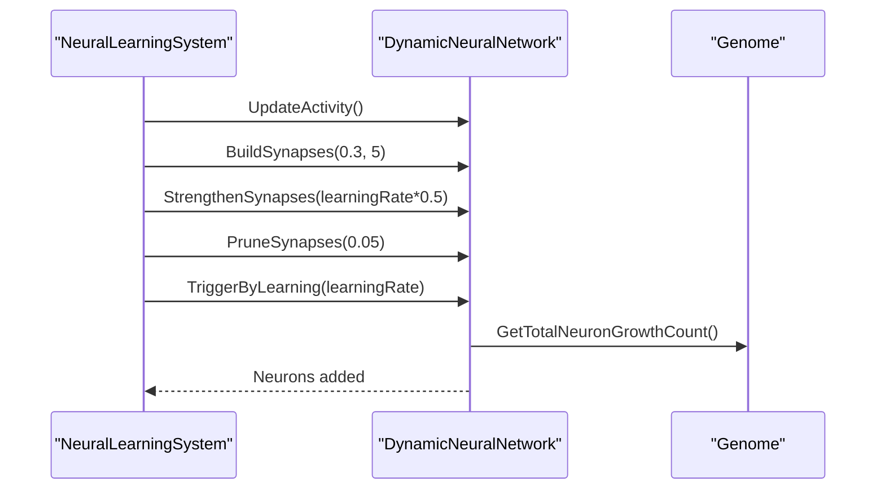
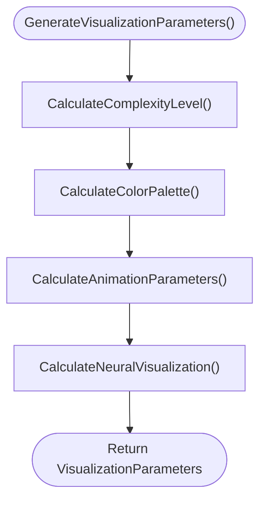
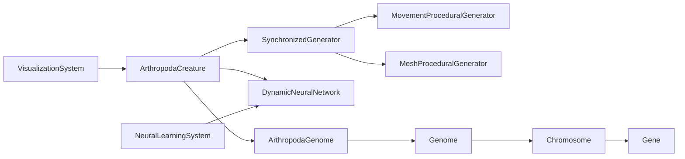

# Arthropoda System

<cite>
**Referenced Files in This Document**
- [ArthropodaCreature.cs](file://GeneticsGame/Phyla/Arthropoda/ArthropodaCreature.cs)
- [ArthropodaGenome.cs](file://GeneticsGame/Phyla/Arthropoda/ArthropodaGenome.cs)
- [Genome.cs](file://GeneticsGame/Core/Genome.cs)
- [Chromosome.cs](file://GeneticsGame/Core/Chromosome.cs)
- [Gene.cs](file://GeneticsGame/Core/Gene.cs)
- [DynamicNeuralNetwork.cs](file://GeneticsGame/Systems/DynamicNeuralNetwork.cs)
- [NeuralLearningSystem.cs](file://GeneticsGame/Systems/NeuralLearningSystem.cs)
- [SynchronizedGenerator.cs](file://GeneticsGame/Procedural/SynchronizedGenerator.cs)
- [MeshProceduralGenerator.cs](file://GeneticsGame/Procedural/Mesh/MeshProceduralGenerator.cs)
- [MovementProceduralGenerator.cs](file://GeneticsGame/Procedural/Movement/MovementProceduralGenerator.cs)
- [VisualizationSystem.cs](file://GeneticsGame/Systems/VisualizationSystem.cs)
- [Neuron.cs](file://GeneticsGame/Systems/Neuron.cs)
- [Connection.cs](file://GeneticsGame/Systems/Connection.cs)
</cite>

## Table of Contents
1. [Introduction](#introduction)
2. [Project Structure](#project-structure)
3. [Core Components](#core-components)
4. [Architecture Overview](#architecture-overview)
5. [Detailed Component Analysis](#detailed-component-analysis)
6. [Dependency Analysis](#dependency-analysis)
7. [Performance Considerations](#performance-considerations)
8. [Troubleshooting Guide](#troubleshooting-guide)
9. [Conclusion](#conclusion)

## Introduction
This document describes the Arthropoda organism classification system within the 3D Genetics Game. It focuses on how the ArthropodaCreature integrates a specialized ArthropodaGenome to produce arthropod-specific morphologies and behaviors, including exoskeleton formation, segmented body plans, joint articulation systems, and specialized appendages. It also explains how genome organization governs segmentation, joint positioning, and sensory organ development, and how a simplified neural system accommodates the arthropod body plan while enabling behavioral complexity.

## Project Structure
The Arthropoda system is organized around a phyla-specific creature and genome implementation, supported by a shared genetics core and procedural generation systems. The key modules are:
- Phyla.Arthropoda: ArthropodaCreature and ArthropodaGenome
- Core: Genome, Chromosome, Gene
- Systems: DynamicNeuralNetwork, NeuralLearningSystem, VisualizationSystem
- Procedural: SynchronizedGenerator, MeshProceduralGenerator, MovementProceduralGenerator
- Shared neural primitives: Neuron, Connection

**Diagram sources**
- [ArthropodaCreature.cs:1-133](file://GeneticsGame/Phyla/Arthropoda/ArthropodaCreature.cs#L1-L133)
- [ArthropodaGenome.cs:1-134](file://GeneticsGame/Phyla/Arthropoda/ArthropodaGenome.cs#L1-L134)
- [Genome.cs:1-190](file://GeneticsGame/Core/Genome.cs#L1-L190)
- [Chromosome.cs:1-146](file://GeneticsGame/Core/Chromosome.cs#L1-L146)
- [Gene.cs:1-93](file://GeneticsGame/Core/Gene.cs#L1-L93)
- [DynamicNeuralNetwork.cs:1-116](file://GeneticsGame/Systems/DynamicNeuralNetwork.cs#L1-L116)
- [NeuralLearningSystem.cs:1-122](file://GeneticsGame/Systems/NeuralLearningSystem.cs#L1-L122)
- [SynchronizedGenerator.cs:1-141](file://GeneticsGame/Procedural/SynchronizedGenerator.cs#L1-L141)
- [MeshProceduralGenerator.cs:1-333](file://GeneticsGame/Procedural/Mesh/MeshProceduralGenerator.cs#L1-L333)
- [MovementProceduralGenerator.cs:1-389](file://GeneticsGame/Procedural/Movement/MovementProceduralGenerator.cs#L1-L389)
- [VisualizationSystem.cs:1-239](file://GeneticsGame/Systems/VisualizationSystem.cs#L1-L239)
- [Neuron.cs:1-70](file://GeneticsGame/Systems/Neuron.cs#L1-L70)
- [Connection.cs:1-35](file://GeneticsGame/Systems/Connection.cs#L1-L35)

**Section sources**
- [ArthropodaCreature.cs:1-133](file://GeneticsGame/Phyla/Arthropoda/ArthropodaCreature.cs#L1-L133)
- [ArthropodaGenome.cs:1-134](file://GeneticsGame/Phyla/Arthropoda/ArthropodaGenome.cs#L1-L134)
- [Genome.cs:1-190](file://GeneticsGame/Core/Genome.cs#L1-L190)
- [Chromosome.cs:1-146](file://GeneticsGame/Core/Chromosome.cs#L1-L146)
- [Gene.cs:1-93](file://GeneticsGame/Core/Gene.cs#L1-L93)
- [DynamicNeuralNetwork.cs:1-116](file://GeneticsGame/Systems/DynamicNeuralNetwork.cs#L1-L116)
- [NeuralLearningSystem.cs:1-122](file://GeneticsGame/Systems/NeuralLearningSystem.cs#L1-L122)
- [SynchronizedGenerator.cs:1-141](file://GeneticsGame/Procedural/SynchronizedGenerator.cs#L1-L141)
- [MeshProceduralGenerator.cs:1-333](file://GeneticsGame/Procedural/Mesh/MeshProceduralGenerator.cs#L1-L333)
- [MovementProceduralGenerator.cs:1-389](file://GeneticsGame/Procedural/Movement/MovementProceduralGenerator.cs#L1-L389)
- [VisualizationSystem.cs:1-239](file://GeneticsGame/Systems/VisualizationSystem.cs#L1-L239)
- [Neuron.cs:1-70](file://GeneticsGame/Systems/Neuron.cs#L1-L70)
- [Connection.cs:1-35](file://GeneticsGame/Systems/Connection.cs#L1-L35)

## Core Components
- ArthropodaCreature: Integrates genome, neural network, and procedural generation to simulate arthropod morphology and behavior. It updates movement and mesh parameters based on neural activity and genetic expression, and periodically applies learning-driven neural adaptation.
- ArthropodaGenome: Extends the generic Genome with arthropod-specific chromosomes and genes controlling exoskeleton development, segmentation, limb development, neural architecture, and metabolism.
- Core Genetics (Genome, Chromosome, Gene): Provide multi-gene interaction rules, epistatic calculations, hereditary inheritance, and mutation mechanics.
- Procedural Generation (SynchronizedGenerator, MeshProceduralGenerator, MovementProceduralGenerator): Translate genetic data into synchronized mesh and movement parameters, ensuring consistency between visual and locomotory outputs.
- Neural System (DynamicNeuralNetwork, NeuralLearningSystem, Neuron, Connection): Enables dynamic neuron growth and learning-based adaptation, with neuron types tailored to arthropod needs.

**Section sources**
- [ArthropodaCreature.cs:1-133](file://GeneticsGame/Phyla/Arthropoda/ArthropodaCreature.cs#L1-L133)
- [ArthropodaGenome.cs:1-134](file://GeneticsGame/Phyla/Arthropoda/ArthropodaGenome.cs#L1-L134)
- [Genome.cs:1-190](file://GeneticsGame/Core/Genome.cs#L1-L190)
- [Chromosome.cs:1-146](file://GeneticsGame/Core/Chromosome.cs#L1-L146)
- [Gene.cs:1-93](file://GeneticsGame/Core/Gene.cs#L1-L93)
- [SynchronizedGenerator.cs:1-141](file://GeneticsGame/Procedural/SynchronizedGenerator.cs#L1-L141)
- [MeshProceduralGenerator.cs:1-333](file://GeneticsGame/Procedural/Mesh/MeshProceduralGenerator.cs#L1-L333)
- [MovementProceduralGenerator.cs:1-389](file://GeneticsGame/Procedural/Movement/MovementProceduralGenerator.cs#L1-L389)
- [DynamicNeuralNetwork.cs:1-116](file://GeneticsGame/Systems/DynamicNeuralNetwork.cs#L1-L116)
- [NeuralLearningSystem.cs:1-122](file://GeneticsGame/Systems/NeuralLearningSystem.cs#L1-L122)
- [Neuron.cs:1-70](file://GeneticsGame/Systems/Neuron.cs#L1-L70)
- [Connection.cs:1-35](file://GeneticsGame/Systems/Connection.cs#L1-L35)

## Architecture Overview
The Arthropoda system follows a modular pipeline:
- Genetic input: ArthropodaGenome encodes arthropod-specific traits.
- Procedural synthesis: SynchronizedGenerator coordinates mesh and movement generation from the genome.
- Neural dynamics: DynamicNeuralNetwork evolves via NeuralLearningSystem, influencing behavior and movement.
- Visualization: VisualizationSystem renders genetic and neural complexity into visual parameters.

**Diagram sources**
- [ArthropodaCreature.cs:39-78](file://GeneticsGame/Phyla/Arthropoda/ArthropodaCreature.cs#L39-L78)
- [SynchronizedGenerator.cs:35-49](file://GeneticsGame/Procedural/SynchronizedGenerator.cs#L35-L49)
- [MeshProceduralGenerator.cs:16-36](file://GeneticsGame/Procedural/Mesh/MeshProceduralGenerator.cs#L16-L36)
- [MovementProceduralGenerator.cs:16-35](file://GeneticsGame/Procedural/Movement/MovementProceduralGenerator.cs#L16-L35)
- [DynamicNeuralNetwork.cs:104-116](file://GeneticsGame/Systems/DynamicNeuralNetwork.cs#L104-L116)
- [NeuralLearningSystem.cs:37-57](file://GeneticsGame/Systems/NeuralLearningSystem.cs#L37-L57)
- [VisualizationSystem.cs:36-53](file://GeneticsGame/Systems/VisualizationSystem.cs#L36-L53)

## Detailed Component Analysis

### ArthropodaCreature
Responsibilities:
- Initializes neural network and synchronized procedural parameters from the genome.
- Updates neural activity and applies periodic learning.
- Adapts movement parameters based on neural activity and limb count.
- Adapts mesh parameters based on overall gene expression and exoskeleton complexity.
- Produces visualization parameters for rendering.

Key behaviors:
- Movement scaling adjusts with neural activity; gait complexity scales with limb count inferred from epistatic interactions.
- Mesh scale and vertex count reflect average gene expression and exoskeleton-related gene counts.
- Learning occurs with a lower probability compared to other phyla, aligning with simplified neural architecture.

**Diagram sources**
- [ArthropodaCreature.cs:61-78](file://GeneticsGame/Phyla/Arthropoda/ArthropodaCreature.cs#L61-L78)
- [ArthropodaCreature.cs:83-122](file://GeneticsGame/Phyla/Arthropoda/ArthropodaCreature.cs#L83-L122)
- [NeuralLearningSystem.cs:37-57](file://GeneticsGame/Systems/NeuralLearningSystem.cs#L37-L57)

**Section sources**
- [ArthropodaCreature.cs:1-133](file://GeneticsGame/Phyla/Arthropoda/ArthropodaCreature.cs#L1-L133)

### ArthropodaGenome
Structure:
- Chromosome 1: Exoskeleton development genes (thickness, hardness, molting cycle).
- Chromosome 2: Segmentation genes (segment count, size variation, joint complexity).
- Chromosome 3: Limb development genes (limb count, joint count, sensory appendage count).
- Chromosome 4: Neural development genes (ganglion count, nerve cord length, sensory neuron density).
- Chromosome 5: Metabolic genes (metabolic rate, oxygen efficiency, temperature tolerance).

Specialized features:
- Trait extraction for exoskeleton, segmentation, limb, neural, and metabolism domains.
- Increased mutation rates for neural and exoskeleton-related genes, reflecting evolutionary pressures.

**Diagram sources**
- [ArthropodaGenome.cs:9-134](file://GeneticsGame/Phyla/Arthropoda/ArthropodaGenome.cs#L9-L134)
- [Genome.cs:9-190](file://GeneticsGame/Core/Genome.cs#L9-L190)
- [Chromosome.cs:9-146](file://GeneticsGame/Core/Chromosome.cs#L9-L146)
- [Gene.cs:9-93](file://GeneticsGame/Core/Gene.cs#L9-L93)

**Section sources**
- [ArthropodaGenome.cs:1-134](file://GeneticsGame/Phyla/Arthropoda/ArthropodaGenome.cs#L1-L134)
- [Genome.cs:1-190](file://GeneticsGame/Core/Genome.cs#L1-L190)
- [Chromosome.cs:1-146](file://GeneticsGame/Core/Chromosome.cs#L1-L146)
- [Gene.cs:1-93](file://GeneticsGame/Core/Gene.cs#L1-L93)

### Procedural Synchronization (SynchronizedGenerator)
Purpose:
- Ensures mesh and movement parameters remain consistent.
- Aligns limb counts and body segments between mesh and movement outputs.
- Applies size-speed constraints and neural control adjustments proportional to mesh complexity.

Key logic:
- Synchronize limb counts and body segments.
- Enforce size-speed relationships (larger creatures slower; smaller creatures faster).
- Adjust neural control level based on mesh complexity.

**Diagram sources**
- [SynchronizedGenerator.cs:35-49](file://GeneticsGame/Procedural/SynchronizedGenerator.cs#L35-L49)
- [SynchronizedGenerator.cs:57-124](file://GeneticsGame/Procedural/SynchronizedGenerator.cs#L57-L124)

**Section sources**
- [SynchronizedGenerator.cs:1-141](file://GeneticsGame/Procedural/SynchronizedGenerator.cs#L1-L141)
- [MeshProceduralGenerator.cs:1-333](file://GeneticsGame/Procedural/Mesh/MeshProceduralGenerator.cs#L1-L333)
- [MovementProceduralGenerator.cs:1-389](file://GeneticsGame/Procedural/Movement/MovementProceduralGenerator.cs#L1-L389)

### Neural System (DynamicNeuralNetwork and NeuralLearningSystem)
- DynamicNeuralNetwork:
  - Maintains Neurons and Connections.
  - Grows neurons based on genome’s total neuron growth potential and epistatic interactions.
  - Updates activity level as the mean activation across neurons.
- NeuralLearningSystem:
  - Builds and prunes synapses based on activity.
  - Strengthens existing connections.
  - Triggers neuron growth via NeuronGrowthController.
  - Adapts neural network to environment and tasks, modulated by genetic constraints.

**Diagram sources**
- [NeuralLearningSystem.cs:37-57](file://GeneticsGame/Systems/NeuralLearningSystem.cs#L37-L57)
- [DynamicNeuralNetwork.cs:63-99](file://GeneticsGame/Systems/DynamicNeuralNetwork.cs#L63-L99)
- [DynamicNeuralNetwork.cs:104-116](file://GeneticsGame/Systems/DynamicNeuralNetwork.cs#L104-L116)

**Section sources**
- [DynamicNeuralNetwork.cs:1-116](file://GeneticsGame/Systems/DynamicNeuralNetwork.cs#L1-L116)
- [NeuralLearningSystem.cs:1-122](file://GeneticsGame/Systems/NeuralLearningSystem.cs#L1-L122)
- [Neuron.cs:1-70](file://GeneticsGame/Systems/Neuron.cs#L1-L70)
- [Connection.cs:1-35](file://GeneticsGame/Systems/Connection.cs#L1-L35)

### Visualization System
- Computes visual complexity from genome and neural network characteristics.
- Derives color palettes from mesh parameters and adds distinct colors for neuron types.
- Calculates animation speed, complexity, and smoothness based on neural activity and connectivity.
- Provides neuron density, connection density, activity level, and type distribution.

**Diagram sources**
- [VisualizationSystem.cs:36-53](file://GeneticsGame/Systems/VisualizationSystem.cs#L36-L53)
- [VisualizationSystem.cs:59-165](file://GeneticsGame/Systems/VisualizationSystem.cs#L59-L165)

**Section sources**
- [VisualizationSystem.cs:1-239](file://GeneticsGame/Systems/VisualizationSystem.cs#L1-L239)

## Dependency Analysis
- ArthropodaCreature depends on:
  - ArthropodaGenome for genetic traits.
  - DynamicNeuralNetwork for activity and growth.
  - SynchronizedGenerator for coordinated mesh/movement parameters.
- ArthropodaGenome extends Genome and uses Chromosome and Gene for structure and mutation.
- SynchronizedGenerator composes MeshProceduralGenerator and MovementProceduralGenerator.
- VisualizationSystem consumes genome and neural network outputs.
- NeuralLearningSystem orchestrates DynamicNeuralNetwork growth and adaptation.

**Diagram sources**
- [ArthropodaCreature.cs:1-133](file://GeneticsGame/Phyla/Arthropoda/ArthropodaCreature.cs#L1-L133)
- [ArthropodaGenome.cs:1-134](file://GeneticsGame/Phyla/Arthropoda/ArthropodaGenome.cs#L1-L134)
- [Genome.cs:1-190](file://GeneticsGame/Core/Genome.cs#L1-L190)
- [Chromosome.cs:1-146](file://GeneticsGame/Core/Chromosome.cs#L1-L146)
- [Gene.cs:1-93](file://GeneticsGame/Core/Gene.cs#L1-L93)
- [SynchronizedGenerator.cs:1-141](file://GeneticsGame/Procedural/SynchronizedGenerator.cs#L1-L141)
- [MeshProceduralGenerator.cs:1-333](file://GeneticsGame/Procedural/Mesh/MeshProceduralGenerator.cs#L1-L333)
- [MovementProceduralGenerator.cs:1-389](file://GeneticsGame/Procedural/Movement/MovementProceduralGenerator.cs#L1-L389)
- [VisualizationSystem.cs:1-239](file://GeneticsGame/Systems/VisualizationSystem.cs#L1-L239)
- [NeuralLearningSystem.cs:1-122](file://GeneticsGame/Systems/NeuralLearningSystem.cs#L1-L122)

**Section sources**
- [ArthropodaCreature.cs:1-133](file://GeneticsGame/Phyla/Arthropoda/ArthropodaCreature.cs#L1-L133)
- [ArthropodaGenome.cs:1-134](file://GeneticsGame/Phyla/Arthropoda/ArthropodaGenome.cs#L1-L134)
- [Genome.cs:1-190](file://GeneticsGame/Core/Genome.cs#L1-L190)
- [Chromosome.cs:1-146](file://GeneticsGame/Core/Chromosome.cs#L1-L146)
- [Gene.cs:1-93](file://GeneticsGame/Core/Gene.cs#L1-L93)
- [SynchronizedGenerator.cs:1-141](file://GeneticsGame/Procedural/SynchronizedGenerator.cs#L1-L141)
- [MeshProceduralGenerator.cs:1-333](file://GeneticsGame/Procedural/Mesh/MeshProceduralGenerator.cs#L1-L333)
- [MovementProceduralGenerator.cs:1-389](file://GeneticsGame/Procedural/Movement/MovementProceduralGenerator.cs#L1-L389)
- [VisualizationSystem.cs:1-239](file://GeneticsGame/Systems/VisualizationSystem.cs#L1-L239)
- [NeuralLearningSystem.cs:1-122](file://GeneticsGame/Systems/NeuralLearningSystem.cs#L1-L122)

## Performance Considerations
- Epistatic interaction computation scales with the number of genes; limit interaction partner lists and cache results when extending.
- Neural growth is capped by genetic constraints and config limits to avoid exponential expansion.
- Synchronization recalculations should be minimized by reusing computed parameters where possible.
- Visualization complexity increases with genome size and neural network scale; consider batching or lazy evaluation for large populations.

## Troubleshooting Guide
Common issues and resolutions:
- Asymmetry between mesh and movement:
  - Ensure SynchronizedGenerator is invoked after both mesh and movement generation and that limb/body counts are aligned.
- Unexpected movement speed:
  - Verify size-speed relationship adjustments and that base scale and speed are within constrained ranges.
- Low neural complexity:
  - Confirm that learning cycles are occurring and that epistatic interactions indicate sufficient neuron growth potential.
- Excessive or insufficient exoskeleton complexity:
  - Review exoskeleton-related gene counts and expression levels used to compute vertex count and thickness.

**Section sources**
- [SynchronizedGenerator.cs:57-124](file://GeneticsGame/Procedural/SynchronizedGenerator.cs#L57-L124)
- [ArthropodaCreature.cs:83-122](file://GeneticsGame/Phyla/Arthropoda/ArthropodaCreature.cs#L83-L122)
- [DynamicNeuralNetwork.cs:63-99](file://GeneticsGame/Systems/DynamicNeuralNetwork.cs#L63-L99)
- [NeuralLearningSystem.cs:37-57](file://GeneticsGame/Systems/NeuralLearningSystem.cs#L37-L57)

## Conclusion
The Arthropoda system integrates a specialized genome with procedural mesh and movement generation, guided by a dynamic neural network and learning mechanisms. ArthropodaGenome encodes traits essential to jointed-limbed, exoskeleton-bearing creatures, while SynchronizedGenerator ensures coherent morphology and behavior. The simplified neural system supports adaptive behavior without overwhelming complexity, enabling diverse arthropod-like forms and ecologies.