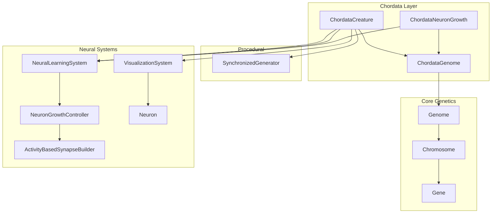
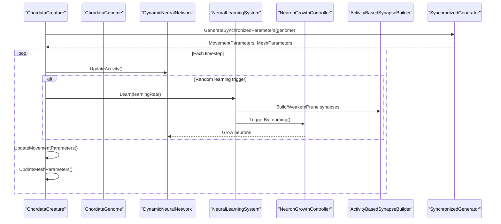
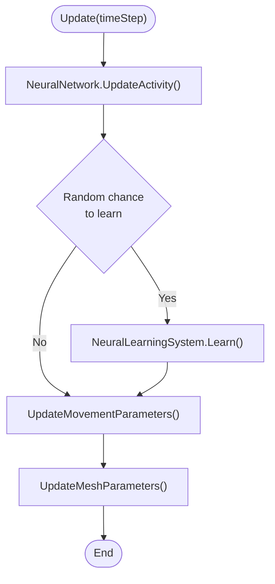
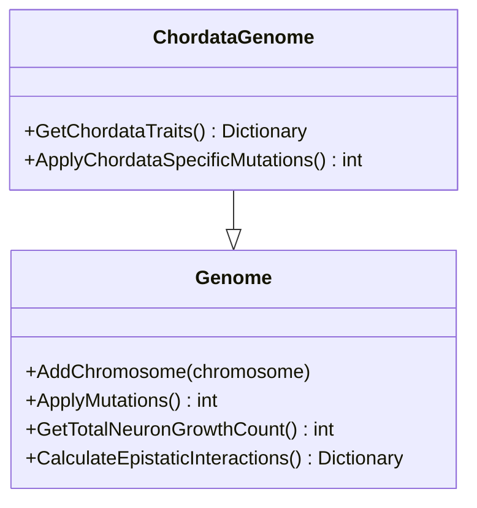
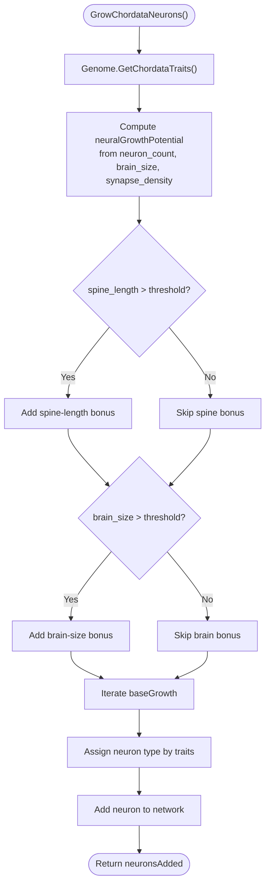
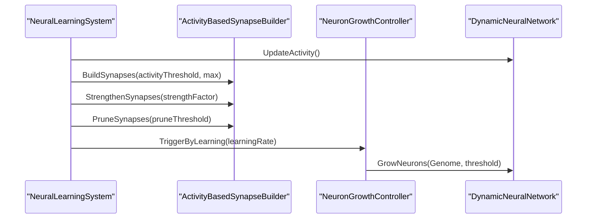
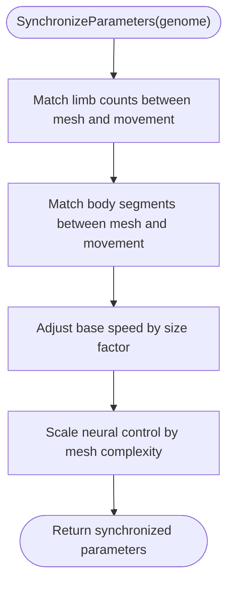
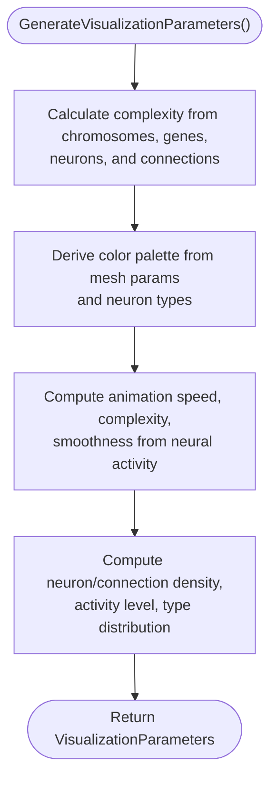
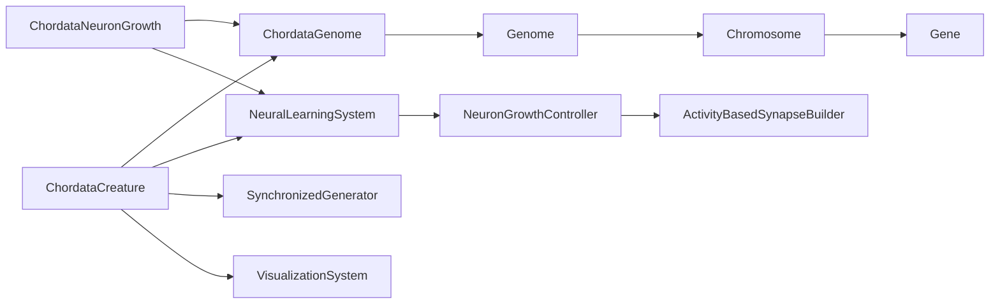

# Chordata System

<cite>
**Referenced Files in This Document**
- [ChordataCreature.cs](file://GeneticsGame/Phyla/Chordata/ChordataCreature.cs)
- [ChordataGenome.cs](file://GeneticsGame/Phyla/Chordata/ChordataGenome.cs)
- [ChordataNeuronGrowth.cs](file://GeneticsGame/Phyla/Chordata/ChordataNeuronGrowth.cs)
- [Genome.cs](file://GeneticsGame/Core/Genome.cs)
- [Chromosome.cs](file://GeneticsGame/Core/Chromosome.cs)
- [Gene.cs](file://GeneticsGame/Core/Gene.cs)
- [SynchronizedGenerator.cs](file://GeneticsGame/Procedural/SynchronizedGenerator.cs)
- [NeuralLearningSystem.cs](file://GeneticsGame/Systems/NeuralLearningSystem.cs)
- [NeuronGrowthController.cs](file://GeneticsGame/Systems/NeuronGrowthController.cs)
- [ActivityBasedSynapseBuilder.cs](file://GeneticsGame/Systems/ActivityBasedSynapseBuilder.cs)
- [VisualizationSystem.cs](file://GeneticsGame/Systems/VisualizationSystem.cs)
- [Neuron.cs](file://GeneticsGame/Systems/Neuron.cs)
</cite>

## Table of Contents
1. [Introduction](#introduction)
2. [Project Structure](#project-structure)
3. [Core Components](#core-components)
4. [Architecture Overview](#architecture-overview)
5. [Detailed Component Analysis](#detailed-component-analysis)
6. [Dependency Analysis](#dependency-analysis)
7. [Performance Considerations](#performance-considerations)
8. [Troubleshooting Guide](#troubleshooting-guide)
9. [Conclusion](#conclusion)

## Introduction
This document describes the Chordata organism classification system designed to model vertebrate-like creatures with complex neural development. It explains how genetic blueprints (ChordataGenome) drive body plan features (skeletal structure, internal organ approximations via metabolism, and movement), how neural networks develop (ChordataNeuronGrowth), and how behavior emerges from the interplay between genotype and neural dynamics (ChordataCreature). It also documents how genome structure relates to neural network complexity and how genetic algorithms shape vertebrate characteristics such as backbone segmentation, limb development, and advanced cognitive abilities.

## Project Structure
The Chordata system is organized around three primary modules:
- ChordataGenome: specialized vertebrate-like genetic architecture with five chromosome sets for spine, neural, limbs, sensory, and metabolism traits.
- ChordataCreature: runtime representation of a creature that integrates genome, neural network, and procedural generation for movement and mesh.
- ChordataNeuronGrowth: growth controller that translates genome-derived traits into neuron types and connectivity patterns.

Supporting systems include:
- Core genetics (Genome, Chromosome, Gene) for multi-gene inheritance, epistasis, and mutation.
- Procedural synchronization (SynchronizedGenerator) ensuring mesh/movement coherence.
- Neural learning and growth controllers (NeuralLearningSystem, NeuronGrowthController, ActivityBasedSynapseBuilder).
- Visualization pipeline (VisualizationSystem) for rendering neural and morphological complexity.

**Diagram sources**
- [ChordataCreature.cs:1-133](file://GeneticsGame/Phyla/Chordata/ChordataCreature.cs#L1-L133)
- [ChordataGenome.cs:1-134](file://GeneticsGame/Phyla/Chordata/ChordataGenome.cs#L1-L134)
- [ChordataNeuronGrowth.cs:1-216](file://GeneticsGame/Phyla/Chordata/ChordataNeuronGrowth.cs#L1-L216)
- [Genome.cs:1-190](file://GeneticsGame/Core/Genome.cs#L1-L190)
- [Chromosome.cs:1-146](file://GeneticsGame/Core/Chromosome.cs#L1-L146)
- [Gene.cs:1-93](file://GeneticsGame/Core/Gene.cs#L1-L93)
- [SynchronizedGenerator.cs:1-141](file://GeneticsGame/Procedural/SynchronizedGenerator.cs#L1-L141)
- [NeuralLearningSystem.cs:1-122](file://GeneticsGame/Systems/NeuralLearningSystem.cs#L1-L122)
- [NeuronGrowthController.cs:1-122](file://GeneticsGame/Systems/NeuronGrowthController.cs#L1-L122)
- [ActivityBasedSynapseBuilder.cs:1-112](file://GeneticsGame/Systems/ActivityBasedSynapseBuilder.cs#L1-L112)
- [VisualizationSystem.cs:1-239](file://GeneticsGame/Systems/VisualizationSystem.cs#L1-L239)
- [Neuron.cs:1-70](file://GeneticsGame/Systems/Neuron.cs#L1-L70)

**Section sources**
- [ChordataCreature.cs:1-133](file://GeneticsGame/Phyla/Chordata/ChordataCreature.cs#L1-L133)
- [ChordataGenome.cs:1-134](file://GeneticsGame/Phyla/Chordata/ChordataGenome.cs#L1-L134)
- [ChordataNeuronGrowth.cs:1-216](file://GeneticsGame/Phyla/Chordata/ChordataNeuronGrowth.cs#L1-L216)
- [Genome.cs:1-190](file://GeneticsGame/Core/Genome.cs#L1-L190)
- [Chromosome.cs:1-146](file://GeneticsGame/Core/Chromosome.cs#L1-L146)
- [Gene.cs:1-93](file://GeneticsGame/Core/Gene.cs#L1-L93)
- [SynchronizedGenerator.cs:1-141](file://GeneticsGame/Procedural/SynchronizedGenerator.cs#L1-L141)
- [NeuralLearningSystem.cs:1-122](file://GeneticsGame/Systems/NeuralLearningSystem.cs#L1-L122)
- [NeuronGrowthController.cs:1-122](file://GeneticsGame/Systems/NeuronGrowthController.cs#L1-L122)
- [ActivityBasedSynapseBuilder.cs:1-112](file://GeneticsGame/Systems/ActivityBasedSynapseBuilder.cs#L1-L112)
- [VisualizationSystem.cs:1-239](file://GeneticsGame/Systems/VisualizationSystem.cs#L1-L239)
- [Neuron.cs:1-70](file://GeneticsGame/Systems/Neuron.cs#L1-L70)

## Core Components
- ChordataCreature: orchestrates creature lifecycle updates, neural learning, movement/mesh synchronization, and visualization. It initializes a dynamic neural network and procedural parameters derived from a genome, then updates behavior and morphology each timestep.
- ChordataGenome: extends the generic genome with five vertebrate-specific chromosome sets encoding spine development, neural growth, limb formation, sensory acuity, and metabolism. It exposes trait extraction and specialized mutation rules.
- ChordataNeuronGrowth: transforms genome traits into neuron additions and synaptic plasticity, assigning neuron types (general, visual, movement) and strengthening connections according to sensory and brain size traits.

**Section sources**
- [ChordataCreature.cs:39-133](file://GeneticsGame/Phyla/Chordata/ChordataCreature.cs#L39-L133)
- [ChordataGenome.cs:14-134](file://GeneticsGame/Phyla/Chordata/ChordataGenome.cs#L14-L134)
- [ChordataNeuronGrowth.cs:26-216](file://GeneticsGame/Phyla/Chordata/ChordataNeuronGrowth.cs#L26-L216)

## Architecture Overview
The Chordata system integrates genetics, procedural generation, and neural dynamics into a cohesive pipeline:
- Genome drives initial mesh/movement parameters and neural growth potential.
- NeuralLearningSystem and NeuronGrowthController regulate ongoing neuron addition and synaptogenesis.
- ChordataNeuronGrowth applies vertebrate-specific growth rules informed by traits.
- SynchronizedGenerator ensures movement and mesh remain consistent with each other and with genome-derived traits.
- VisualizationSystem renders complexity and neural activity.

**Diagram sources**
- [ChordataCreature.cs:61-122](file://GeneticsGame/Phyla/Chordata/ChordataCreature.cs#L61-L122)
- [NeuralLearningSystem.cs:37-57](file://GeneticsGame/Systems/NeuralLearningSystem.cs#L37-L57)
- [NeuronGrowthController.cs:88-101](file://GeneticsGame/Systems/NeuronGrowthController.cs#L88-L101)
- [ActivityBasedSynapseBuilder.cs:31-111](file://GeneticsGame/Systems/ActivityBasedSynapseBuilder.cs#L31-L111)
- [SynchronizedGenerator.cs:35-124](file://GeneticsGame/Procedural/SynchronizedGenerator.cs#L35-L124)

## Detailed Component Analysis

### ChordataCreature
Responsibilities:
- Initialize neural network and synchronized procedural parameters from a genome.
- Drive behavior updates: neural activity, optional learning, movement adjustments, and mesh scaling.
- Expose visualization parameters for rendering.

Key behaviors:
- Movement parameters scale with neural activity and connection count.
- Mesh scale reflects average gene expression; vertex count grows with total neuron growth potential from the genome.
- Learning occurs probabilistically and invokes NeuralLearningSystem.

**Diagram sources**
- [ChordataCreature.cs:61-122](file://GeneticsGame/Phyla/Chordata/ChordataCreature.cs#L61-L122)
- [NeuralLearningSystem.cs:37-57](file://GeneticsGame/Systems/NeuralLearningSystem.cs#L37-L57)

**Section sources**
- [ChordataCreature.cs:41-133](file://GeneticsGame/Phyla/Chordata/ChordataCreature.cs#L41-L133)

### ChordataGenome
Responsibilities:
- Define five vertebrate-specific chromosome sets:
  - Spine: spine length, flexibility, vertebra count.
  - Neural: neuron count, synapse density, brain size.
  - Limbs: limb count, limb length, joint complexity.
  - Sensory: vision acuity, hearing range, balance system.
  - Metabolism: metabolic rate, oxygen efficiency, temperature regulation.
- Extract traits for growth and plasticity decisions.
- Apply specialized mutation rates for neural/spinal genes.

**Diagram sources**
- [ChordataGenome.cs:9-134](file://GeneticsGame/Phyla/Chordata/ChordataGenome.cs#L9-L134)
- [Genome.cs:9-190](file://GeneticsGame/Core/Genome.cs#L9-L190)

**Section sources**
- [ChordataGenome.cs:24-95](file://GeneticsGame/Phyla/Chordata/ChordataGenome.cs#L24-L95)
- [ChordataGenome.cs:101-133](file://GeneticsGame/Phyla/Chordata/ChordataGenome.cs#L101-L133)

### ChordataNeuronGrowth
Responsibilities:
- Translate traits into neuron additions and neuron type assignment.
- Strengthen synapses based on sensory and brain size traits.
- Provide visual and balance system plasticity rules.

Mechanics:
- Growth potential computed from neuron count, brain size, and synapse density; spine length further augments spinal cord neuron potential.
- Visual neurons dominate when vision acuity is high; movement neurons when balance system is strong; general otherwise.
- Plasticity routines selectively strengthen connections among neurons of matching functional types.

**Diagram sources**
- [ChordataNeuronGrowth.cs:36-103](file://GeneticsGame/Phyla/Chordata/ChordataNeuronGrowth.cs#L36-L103)

**Section sources**
- [ChordataNeuronGrowth.cs:36-136](file://GeneticsGame/Phyla/Chordata/ChordataNeuronGrowth.cs#L36-L136)
- [ChordataNeuronGrowth.cs:142-215](file://GeneticsGame/Phyla/Chordata/ChordataNeuronGrowth.cs#L142-L215)

### Neural Learning and Synaptogenesis
Responsibilities:
- NeuralLearningSystem coordinates activity updates, synapse building, strengthening, pruning, and learning-triggered neuron growth.
- ActivityBasedSynapseBuilder implements Hebbian-style connections and weight updates.
- NeuronGrowthController integrates genetic expression, mutation, and learning into neuron addition.

**Diagram sources**
- [NeuralLearningSystem.cs:37-57](file://GeneticsGame/Systems/NeuralLearningSystem.cs#L37-L57)
- [ActivityBasedSynapseBuilder.cs:31-111](file://GeneticsGame/Systems/ActivityBasedSynapseBuilder.cs#L31-L111)
- [NeuronGrowthController.cs:88-101](file://GeneticsGame/Systems/NeuronGrowthController.cs#L88-L101)

**Section sources**
- [NeuralLearningSystem.cs:37-103](file://GeneticsGame/Systems/NeuralLearningSystem.cs#L37-L103)
- [ActivityBasedSynapseBuilder.cs:31-111](file://GeneticsGame/Systems/ActivityBasedSynapseBuilder.cs#L31-L111)
- [NeuronGrowthController.cs:36-101](file://GeneticsGame/Systems/NeuronGrowthController.cs#L36-L101)

### Procedural Synchronization (Mesh and Movement)
Responsibilities:
- Ensure mesh limb/body segment counts align with movement patterns.
- Enforce size-speed relationships and neural control scaling with mesh complexity.

**Diagram sources**
- [SynchronizedGenerator.cs:57-124](file://GeneticsGame/Procedural/SynchronizedGenerator.cs#L57-L124)

**Section sources**
- [SynchronizedGenerator.cs:35-124](file://GeneticsGame/Procedural/SynchronizedGenerator.cs#L35-L124)

### Visualization Pipeline
Responsibilities:
- Convert genome and neural network state into visualization parameters: complexity level, color palette, animation parameters, and neural visualization metrics.

**Diagram sources**
- [VisualizationSystem.cs:36-165](file://GeneticsGame/Systems/VisualizationSystem.cs#L36-L165)

**Section sources**
- [VisualizationSystem.cs:36-239](file://GeneticsGame/Systems/VisualizationSystem.cs#L36-L239)

## Dependency Analysis
- ChordataCreature depends on:
  - ChordataGenome for traits and procedural parameter generation.
  - NeuralLearningSystem for learning-driven growth and synaptogenesis.
  - SynchronizedGenerator for coherent movement/mesh parameters.
  - VisualizationSystem for rendering.
- ChordataNeuronGrowth depends on:
  - ChordataGenome for traits.
  - NeuralLearningSystem for coordinated growth.
- Core genetics underpin everything:
  - Genome aggregates Chromosome collections.
  - Chromosome aggregates Gene instances.
  - Gene exposes expression level, mutation rate, and neuron growth factor.

**Diagram sources**
- [ChordataCreature.cs:41-133](file://GeneticsGame/Phyla/Chordata/ChordataCreature.cs#L41-L133)
- [ChordataGenome.cs:14-134](file://GeneticsGame/Phyla/Chordata/ChordataGenome.cs#L14-L134)
- [ChordataNeuronGrowth.cs:26-216](file://GeneticsGame/Phyla/Chordata/ChordataNeuronGrowth.cs#L26-L216)
- [Genome.cs:35-190](file://GeneticsGame/Core/Genome.cs#L35-L190)
- [Chromosome.cs:35-146](file://GeneticsGame/Core/Chromosome.cs#L35-L146)
- [Gene.cs:49-93](file://GeneticsGame/Core/Gene.cs#L49-L93)
- [NeuralLearningSystem.cs:26-103](file://GeneticsGame/Systems/NeuralLearningSystem.cs#L26-L103)
- [NeuronGrowthController.cs:26-101](file://GeneticsGame/Systems/NeuronGrowthController.cs#L26-L101)
- [ActivityBasedSynapseBuilder.cs:20-111](file://GeneticsGame/Systems/ActivityBasedSynapseBuilder.cs#L20-L111)
- [VisualizationSystem.cs:26-165](file://GeneticsGame/Systems/VisualizationSystem.cs#L26-L165)

**Section sources**
- [Genome.cs:35-190](file://GeneticsGame/Core/Genome.cs#L35-L190)
- [Chromosome.cs:35-146](file://GeneticsGame/Core/Chromosome.cs#L35-L146)
- [Gene.cs:49-93](file://GeneticsGame/Core/Gene.cs#L49-L93)

## Performance Considerations
- Neural activity updates and synapse operations scale with neuron and connection counts; limit max connections per cycle to maintain responsiveness.
- Trait-based growth and plasticity checks should short-circuit early when thresholds are not met.
- Synchronization steps should avoid excessive resizes of movement pattern lists by aligning counts proactively.
- Visualization complexity calculations can be cached and recomputed only when significant changes occur.

## Troubleshooting Guide
Common issues and mitigations:
- Movement and mesh desynchronization:
  - Verify synchronization logic runs after parameter generation and that limb/body counts are aligned.
  - Ensure size-speed adjustments preserve reasonable bounds.
- Low neural complexity:
  - Confirm trait thresholds for neuron type assignment are met and that learning triggers are occurring.
  - Check that NeuronGrowthController receives sufficient activity or genetic triggers.
- Excessive mutation impact:
  - Review specialized mutation multipliers for neural/spinal genes and adjust rates if growth becomes unstable.
- Visualization lag:
  - Reduce complexity level thresholds or cache derived metrics until meaningful changes occur.

**Section sources**
- [SynchronizedGenerator.cs:57-124](file://GeneticsGame/Procedural/SynchronizedGenerator.cs#L57-L124)
- [ChordataNeuronGrowth.cs:109-136](file://GeneticsGame/Phyla/Chordata/ChordataNeuronGrowth.cs#L109-L136)
- [ChordataGenome.cs:112-133](file://GeneticsGame/Phyla/Chordata/ChordataGenome.cs#L112-L133)
- [NeuralLearningSystem.cs:37-103](file://GeneticsGame/Systems/NeuralLearningSystem.cs#L37-L103)

## Conclusion
The Chordata system models vertebrate-like organisms by coupling a specialized genome with a dynamic neural network and procedural generation. ChordataGenome encodes vertebrate-specific traits that drive skeletal structure, neural complexity, and behavioral capabilities. ChordataNeuronGrowth translates these traits into neuron types and connectivity, while NeuralLearningSystem and NeuronGrowthController sustain ongoing development. SynchronizedGenerator ensures morphological and behavioral coherence, and VisualizationSystem renders the resulting complexity. Together, these components demonstrate how genome structure directly influences neural network complexity and, consequently, behavioral sophistication.