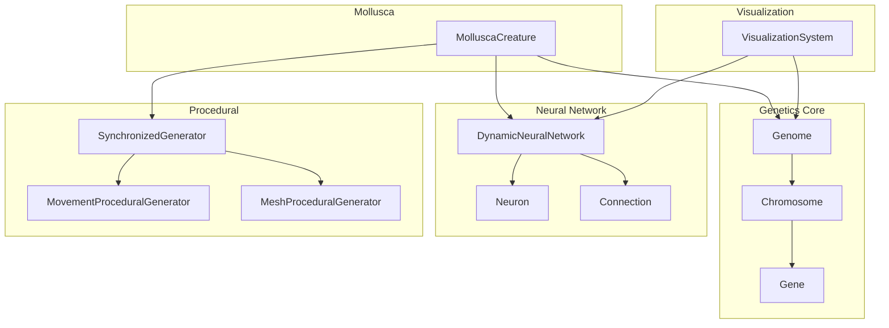
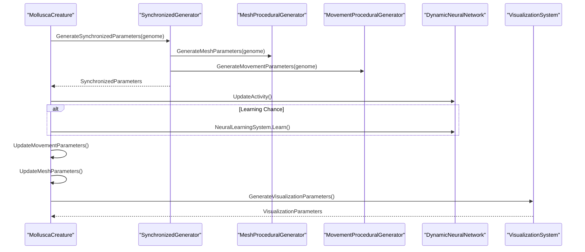
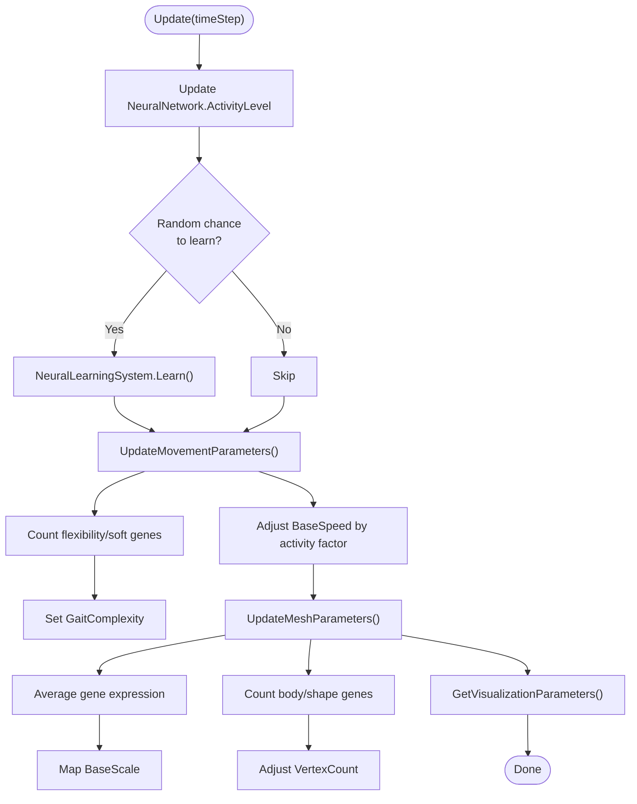
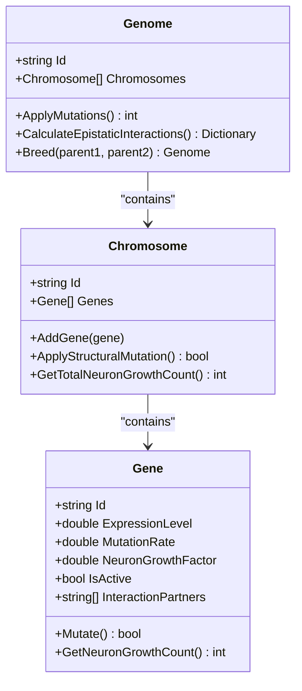
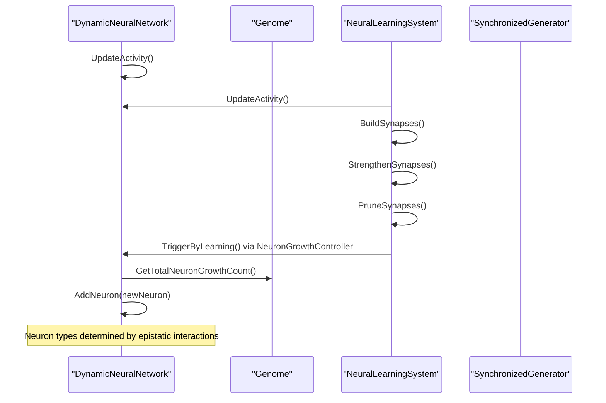
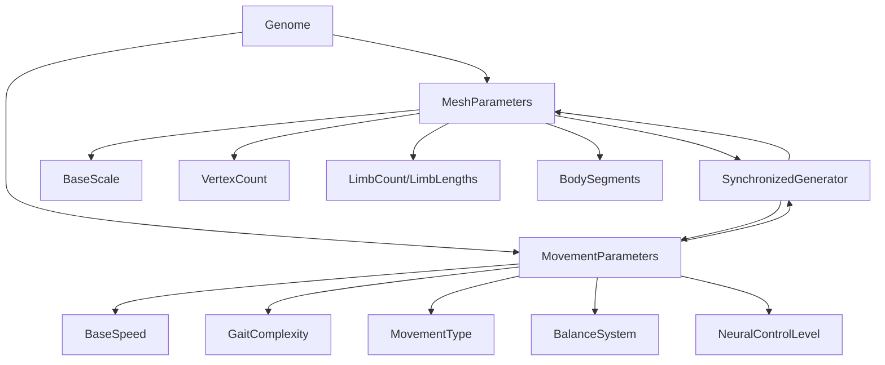
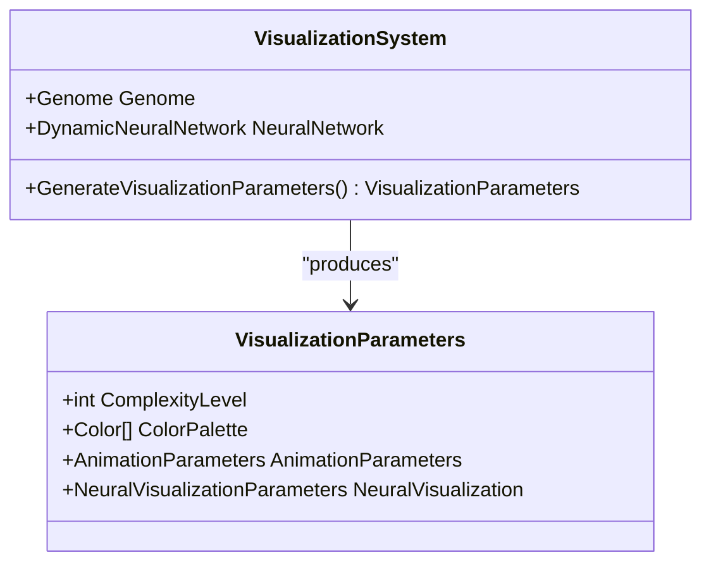
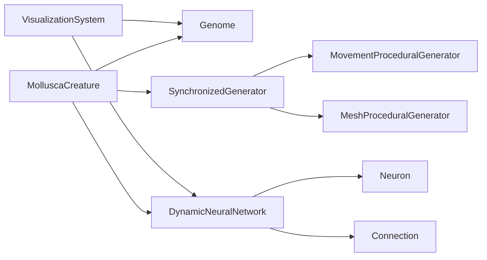

# Mollusca System

<cite>
**Referenced Files in This Document**
- [MolluscaCreature.cs](file://GeneticsGame/Phyla/Mollusca/MolluscaCreature.cs)
- [Genome.cs](file://GeneticsGame/Core/Genome.cs)
- [Gene.cs](file://GeneticsGame/Core/Gene.cs)
- [Chromosome.cs](file://GeneticsGame/Core/Chromosome.cs)
- [DynamicNeuralNetwork.cs](file://GeneticsGame/Systems/DynamicNeuralNetwork.cs)
- [NeuralLearningSystem.cs](file://GeneticsGame/Systems/NeuralLearningSystem.cs)
- [Neuron.cs](file://GeneticsGame/Systems/Neuron.cs)
- [Connection.cs](file://GeneticsGame/Systems/Connection.cs)
- [SynchronizedGenerator.cs](file://GeneticsGame/Procedural/SynchronizedGenerator.cs)
- [MeshProceduralGenerator.cs](file://GeneticsGame/Procedural/Mesh/MeshProceduralGenerator.cs)
- [MovementProceduralGenerator.cs](file://GeneticsGame/Procedural/Movement/MovementProceduralGenerator.cs)
- [VisualizationSystem.cs](file://GeneticsGame/Systems/VisualizationSystem.cs)
- [GeneticsCore.cs](file://GeneticsGame/Core/GeneticsCore.cs)
</cite>

## Table of Contents
1. [Introduction](#introduction)
2. [Project Structure](#project-structure)
3. [Core Components](#core-components)
4. [Architecture Overview](#architecture-overview)
5. [Detailed Component Analysis](#detailed-component-analysis)
6. [Dependency Analysis](#dependency-analysis)
7. [Performance Considerations](#performance-considerations)
8. [Troubleshooting Guide](#troubleshooting-guide)
9. [Conclusion](#conclusion)

## Introduction
This document describes the Mollusca organism classification system within the 3D Genetics Game. It focuses on how soft-bodied creatures are represented, how their genetic blueprints drive body shape, movement, and neural control, and how the system models molluscan-specific features such as flexible body plans, distributed nervous systems, and coordinated locomotion. The implementation centers around the MolluscaCreature class, which orchestrates neural updates, procedural mesh/movement generation, and visualization, all driven by a multi-chromosome genome with epistatic interactions and mutation dynamics.

## Project Structure
The Mollusca system is composed of:
- A creature model (MolluscaCreature) that encapsulates identity, genome, neural network, and procedural parameters
- A genetic core (Genome, Chromosome, Gene) modeling inheritance, mutations, and epistatic interactions
- A dynamic neural network (DynamicNeuralNetwork) that grows neurons based on genetic triggers and activity
- Procedural generators (SynchronizedGenerator, MeshProceduralGenerator, MovementProceduralGenerator) that translate genes into mesh and movement parameters
- A visualization system (VisualizationSystem) that renders genetic and neural complexity
- Supporting systems for learning and adaptation (NeuralLearningSystem)

**Diagram sources**
- [MolluscaCreature.cs:1-133](file://GeneticsGame/Phyla/Mollusca/MolluscaCreature.cs#L1-L133)
- [Genome.cs:1-190](file://GeneticsGame/Core/Genome.cs#L1-L190)
- [Chromosome.cs:1-146](file://GeneticsGame/Core/Chromosome.cs#L1-L146)
- [Gene.cs:1-93](file://GeneticsGame/Core/Gene.cs#L1-L93)
- [DynamicNeuralNetwork.cs:1-116](file://GeneticsGame/Systems/DynamicNeuralNetwork.cs#L1-L116)
- [Neuron.cs:1-70](file://GeneticsGame/Systems/Neuron.cs#L1-L70)
- [Connection.cs:1-35](file://GeneticsGame/Systems/Connection.cs#L1-L35)
- [SynchronizedGenerator.cs:1-141](file://GeneticsGame/Procedural/SynchronizedGenerator.cs#L1-L141)
- [MovementProceduralGenerator.cs:1-389](file://GeneticsGame/Procedural/Movement/MovementProceduralGenerator.cs#L1-L389)
- [MeshProceduralGenerator.cs:1-365](file://GeneticsGame/Procedural/Mesh/MeshProceduralGenerator.cs#L1-L365)
- [VisualizationSystem.cs:1-239](file://GeneticsGame/Systems/VisualizationSystem.cs#L1-L239)

**Section sources**
- [MolluscaCreature.cs:1-133](file://GeneticsGame/Phyla/Mollusca/MolluscaCreature.cs#L1-L133)
- [Genome.cs:1-190](file://GeneticsGame/Core/Genome.cs#L1-L190)
- [DynamicNeuralNetwork.cs:1-116](file://GeneticsGame/Systems/DynamicNeuralNetwork.cs#L1-L116)
- [SynchronizedGenerator.cs:1-141](file://GeneticsGame/Procedural/SynchronizedGenerator.cs#L1-L141)
- [VisualizationSystem.cs:1-239](file://GeneticsGame/Systems/VisualizationSystem.cs#L1-L239)

## Core Components
- MolluscaCreature: Orchestrates creature lifecycle, neural updates, procedural parameter generation, and visualization. It initializes a dynamic neural network and uses a synchronized generator to produce mesh and movement parameters from the genome. It also applies a learning mechanism with a higher-than-chordata frequency to reflect molluscan-like adaptability.
- Genome/Chromosome/Gene: Provide multi-gene inheritance, epistatic interactions, and mutation dynamics. Genes carry expression levels, mutation rates, and neuron-growth influence factors. Epistatic interactions combine expression levels across interacting genes to influence traits.
- DynamicNeuralNetwork: Maintains a population of neurons and connections, computes activity levels, and grows new neurons based on genetic triggers and activity thresholds.
- Procedural Generators: Translate genetic data into mesh (scale, segments, limbs, vertex count, color/patterns) and movement (speed, gaits, body patterns, balance systems, neural control) parameters. A synchronized generator ensures consistency between mesh and movement outputs.
- VisualizationSystem: Produces visual complexity, color palettes, animation parameters, and neural visualization metrics based on genome and neural network state.

**Section sources**
- [MolluscaCreature.cs:39-133](file://GeneticsGame/Phyla/Mollusca/MolluscaCreature.cs#L39-L133)
- [Genome.cs:78-107](file://GeneticsGame/Core/Genome.cs#L78-L107)
- [DynamicNeuralNetwork.cs:57-99](file://GeneticsGame/Systems/DynamicNeuralNetwork.cs#L57-L99)
- [SynchronizedGenerator.cs:35-124](file://GeneticsGame/Procedural/SynchronizedGenerator.cs#L35-L124)
- [VisualizationSystem.cs:36-165](file://GeneticsGame/Systems/VisualizationSystem.cs#L36-L165)

## Architecture Overview
The Mollusca system follows a tightly integrated pipeline:
- A genome encodes traits via genes on chromosomes
- Epistatic interactions inform trait expression
- A synchronized generator produces coherent mesh and movement parameters
- The dynamic neural network updates activity and grows neurons based on genetic signals
- Visualization consumes genome and neural network state for rendering

**Diagram sources**
- [MolluscaCreature.cs:41-78](file://GeneticsGame/Phyla/Mollusca/MolluscaCreature.cs#L41-L78)
- [SynchronizedGenerator.cs:35-49](file://GeneticsGame/Procedural/SynchronizedGenerator.cs#L35-L49)
- [MeshProceduralGenerator.cs:16-36](file://GeneticsGame/Procedural/Mesh/MeshProceduralGenerator.cs#L16-L36)
- [MovementProceduralGenerator.cs:16-35](file://GeneticsGame/Procedural/Movement/MovementProceduralGenerator.cs#L16-L35)
- [DynamicNeuralNetwork.cs:104-115](file://GeneticsGame/Systems/DynamicNeuralNetwork.cs#L104-L115)
- [VisualizationSystem.cs:36-52](file://GeneticsGame/Systems/VisualizationSystem.cs#L36-L52)

## Detailed Component Analysis

### MolluscaCreature
- Responsibilities:
  - Initialize neural network and synchronized procedural parameters from the genome
  - Update neural activity and learning
  - Adjust movement parameters based on neural activity and flexibility genes
  - Adjust mesh parameters based on overall gene expression and body complexity genes
  - Provide visualization parameters
- Key behaviors:
  - Learning frequency is tuned higher than other phyla to reflect molluscan adaptability
  - Movement speed scales with neural activity; gait complexity correlates with flexibility/soft-body genes
  - Mesh scale and vertex count correlate with average gene expression and body complexity genes

**Diagram sources**
- [MolluscaCreature.cs:61-133](file://GeneticsGame/Phyla/Mollusca/MolluscaCreature.cs#L61-L133)

**Section sources**
- [MolluscaCreature.cs:41-133](file://GeneticsGame/Phyla/Mollusca/MolluscaCreature.cs#L41-L133)

### Genetic Blueprint: Genome, Chromosome, Gene
- Genome:
  - Stores chromosomes and exposes epistatic interactions across genes
  - Provides neuron-growth potential and breeding mechanics
- Chromosome:
  - Holds genes and supports structural mutations (deletion, duplication, inversion, translocation)
- Gene:
  - Encodes expression level, mutation rate, neuron-growth factor, and interaction partners
  - Computes neuron-growth count based on activity and growth factor

**Diagram sources**
- [Genome.cs:9-190](file://GeneticsGame/Core/Genome.cs#L9-L190)
- [Chromosome.cs:9-146](file://GeneticsGame/Core/Chromosome.cs#L9-L146)
- [Gene.cs:9-93](file://GeneticsGame/Core/Gene.cs#L9-L93)

**Section sources**
- [Genome.cs:44-107](file://GeneticsGame/Core/Genome.cs#L44-L107)
- [Chromosome.cs:44-145](file://GeneticsGame/Core/Chromosome.cs#L44-L145)
- [Gene.cs:63-93](file://GeneticsGame/Core/Gene.cs#L63-L93)

### Dynamic Neural Network and Learning
- DynamicNeuralNetwork:
  - Maintains neurons and connections
  - Computes activity level from neuron activations
  - Grows neurons when activity exceeds threshold, guided by genome’s epistatic interactions
- NeuralLearningSystem:
  - Updates activity, builds and strengthens synapses, prunes weak ones
  - Triggers neuron growth via NeuronGrowthController
  - Adapts to environment/task requirements weighted by genetic constraints

**Diagram sources**
- [DynamicNeuralNetwork.cs:104-116](file://GeneticsGame/Systems/DynamicNeuralNetwork.cs#L104-L116)
- [DynamicNeuralNetwork.cs:63-99](file://GeneticsGame/Systems/DynamicNeuralNetwork.cs#L63-L99)
- [NeuralLearningSystem.cs:37-57](file://GeneticsGame/Systems/NeuralLearningSystem.cs#L37-L57)

**Section sources**
- [DynamicNeuralNetwork.cs:29-99](file://GeneticsGame/Systems/DynamicNeuralNetwork.cs#L29-L99)
- [NeuralLearningSystem.cs:37-103](file://GeneticsGame/Systems/NeuralLearningSystem.cs#L37-L103)

### Procedural Generation: Mesh and Movement
- MeshProceduralGenerator:
  - Calculates base scale, complexity, vertex count, colors, patterns, textures
  - Derives limb count and lengths, and body segments from genes
- MovementProceduralGenerator:
  - Determines base speed from neural and muscle gene expressions
  - Selects movement type (walking, flying, swimming, crawling) based on gene dominance
  - Computes gait complexity, limb/body movement patterns, balance system, and neural control level
- SynchronizedGenerator:
  - Ensures mesh and movement parameters are consistent (limb/body segments, size-speed trade-offs, neural control scaling)

**Diagram sources**
- [MeshProceduralGenerator.cs:16-279](file://GeneticsGame/Procedural/Mesh/MeshProceduralGenerator.cs#L16-L279)
- [MovementProceduralGenerator.cs:16-295](file://GeneticsGame/Procedural/Movement/MovementProceduralGenerator.cs#L16-L295)
- [SynchronizedGenerator.cs:35-124](file://GeneticsGame/Procedural/SynchronizedGenerator.cs#L35-L124)

**Section sources**
- [MeshProceduralGenerator.cs:43-279](file://GeneticsGame/Procedural/Mesh/MeshProceduralGenerator.cs#L43-L279)
- [MovementProceduralGenerator.cs:42-295](file://GeneticsGame/Procedural/Movement/MovementProceduralGenerator.cs#L42-L295)
- [SynchronizedGenerator.cs:57-124](file://GeneticsGame/Procedural/SynchronizedGenerator.cs#L57-L124)

### Visualization System
- Converts genome and neural network state into:
  - Visual complexity level
  - Color palette (mesh colors plus neuron-type colors)
  - Animation parameters (speed, complexity, smoothness)
  - Neural visualization metrics (neuron/connection density, activity level, type distribution)

**Diagram sources**
- [VisualizationSystem.cs:9-165](file://GeneticsGame/Systems/VisualizationSystem.cs#L9-L165)

**Section sources**
- [VisualizationSystem.cs:36-165](file://GeneticsGame/Systems/VisualizationSystem.cs#L36-L165)

## Dependency Analysis
- Coupling:
  - MolluscaCreature depends on Genome, DynamicNeuralNetwork, and SynchronizedGenerator
  - SynchronizedGenerator depends on MeshProceduralGenerator and MovementProceduralGenerator
  - DynamicNeuralNetwork depends on Genome for growth signals and on Neuron/Connection for structure
  - VisualizationSystem depends on both Genome and DynamicNeuralNetwork
- Cohesion:
  - Each subsystem (genetics, neural, procedural, visualization) maintains focused responsibilities
- External dependencies:
  - No external libraries are imported; all components are self-contained within the project

**Diagram sources**
- [MolluscaCreature.cs:41-55](file://GeneticsGame/Phyla/Mollusca/MolluscaCreature.cs#L41-L55)
- [SynchronizedGenerator.cs:24-28](file://GeneticsGame/Procedural/SynchronizedGenerator.cs#L24-L28)
- [VisualizationSystem.cs:26-29](file://GeneticsGame/Systems/VisualizationSystem.cs#L26-L29)

**Section sources**
- [MolluscaCreature.cs:41-55](file://GeneticsGame/Phyla/Mollusca/MolluscaCreature.cs#L41-L55)
- [SynchronizedGenerator.cs:24-28](file://GeneticsGame/Procedural/SynchronizedGenerator.cs#L24-L28)
- [VisualizationSystem.cs:26-29](file://GeneticsGame/Systems/VisualizationSystem.cs#L26-L29)

## Performance Considerations
- Computational complexity:
  - Epistatic interaction calculations iterate over all genes across all chromosomes; complexity scales with total gene count
  - Structural mutations on chromosomes operate on gene segments; worst-case proportional to segment length
  - Neural growth caps growth per generation using a global configuration value
- Practical guidance:
  - Keep chromosome/gene counts reasonable to maintain responsiveness
  - Use the global neuron-growth cap to avoid uncontrolled network expansion
  - Prefer selective mutation application (e.g., targeted structural mutations) when simulating specific molluscan traits

[No sources needed since this section provides general guidance]

## Troubleshooting Guide
- Neural network not growing:
  - Verify activity level meets threshold and epistatic interactions indicate sufficient neuron-growth potential
  - Confirm genome’s total neuron-growth count is non-zero
- Movement parameters inconsistent with mesh:
  - Ensure synchronized generator is invoked after both mesh and movement generation
  - Check size-speed normalization and limb/body segment alignment logic
- Visualization anomalies:
  - Confirm color and pattern genes are present or defaults are acceptable
  - Validate animation speed and smoothness calculations based on neural activity and connection counts

**Section sources**
- [DynamicNeuralNetwork.cs:63-99](file://GeneticsGame/Systems/DynamicNeuralNetwork.cs#L63-L99)
- [SynchronizedGenerator.cs:57-124](file://GeneticsGame/Procedural/SynchronizedGenerator.cs#L57-L124)
- [VisualizationSystem.cs:59-165](file://GeneticsGame/Systems/VisualizationSystem.cs#L59-L165)

## Conclusion
The Mollusca system integrates a robust genetic core, a dynamic neural network, and synchronized procedural generation to model soft-bodied organisms with flexible body plans and distributed nervous systems. Molluscan-specific characteristics—such as variable body complexity, coordinated but flexible locomotion, and adaptable neural control—are encoded through gene expression, epistatic interactions, and learning-driven neural growth. The system’s modular design enables exploration of genetic influences on morphology, movement, and behavior, aligning with the biological themes of molluscan diversity and adaptability.