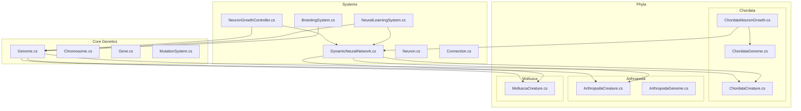
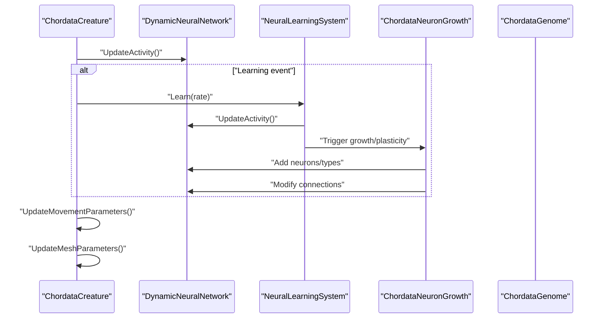
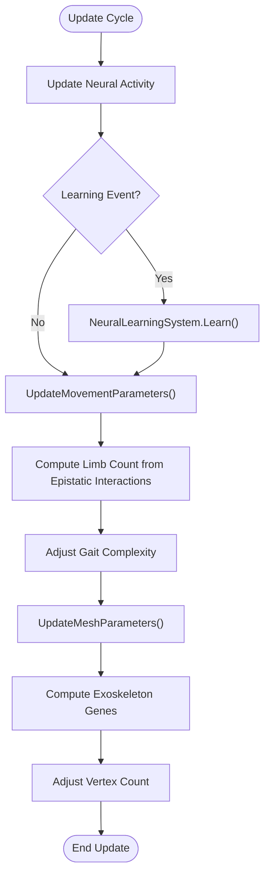
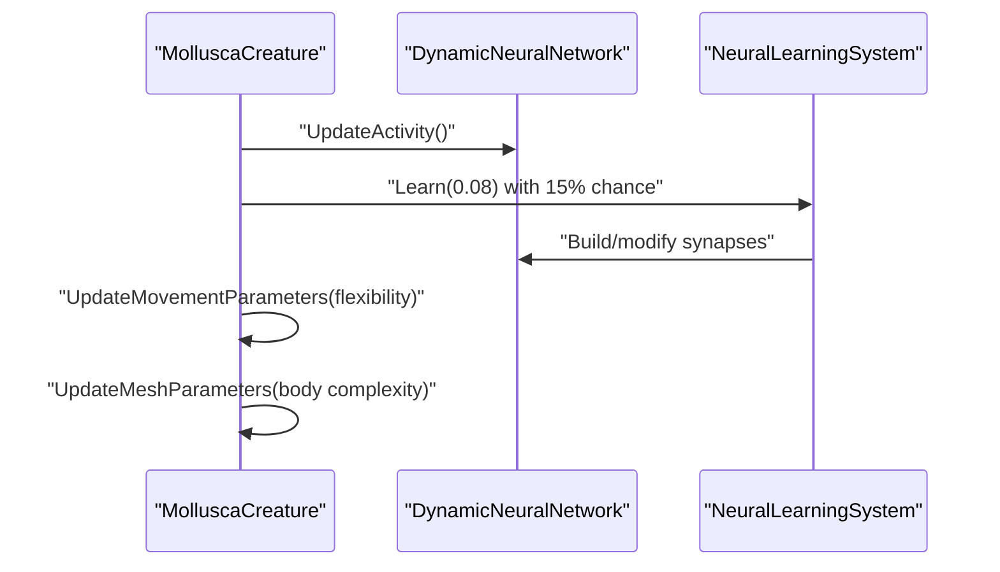
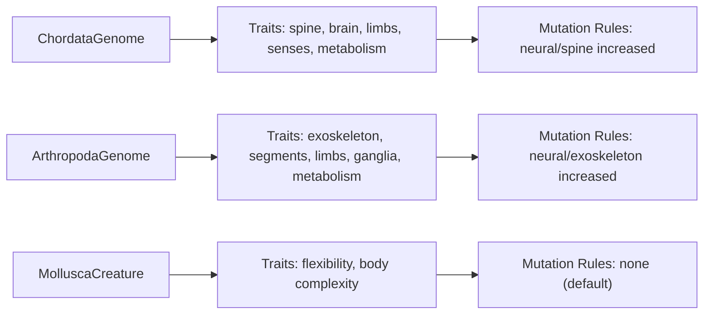
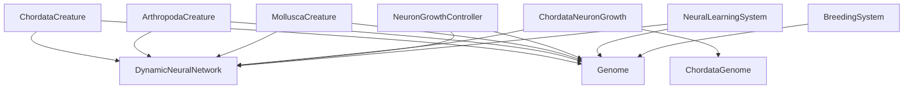

# Organism Classification Systems

<cite>
**Referenced Files in This Document**
- [ChordataCreature.cs](file://GeneticsGame/Phyla/Chordata/ChordataCreature.cs)
- [ChordataGenome.cs](file://GeneticsGame/Phyla/Chordata/ChordataGenome.cs)
- [ChordataNeuronGrowth.cs](file://GeneticsGame/Phyla/Chordata/ChordataNeuronGrowth.cs)
- [ArthropodaCreature.cs](file://GeneticsGame/Phyla/Arthropoda/ArthropodaCreature.cs)
- [ArthropodaGenome.cs](file://GeneticsGame/Phyla/Arthropoda/ArthropodaGenome.cs)
- [MolluscaCreature.cs](file://GeneticsGame/Phyla/Mollusca/MolluscaCreature.cs)
- [Genome.cs](file://GeneticsGame/Core/Genome.cs)
- [DynamicNeuralNetwork.cs](file://GeneticsGame/Systems/DynamicNeuralNetwork.cs)
- [Neuron.cs](file://GeneticsGame/Systems/Neuron.cs)
- [NeuronGrowthController.cs](file://GeneticsGame/Systems/NeuronGrowthController.cs)
- [NeuralLearningSystem.cs](file://GeneticsGame/Systems/NeuralLearningSystem.cs)
- [Connection.cs](file://GeneticsGame/Systems/Connection.cs)
- [BreedingSystem.cs](file://GeneticsGame/Systems/BreedingSystem.cs)
</cite>

## Table of Contents
1. [Introduction](#introduction)
2. [Project Structure](#project-structure)
3. [Core Components](#core-components)
4. [Architecture Overview](#architecture-overview)
5. [Detailed Component Analysis](#detailed-component-analysis)
6. [Dependency Analysis](#dependency-analysis)
7. [Performance Considerations](#performance-considerations)
8. [Troubleshooting Guide](#troubleshooting-guide)
9. [Conclusion](#conclusion)

## Introduction
This document explains the organism classification systems that model different evolutionary strategies through specialized genetic and phenotypic implementations. It focuses on three phyla:
- Chordata: vertebrate-like creatures with complex nervous systems, spinal columns, and advanced behavioral complexity.
- Arthropoda: exoskeleton-bearing, segmented creatures with jointed appendages and efficient locomotion.
- Mollusca: soft-bodied organisms with flexible forms and unique neural adaptations.

Each classification system adapts the core genetic and neural frameworks to distinct evolutionary pressures and environmental niches, enabling varied movement patterns, morphologies, and behavioral strategies.

## Project Structure
The classification systems are organized by phylum under a dedicated folder, each implementing a creature class, a genome specialization, and, for Chordata, a specialized neuron growth controller. Shared systems handle neural dynamics, growth control, and heredity.

**Diagram sources**
- [Genome.cs:1-190](file://GeneticsGame/Core/Genome.cs#L1-L190)
- [DynamicNeuralNetwork.cs:1-116](file://GeneticsGame/Systems/DynamicNeuralNetwork.cs#L1-L116)
- [Neuron.cs:1-70](file://GeneticsGame/Systems/Neuron.cs#L1-L70)
- [Connection.cs:1-35](file://GeneticsGame/Systems/Connection.cs#L1-L35)
- [NeuronGrowthController.cs:1-122](file://GeneticsGame/Systems/NeuronGrowthController.cs#L1-L122)
- [NeuralLearningSystem.cs:1-122](file://GeneticsGame/Systems/NeuralLearningSystem.cs#L1-L122)
- [BreedingSystem.cs:1-182](file://GeneticsGame/Systems/BreedingSystem.cs#L1-L182)
- [ChordataCreature.cs:1-133](file://GeneticsGame/Phyla/Chordata/ChordataCreature.cs#L1-L133)
- [ChordataGenome.cs:1-134](file://GeneticsGame/Phyla/Chordata/ChordataGenome.cs#L1-L134)
- [ChordataNeuronGrowth.cs:1-216](file://GeneticsGame/Phyla/Chordata/ChordataNeuronGrowth.cs#L1-L216)
- [ArthropodaCreature.cs:1-133](file://GeneticsGame/Phyla/Arthropoda/ArthropodaCreature.cs#L1-L133)
- [ArthropodaGenome.cs:1-134](file://GeneticsGame/Phyla/Arthropoda/ArthropodaGenome.cs#L1-L134)
- [MolluscaCreature.cs:1-133](file://GeneticsGame/Phyla/Mollusca/MolluscaCreature.cs#L1-L133)

**Section sources**
- [ChordataCreature.cs:1-133](file://GeneticsGame/Phyla/Chordata/ChordataCreature.cs#L1-L133)
- [ChordataGenome.cs:1-134](file://GeneticsGame/Phyla/Chordata/ChordataGenome.cs#L1-L134)
- [ChordataNeuronGrowth.cs:1-216](file://GeneticsGame/Phyla/Chordata/ChordataNeuronGrowth.cs#L1-L216)
- [ArthropodaCreature.cs:1-133](file://GeneticsGame/Phyla/Arthropoda/ArthropodaCreature.cs#L1-L133)
- [ArthropodaGenome.cs:1-134](file://GeneticsGame/Phyla/Arthropoda/ArthropodaGenome.cs#L1-L134)
- [MolluscaCreature.cs:1-133](file://GeneticsGame/Phyla/Mollusca/MolluscaCreature.cs#L1-L133)
- [Genome.cs:1-190](file://GeneticsGame/Core/Genome.cs#L1-L190)
- [DynamicNeuralNetwork.cs:1-116](file://GeneticsGame/Systems/DynamicNeuralNetwork.cs#L1-L116)
- [Neuron.cs:1-70](file://GeneticsGame/Systems/Neuron.cs#L1-L70)
- [NeuronGrowthController.cs:1-122](file://GeneticsGame/Systems/NeuronGrowthController.cs#L1-L122)
- [NeuralLearningSystem.cs:1-122](file://GeneticsGame/Systems/NeuralLearningSystem.cs#L1-L122)
- [Connection.cs:1-35](file://GeneticsGame/Systems/Connection.cs#L1-L35)
- [BreedingSystem.cs:1-182](file://GeneticsGame/Systems/BreedingSystem.cs#L1-L182)

## Core Components
- ChordataCreature: Integrates a neural network, procedural movement/mesh generation, and learning-driven updates. It scales movement complexity and mesh vertex count based on neural activity and neuron growth.
- ChordataGenome: Encodes vertebrate-specific traits (spine, brain, limbs, sensory, metabolism) with elevated mutation rates for neural and skeletal genes.
- ChordataNeuronGrowth: Specialized neuron growth and plasticity tailored to brain size, spine length, and sensory acuity.
- ArthropodaCreature: Similar lifecycle with lower learning frequency and exoskeleton-driven mesh scaling via segmentation and limb genes.
- ArthropodaGenome: Encodes exoskeleton thickness/hardness, segmentation, joint complexity, ganglia, nerve cords, and metabolic traits.
- MolluscaCreature: Emphasizes flexible body plans with higher learning probability and body complexity-driven mesh generation.
- Shared Systems: DynamicNeuralNetwork manages activity and growth; NeuronGrowthController orchestrates hybrid growth triggers; NeuralLearningSystem drives synaptogenesis and adaptation; BreedingSystem simulates inheritance and mutation.

**Section sources**
- [ChordataCreature.cs:39-133](file://GeneticsGame/Phyla/Chordata/ChordataCreature.cs#L39-L133)
- [ChordataGenome.cs:24-134](file://GeneticsGame/Phyla/Chordata/ChordataGenome.cs#L24-L134)
- [ChordataNeuronGrowth.cs:36-216](file://GeneticsGame/Phyla/Chordata/ChordataNeuronGrowth.cs#L36-L216)
- [ArthropodaCreature.cs:41-133](file://GeneticsGame/Phyla/Arthropoda/ArthropodaCreature.cs#L41-L133)
- [ArthropodaGenome.cs:24-134](file://GeneticsGame/Phyla/Arthropoda/ArthropodaGenome.cs#L24-L134)
- [MolluscaCreature.cs:41-133](file://GeneticsGame/Phyla/Mollusca/MolluscaCreature.cs#L41-L133)
- [DynamicNeuralNetwork.cs:36-116](file://GeneticsGame/Systems/DynamicNeuralNetwork.cs#L36-L116)
- [NeuronGrowthController.cs:36-122](file://GeneticsGame/Systems/NeuronGrowthController.cs#L36-L122)
- [NeuralLearningSystem.cs:37-122](file://GeneticsGame/Systems/NeuralLearningSystem.cs#L37-L122)
- [BreedingSystem.cs:18-182](file://GeneticsGame/Systems/BreedingSystem.cs#L18-L182)

## Architecture Overview
The classification systems share a unified genetic backbone with phyla-specific extensions:
- Genetic Blueprint: Genome provides chromosome/gene containers, epistatic interactions, and hereditary mixing.
- Neural Network: DynamicNeuralNetwork tracks activity and supports growth; NeuronGrowthController and NeuralLearningSystem coordinate triggers.
- Phenotype Generation: Creatures compute movement parameters and mesh attributes from neural activity and genetic expression.
- Specializations: Chordata adds ChordataNeuronGrowth for vertebrate-specific neural development; Arthropoda and Mollusca adapt growth and learning rates to their body plans.

```mermaid
classDiagram
class Genome {
+string Id
+Chromosome[] Chromosomes
+AddChromosome(chromosome)
+ApplyMutations() int
+GetTotalNeuronGrowthCount() int
+CalculateEpistaticInteractions() Dictionary
+Breed(parent1, parent2) Genome
}
class DynamicNeuralNetwork {
+Neuron[] Neurons
+Connection[] Connections
+double ActivityLevel
+AddNeuron(neuron)
+AddConnection(fromNeuron, toNeuron, weight)
+GrowNeurons(genome, activityThreshold) int
+UpdateActivity()
}
class Neuron {
+string Id
+double Activation
+double Threshold
+NeuronType Type
}
class Connection {
+Neuron FromNeuron
+Neuron ToNeuron
+double Weight
}
class NeuronGrowthController {
+DynamicNeuralNetwork NeuralNetwork
+Genome Genome
+TriggerByGeneticExpression() int
+TriggerByMutation() int
+TriggerByLearning(learningRate) int
+ExecuteHybridGrowthTrigger() int
}
class NeuralLearningSystem {
+DynamicNeuralNetwork NeuralNetwork
+Genome Genome
+Learn(learningRate) int
+AdaptToEnvironment(envFactors, taskReqs) double
+LearnOverTime(cycles, learningRate) int
}
class ChordataGenome {
+GetChordataTraits() Dictionary
+ApplyChordataSpecificMutations() int
}
class ChordataNeuronGrowth {
+DynamicNeuralNetwork NeuralNetwork
+ChordataGenome Genome
+GrowChordataNeurons() int
+ApplyChordataPlasticity() int
}
class ArthropodaGenome {
+GetArthropodaTraits() Dictionary
+ApplyArthropodaSpecificMutations() int
}
class ChordataCreature {
+string Id
+Genome Genome
+DynamicNeuralNetwork NeuralNetwork
+MovementParameters MovementParameters
+MeshParameters MeshParameters
+Update(timeStep)
+GetVisualizationParameters() VisualizationParameters
}
class ArthropodaCreature {
+string Id
+Genome Genome
+DynamicNeuralNetwork NeuralNetwork
+MovementParameters MovementParameters
+MeshParameters MeshParameters
+Update(timeStep)
+GetVisualizationParameters() VisualizationParameters
}
class MolluscaCreature {
+string Id
+Genome Genome
+DynamicNeuralNetwork NeuralNetwork
+MovementParameters MovementParameters
+MeshParameters MeshParameters
+Update(timeStep)
+GetVisualizationParameters() VisualizationParameters
}
ChordataCreature --> DynamicNeuralNetwork : "uses"
ChordataCreature --> Genome : "uses"
ArthropodaCreature --> DynamicNeuralNetwork : "uses"
ArthropodaCreature --> Genome : "uses"
MolluscaCreature --> DynamicNeuralNetwork : "uses"
MolluscaCreature --> Genome : "uses"
NeuronGrowthController --> DynamicNeuralNetwork : "manages"
NeuronGrowthController --> Genome : "triggers"
NeuralLearningSystem --> DynamicNeuralNetwork : "learns"
NeuralLearningSystem --> Genome : "context"
ChordataNeuronGrowth --> DynamicNeuralNetwork : "modifies"
ChordataNeuronGrowth --> ChordataGenome : "context"
ChordataGenome --|> Genome : "extends"
ArthropodaGenome --|> Genome : "extends"
```

**Diagram sources**
- [Genome.cs:1-190](file://GeneticsGame/Core/Genome.cs#L1-L190)
- [DynamicNeuralNetwork.cs:1-116](file://GeneticsGame/Systems/DynamicNeuralNetwork.cs#L1-L116)
- [Neuron.cs:1-70](file://GeneticsGame/Systems/Neuron.cs#L1-L70)
- [Connection.cs:1-35](file://GeneticsGame/Systems/Connection.cs#L1-L35)
- [NeuronGrowthController.cs:1-122](file://GeneticsGame/Systems/NeuronGrowthController.cs#L1-L122)
- [NeuralLearningSystem.cs:1-122](file://GeneticsGame/Systems/NeuralLearningSystem.cs#L1-L122)
- [ChordataGenome.cs:9-134](file://GeneticsGame/Phyla/Chordata/ChordataGenome.cs#L9-L134)
- [ChordataNeuronGrowth.cs:9-216](file://GeneticsGame/Phyla/Chordata/ChordataNeuronGrowth.cs#L9-L216)
- [ArthropodaGenome.cs:9-134](file://GeneticsGame/Phyla/Arthropoda/ArthropodaGenome.cs#L9-L134)
- [ChordataCreature.cs:9-133](file://GeneticsGame/Phyla/Chordata/ChordataCreature.cs#L9-L133)
- [ArthropodaCreature.cs:9-133](file://GeneticsGame/Phyla/Arthropoda/ArthropodaCreature.cs#L9-L133)
- [MolluscaCreature.cs:9-133](file://GeneticsGame/Phyla/Mollusca/MolluscaCreature.cs#L9-L133)

## Detailed Component Analysis

### Chordata Creature and Neural System
ChordataCreature integrates:
- Neural network initialization and periodic learning.
- Movement parameters scaled by neural activity and connection counts.
- Mesh scaling driven by average gene expression and neuron growth.
- Visualization via a shared visualization system.

ChordataNeuronGrowth specializes:
- Neuron growth proportional to brain size, spine length, and synapse density.
- Neuron typing influenced by traits like vision acuity, hearing range, and balance system.
- Plasticity rules that strengthen visual and balance pathways and general connections.

**Diagram sources**
- [ChordataCreature.cs:61-122](file://GeneticsGame/Phyla/Chordata/ChordataCreature.cs#L61-L122)
- [DynamicNeuralNetwork.cs:104-116](file://GeneticsGame/Systems/DynamicNeuralNetwork.cs#L104-L116)
- [NeuralLearningSystem.cs:37-57](file://GeneticsGame/Systems/NeuralLearningSystem.cs#L37-L57)
- [ChordataNeuronGrowth.cs:36-136](file://GeneticsGame/Phyla/Chordata/ChordataNeuronGrowth.cs#L36-L136)
- [ChordataGenome.cs:76-134](file://GeneticsGame/Phyla/Chordata/ChordataGenome.cs#L76-L134)

**Section sources**
- [ChordataCreature.cs:41-133](file://GeneticsGame/Phyla/Chordata/ChordataCreature.cs#L41-L133)
- [ChordataNeuronGrowth.cs:36-216](file://GeneticsGame/Phyla/Chordata/ChordataNeuronGrowth.cs#L36-L216)
- [ChordataGenome.cs:24-134](file://GeneticsGame/Phyla/Chordata/ChordataGenome.cs#L24-L134)

### Arthropoda Creature and Genetic Architecture
ArthropodaCreature mirrors the chordate pipeline with:
- Lower baseline learning probability and rate.
- Movement complexity derived from limb counts inferred from epistatic interactions.
- Mesh scaling based on exoskeleton and shell-related gene interactions.

ArthropodaGenome encodes:
- Exoskeleton thickness/hardness and molting cycle.
- Segment count, segment size variation, and joint complexity.
- Ganglion count, nerve cord length, and sensory neuron density.
- Metabolic traits including temperature tolerance.

**Diagram sources**
- [ArthropodaCreature.cs:61-122](file://GeneticsGame/Phyla/Arthropoda/ArthropodaCreature.cs#L61-L122)
- [ArthropodaGenome.cs:76-134](file://GeneticsGame/Phyla/Arthropoda/ArthropodaGenome.cs#L76-L134)

**Section sources**
- [ArthropodaCreature.cs:41-133](file://GeneticsGame/Phyla/Arthropoda/ArthropodaCreature.cs#L41-L133)
- [ArthropodaGenome.cs:24-134](file://GeneticsGame/Phyla/Arthropoda/ArthropodaGenome.cs#L24-L134)

### Mollusca Creature and Flexible Body Plan
MolluscaCreature emphasizes:
- Higher learning probability and stronger learning rate.
- Movement complexity based on flexibility-related gene interactions.
- Mesh scaling according to body complexity traits.

**Diagram sources**
- [MolluscaCreature.cs:61-122](file://GeneticsGame/Phyla/Mollusca/MolluscaCreature.cs#L61-L122)
- [NeuralLearningSystem.cs:37-57](file://GeneticsGame/Systems/NeuralLearningSystem.cs#L37-L57)

**Section sources**
- [MolluscaCreature.cs:41-133](file://GeneticsGame/Phyla/Mollusca/MolluscaCreature.cs#L41-L133)

### Comparative Genetic Approaches
- Chordata: Elevated mutation rates for neural/spinal genes; traits include spine length, brain size, neuron count, synapse density, and sensory acuity.
- Arthropoda: Elevated mutation rates for neural/exoskeleton genes; traits include exoskeleton thickness/hardness, molting cycle, segment count, joint complexity, and ganglion count.
- Mollusca: No phyla-specific mutation overrides; emphasis on flexibility and body complexity.

**Diagram sources**
- [ChordataGenome.cs:76-134](file://GeneticsGame/Phyla/Chordata/ChordataGenome.cs#L76-L134)
- [ArthropodaGenome.cs:76-134](file://GeneticsGame/Phyla/Arthropoda/ArthropodaGenome.cs#L76-L134)
- [MolluscaCreature.cs:61-122](file://GeneticsGame/Phyla/Mollusca/MolluscaCreature.cs#L61-L122)

**Section sources**
- [ChordataGenome.cs:101-134](file://GeneticsGame/Phyla/Chordata/ChordataGenome.cs#L101-L134)
- [ArthropodaGenome.cs:101-134](file://GeneticsGame/Phyla/Arthropoda/ArthropodaGenome.cs#L101-L134)

## Dependency Analysis
Key dependencies:
- Creatures depend on Genome and DynamicNeuralNetwork.
- ChordataNeuronGrowth depends on ChordataGenome and DynamicNeuralNetwork.
- NeuronGrowthController coordinates growth triggers from genetic expression, mutation, and learning.
- NeuralLearningSystem orchestrates synaptogenesis and adaptation.
- BreedingSystem provides heredity and mutation propagation.

**Diagram sources**
- [ChordataCreature.cs:41-55](file://GeneticsGame/Phyla/Chordata/ChordataCreature.cs#L41-L55)
- [ArthropodaCreature.cs:41-55](file://GeneticsGame/Phyla/Arthropoda/ArthropodaCreature.cs#L41-L55)
- [MolluscaCreature.cs:41-55](file://GeneticsGame/Phyla/Mollusca/MolluscaCreature.cs#L41-L55)
- [ChordataNeuronGrowth.cs:26-30](file://GeneticsGame/Phyla/Chordata/ChordataNeuronGrowth.cs#L26-L30)
- [NeuronGrowthController.cs:26-30](file://GeneticsGame/Systems/NeuronGrowthController.cs#L26-L30)
- [NeuralLearningSystem.cs:26-30](file://GeneticsGame/Systems/NeuralLearningSystem.cs#L26-L30)
- [BreedingSystem.cs:18-27](file://GeneticsGame/Systems/BreedingSystem.cs#L18-L27)

**Section sources**
- [DynamicNeuralNetwork.cs:36-99](file://GeneticsGame/Systems/DynamicNeuralNetwork.cs#L36-L99)
- [NeuronGrowthController.cs:107-122](file://GeneticsGame/Systems/NeuronGrowthController.cs#L107-L122)
- [NeuralLearningSystem.cs:53-57](file://GeneticsGame/Systems/NeuralLearningSystem.cs#L53-L57)
- [BreedingSystem.cs:134-182](file://GeneticsGame/Systems/BreedingSystem.cs#L134-L182)

## Performance Considerations
- Neural growth thresholds and max growth caps prevent uncontrolled expansion; tune activity thresholds and max growth per generation to balance realism and performance.
- Epistatic interaction calculations scale with gene count; limit interaction depth or cache results if simulating large populations.
- Movement and mesh updates depend on neural activity and gene expression; consider batching updates or using coarse-grained parameters for real-time scenarios.
- Visualization parameter generation should be decoupled from update loops when rendering is intensive.

## Troubleshooting Guide
- Low neural activity: Verify activity thresholds and ensure sufficient learning or genetic triggers.
- Excessive growth: Confirm max growth limits and that activity thresholds are properly configured.
- Poor adaptation scores: Review trait weights and epistatic interactions; adjust genetic constraints and learning rates.
- Inheritance anomalies: Validate BreedingSystem compatibility scoring and ensure consistent gene IDs across parents.

**Section sources**
- [DynamicNeuralNetwork.cs:63-99](file://GeneticsGame/Systems/DynamicNeuralNetwork.cs#L63-L99)
- [NeuronGrowthController.cs:107-122](file://GeneticsGame/Systems/NeuronGrowthController.cs#L107-L122)
- [NeuralLearningSystem.cs:65-103](file://GeneticsGame/Systems/NeuralLearningSystem.cs#L65-L103)
- [BreedingSystem.cs:35-128](file://GeneticsGame/Systems/BreedingSystem.cs#L35-L128)

## Conclusion
The classification systems demonstrate how a shared genetic and neural framework can encode diverse evolutionary strategies. Chordata emphasizes centralized nervous systems and complex behaviors; Arthropoda prioritizes modular segmentation and robust exoskeletons; Mollusca favors flexible bodies and adaptable neural plasticity. These differences emerge from phyla-specific genes, mutation rules, and neural growth/plasticity mechanisms, enabling varied movement, morphology, and behavioral capabilities suited to distinct ecological niches.