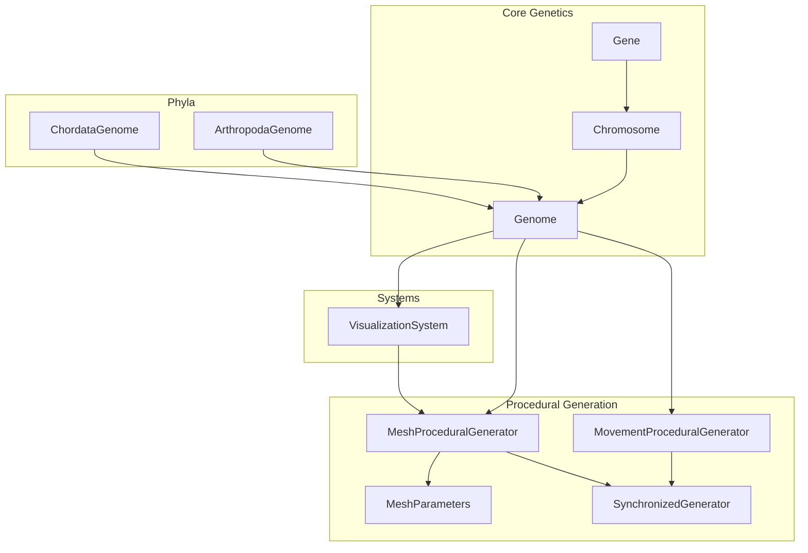
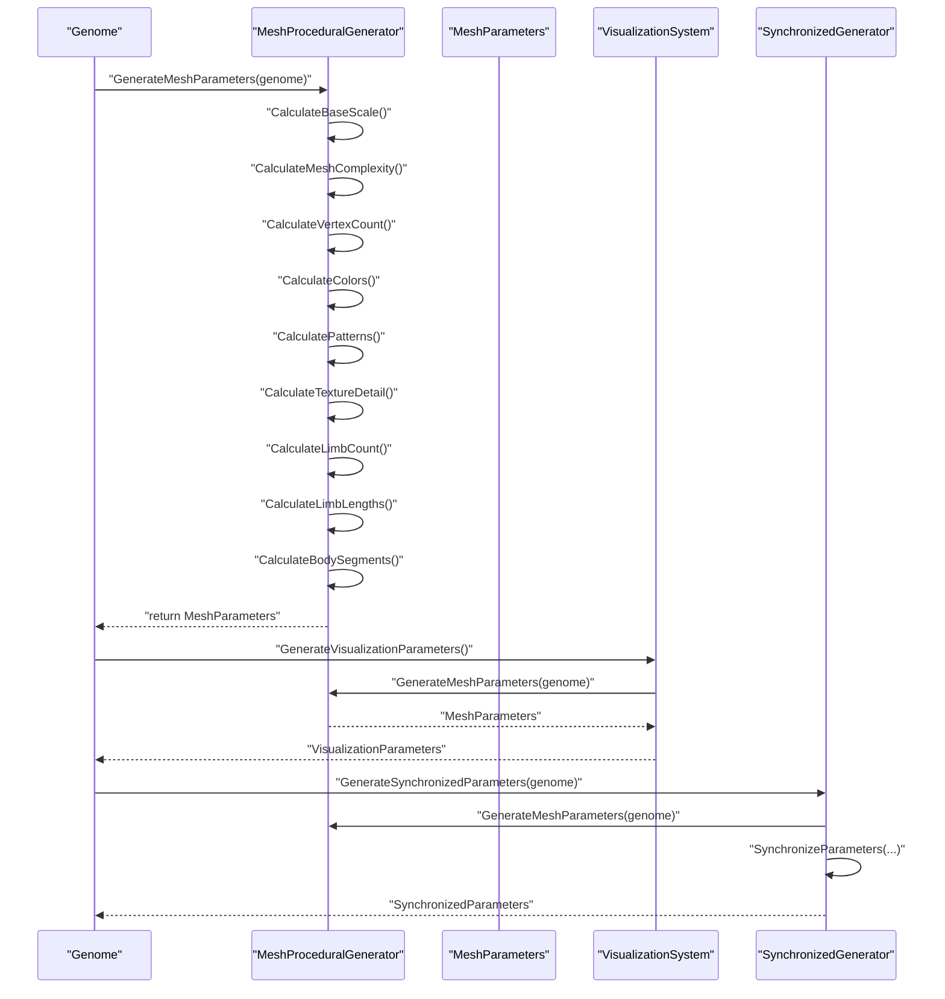
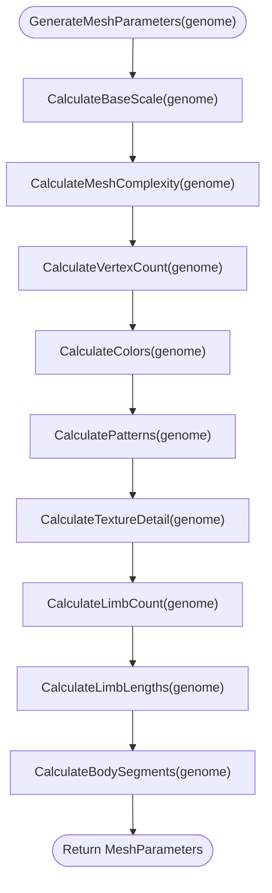
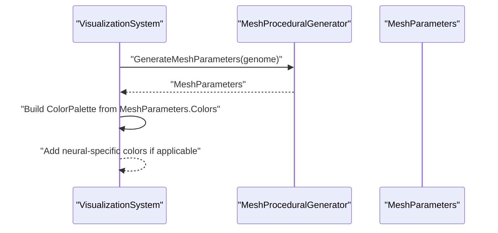
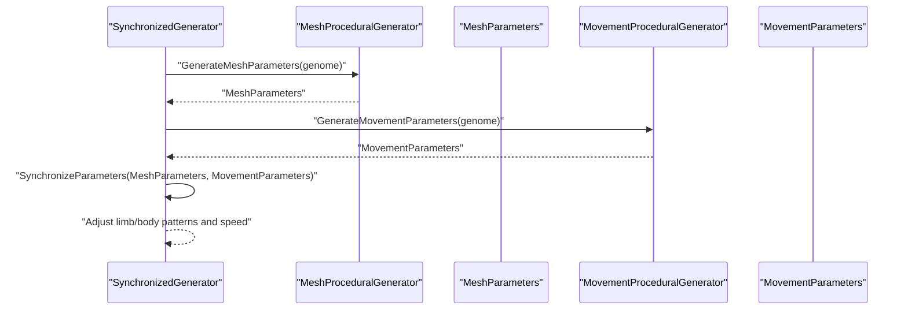
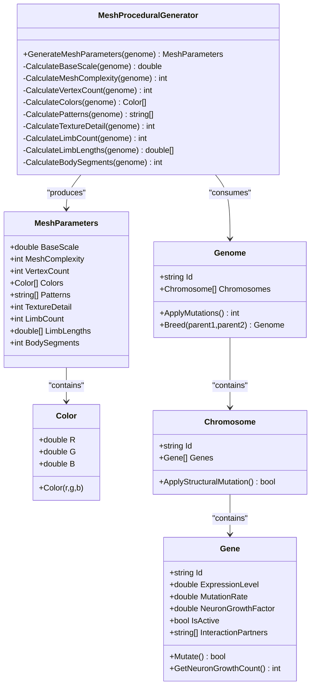

# Mesh Procedural Generator

<cite>
**Referenced Files in This Document**
- [MeshProceduralGenerator.cs](file://GeneticsGame/Procedural/Mesh/MeshProceduralGenerator.cs)
- [Genome.cs](file://GeneticsGame/Core/Genome.cs)
- [Chromosome.cs](file://GeneticsGame/Core/Chromosome.cs)
- [Gene.cs](file://GeneticsGame/Core/Gene.cs)
- [VisualizationSystem.cs](file://GeneticsGame/Systems/VisualizationSystem.cs)
- [SynchronizedGenerator.cs](file://GeneticsGame/Procedural/SynchronizedGenerator.cs)
- [MovementProceduralGenerator.cs](file://GeneticsGame/Procedural/Movement/MovementProceduralGenerator.cs)
- [ArthropodaGenome.cs](file://GeneticsGame/Phyla/Arthropoda/ArthropodaGenome.cs)
- [ChordataGenome.cs](file://GeneticsGame/Phyla/Chordata/ChordataGenome.cs)
</cite>

## Table of Contents
1. [Introduction](#introduction)
2. [Project Structure](#project-structure)
3. [Core Components](#core-components)
4. [Architecture Overview](#architecture-overview)
5. [Detailed Component Analysis](#detailed-component-analysis)
6. [Dependency Analysis](#dependency-analysis)
7. [Performance Considerations](#performance-considerations)
8. [Troubleshooting Guide](#troubleshooting-guide)
9. [Conclusion](#conclusion)

## Introduction
This document explains the MeshProceduralGenerator, a core component responsible for converting genetic information into 3D mesh parameters that define creature anatomy and appearance. It details how genetic variations influence mesh properties such as body segments, limb count, scale factors, surface geometry, vertex distribution, and color/pattern characteristics. The document also covers the integration with visualization systems, the mathematical foundations of procedural mesh construction, and practical guidance for real-time performance optimization.

## Project Structure
The MeshProceduralGenerator resides in the procedural generation subsystem alongside movement generation and synchronization logic. It consumes genetic data from the core genetics framework and produces structured mesh parameters consumed by downstream visualization and rendering systems.

**Diagram sources**
- [MeshProceduralGenerator.cs:16-36](file://GeneticsGame/Procedural/Mesh/MeshProceduralGenerator.cs#L16-L36)
- [Genome.cs:9-29](file://GeneticsGame/Core/Genome.cs#L9-L29)
- [Chromosome.cs:9-29](file://GeneticsGame/Core/Chromosome.cs#L9-L29)
- [Gene.cs:9-57](file://GeneticsGame/Core/Gene.cs#L9-L57)
- [VisualizationSystem.cs:87-88](file://GeneticsGame/Systems/VisualizationSystem.cs#L87-L88)
- [SynchronizedGenerator.cs:26-27](file://GeneticsGame/Procedural/SynchronizedGenerator.cs#L26-L27)
- [MovementProceduralGenerator.cs:16-35](file://GeneticsGame/Procedural/Movement/MovementProceduralGenerator.cs#L16-L35)
- [ArthropodaGenome.cs:9-19](file://GeneticsGame/Phyla/Arthropoda/ArthropodaGenome.cs#L9-L19)
- [ChordataGenome.cs:9-19](file://GeneticsGame/Phyla/Chordata/ChordataGenome.cs#L9-L19)

**Section sources**
- [MeshProceduralGenerator.cs:1-365](file://GeneticsGame/Procedural/Mesh/MeshProceduralGenerator.cs#L1-L365)
- [Genome.cs:1-190](file://GeneticsGame/Core/Genome.cs#L1-L190)
- [Chromosome.cs:1-146](file://GeneticsGame/Core/Chromosome.cs#L1-L146)
- [Gene.cs:1-93](file://GeneticsGame/Core/Gene.cs#L1-L93)
- [VisualizationSystem.cs:1-239](file://GeneticsGame/Systems/VisualizationSystem.cs#L1-L239)
- [SynchronizedGenerator.cs:1-141](file://GeneticsGame/Procedural/SynchronizedGenerator.cs#L1-L141)
- [MovementProceduralGenerator.cs:1-389](file://GeneticsGame/Procedural/Movement/MovementProceduralGenerator.cs#L1-L389)
- [ArthropodaGenome.cs:1-134](file://GeneticsGame/Phyla/Arthropoda/ArthropodaGenome.cs#L1-L134)
- [ChordataGenome.cs:1-134](file://GeneticsGame/Phyla/Chordata/ChordataGenome.cs#L1-L134)

## Core Components
- MeshProceduralGenerator: Translates a genome into a structured set of mesh parameters including scale, complexity, vertex count, colors, patterns, texture detail, limb count/lengths, and body segments.
- MeshParameters: Encapsulates all generated mesh properties for downstream use.
- Color: Lightweight color representation used by mesh parameters.
- Integration points:
  - VisualizationSystem: Uses MeshProceduralGenerator to derive color palettes for rendering.
  - SynchronizedGenerator: Coordinates mesh and movement parameters to ensure anatomical and behavioral consistency.

Key responsibilities:
- Base scale calculation from overall gene expression levels.
- Mesh complexity derived from chromosome/gene counts.
- Vertex count proportional to complexity.
- Visual features (colors, patterns, texture detail) from genes with specific identifiers.
- Structural features (limbs, segments) from genes with specific identifiers.

**Section sources**
- [MeshProceduralGenerator.cs:16-365](file://GeneticsGame/Procedural/Mesh/MeshProceduralGenerator.cs#L16-L365)
- [VisualizationSystem.cs:87-109](file://GeneticsGame/Systems/VisualizationSystem.cs#L87-L109)
- [SynchronizedGenerator.cs:35-124](file://GeneticsGame/Procedural/SynchronizedGenerator.cs#L35-L124)

## Architecture Overview
The mesh generation pipeline begins with a genome and culminates in a set of mesh parameters that drive visualization and movement synchronization.

**Diagram sources**
- [MeshProceduralGenerator.cs:16-36](file://GeneticsGame/Procedural/Mesh/MeshProceduralGenerator.cs#L16-L36)
- [VisualizationSystem.cs:36-53](file://GeneticsGame/Systems/VisualizationSystem.cs#L36-L53)
- [SynchronizedGenerator.cs:35-49](file://GeneticsGame/Procedural/SynchronizedGenerator.cs#L35-L49)

## Detailed Component Analysis

### MeshProceduralGenerator
Responsibilities:
- Convert a genome into MeshParameters.
- Compute base scale from average gene expression levels.
- Derive mesh complexity from chromosome and gene counts.
- Compute vertex count based on complexity.
- Generate color palettes from color-related genes.
- Determine pattern types from pattern-related genes.
- Compute texture detail from texture-related genes.
- Calculate limb count and lengths from limb-related genes.
- Compute body segment count from segment-related genes.

Algorithmic approach:
- Base scale: Aggregates expression levels across all genes, maps to a bounded scale range.
- Complexity: Weighted sum of chromosome count and gene count per chromosome, clamped to a fixed range.
- Vertex count: Linear scaling with complexity.
- Colors: Selects genes whose IDs indicate color/pigment-related traits; defaults if none found.
- Patterns: Selects genes whose IDs indicate pattern-related traits; thresholds determine pattern type.
- Texture detail: Selects genes whose IDs indicate texture-related traits; clamped to a fixed range.
- Limb count: Selects genes whose IDs indicate limb-related traits; clamped to a fixed range.
- Limb lengths: Deterministic per-limb length derived from uniform noise around a central value.
- Body segments: Selects genes whose IDs indicate segment/body-related traits; clamped to a fixed range.

**Diagram sources**
- [MeshProceduralGenerator.cs:16-36](file://GeneticsGame/Procedural/Mesh/MeshProceduralGenerator.cs#L16-L36)
- [MeshProceduralGenerator.cs:43-62](file://GeneticsGame/Procedural/Mesh/MeshProceduralGenerator.cs#L43-L62)
- [MeshProceduralGenerator.cs:69-80](file://GeneticsGame/Procedural/Mesh/MeshProceduralGenerator.cs#L69-L80)
- [MeshProceduralGenerator.cs:87-94](file://GeneticsGame/Procedural/Mesh/MeshProceduralGenerator.cs#L87-L94)
- [MeshProceduralGenerator.cs:101-139](file://GeneticsGame/Procedural/Mesh/MeshProceduralGenerator.cs#L101-L139)
- [MeshProceduralGenerator.cs:146-188](file://GeneticsGame/Procedural/Mesh/MeshProceduralGenerator.cs#L146-L188)
- [MeshProceduralGenerator.cs:195-211](file://GeneticsGame/Procedural/Mesh/MeshProceduralGenerator.cs#L195-L211)
- [MeshProceduralGenerator.cs:218-235](file://GeneticsGame/Procedural/Mesh/MeshProceduralGenerator.cs#L218-L235)
- [MeshProceduralGenerator.cs:242-255](file://GeneticsGame/Procedural/Mesh/MeshProceduralGenerator.cs#L242-L255)
- [MeshProceduralGenerator.cs:262-279](file://GeneticsGame/Procedural/Mesh/MeshProceduralGenerator.cs#L262-L279)

**Section sources**
- [MeshProceduralGenerator.cs:16-365](file://GeneticsGame/Procedural/Mesh/MeshProceduralGenerator.cs#L16-L365)

### MeshParameters
Structure and semantics:
- BaseScale: Global size multiplier affecting all spatial dimensions.
- MeshComplexity: Integer complexity level influencing vertex count and geometric detail.
- VertexCount: Total number of vertices in the generated mesh.
- Colors: List of color definitions for surface coloring.
- Patterns: List of pattern names (e.g., solid, striped, spotted, mottled).
- TextureDetail: Integer texture detail level.
- LimbCount: Number of appendages.
- LimbLengths: Per-limb length values.
- BodySegments: Number of body regions (head, torso, tail, etc.).

Relationship to genetics:
- Derived from gene expression levels and gene identity patterns.
- Limb count and lengths are influenced by genes with limb-related identifiers.
- Body segments are influenced by genes with segment/body-related identifiers.
- Colors, patterns, and texture detail are influenced by genes with color/pattern/texture identifiers.

**Section sources**
- [MeshProceduralGenerator.cs:285-331](file://GeneticsGame/Procedural/Mesh/MeshProceduralGenerator.cs#L285-L331)

### Color
Simple RGB color representation used by MeshParameters.

**Section sources**
- [MeshProceduralGenerator.cs:336-365](file://GeneticsGame/Procedural/Mesh/MeshProceduralGenerator.cs#L336-L365)

### Integration with VisualizationSystem
VisualizationSystem consumes MeshParameters to build a color palette for rendering. It composes colors from mesh parameters and adds neural-specific colors when a neural network is present.

**Diagram sources**
- [VisualizationSystem.cs:87-109](file://GeneticsGame/Systems/VisualizationSystem.cs#L87-L109)
- [MeshProceduralGenerator.cs:16-36](file://GeneticsGame/Procedural/Mesh/MeshProceduralGenerator.cs#L16-L36)

**Section sources**
- [VisualizationSystem.cs:36-109](file://GeneticsGame/Systems/VisualizationSystem.cs#L36-L109)

### Integration with SynchronizedGenerator
SynchronizedGenerator ensures mesh and movement parameters remain anatomically consistent. It aligns limb counts and body segments and adjusts speed and neural control levels based on mesh complexity.

**Diagram sources**
- [SynchronizedGenerator.cs:35-49](file://GeneticsGame/Procedural/SynchronizedGenerator.cs#L35-L49)
- [SynchronizedGenerator.cs:57-124](file://GeneticsGame/Procedural/SynchronizedGenerator.cs#L57-L124)
- [MovementProceduralGenerator.cs:16-35](file://GeneticsGame/Procedural/Movement/MovementProceduralGenerator.cs#L16-L35)

**Section sources**
- [SynchronizedGenerator.cs:35-124](file://GeneticsGame/Procedural/SynchronizedGenerator.cs#L35-L124)

### Genetic Influence Mapping
The generator maps genetic traits to mesh properties via:
- Expression level thresholds: Determines pattern types and counts.
- Identifier-based selection: Filters genes by ID substrings to identify trait-relevant genes.
- Range clamping: Ensures computed values fall within predefined bounds.

Examples of genetic-to-mesh mappings:
- Limb count: Genes with “limb” or “appendage” identifiers influence count; clamped to a fixed range.
- Body segments: Genes with “segment” or “body” identifiers influence segment count; clamped to a fixed range.
- Colors: Genes with “color”, “pigment”, or “melanin” identifiers contribute; defaults if none found.
- Patterns: Genes with “pattern”, “stripe”, or “spot” identifiers; thresholds determine pattern type.
- Texture detail: Genes with “texture”, “detail”, or “roughness” identifiers; clamped to a fixed range.

**Section sources**
- [MeshProceduralGenerator.cs:106-139](file://GeneticsGame/Procedural/Mesh/MeshProceduralGenerator.cs#L106-L139)
- [MeshProceduralGenerator.cs:150-188](file://GeneticsGame/Procedural/Mesh/MeshProceduralGenerator.cs#L150-L188)
- [MeshProceduralGenerator.cs:222-235](file://GeneticsGame/Procedural/Mesh/MeshProceduralGenerator.cs#L222-L235)
- [MeshProceduralGenerator.cs:266-279](file://GeneticsGame/Procedural/Mesh/MeshProceduralGenerator.cs#L266-L279)

### Mathematical Foundations
- Scaling: Base scale mapped from average expression levels to a bounded range.
- Complexity scoring: Sum of chromosome contributions plus gene density contributions, clamped to a fixed range.
- Vertex count: Linear scaling with complexity.
- Pattern assignment: Threshold-based classification of expression levels into discrete categories.
- Randomization: Limb lengths include uniform noise for subtle variation.

Complexity analysis:
- Time complexity: O(G) where G is the total number of genes across all chromosomes.
- Space complexity: O(L) where L is the number of limbs (for limb lengths) plus constant for other parameters.

**Section sources**
- [MeshProceduralGenerator.cs:43-62](file://GeneticsGame/Procedural/Mesh/MeshProceduralGenerator.cs#L43-L62)
- [MeshProceduralGenerator.cs:69-80](file://GeneticsGame/Procedural/Mesh/MeshProceduralGenerator.cs#L69-L80)
- [MeshProceduralGenerator.cs:87-94](file://GeneticsGame/Procedural/Mesh/MeshProceduralGenerator.cs#L87-L94)
- [MeshProceduralGenerator.cs:242-255](file://GeneticsGame/Procedural/Mesh/MeshProceduralGenerator.cs#L242-L255)

### Examples: Gene Combinations and Morphologies
Below are conceptual examples of how different gene combinations influence mesh properties. These illustrate the mapping from genetic traits to anatomical features.

- Example A: High expression of “limb” genes with elevated expression levels
  - Outcome: Increased limb count and varied limb lengths; synchronized movement patterns.
  - Reference: [MeshProceduralGenerator.cs:218-235](file://GeneticsGame/Procedural/Mesh/MeshProceduralGenerator.cs#L218-L235), [MovementProceduralGenerator.cs:149-178](file://GeneticsGame/Procedural/Movement/MovementProceduralGenerator.cs#L149-L178)

- Example B: High expression of “segment” genes
  - Outcome: Many body segments; segmented body movement patterns; increased neural control.
  - Reference: [MeshProceduralGenerator.cs:262-279](file://GeneticsGame/Procedural/Mesh/MeshProceduralGenerator.cs#L262-L279), [MovementProceduralGenerator.cs:185-211](file://GeneticsGame/Procedural/Movement/MovementProceduralGenerator.cs#L185-L211)

- Example C: Presence of “color”, “pigment”, or “melanin” genes
  - Outcome: Rich color palette derived from gene expression; defaults if absent.
  - Reference: [MeshProceduralGenerator.cs:101-139](file://GeneticsGame/Procedural/Mesh/MeshProceduralGenerator.cs#L101-L139)

- Example D: High expression of “pattern”, “stripe”, or “spot” genes
  - Outcome: Pattern types determined by expression thresholds; defaults to solid if none found.
  - Reference: [MeshProceduralGenerator.cs:146-188](file://GeneticsGame/Procedural/Mesh/MeshProceduralGenerator.cs#L146-L188)

- Example E: High expression of “texture”, “detail”, or “roughness” genes
  - Outcome: Elevated texture detail level; clamped to a fixed range.
  - Reference: [MeshProceduralGenerator.cs:195-211](file://GeneticsGame/Procedural/Mesh/MeshProceduralGenerator.cs#L195-L211)

- Example F: Arthropoda-specific genes (exoskeleton, segmentation, limbs)
  - Outcome: Specialized traits influence mesh complexity and structural features.
  - Reference: [ArthropodaGenome.cs:24-70](file://GeneticsGame/Phyla/Arthropoda/ArthropodaGenome.cs#L24-L70)

- Example G: Chordata-specific genes (spine, neural, limbs)
  - Outcome: Specialized traits influence mesh complexity and neural control.
  - Reference: [ChordataGenome.cs:24-70](file://GeneticsGame/Phyla/Chordata/ChordataGenome.cs#L24-L70)

## Dependency Analysis
The MeshProceduralGenerator depends on the core genetics model and integrates with visualization and synchronization systems.

**Diagram sources**
- [MeshProceduralGenerator.cs:9-365](file://GeneticsGame/Procedural/Mesh/MeshProceduralGenerator.cs#L9-L365)
- [Genome.cs:9-190](file://GeneticsGame/Core/Genome.cs#L9-L190)
- [Chromosome.cs:9-146](file://GeneticsGame/Core/Chromosome.cs#L9-L146)
- [Gene.cs:9-93](file://GeneticsGame/Core/Gene.cs#L9-L93)

**Section sources**
- [MeshProceduralGenerator.cs:9-365](file://GeneticsGame/Procedural/Mesh/MeshProceduralGenerator.cs#L9-L365)
- [Genome.cs:9-190](file://GeneticsGame/Core/Genome.cs#L9-L190)
- [Chromosome.cs:9-146](file://GeneticsGame/Core/Chromosome.cs#L9-L146)
- [Gene.cs:9-93](file://GeneticsGame/Core/Gene.cs#L9-L93)

## Performance Considerations
- Complexity vs. cost: Mesh complexity and vertex count scale linearly with complexity. For real-time generation, cap complexity and vertex count to maintain frame rates.
- Threshold checks: Pattern and texture computations iterate over all genes; keep the number of genes reasonable or cache intermediate results.
- Randomization: Limb length generation uses uniform noise; ensure deterministic seeding if reproducibility is required.
- Synchronization overhead: SynchronizedGenerator performs alignment checks; batch updates and avoid redundant recalculations.
- Visualization pipeline: VisualizationSystem composes colors from MeshParameters; precompute color palettes when possible.

Optimization techniques:
- Precompute and cache derived metrics (e.g., average expression) to avoid repeated traversal.
- Use early exits when sufficient traits are found (e.g., limb count).
- Clamp ranges aggressively to prevent excessive branching and computation.
- Consider parallelizing independent trait calculations if the genome is large.

[No sources needed since this section provides general guidance]

## Troubleshooting Guide
Common issues and resolutions:
- Unexpected mesh scale: Verify average expression levels and ensure genes with relevant identifiers are present.
- No color/pattern textures: Confirm presence of genes with “color”, “pattern”, or “texture” identifiers; default values apply when absent.
- Inconsistent limb/body counts: Use SynchronizedGenerator to align mesh and movement parameters.
- Performance bottlenecks: Reduce complexity or vertex count; cache intermediate results; avoid unnecessary recomputation.

**Section sources**
- [MeshProceduralGenerator.cs:101-139](file://GeneticsGame/Procedural/Mesh/MeshProceduralGenerator.cs#L101-L139)
- [MeshProceduralGenerator.cs:146-188](file://GeneticsGame/Procedural/Mesh/MeshProceduralGenerator.cs#L146-L188)
- [SynchronizedGenerator.cs:57-124](file://GeneticsGame/Procedural/SynchronizedGenerator.cs#L57-L124)

## Conclusion
The MeshProceduralGenerator provides a robust bridge between genetic information and 3D mesh parameters. By mapping gene expression levels and identifiers to anatomical and visual traits, it enables diverse creature morphologies with predictable relationships between genotype and phenotype. Its integration with visualization and synchronization systems ensures coherent rendering and movement, while performance considerations enable real-time generation suitable for interactive applications.