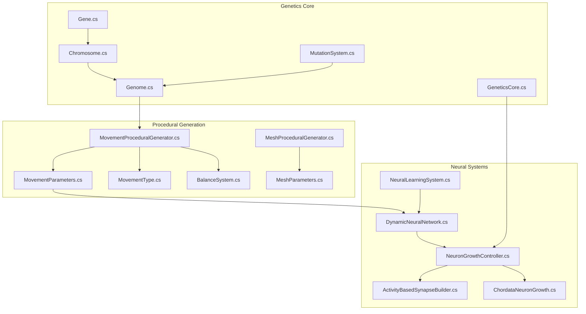
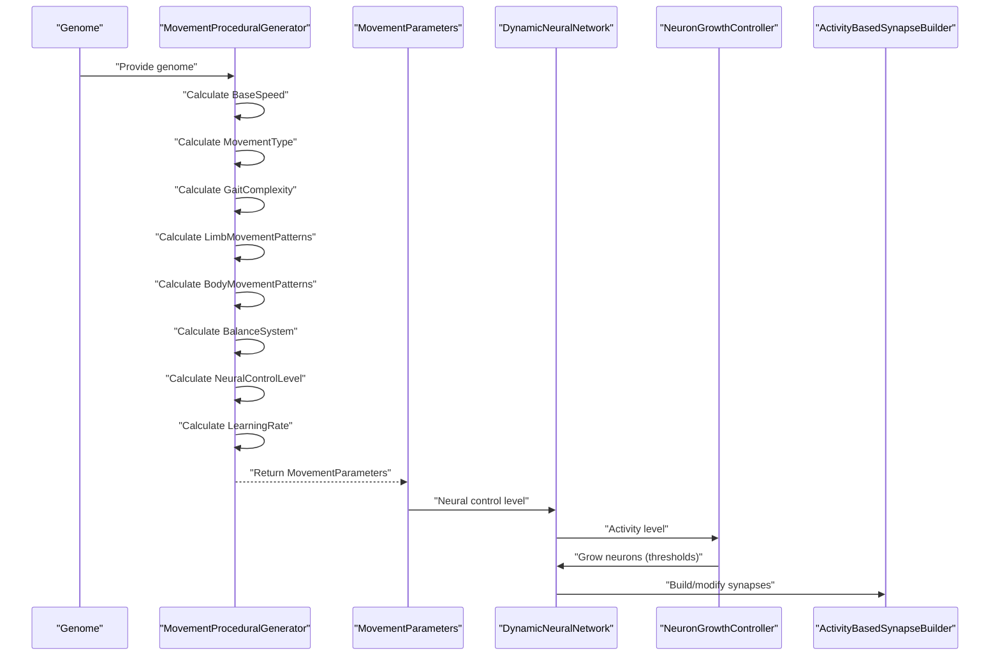
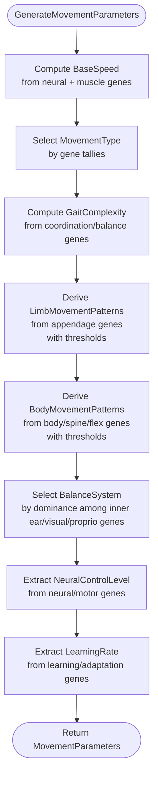
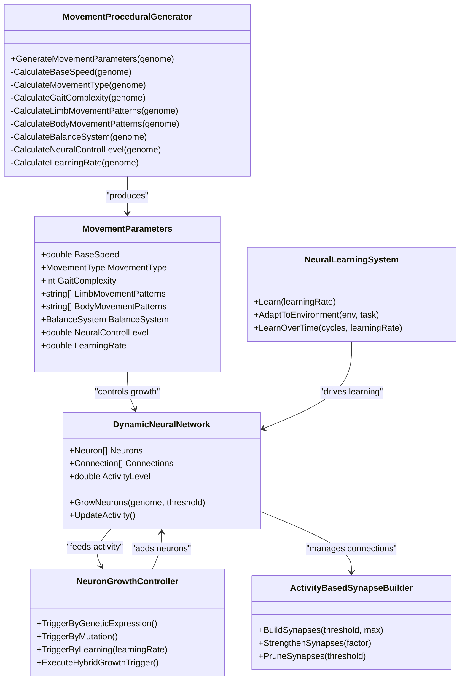
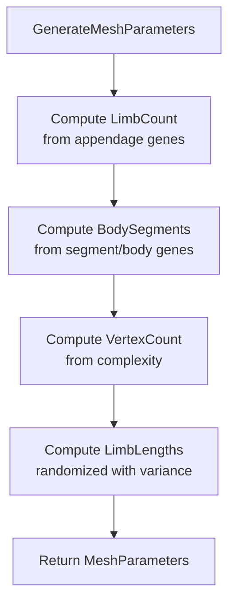
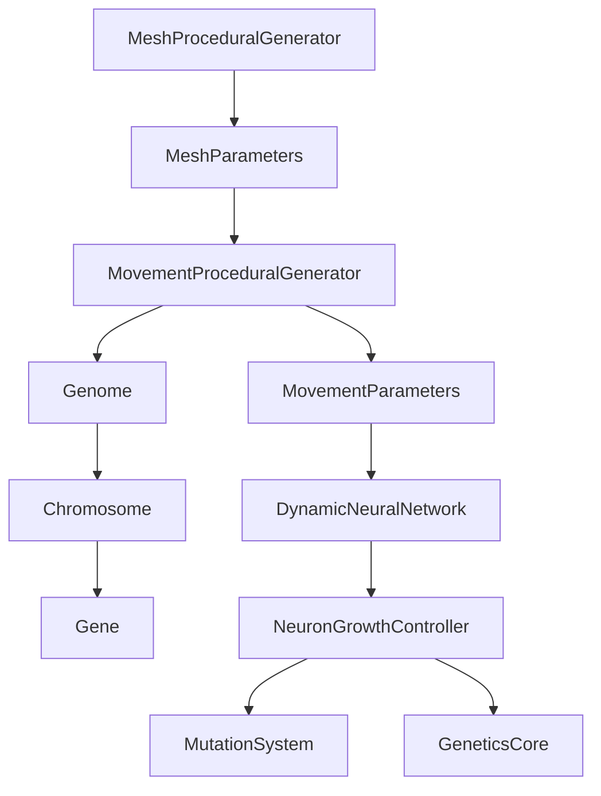

# Movement Procedural Generator

<cite>
**Referenced Files in This Document**
- [MovementProceduralGenerator.cs](file://GeneticsGame/Procedural/Movement/MovementProceduralGenerator.cs)
- [MovementParameters.cs](file://GeneticsGame/Procedural/Movement/MovementProceduralGenerator.cs)
- [MovementType.cs](file://GeneticsGame/Procedural/Movement/MovementProceduralGenerator.cs)
- [BalanceSystem.cs](file://GeneticsGame/Procedural/Movement/MovementProceduralGenerator.cs)
- [Genome.cs](file://GeneticsGame/Core/Genome.cs)
- [Chromosome.cs](file://GeneticsGame/Core/Chromosome.cs)
- [Gene.cs](file://GeneticsGame/Core/Gene.cs)
- [MutationSystem.cs](file://GeneticsGame/Core/MutationSystem.cs)
- [DynamicNeuralNetwork.cs](file://GeneticsGame/Systems/DynamicNeuralNetwork.cs)
- [NeuralLearningSystem.cs](file://GeneticsGame/Systems/NeuralLearningSystem.cs)
- [NeuronGrowthController.cs](file://GeneticsGame/Systems/NeuronGrowthController.cs)
- [ActivityBasedSynapseBuilder.cs](file://GeneticsGame/Systems/ActivityBasedSynapseBuilder.cs)
- [ChordataNeuronGrowth.cs](file://GeneticsGame/Phyla/Chordata/ChordataNeuronGrowth.cs)
- [MeshProceduralGenerator.cs](file://GeneticsGame/Procedural/Mesh/MeshProceduralGenerator.cs)
- [MeshParameters.cs](file://GeneticsGame/Procedural/Mesh/MeshProceduralGenerator.cs)
- [GeneticsCore.cs](file://GeneticsGame/Core/GeneticsCore.cs)
</cite>

## Table of Contents
1. [Introduction](#introduction)
2. [Project Structure](#project-structure)
3. [Core Components](#core-components)
4. [Architecture Overview](#architecture-overview)
5. [Detailed Component Analysis](#detailed-component-analysis)
6. [Dependency Analysis](#dependency-analysis)
7. [Performance Considerations](#performance-considerations)
8. [Troubleshooting Guide](#troubleshooting-guide)
9. [Conclusion](#conclusion)

## Introduction
This document explains the Movement Procedural Generator responsible for transforming genetic information into coordinated movement patterns and locomotion mechanics. It details how genetic parameters influence movement types, speed calculations, body segment coordination, and limb movement patterns. It also documents the MovementParameters class and its role in defining behavioral characteristics such as base speed, movement patterns, and neural control levels. The relationship between mesh complexity and movement capability is covered, including how structural constraints affect locomotion options. Examples demonstrate how genetic variations translate into different movement styles—from simple crawling to complex multi-limbed locomotion—while integrating with neural network systems. The document addresses biomechanical constraints and the mathematical models underlying movement generation.

## Project Structure
The Movement Procedural Generator resides in the procedural generation subsystem alongside mesh generation and neural systems. It reads genetic blueprints (Genome, Chromosome, Gene) and produces MovementParameters consumed by downstream systems. Neural systems dynamically grow and adapt based on genetic triggers and learning, influencing movement control and adaptation.

**Diagram sources**
- [MovementProceduralGenerator.cs:1-389](file://GeneticsGame/Procedural/Movement/MovementProceduralGenerator.cs#L1-L389)
- [MovementParameters.cs:301-342](file://GeneticsGame/Procedural/Movement/MovementProceduralGenerator.cs#L301-L342)
- [MovementType.cs:347-368](file://GeneticsGame/Procedural/Movement/MovementProceduralGenerator.cs#L347-L368)
- [BalanceSystem.cs:373-389](file://GeneticsGame/Procedural/Movement/MovementProceduralGenerator.cs#L373-L389)
- [MeshProceduralGenerator.cs:1-365](file://GeneticsGame/Procedural/Mesh/MeshProceduralGenerator.cs#L1-L365)
- [MeshParameters.cs:285-331](file://GeneticsGame/Procedural/Mesh/MeshProceduralGenerator.cs#L285-L331)
- [Genome.cs:1-190](file://GeneticsGame/Core/Genome.cs#L1-L190)
- [Chromosome.cs:1-146](file://GeneticsGame/Core/Chromosome.cs#L1-L146)
- [Gene.cs:1-93](file://GeneticsGame/Core/Gene.cs#L1-L93)
- [MutationSystem.cs:1-137](file://GeneticsGame/Core/MutationSystem.cs#L1-L137)
- [DynamicNeuralNetwork.cs:1-116](file://GeneticsGame/Systems/DynamicNeuralNetwork.cs#L1-L116)
- [NeuralLearningSystem.cs:1-122](file://GeneticsGame/Systems/NeuralLearningSystem.cs#L1-L122)
- [NeuronGrowthController.cs:1-122](file://GeneticsGame/Systems/NeuronGrowthController.cs#L1-L122)
- [ActivityBasedSynapseBuilder.cs:1-112](file://GeneticsGame/Systems/ActivityBasedSynapseBuilder.cs#L1-L112)
- [ChordataNeuronGrowth.cs:1-216](file://GeneticsGame/Phyla/Chordata/ChordataNeuronGrowth.cs#L1-L216)
- [GeneticsCore.cs:1-21](file://GeneticsGame/Core/GeneticsCore.cs#L1-L21)

**Section sources**
- [MovementProceduralGenerator.cs:1-389](file://GeneticsGame/Procedural/Movement/MovementProceduralGenerator.cs#L1-L389)
- [Genome.cs:1-190](file://GeneticsGame/Core/Genome.cs#L1-L190)
- [MeshProceduralGenerator.cs:1-365](file://GeneticsGame/Procedural/Mesh/MeshProceduralGenerator.cs#L1-L365)

## Core Components
- MovementProceduralGenerator: Converts a genome into MovementParameters by aggregating genetic traits related to speed, movement type, gait complexity, limb/body patterns, balance system, neural control, and learning rate.
- MovementParameters: Holds the generated movement characteristics (base speed, movement type, gait complexity, limb/body patterns, balance system, neural control level, learning rate).
- MovementType: Enumerates locomotion categories (Walking, Flying, Swimming, Crawling).
- BalanceSystem: Enumerates balance control modalities (InnerEar, Visual, Proprioceptive).
- Integration with neural systems: MovementParameters inform neural network growth and learning via DynamicNeuralNetwork, NeuralLearningSystem, NeuronGrowthController, and ActivityBasedSynapseBuilder.
- Mesh complexity linkage: MeshProceduralGenerator determines structural constraints (limb counts, body segments, vertex counts) that influence movement feasibility and style.

Key responsibilities:
- Speed calculation combines neural activity and muscle-related gene expression into a normalized speed factor mapped to a bounded range.
- Movement type selection tallies movement-related genes and selects the dominant category.
- Gait complexity reflects genes associated with coordination and balance.
- Limb movement patterns derive from appendage-related genes with thresholds determining synchronization styles.
- Body movement patterns reflect genes controlling flexibility and segmentation.
- Balance system preference emerges from dominance among inner ear, visual, and proprioceptive genes.
- Neural control level and learning rate are extracted from neural/motor-related genes and learning/adaptation genes respectively.

**Section sources**
- [MovementProceduralGenerator.cs:16-35](file://GeneticsGame/Procedural/Movement/MovementProceduralGenerator.cs#L16-L35)
- [MovementProceduralGenerator.cs:42-76](file://GeneticsGame/Procedural/Movement/MovementProceduralGenerator.cs#L42-L76)
- [MovementProceduralGenerator.cs:83-119](file://GeneticsGame/Procedural/Movement/MovementProceduralGenerator.cs#L83-L119)
- [MovementProceduralGenerator.cs:126-142](file://GeneticsGame/Procedural/Movement/MovementProceduralGenerator.cs#L126-L142)
- [MovementProceduralGenerator.cs:149-178](file://GeneticsGame/Procedural/Movement/MovementProceduralGenerator.cs#L149-L178)
- [MovementProceduralGenerator.cs:185-211](file://GeneticsGame/Procedural/Movement/MovementProceduralGenerator.cs#L185-L211)
- [MovementProceduralGenerator.cs:218-247](file://GeneticsGame/Procedural/Movement/MovementProceduralGenerator.cs#L218-L247)
- [MovementProceduralGenerator.cs:254-271](file://GeneticsGame/Procedural/Movement/MovementProceduralGenerator.cs#L254-L271)
- [MovementProceduralGenerator.cs:278-295](file://GeneticsGame/Procedural/Movement/MovementProceduralGenerator.cs#L278-L295)
- [MovementParameters.cs:301-342](file://GeneticsGame/Procedural/Movement/MovementProceduralGenerator.cs#L301-L342)
- [MovementType.cs:347-368](file://GeneticsGame/Procedural/Movement/MovementProceduralGenerator.cs#L347-L368)
- [BalanceSystem.cs:373-389](file://GeneticsGame/Procedural/Movement/MovementProceduralGenerator.cs#L373-L389)

## Architecture Overview
The Movement Procedural Generator sits at the intersection of genetics and neural control. It reads a genome, computes movement-relevant parameters, and feeds them into neural growth and learning systems. Mesh complexity constrains movement options by defining body plan and limb counts.

**Diagram sources**
- [MovementProceduralGenerator.cs:16-35](file://GeneticsGame/Procedural/Movement/MovementProceduralGenerator.cs#L16-L35)
- [DynamicNeuralNetwork.cs:63-99](file://GeneticsGame/Systems/DynamicNeuralNetwork.cs#L63-L99)
- [NeuronGrowthController.cs:107-121](file://GeneticsGame/Systems/NeuronGrowthController.cs#L107-L121)
- [ActivityBasedSynapseBuilder.cs:31-68](file://GeneticsGame/Systems/ActivityBasedSynapseBuilder.cs#L31-L68)

## Detailed Component Analysis

### MovementProceduralGenerator
Responsibilities:
- Aggregate genetic traits to produce MovementParameters.
- Compute base speed from neural and muscle-related genes.
- Select movement type by tallying movement-related genes.
- Derive gait complexity from coordination/balance genes.
- Determine limb movement patterns from appendage genes with expression thresholds.
- Determine body movement patterns from body/spine/flex genes with thresholds.
- Choose balance system based on dominance among inner ear, visual, and proprioceptive genes.
- Extract neural control level and learning rate from relevant genes.

Mathematical models and thresholds:
- Base speed: Averaged neural and muscle expression levels combined into a speed factor, then mapped to a bounded range.
- Movement type: Counts weighted by expression levels; maximum determines type.
- Gait complexity: Maximum expression level among coordination/balance genes, capped to 1–10.
- Limb patterns: Thresholds at 0.7 (synchronized), 0.4 (alternating), else (independent).
- Body patterns: Thresholds at 0.6 (undulating), 0.3 (segmented), else (rigid).
- Balance system: Dominance among inner ear, visual, proprioceptive gene totals.
- Neural control level: Clamped expression level for neural/motor genes.
- Learning rate: Scaled expression level for learning/adaptation genes.

**Diagram sources**
- [MovementProceduralGenerator.cs:16-35](file://GeneticsGame/Procedural/Movement/MovementProceduralGenerator.cs#L16-L35)
- [MovementProceduralGenerator.cs:42-76](file://GeneticsGame/Procedural/Movement/MovementProceduralGenerator.cs#L42-L76)
- [MovementProceduralGenerator.cs:83-119](file://GeneticsGame/Procedural/Movement/MovementProceduralGenerator.cs#L83-L119)
- [MovementProceduralGenerator.cs:126-142](file://GeneticsGame/Procedural/Movement/MovementProceduralGenerator.cs#L126-L142)
- [MovementProceduralGenerator.cs:149-178](file://GeneticsGame/Procedural/Movement/MovementProceduralGenerator.cs#L149-L178)
- [MovementProceduralGenerator.cs:185-211](file://GeneticsGame/Procedural/Movement/MovementProceduralGenerator.cs#L185-L211)
- [MovementProceduralGenerator.cs:218-247](file://GeneticsGame/Procedural/Movement/MovementProceduralGenerator.cs#L218-L247)
- [MovementProceduralGenerator.cs:254-295](file://GeneticsGame/Procedural/Movement/MovementProceduralGenerator.cs#L254-L295)

**Section sources**
- [MovementProceduralGenerator.cs:16-35](file://GeneticsGame/Procedural/Movement/MovementProceduralGenerator.cs#L16-L35)
- [MovementProceduralGenerator.cs:42-76](file://GeneticsGame/Procedural/Movement/MovementProceduralGenerator.cs#L42-L76)
- [MovementProceduralGenerator.cs:83-119](file://GeneticsGame/Procedural/Movement/MovementProceduralGenerator.cs#L83-L119)
- [MovementProceduralGenerator.cs:126-142](file://GeneticsGame/Procedural/Movement/MovementProceduralGenerator.cs#L126-L142)
- [MovementProceduralGenerator.cs:149-178](file://GeneticsGame/Procedural/Movement/MovementProceduralGenerator.cs#L149-L178)
- [MovementProceduralGenerator.cs:185-211](file://GeneticsGame/Procedural/Movement/MovementProceduralGenerator.cs#L185-L211)
- [MovementProceduralGenerator.cs:218-247](file://GeneticsGame/Procedural/Movement/MovementProceduralGenerator.cs#L218-L247)
- [MovementProceduralGenerator.cs:254-295](file://GeneticsGame/Procedural/Movement/MovementProceduralGenerator.cs#L254-L295)

### MovementParameters
Fields and roles:
- BaseSpeed: Normalized speed multiplier derived from genetic expression.
- MovementType: Dominant locomotion mode.
- GaitComplexity: Coordination depth (1–10).
- LimbMovementPatterns: Pattern per appendage (synchronized, alternating, independent).
- BodyMovementPatterns: Pattern per body region (undulating, segmented, rigid).
- BalanceSystem: Primary balance modality.
- NeuralControlLevel: Control authority (0.0–1.0).
- LearningRate: Rate of movement adaptation (0.0–1.0).

Usage:
- Consumed by neural systems to configure growth thresholds and learning dynamics.
- Used to constrain movement feasibility based on mesh complexity.

**Section sources**
- [MovementParameters.cs:301-342](file://GeneticsGame/Procedural/Movement/MovementProceduralGenerator.cs#L301-L342)

### MovementType and BalanceSystem
- MovementType enumerates Walking, Flying, Swimming, Crawling.
- BalanceSystem enumerates InnerEar, Visual, Proprioceptive.

Selection logic:
- MovementType determined by dominant gene category.
- BalanceSystem determined by highest total among inner ear, visual, and proprioceptive genes.

**Section sources**
- [MovementType.cs:347-368](file://GeneticsGame/Procedural/Movement/MovementProceduralGenerator.cs#L347-L368)
- [BalanceSystem.cs:373-389](file://GeneticsGame/Procedural/Movement/MovementProceduralGenerator.cs#L373-L389)

### Integration with Neural Network Systems
Neural systems consume MovementParameters and adapt based on genetic constraints and learning:
- DynamicNeuralNetwork: Maintains neurons and connections, grows neurons based on activity and genetic growth potential, updates activity level.
- NeuralLearningSystem: Drives learning cycles, builds and strengthens synapses, prunes weak connections, triggers neuron growth, adapts to environment and tasks.
- NeuronGrowthController: Hybrid growth trigger (genetic expression → mutation → learning), integrates with GeneticsCore thresholds.
- ActivityBasedSynapseBuilder: Implements Hebbian-style synaptogenesis and pruning.
- ChordataNeuronGrowth: Adds chordata-specific growth rules and plasticity.

**Diagram sources**
- [MovementProceduralGenerator.cs:16-35](file://GeneticsGame/Procedural/Movement/MovementProceduralGenerator.cs#L16-L35)
- [MovementParameters.cs:301-342](file://GeneticsGame/Procedural/Movement/MovementProceduralGenerator.cs#L301-L342)
- [DynamicNeuralNetwork.cs:63-99](file://GeneticsGame/Systems/DynamicNeuralNetwork.cs#L63-L99)
- [NeuralLearningSystem.cs:37-57](file://GeneticsGame/Systems/NeuralLearningSystem.cs#L37-L57)
- [NeuronGrowthController.cs:107-121](file://GeneticsGame/Systems/NeuronGrowthController.cs#L107-L121)
- [ActivityBasedSynapseBuilder.cs:31-68](file://GeneticsGame/Systems/ActivityBasedSynapseBuilder.cs#L31-L68)

**Section sources**
- [DynamicNeuralNetwork.cs:63-99](file://GeneticsGame/Systems/DynamicNeuralNetwork.cs#L63-L99)
- [NeuralLearningSystem.cs:37-57](file://GeneticsGame/Systems/NeuralLearningSystem.cs#L37-L57)
- [NeuronGrowthController.cs:107-121](file://GeneticsGame/Systems/NeuronGrowthController.cs#L107-L121)
- [ActivityBasedSynapseBuilder.cs:31-68](file://GeneticsGame/Systems/ActivityBasedSynapseBuilder.cs#L31-L68)
- [ChordataNeuronGrowth.cs:36-103](file://GeneticsGame/Phyla/Chordata/ChordataNeuronGrowth.cs#L36-L103)

### Relationship Between Mesh Complexity and Movement Capability
MeshProceduralGenerator defines structural constraints that directly impact movement:
- LimbCount: Derived from appendage-related genes, bounded and scaled by expression.
- BodySegments: Derived from segment/body genes, bounded and scaled by expression.
- VertexCount: Complexity drives vertex count, indirectly affecting simulation fidelity.
- LimbLengths: Randomized around a base with variance informed by genetic expression.

These structural features constrain movement options:
- Fewer limbs reduce multi-limbed gaits; fewer segments limit undulatory motion.
- Vertex count affects simulation stability and performance.
- Limb lengths influence stride mechanics and balance.

**Diagram sources**
- [MeshProceduralGenerator.cs:16-36](file://GeneticsGame/Procedural/Mesh/MeshProceduralGenerator.cs#L16-L36)
- [MeshProceduralGenerator.cs:218-235](file://GeneticsGame/Procedural/Mesh/MeshProceduralGenerator.cs#L218-L235)
- [MeshProceduralGenerator.cs:262-279](file://GeneticsGame/Procedural/Mesh/MeshProceduralGenerator.cs#L262-L279)
- [MeshProceduralGenerator.cs:242-255](file://GeneticsGame/Procedural/Mesh/MeshProceduralGenerator.cs#L242-L255)
- [MeshParameters.cs:285-331](file://GeneticsGame/Procedural/Mesh/MeshProceduralGenerator.cs#L285-L331)

**Section sources**
- [MeshProceduralGenerator.cs:16-36](file://GeneticsGame/Procedural/Mesh/MeshProceduralGenerator.cs#L16-L36)
- [MeshProceduralGenerator.cs:218-235](file://GeneticsGame/Procedural/Mesh/MeshProceduralGenerator.cs#L218-L235)
- [MeshProceduralGenerator.cs:262-279](file://GeneticsGame/Procedural/Mesh/MeshProceduralGenerator.cs#L262-L279)
- [MeshProceduralGenerator.cs:242-255](file://GeneticsGame/Procedural/Mesh/MeshProceduralGenerator.cs#L242-L255)
- [MeshParameters.cs:285-331](file://GeneticsGame/Procedural/Mesh/MeshProceduralGenerator.cs#L285-L331)

### Biomechanical Constraints and Mathematical Models
Biomechanical constraints arise from:
- Limb count and distribution limiting coordinated gaits.
- Body segmentation affecting undulation and rigidity.
- Vertex count impacting simulation stability and responsiveness.

Mathematical models used:
- Weighted tallies for movement type selection.
- Threshold-based pattern classification for limbs and body.
- Clamped normalization for speed and control parameters.
- Hebbian-style synaptogenesis and pruning for neural adaptation.

**Section sources**
- [MovementProceduralGenerator.cs:83-119](file://GeneticsGame/Procedural/Movement/MovementProceduralGenerator.cs#L83-L119)
- [MovementProceduralGenerator.cs:149-178](file://GeneticsGame/Procedural/Movement/MovementProceduralGenerator.cs#L149-L178)
- [MovementProceduralGenerator.cs:185-211](file://GeneticsGame/Procedural/Movement/MovementProceduralGenerator.cs#L185-L211)
- [ActivityBasedSynapseBuilder.cs:31-68](file://GeneticsGame/Systems/ActivityBasedSynapseBuilder.cs#L31-L68)

### Examples: Genetic Variations to Movement Styles
- Simple crawling: High crawling gene expression with low coordination genes yields low gait complexity and rigid body patterns; synchronized or alternating limb patterns depending on appendage gene thresholds.
- Quadruped walking: Elevated leg/walk genes with moderate coordination genes; segmented body patterns; balanced inner ear dominance; moderate neural control level; default learning rate.
- Aquatic swimming: High swim genes dominate; undulating body patterns preferred; balance system may favor proprioception for body control; increased base speed from neural/muscle expression.
- Avian flight: High fly genes; minimal body segmentation; specialized limb patterns; visual balance system; higher neural control level; elevated learning rate for adaptive flight behaviors.
- Multi-limbed locomotion: High limb count from appendage genes; alternating or synchronized patterns; complex gait; undulating body patterns; robust neural control and learning.

These examples illustrate how genetic thresholds and dominance hierarchies shape movement styles and neural control.

**Section sources**
- [MovementProceduralGenerator.cs:83-119](file://GeneticsGame/Procedural/Movement/MovementProceduralGenerator.cs#L83-L119)
- [MovementProceduralGenerator.cs:126-142](file://GeneticsGame/Procedural/Movement/MovementProceduralGenerator.cs#L126-L142)
- [MovementProceduralGenerator.cs:149-178](file://GeneticsGame/Procedural/Movement/MovementProceduralGenerator.cs#L149-L178)
- [MovementProceduralGenerator.cs:185-211](file://GeneticsGame/Procedural/Movement/MovementProceduralGenerator.cs#L185-L211)
- [MovementProceduralGenerator.cs:218-247](file://GeneticsGame/Procedural/Movement/MovementProceduralGenerator.cs#L218-L247)
- [MovementProceduralGenerator.cs:254-295](file://GeneticsGame/Procedural/Movement/MovementProceduralGenerator.cs#L254-L295)

## Dependency Analysis
- MovementProceduralGenerator depends on Genome, Chromosome, and Gene for trait aggregation.
- MovementParameters are consumed by DynamicNeuralNetwork and NeuralLearningSystem.
- NeuronGrowthController integrates with GeneticsCore thresholds and MutationSystem outcomes.
- MeshProceduralGenerator informs structural constraints that bound movement feasibility.

**Diagram sources**
- [MovementProceduralGenerator.cs:16-35](file://GeneticsGame/Procedural/Movement/MovementProceduralGenerator.cs#L16-L35)
- [Genome.cs:1-190](file://GeneticsGame/Core/Genome.cs#L1-L190)
- [Chromosome.cs:1-146](file://GeneticsGame/Core/Chromosome.cs#L1-L146)
- [Gene.cs:1-93](file://GeneticsGame/Core/Gene.cs#L1-L93)
- [DynamicNeuralNetwork.cs:63-99](file://GeneticsGame/Systems/DynamicNeuralNetwork.cs#L63-L99)
- [NeuronGrowthController.cs:107-121](file://GeneticsGame/Systems/NeuronGrowthController.cs#L107-L121)
- [MutationSystem.cs:105-137](file://GeneticsGame/Core/MutationSystem.cs#L105-L137)
- [GeneticsCore.cs:14-20](file://GeneticsGame/Core/GeneticsCore.cs#L14-L20)
- [MeshProceduralGenerator.cs:16-36](file://GeneticsGame/Procedural/Mesh/MeshProceduralGenerator.cs#L16-L36)

**Section sources**
- [MovementProceduralGenerator.cs:16-35](file://GeneticsGame/Procedural/Movement/MovementProceduralGenerator.cs#L16-L35)
- [Genome.cs:1-190](file://GeneticsGame/Core/Genome.cs#L1-L190)
- [Chromosome.cs:1-146](file://GeneticsGame/Core/Chromosome.cs#L1-L146)
- [Gene.cs:1-93](file://GeneticsGame/Core/Gene.cs#L1-L93)
- [DynamicNeuralNetwork.cs:63-99](file://GeneticsGame/Systems/DynamicNeuralNetwork.cs#L63-L99)
- [NeuronGrowthController.cs:107-121](file://GeneticsGame/Systems/NeuronGrowthController.cs#L107-L121)
- [MutationSystem.cs:105-137](file://GeneticsGame/Core/MutationSystem.cs#L105-L137)
- [GeneticsCore.cs:14-20](file://GeneticsGame/Core/GeneticsCore.cs#L14-L20)
- [MeshProceduralGenerator.cs:16-36](file://GeneticsGame/Procedural/Mesh/MeshProceduralGenerator.cs#L16-L36)

## Performance Considerations
- MovementProceduralGenerator iterates all genes across chromosomes; complexity scales linearly with gene count.
- MeshProceduralGenerator similarly iterates genes for structural parameters; complexity scales with gene count and chromosome count.
- Neural growth and learning involve iterative operations on neuron lists and connections; performance benefits from limiting growth per generation via GeneticsCore thresholds.
- Hebbian synaptogenesis creates pairwise connections; cap max connections to avoid combinatorial explosion.

[No sources needed since this section provides general guidance]

## Troubleshooting Guide
Common issues and resolutions:
- No movement type selected: Ensure at least one movement-related gene exists; default movement type is Walking.
- Zero or extreme speed: Verify neural and muscle gene expression levels; speed is clamped to a bounded range.
- Empty limb/body patterns: Appendage/body genes are required; defaults are applied when absent.
- Excessive neural growth: Confirm GeneticsCore thresholds and NeuronGrowthController hybrid trigger logic; growth is limited per generation.
- Poor movement adaptation: Increase learning rate and ensure NeuralLearningSystem cycles are executed; check environment/task requirements mapping.

**Section sources**
- [MovementProceduralGenerator.cs:118-119](file://GeneticsGame/Procedural/Movement/MovementProceduralGenerator.cs#L118-L119)
- [MovementProceduralGenerator.cs:75-76](file://GeneticsGame/Procedural/Movement/MovementProceduralGenerator.cs#L75-L76)
- [MovementProceduralGenerator.cs:177-178](file://GeneticsGame/Procedural/Movement/MovementProceduralGenerator.cs#L177-L178)
- [MovementProceduralGenerator.cs:210-211](file://GeneticsGame/Procedural/Movement/MovementProceduralGenerator.cs#L210-L211)
- [NeuronGrowthController.cs:107-121](file://GeneticsGame/Systems/NeuronGrowthController.cs#L107-L121)
- [GeneticsCore.cs:14-20](file://GeneticsGame/Core/GeneticsCore.cs#L14-L20)
- [NeuralLearningSystem.cs:111-121](file://GeneticsGame/Systems/NeuralLearningSystem.cs#L111-L121)

## Conclusion
The Movement Procedural Generator translates genetic information into coherent movement parameters, balancing biomechanical constraints with neural control and learning. MovementTypes, gait complexity, limb/body patterns, and balance systems emerge from weighted gene tallies and thresholds. Neural systems dynamically adapt movement control based on genetic growth potential and learning rates, while mesh complexity constrains feasible movement styles. This integrated pipeline enables diverse locomotion mechanics from simple crawling to complex multi-limbed gaits, driven by evolutionary-inspired genetic mechanisms.