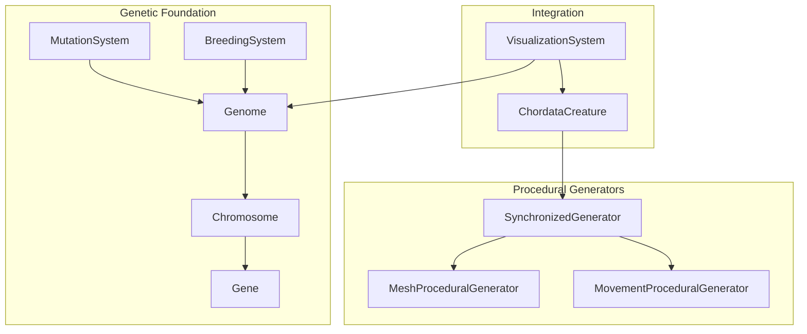
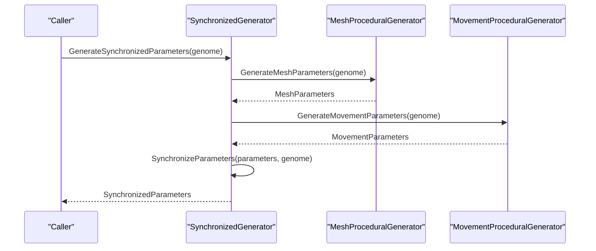
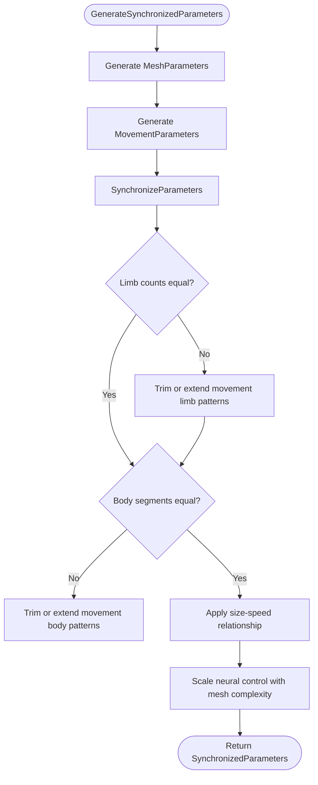
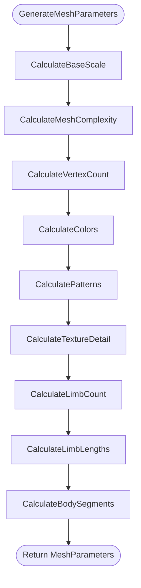
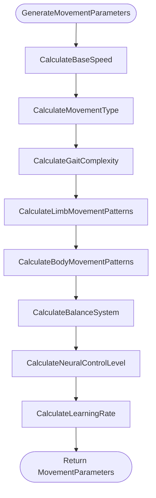
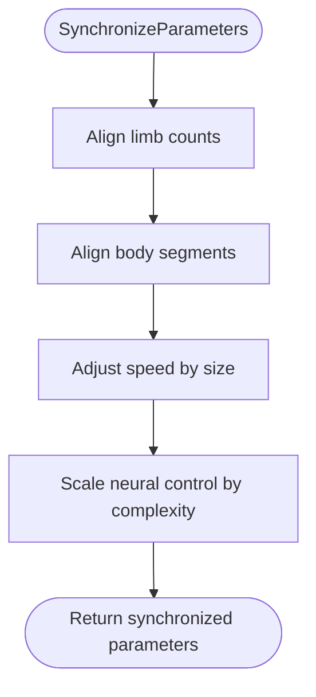
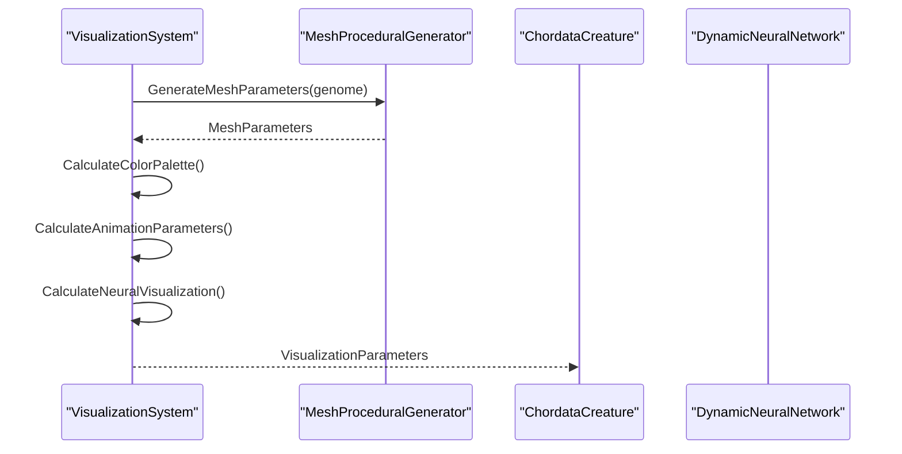
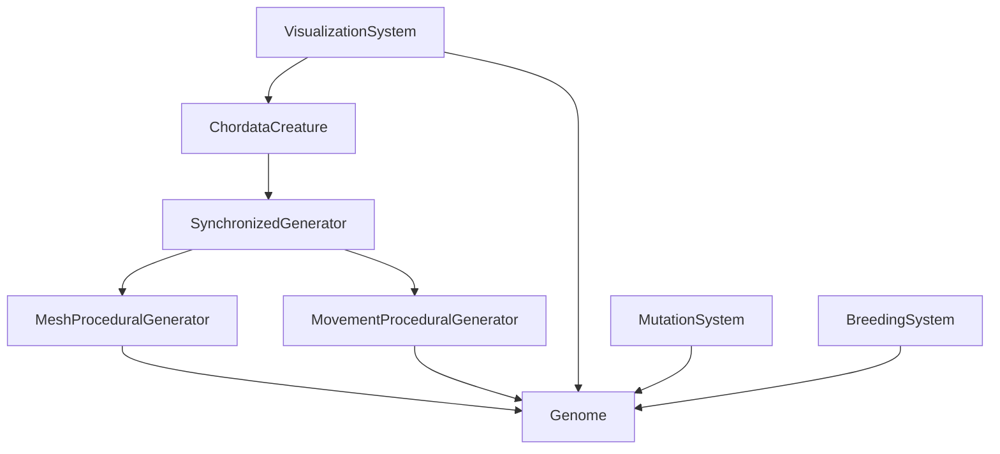

# Procedural Generation System

<cite>
**Referenced Files in This Document**
- [SynchronizedGenerator.cs](file://GeneticsGame/Procedural/SynchronizedGenerator.cs)
- [MeshProceduralGenerator.cs](file://GeneticsGame/Procedural/Mesh/MeshProceduralGenerator.cs)
- [MovementProceduralGenerator.cs](file://GeneticsGame/Procedural/Movement/MovementProceduralGenerator.cs)
- [Genome.cs](file://GeneticsGame/Core/Genome.cs)
- [Chromosome.cs](file://GeneticsGame/Core/Chromosome.cs)
- [Gene.cs](file://GeneticsGame/Core/Gene.cs)
- [MutationSystem.cs](file://GeneticsGame/Core/MutationSystem.cs)
- [ChordataCreature.cs](file://GeneticsGame/Phyla/Chordata/ChordataCreature.cs)
- [ChordataGenome.cs](file://GeneticsGame/Phyla/Chordata/ChordataGenome.cs)
- [VisualizationSystem.cs](file://GeneticsGame/Systems/VisualizationSystem.cs)
- [BreedingSystem.cs](file://GeneticsGame/Systems/BreedingSystem.cs)
- [Program.cs](file://GeneticsGame/Program.cs)
</cite>

## Table of Contents
1. [Introduction](#introduction)
2. [Project Structure](#project-structure)
3. [Core Components](#core-components)
4. [Architecture Overview](#architecture-overview)
5. [Detailed Component Analysis](#detailed-component-analysis)
6. [Dependency Analysis](#dependency-analysis)
7. [Performance Considerations](#performance-considerations)
8. [Troubleshooting Guide](#troubleshooting-guide)
9. [Conclusion](#conclusion)
10. [Appendices](#appendices)

## Introduction
This document explains the procedural generation system that creates 3D physical traits and movement patterns based on genetic information. It focuses on the SynchronizedGenerator architecture that coordinates mesh and movement parameter generation to ensure anatomical consistency, the MeshProceduralGenerator that builds 3D mesh structures influenced by genetics, and the MovementProceduralGenerator that produces coordinated movement patterns and locomotion mechanics. It also documents the parameter synchronization logic that ensures generated physical traits and movement capabilities work together harmoniously, and demonstrates how genetic variations translate into different body plans, movement styles, and behavioral characteristics. Finally, it covers the integration with visualization systems and the mathematical foundations of the procedural generation algorithms.

## Project Structure
The procedural generation system is organized around three core procedural generators and supporting genetic infrastructure:
- Procedural generators:
  - MeshProceduralGenerator: converts genetic data into 3D mesh parameters (scale, complexity, vertex count, color palette, patterns, texture detail, limb count/lengths, body segments)
  - MovementProceduralGenerator: converts genetic data into movement parameters (base speed, movement type, gait complexity, limb/body movement patterns, balance system, neural control level, learning rate)
  - SynchronizedGenerator: orchestrates both generators and synchronizes their outputs to maintain anatomical and biomechanical consistency
- Genetic foundation:
  - Genome, Chromosome, Gene: represent the genetic blueprint and mutation mechanisms
  - MutationSystem: applies point, structural, epigenetic, and neural-specific mutations
  - BreedingSystem: simulates inheritance and compatibility between genomes
- Integration:
  - ChordataCreature: ties genetic parameters to runtime updates and visualization
  - VisualizationSystem: generates visualization parameters from genetic and neural data

**Diagram sources**
- [SynchronizedGenerator.cs:1-141](file://GeneticsGame/Procedural/SynchronizedGenerator.cs#L1-L141)
- [MeshProceduralGenerator.cs:1-365](file://GeneticsGame/Procedural/Mesh/MeshProceduralGenerator.cs#L1-L365)
- [MovementProceduralGenerator.cs:1-389](file://GeneticsGame/Procedural/Movement/MovementProceduralGenerator.cs#L1-L389)
- [Genome.cs:1-190](file://GeneticsGame/Core/Genome.cs#L1-L190)
- [Chromosome.cs:1-146](file://GeneticsGame/Core/Chromosome.cs#L1-L146)
- [Gene.cs:1-93](file://GeneticsGame/Core/Gene.cs#L1-L93)
- [MutationSystem.cs:1-137](file://GeneticsGame/Core/MutationSystem.cs#L1-L137)
- [BreedingSystem.cs:1-182](file://GeneticsGame/Systems/BreedingSystem.cs#L1-L182)
- [ChordataCreature.cs:1-133](file://GeneticsGame/Phyla/Chordata/ChordataCreature.cs#L1-L133)
- [VisualizationSystem.cs:1-239](file://GeneticsGame/Systems/VisualizationSystem.cs#L1-L239)

**Section sources**
- [Program.cs:1-58](file://GeneticsGame/Program.cs#L1-L58)

## Core Components
- SynchronizedGenerator: Creates synchronized mesh and movement parameters from a genome, then enforces anatomical and biomechanical consistency across both domains.
- MeshProceduralGenerator: Translates genetic expression into 3D mesh parameters including base scale, complexity, vertex count, color palette, patterns, texture detail, limb counts and lengths, and body segmentation.
- MovementProceduralGenerator: Translates genetic expression into movement parameters including base speed, movement type, gait complexity, limb/body movement patterns, balance system, neural control level, and learning rate.
- Genetic Infrastructure: Genome, Chromosome, Gene define the genetic blueprint; MutationSystem applies mutations; BreedingSystem enables inheritance and compatibility calculations.

**Section sources**
- [SynchronizedGenerator.cs:9-141](file://GeneticsGame/Procedural/SynchronizedGenerator.cs#L9-L141)
- [MeshProceduralGenerator.cs:9-365](file://GeneticsGame/Procedural/Mesh/MeshProceduralGenerator.cs#L9-L365)
- [MovementProceduralGenerator.cs:9-389](file://GeneticsGame/Procedural/Movement/MovementProceduralGenerator.cs#L9-L389)
- [Genome.cs:9-190](file://GeneticsGame/Core/Genome.cs#L9-L190)
- [Chromosome.cs:9-146](file://GeneticsGame/Core/Chromosome.cs#L9-L146)
- [Gene.cs:9-93](file://GeneticsGame/Core/Gene.cs#L9-L93)
- [MutationSystem.cs:9-137](file://GeneticsGame/Core/MutationSystem.cs#L9-L137)
- [BreedingSystem.cs:9-182](file://GeneticsGame/Systems/BreedingSystem.cs#L9-L182)

## Architecture Overview
The SynchronizedGenerator acts as the central coordinator:
- It initializes MeshProceduralGenerator and MovementProceduralGenerator instances
- It generates separate parameter sets from a single genome
- It synchronizes parameters to ensure anatomical and biomechanical consistency (e.g., matching limb counts, aligning body segments, size-speed relationships, neural control scaling)

**Diagram sources**
- [SynchronizedGenerator.cs:35-124](file://GeneticsGame/Procedural/SynchronizedGenerator.cs#L35-L124)
- [MeshProceduralGenerator.cs:16-36](file://GeneticsGame/Procedural/Mesh/MeshProceduralGenerator.cs#L16-L36)
- [MovementProceduralGenerator.cs:16-35](file://GeneticsGame/Procedural/Movement/MovementProceduralGenerator.cs#L16-L35)

## Detailed Component Analysis

### SynchronizedGenerator
Responsibilities:
- Coordinate mesh and movement generation
- Enforce synchronization across parameters:
  - Match limb counts between mesh and movement
  - Align body segments between mesh and movement
  - Apply size-speed relationship: larger creatures are generally slower
  - Scale neural control level with mesh complexity

Key behaviors:
- Limb count synchronization: trims or extends movement limb patterns to match mesh limb count
- Body segment synchronization: trims or extends movement body patterns to match mesh body segments
- Size-speed relationship: adjusts movement speed inversely proportional to size factor within reasonable bounds
- Neural control scaling: increases movement neural control level based on mesh complexity

**Diagram sources**
- [SynchronizedGenerator.cs:35-124](file://GeneticsGame/Procedural/SynchronizedGenerator.cs#L35-L124)

**Section sources**
- [SynchronizedGenerator.cs:9-141](file://GeneticsGame/Procedural/SynchronizedGenerator.cs#L9-L141)

### MeshProceduralGenerator
Responsibilities:
- Convert genetic expression into 3D mesh parameters
- Base scale: derived from average gene expression levels
- Mesh complexity: derived from chromosome and gene counts
- Vertex count: scaled by complexity
- Visual features: color palette, patterns, texture detail
- Structural features: limb count, limb lengths, body segments

Calculation highlights:
- Base scale: maps average expression to a bounded scale factor
- Mesh complexity: linear combination of chromosome count and gene count
- Vertex count: base value multiplied by complexity
- Color palette: collects color-related genes and maps expression to RGB
- Patterns: stripes/spots/mottled based on expression thresholds
- Texture detail: capped by expression levels of texture-related genes
- Limb count: bounded by expression of limb-related genes
- Limb lengths: randomized around a base with modest variance
- Body segments: bounded by expression of segment-related genes

**Diagram sources**
- [MeshProceduralGenerator.cs:16-279](file://GeneticsGame/Procedural/Mesh/MeshProceduralGenerator.cs#L16-L279)

**Section sources**
- [MeshProceduralGenerator.cs:9-365](file://GeneticsGame/Procedural/Mesh/MeshProceduralGenerator.cs#L9-L365)

### MovementProceduralGenerator
Responsibilities:
- Convert genetic expression into movement parameters
- Base speed: derived from neural activity and muscle-related genes
- Movement type: determined by dominance among walking/flying/swimming/crawling genes
- Gait complexity: derived from coordination/balance genes
- Limb movement patterns: synchronized/alternating/independent based on expression
- Body movement patterns: undulating/segmented/rigid based on expression
- Balance system: inner ear/visual/proprioceptive based on dominance
- Neural control level: bounded expression of control-related genes
- Learning rate: derived from adaptability/plasticity genes

**Diagram sources**
- [MovementProceduralGenerator.cs:16-295](file://GeneticsGame/Procedural/Movement/MovementProceduralGenerator.cs#L16-L295)

**Section sources**
- [MovementProceduralGenerator.cs:9-389](file://GeneticsGame/Procedural/Movement/MovementProceduralGenerator.cs#L9-L389)

### Parameter Synchronization Logic
Synchronization ensures anatomical and biomechanical consistency:
- Limb count alignment: movement patterns list length equals mesh limb count
- Body segment alignment: movement body patterns list length equals mesh body segments
- Size-speed relationship: movement speed adjusted relative to mesh base scale
- Neural control scaling: movement neural control level adjusted upward with mesh complexity

**Diagram sources**
- [SynchronizedGenerator.cs:57-124](file://GeneticsGame/Procedural/SynchronizedGenerator.cs#L57-L124)

**Section sources**
- [SynchronizedGenerator.cs:57-124](file://GeneticsGame/Procedural/SynchronizedGenerator.cs#L57-L124)

### Relationship Between Genetic Parameters and 3D Models
- Genetic influence on shape and size:
  - Base scale and vertex count depend on average gene expression
  - Limb count and lengths depend on limb-related genes
  - Body segments depend on segment-related genes
- Genetic influence on color palette:
  - Color-related genes map expression to RGB channels
  - Default palette if no color genes are present
- Genetic influence on animation parameters:
  - Movement speed and gait complexity correlate with neural activity and connectivity
  - Learning rate reflects adaptability genes
- Biomechanical constraints:
  - Movement speed constrained by size (larger creatures slower)
  - Movement patterns constrained by structural features (limbs, segments)

**Section sources**
- [MeshProceduralGenerator.cs:43-279](file://GeneticsGame/Procedural/Mesh/MeshProceduralGenerator.cs#L43-L279)
- [MovementProceduralGenerator.cs:42-295](file://GeneticsGame/Procedural/Movement/MovementProceduralGenerator.cs#L42-L295)
- [SynchronizedGenerator.cs:101-121](file://GeneticsGame/Procedural/SynchronizedGenerator.cs#L101-L121)

### Integration with Visualization Systems
VisualizationSystem integrates genetic and neural data:
- Complexity level: combines genome complexity and neural network complexity
- Color palette: includes mesh-derived colors plus neural-specific colors
- Animation parameters: speed, complexity, and smoothness based on neural activity and connectivity
- Neural visualization parameters: neuron density, connection density, activity level, and type distribution

**Diagram sources**
- [VisualizationSystem.cs:36-165](file://GeneticsGame/Systems/VisualizationSystem.cs#L36-L165)
- [MeshProceduralGenerator.cs:16-36](file://GeneticsGame/Procedural/Mesh/MeshProceduralGenerator.cs#L16-L36)

**Section sources**
- [VisualizationSystem.cs:9-239](file://GeneticsGame/Systems/VisualizationSystem.cs#L9-L239)

### Mathematical Foundations of Procedural Generation
- Scaling and normalization:
  - Expression levels mapped to bounded ranges for scale, speed, and complexity
  - Limits enforced to prevent unrealistic extremes
- Probabilistic mutation:
  - Point mutations adjust expression levels and neuron growth factors
  - Structural mutations alter chromosome structure
  - Epigenetic modifications change expression without altering DNA sequence
  - Neural-specific mutations target neuron growth parameters
- Inheritance and compatibility:
  - Offspring genome created by combining parental chromosomes and genes
  - Compatibility score balances similarity and diversity
- Runtime adaptation:
  - Creature updates adjust movement speed and complexity based on neural activity
  - Mesh parameters update based on evolving gene expression and neuron growth

**Section sources**
- [MutationSystem.cs:17-137](file://GeneticsGame/Core/MutationSystem.cs#L17-L137)
- [BreedingSystem.cs:18-182](file://GeneticsGame/Systems/BreedingSystem.cs#L18-L182)
- [ChordataCreature.cs:61-122](file://GeneticsGame/Phyla/Chordata/ChordataCreature.cs#L61-L122)

## Dependency Analysis
The procedural generation system exhibits clear separation of concerns:
- SynchronizedGenerator depends on MeshProceduralGenerator and MovementProceduralGenerator
- Both procedural generators depend on Genome for genetic input
- ChordataCreature orchestrates the generation and runtime updates
- VisualizationSystem consumes both genetic and neural data
- MutationSystem and BreedingSystem operate independently but feed into the genetic foundation

**Diagram sources**
- [SynchronizedGenerator.cs:14-28](file://GeneticsGame/Procedural/SynchronizedGenerator.cs#L14-L28)
- [MeshProceduralGenerator.cs:16](file://GeneticsGame/Procedural/Mesh/MeshProceduralGenerator.cs#L16)
- [MovementProceduralGenerator.cs:16](file://GeneticsGame/Procedural/Movement/MovementProceduralGenerator.cs#L16)
- [ChordataCreature.cs:50-55](file://GeneticsGame/Phyla/Chordata/ChordataCreature.cs#L50-L55)
- [VisualizationSystem.cs:87-89](file://GeneticsGame/Systems/VisualizationSystem.cs#L87-L89)
- [MutationSystem.cs:17](file://GeneticsGame/Core/MutationSystem.cs#L17)
- [BreedingSystem.cs:18](file://GeneticsGame/Systems/BreedingSystem.cs#L18)

**Section sources**
- [SynchronizedGenerator.cs:9-141](file://GeneticsGame/Procedural/SynchronizedGenerator.cs#L9-L141)
- [MeshProceduralGenerator.cs:9-365](file://GeneticsGame/Procedural/Mesh/MeshProceduralGenerator.cs#L9-L365)
- [MovementProceduralGenerator.cs:9-389](file://GeneticsGame/Procedural/Movement/MovementProceduralGenerator.cs#L9-L389)
- [ChordataCreature.cs:9-133](file://GeneticsGame/Phyla/Chordata/ChordataCreature.cs#L9-L133)
- [VisualizationSystem.cs:9-239](file://GeneticsGame/Systems/VisualizationSystem.cs#L9-L239)
- [MutationSystem.cs:9-137](file://GeneticsGame/Core/MutationSystem.cs#L9-L137)
- [BreedingSystem.cs:9-182](file://GeneticsGame/Systems/BreedingSystem.cs#L9-L182)

## Performance Considerations
- Computational complexity:
  - Mesh and movement parameter calculations iterate over chromosomes and genes; complexity scales with genome size
  - Synchronization operations are linear in the number of limbs and segments
- Memory footprint:
  - MeshParameters and MovementParameters are lightweight containers
  - VisualizationParameters include lists and dictionaries; complexity grows with neural network size
- Optimization opportunities:
  - Cache intermediate results when generating multiple creatures from the same genome
  - Use efficient iteration patterns and avoid redundant computations
  - Consider parallelization for independent parameter calculations if needed

[No sources needed since this section provides general guidance]

## Troubleshooting Guide
Common issues and resolutions:
- Inconsistent limb counts:
  - Ensure mesh limb count equals movement limb pattern count after synchronization
  - Verify that limb-related genes are present and expressed appropriately
- Unrealistic movement speeds:
  - Check size-speed relationship adjustments; confirm base scale and speed factors
  - Review neural control level scaling with mesh complexity
- Imbalanced color palettes:
  - Confirm presence of color-related genes; fallback to defaults if absent
  - Validate expression level mapping to RGB channels
- Poor animation smoothness:
  - Increase neural control level or reduce gait complexity
  - Ensure sufficient neural activity and connectivity

**Section sources**
- [SynchronizedGenerator.cs:57-124](file://GeneticsGame/Procedural/SynchronizedGenerator.cs#L57-L124)
- [MeshProceduralGenerator.cs:101-139](file://GeneticsGame/Procedural/Mesh/MeshProceduralGenerator.cs#L101-L139)
- [MovementProceduralGenerator.cs:254-295](file://GeneticsGame/Procedural/Movement/MovementProceduralGenerator.cs#L254-L295)

## Conclusion
The procedural generation system demonstrates a cohesive pipeline where genetic information drives both 3D mesh creation and movement mechanics, with explicit synchronization logic ensuring anatomical and biomechanical consistency. The modular design allows for independent evolution of mesh and movement parameters while maintaining harmony through shared genetic signals. Integration with visualization systems enables dynamic rendering of genetic and neural traits, and the underlying genetic infrastructure supports realistic mutation and inheritance dynamics.

[No sources needed since this section summarizes without analyzing specific files]

## Appendices

### Example: How Genetic Variations Translate Into Different Body Plans and Movement Styles
- High limb-related gene expression:
  - Results in increased limb count and varied limb lengths
  - Movement patterns may favor synchronized or alternating gaits depending on expression thresholds
- High segment-related gene expression:
  - Leads to more body segments
  - Movement patterns may include undulating or segmented body motion
- High neural activity and muscle-related genes:
  - Increases base speed and gait complexity
  - Enhances learning rate for adaptive movement
- High texture/pattern genes:
  - Produces diverse color palettes and surface patterns
- Size-speed relationship:
  - Larger creatures exhibit slower movement speeds by design

**Section sources**
- [MeshProceduralGenerator.cs:218-279](file://GeneticsGame/Procedural/Mesh/MeshProceduralGenerator.cs#L218-L279)
- [MovementProceduralGenerator.cs:42-142](file://GeneticsGame/Procedural/Movement/MovementProceduralGenerator.cs#L42-L142)
- [SynchronizedGenerator.cs:101-121](file://GeneticsGame/Procedural/SynchronizedGenerator.cs#L101-L121)