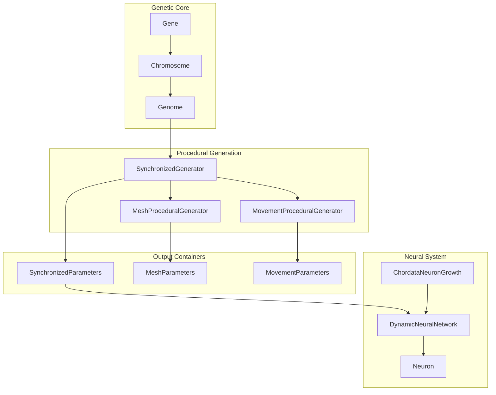
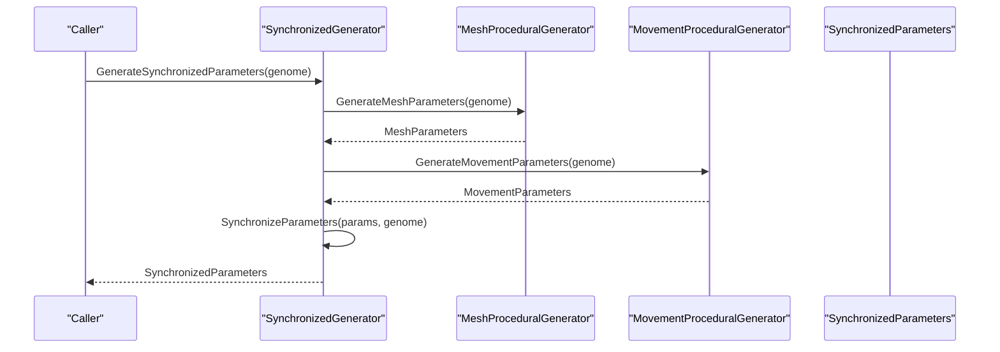
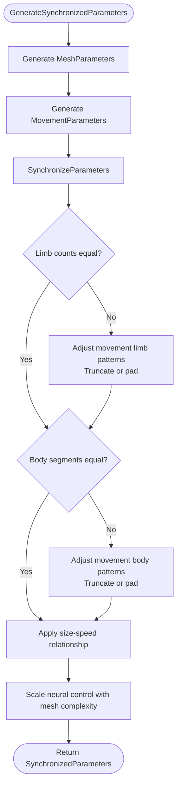
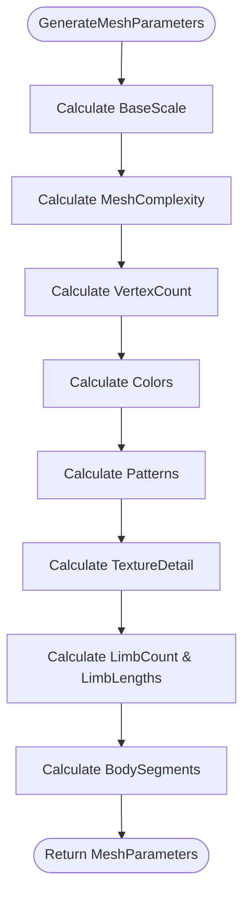
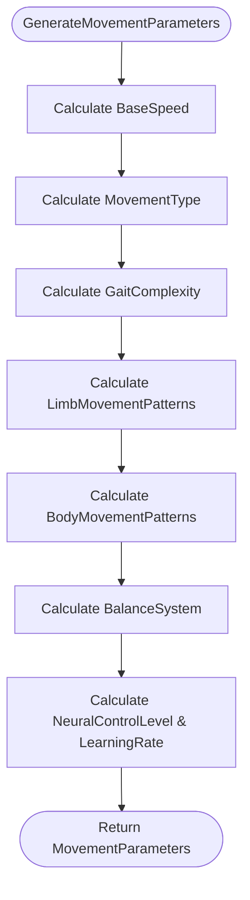
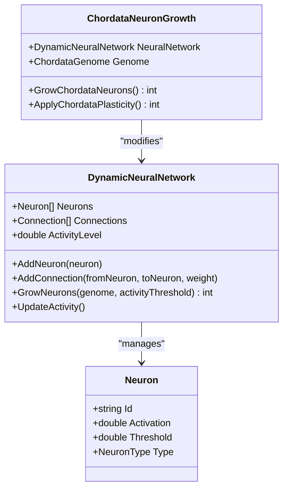
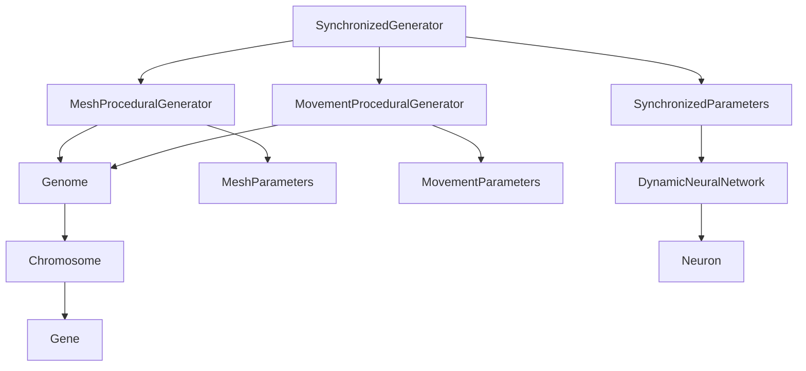

# Synchronized Generator

<cite>
**Referenced Files in This Document**
- [SynchronizedGenerator.cs](file://GeneticsGame/Procedural/SynchronizedGenerator.cs)
- [MeshProceduralGenerator.cs](file://GeneticsGame/Procedural/Mesh/MeshProceduralGenerator.cs)
- [MovementProceduralGenerator.cs](file://GeneticsGame/Procedural/Movement/MovementProceduralGenerator.cs)
- [Genome.cs](file://GeneticsGame/Core/Genome.cs)
- [Chromosome.cs](file://GeneticsGame/Core/Chromosome.cs)
- [Gene.cs](file://GeneticsGame/Core/Gene.cs)
- [DynamicNeuralNetwork.cs](file://GeneticsGame/Systems/DynamicNeuralNetwork.cs)
- [Neuron.cs](file://GeneticsGame/Systems/Neuron.cs)
- [ChordataNeuronGrowth.cs](file://GeneticsGame/Phyla/Chordata/ChordataNeuronGrowth.cs)
- [GeneticsCore.cs](file://GeneticsGame/Core/GeneticsCore.cs)
</cite>

## Table of Contents
1. [Introduction](#introduction)
2. [Project Structure](#project-structure)
3. [Core Components](#core-components)
4. [Architecture Overview](#architecture-overview)
5. [Detailed Component Analysis](#detailed-component-analysis)
6. [Dependency Analysis](#dependency-analysis)
7. [Performance Considerations](#performance-considerations)
8. [Troubleshooting Guide](#troubleshooting-guide)
9. [Conclusion](#conclusion)

## Introduction
This document explains the SynchronizedGenerator component that ensures mesh and movement systems remain coordinated and anatomically consistent. It details the core synchronization logic that aligns limb counts, body segments, and movement patterns with corresponding mesh parameters. It documents the parameter adjustment algorithms that maintain biological plausibility, such as size-speed relationships and neural control scaling. It covers the SynchronizedParameters class structure and how it serves as a container for coordinated genetic expression. It includes examples showing how genetic variations trigger parameter adjustments and maintain system balance. It explains the integration with MeshProceduralGenerator and MovementProceduralGenerator, and how the synchronization process prevents anatomical inconsistencies. Finally, it addresses the mathematical relationships used for parameter scaling and the constraints that ensure realistic creature designs.

## Project Structure
The SynchronizedGenerator sits at the intersection of procedural mesh generation and movement generation, orchestrating synchronization between two subsystems driven by the same genetic blueprint. The core genetic model (Genome, Chromosome, Gene) provides the basis for both mesh and movement trait calculations. The neural system (DynamicNeuralNetwork, Neuron) integrates with movement parameters to reflect neural control scaling.

**Diagram sources**
- [SynchronizedGenerator.cs:1-141](file://GeneticsGame/Procedural/SynchronizedGenerator.cs#L1-L141)
- [MeshProceduralGenerator.cs:1-365](file://GeneticsGame/Procedural/Mesh/MeshProceduralGenerator.cs#L1-L365)
- [MovementProceduralGenerator.cs:1-389](file://GeneticsGame/Procedural/Movement/MovementProceduralGenerator.cs#L1-L389)
- [Genome.cs:1-190](file://GeneticsGame/Core/Genome.cs#L1-L190)
- [Chromosome.cs:1-146](file://GeneticsGame/Core/Chromosome.cs#L1-L146)
- [Gene.cs:1-93](file://GeneticsGame/Core/Gene.cs#L1-L93)
- [DynamicNeuralNetwork.cs:1-116](file://GeneticsGame/Systems/DynamicNeuralNetwork.cs#L1-L116)
- [Neuron.cs:1-70](file://GeneticsGame/Systems/Neuron.cs#L1-L70)
- [ChordataNeuronGrowth.cs:1-216](file://GeneticsGame/Phyla/Chordata/ChordataNeuronGrowth.cs#L1-L216)

**Section sources**
- [SynchronizedGenerator.cs:1-141](file://GeneticsGame/Procedural/SynchronizedGenerator.cs#L1-L141)
- [MeshProceduralGenerator.cs:1-365](file://GeneticsGame/Procedural/Mesh/MeshProceduralGenerator.cs#L1-L365)
- [MovementProceduralGenerator.cs:1-389](file://GeneticsGame/Procedural/Movement/MovementProceduralGenerator.cs#L1-L389)
- [Genome.cs:1-190](file://GeneticsGame/Core/Genome.cs#L1-L190)
- [Chromosome.cs:1-146](file://GeneticsGame/Core/Chromosome.cs#L1-L146)
- [Gene.cs:1-93](file://GeneticsGame/Core/Gene.cs#L1-L93)
- [DynamicNeuralNetwork.cs:1-116](file://GeneticsGame/Systems/DynamicNeuralNetwork.cs#L1-L116)
- [Neuron.cs:1-70](file://GeneticsGame/Systems/Neuron.cs#L1-L70)
- [ChordataNeuronGrowth.cs:1-216](file://GeneticsGame/Phyla/Chordata/ChordataNeuronGrowth.cs#L1-L216)

## Core Components
- SynchronizedGenerator: Orchestrates generation of mesh and movement parameters from a genome, then synchronizes them to ensure anatomical and functional consistency.
- MeshProceduralGenerator: Translates genetic data into mesh parameters (scale, complexity, vertex count, colors, patterns, textures, limb count, limb lengths, body segments).
- MovementProceduralGenerator: Translates genetic data into movement parameters (base speed, movement type, gait complexity, limb/body movement patterns, balance system, neural control level, learning rate).
- SynchronizedParameters: Container holding both MeshParameters and MovementParameters, enabling cross-system adjustments.
- Genetic Core: Genome, Chromosome, Gene define the hereditary blueprint and influence both mesh and movement traits.

Key responsibilities:
- Ensure limb counts and body segments match between mesh and movement.
- Enforce size-speed relationships to maintain biological plausibility.
- Scale neural control with mesh complexity.
- Prevent anatomical inconsistencies by adjusting movement patterns to match mesh structure.

**Section sources**
- [SynchronizedGenerator.cs:35-124](file://GeneticsGame/Procedural/SynchronizedGenerator.cs#L35-L124)
- [MeshProceduralGenerator.cs:16-36](file://GeneticsGame/Procedural/Mesh/MeshProceduralGenerator.cs#L16-L36)
- [MovementProceduralGenerator.cs:16-35](file://GeneticsGame/Procedural/Movement/MovementProceduralGenerator.cs#L16-L35)
- [SynchronizedParameters.cs:130-141](file://GeneticsGame/Procedural/SynchronizedGenerator.cs#L130-L141)

## Architecture Overview
The SynchronizedGenerator acts as a coordinator between MeshProceduralGenerator and MovementProceduralGenerator. It first generates independent parameter sets from the same genome, then applies synchronization rules to ensure consistency across anatomical and behavioral outputs.

**Diagram sources**
- [SynchronizedGenerator.cs:35-49](file://GeneticsGame/Procedural/SynchronizedGenerator.cs#L35-L49)
- [MeshProceduralGenerator.cs:16](file://GeneticsGame/Procedural/Mesh/MeshProceduralGenerator.cs#L16)
- [MovementProceduralGenerator.cs:16](file://GeneticsGame/Procedural/Movement/MovementProceduralGenerator.cs#L16)

## Detailed Component Analysis

### SynchronizedGenerator
Responsibilities:
- Instantiate mesh and movement generators.
- Generate independent parameter sets from a genome.
- Synchronize parameters to ensure:
  - Limb counts match between mesh and movement.
  - Body segments match between mesh and movement.
  - Size-speed relationships maintain biological plausibility.
  - Neural control scales with mesh complexity.

Synchronization logic highlights:
- Limb count alignment: Truncate or pad movement limb patterns to match mesh limb count.
- Body segment alignment: Truncate or pad movement body patterns to match mesh body segments.
- Size-speed relationship: Adjust movement speed inversely with mesh scale when extremes are detected; proportionally scale within reasonable bounds.
- Neural control scaling: Increase movement neural control level based on mesh complexity, clamped to a safe range.

**Diagram sources**
- [SynchronizedGenerator.cs:35-124](file://GeneticsGame/Procedural/SynchronizedGenerator.cs#L35-L124)

**Section sources**
- [SynchronizedGenerator.cs:35-124](file://GeneticsGame/Procedural/SynchronizedGenerator.cs#L35-L124)

### MeshProceduralGenerator
Responsibilities:
- Convert genetic data into mesh parameters.
- Base scale derived from average gene expression levels.
- Mesh complexity proportional to chromosome and gene counts.
- Vertex count scaled by complexity.
- Colors, patterns, and texture detail determined by specific genes.
- Limb count and lengths determined by limb-related genes.
- Body segments determined by segmentation genes.

Mathematical relationships:
- Base scale: Derived from average expression level mapped to a constrained range.
- Complexity: Proportional to chromosome count and gene count per chromosome, capped to a fixed range.
- Vertex count: Base value multiplied by complexity.
- Limb count: Constrained integer mapping of expression level for limb-related genes.
- Body segments: Constrained integer mapping of expression level for segmentation genes.

**Diagram sources**
- [MeshProceduralGenerator.cs:16-36](file://GeneticsGame/Procedural/Mesh/MeshProceduralGenerator.cs#L16-L36)
- [MeshProceduralGenerator.cs:43-279](file://GeneticsGame/Procedural/Mesh/MeshProceduralGenerator.cs#L43-L279)

**Section sources**
- [MeshProceduralGenerator.cs:16-36](file://GeneticsGame/Procedural/Mesh/MeshProceduralGenerator.cs#L16-L36)
- [MeshProceduralGenerator.cs:43-279](file://GeneticsGame/Procedural/Mesh/MeshProceduralGenerator.cs#L43-L279)

### MovementProceduralGenerator
Responsibilities:
- Convert genetic data into movement parameters.
- Base speed derived from neural activity and muscle-related genes.
- Movement type determined by dominance of walking/flying/swimming/crawling genes.
- Gait complexity proportional to coordination/balance genes.
- Limb movement patterns depend on limb-related gene expression levels.
- Body movement patterns depend on body/spine flexibility genes.
- Balance system type depends on inner ear, visual, or proprioceptive genes.
- Neural control level and learning rate derived from control-related genes.

Mathematical relationships:
- Base speed: Average of neural and muscle expression levels mapped to a constrained range.
- Gait complexity: Constrained integer mapping of expression level for coordination genes.
- Limb/body movement patterns: Deterministic thresholds based on expression levels.
- Balance system: Dominance of gene categories determines system type.
- Neural control level: Constrained expression level for control-related genes.
- Learning rate: Constrained expression level for learning/adaptation genes.

**Diagram sources**
- [MovementProceduralGenerator.cs:16-35](file://GeneticsGame/Procedural/Movement/MovementProceduralGenerator.cs#L16-L35)
- [MovementProceduralGenerator.cs:42-295](file://GeneticsGame/Procedural/Movement/MovementProceduralGenerator.cs#L42-L295)

**Section sources**
- [MovementProceduralGenerator.cs:16-35](file://GeneticsGame/Procedural/Movement/MovementProceduralGenerator.cs#L16-L35)
- [MovementProceduralGenerator.cs:42-295](file://GeneticsGame/Procedural/Movement/MovementProceduralGenerator.cs#L42-L295)

### SynchronizedParameters
Structure:
- MeshParameters: Encapsulates mesh traits (scale, complexity, vertex count, colors, patterns, textures, limb count, limb lengths, body segments).
- MovementParameters: Encapsulates movement traits (base speed, movement type, gait complexity, limb/body movement patterns, balance system, neural control level, learning rate).

Purpose:
- Provides a unified container for synchronized outputs.
- Enables downstream systems (e.g., neural growth) to consume both mesh and movement parameters consistently.

**Section sources**
- [SynchronizedGenerator.cs:130-141](file://GeneticsGame/Procedural/SynchronizedGenerator.cs#L130-L141)

### Genetic Expression and Neural Control Scaling
Integration with the neural system:
- DynamicNeuralNetwork grows neurons based on genome-derived growth potential and activity thresholds.
- Neuron types are influenced by epistatic interactions and specific gene categories.
- ChordataNeuronGrowth applies phyla-specific growth rules and plasticity mechanisms.

How synchronization affects neural control:
- Movement neural control level is adjusted upward based on mesh complexity, ensuring more complex meshes drive more sophisticated neural control.

**Diagram sources**
- [DynamicNeuralNetwork.cs:9-116](file://GeneticsGame/Systems/DynamicNeuralNetwork.cs#L9-L116)
- [Neuron.cs:7-70](file://GeneticsGame/Systems/Neuron.cs#L7-L70)
- [ChordataNeuronGrowth.cs:9-216](file://GeneticsGame/Phyla/Chordata/ChordataNeuronGrowth.cs#L9-L216)

**Section sources**
- [DynamicNeuralNetwork.cs:63-99](file://GeneticsGame/Systems/DynamicNeuralNetwork.cs#L63-L99)
- [ChordataNeuronGrowth.cs:36-103](file://GeneticsGame/Phyla/Chordata/ChordataNeuronGrowth.cs#L36-L103)

## Dependency Analysis
- SynchronizedGenerator depends on:
  - MeshProceduralGenerator for mesh parameters.
  - MovementProceduralGenerator for movement parameters.
  - Genome for shared genetic input.
- MeshProceduralGenerator depends on:
  - Chromosome and Gene for trait computation.
- MovementProceduralGenerator depends on:
  - Chromosome and Gene for trait computation.
- SynchronizedParameters aggregates:
  - MeshParameters and MovementParameters.
- DynamicNeuralNetwork and ChordataNeuronGrowth integrate movement neural control with genetic expression.

**Diagram sources**
- [SynchronizedGenerator.cs:14-28](file://GeneticsGame/Procedural/SynchronizedGenerator.cs#L14-L28)
- [MeshProceduralGenerator.cs:16](file://GeneticsGame/Procedural/Mesh/MeshProceduralGenerator.cs#L16)
- [MovementProceduralGenerator.cs:16](file://GeneticsGame/Procedural/Movement/MovementProceduralGenerator.cs#L16)
- [Genome.cs:19](file://GeneticsGame/Core/Genome.cs#L19)
- [Chromosome.cs:19](file://GeneticsGame/Core/Chromosome.cs#L19)
- [Gene.cs:14-57](file://GeneticsGame/Core/Gene.cs#L14-L57)
- [SynchronizedParameters.cs:135-141](file://GeneticsGame/Procedural/SynchronizedGenerator.cs#L135-L141)

**Section sources**
- [SynchronizedGenerator.cs:14-28](file://GeneticsGame/Procedural/SynchronizedGenerator.cs#L14-L28)
- [MeshProceduralGenerator.cs:16](file://GeneticsGame/Procedural/Mesh/MeshProceduralGenerator.cs#L16)
- [MovementProceduralGenerator.cs:16](file://GeneticsGame/Procedural/Movement/MovementProceduralGenerator.cs#L16)
- [Genome.cs:19](file://GeneticsGame/Core/Genome.cs#L19)
- [Chromosome.cs:19](file://GeneticsGame/Core/Chromosome.cs#L19)
- [Gene.cs:14-57](file://GeneticsGame/Core/Gene.cs#L14-L57)
- [SynchronizedParameters.cs:135-141](file://GeneticsGame/Procedural/SynchronizedGenerator.cs#L135-L141)

## Performance Considerations
- Parameter generation is linear in the number of genes and chromosomes, with minimal overhead.
- Synchronization operations involve simple list truncation/padding and bounded mathematical adjustments, keeping complexity low.
- Neural growth is capped by configuration limits to prevent uncontrolled expansion.
- Recommendations:
  - Prefer batch processing when generating many creatures.
  - Cache intermediate results where repeated access occurs.
  - Monitor ActivityLevel thresholds to limit unnecessary neural growth iterations.

[No sources needed since this section provides general guidance]

## Troubleshooting Guide
Common issues and resolutions:
- Limb count mismatch:
  - Symptom: Movement patterns list does not match mesh limb count.
  - Resolution: Ensure SynchronizeParameters adjusts movement limb patterns to match mesh limb count.
- Body segment mismatch:
  - Symptom: Movement body patterns list does not match mesh body segments.
  - Resolution: Ensure SynchronizeParameters adjusts movement body patterns to match mesh body segments.
- Unreasonable speed for size:
  - Symptom: Very large creatures move too fast or very small creatures move too slow.
  - Resolution: Verify size-speed relationship logic and bounds checks.
- Neural control too low/high:
  - Symptom: Movement lacks responsiveness or becomes overly complex.
  - Resolution: Confirm neural control scaling with mesh complexity and clamp values.

**Section sources**
- [SynchronizedGenerator.cs:57-124](file://GeneticsGame/Procedural/SynchronizedGenerator.cs#L57-L124)

## Conclusion
The SynchronizedGenerator ensures that mesh and movement systems remain anatomically and functionally coherent by enforcing strict synchronization rules. It aligns limb counts and body segments, enforces biologically plausible size-speed relationships, and scales neural control with mesh complexity. By integrating with MeshProceduralGenerator and MovementProceduralGenerator, it maintains system balance while allowing genetic variations to drive diverse yet realistic creature designs. The SynchronizedParameters container provides a unified interface for downstream systems, including the neural network, ensuring coordinated development across all aspects of creature generation.