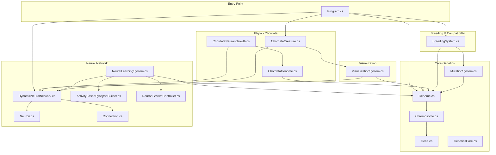
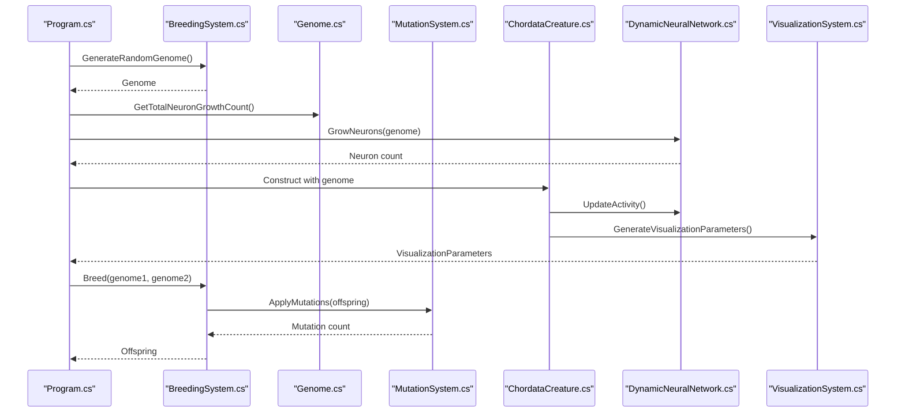
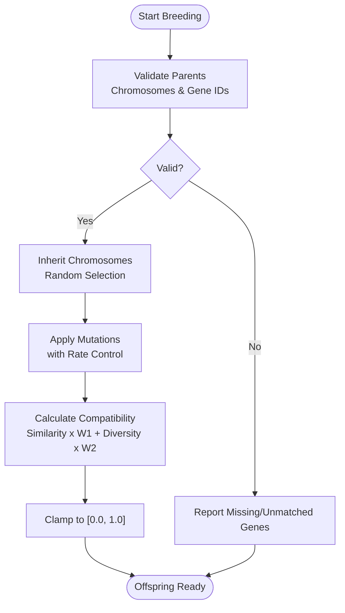
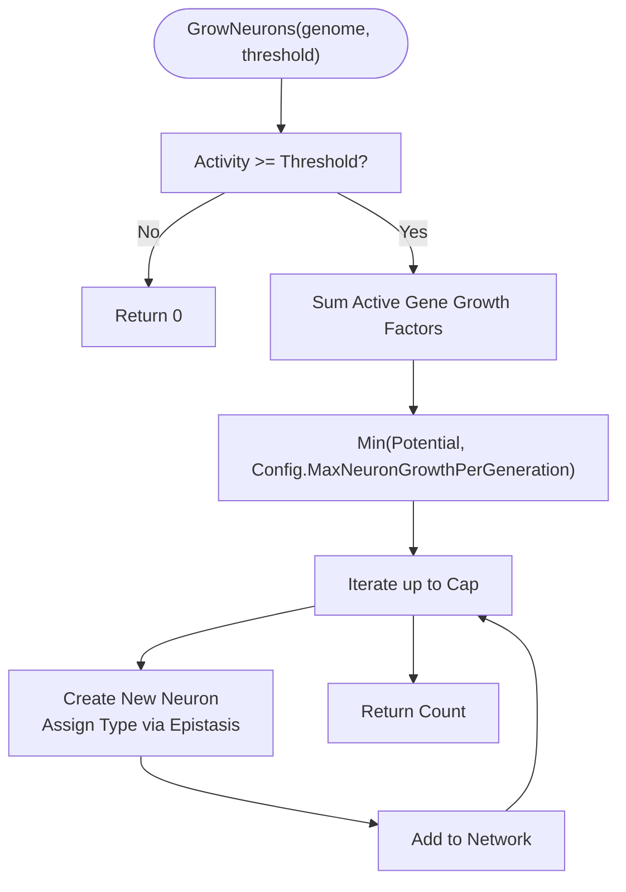
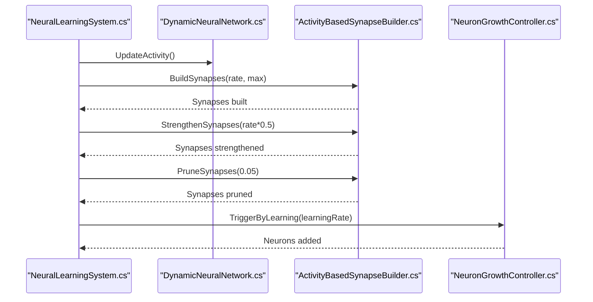
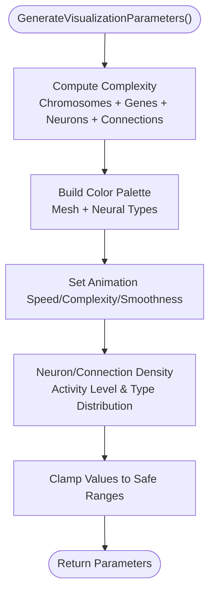
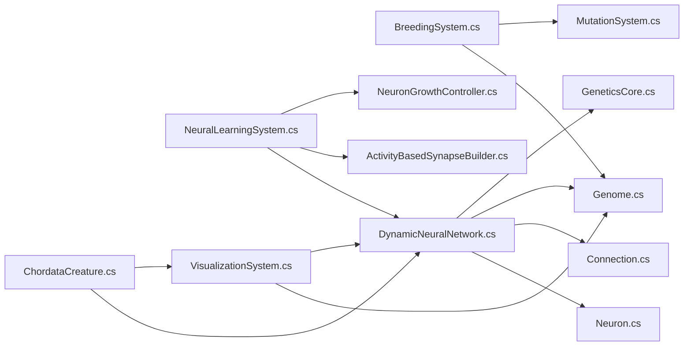

# Troubleshooting and FAQ

<cite>
**Referenced Files in This Document**
- [GeneticsCore.cs](file://GeneticsGame/Core/GeneticsCore.cs)
- [Genome.cs](file://GeneticsGame/Core/Genome.cs)
- [Chromosome.cs](file://GeneticsGame/Core/Chromosome.cs)
- [Gene.cs](file://GeneticsGame/Core/Gene.cs)
- [MutationSystem.cs](file://GeneticsGame/Core/MutationSystem.cs)
- [DynamicNeuralNetwork.cs](file://GeneticsGame/Systems/DynamicNeuralNetwork.cs)
- [Neuron.cs](file://GeneticsGame/Systems/Neuron.cs)
- [Connection.cs](file://GeneticsGame/Systems/Connection.cs)
- [NeuralLearningSystem.cs](file://GeneticsGame/Systems/NeuralLearningSystem.cs)
- [ActivityBasedSynapseBuilder.cs](file://GeneticsGame/Systems/ActivityBasedSynapseBuilder.cs)
- [NeuronGrowthController.cs](file://GeneticsGame/Systems/NeuronGrowthController.cs)
- [BreedingSystem.cs](file://GeneticsGame/Systems/BreedingSystem.cs)
- [VisualizationSystem.cs](file://GeneticsGame/Systems/VisualizationSystem.cs)
- [ChordataCreature.cs](file://GeneticsGame/Phyla/Chordata/ChordataCreature.cs)
- [ChordataGenome.cs](file://GeneticsGame/Phyla/Chordata/ChordataGenome.cs)
- [ChordataNeuronGrowth.cs](file://GeneticsGame/Phyla/Chordata/ChordataNeuronGrowth.cs)
- [Program.cs](file://GeneticsGame/Program.cs)
</cite>

## Table of Contents
1. [Introduction](#introduction)
2. [Project Structure](#project-structure)
3. [Core Components](#core-components)
4. [Architecture Overview](#architecture-overview)
5. [Detailed Component Analysis](#detailed-component-analysis)
6. [Dependency Analysis](#dependency-analysis)
7. [Performance Considerations](#performance-considerations)
8. [Troubleshooting Guide](#troubleshooting-guide)
9. [Conclusion](#conclusion)
10. [Appendices](#appendices)

## Introduction
This Troubleshooting and FAQ guide focuses on the 3D Genetics system, covering common issues in genetic manipulation, neural network initialization, and procedural generation. It provides solutions for performance bottlenecks in large population simulations, memory management pitfalls, and visualization rendering problems. It also documents debugging strategies for genetic inheritance anomalies, neural development issues, and compatibility scoring inconsistencies, along with guidance on extending the system and optimizing experiments.

## Project Structure
The system is organized around core genetics primitives (Genome, Chromosome, Gene), mutation and breeding systems, a dynamic neural network, and phyla-specific extensions (Chordata). Procedural generation and visualization tie genetic and neural data into runtime creature behavior and rendering.

**Diagram sources**
- [Genome.cs:1-190](file://GeneticsGame/Core/Genome.cs#L1-L190)
- [Chromosome.cs:1-146](file://GeneticsGame/Core/Chromosome.cs#L1-L146)
- [Gene.cs:1-93](file://GeneticsGame/Core/Gene.cs#L1-L93)
- [MutationSystem.cs:1-137](file://GeneticsGame/Core/MutationSystem.cs#L1-L137)
- [GeneticsCore.cs:1-21](file://GeneticsGame/Core/GeneticsCore.cs#L1-L21)
- [DynamicNeuralNetwork.cs:1-116](file://GeneticsGame/Systems/DynamicNeuralNetwork.cs#L1-L116)
- [Neuron.cs:1-70](file://GeneticsGame/Systems/Neuron.cs#L1-L70)
- [Connection.cs:1-35](file://GeneticsGame/Systems/Connection.cs#L1-L35)
- [NeuralLearningSystem.cs:1-122](file://GeneticsGame/Systems/NeuralLearningSystem.cs#L1-L122)
- [ActivityBasedSynapseBuilder.cs](file://GeneticsGame/Systems/ActivityBasedSynapseBuilder.cs)
- [NeuronGrowthController.cs](file://GeneticsGame/Systems/NeuronGrowthController.cs)
- [BreedingSystem.cs:1-182](file://GeneticsGame/Systems/BreedingSystem.cs#L1-L182)
- [ChordataCreature.cs:1-133](file://GeneticsGame/Phyla/Chordata/ChordataCreature.cs#L1-L133)
- [ChordataGenome.cs:1-134](file://GeneticsGame/Phyla/Chordata/ChordataGenome.cs#L1-L134)
- [ChordataNeuronGrowth.cs:1-216](file://GeneticsGame/Phyla/Chordata/ChordataNeuronGrowth.cs#L1-L216)
- [VisualizationSystem.cs:1-239](file://GeneticsGame/Systems/VisualizationSystem.cs#L1-L239)
- [Program.cs:1-58](file://GeneticsGame/Program.cs#L1-L58)

**Section sources**
- [Program.cs:1-58](file://GeneticsGame/Program.cs#L1-L58)

## Core Components
- GeneticsCore: Central configuration for mutation rates, neuron growth limits, and neural activity thresholds.
- Genome: Multi-chromosome blueprint with epistatic interaction calculation, mutation application, and breeding logic.
- Chromosome: Structural mutation support (deletion, duplication, inversion, translocation).
- Gene: Expression level, mutation rate, neuron growth factor, activity state, and epistatic partners.
- MutationSystem: Point, structural, epigenetic, and neural-specific mutations with tunable rates.
- DynamicNeuralNetwork: Runtime neuron addition, activity tracking, and growth constrained by genetic potential.
- Neuron/Connection: Neural primitives with types and weighted connections.
- NeuralLearningSystem: Activity-based synapse building, strengthening, pruning, and learning-driven growth.
- BreedingSystem: Compatibility scoring (similarity/diversity), random genome generation, and offspring creation.
- VisualizationSystem: Complexity, color palette, animation, and neural visualization parameters.
- Chordata variants: Specialized genome and neuron growth tailored to vertebrate-like traits.

**Section sources**
- [GeneticsCore.cs:1-21](file://GeneticsGame/Core/GeneticsCore.cs#L1-L21)
- [Genome.cs:1-190](file://GeneticsGame/Core/Genome.cs#L1-L190)
- [Chromosome.cs:1-146](file://GeneticsGame/Core/Chromosome.cs#L1-L146)
- [Gene.cs:1-93](file://GeneticsGame/Core/Gene.cs#L1-L93)
- [MutationSystem.cs:1-137](file://GeneticsGame/Core/MutationSystem.cs#L1-L137)
- [DynamicNeuralNetwork.cs:1-116](file://GeneticsGame/Systems/DynamicNeuralNetwork.cs#L1-L116)
- [Neuron.cs:1-70](file://GeneticsGame/Systems/Neuron.cs#L1-L70)
- [Connection.cs:1-35](file://GeneticsGame/Systems/Connection.cs#L1-L35)
- [NeuralLearningSystem.cs:1-122](file://GeneticsGame/Systems/NeuralLearningSystem.cs#L1-L122)
- [BreedingSystem.cs:1-182](file://GeneticsGame/Systems/BreedingSystem.cs#L1-L182)
- [VisualizationSystem.cs:1-239](file://GeneticsGame/Systems/VisualizationSystem.cs#L1-L239)
- [ChordataGenome.cs:1-134](file://GeneticsGame/Phyla/Chordata/ChordataGenome.cs#L1-L134)
- [ChordataNeuronGrowth.cs:1-216](file://GeneticsGame/Phyla/Chordata/ChordataNeuronGrowth.cs#L1-L216)

## Architecture Overview
The system integrates genetics and neural dynamics with procedural generation and visualization. Breeding produces offspring with inherited traits and mutations. The neural network grows dynamically based on genetic potential and activity thresholds. Learning systems adapt connectivity and growth. Visualization consumes genome and neural network state to produce renderable parameters.

**Diagram sources**
- [Program.cs:1-58](file://GeneticsGame/Program.cs#L1-L58)
- [BreedingSystem.cs:1-182](file://GeneticsGame/Systems/BreedingSystem.cs#L1-L182)
- [Genome.cs:1-190](file://GeneticsGame/Core/Genome.cs#L1-L190)
- [MutationSystem.cs:1-137](file://GeneticsGame/Core/MutationSystem.cs#L1-L137)
- [DynamicNeuralNetwork.cs:1-116](file://GeneticsGame/Systems/DynamicNeuralNetwork.cs#L1-L116)
- [ChordataCreature.cs:1-133](file://GeneticsGame/Phyla/Chordata/ChordataCreature.cs#L1-L133)
- [VisualizationSystem.cs:1-239](file://GeneticsGame/Systems/VisualizationSystem.cs#L1-L239)

## Detailed Component Analysis

### Genetic Manipulation and Breeding
Common issues:
- Inheritance anomalies due to mismatched chromosome counts or missing gene IDs.
- Unexpected mutation loads causing instability.
- Compatibility scores skewed by extreme similarity or diversity.

Debugging steps:
- Verify chromosome pairing and gene ID presence across parents before breeding.
- Inspect mutation rates and their scaling factors for point vs structural vs epigenetic mutations.
- Confirm compatibility weights and normalization bounds.

**Diagram sources**
- [BreedingSystem.cs:1-182](file://GeneticsGame/Systems/BreedingSystem.cs#L1-L182)
- [Genome.cs:127-190](file://GeneticsGame/Core/Genome.cs#L127-L190)
- [MutationSystem.cs:1-137](file://GeneticsGame/Core/MutationSystem.cs#L1-L137)

**Section sources**
- [BreedingSystem.cs:1-182](file://GeneticsGame/Systems/BreedingSystem.cs#L1-L182)
- [Genome.cs:127-190](file://GeneticsGame/Core/Genome.cs#L127-L190)
- [MutationSystem.cs:1-137](file://GeneticsGame/Core/MutationSystem.cs#L1-L137)

### Neural Network Initialization and Growth
Common issues:
- Activity threshold prevents neuron growth despite sufficient genetic potential.
- Unbounded growth or inconsistent growth caps.
- Misclassification of neuron types impacting behavior.

Debugging steps:
- Check activity level computation and threshold comparisons.
- Validate growth cap against genetic potential and configuration limits.
- Review epistatic interaction scoring for neuron-type assignment.

**Diagram sources**
- [DynamicNeuralNetwork.cs:63-99](file://GeneticsGame/Systems/DynamicNeuralNetwork.cs#L63-L99)
- [GeneticsCore.cs:14-19](file://GeneticsGame/Core/GeneticsCore.cs#L14-L19)
- [Genome.cs:72-107](file://GeneticsGame/Core/Genome.cs#L72-L107)

**Section sources**
- [DynamicNeuralNetwork.cs:1-116](file://GeneticsGame/Systems/DynamicNeuralNetwork.cs#L1-L116)
- [GeneticsCore.cs:1-21](file://GeneticsGame/Core/GeneticsCore.cs#L1-L21)
- [Genome.cs:72-107](file://GeneticsGame/Core/Genome.cs#L72-L107)

### Learning and Synaptogenesis
Common issues:
- Over-pruning or under-strengthening synapses leading to brittle or rigid networks.
- Learning rate decay not applied consistently across cycles.
- Environment/task adaptation not aligning with neuron type distribution.

Debugging steps:
- Confirm synapse builder parameters and pruning/strengthening ratios.
- Ensure decreasing learning rate over time cycles.
- Align adaptation scoring with neuron type counts and genetic constraints.

**Diagram sources**
- [NeuralLearningSystem.cs:1-122](file://GeneticsGame/Systems/NeuralLearningSystem.cs#L1-L122)
- [ActivityBasedSynapseBuilder.cs](file://GeneticsGame/Systems/ActivityBasedSynapseBuilder.cs)
- [NeuronGrowthController.cs](file://GeneticsGame/Systems/NeuronGrowthController.cs)
- [DynamicNeuralNetwork.cs:1-116](file://GeneticsGame/Systems/DynamicNeuralNetwork.cs#L1-L116)

**Section sources**
- [NeuralLearningSystem.cs:1-122](file://GeneticsGame/Systems/NeuralLearningSystem.cs#L1-L122)

### Visualization Rendering Problems
Common issues:
- Excessive visual complexity overwhelming renderers.
- Inconsistent color palettes or animation parameters.
- Incorrect neuron/connection densities in visualization.

Debugging steps:
- Clamp complexity level and animation parameters to safe ranges.
- Ensure color palette includes neuron-specific hues when neural network exists.
- Validate neuron type distribution aggregation and normalization.

**Diagram sources**
- [VisualizationSystem.cs:36-165](file://GeneticsGame/Systems/VisualizationSystem.cs#L36-L165)

**Section sources**
- [VisualizationSystem.cs:1-239](file://GeneticsGame/Systems/VisualizationSystem.cs#L1-L239)

### Chordata-Specific Extensions
Common issues:
- Trait-based growth not reflected in neuron counts.
- Plasticity rules not triggered by trait thresholds.
- Misalignment between genome traits and neuron types.

Debugging steps:
- Verify trait extraction and thresholds for spine length, brain size, synapse density, vision acuity, hearing range, and balance system.
- Ensure neuron type assignment matches trait dominance.
- Confirm plasticity modifications only apply to relevant neuron groups.

**Section sources**
- [ChordataGenome.cs:1-134](file://GeneticsGame/Phyla/Chordata/ChordataGenome.cs#L1-L134)
- [ChordataNeuronGrowth.cs:1-216](file://GeneticsGame/Phyla/Chordata/ChordataNeuronGrowth.cs#L1-L216)

## Dependency Analysis
Key dependencies:
- BreedingSystem depends on Genome and MutationSystem.
- DynamicNeuralNetwork depends on Neuron and Connection; growth depends on Genome epistasis and GeneticsCore config.
- NeuralLearningSystem orchestrates ActivityBasedSynapseBuilder and NeuronGrowthController.
- ChordataCreature composes DynamicNeuralNetwork and VisualizationSystem; uses SynchronizedGenerator indirectly via procedural parameters.
- VisualizationSystem consumes Genome and DynamicNeuralNetwork.

**Diagram sources**
- [BreedingSystem.cs:1-182](file://GeneticsGame/Systems/BreedingSystem.cs#L1-L182)
- [Genome.cs:1-190](file://GeneticsGame/Core/Genome.cs#L1-L190)
- [MutationSystem.cs:1-137](file://GeneticsGame/Core/MutationSystem.cs#L1-L137)
- [DynamicNeuralNetwork.cs:1-116](file://GeneticsGame/Systems/DynamicNeuralNetwork.cs#L1-L116)
- [Neuron.cs:1-70](file://GeneticsGame/Systems/Neuron.cs#L1-L70)
- [Connection.cs:1-35](file://GeneticsGame/Systems/Connection.cs#L1-L35)
- [NeuralLearningSystem.cs:1-122](file://GeneticsGame/Systems/NeuralLearningSystem.cs#L1-L122)
- [ChordataCreature.cs:1-133](file://GeneticsGame/Phyla/Chordata/ChordataCreature.cs#L1-L133)
- [VisualizationSystem.cs:1-239](file://GeneticsGame/Systems/VisualizationSystem.cs#L1-L239)
- [GeneticsCore.cs:1-21](file://GeneticsGame/Core/GeneticsCore.cs#L1-L21)

**Section sources**
- [BreedingSystem.cs:1-182](file://GeneticsGame/Systems/BreedingSystem.cs#L1-L182)
- [Genome.cs:1-190](file://GeneticsGame/Core/Genome.cs#L1-L190)
- [MutationSystem.cs:1-137](file://GeneticsGame/Core/MutationSystem.cs#L1-L137)
- [DynamicNeuralNetwork.cs:1-116](file://GeneticsGame/Systems/DynamicNeuralNetwork.cs#L1-L116)
- [NeuralLearningSystem.cs:1-122](file://GeneticsGame/Systems/NeuralLearningSystem.cs#L1-L122)
- [VisualizationSystem.cs:1-239](file://GeneticsGame/Systems/VisualizationSystem.cs#L1-L239)
- [GeneticsCore.cs:1-21](file://GeneticsGame/Core/GeneticsCore.cs#L1-L21)

## Performance Considerations
- Mutation scaling: Structural and epigenetic mutations are scaled down relative to point mutations to reduce overhead.
- Growth caps: Neuron growth is capped per generation by configuration to prevent exponential blow-ups.
- Activity-driven growth: Growth only occurs when activity exceeds thresholds, reducing unnecessary allocations.
- Learning cycles: Decreasing learning rate over time reduces redundant updates.
- Visualization clamping: Complexity and animation parameters are clamped to avoid heavy rendering workloads.

Recommendations:
- Monitor total neuron and connection counts; consider periodic pruning or consolidation.
- Tune mutation rates per scenario; lower rates for stable runs, higher for exploration.
- Batch updates for large populations; stagger learning and growth events across generations.
- Use visualization complexity levels to dynamically adjust rendering detail.

[No sources needed since this section provides general guidance]

## Troubleshooting Guide

### Genetic Manipulation
- Problem: Offspring lacks expected traits.
  - Cause: Missing gene IDs in one parent or mismatched chromosome indices.
  - Fix: Validate gene IDs and chromosome pairing before breeding; ensure consistent IDs across genomes.
  - Section sources
    - [Genome.cs:127-190](file://GeneticsGame/Core/Genome.cs#L127-L190)
    - [BreedingSystem.cs:1-182](file://GeneticsGame/Systems/BreedingSystem.cs#L1-L182)

- Problem: Too many mutations causing instability.
  - Cause: High mutation rates or excessive structural mutations.
  - Fix: Reduce base mutation rate; verify scaling factors for structural and epigenetic mutations.
  - Section sources
    - [MutationSystem.cs:1-137](file://GeneticsGame/Core/MutationSystem.cs#L1-L137)
    - [GeneticsCore.cs:14-19](file://GeneticsGame/Core/GeneticsCore.cs#L14-L19)

- Problem: Compatibility score is unexpectedly low/high.
  - Cause: Extreme similarity or diversity skew; unbalanced weights.
  - Fix: Reassess similarity/diversity calculations and weights; normalize to [0,1].
  - Section sources
    - [BreedingSystem.cs:35-128](file://GeneticsGame/Systems/BreedingSystem.cs#L35-L128)

### Neural Network Initialization and Development
- Problem: Neurons not growing despite high potential.
  - Cause: Activity below threshold or growth cap too low.
  - Fix: Check activity computation and threshold; increase cap if needed.
  - Section sources
    - [DynamicNeuralNetwork.cs:63-99](file://GeneticsGame/Systems/DynamicNeuralNetwork.cs#L63-L99)
    - [GeneticsCore.cs:14-19](file://GeneticsGame/Core/GeneticsCore.cs#L14-L19)

- Problem: Excessive neuron growth causing performance issues.
  - Cause: High expression levels and growth factors without caps.
  - Fix: Enforce growth cap and limit per-generation additions.
  - Section sources
    - [DynamicNeuralNetwork.cs:63-99](file://GeneticsGame/Systems/DynamicNeuralNetwork.cs#L63-L99)

- Problem: Misclassified neuron types.
  - Cause: Epistatic interaction thresholds not met or misapplied.
  - Fix: Review epistatic scoring and type assignment logic.
  - Section sources
    - [DynamicNeuralNetwork.cs:85-92](file://GeneticsGame/Systems/DynamicNeuralNetwork.cs#L85-L92)

### Learning and Adaptation
- Problem: Learning has no effect on connectivity.
  - Cause: Synapse builder parameters too low or pruning dominates.
  - Fix: Adjust build/strengthen/prune ratios; ensure learning rate schedule.
  - Section sources
    - [NeuralLearningSystem.cs:37-57](file://GeneticsGame/Systems/NeuralLearningSystem.cs#L37-L57)

- Problem: Environment adaptation scores are flat.
  - Cause: Lack of matching neuron types or insufficient genetic growth capacity.
  - Fix: Ensure relevant neuron types exist; scale adaptation by growth capacity.
  - Section sources
    - [NeuralLearningSystem.cs:65-103](file://GeneticsGame/Systems/NeuralLearningSystem.cs#L65-L103)

### Visualization Rendering
- Problem: Renderer struggles with complex creatures.
  - Cause: High complexity and dense connections.
  - Fix: Clamp complexity and animation parameters; reduce color palette size.
  - Section sources
    - [VisualizationSystem.cs:59-130](file://GeneticsGame/Systems/VisualizationSystem.cs#L59-L130)

- Problem: Inconsistent animation speed.
  - Cause: Activity level drift or unbounded scaling.
  - Fix: Normalize activity and clamp animation speed and complexity.
  - Section sources
    - [VisualizationSystem.cs:115-130](file://GeneticsGame/Systems/VisualizationSystem.cs#L115-L130)

### Chordata-Specific Issues
- Problem: No specialized neurons appear.
  - Cause: Trait thresholds not met for vision/hearing/balance.
  - Fix: Raise trait expression levels or adjust thresholds.
  - Section sources
    - [ChordataNeuronGrowth.cs:78-100](file://GeneticsGame/Phyla/Chordata/ChordataNeuronGrowth.cs#L78-L100)

- Problem: Plasticity rules not taking effect.
  - Cause: Trait checks not satisfied or wrong neuron groups targeted.
  - Fix: Verify trait presence and neuron type filtering.
  - Section sources
    - [ChordataNeuronGrowth.cs:109-135](file://GeneticsGame/Phyla/Chordata/ChordataNeuronGrowth.cs#L109-L135)

### Common Misconceptions
- Evolutionary principles: Mutations are not directed; they accumulate probabilistically. Use selection pressure (compatibility scoring) and environmental tasks to steer evolution.
- Neural behavior: Activity thresholds and epistasis determine growth, not raw expression alone. Ensure activity is computed and thresholds are tuned.
- Visualization: Complexity must be bounded; heavy scenes degrade performance. Use visualization parameters to manage rendering load.

[No sources needed since this section provides general guidance]

### Configuration and Environment
- Ensure mutation rates and growth caps are set appropriately for simulation goals.
- Validate that environment-specific factors and task requirements are present for adaptation scoring.
- For large-scale simulations, consider distributed or batched processing and periodic checkpointing.

[No sources needed since this section provides general guidance]

### Extending the System
- Adding new phyla: Subclass Genome and implement phyla-specific traits and growth rules similar to ChordataGenome and ChordataNeuronGrowth.
- New neuron types: Extend NeuronType and update growth/type assignment logic.
- Procedural generation: Integrate new generators with SynchronizedGenerator and update creature parameter updates.
- Visualization enhancements: Expand VisualizationParameters and related classes to support new metrics.

[No sources needed since this section provides general guidance]

## Conclusion
This guide consolidates practical troubleshooting and best practices for the 3D Genetics system. By validating inheritance, tuning mutation and growth parameters, ensuring activity-driven development, and managing visualization complexity, most issues can be resolved efficiently. For advanced scenarios, leverage learning systems, environment adaptation, and phyla-specific extensions while maintaining performance and stability.

[No sources needed since this section summarizes without analyzing specific files]

## Appendices

### Quick Reference: Key Parameters and Methods
- GeneticsCore.Config: DefaultMutationRate, MaxNeuronGrowthPerGeneration, NeuralActivityThreshold
- Genome.Breed: Inheritance and gene copying
- MutationSystem.ApplyMutations: Point, structural, epigenetic, neural-specific
- DynamicNeuralNetwork.GrowNeurons: Activity-dependent growth with caps
- NeuralLearningSystem.Learn/LearnOverTime: Synaptogenesis and growth over cycles
- BreedingSystem.CalculateCompatibility: Similarity/diversity scoring
- VisualizationSystem.GenerateVisualizationParameters: Complexity, colors, animation, neural params

**Section sources**
- [GeneticsCore.cs:14-19](file://GeneticsGame/Core/GeneticsCore.cs#L14-L19)
- [Genome.cs:127-190](file://GeneticsGame/Core/Genome.cs#L127-L190)
- [MutationSystem.cs:17-137](file://GeneticsGame/Core/MutationSystem.cs#L17-L137)
- [DynamicNeuralNetwork.cs:63-99](file://GeneticsGame/Systems/DynamicNeuralNetwork.cs#L63-L99)
- [NeuralLearningSystem.cs:37-122](file://GeneticsGame/Systems/NeuralLearningSystem.cs#L37-L122)
- [BreedingSystem.cs:35-128](file://GeneticsGame/Systems/BreedingSystem.cs#L35-L128)
- [VisualizationSystem.cs:36-165](file://GeneticsGame/Systems/VisualizationSystem.cs#L36-L165)