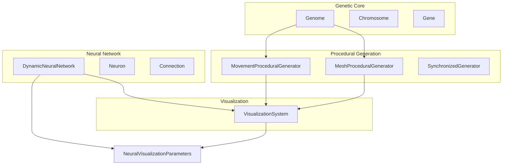
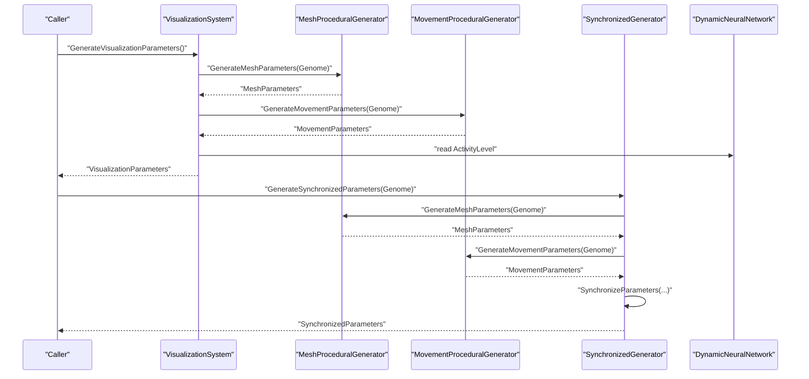
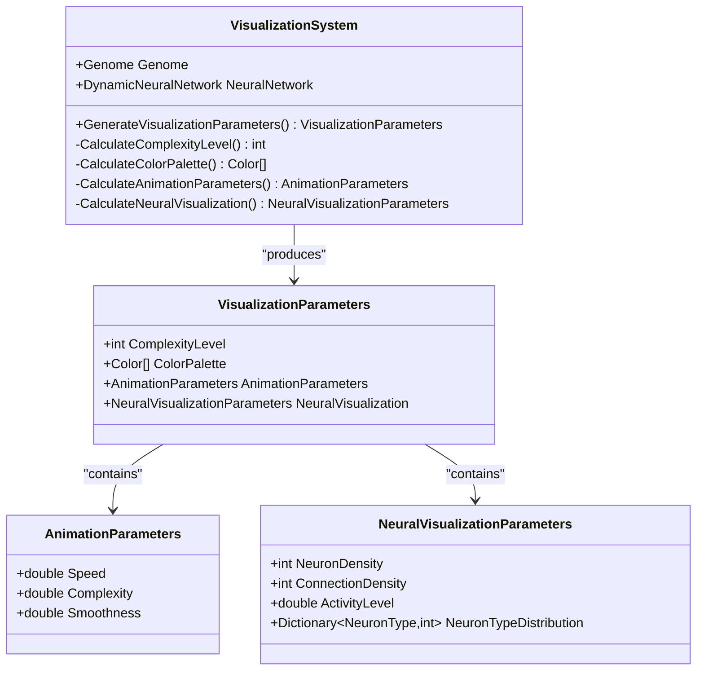
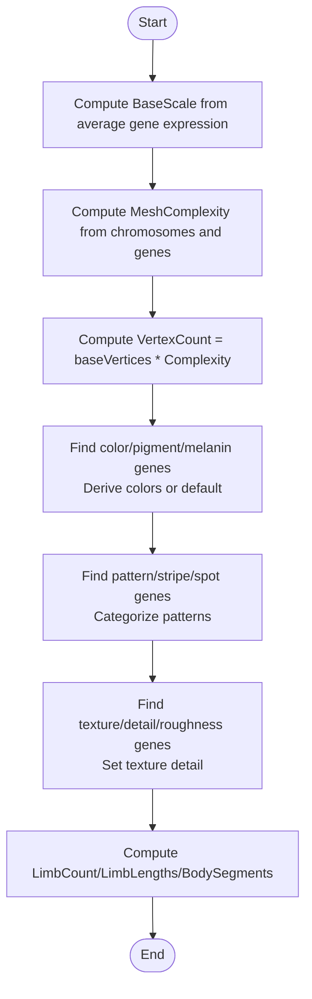
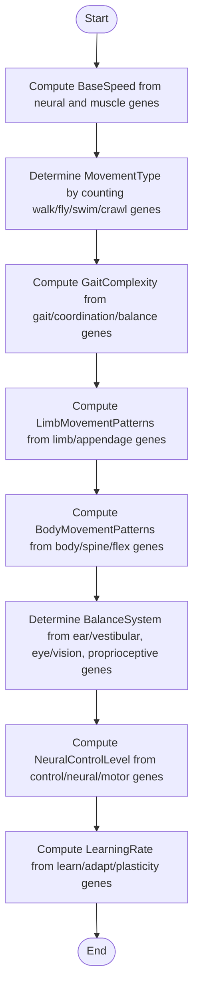
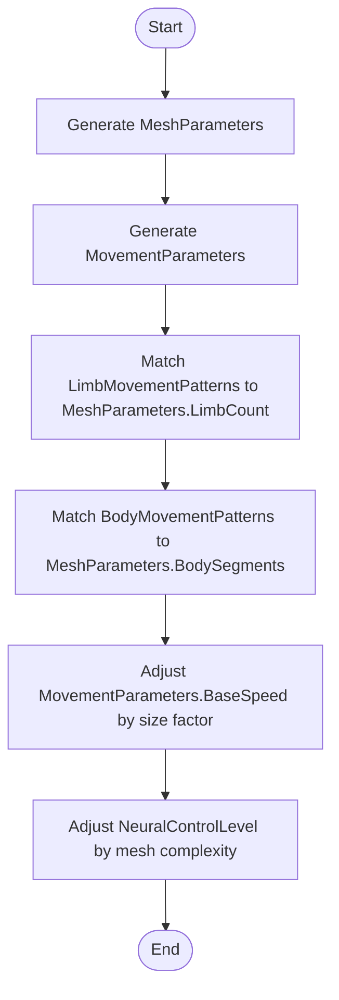
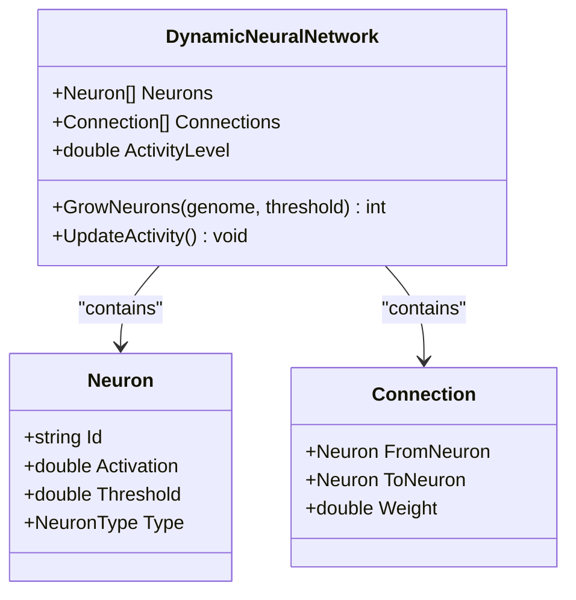
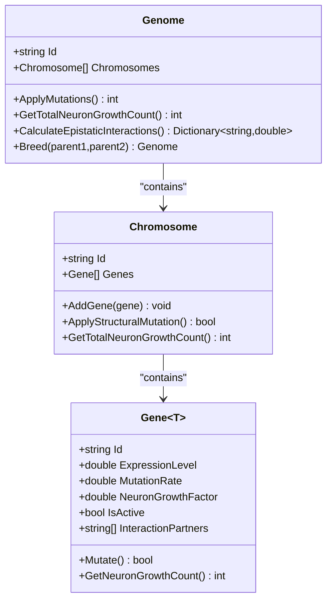
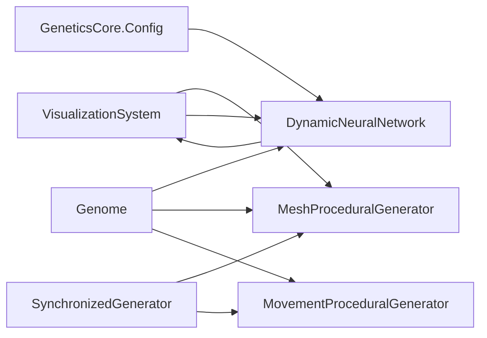

# Visualization and Rendering

<cite>
**Referenced Files in This Document**
- [VisualizationSystem.cs](file://GeneticsGame/Systems/VisualizationSystem.cs)
- [MeshProceduralGenerator.cs](file://GeneticsGame/Procedural/Mesh/MeshProceduralGenerator.cs)
- [MovementProceduralGenerator.cs](file://GeneticsGame/Procedural/Movement/MovementProceduralGenerator.cs)
- [SynchronizedGenerator.cs](file://GeneticsGame/Procedural/SynchronizedGenerator.cs)
- [DynamicNeuralNetwork.cs](file://GeneticsGame/Systems/DynamicNeuralNetwork.cs)
- [Neuron.cs](file://GeneticsGame/Systems/Neuron.cs)
- [Connection.cs](file://GeneticsGame/Systems/Connection.cs)
- [Genome.cs](file://GeneticsGame/Core/Genome.cs)
- [Chromosome.cs](file://GeneticsGame/Core/Chromosome.cs)
- [Gene.cs](file://GeneticsGame/Core/Gene.cs)
- [ChordataGenome.cs](file://GeneticsGame/Phyla/Chordata/ChordataGenome.cs)
- [ArthropodaGenome.cs](file://GeneticsGame/Phyla/Arthropoda/ArthropodaGenome.cs)
- [GeneticsCore.cs](file://GeneticsGame/Core/GeneticsCore.cs)
- [Program.cs](file://GeneticsGame/Program.cs)
</cite>

## Table of Contents
1. [Introduction](#introduction)
2. [Project Structure](#project-structure)
3. [Core Components](#core-components)
4. [Architecture Overview](#architecture-overview)
5. [Detailed Component Analysis](#detailed-component-analysis)
6. [Dependency Analysis](#dependency-analysis)
7. [Performance Considerations](#performance-considerations)
8. [Troubleshooting Guide](#troubleshooting-guide)
9. [Conclusion](#conclusion)

## Introduction
This document explains the visualization and rendering system that transforms genetic data into visual representations of virtual organisms. It covers how genetic information is mapped to 3D visual models, color palettes, and coordinated 3D animations. It also documents how neural activity influences movement visualization, how the system integrates with external 3D rendering engines conceptually, and how data flows from genetic sequences to visual output. Examples illustrate how genetic mutations affect appearance, how neural activity affects movement visualization, and how the system handles complex morphological changes. Finally, it provides performance considerations, optimization techniques for large populations, and extension points for custom visualization backends.

## Project Structure
The visualization pipeline spans three primary areas:
- Genetic core: Chromosome, Gene, and Genome define the hereditary blueprint and epistatic interactions.
- Procedural generation: MeshProceduralGenerator converts genes into 3D mesh parameters; MovementProceduralGenerator converts genes into locomotion parameters; SynchronizedGenerator ensures mesh and movement remain consistent.
- Visualization system: VisualizationSystem orchestrates color palette generation, animation parameters, and neural visualization derived from genome and neural network state.

**Diagram sources**
- [Genome.cs:1-190](file://GeneticsGame/Core/Genome.cs#L1-L190)
- [Chromosome.cs:1-146](file://GeneticsGame/Core/Chromosome.cs#L1-L146)
- [Gene.cs:1-93](file://GeneticsGame/Core/Gene.cs#L1-L93)
- [MeshProceduralGenerator.cs:1-365](file://GeneticsGame/Procedural/Mesh/MeshProceduralGenerator.cs#L1-L365)
- [MovementProceduralGenerator.cs:1-389](file://GeneticsGame/Procedural/Movement/MovementProceduralGenerator.cs#L1-L389)
- [SynchronizedGenerator.cs:1-141](file://GeneticsGame/Procedural/SynchronizedGenerator.cs#L1-L141)
- [DynamicNeuralNetwork.cs:1-116](file://GeneticsGame/Systems/DynamicNeuralNetwork.cs#L1-L116)
- [Neuron.cs:1-70](file://GeneticsGame/Systems/Neuron.cs#L1-L70)
- [Connection.cs:1-35](file://GeneticsGame/Systems/Connection.cs#L1-L35)
- [VisualizationSystem.cs:1-239](file://GeneticsGame/Systems/VisualizationSystem.cs#L1-L239)

**Section sources**
- [Program.cs:11-57](file://GeneticsGame/Program.cs#L11-L57)

## Core Components
- VisualizationSystem: Aggregates and computes visualization parameters from a genome and a neural network. It calculates complexity, color palette, animation parameters, and neural visualization metrics.
- MeshProceduralGenerator: Translates genetic traits into 3D mesh parameters (scale, complexity, vertex count, colors, patterns, textures, limb counts, segment counts).
- MovementProceduralGenerator: Translates genetic traits into movement parameters (base speed, movement type, gait complexity, limb/body movement patterns, balance system, neural control level, learning rate).
- SynchronizedGenerator: Ensures mesh and movement parameters are consistent and proportionally balanced (e.g., size-speed trade-offs, matching limb/body counts).
- DynamicNeuralNetwork and Neuron/Connection: Provide neural activity level and structure used by visualization and movement systems.

**Section sources**
- [VisualizationSystem.cs:36-165](file://GeneticsGame/Systems/VisualizationSystem.cs#L36-L165)
- [MeshProceduralGenerator.cs:16-36](file://GeneticsGame/Procedural/Mesh/MeshProceduralGenerator.cs#L16-L36)
- [MovementProceduralGenerator.cs:16-35](file://GeneticsGame/Procedural/Movement/MovementProceduralGenerator.cs#L16-L35)
- [SynchronizedGenerator.cs:35-124](file://GeneticsGame/Procedural/SynchronizedGenerator.cs#L35-L124)
- [DynamicNeuralNetwork.cs:24-115](file://GeneticsGame/Systems/DynamicNeuralNetwork.cs#L24-L115)

## Architecture Overview
The system follows a data-driven pipeline:
- Input: Genome and DynamicNeuralNetwork
- Mesh pipeline: MeshProceduralGenerator → MeshParameters
- Movement pipeline: MovementProceduralGenerator → MovementParameters
- Synchronization: SynchronizedGenerator aligns mesh and movement parameters
- Visualization orchestration: VisualizationSystem aggregates MeshParameters, MovementParameters, and neural state into VisualizationParameters

**Diagram sources**
- [VisualizationSystem.cs:36-53](file://GeneticsGame/Systems/VisualizationSystem.cs#L36-L53)
- [MeshProceduralGenerator.cs:16-36](file://GeneticsGame/Procedural/Mesh/MeshProceduralGenerator.cs#L16-L36)
- [MovementProceduralGenerator.cs:16-35](file://GeneticsGame/Procedural/Movement/MovementProceduralGenerator.cs#L16-L35)
- [SynchronizedGenerator.cs:35-49](file://GeneticsGame/Procedural/SynchronizedGenerator.cs#L35-L49)
- [DynamicNeuralNetwork.cs:24](file://GeneticsGame/Systems/DynamicNeuralNetwork.cs#L24)

## Detailed Component Analysis

### VisualizationSystem
Responsibilities:
- Compute visual complexity from genome and neural network sizes
- Build a color palette from mesh parameters plus neural-specific colors
- Derive animation parameters from neural activity and connectivity
- Summarize neural visualization metrics (density, activity, type distribution)

Key calculations:
- ComplexityLevel: combines chromosome count, gene count, neuron count, and connection count
- ColorPalette: starts with mesh-derived colors and adds distinct colors for visual, learning, mutation, and movement neurons when applicable
- AnimationParameters: speed proportional to neural activity; complexity from connection count; smoothness influenced by neuron thresholds
- NeuralVisualizationParameters: neuron/connection density, activity level, and type distribution

**Diagram sources**
- [VisualizationSystem.cs:9-165](file://GeneticsGame/Systems/VisualizationSystem.cs#L9-L165)

**Section sources**
- [VisualizationSystem.cs:36-165](file://GeneticsGame/Systems/VisualizationSystem.cs#L36-L165)

### MeshProceduralGenerator
Responsibilities:
- Convert genetic traits into 3D mesh parameters
- Determine base scale, complexity, vertex count
- Compute color scheme, patterns, texture detail
- Derive structural features: limb count/lengths, body segments

Color palette generation:
- If color/pigment/melanin genes are present, derive colors from their expression levels
- Otherwise, fallback to default colors

Pattern generation:
- Based on pattern/stripe/spot genes, categorize into striped, spotted, mottled, or solid

Complexity and vertex scaling:
- Complexity increases with chromosome and gene counts
- Vertex count scales linearly with complexity

**Diagram sources**
- [MeshProceduralGenerator.cs:16-280](file://GeneticsGame/Procedural/Mesh/MeshProceduralGenerator.cs#L16-L280)

**Section sources**
- [MeshProceduralGenerator.cs:16-280](file://GeneticsGame/Procedural/Mesh/MeshProceduralGenerator.cs#L16-L280)

### MovementProceduralGenerator
Responsibilities:
- Translate genetic traits into locomotion parameters
- Determine movement type (Walking, Flying, Swimming, Crawling)
- Compute gait complexity, limb/body movement patterns
- Assess balance system (InnerEar, Visual, Proprioceptive)
- Estimate neural control level and learning rate

Speed calculation:
- Combines average neural activity and average muscle-related expression
- Maps to a speed range with bounds

Patterns and segments:
- Limb movement patterns depend on limb/appendage gene expression levels
- Body movement patterns depend on body/spine/flex genes

Balance system:
- Dominant balance system determined by counts of ear/vestibular, eye/vision, and proprioceptive genes

Neural control and learning:
- Control level bounded by neural/motor genes
- Learning rate scaled from learn/adapt/plasticity genes

**Diagram sources**
- [MovementProceduralGenerator.cs:16-295](file://GeneticsGame/Procedural/Movement/MovementProceduralGenerator.cs#L16-L295)

**Section sources**
- [MovementProceduralGenerator.cs:16-295](file://GeneticsGame/Procedural/Movement/MovementProceduralGenerator.cs#L16-L295)

### SynchronizedGenerator
Responsibilities:
- Generate mesh and movement parameters independently
- Synchronize parameters to maintain biological plausibility
- Align limb counts and body segments
- Enforce size-speed relationships and neural control adjustments

Synchronization logic:
- Match movement limb patterns to mesh limb count
- Match movement body patterns to mesh body segments
- Adjust movement speed inversely with size when oversized, proportionally when undersized
- Increase neural control level slightly with mesh complexity

**Diagram sources**
- [SynchronizedGenerator.cs:35-124](file://GeneticsGame/Procedural/SynchronizedGenerator.cs#L35-L124)

**Section sources**
- [SynchronizedGenerator.cs:35-124](file://GeneticsGame/Procedural/SynchronizedGenerator.cs#L35-L124)

### Neural Network Integration
DynamicNeuralNetwork:
- Maintains Neurons and Connections
- Computes ActivityLevel as the average neuron activation
- Grows neurons based on genome epistatic interactions and configured limits
- Supports neuron typing (General, Mutation, Learning, Movement, Visual)

Neuron and Connection:
- Neuron holds Id, Activation, Threshold, and Type
- Connection stores FromNeuron, ToNeuron, and Weight

VisualizationSystem leverages:
- ActivityLevel for animation speed
- Neuron/Connection counts for complexity/smoothness and neural visualization density
- NeuronType distribution for visualizing neural diversity

**Diagram sources**
- [DynamicNeuralNetwork.cs:9-116](file://GeneticsGame/Systems/DynamicNeuralNetwork.cs#L9-L116)
- [Neuron.cs:7-70](file://GeneticsGame/Systems/Neuron.cs#L7-L70)
- [Connection.cs:6-35](file://GeneticsGame/Systems/Connection.cs#L6-L35)

**Section sources**
- [DynamicNeuralNetwork.cs:24-99](file://GeneticsGame/Systems/DynamicNeuralNetwork.cs#L24-L99)
- [Neuron.cs:12-38](file://GeneticsGame/Systems/Neuron.cs#L12-L38)
- [Connection.cs:29-34](file://GeneticsGame/Systems/Connection.cs#L29-L34)

### Genetic Data Model
Genome, Chromosome, and Gene define the hereditary foundation:
- Genome: collection of Chromosomes; supports mutation, epistasis, and breeding
- Chromosome: collection of Genes with structural mutation support
- Gene: expression level, mutation rate, neuron growth factor, activity, and interaction partners

These drive:
- Neural growth potential via Gene.GetNeuronGrowthCount()
- Epistatic interactions via Genome.CalculateEpistaticInteractions()
- Specialized genome variants (e.g., ChordataGenome, ArthropodaGenome) with phyla-specific genes and mutation rules

**Diagram sources**
- [Genome.cs:9-190](file://GeneticsGame/Core/Genome.cs#L9-L190)
- [Chromosome.cs:9-146](file://GeneticsGame/Core/Chromosome.cs#L9-L146)
- [Gene.cs:9-93](file://GeneticsGame/Core/Gene.cs#L9-L93)

**Section sources**
- [Genome.cs:44-107](file://GeneticsGame/Core/Genome.cs#L44-L107)
- [Chromosome.cs:44-145](file://GeneticsGame/Core/Chromosome.cs#L44-L145)
- [Gene.cs:63-92](file://GeneticsGame/Core/Gene.cs#L63-L92)

### Phyla-Specific Genomes
ChordataGenome and ArthropodaGenome demonstrate specialization:
- ChordataGenome: spine, neural, limb, sensory, and metabolic genes with elevated growth factors for brain and spine
- ArthropodaGenome: exoskeleton, segmentation, limb, neural, and metabolic genes with elevated growth factors for ganglia and molting

Both override mutation rules to increase mutation rates for phyla-relevant genes.

**Section sources**
- [ChordataGenome.cs:24-133](file://GeneticsGame/Phyla/Chordata/ChordataGenome.cs#L24-L133)
- [ArthropodaGenome.cs:24-133](file://GeneticsGame/Phyla/Arthropoda/ArthropodaGenome.cs#L24-L133)

## Dependency Analysis
- VisualizationSystem depends on:
  - MeshProceduralGenerator for mesh-derived colors and complexity
  - MovementProceduralGenerator indirectly via SynchronizedGenerator
  - DynamicNeuralNetwork for activity and structure metrics
- SynchronizedGenerator composes MeshProceduralGenerator and MovementProceduralGenerator and applies cross-system constraints
- Neural network growth is governed by genome epistasis and constrained by GeneticsCore.Config

**Diagram sources**
- [VisualizationSystem.cs:26-30](file://GeneticsGame/Systems/VisualizationSystem.cs#L26-L30)
- [SynchronizedGenerator.cs:24-28](file://GeneticsGame/Procedural/SynchronizedGenerator.cs#L24-L28)
- [DynamicNeuralNetwork.cs:63-71](file://GeneticsGame/Systems/DynamicNeuralNetwork.cs#L63-L71)
- [GeneticsCore.cs:14-19](file://GeneticsGame/Core/GeneticsCore.cs#L14-L19)

**Section sources**
- [VisualizationSystem.cs:26-30](file://GeneticsGame/Systems/VisualizationSystem.cs#L26-L30)
- [SynchronizedGenerator.cs:24-28](file://GeneticsGame/Procedural/SynchronizedGenerator.cs#L24-L28)
- [DynamicNeuralNetwork.cs:63-71](file://GeneticsGame/Systems/DynamicNeuralNetwork.cs#L63-L71)
- [GeneticsCore.cs:14-19](file://GeneticsGame/Core/GeneticsCore.cs#L14-L19)

## Performance Considerations
- Complexity-driven costs:
  - Mesh complexity and vertex count scale with chromosome/gene counts; limit maximum complexity per organism for rendering budgets
  - Neural network size grows with epistatic interactions; cap growth per generation using GeneticsCore.Config.MaxNeuronGrowthPerGeneration
- Computation hotspots:
  - Averages over neuron lists and mesh complexity calculations are O(n); cache where appropriate
  - Pattern and trait computations scan genes; pre-filter or index genes by category for repeated queries
- Real-time rendering:
  - Use LOD (level-of-detail) meshes based on ComplexityLevel
  - Batch color and pattern generation; reuse computed palettes when genes are unchanged
- Large populations:
  - Parallelize per-creature pipeline stages (mesh, movement, synchronization) across workers
  - Use object pooling for temporary lists during parameter computation
  - Defer expensive synchronization until needed (e.g., only when mesh/movement diverge)
- External engine integration:
  - Expose VisualizationParameters and SynchronizedParameters as intermediate formats for downstream 3D engines
  - Provide exporters for mesh topology, UVs, normals, and animation curves

[No sources needed since this section provides general guidance]

## Troubleshooting Guide
Common issues and remedies:
- Mismatched limb/body counts:
  - Symptom: Movement patterns do not match mesh counts
  - Fix: Use SynchronizedGenerator to reconcile counts and defaults
  - Section sources
    - [SynchronizedGenerator.cs:57-124](file://GeneticsGame/Procedural/SynchronizedGenerator.cs#L57-L124)

- Oversized/speedy creatures:
  - Symptom: Creatures appear too fast for their size
  - Fix: Apply size-speed relationship adjustments in synchronization
  - Section sources
    - [SynchronizedGenerator.cs:101-117](file://GeneticsGame/Procedural/SynchronizedGenerator.cs#L101-L117)

- Low animation smoothness:
  - Symptom: Jittery or abrupt motion
  - Cause: Low neuron threshold variance or low neural activity
  - Fix: Increase neural activity or neuron count; tune smoothness calculation inputs
  - Section sources
    - [VisualizationSystem.cs:126-127](file://GeneticsGame/Systems/VisualizationSystem.cs#L126-L127)

- Unexpected color palette:
  - Symptom: Missing expected colors
  - Cause: Lack of color/pigment/melanin genes
  - Fix: Ensure genome includes relevant genes or rely on defaults
  - Section sources
    - [MeshProceduralGenerator.cs:119-139](file://GeneticsGame/Procedural/Mesh/MeshProceduralGenerator.cs#L119-L139)

- Neural growth not occurring:
  - Symptom: No new neurons despite activity
  - Cause: Activity below threshold or growth caps exceeded
  - Fix: Verify ActivityLevel and MaxNeuronGrowthPerGeneration; check epistatic interactions
  - Section sources
    - [DynamicNeuralNetwork.cs:63-99](file://GeneticsGame/Systems/DynamicNeuralNetwork.cs#L63-L99)
    - [GeneticsCore.cs:17](file://GeneticsGame/Core/GeneticsCore.cs#L17)

## Conclusion
The visualization and rendering system maps genetic data to compelling 3D representations by combining procedural mesh generation, movement modeling, and neural dynamics. VisualizationSystem orchestrates color palettes, animation parameters, and neural visualization from genome and neural network inputs. SynchronizedGenerator ensures biomechanical consistency between mesh and movement. With careful attention to complexity, neural growth caps, and synchronization, the system supports real-time rendering and scalable population simulation. Extension points include custom mesh exporters, alternative 3D engines, and advanced animation blending for complex morphologies.